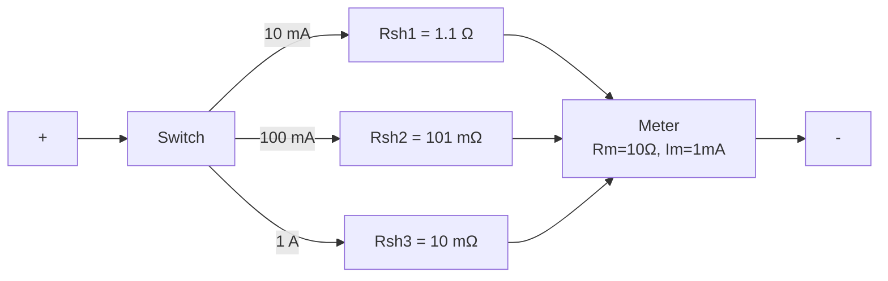
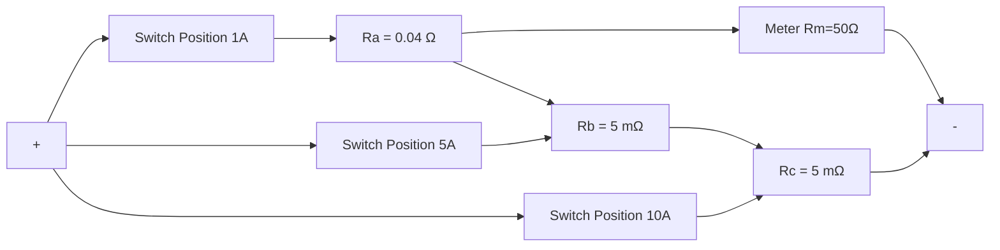
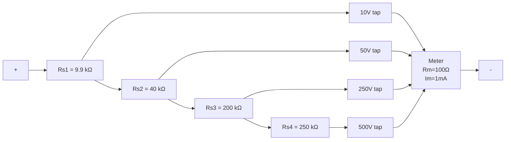
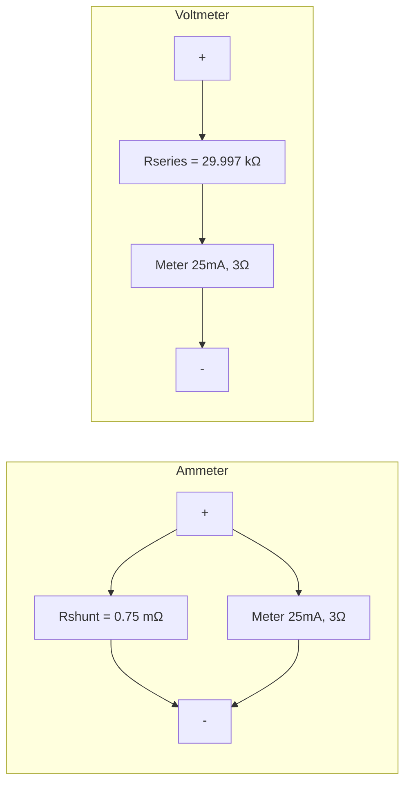

# ELE 3122 M&I — Tutorial 2 Solutions

**Course:** ELE 3122 Measurements & Instrumentation
**Tutorial Date:** 28.01.2025
**Topics:** PMMC Instruments, Ammeter & Voltmeter Design, Moving Iron Instruments, Electrodynamometer Instruments

---

## Exercise Questions

---

### Q1 — Multirange Ammeter: Direct Method

**Problem:** Design a multirange ammeter using the **direct method** for ranges: 10 mA, 100 mA, 1 A. The d'Arsonval meter has internal resistance $R_m = 10\ \Omega$ and full-scale current $I_m = 1\ \text{mA}$.

**Answer:** $R_{sh1} = 1.1\ \Omega$; $R_{sh2} = 101\ \text{m}\Omega$; $R_{sh3} = 10\ \text{m}\Omega$

#### Concept: Direct Method

In the direct method, each shunt resistor is independently calculated in parallel with the meter movement. The switching mechanism selects which shunt is active for the desired range. Each shunt is computed as:

$$R_{sh} = \frac{I_m \cdot R_m}{I - I_m}$$

#### Circuit Diagram

#### Solution

Given: $R_m = 10\ \Omega$, $I_m = 1\ \text{mA} = 0.001\ \text{A}$

**Range 1: $I_1 = 10\ \text{mA}$**

$$R_{sh1} = \frac{I_m \cdot R_m}{I_1 - I_m} = \frac{0.001 \times 10}{0.01 - 0.001} = \frac{0.01}{0.009} = \boxed{1.1\ \Omega}$$

**Range 2: $I_2 = 100\ \text{mA}$**

$$R_{sh2} = \frac{I_m \cdot R_m}{I_2 - I_m} = \frac{0.001 \times 10}{0.1 - 0.001} = \frac{0.01}{0.099} = \boxed{101\ \text{m}\Omega}$$

**Range 3: $I_3 = 1\ \text{A}$**

$$R_{sh3} = \frac{I_m \cdot R_m}{I_3 - I_m} = \frac{0.001 \times 10}{1 - 0.001} = \frac{0.01}{0.999} = \boxed{10\ \text{m}\Omega}$$

:::tip[Key Formula — Direct Method Shunt]
$$R_{sh} = \frac{I_m \cdot R_m}{I - I_m}$$
where $I_m$ is meter FSD current, $R_m$ is meter resistance, and $I$ is the desired range.
:::

---

### Q2 — Multirange Ammeter: Indirect Method (Ayrton/Ring Shunt)

**Problem:** Design by **indirect method** for current ranges 1 A, 5 A, and 10 A. PMMC meter has $R_m = 50\ \Omega$ and $I_m = 1\ \text{mA}$.

**Answer:** $R_a = 0.04\ \Omega$; $R_b = 5\ \text{m}\Omega$; $R_c = 5\ \text{m}\Omega$

#### Concept: Indirect (Ayrton/Ring) Shunt Method

In the Ayrton shunt, resistors $R_a$, $R_b$, $R_c$ are connected in series forming a ring. The switch taps select how much of this ring acts as the shunt. This avoids the problem of the meter being unprotected when the switch is between positions.

The design proceeds by first computing individual equivalent shunts for each range, then finding the differences:

$$r_{sh_n} = \frac{I_m \cdot R_m}{I_n - I_m}$$

Then:
- $R_a = r_{sh1} - r_{sh2}$
- $R_b = r_{sh2} - r_{sh3}$
- $R_c = r_{sh3}$

#### Circuit Diagram

#### Solution

Given: $R_m = 50\ \Omega$, $I_m = 1\ \text{mA}$

**Step 1: Compute individual shunts**

$$r_{sh1} = \frac{0.001 \times 50}{1 - 0.001} = \frac{0.05}{0.999} \approx 50.05\ \text{m}\Omega$$

$$r_{sh2} = \frac{0.001 \times 50}{5 - 0.001} = \frac{0.05}{4.999} \approx 10.00\ \text{m}\Omega$$

$$r_{sh3} = \frac{0.001 \times 50}{10 - 0.001} = \frac{0.05}{9.999} \approx 5.00\ \text{m}\Omega$$

**Step 2: Find ring resistances**

$$R_a = r_{sh1} - r_{sh2} = 50.05 - 10.00 = \boxed{40.05\ \text{m}\Omega \approx 0.04\ \Omega}$$

$$R_b = r_{sh2} - r_{sh3} = 10.00 - 5.00 = \boxed{5\ \text{m}\Omega}$$

$$R_c = r_{sh3} = \boxed{5\ \text{m}\Omega}$$

:::tip[Key Idea — Indirect vs Direct Method]
The indirect (Ayrton) method ensures the meter is always protected — even when the range switch is being changed, there is always some shunt resistance in the circuit. This is superior to the direct method where briefly opening a switch could damage the meter.
:::

---

### Q3 — Multirange DC Voltmeter: Indirect Method

**Problem:** A d'Arsonval meter with $R_m = 100\ \Omega$ and half-scale deflection current of $0.5\ \text{mA}$ is converted to a multirange DC voltmeter with ranges 10 V, 50 V, 250 V, and 500 V. Design the circuit.

**Answer:** $R_{s1} = 9.9\ \text{k}\Omega$; $R_{s2} = 40\ \text{k}\Omega$; $R_{s3} = 200\ \text{k}\Omega$; $R_{s4} = 250\ \text{k}\Omega$

#### Concept

"Half-scale deflection of 0.5 mA" means at half the scale the current is 0.5 mA, so **full-scale deflection current $I_m = 1\ \text{mA}$**.

In the indirect (series chained) voltmeter design, multiplier resistors are cascaded. The total series resistance for each range is cumulative, and individual sections are the differences:

$$R_{total\_n} = \frac{V_n}{I_m} - R_m$$

Then each section:
$$R_{s(n)} = R_{total\_n} - R_{total\_(n-1)}$$

#### Circuit Diagram

#### Solution

Given: $R_m = 100\ \Omega$, $I_m = 1\ \text{mA}$

**Cumulative multiplier resistance for each range:**

$$R_{total} = \frac{V}{I_m} - R_m$$

| Range | $V$ | $R_{total}$ | Section Resistor |
|-------|-----|-------------|-----------------|
| 10 V  | 10 V | $\frac{10}{0.001} - 100 = 9900\ \Omega$ | $R_{s1} = 9900\ \Omega = \mathbf{9.9\ k\Omega}$ |
| 50 V  | 50 V | $\frac{50}{0.001} - 100 = 49900\ \Omega$ | $R_{s2} = 49900 - 9900 = \mathbf{40\ k\Omega}$ |
| 250 V | 250 V | $\frac{250}{0.001} - 100 = 249900\ \Omega$ | $R_{s3} = 249900 - 49900 = \mathbf{200\ k\Omega}$ |
| 500 V | 500 V | $\frac{500}{0.001} - 100 = 499900\ \Omega$ | $R_{s4} = 499900 - 249900 = \mathbf{250\ k\Omega}$ |

:::tip[Key Formula — Series Multiplier]
$$R_{multiplier} = \frac{V_{range}}{I_{FSD}} - R_m$$
:::

---

### Q4 — PMMC Ammeter and Voltmeter from FSD Spec

**Problem:** PMMC coil FSD reading is 25 mA with 75 mV potential difference. Design for:
- (a) Ammeter: 0–100 A
- (b) Voltmeter: 0–750 V

**Answer:** (a) $R_{shunt} = 0.75\ \text{m}\Omega$; (b) $R_{series} = 29.997\ \text{k}\Omega$

#### Solution

First, find the meter internal resistance:
$$R_m = \frac{V_m}{I_m} = \frac{75\ \text{mV}}{25\ \text{mA}} = 3\ \Omega$$

**(a) Ammeter — Range 0 to 100 A:**

$$R_{shunt} = \frac{I_m \cdot R_m}{I - I_m} = \frac{0.025 \times 3}{100 - 0.025} = \frac{0.075}{99.975} \approx \boxed{0.75\ \text{m}\Omega}$$

**(b) Voltmeter — Range 0 to 750 V:**

$$R_{series} = \frac{V}{I_m} - R_m = \frac{750}{0.025} - 3 = 30000 - 3 = \boxed{29997\ \Omega \approx 29.997\ \text{k}\Omega}$$

#### Circuit Diagrams

---

### Q5 — PMMC Deflection Torque Calculation

**Problem:** Calculate the current to produce 100° deflection on a PMMC meter with:
- Coil length $l = 25\ \text{mm}$, width $w = 18\ \text{mm}$, $N = 60$ turns
- Magnetic flux density $B = 0.5\ \text{T}$
- Spring constant $K = 1.5 \times 10^{-6}\ \text{Nm/degree}$

**Answer:** $I = 11.11\ \text{mA}$

#### Concept

The PMMC operates on the principle of electromagnetic torque vs. spring restoring torque. At equilibrium:

$$T_{deflecting} = T_{controlling}$$
$$N \cdot B \cdot A \cdot I = K \cdot \theta$$

where $A = l \times w$ is the coil area.

#### Solution

**Coil area:**
$$A = l \times w = 25 \times 10^{-3} \times 18 \times 10^{-3} = 450 \times 10^{-6}\ \text{m}^2$$

**At equilibrium (deflection $\theta = 100°$):**
$$N \cdot B \cdot A \cdot I = K \cdot \theta$$

$$I = \frac{K \cdot \theta}{N \cdot B \cdot A} = \frac{1.5 \times 10^{-6} \times 100}{60 \times 0.5 \times 450 \times 10^{-6}}$$

$$I = \frac{1.5 \times 10^{-4}}{1.35 \times 10^{-2}} = \boxed{11.11\ \text{mA}}$$

:::tip[PMMC Torque Equation]
$$T_{deflecting} = NBIA$$
$$T_{controlling} = K\theta$$
At equilibrium: $NBIA = K\theta \Rightarrow I = \dfrac{K\theta}{NBA}$
:::

---

### Q6 — Moving Iron Ammeter: Variable Inductance

**Problem:** A moving coil ammeter has FSD of 90° at 1.5 A. The inductance is:
$$L = (200 + 40\theta - 4\theta^2 - \theta^3)\ \mu\text{H}$$
where $\theta$ is in radians. Find the deflection for $I = 1\ \text{A}$.

**Answer:** $\theta = 1.007\ \text{rad}$

#### Concept

For a **moving iron** instrument, the deflecting torque is:
$$T_d = \frac{I^2}{2} \cdot \frac{dL}{d\theta}$$

At equilibrium: $T_d = T_c = K \cdot \theta$

The spring constant $K$ is found from the full-scale condition, then applied to find $\theta$ for $I = 1\ \text{A}$.

#### Solution

**Step 1: Find $dL/d\theta$**

$$\frac{dL}{d\theta} = (40 - 8\theta - 3\theta^2)\ \mu\text{H/rad}$$

**Step 2: Find spring constant $K$ from FSD ($\theta_{FSD} = 90° = \frac{\pi}{2}\ \text{rad}$, $I = 1.5\ \text{A}$)**

At $\theta = \pi/2 \approx 1.5708\ \text{rad}$:
$$\frac{dL}{d\theta}\bigg|_{\theta=\pi/2} = 40 - 8(1.5708) - 3(1.5708)^2 = 40 - 12.566 - 7.402 = 20.032\ \mu\text{H/rad}$$

$$K = \frac{I_{FSD}^2}{2} \cdot \frac{1}{\theta_{FSD}} \cdot \frac{dL}{d\theta}\bigg|_{FSD}$$
$$K = \frac{(1.5)^2}{2} \cdot \frac{20.032 \times 10^{-6}}{1.5708} = \frac{1.125 \times 20.032 \times 10^{-6}}{1.5708} = 14.35 \times 10^{-6}\ \text{Nm/rad}$$

**Step 3: For $I = 1\ \text{A}$, solve equilibrium**

$$\frac{(1)^2}{2}(40 - 8\theta - 3\theta^2) \times 10^{-6} = 14.35 \times 10^{-6} \cdot \theta$$

$$0.5(40 - 8\theta - 3\theta^2) = 14.35\theta$$

$$20 - 4\theta - 1.5\theta^2 = 14.35\theta$$

$$1.5\theta^2 + 18.35\theta - 20 = 0$$

**Using the quadratic formula:**
$$\theta = \frac{-18.35 + \sqrt{(18.35)^2 + 4 \times 1.5 \times 20}}{2 \times 1.5} = \frac{-18.35 + \sqrt{336.72 + 120}}{3} = \frac{-18.35 + \sqrt{456.72}}{3}$$

$$\theta = \frac{-18.35 + 21.37}{3} = \frac{3.02}{3} = \boxed{1.007\ \text{rad}}$$

:::tip[Moving Iron Torque Formula]
$$T_d = \frac{I^2}{2} \cdot \frac{dL}{d\theta}$$
Note: Moving iron instruments respond to RMS current because of the $I^2$ term — they work on both AC and DC.
:::

---

### Q7 — PMMC vs. Electrodynamometer: % Error Analysis

**Problem:** An electrical machine circuit has:
- PMMC: $N = 100$ turns, $B = 0.2\ \text{Wb/m}^2$, coil area $A = 0.8\ \text{cm}^2$
- Electrodynamometer table: $dM/d\theta = 0.0005\ \text{H/degree}$ (uniform, derived from data)
- Same spring constant $K$ for both, same deflection $\theta$

Target design current: 3.5 A. Determine % error.

**Answer:** % error = −8.57%

#### Key Data Analysis

From the electrodynamometer table:

| Deflection (°) | 30 | 50 | 90 | 120 | 150 |
|---|---|---|---|---|---|
| M (H) | 0.015 | 0.025 | 0.045 | 0.060 | 0.075 |

Computing $dM/d\theta$ at each interval:
- 30° → 50°: $\frac{0.025 - 0.015}{20} = 0.0005\ \text{H/degree}$
- 50° → 90°: $\frac{0.045 - 0.025}{40} = 0.0005\ \text{H/degree}$
- 90° → 120°: $\frac{0.06 - 0.045}{30} = 0.0005\ \text{H/degree}$
- 120° → 150°: $\frac{0.075 - 0.06}{30} = 0.0005\ \text{H/degree}$

$\therefore dM/d\theta = 0.0005\ \text{H/degree}$ (constant — linear mutual inductance)

#### Torque Equilibrium for Both Instruments

Both instruments deflect to the same angle $\theta$ with the same spring constant $K$ carrying the same current $I$:

**PMMC torque balance:**
$$K\theta = N \cdot B \cdot A \cdot I \quad \cdots (1)$$

**Electrodynamometer torque balance:**
$$K\theta = I^2 \cdot \frac{dM}{d\theta} \quad \cdots (2)$$

Setting (1) = (2):
$$N \cdot B \cdot A \cdot I = I^2 \cdot \frac{dM}{d\theta}$$

$$I = \frac{N \cdot B \cdot A}{dM/d\theta}$$

#### Calculation

$$N \cdot B \cdot A = 100 \times 0.2 \times 0.8 \times 10^{-4} = 1.6 \times 10^{-3}\ \text{(SI)}$$

$$I_{measured} = \frac{1.6 \times 10^{-3}}{0.0005} = \frac{1.6 \times 10^{-3}}{5 \times 10^{-4}} = \boxed{3.2\ \text{A}}$$

(Note: Using $dM/d\theta$ in H/degree and $K$ in consistent units throughout.)

#### % Error

$$\%\ \text{error} = \frac{I_{measured} - I_{target}}{I_{target}} \times 100 = \frac{3.2 - 3.5}{3.5} \times 100 = \frac{-0.3}{3.5} \times 100 = \boxed{-8.57\%}$$

:::note[Interpretation]
The **negative error** means the circuit delivers less current than designed. The existing circuit produces only 3.2 A instead of the target 3.5 A — indicating the circuit resistance is higher than designed, or another design flaw exists.
:::

:::tip[Electrodynamometer Torque]
$$T_d = I_1 \cdot I_2 \cdot \frac{dM}{d\theta}$$
For ammeter configuration (series, $I_1 = I_2 = I$): $T_d = I^2 \cdot dM/d\theta$
Works on **both AC and DC** because of $I^2$ term.
:::

---

## Practice Questions

---

### PQ1 — Voltmeter Loading Effect

**Problem:** $R_1 = 140\ \text{k}\Omega$ and $R_2 = 100\ \text{k}\Omega$ in series across 12 V. A voltmeter (10 V range) measures voltage across $R_2$.
- (i) Actual voltage across $R_2$
- (ii) Measured with voltmeter sensitivity = 20 kΩ/V
- (iii) Measured with voltmeter sensitivity = 200 kΩ/V
- (iv) % error in both cases

**Answer:** (i) 5 V; (ii) 3.87 V; (iii) 4.86 V; (iv) −22.6%, −2.84%

#### Solution

**(i) Actual voltage (no meter loading):**

By voltage divider:
$$V_{R2(actual)} = 12 \times \frac{R_2}{R_1 + R_2} = 12 \times \frac{100}{140 + 100} = 12 \times \frac{100}{240} = \boxed{5\ \text{V}}$$

**(ii) Voltmeter with sensitivity 20 kΩ/V, on 10 V range:**

$$R_{meter} = \text{sensitivity} \times \text{range} = 20\ \text{k}\Omega/\text{V} \times 10\ \text{V} = 200\ \text{k}\Omega$$

$R_{meter}$ in parallel with $R_2 = 100\ \text{k}\Omega$:
$$R_{parallel} = \frac{200 \times 100}{200 + 100} = \frac{20000}{300} = 66.67\ \text{k}\Omega$$

$$V_{measured} = 12 \times \frac{66.67}{140 + 66.67} = 12 \times \frac{66.67}{206.67} = \boxed{3.87\ \text{V}}$$

$$\%\ \text{error} = \frac{3.87 - 5}{5} \times 100 = -22.6\%$$

**(iii) Voltmeter with sensitivity 200 kΩ/V, on 10 V range:**

$$R_{meter} = 200 \times 10 = 2000\ \text{k}\Omega = 2\ \text{M}\Omega$$

$$R_{parallel} = \frac{2000 \times 100}{2000 + 100} = \frac{200000}{2100} = 95.24\ \text{k}\Omega$$

$$V_{measured} = 12 \times \frac{95.24}{140 + 95.24} = 12 \times \frac{95.24}{235.24} = \boxed{4.86\ \text{V}}$$

$$\%\ \text{error} = \frac{4.86 - 5}{5} \times 100 = \boxed{-2.84\%}$$

:::note[Observation on Sensitivity]
A **higher sensitivity voltmeter** (larger kΩ/V) has a higher internal resistance, draws less current from the circuit, and causes **less loading error**. The 200 kΩ/V meter has an error of only −2.84% vs. −22.6% for the 20 kΩ/V meter. Always use the highest sensitivity voltmeter available to minimize loading errors.
:::

---

### PQ2 — Ammeters with Shunts in Parallel

**Problem:** Ammeters X (1.2 Ω, FSD = 150 mA) and Y (1.5 Ω, FSD = 250 mA) are given shunts so both give FSD at 15 A. They are then connected in parallel in a circuit with total current = 15 A. Find the current indicated in ammeter X.

**Answer:** $I_X = 10.14\ \text{A}$

#### Solution

**Step 1: Find shunt resistance for each ammeter**

For ammeter X ($R_{mX} = 1.2\ \Omega$, $I_{mX} = 150\ \text{mA}$, range = 15 A):
$$R_{shX} = \frac{I_{mX} \cdot R_{mX}}{I - I_{mX}} = \frac{0.15 \times 1.2}{15 - 0.15} = \frac{0.18}{14.85} = 12.12\ \text{m}\Omega$$

Total resistance of ammeter X with shunt:
$$R_X = \frac{R_{mX} \cdot R_{shX}}{R_{mX} + R_{shX}} = \frac{1.2 \times 0.01212}{1.2 + 0.01212} = \frac{0.01454}{1.21212} = 12\ \text{m}\Omega$$

Alternatively: $R_X = \frac{V_{FSD}}{I_{range}} = \frac{I_{mX} \cdot R_{mX}}{I_{range}} = \frac{0.15 \times 1.2}{15} = 12\ \text{m}\Omega$

For ammeter Y ($R_{mY} = 1.5\ \Omega$, $I_{mY} = 250\ \text{mA}$, range = 15 A):
$$R_Y = \frac{I_{mY} \cdot R_{mY}}{I_{range}} = \frac{0.25 \times 1.5}{15} = 25\ \text{m}\Omega$$

**Step 2: Current divider (X and Y in parallel, total = 15 A)**

$$I_X = I_{total} \times \frac{R_Y}{R_X + R_Y} = 15 \times \frac{25}{12 + 25} = 15 \times \frac{25}{37} = \boxed{10.14\ \text{A}}$$

:::tip[Parallel Ammeter Current Division]
$$I_X = I_{total} \cdot \frac{R_Y}{R_X + R_Y}$$
Current divides inversely proportional to resistance — the lower-resistance path carries more current.
:::

---

### PQ3 — Electrodynamometer Wattmeter Deflection

**Problem:** Electrodynamometer instrument: voltage coil circuit $R_{vc} = 8.2\ \text{k}\Omega$; mutual inductance changes from $-173\ \mu\text{H}$ at 0° to $+175\ \mu\text{H}$ at FSD 95°. Applied: $V = 100\ \text{V}$, current coil $I = 3\ \text{A}$ at PF = 0.75. Spring constant $K = 4.63 \times 10^{-6}\ \text{Nm/rad}$.

**Answer:** $\theta = 71.3°$ or $1.244\ \text{rad}$

#### Concept

For an electrodynamometer **wattmeter**, the deflecting torque is:
$$T_d = I_1 \cdot I_2 \cdot \frac{dM}{d\theta} \cdot \cos\phi$$

where $I_1$ is the current coil current, $I_2 = V/R_{vc}$ is the voltage coil current, and $\phi$ is the phase angle between them.

#### Solution

**Voltage coil current:**
$$I_{vc} = \frac{V}{R_{vc}} = \frac{100}{8200} = 12.195\ \text{mA}$$

**Rate of change of mutual inductance:**
$$\frac{dM}{d\theta} = \frac{175 - (-173)\ \mu\text{H}}{95°} = \frac{348 \times 10^{-6}}{95} = 3.663 \times 10^{-6}\ \text{H/degree}$$

Converting to H/rad: $\times (180/\pi) = 3.663 \times 10^{-6} \times 57.296 = 2.099 \times 10^{-4}\ \text{H/rad}$

**Phase angle from PF:**
$$\cos\phi = 0.75 \Rightarrow \phi = 41.41°$$

**Deflecting torque:**
$$T_d = I_{cc} \cdot I_{vc} \cdot \frac{dM}{d\theta} \cdot \cos\phi$$
$$T_d = 3 \times 12.195 \times 10^{-3} \times 2.099 \times 10^{-4} \times 0.75$$
$$T_d = 3 \times 12.195 \times 10^{-3} \times 1.574 \times 10^{-4} = 5.758 \times 10^{-6}\ \text{Nm}$$

**At equilibrium $T_d = K\theta$:**
$$\theta = \frac{T_d}{K} = \frac{5.758 \times 10^{-6}}{4.63 \times 10^{-6}} = \boxed{1.244\ \text{rad} = 71.3°}$$

:::tip[Electrodynamometer as Wattmeter]
$$T_d = I_1 \cdot I_2 \cdot \frac{dM}{d\theta} \cdot \cos\phi$$
The $\cos\phi$ factor means the instrument reads **true power** — making it ideal for power measurement regardless of waveform.
:::

---

## Summary of Key Formulas

| Instrument | Deflecting Torque | Use Case |
|---|---|---|
| PMMC | $T_d = NBIA$ | DC only; linear scale |
| Moving Iron | $T_d = \frac{I^2}{2} \frac{dL}{d\theta}$ | AC/DC; RMS reading |
| Electrodynamometer | $T_d = I_1 I_2 \frac{dM}{d\theta} \cos\phi$ | AC/DC; wattmeter/ammeter/voltmeter |
| Controlling (Spring) | $T_c = K\theta$ | All instruments |

| Design | Formula |
|---|---|
| Shunt (ammeter) | $R_{sh} = \frac{I_m R_m}{I - I_m}$ |
| Multiplier (voltmeter) | $R_s = \frac{V}{I_m} - R_m$ |
| Meter sensitivity | $S = \frac{1}{I_{FSD}}$ (Ω/V) |

---
*ELE 3122 M&I | Tutorial 2 Solutions | Manipal Institute of Technology*
