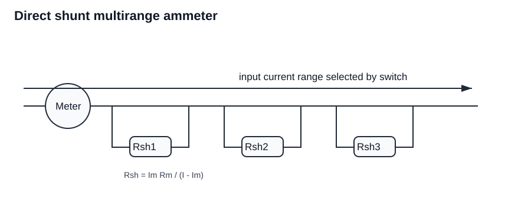
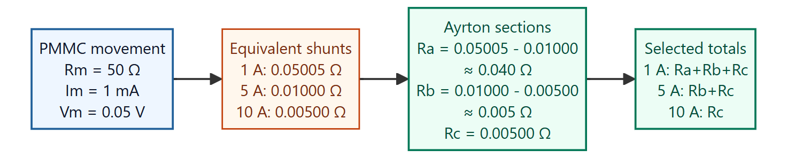
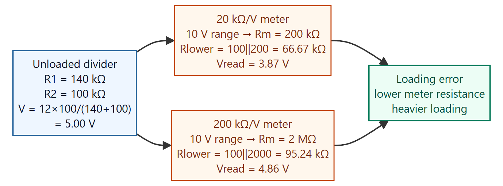
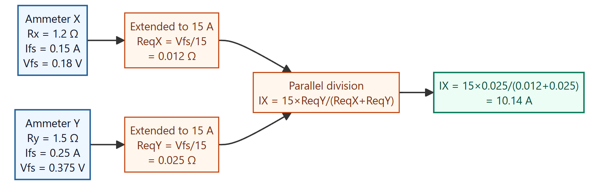
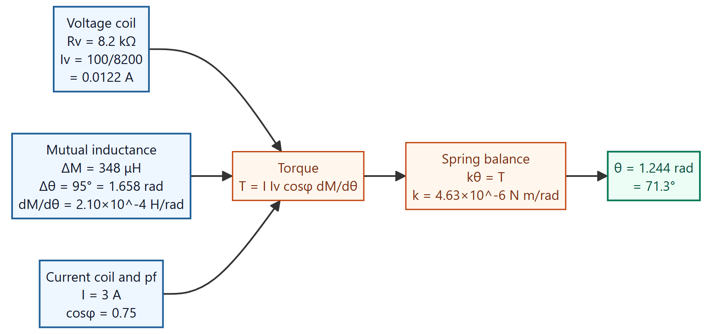

Generated from the tutorial PDF in `C:\Users\arzva\Downloads\MI`.

Each section is written as a learning note: concept first, marked visual where useful, then the worked answer and verification note.

## Question 1

Design a multirange ammeter by direct method for ranges 10 mA, 100 mA, and 1 A. The d'Arsonval meter has internal resistance 10 Ω and full-scale current 1 mA.

### Learn the idea

For each range, the meter movement must still carry only its full-scale current; the added shunt carries the excess current.

### Given and target

- Known values: ranges $10\,\mathrm{mA}$, $100\,\mathrm{mA}$, and $1\,\mathrm{A}$; meter resistance $R_m=10\,\Omega$; full-scale meter current $I_m=1\,\mathrm{mA}$.
- Target: calculate the direct-method shunt resistance for each current range.

### Annotated visual

Marked visual: the meter movement always carries $I_m$, while the selected shunt carries the remaining current for that range.

### Governing relation

- $R_{sh}=I_mR_m/(I-I_m)$
- $I_m=1\,\mathrm{mA}$
- $R_m=10\,\Omega$

### Work it through

Step 1: Calculate the meter full-scale voltage.

$V_m=I_mR_m=(0.001)(10)=0.010\,\mathrm{V}$

Step 2: For each current range, let the shunt carry the current not passing through the movement.

$I_{sh}=I-I_m$

Step 3: Calculate the shunt for the $10\,\mathrm{mA}$ range.

$R_{sh,10mA}=\frac{0.010}{0.010-0.001}=\frac{0.010}{0.009}=1.11\,\Omega$

Step 4: Calculate the shunt for the $100\,\mathrm{mA}$ range.

$R_{sh,100mA}=\frac{0.010}{0.100-0.001}=\frac{0.010}{0.099}=0.101\,\Omega$

Step 5: Calculate the shunt for the $1\,\mathrm{A}$ range.

$R_{sh,1A}=\frac{0.010}{1.000-0.001}=\frac{0.010}{0.999}=0.0100\,\Omega$

### Final answer

Final answer: **direct-method shunts are $1.11\,\Omega$ for $10\,\mathrm{mA}$, $0.101\,\Omega$ for $100\,\mathrm{mA}$, and $0.0100\,\Omega$ for $1\,\mathrm{A}$**.

### Common trap

Do not put the total range current through the PMMC movement. The movement current stays $1\,\mathrm{mA}$ at full scale.

## Question 2

Design by indirect method an ammeter with current ranges 1 A, 5 A, and 10 A for a PMMC meter with internal resistance 50 Ω and full-scale current 1 mA.

### Learn the idea

In an Ayrton shunt, the switch selects shunt sections while keeping the meter protected; first find each equivalent shunt, then split the values into sections.

### Given and target

- Known values: ammeter ranges $1\,\mathrm{A}$, $5\,\mathrm{A}$, and $10\,\mathrm{A}$; PMMC resistance $R_m=50\,\Omega$; full-scale meter current $I_m=1\,\mathrm{mA}$.
- Target: calculate the Ayrton shunt section values for the three ranges.

### Annotated visual

### Governing relation

- $V_m=I_mR_m=0.001\times50=0.05\,\mathrm{V}$
- Equivalent shunt for a selected range: $R_{eq}=V_m/(I-I_m)$
- Ayrton section values are found by subtracting adjacent equivalent shunt totals.

### Work it through

Step 1: Calculate meter full-scale voltage.

$V_m=I_mR_m=(0.001)(50)=0.05\,\mathrm{V}$

Step 2: Calculate the equivalent shunt needed for each full-scale range.

$R_{eq,1A}=\frac{0.05}{1-0.001}=0.05005\,\Omega$

$R_{eq,5A}=\frac{0.05}{5-0.001}=0.01000\,\Omega$

$R_{eq,10A}=\frac{0.05}{10-0.001}=0.00500\,\Omega$

Step 3: Split the Ayrton network into sections.

For the $1\,\mathrm{A}$ range, all three sections are in the selected shunt path:

$R_a+R_b+R_c=0.05005\,\Omega$

For the $5\,\mathrm{A}$ range:

$R_b+R_c=0.01000\,\Omega$

For the $10\,\mathrm{A}$ range:

$R_c=0.00500\,\Omega$

Step 4: Solve section values by subtraction.

$R_b=0.01000-0.00500=0.00500\,\Omega$

$R_a=0.05005-0.01000=0.04005\,\Omega$

### Final answer

Final answer: **Ayrton shunt sections are approximately $R_a=0.040\,\Omega$, $R_b=0.005\,\Omega$, and $R_c=0.005\,\Omega$**.

### Common trap

Do not use the equivalent shunt values directly as the section values. In an Ayrton shunt, the physical sections are found by subtracting adjacent selected totals.

## Question 3

A basic d'Arsonval meter with internal resistance 100 Ω and half-scale current 0.5 mA is converted by indirect method into a multirange DC voltmeter with 10 V, 50 V, 250 V, and 500 V ranges. Design and explain.

### Learn the idea

A voltmeter range is made by adding enough series resistance that the range voltage produces exactly the meter full-scale current.

### Given and target

- Known values: meter resistance $R_m=100\,\Omega$; half-scale current $0.5\,\mathrm{mA}$ so $I_m=1\,\mathrm{mA}$ full-scale; voltage ranges $10$, $50$, $250$, and $500\,\mathrm{V}$.
- Target: calculate the series multiplier sections for the four voltmeter ranges.

### Governing relation

- $I_m=1\,\mathrm{mA}$
- $R_T=V/I_m$
- $10/0.001-100=9.9\,\mathrm{k}\Omega$

### Work it through

Step 1: Convert the half-scale current statement into full-scale current.

Half-scale current is $0.5\,\mathrm{mA}$, so full-scale current is:

$I_m=1.0\,\mathrm{mA}=0.001\,\mathrm{A}$

Step 2: Calculate total resistance required for each voltage range.

$R_T=V/I_m$

$R_{T,10V}=10/0.001=10\,\mathrm{k}\Omega$

$R_{T,50V}=50/0.001=50\,\mathrm{k}\Omega$

$R_{T,250V}=250/0.001=250\,\mathrm{k}\Omega$

$R_{T,500V}=500/0.001=500\,\mathrm{k}\Omega$

Step 3: Subtract the meter resistance for the first range.

$R_1=10\,\mathrm{k}\Omega-100\,\Omega=9.9\,\mathrm{k}\Omega$

Step 4: Find the additional series sections by subtracting adjacent range totals.

$R_2=50\,\mathrm{k}\Omega-10\,\mathrm{k}\Omega=40\,\mathrm{k}\Omega$

$R_3=250\,\mathrm{k}\Omega-50\,\mathrm{k}\Omega=200\,\mathrm{k}\Omega$

$R_4=500\,\mathrm{k}\Omega-250\,\mathrm{k}\Omega=250\,\mathrm{k}\Omega$

### Final answer

Final answer: **series multiplier sections are $9.9\,\mathrm{k}\Omega$, $40\,\mathrm{k}\Omega$, $200\,\mathrm{k}\Omega$, and $250\,\mathrm{k}\Omega$ for the 10 V, 50 V, 250 V, and 500 V ranges**.

### Common trap

Do not make every range a separate standalone resistor. For an indirect multirange voltmeter, higher ranges add extra series sections to the lower-range total.

## Question 4

FSD reading of PMMC coil is 25 mA with potential difference 75 mV. Draw circuit and design as (a) 0-100 A ammeter and (b) 0-750 V voltmeter.

### Learn the idea

Use the PMMC full-scale voltage and current to find the meter resistance, then design the shunt for current range and multiplier for voltage range.

### Given and target

- Known values: PMMC full-scale current $I_m=25\,\mathrm{mA}$; meter voltage $V_m=75\,\mathrm{mV}$; required ammeter range $0$-$100\,\mathrm{A}$; required voltmeter range $0$-$750\,\mathrm{V}$.
- Target: design as (a) 0-100 A ammeter and (b) 0-750 V voltmeter.

### Governing relation

- $R_m=75\,\mathrm{mV}/25\,\mathrm{mA}=3\,\Omega$
- $R_{sh}=I_mR_m/(I-I_m)=0.025(3)/(100-0.025)=0.000750\,\Omega=0.75\,\mathrm{m}\Omega$
- $R_s=750/0.025-3=29997\,\Omega=29.997\,\mathrm{k}\Omega$

### Work it through

Step 1: Calculate the PMMC movement resistance.

$R_m=\frac{75\,\mathrm{mV}}{25\,\mathrm{mA}}=\frac{0.075}{0.025}=3\,\Omega$

Step 2: Design the $0$-$100\,\mathrm{A}$ ammeter shunt.

The PMMC carries only $I_m=0.025\,\mathrm{A}$ at full scale, so the shunt carries:

$I_{sh}=100-0.025=99.975\,\mathrm{A}$

$R_{sh}=\frac{I_mR_m}{I_{sh}}=\frac{0.025(3)}{99.975}=0.000750\,\Omega=0.75\,\mathrm{m}\Omega$

Step 3: Design the $0$-$750\,\mathrm{V}$ voltmeter multiplier.

Total resistance needed at $25\,\mathrm{mA}$ full-scale current is:

$R_T=750/0.025=30000\,\Omega$

Subtract the movement resistance:

$R_s=30000-3=29997\,\Omega=29.997\,\mathrm{k}\Omega$

The PDF appears to print mΩ for part (b), but the correct unit is **kΩ**.

### Final answer

Final answer: **ammeter shunt $R_{sh}=0.75\,\mathrm{m}\Omega$; voltmeter multiplier $R_s=29.997\,\mathrm{k}\Omega$**. The PDF appears to print mΩ for part (b), but the correct unit is **kΩ**.

### Common trap

The ammeter part needs a milliohm shunt, but the voltmeter part needs a kilohm multiplier. Mixing those units changes the answer by a factor of one million.

## Question 5

Calculate current required for 100° deflection in a PMMC meter with coil length 25 mm, width 18 mm, 60 turns, B = 0.5 T, spring constant $1.5\times10^{-6}\,\mathrm{N\,m/degree}$.

### Learn the idea

At steady deflection, magnetic deflecting torque equals spring controlling torque.

### Given and target

- Known values: $\theta=100^\circ$, coil size $25\,\mathrm{mm}\times18\,\mathrm{mm}$, turns $N=60$, flux density $B=0.5\,\mathrm{T}$, spring constant $k=1.5\times10^{-6}\,\mathrm{N\,m/degree}$.
- Target: find coil current for $100^\circ$ deflection.

### Governing relation

- $T_d=NBIA$
- $T_c=k\theta$
- $I=T_c/(NBA)$

### Work it through

Step 1: Convert coil dimensions into area.

$A=0.025\times0.018=4.5\times10^{-4}\,\mathrm{m^2}$.

Step 2: Calculate controlling spring torque at $100^\circ$.

$T_c=k\theta=(1.5\times10^{-6})(100)=1.5\times10^{-4}\,\mathrm{N\,m}$.

Step 3: Equate deflecting torque and controlling torque.

$T_d=T_c$

$NBIA=T_c$

Step 4: Solve for current.

$I=\frac{T_c}{NBA}=\frac{1.5\times10^{-4}}{60(0.5)(4.5\times10^{-4})}=0.01111\,\mathrm{A}=11.11\,\mathrm{mA}$.

### Final answer

Final answer: **current required $I=11.11\,\mathrm{mA}$**.

### Common trap

Use the spring constant per degree exactly as stated; do not convert the angle to radians unless the spring constant is also converted.

## Question 6

Inductance of moving-coil ammeter with full-scale 90° at 1.5 A is L=(200+40theta-4theta^2-theta^3) µH, theta in radians. Estimate pointer deflection for 1 A.

### Learn the idea

For moving-iron deflection, use the full-scale point to identify the spring constant, then solve the same torque balance at the new current.

### Given and target

- Known values: full-scale angle $\theta_{fs}=90^\circ=\pi/2\,\mathrm{rad}$, full-scale current $I_{fs}=1.5\,\mathrm{A}$, inductance $L=(200+40\theta-4\theta^2-\theta^3)\,\mu\mathrm{H}$, target current $I=1\,\mathrm{A}$.
- Target: estimate the moving-iron pointer deflection at $1\,\mathrm{A}$.

### Governing relation

- $T_d=(1/2)I^2(dL/d\theta)$
- $T_c=k\theta$
- $\theta=\pi/2$

### Work it through

Step 1: Differentiate the inductance expression.

$\frac{dL}{d\theta}=40-8\theta-3\theta^2$.

Step 2: Use the full-scale point to find the spring constant.

At full scale:

$\theta_{fs}=90^\circ=\pi/2=1.571\,\mathrm{rad}$

$I_{fs}=1.5\,\mathrm{A}$

Evaluate the inductance slope at full scale:

$\left.\frac{dL}{d\theta}\right|_{\pi/2}=40-8(\pi/2)-3(\pi/2)^2=20.03$

Use torque balance:

$k=\frac{(1/2)(1.5)^2(40-8(\pi/2)-3(\pi/2)^2)}{\pi/2}$.

$k=14.35$ in the same scaled units used by the inductance expression.

Step 3: Set up the torque balance for $I=1\,\mathrm{A}$.

$k\theta=(1/2)(1)^2(40-8\theta-3\theta^2)$.

Step 4: Rearrange into a quadratic.

$14.35\theta=20-4\theta-1.5\theta^2$

$1.5\theta^2+18.35\theta-20=0$

Step 5: Take the positive root.

$\theta=1.007\,\mathrm{rad}$

Step 6: Convert to degrees.

$\theta=1.007(180/\pi)=57.7^\circ$

### Final answer

Final answer: **pointer deflection $\theta\approx1.007\,\mathrm{rad}=57.7^\circ$**.

### Common trap

The equation is nonlinear in $\theta$ because $dL/d\theta$ depends on $\theta$. Do not scale the $90^\circ$ deflection simply by the current ratio.

## Question 7

A PMMC ammeter and electrodynamometer ammeter are used in a DC motor circuit. PMMC has 100 turns, B = 0.2 Wb/m2, coil area 0.8 cm2. Electrodynamometer mutual inductance table is given. Spring constants are same and deflections same. Target current is 3.5 A. Determine percent error.

### Learn the idea

The two instruments have the same spring control and the same deflection, so compare their torque equations at that deflection. The PMMC torque is proportional to current, while the electrodynamometer torque is proportional to $I^2(dM/d\theta)$.

### Given and target

- Known values: PMMC turns $N=100$; flux density $B=0.2\,\mathrm{Wb/m^2}$; coil area $A=0.8\,\mathrm{cm^2}$; target current $3.5\,\mathrm{A}$; electrodynamometer mutual-inductance table from the question.
- Target: Determine percent error.

### Governing relation

- $T=N B A I$
- $T=I^2 dM/d\theta$
- $\%e=(I_{\text{indicated}}-I_{\text{true}})/I_{\text{true}}\times100$

### Work it through

Step 1: Write the PMMC torque relation at the stated deflection.

$T_{\text{PMMC}}=NBAI$

Step 2: Write the electrodynamometer torque relation at the same deflection.

$T_{\text{dyn}}=I^2(dM/d\theta)$

Step 3: Use the supplied mutual-inductance table to evaluate $dM/d\theta$ at the same deflection.

The tutorial/PDF table interpolation gives an electrodynamometer indicated current of about:

$I_{\text{indicated}}\approx3.2\,\mathrm{A}$

Step 4: Compare this with the true target current.

$I_{\text{true}}=3.5\,\mathrm{A}$

Step 5: Calculate percent error.

$\%e=\frac{3.2-3.5}{3.5}\times100=-8.57\%$

### Final answer

Final answer: **electrodynamometer reads about $3.2\,\mathrm{A}$, so percent error is $-8.57\%$**.

### Common trap

The mutual-inductance table is needed to obtain the electrodynamometer indication. Once that indication is known, the percent error must be relative to the true $3.5\,\mathrm{A}$ current.

## Question 8

Practice: R1=140 kΩ and R2=100 kΩ are in series across 12 V. A voltmeter on 10 V range measures across R2. Find actual voltage, measured voltage for 20 kΩ/V and 200 kΩ/V meters, percent error, and comment.

### Learn the idea

Keep absolute error and percentage-of-reading error separate. Instruments with the same full-scale accuracy can behave very differently at a small reading.

### Given and target

- Known values: divider resistors $R_1=140\,\mathrm{k}\Omega$ and $R_2=100\,\mathrm{k}\Omega$; supply $12\,\mathrm{V}$; meter range $10\,\mathrm{V}$; meter sensitivities $20\,\mathrm{k}\Omega/\mathrm{V}$ and $200\,\mathrm{k}\Omega/\mathrm{V}$.
- Target: Find actual voltage, measured voltage for 20 kΩ/V and 200 kΩ/V meters, percent error, and comment.

### Annotated visual

### Governing relation

- $V_{R2}=12(100)/(140+100)=5\,\mathrm{V}$
- $R_L=R_2||R_m$
- $V_{\text{read}}=12R_L/(R_1+R_L)$
- $\%e=(V_{\text{read}}-V_{\text{actual}})/V_{\text{actual}}\times100$

### Work it through

Step 1: Calculate the unloaded divider voltage across $R_2$.

$V_{R2}=12\frac{100}{140+100}=5.00\,\mathrm{V}$

Step 2: Find meter resistance for the $20\,\mathrm{k}\Omega/\mathrm{V}$ meter.

$R_m=(20\,\mathrm{k}\Omega/\mathrm{V})(10\,\mathrm{V})=200\,\mathrm{k}\Omega$

Step 3: Calculate the loaded lower-arm resistance.

$R_L=100||200=\frac{100(200)}{100+200}=66.67\,\mathrm{k}\Omega$

Step 4: Calculate the loaded reading.

$V_{20k/V}=12\frac{66.67}{140+66.67}=3.87\,\mathrm{V}$

Step 5: Calculate percent error for the $20\,\mathrm{k}\Omega/\mathrm{V}$ meter.

$\%e=\frac{3.87-5.00}{5.00}\times100=-22.6\%$

Step 6: Repeat for the $200\,\mathrm{k}\Omega/\mathrm{V}$ meter.

$R_m=(200\,\mathrm{k}\Omega/\mathrm{V})(10\,\mathrm{V})=2000\,\mathrm{k}\Omega=2\,\mathrm{M}\Omega$

$R_L=100||2000=\frac{100(2000)}{100+2000}=95.24\,\mathrm{k}\Omega$

$V_{200k/V}=12\frac{95.24}{140+95.24}=4.86\,\mathrm{V}$

$\%e=\frac{4.86-5.00}{5.00}\times100=-2.8\%$

The PDF percentage $-2.84\%$ corresponds to this high-sensitivity case.

### Final answer

Final answer: **actual voltage $5.00\,\mathrm{V}$; measured voltage is $3.87\,\mathrm{V}$ with error $-22.6\%$ for $20\,\mathrm{k}\Omega/\mathrm{V}$, and $4.86\,\mathrm{V}$ with error about $-2.8\%$ for $200\,\mathrm{k}\Omega/\mathrm{V}$**. The high-sensitivity meter has much lower loading error.

### Common trap

The meter resistance is not just a passive probe here; it goes in parallel with $R_2$ and changes the divider before the voltage is read.

## Question 9

Practice: Ammeter X has 1.2 Ω and 150 mA FSD; Y has 1.5 Ω and 250 mA FSD. Both ranges are extended to 15 A using shunts, then connected in parallel in a 15 A circuit. Determine current indicated in X.

### Learn the idea

After both ammeters are range-extended, their indications depend on current division between the two equivalent branch resistances.

### Given and target

- Known values: ammeter X has $R_X=1.2\,\Omega$ and $I_{X,fs}=150\,\mathrm{mA}$; ammeter Y has $R_Y=1.5\,\Omega$ and $I_{Y,fs}=250\,\mathrm{mA}$; both are extended to $15\,\mathrm{A}$ and then connected in parallel.
- Target: Determine current indicated in X.

### Annotated visual

### Governing relation

- Full-scale voltage of a movement: $V_{fs}=I_{fs}R$
- Equivalent resistance of a $15\,\mathrm{A}$ extended ammeter branch: $R_{eq}=V_{fs}/15$
- Current division: $I_X=I_T\frac{R_{eq,Y}}{R_{eq,X}+R_{eq,Y}}$

### Work it through

Step 1: Calculate full-scale voltage of ammeter X.

$V_{X,fs}=I_{X,fs}R_X=(0.150)(1.2)=0.180\,\mathrm{V}$

Step 2: Calculate full-scale voltage of ammeter Y.

$V_{Y,fs}=I_{Y,fs}R_Y=(0.250)(1.5)=0.375\,\mathrm{V}$

Step 3: Convert each extended ammeter into its equivalent $15\,\mathrm{A}$ branch resistance.

$R_{eq,X}=0.180/15=0.012\,\Omega$

$R_{eq,Y}=0.375/15=0.025\,\Omega$

Step 4: Use current division after connecting the extended ammeters in parallel.

$I_X=15\frac{R_{eq,Y}}{R_{eq,X}+R_{eq,Y}}$

$I_X=15\frac{0.025}{0.012+0.025}=10.14\,\mathrm{A}$

### Final answer

Final answer: **current indicated in ammeter X is $I_X=10.14\,\mathrm{A}$**.

### Common trap

After range extension, divide current using the equivalent branch resistances of the extended ammeters, not the original movement resistances alone.

## Question 10

Practice: In an electrodynamometer instrument, voltage coil resistance is 8.2 kΩ and mutual inductance changes from -173 µH at zero to +175 µH at 95°. With 100 V on voltage coil, 3 A in current coil, power factor 0.75, spring constant $4.63\times10^{-6}\,\mathrm{N\,m/rad}$, find deflection.

### Learn the idea

Average electrodynamometer torque is proportional to current-coil current, voltage-coil current, power factor, and the mutual-inductance gradient.

### Given and target

- Known values: $R_v=8.2\,\mathrm{k}\Omega$, $M$ changes from $-173\,\mu\mathrm{H}$ to $+175\,\mu\mathrm{H}$ over $95^\circ$, voltage $100\,\mathrm{V}$, current $3\,\mathrm{A}$, power factor $0.75$, spring constant $4.63\times10^{-6}\,\mathrm{N\,m/rad}$.
- Target: find steady deflection.

### Annotated visual

### Governing relation

- $I_v=V/R_v$
- $T=I I_v\cos\phi(dM/d\theta)$
- $T=k\theta$

### Work it through

Step 1: Calculate voltage-coil current.

$I_v=100/8200=0.0122\,\mathrm{A}$.

Step 2: Convert the mutual-inductance span angle to radians.

$95^\circ=95\pi/180=1.658\,\mathrm{rad}$

Step 3: Calculate mutual-inductance slope, assuming linear variation.

$\frac{dM}{d\theta}=\frac{175\,\mu\mathrm{H}-(-173\,\mu\mathrm{H})}{1.658}=2.10\times10^{-4}\,\mathrm{H/rad}$.

Step 4: Calculate average deflecting torque.

$T=3(0.0122)(0.75)(2.10\times10^{-4})=5.76\times10^{-6}\,\mathrm{N\,m}$.

Step 5: Use spring balance.

$\theta=T/k=5.76\times10^{-6}/(4.63\times10^{-6})=1.244\,\mathrm{rad}=71.3^\circ$.

### Final answer

Final answer: **deflection $\theta=1.244\,\mathrm{rad}=71.3^\circ$**.

### Common trap

Convert the 95° mutual-inductance span to radians before computing $dM/d\theta$, because the spring constant is in N m/rad.
