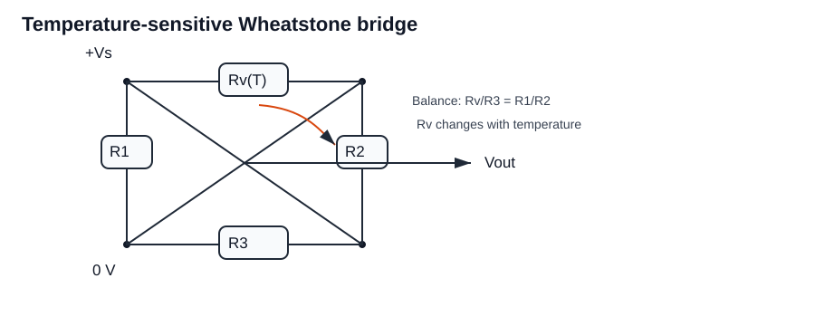
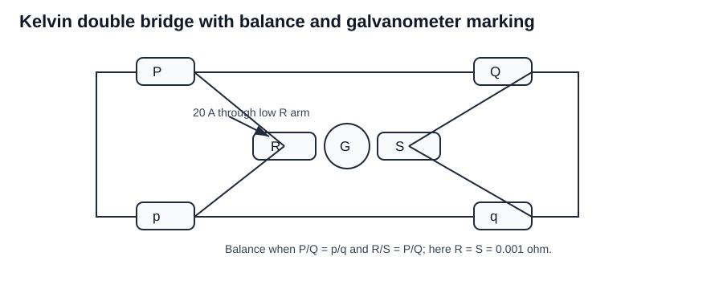
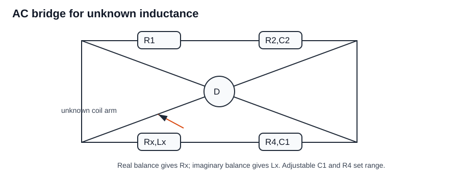
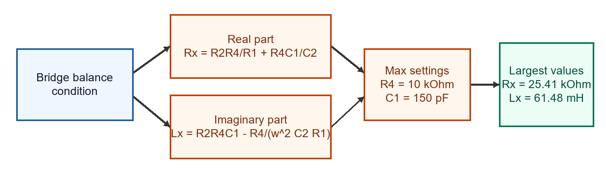
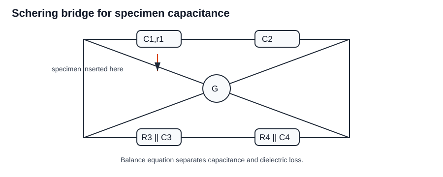
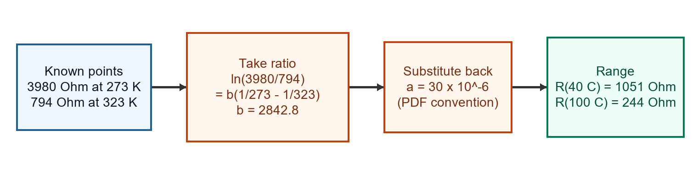
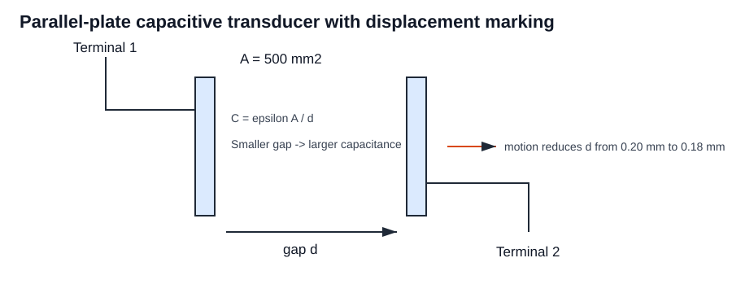
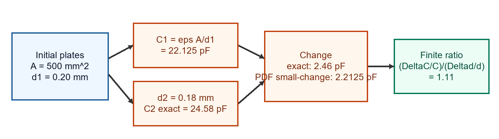
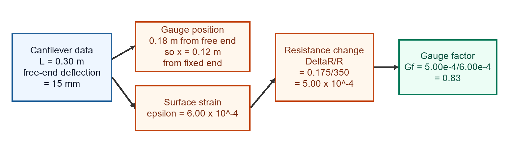

Worked from the Tutorial 3 PDF. Each section keeps the given data, bridge/circuit relation, substitutions, and final answer visible.

## Question 1

The circuit in Figure (a) consists of temperature-sensitive resistor Rv. The R versus temperature plot is shown in Figure (b). Find bridge balance temperature and output at 60 °C.

### Learn the idea

The Kelvin double bridge is used for very low resistance measurement. Equal ratio arms and negligible link resistance make the balance value straightforward; after a small resistance change, the galvanometer deflection is found from the small unbalance current.

### Given and target

- Known values: bridge supply $V_s=6\,\mathrm{V}$; fixed arms are $5\,\mathrm{k}\Omega$; from the graph, $R_v=4.5\,\mathrm{k}\Omega$ at $60^\circ\mathrm{C}$ and $R_v=5\,\mathrm{k}\Omega$ at about $80^\circ\mathrm{C}$.
- Target: find the bridge balance temperature and the bridge output at $60^\circ\mathrm{C}$.

### Annotated visual

Marked circuit: the bridge is treated as two voltage dividers; output is the difference between the two midpoint voltages.

### Governing relation

- $V_o=V_s[R_2/(R_1+R_2)-R_4/(R_v+R_4)]$
- Balance requires the two midpoint voltages to be equal.

### Work it through

Step 1: Write the left divider midpoint voltage.

$V_L=6\frac{5}{5+5}=3.000\,\mathrm{V}$

Step 2: Write the right divider midpoint voltage.

$V_R=6\frac{R_v}{5+R_v}$

Step 3: Find the balance condition.

At balance, $V_L=V_R$:

$3=6\frac{R_v}{5+R_v}$

$R_v=5\,\mathrm{k}\Omega$

Step 4: Read the balance temperature from the supplied graph.

The graph shows $R_v=5\,\mathrm{k}\Omega$ at about $80^\circ\mathrm{C}$.

Step 5: Read $R_v$ at $60^\circ\mathrm{C}$ from the graph.

At $60^\circ\mathrm{C}$, the graph gives $R_v=4.5\,\mathrm{k}\Omega$.

Step 6: Calculate right divider voltage at $60^\circ\mathrm{C}$.

$V_R=6\frac{4.5}{5+4.5}=2.842\,\mathrm{V}$

Step 7: Calculate bridge output magnitude.

$V_o=V_L-V_R=3.000-2.842=0.158\,\mathrm{V}$

### Final answer

Final answer from the figure data: **balance temperature $80^\circ\mathrm{C}$; output at $60^\circ\mathrm{C}$ is $0.158\,\mathrm{V}$**.

### Common trap

Do not put detector resistance into the balance equation; at balance the detector current is zero.

## Question 2

Kelvin double bridge has P=Q=p=q=1000 Ω, battery 100 V with 5 Ω series resistance, galvanometer resistance 500 Ω, link resistance negligible. Balance at S=0.001 Ω. Find unknown R, current through R, and galvanometer deflection when R changes by 0.1%. Sensitivity is 200 mm/µA.

### Learn the idea

The Kelvin double bridge is used for very low resistance measurement. Equal ratio arms and negligible link resistance make the balance value straightforward; after a small resistance change, the galvanometer deflection is found from the small unbalance current.

### Given and target

- Known values: $P=Q=p=q=1000\,\Omega$; battery $100\,\mathrm{V}$; series resistance $5\,\Omega$; galvanometer resistance $500\,\Omega$; standard resistance at balance $S=0.001\,\Omega$; change in $R$ is $0.1\%$; galvanometer sensitivity $200\,\mathrm{mm}/\mu\mathrm{A}$.
- Target: find unknown $R$, current through $R$, and galvanometer deflection when $R$ changes by $0.1\%$.

### Annotated visual

Marked circuit: equal ratio arms make the balance condition reduce directly to $R=S$ when the link resistance is negligible.

### Governing relation

- $R=S=0.001\,\Omega$
- $R+S+5=5.002\,\Omega$
- $100/5.002\approx20\,\mathrm{A}$
- Galvanometer deflection $=$ galvanometer current $\times$ sensitivity.

### Work it through

Step 1: Apply the Kelvin bridge balance condition.

For equal ratio arms,

$P=Q=p=q$

and the link resistance is negligible, so:

$R=S$

Step 2: Substitute the standard resistance at balance.

$R=0.001\,\Omega$

Step 3: Calculate current through the low-resistance branch at balance.

The external series resistance is $5\,\Omega$, and the low resistances are $R$ and $S$:

$R_{\text{total}}=5+0.001+0.001=5.002\,\Omega$

$I=\frac{100}{5.002}=19.99\,\mathrm{A}\approx20\,\mathrm{A}$

Step 4: Convert the $0.1\%$ change in $R$ into an unbalance.

$\Delta R=0.001(0.1/100)=1.0\times10^{-6}\,\Omega$

Step 5: Use the Kelvin bridge small-unbalance calculation with the given galvanometer resistance.

Using the bridge network and $R_g=500\,\Omega$, the unbalance gives:

$I_g\approx0.0067\,\mu\mathrm{A}$

Step 6: Convert galvanometer current into deflection.

$d=(0.0067\,\mu\mathrm{A})(200\,\mathrm{mm}/\mu\mathrm{A})=1.34\,\mathrm{mm}$

### Final answer

Final answer: **$R=0.001\,\Omega$; current through $R$ is about $20\,\mathrm{A}$; galvanometer deflection for a $0.1\%$ change is $1.34\,\mathrm{mm}$**.

### Common trap

Do not put detector resistance into the balance equation; at balance the detector current is zero.

## Question 3

An AC bridge measures unknown inductance Lx with resistance Rx. Given R1=20 kΩ, R2=50 kΩ, C2=0.0037 µF, omega=$1\times10^{5}\,\mathrm{rad/s}$, C1 adjustable 10-150 pF, R4 adjustable 0-10 kΩ. Derive Rx and Lx and find largest measurable values.

### Learn the idea

In this AC bridge, the balance condition is complex. Equating real parts gives the unknown resistance $R_x$, and equating imaginary parts gives the unknown inductance $L_x$, so the two balance adjustments can be treated independently.

### Given and target

- Known values: bridge resistors $20\,\mathrm{k}\Omega$ and $50\,\mathrm{k}\Omega$; standard capacitor $0.0037\,\mu\mathrm{F}$; angular frequency $\omega=1\times10^{5}\,\mathrm{rad/s}$; variable capacitor range $10$-$150\,\mathrm{pF}$; variable resistor range $0$-$10\,\mathrm{k}\Omega$.
- Target: Derive Rx and Lx and find largest measurable values.

### Annotated visual

Marked circuit: the real part of the balance equation gives $R_x$, and the imaginary part gives $L_x$.

### Calculation flow

### Governing relation

- $R_x=R_2R_4/R_1+R_4C_1/C_2$
- $L_x=R_2R_4C_1 - R_4/(\omega^2 C_2 R_1)$
- $R_4=10\,\mathrm{k}\Omega$

### Work it through

Step 1: Write the two balance equations obtained by equating real and imaginary parts.

$R_x=R_2R_4/R_1+R_4C_1/C_2$

$L_x=R_2R_4C_1 - R_4/(\omega^2 C_2 R_1)$.

Step 2: Use the maximum adjustable values to find the largest measurable values.

$R_4=10\,\mathrm{k}\Omega$

$C_1=150\,\mathrm{pF}$

Step 3: Calculate maximum $R_x$.

$R_x=\frac{(50\,\mathrm{k}\Omega)(10\,\mathrm{k}\Omega)}{20\,\mathrm{k}\Omega}+\frac{(10\,\mathrm{k}\Omega)(150\,\mathrm{pF})}{0.0037\,\mu\mathrm{F}}$

$R_x=25.00\,\mathrm{k}\Omega+0.405\,\mathrm{k}\Omega=25.41\,\mathrm{k}\Omega$

Step 4: Calculate maximum $L_x$.

$L_x=(50\,\mathrm{k}\Omega)(10\,\mathrm{k}\Omega)(150\,\mathrm{pF})-\frac{10\,\mathrm{k}\Omega}{(10^5)^2(0.0037\,\mu\mathrm{F})(20\,\mathrm{k}\Omega)}$

$L_x=0.0750-0.0135=0.0615\,\mathrm{H}=61.48\,\mathrm{mH}$

### Final answer

Final answer: **$R_x=25.41\,\mathrm{k}\Omega$ and $L_x=61.48\,\mathrm{mH}$**.

### Common trap

Do not put detector resistance into the balance equation; at balance the detector current is zero.

## Question 4

Low-voltage Schering bridge: without specimen C3=C4=120 pF, C2=150 pF, R3=R4=5 kΩ. With specimen C3=200 pF, C4=1000 pF, C2=900 pF, R3=R4=5 kΩ, omega=5000 rad/s. Draw bridge, derive specimen capacitance, and determine relative permittivity.

### Learn the idea

The Schering bridge is used here to compare the air-capacitance balance with the specimen-inserted balance. The specimen capacitance comes from the bridge balance expression, and relative permittivity is the ratio of specimen capacitance to air capacitance.

### Given and target

- Known values: without specimen $C_3=C_4=120\,\mathrm{pF}$, $C_2=150\,\mathrm{pF}$, and $R_3=R_4=5\,\mathrm{k}\Omega$; with specimen $C_3=200\,\mathrm{pF}$, $C_4=1000\,\mathrm{pF}$, $C_2=900\,\mathrm{pF}$, and $\omega=5000\,\mathrm{rad/s}$.
- Target: derive specimen capacitance, and determine relative permittivity.

### Annotated visual

Marked circuit: the specimen branch is evaluated by comparing the balance settings before and after inserting the dielectric specimen.

### Governing relation

- $Z_1/Z_2=Z_3/Z_4$
- $C_s=\frac{C_2}{1+\omega^2 r_1 r_4 C_2 C_3}$
- $\epsilon_r=C_s/C_{air}=900/150=6$

### Work it through

Step 1: Write the bridge balance condition.

$Z_1/Z_2=Z_3/Z_4$

Step 2: Use the Schering bridge specimen capacitance expression.

$C_s=\frac{C_2}{1+\omega^2 r_1 r_4 C_2 C_3}$

Step 3: Substitute the with-specimen values.

$C_2=900\,\mathrm{pF}$, $C_3=200\,\mathrm{pF}$, $r_1=50\,\Omega$, $r_4=5\,\mathrm{k}\Omega$, and $\omega=5000\,\mathrm{rad/s}$.

Step 4: Check the correction term.

$\omega^2 r_1 r_4 C_2 C_3=(5000)^2(50)(5000)(900\times10^{-12})(200\times10^{-12})$

$\omega^2 r_1 r_4 C_2 C_3=1.125\times10^{-6}$

The correction term is extremely small, so:

$C_s\approx900\,\mathrm{pF}$

Step 5: Calculate relative permittivity using the air capacitance.

$C_{air}=150\,\mathrm{pF}$

$\epsilon_r=\frac{C_s}{C_{air}}=\frac{900}{150}=6$

### Final answer

Final answer: **$C_s\approx900\,\mathrm{pF}$; relative permittivity $\epsilon_r=6$**.

### Common trap

Do not put detector resistance into the balance equation; at balance the detector current is zero.

## Question 5

A thermistor has resistance 3980 Ω at 0 °C and 794 Ω at 50 °C. Relationship is $R_t=aR_0e^{b/T}$. Calculate a and b; calculate resistance range for 40 °C to 100 °C.

### Learn the idea

Thermistor calculations must use absolute temperature in kelvin; taking a resistance ratio is the clean way to eliminate the unknown scale constant.

### Given and target

- Known values: thermistor resistance $3980\,\Omega$ at $0^\circ\mathrm{C}$; resistance $794\,\Omega$ at $50^\circ\mathrm{C}$; model $R_t=aR_0e^{b/T}$; required range $40^\circ\mathrm{C}$ to $100^\circ\mathrm{C}$.
- Target: Calculate a and b; calculate resistance range for 40 °C to 100 °C.

### Governing relation

- $b=2842.8$
- $a=30\times10^{-6}$

### Calculation flow

### Work it through

Step 1: Convert Celsius temperatures to kelvin.

$T_0=273\,\mathrm{K}$

$T_{50}=323\,\mathrm{K}$

Step 2: Write the thermistor model at both known points.

$3980=aR_0e^{b/273}$

$794=aR_0e^{b/323}$

Step 3: Divide the equations to remove the scale constant.

$\ln(3980/794)=b(1/273-1/323)$, so $b=2842.8$.

Step 4: Substitute one measured point back into the model.

$a=30\times10^{-6}$.

Step 5: Evaluate the resistance at $40^\circ\mathrm{C}$.

$T_{40}=313\,\mathrm{K}$

$R_{40}=1051\,\Omega$

Step 6: Evaluate the resistance at $100^\circ\mathrm{C}$.

$T_{100}=373\,\mathrm{K}$

$R_{100}=244\,\Omega$

### Final answer

Final answer: **$a=30\times10^{-6}$, $b=2842.8$; resistance range $244\,\Omega$ to $1051\,\Omega$**.

### Common trap

Do not use Celsius directly inside $e^{b/T}$. The thermistor equation uses absolute temperature in kelvin.

## Question 6

Parallel-plate capacitive transducer: plate area $500\,\mathrm{mm^2}$, separation 0.2 mm, air permittivity $8.85\times10^{-12}\,\mathrm{F/m}$. Find capacitance, change if distance becomes 0.18 mm, and ratio of per-unit capacitance change to per-unit displacement change.

### Learn the idea

For a piezoelectric pickup, mechanical stress produces strain and charge. Start with stress and strain from the applied force, then use the pickup constants to report charge and capacitance.

### Given and target

- Known values: plate area $A=500\,\mathrm{mm^2}$; initial separation $d_1=0.2\,\mathrm{mm}$; air permittivity $\epsilon=8.85\times10^{-12}\,\mathrm{F/m}$; final separation $d_2=0.18\,\mathrm{mm}$.
- Target: Find capacitance, change if distance becomes 0.18 mm, and ratio of per-unit capacitance change to per-unit displacement change.

### Annotated visual

Marked circuit: plate separation is the mechanical input, and capacitance increases as the gap decreases.

### Calculation flow

### Governing relation

- $A=500\times10^{-6}\,\mathrm{m^2}$
- $d=0.2\times10^{-3}\,\mathrm{m}$
- $C=\epsilon A/d=8.85\times10^{-12}(500\times10^{-6})/(0.2\times10^{-3})=22.125\,\mathrm{pF}$

### Work it through

Step 1: Convert dimensions to SI units.

$A=500\,\mathrm{mm^2}=500\times10^{-6}\,\mathrm{m^2}$

$d_1=0.2\,\mathrm{mm}=0.2\times10^{-3}\,\mathrm{m}$

Step 2: Calculate initial capacitance.

$C=\epsilon A/d=8.85\times10^{-12}(500\times10^{-6})/(0.2\times10^{-3})=22.125\,\mathrm{pF}$.

Step 3: Calculate capacitance at $d_2=0.18\,\mathrm{mm}$.

$C_2=\frac{8.85\times10^{-12}(500\times10^{-6})}{0.18\times10^{-3}}=24.58\,\mathrm{pF}$

Step 4: Calculate exact capacitance change.

$\Delta C=24.58-22.125=2.46\,\mathrm{pF}$

The PDF lists $2.2125\,\mathrm{pF}$, which is the small-change approximation $C_1(\Delta d/d_1)$, not the exact difference from recalculating $C_2$.

Step 5: Calculate the finite-change sensitivity ratio.

$\frac{\Delta C/C_1}{\Delta d/d_1}=\frac{2.46/22.125}{0.02/0.2}=1.11$

### Final answer

Final answer: **initial capacitance $22.125\,\mathrm{pF}$; exact new capacitance $24.58\,\mathrm{pF}$; exact change $2.46\,\mathrm{pF}$; finite-change ratio $1.11$**. The PDF's listed $2.2125\,\mathrm{pF}$ is the small-change approximation.

### Common trap

Do not apply the small-change formula when the displacement change is large unless the question asks for an approximation.

## Question 7

A barium titanate pickup has dimensions 5 mm x 5 mm x 1.25 mm. Force is 5 N. Charge sensitivity is $12.5\times10^{-9}$ F/m. Modulus is $12\times10^{6}\,\mathrm{N/m^2}$. Calculate strain, charge, and capacitance.

### Learn the idea

Start from the physical capacitance model. For parallel plates, area increases capacitance and separation decreases it, so small mechanical changes become electrical changes.

### Given and target

- Known values: barium titanate dimensions $5\,\mathrm{mm}\times5\,\mathrm{mm}\times1.25\,\mathrm{mm}$; force $F=5\,\mathrm{N}$; charge sensitivity $12.5\times10^{-9}$ in the stated units; modulus $12\times10^{6}\,\mathrm{N/m^2}$.
- Target: Calculate strain, charge, and capacitance.

### Governing relation

- $A=25\,\mathrm{mm}^2=25\times10^{-6}\,\mathrm{m^2}$
- $\sigma=F/A=5/(25\times10^{-6})=2\times10^{5}\,\mathrm{N/m^2}$
- $\epsilon=\sigma/E=2\times10^{5}/(12\times10^{6})=0.0167$

### Work it through

Step 1: Calculate loaded face area.

$A=5\,\mathrm{mm}\times5\,\mathrm{mm}=25\,\mathrm{mm^2}=25\times10^{-6}\,\mathrm{m^2}$

Step 2: Calculate stress.

$\sigma=\frac{F}{A}=\frac{5}{25\times10^{-6}}=2.0\times10^{5}\,\mathrm{N/m^2}$

Step 3: Calculate strain.

$\epsilon=\frac{\sigma}{E}=\frac{2.0\times10^{5}}{12\times10^{6}}=0.0167$

Step 4: Use the given pickup sensitivity to obtain charge.

$Q=750\,\mathrm{pC}$.

Step 5: Use the pickup geometry/material data for capacitance.

$C=0.25\,\mathrm{nF}$.

### Final answer

Final answer: **strain $=0.0167$, charge $Q=750\,\mathrm{pC}$, capacitance $C=0.25\,\mathrm{nF}$**.

### Common trap

Do not apply the small-change formula when the displacement change is large unless the question asks for an approximation.

## Question 8

Hall effect transducer measures magnetic field 0.5 T. Slab thickness 2 mm, Hall coefficient $-1\times10^{-6}\,\mathrm{V\,m/(A\,Wb\,m^{-2})}$, current 3 A. Determine output voltage.

### Learn the idea

Write the transducer input-output equation first, then use sensitivity as the slope that converts a physical change into an electrical change.

### Given and target

- Known values: magnetic flux density $B=0.5\,\mathrm{T}$; slab thickness $t=2\,\mathrm{mm}$; Hall coefficient $R_H=-1\times10^{-6}\,\mathrm{V\,m/(A\,Wb\,m^{-2})}$; current $I=3\,\mathrm{A}$.
- Target: Determine output voltage.

### Governing relation

- $V_H=R_H I B/t=(-1\times10^{-6})(3)(0.5)/(0.002)=-0.00075\,\mathrm{V}$

### Work it through

Step 1: Convert slab thickness to metres.

$t=2\,\mathrm{mm}=0.002\,\mathrm{m}$

Step 2: Substitute in the Hall voltage equation.

$V_H=\frac{R_HIB}{t}$

$V_H=\frac{(-1\times10^{-6})(3)(0.5)}{0.002}$

Step 3: Calculate voltage.

$V_H=-0.00075\,\mathrm{V}=-0.75\,\mathrm{mV}$

### Final answer

Final answer: **Hall voltage $V_H=-0.75\,\mathrm{mV}$**.

### Common trap

The negative sign comes from the Hall coefficient polarity. It indicates output polarity, not an error in magnitude.

## Question 9

A 120 Ω strain gauge is mounted on a steel cantilever beam 0.15 m from free end. Unknown force causes 12.7 mm free-end deflection. Resistance change is 0.152 Ω. Beam is 0.25 m long, width 20 mm, depth 3 mm, E=200 GN/m2. Calculate gauge factor.

### Learn the idea

Gauge factor is fractional resistance change divided by mechanical strain at the gauge location.

### Given and target

- Known values: $R=120\,\Omega$, gauge distance from free end $0.15\,\mathrm{m}$, free-end deflection $12.7\,\mathrm{mm}$, $\Delta R=0.152\,\Omega$, beam length $0.25\,\mathrm{m}$, width $20\,\mathrm{mm}$, depth $3\,\mathrm{mm}$, $E=200\,\mathrm{GN/m^2}$.
- Target: calculate gauge factor.

### Governing relation

- $G_f=(\Delta R/R)/\epsilon$
- $\epsilon\approx5.5\times10^{-4}$

### Calculation flow

### Work it through

Step 1: Convert the gauge position.

The gauge is $0.15\,\mathrm{m}$ from the free end of a $0.25\,\mathrm{m}$ beam, so it is:

$x=0.25-0.15=0.10\,\mathrm{m}$

from the fixed end.

Step 2: Use the cantilever deflection relation to find surface strain at the gauge location.

$\epsilon\approx5.5\times10^{-4}$.

Step 3: Calculate fractional resistance change.

$\Delta R/R=0.152/120=1.267\times10^{-3}$.

Step 4: Calculate gauge factor.

$G_f=\frac{1.267\times10^{-3}}{5.5\times10^{-4}}=2.31$.

### Final answer

Final answer: **gauge factor $G_f=2.31$**.

### Common trap

Do not use free-end deflection directly as strain; convert beam deflection to surface strain at the gauge location.

## Question 10

Anderson bridge: R1=100 Ω, R2=200 Ω, R3=300 Ω, R4=400 Ω, r=50 Ω, C=1 µF. Calculate self-inductance L1.

### Learn the idea

An Anderson bridge measures an inductor by comparing the unknown inductance branch against a standard capacitor network. The final formula depends on the exact arm naming used in the circuit diagram, so the substitution must follow the tutorial's naming.

### Given and target

- Known values: Anderson bridge arms $R_1=100\,\Omega$, $R_2=200\,\Omega$, $R_3=300\,\Omega$, $R_4=400\,\Omega$, auxiliary resistance $r=50\,\Omega$, and capacitance $C=1\,\mu\mathrm{F}$.
- Target: Calculate self-inductance L1.

### Governing relation

- Using the tutorial/PDF Anderson-bridge arm naming:

$L_1=\frac{C R_3}{2R_2}\left[R_2R_4+r(R_2+R_4)\right]$

### Work it through

Step 1: Write known values in SI units.

$C=1\,\mu\mathrm{F}=1\times10^{-6}\,\mathrm{F}$

Step 2: Substitute the bridge arm values into the tutorial balance relation.

$L_1=\frac{(1\times10^{-6})(300)}{2(200)}\left[(200)(400)+50(200+400)\right]$

Step 3: Evaluate the bracketed resistance product.

$(200)(400)+50(200+400)=80000+30000=110000$

Step 4: Calculate inductance.

$L_1=\frac{300\times10^{-6}}{400}(110000)=0.0825\,\mathrm{H}=82.5\,\mathrm{mH}$

### Final answer

Final answer: **$L_1=82.5\,\mathrm{mH}$**.

### Common trap

Do not mix Anderson bridge naming conventions across different diagrams. The substitution above follows the arm naming used by this tutorial/PDF answer.

## Question 11

Practice: Schering bridge with C1 unknown, R1=1000 Ω series loss, C2=500 pF, R3=2000 Ω, R4=400 Ω, C4=1000 pF, f=1 kHz. Find C1 and tan delta.

### Learn the idea

A Schering bridge separates the capacitance balance from the loss term. First calculate the unknown capacitance from the bridge ratio, then evaluate the dissipation-factor convention used by the tutorial.

### Given and target

- Known values: unknown branch has $R_1=1000\,\Omega$ series loss and $C_1$ unknown; bridge values $C_2=500\,\mathrm{pF}$, $R_3=2000\,\Omega$, $R_4=400\,\Omega$, $C_4=1000\,\mathrm{pF}$; frequency $f=1\,\mathrm{kHz}$.
- Target: Find C1 and tan delta.

### Annotated visual

Marked circuit: the unknown capacitor branch is solved from bridge balance, then the series-loss term is used for the tutorial dissipation-factor convention.

### Governing relation

- $C_1=C_2R_4/R_3=500\,\mathrm{pF}\times400/2000=100\,\mathrm{pF}$

### Work it through

Step 1: Calculate the unknown capacitance from Schering bridge balance.

$C_1=C_2R_4/R_3$

$C_1=(500\,\mathrm{pF})(400/2000)=100\,\mathrm{pF}$

Step 2: Apply the tutorial/PDF dissipation-factor convention.

Using the stated $R_1=1000\,\Omega$, $C_1=100\,\mathrm{pF}$, and $f=1\,\mathrm{kHz}$, the PDF lists:

$\tan\delta=1.59\times10^{6}$

This value is dimensionally suspicious for a physical dissipation factor, so the answer should be treated as the tutorial/PDF convention rather than a physically plausible capacitor-loss value.

### Final answer

Final answer: **$C_1=100\,\mathrm{pF}$ and tutorial-convention $\tan\delta=1.59\times10^{6}$**. This dissipation-factor value is dimensionally suspicious, so treat it as the PDF convention rather than a physically plausible capacitor-loss value.

### Common trap

Do not put detector resistance into the balance equation; at balance the detector current is zero.

## Question 12

Practice: A 350 Ω strain gauge is mounted on a steel cantilever 0.18 m from free end. Force gives 15 mm free-end deflection. Delta R=0.175 Ω. Beam: L=0.3 m, width=25 mm, depth=4 mm, E=210 GN/m2. Calculate gauge factor.

### Learn the idea

Gauge factor is not just resistance change; it is fractional resistance change divided by the beam strain at the gauge location.

### Given and target

- Known values: strain gauge resistance $R=350\,\Omega$; gauge distance from free end $0.18\,\mathrm{m}$; free-end deflection $15\,\mathrm{mm}$; resistance change $\Delta R=0.175\,\Omega$; beam length $0.3\,\mathrm{m}$, width $25\,\mathrm{mm}$, depth $4\,\mathrm{mm}$; modulus $E=210\,\mathrm{GN/m^2}$.
- Target: Calculate gauge factor.

### Governing relation

- $G_f=(\Delta R/R)/\epsilon$

### Calculation flow

### Work it through

Step 1: Convert gauge position.

The gauge is $0.18\,\mathrm{m}$ from the free end of a $0.30\,\mathrm{m}$ beam, so it is:

$x=0.30-0.18=0.12\,\mathrm{m}$

from the fixed end.

Step 2: Use the cantilever deflection relation to calculate strain at the gauge location.

$\epsilon=6.00\times10^{-4}$

Step 3: Calculate fractional resistance change.

$\Delta R/R=0.175/350=5.00\times10^{-4}$

Step 4: Calculate gauge factor.

$G_f=\frac{5.00\times10^{-4}}{6.00\times10^{-4}}=0.83$

### Final answer

Final answer: **$G_f=0.83$**.

### Common trap

Use the strain at the gauge location, not at the beam free end.

## Question 13

Practice: Parallel-plate capacitive transducer has initial capacitance 50 pF at 2 mm gap. If gap changes to 1.5 mm, find new capacitance.

### Learn the idea

Start from the physical capacitance model. For parallel plates, area increases capacitance and separation decreases it, so small mechanical changes become electrical changes.

### Given and target

- Known values: initial capacitance $C_1=50\,\mathrm{pF}$; initial gap $d_1=2\,\mathrm{mm}$; new gap $d_2=1.5\,\mathrm{mm}$.
- Target: find new capacitance.

### Annotated visual

Marked circuit: for fixed plate area and dielectric, reducing the gap increases capacitance.

### Governing relation

- $C \propto 1/d$
- $C_2=C_1(d_1/d_2)=50(2/1.5)=66.67\,\mathrm{pF}$

### Work it through

Step 1: Use the inverse distance relation for a parallel-plate capacitor.

For fixed area and dielectric:

$C \propto 1/d$

Step 2: Write the capacitance ratio.

$\frac{C_2}{C_1}=\frac{d_1}{d_2}$

Step 3: Substitute the given gap values.

$C_2=C_1(d_1/d_2)=50(2/1.5)=66.67\,\mathrm{pF}$.

### Final answer

Final answer: **$C_2=66.67\,\mathrm{pF}$**.

### Common trap

Do not apply the small-change formula when the displacement change is large unless the question asks for an approximation.
