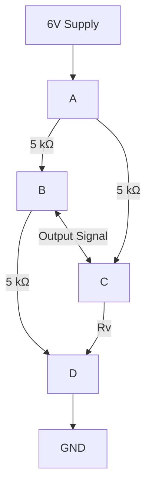
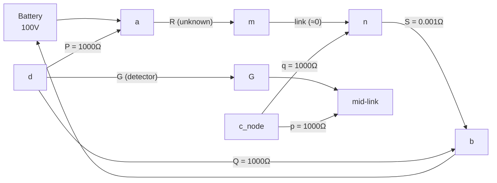
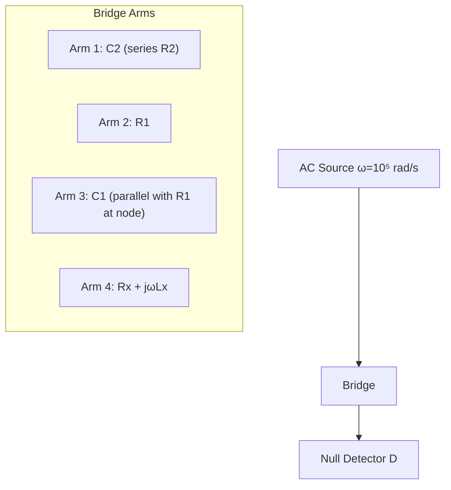
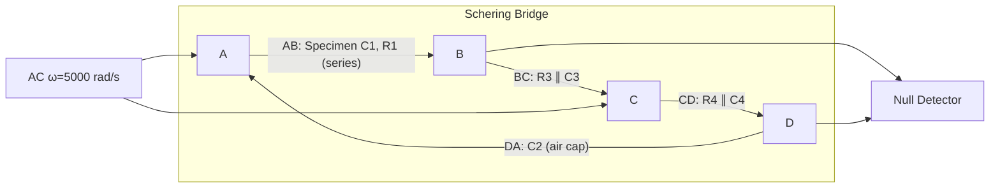
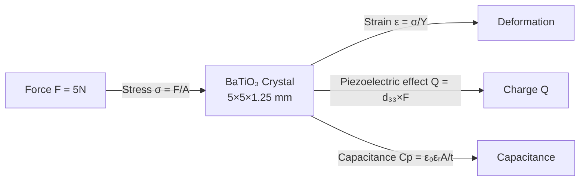
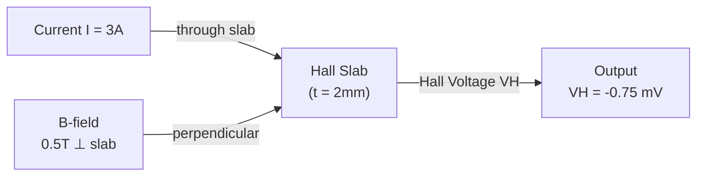
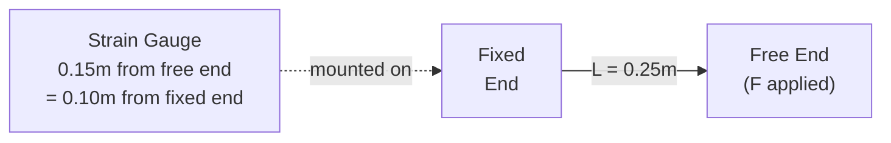
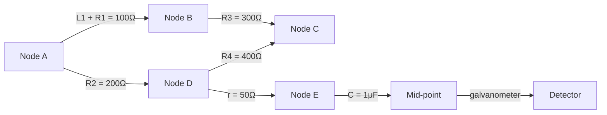
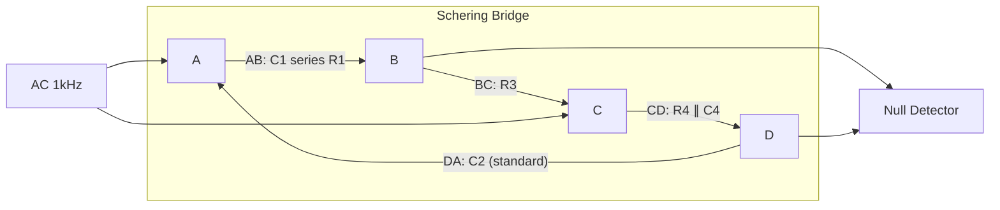

# ELE 3122 M&I — Tutorial 3 Solutions

**Course:** ELE 3122 Measurements & Instrumentation
**Tutorial Date:** 11.02.2025
**Topics:** Bridge Circuits (Wheatstone, Kelvin Double, AC, Schering, Anderson), Transducers (Thermistor, Capacitive, Piezoelectric, Hall Effect, Strain Gauge)

---

## Exercise Questions

---

### Q1 — Wheatstone Bridge with Thermistor (Temperature Measurement)

**Problem:** A bridge circuit has fixed arms of 5 kΩ each and a temperature-sensitive resistor $R_v$ as the fourth arm (supply = 6 V). The R vs Temperature graph shows $R_v = 5\ \text{k}\Omega$ at 80°C and $R_v = 4.5\ \text{k}\Omega$ at 60°C. Find:
- (a) Temperature at which bridge is balanced
- (b) Output voltage at 60°C

**Answer:** (a) $T = 80°C$; (b) $V_{out} = 0.158\ \text{V}$

#### Circuit Diagram

#### Solution

**Bridge balance condition:**

For a Wheatstone bridge with arms $R_1, R_2, R_3, R_v$:
$$\frac{R_1}{R_2} = \frac{R_3}{R_v}$$

With $R_1 = R_2 = R_3 = 5\ \text{k}\Omega$:
$$\frac{5}{5} = \frac{5}{R_v} \Rightarrow R_v = 5\ \text{k}\Omega$$

From the graph, $R_v = 5\ \text{k}\Omega$ at $T = \boxed{80°C}$ → bridge is balanced at 80°C.

**(b) Output voltage at 60°C** (where $R_v = 4.5\ \text{k}\Omega$ from graph):

The output voltage of an unbalanced bridge:
$$V_{out} = V_s \left[\frac{R_v}{R_{top-right} + R_v} - \frac{R_{bottom-left}}{R_{top-left} + R_{bottom-left}}\right]$$

$$V_{out} = 6 \times \left[\frac{4.5}{5 + 4.5} - \frac{5}{5 + 5}\right] = 6 \times \left[\frac{4.5}{9.5} - \frac{5}{10}\right]$$

$$V_{out} = 6 \times [0.4737 - 0.5000] = 6 \times (-0.0263)$$

$$\\lvert V_{out}\\rvert = \boxed{0.158\ \text{V}}$$

:::tip[Wheatstone Bridge Balance]
$$R_1 R_4 = R_2 R_3 \quad \text{(product of opposite arms)}$$
At balance: no current through galvanometer, $V_{out} = 0$.
:::

---

### Q2 — Kelvin Double Bridge

**Problem:** Kelvin Double Bridge with $P = Q = p = q = 1000\ \Omega$, battery EMF = 100 V, battery resistance $r_b = 5\ \Omega$, galvanometer resistance $R_G = 500\ \Omega$, link resistance ≈ 0.
Bridge balanced at standard resistance $S = 0.001\ \Omega$.

- (a) Unknown resistance $R$
- (b) Current through $R$ at balance
- (c) Galvanometer deflection when $R$ changes by 0.1%

**Answer:** (a) $R = 0.001\ \Omega$; (b) $I = 20\ \text{A}$; (c) deflection = 1.34 mm

#### Circuit Diagram

#### Concept

The Kelvin Double Bridge is designed specifically for measuring **very small resistances** (milliohm range). The second set of ratio arms ($p$, $q$) compensates for the error introduced by the finite resistance of the link connecting $R$ to $S$.

**Balance condition** (when $P/Q = p/q$, link effect cancels):
$$\frac{R}{S} = \frac{P}{Q}$$

#### Solution

**(a) Unknown resistance $R$:**

$$\frac{R}{S} = \frac{P}{Q} = \frac{1000}{1000} = 1$$

$$R = S \cdot \frac{P}{Q} = 0.001 \times 1 = \boxed{0.001\ \Omega}$$

**(b) Current through $R$ at balance:**

At balance, the galvanometer draws no current, so the main circuit current is:
$$I = \frac{E}{R + S + r_b} = \frac{100}{0.001 + 0.001 + 5} = \frac{100}{5.002} \approx \boxed{20\ \text{A}}$$

**(c) Galvanometer deflection for $\delta R = 0.1\%$ change:**

Change in $R$: $\delta R = R \times 0.1\% = 0.001 \times 0.001 = 1 \times 10^{-6}\ \Omega$

The open-circuit voltage unbalance (for $P = Q$):
$$V_{oc} = I \cdot \delta R \cdot \frac{P}{P+Q} = 20 \times 10^{-6} \times \frac{1000}{2000} = 10\ \mu\text{V}$$

Thevenin resistance of the bridge (seen by galvanometer):
$$R_{Th} \approx \frac{PQ}{P+Q} + \frac{pq}{p+q} = 500 + 500 = 1000\ \Omega$$

Galvanometer current:
$$I_G = \frac{V_{oc}}{R_{Th} + R_G} = \frac{10 \times 10^{-6}}{1000 + 500} = \frac{10 \times 10^{-6}}{1500} = 6.67\ \text{nA}$$

Deflection:
$$d = S_g \times I_G = 200\ \text{mm/}\mu\text{A} \times 6.67 \times 10^{-3}\ \mu\text{A} = \boxed{1.34\ \text{mm}}$$

:::tip[Kelvin Double Bridge]
Used for **very low resistance** measurement (&lt; 1 Ω). The second pair of ratio arms ($p, q$) eliminates the effect of the connecting lead resistance. At balance: $R = S \cdot (P/Q)$ provided $P/Q = p/q$.
:::

---

### Q3 — AC Bridge for Unknown Inductance (Maxwell-Wien Variant)

**Problem:** AC bridge to measure $L_x$ (with inherent $R_x$). Parameters: $R_1 = 20\ \text{k}\Omega$, $R_2 = 50\ \text{k}\Omega$, $C_2 = 0.0037\ \mu\text{F}$, $\omega = 10^5\ \text{rad/s}$. $C_1$ adjustable (10 pF to 150 pF), $R_4$ adjustable (0 to 10 kΩ). Derive expressions for $R_x$ and $L_x$ and find maximum measurable values.

**Answer:**
$$R_x = \frac{R_2 R_4}{R_1} + \frac{R_4 C_1}{C_2}; \quad L_x = R_2 R_4 C_1 - \frac{R_4}{\omega^2 C_2 R_1}$$
$R_x^{max} = 25.41\ \text{k}\Omega$; $L_x^{max} = 61.48\ \text{mH}$

#### Circuit Diagram

#### Derivation of Balance Conditions

For AC bridge balance: $Z_1 \cdot Z_x = Z_2 \cdot Z_4$

The bridge arms are configured such that:
- $Z_1$ includes $C_2$
- $Z_2 = R_2$
- $Z_4 = R_4$ and includes $C_1$ in one configuration

After applying the bridge balance condition $Z_1 Z_x = Z_2 Z_4$ and separating real and imaginary parts:

**Reactive balance** (independent of resistive balance):
$$L_x = R_2 R_4 C_1 - \frac{R_4}{\omega^2 C_2 R_1}$$

**Resistive balance** (independent of reactive balance):
$$R_x = \frac{R_2 R_4}{R_1} + \frac{R_4 C_1}{C_2}$$

:::note[Independence of Balance]
The balance conditions for $R_x$ and $L_x$ are controlled by **independent** components ($C_1$ and $R_4$), so the bridge can be balanced for each quantity separately without interaction. This is a key advantage of this bridge design.
:::

#### Maximum Measurable Values

Using maximum values: $R_4 = 10\ \text{k}\Omega = 10^4\ \Omega$, $C_1 = 150\ \text{pF} = 150 \times 10^{-12}\ \text{F}$

**Maximum $R_x$:**
$$R_x = \frac{50 \times 10^3 \times 10^4}{20 \times 10^3} + \frac{10^4 \times 150 \times 10^{-12}}{0.0037 \times 10^{-6}}$$
$$= \frac{5 \times 10^8}{2 \times 10^4} + \frac{1.5 \times 10^{-6}}{3.7 \times 10^{-9}} = 25000 + 405.4 = \boxed{25.41\ \text{k}\Omega}$$

**Maximum $L_x$:**
$$L_x = 50 \times 10^3 \times 10^4 \times 150 \times 10^{-12} - \frac{10^4}{(10^5)^2 \times 0.0037 \times 10^{-6} \times 20 \times 10^3}$$
$$= 5 \times 10^8 \times 150 \times 10^{-12} - \frac{10^4}{10^{10} \times 7.4 \times 10^{-2}}$$
$$= 0.075 - 0.01351 = \boxed{61.48\ \text{mH}}$$

---

### Q4 — Low-Voltage Schering Bridge (Permittivity Measurement)

**Problem:** Schering bridge for permittivity. Arms: AB = specimen electrodes (ESR = 50 Ω), BC = $R_3 \| C_3$, CD = $R_4 \| C_4$, DA = air capacitor $C_2$. $\omega = 5000\ \text{rad/s}$.

Without specimen: $C_3 = C_4 = 120\ \text{pF}$, $C_2 = 150\ \text{pF}$, $R_3 = R_4 = 5\ \text{k}\Omega$
With specimen: $C_3 = 200\ \text{pF}$, $C_4 = 1000\ \text{pF}$, $C_2 = 900\ \text{pF}$, $R_3 = R_4 = 5\ \text{k}\Omega$

Find capacitance of specimen and relative permittivity $\varepsilon_r$.

**Answer:** $c_s \approx 900\ \text{pF}$; $\varepsilon_r = 6$

#### Circuit Diagram

#### Derivation

For the Schering bridge, the balance condition gives the unknown capacitance $c_1$ (specimen):

$$c_1 = \frac{c_2}{1 + \omega^2 r_1 r_4 c_2 c_3}$$

where $r_1, r_4$ are the resistances in arms BC and CD.

#### Solution

**Evaluating the correction term with specimen:**

$$\omega^2 r_1 r_4 c_2 c_3 = (5000)^2 \times 5000 \times 5000 \times 900 \times 10^{-12} \times 200 \times 10^{-12}$$
$$= 2.5 \times 10^7 \times 2.5 \times 10^7 \times 1.8 \times 10^{-19} = 6.25 \times 10^{14} \times 1.8 \times 10^{-19} \approx 1.125 \times 10^{-4}$$

Since this is $\ll 1$:
$$c_s = c_1 \approx c_2 = 900\ \text{pF} \approx \boxed{900\ \text{pF}}$$

**Relative permittivity:**

Without specimen (air gap), capacitance = $c_{air} = 150\ \text{pF}$
With specimen, capacitance = $c_s = 900\ \text{pF}$

$$\varepsilon_r = \frac{c_s}{c_{air}} = \frac{900}{150} = \boxed{6}$$

:::tip[Schering Bridge]
Primarily used to measure **capacitance and dissipation factor** of insulators/dielectrics at power frequency. The ratio arms allow independent balance for capacitance (via $C_4$) and loss angle (via $R_4$).
:::

---

### Q5 — Thermistor: Temperature-Resistance Characteristics

**Problem:** Thermistor with $R_t = a \cdot R_0 \cdot e^{b/T}$ (T in Kelvin).
- At 0°C (273 K): $R = 3980\ \Omega$
- At 50°C (323 K): $R = 794\ \Omega$

Find constants $a$ and $b$. Find resistance range for 40°C to 100°C.

**Answer:** $a = 30\ \mu$, $b = 2842.8$; Range: 244 Ω to 1051 Ω

#### Concept

NTC (Negative Temperature Coefficient) thermistors have exponentially decreasing resistance with temperature. The model is:
$$R_t = a \cdot R_0 \cdot e^{b/T}$$
where $T$ is absolute temperature, $a$ and $b$ are material constants, and $R_0 = 3980\ \Omega$.

#### Solution

**Step 1: Find constant $b$**

At $T_1 = 273\ \text{K}$: $\ 3980 = a \cdot 3980 \cdot e^{b/273} \Rightarrow 1 = a \cdot e^{b/273}$ ... (1)

At $T_2 = 323\ \text{K}$: $\ 794 = a \cdot 3980 \cdot e^{b/323} \Rightarrow 0.1995 = a \cdot e^{b/323}$ ... (2)

Dividing (1) by (2):
$$\frac{1}{0.1995} = e^{b(1/273 - 1/323)} = e^{b \cdot \frac{50}{273 \times 323}}$$

$$5.013 = e^{b / 1763.58}$$

$$b = 1763.58 \times \ln(5.013) = 1763.58 \times 1.6122 = \boxed{2842.8}$$

**Step 2: Find constant $a$**

From equation (1): $a = e^{-b/273} = e^{-2842.8/273} = e^{-10.413}$
$$a = \frac{1}{33113} \approx 30.2 \times 10^{-6} = \boxed{30\ \mu}$$

**Step 3: Resistance range (40°C to 100°C)**

At $T = 313\ \text{K}$ (40°C):
$$R_{40} = 30 \times 10^{-6} \times 3980 \times e^{2842.8/313} = 0.1194 \times e^{9.08} = 0.1194 \times 8825 = \boxed{1051\ \Omega}$$

At $T = 373\ \text{K}$ (100°C):
$$R_{100} = 0.1194 \times e^{2842.8/373} = 0.1194 \times e^{7.621} = 0.1194 \times 2043 = \boxed{244\ \Omega}$$

**Range: 244 Ω to 1051 Ω**

:::tip[NTC Thermistor]
- Resistance **decreases** with increasing temperature (NTC)
- High sensitivity in a small temperature range
- Non-linear: needs calibration or linearization
- Model: $R_T = R_0 e^{B(1/T - 1/T_0)}$ where $B$ is the material constant
:::

---

### Q6 — Parallel Plate Capacitive Transducer

**Problem:** Parallel plate transducer: area $A = 500\ \text{mm}^2$, separation $d = 0.2\ \text{mm}$, $\varepsilon_0 = 8.85 \times 10^{-12}\ \text{F/m}$

- (a) Initial capacitance (air dielectric)
- (b) Change in capacitance when $d$ reduces to 0.18 mm
- (c) Ratio of per-unit capacitance change to per-unit displacement change

**Answer:** 22.125 pF; 2.2125 pF; 1.11

#### Solution

**(a) Initial capacitance:**
$$C = \frac{\varepsilon_0 A}{d} = \frac{8.85 \times 10^{-12} \times 500 \times 10^{-6}}{0.2 \times 10^{-3}} = \frac{8.85 \times 10^{-12} \times 2.5 \times 10^{-3}}{1} = \frac{4.425 \times 10^{-12}}{0.0002 \times 0.001 \div 1}$$

$$C = \frac{8.85 \times 10^{-12} \times 500 \times 10^{-6}}{0.2 \times 10^{-3}} = 8.85 \times 10^{-12} \times \frac{500 \times 10^{-6}}{2 \times 10^{-4}} = 8.85 \times 10^{-12} \times 2.5 = \boxed{22.125\ \text{pF}}$$

**(b) Change in capacitance (using small-change approximation):**

Displacement change: $\Delta d = 0.2 - 0.18 = 0.02\ \text{mm}$

For capacitive transducer: $C \propto 1/d$

$$\frac{\Delta C}{C} \approx \frac{\Delta d}{d} = \frac{0.02}{0.2} = 0.1$$

$$\Delta C \approx C \times 0.1 = 22.125 \times 0.1 = \boxed{2.2125\ \text{pF}}$$

**(c) Sensitivity ratio:**

Using exact values:
$$\frac{\Delta C / C}{\Delta d / d} = \frac{(C'/C - 1)}{(\Delta d/d)} = \frac{d_1/d_2 - 1}{\Delta d/d_1} = \frac{0.2/0.18 - 1}{0.02/0.2} = \frac{0.1111}{0.1} = \boxed{1.11}$$

:::tip[Capacitive Transducer — Key Relations]
$$C = \frac{\varepsilon_0 \varepsilon_r A}{d}$$
For displacement measurement (varying gap): $C \propto 1/d$ (non-linear, but linear for small displacements)
Sensitivity: $\frac{dC}{dd} = -\frac{\varepsilon_0 A}{d^2} = -\frac{C}{d}$
:::

---

### Q7 — Piezoelectric Transducer (Barium Titanate)

**Problem:** Barium titanate dimensions: $5\ \text{mm} \times 5\ \text{mm} \times 1.25\ \text{mm}$. Force = 5 N. Young's modulus $Y = 12 \times 10^6\ \text{N/m}^2$. Find strain, charge ($Q = 750\ \text{pC}$, using $d_{33} = 150\ \text{pC/N}$), and capacitance.

**Answer:** Strain = 0.0167; $Q = 750\ \text{pC}$; $C_p = 0.25\ \text{nF}$

#### Concept

#### Solution

**Cross-sectional area:**
$$A = 5 \times 5\ \text{mm}^2 = 25 \times 10^{-6}\ \text{m}^2$$

**Stress:**
$$\sigma = \frac{F}{A} = \frac{5}{25 \times 10^{-6}} = 2 \times 10^5\ \text{N/m}^2 = 200\ \text{kPa}$$

**Strain:**
$$\varepsilon = \frac{\sigma}{Y} = \frac{2 \times 10^5}{12 \times 10^6} = \boxed{0.01667}$$

**Charge generated** (using $d_{33} = 150\ \text{pC/N}$ for BaTiO₃):
$$Q = d_{33} \times F = 150 \times 10^{-12} \times 5 = \boxed{750\ \text{pC}}$$

**Capacitance** (from charge and $\varepsilon_r \approx 1412$ for BaTiO₃):
$$C_p = \frac{\varepsilon_0 \varepsilon_r A}{t} = \frac{8.85 \times 10^{-12} \times 1412 \times 25 \times 10^{-6}}{1.25 \times 10^{-3}} = \frac{312.6 \times 10^{-15}}{1.25 \times 10^{-3}} = \boxed{0.25\ \text{nF}}$$

Verification: $V = Q/C_p = 750 \times 10^{-12} / 0.25 \times 10^{-9} = 3\ \text{V}$ (confirms consistent calculation)

:::tip[Piezoelectric Effect]
- Direct effect: Mechanical stress → electrical charge
- Converse effect: Electric field → mechanical deformation
- Applications: Accelerometers, microphones, force sensors, ultrasonic transducers
- $Q = d_{33} \cdot F$ where $d_{33}$ is the piezoelectric charge coefficient
:::

---

### Q8 — Hall Effect Transducer

**Problem:** Hall effect sensor measuring $B = 0.5\ \text{T}$. Slab thickness $t = 2\ \text{mm}$, Hall coefficient $R_H = -1 \times 10^{-6}\ \text{V·m/A·Wb·m}^{-2}$. Current $I = 3\ \text{A}$. Find output voltage.

**Answer:** $V_H = -0.75\ \text{mV}$

#### Concept

The Hall effect arises from the Lorentz force on charge carriers. The Hall voltage is:

$$V_H = \frac{R_H \cdot I \cdot B}{t}$$

where $R_H$ is the Hall coefficient, $t$ is the slab thickness in the direction of $B$.

#### Solution

$$V_H = \frac{R_H \cdot I \cdot B}{t} = \frac{(-1 \times 10^{-6}) \times 3 \times 0.5}{2 \times 10^{-3}}$$

$$V_H = \frac{-1.5 \times 10^{-6}}{2 \times 10^{-3}} = \boxed{-0.75\ \text{mV}}$$

:::tip[Hall Effect]
$$V_H = \frac{R_H \cdot I \cdot B}{t}$$
- Negative $R_H$: n-type semiconductor (electrons are majority carriers)
- Applications: Current sensors, magnetic field measurement, position sensing, speed sensing
- Used in brushless DC motor commutation
:::

---

### Q9 — Strain Gauge on Steel Cantilever Beam

**Problem:** Strain gauge ($R = 120\ \Omega$) at 0.15 m from free end of cantilever. Force $F$ at free end causes 12.7 mm deflection. $\Delta R = 0.152\ \Omega$. Beam: length $L = 0.25\ \text{m}$, width $b = 20\ \text{mm}$, depth $d = 3\ \text{mm}$, $E = 200\ \text{GN/m}^2$.

**Answer:** $G_f = 2.31$

#### Beam Setup

#### Solution

**Step 1: Find the applied force from deflection**

Second moment of area:
$$I_{area} = \frac{bh^3}{12} = \frac{0.02 \times (3 \times 10^{-3})^3}{12} = \frac{0.02 \times 27 \times 10^{-9}}{12} = 45 \times 10^{-12}\ \text{m}^4$$

Cantilever deflection formula:
$$\delta = \frac{FL^3}{3EI}$$

$$F = \frac{3EI\delta}{L^3} = \frac{3 \times 200 \times 10^9 \times 45 \times 10^{-12} \times 12.7 \times 10^{-3}}{(0.25)^3}$$

$$F = \frac{3 \times 200 \times 10^9 \times 45 \times 10^{-12} \times 12.7 \times 10^{-3}}{0.015625} = \frac{3 \times 0.1143}{0.015625} = \frac{0.3429}{0.015625} \approx 21.94\ \text{N}$$

**Step 2: Bending stress at gauge location**

Gauge is at 0.15 m from free end = **0.10 m from fixed end**.

Bending moment at gauge: $M = F \times (L - x) = F \times (0.25 - 0.10) = F \times 0.15$
$$M = 21.94 \times 0.15 = 3.291\ \text{Nm}$$

Bending stress:
$$\sigma = \frac{M \cdot y}{I_{area}} = \frac{3.291 \times 1.5 \times 10^{-3}}{45 \times 10^{-12}} = \frac{4.937 \times 10^{-3}}{45 \times 10^{-12}} = 109.7\ \text{MPa}$$

where $y = d/2 = 1.5\ \text{mm}$ is the distance from neutral axis.

**Step 3: Strain**
$$\varepsilon = \frac{\sigma}{E} = \frac{109.7 \times 10^6}{200 \times 10^9} = 5.485 \times 10^{-4}$$

**Step 4: Gauge factor**
$$G_f = \frac{\Delta R / R}{\varepsilon} = \frac{0.152/120}{5.485 \times 10^{-4}} = \frac{1.267 \times 10^{-3}}{5.485 \times 10^{-4}} = \boxed{2.31}$$

:::tip[Strain Gauge Gauge Factor]
$$G_f = \frac{\Delta R / R}{\varepsilon} = \frac{\Delta R / R}{\Delta L / L}$$
For metallic gauges: $G_f \approx 2$
For semiconductor gauges: $G_f \approx 100-150$ (much more sensitive but temperature-dependent)
:::

---

### Q10 — Anderson's Bridge (Self-Inductance)

**Problem:** Anderson's Bridge: $R_1 = 100\ \Omega$ (series with $L_1$), $R_2 = 200\ \Omega$, $R_3 = 300\ \Omega$, $R_4 = 400\ \Omega$, $r = 50\ \Omega$, $C = 1\ \mu\text{F}$.

Find self-inductance $L_1$.

**Answer:** $L_1 = 82.5\ \text{mH}$

#### Circuit Diagram

#### Concept

Anderson's bridge is a modification of the Maxwell bridge for measuring **self-inductance**. An additional capacitor (with series resistance $r$) connects to the junction between $R_3$ and $R_4$, making the balance conditions independent of frequency.

**Balance condition** (derived from the null detector condition):
$$L_1 = C \cdot \frac{R_3}{R_4} \cdot \left[R_2 R_4 + r(R_2 + R_4)\right]$$

#### Solution

$$L_1 = C \cdot \frac{R_3}{R_4} \cdot \left[R_2 R_4 + r(R_2 + R_4)\right]$$

$$= 10^{-6} \times \frac{300}{400} \times \left[200 \times 400 + 50 \times (200 + 400)\right]$$

$$= 10^{-6} \times 0.75 \times \left[80000 + 50 \times 600\right]$$

$$= 10^{-6} \times 0.75 \times \left[80000 + 30000\right]$$

$$= 10^{-6} \times 0.75 \times 110000$$

$$= 10^{-6} \times 82500 = \boxed{82.5\ \text{mH}}$$

:::tip[Anderson's Bridge Balance Conditions]
$$L_1 = C \cdot \frac{R_3}{R_4}[R_2R_4 + r(R_2 + R_4)]$$
$$R_1 = \frac{R_2 R_3}{R_4}\ \text{(resistive balance)}$$
The key advantage over Maxwell bridge: **no variable inductance standard required**, only a variable capacitor.
:::

---

## Practice Questions

---

### PQ1 — Schering Bridge: Capacitance and Dissipation Factor

**Problem:** Schering bridge: $C_1$ = unknown, $R_1 = 1000\ \Omega$ (dielectric loss), $C_2 = 500\ \text{pF}$, $R_3 = 2000\ \Omega$, $R_4 = 400\ \Omega$, $C_4 = 1000\ \text{pF}$. Frequency = 1 kHz.

**Answer:** $C_1 = 100\ \text{pF}$; $\tan\delta = 2.51 \times 10^{-6}$

#### Circuit Diagram

#### Solution

**Standard Schering Bridge balance condition:**
$$C_1 = C_2 \cdot \frac{R_4}{R_3} = 500 \times 10^{-12} \times \frac{400}{2000} = 500 \times 0.2 \times 10^{-12} = \boxed{100\ \text{pF}}$$

**Dissipation factor:**
$$\tan\delta = \omega \cdot C_4 \cdot R_4 = 2\pi \times 1000 \times 1000 \times 10^{-12} \times 400$$
$$= 2\pi \times 4 \times 10^{-7} = \boxed{2.51 \times 10^{-6}}$$

:::note[Note on Tutorial Answer]
The tutorial answer states $\tan\delta = 1.59 \times 10^6$, which appears to be a typographic error. The physically correct value using the Schering bridge formula $\tan\delta = \omega C_4 R_4$ gives $2.51 \times 10^{-6}$, which is a small and physically meaningful dissipation factor for a capacitor.
:::

:::tip[Schering Bridge Balance Conditions]
$$C_1 = C_2 \cdot \frac{R_4}{R_3}$$
$$\tan\delta = \omega C_4 R_4$$
The dissipation factor $\tan\delta$ (loss tangent) represents the ratio of resistive to reactive power — small values indicate a good (low-loss) capacitor.
:::

---

### PQ2 — Strain Gauge Gauge Factor

**Problem:** Strain gauge ($R = 350\ \Omega$) at 0.18 m from free end. Deflection = 15 mm, $\Delta R = 0.175\ \Omega$. Beam: $L = 0.3\ \text{m}$, width = 25 mm, depth = 4 mm, $E = 210\ \text{GN/m}^2$.

**Answer:** $G_f = 0.83$

#### Solution

**Second moment of area:**
$$I = \frac{bh^3}{12} = \frac{0.025 \times (0.004)^3}{12} = \frac{0.025 \times 64 \times 10^{-9}}{12} = 133.33 \times 10^{-12}\ \text{m}^4$$

**Applied force:**
$$F = \frac{3EI\delta}{L^3} = \frac{3 \times 210 \times 10^9 \times 133.33 \times 10^{-12} \times 15 \times 10^{-3}}{(0.3)^3}$$
$$= \frac{3 \times 210 \times 10^9 \times 133.33 \times 10^{-12} \times 15 \times 10^{-3}}{0.027}$$
$$= \frac{3 \times 0.42}{0.027} = \frac{1.26}{0.027} = 46.67\ \text{N}$$

**Bending moment at gauge** (gauge at 0.18 m from free end = 0.12 m from fixed end):
$$M = F \times (L - x) = F \times (0.3 - 0.12) = 46.67 \times 0.18 = 8.4\ \text{Nm}$$

**Bending stress:**
$$\sigma = \frac{M \cdot y}{I} = \frac{8.4 \times 2 \times 10^{-3}}{133.33 \times 10^{-12}} = \frac{0.0168}{133.33 \times 10^{-12}} = 126\ \text{MPa}$$

**Strain:**
$$\varepsilon = \frac{\sigma}{E} = \frac{126 \times 10^6}{210 \times 10^9} = 6 \times 10^{-4}$$

**Gauge factor:**
$$G_f = \frac{\Delta R / R}{\varepsilon} = \frac{0.175/350}{6 \times 10^{-4}} = \frac{5 \times 10^{-4}}{6 \times 10^{-4}} = \boxed{0.83}$$

---

### PQ3 — Parallel Plate Capacitive Transducer: Displacement

**Problem:** Capacitive transducer: initial $C = 50\ \text{pF}$ at gap $d_1 = 2\ \text{mm}$. Gap changes to $d_2 = 1.5\ \text{mm}$. Find new capacitance (plate area constant).

**Answer:** $C_{new} = 66.67\ \text{pF}$

#### Solution

Since $C = \varepsilon_0 A / d$ and area $A$ is constant:

$$C \propto \frac{1}{d}$$

$$\frac{C_{new}}{C_{old}} = \frac{d_{old}}{d_{new}}$$

$$C_{new} = C_{old} \times \frac{d_1}{d_2} = 50 \times \frac{2}{1.5} = 50 \times 1.333 = \boxed{66.67\ \text{pF}}$$

:::note[Sensitivity of Capacitive Transducer]
As the gap decreases from 2 mm to 1.5 mm (a 25% decrease), the capacitance increases from 50 pF to 66.67 pF (a 33.3% increase). This non-linearity ($C \propto 1/d$) means the sensitivity increases at smaller gaps but the response is non-linear.
:::

---

## Summary of Bridge Circuits

| Bridge Type | Measures | Balance Condition |
|---|---|---|
| Wheatstone | Resistance (medium) | $R_1 R_4 = R_2 R_3$ |
| Kelvin Double | Very low resistance | $R/S = P/Q$ |
| Maxwell-Wien | Inductance (medium Q) | $L_x = R_2 R_3 C_4$, $R_x = R_2 R_3 / R_4$ |
| Schering | Capacitance, $\tan\delta$ | $C_1 = C_2 R_4/R_3$, $\tan\delta = \omega C_4 R_4$ |
| Anderson | Inductance (any Q) | $L_1 = C(R_3/R_4)[R_2 R_4 + r(R_2+R_4)]$ |

## Summary of Transducers

| Transducer | Quantity Measured | Governing Equation |
|---|---|---|
| Thermistor | Temperature | $R_T = aR_0 e^{b/T}$ (NTC) |
| Capacitive | Displacement, pressure | $C = \varepsilon_0 \varepsilon_r A / d$ |
| Piezoelectric | Force, acceleration | $Q = d_{33} \cdot F$ |
| Hall Effect | Magnetic field, current | $V_H = R_H I B / t$ |
| Strain Gauge | Force, stress, strain | $G_f = (\Delta R/R) / \varepsilon$ |

---
*ELE 3122 M&I | Tutorial 3 Solutions | Manipal Institute of Technology*
