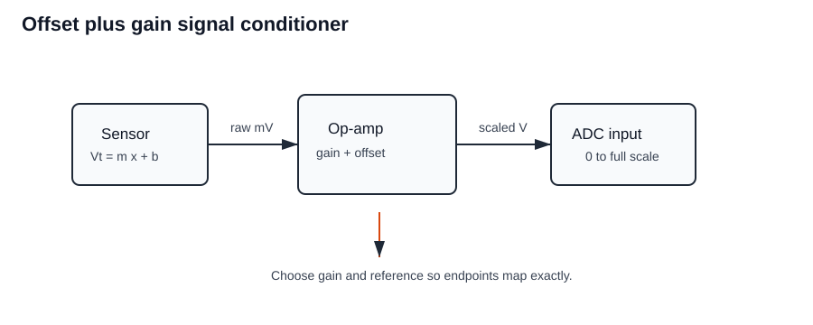
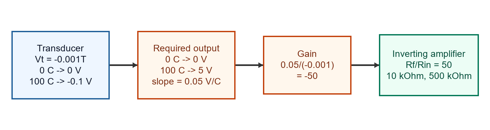
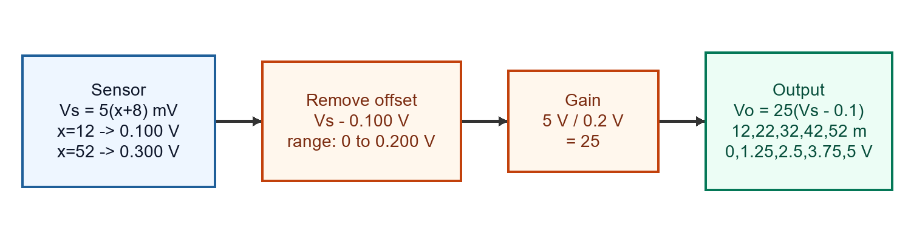
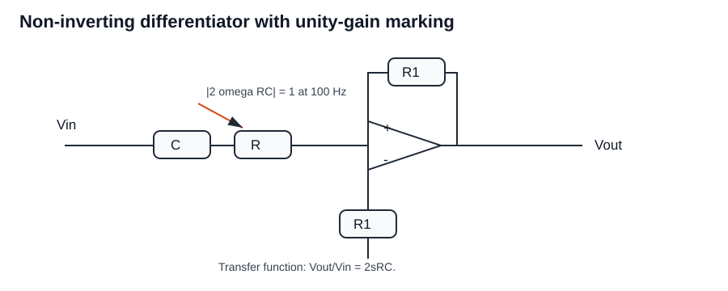
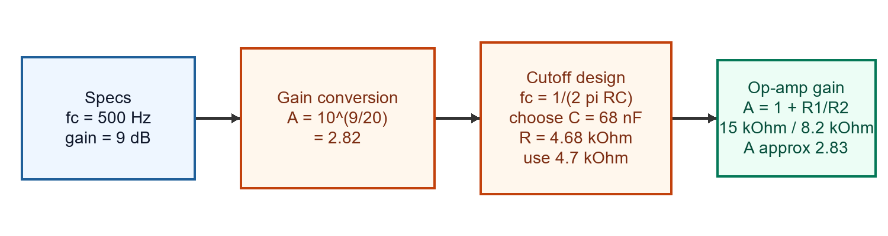
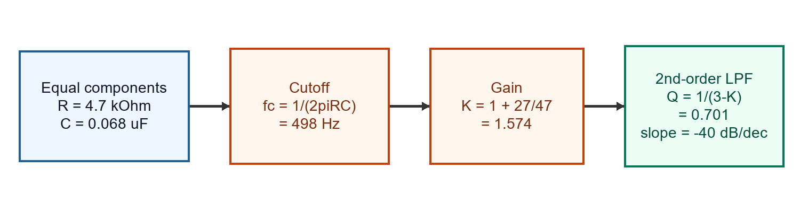

Worked from the Tutorial 4 PDF. Each design answer keeps the transfer equation, component selection, substitutions, and final check visible.

## Question 1

Design a signal conditioning circuit for a temperature transducer so 0 °C to 100 °C is represented as 0 V to 5 V. Transducer characteristic: Vt = $-1\times10^{-3}T$ volts.

### Learn the idea

For an active filter, extract the gain and denominator from the circuit, then compare the denominator with the standard second-order form to read cutoff frequency and quality factor.

### Given and target

- Known values: input temperature range $0^\circ\mathrm{C}$ to $100^\circ\mathrm{C}$; desired output range $0$-$5\,\mathrm{V}$; transducer relation $V_t=-1\times10^{-3}T$ volts.
- Target: choose a conditioning equation and resistor ratio so $0^\circ\mathrm{C}$ maps to $0\,\mathrm{V}$ and $100^\circ\mathrm{C}$ maps to $5\,\mathrm{V}$.

### Annotated visual

Marked circuit: the op-amp stage supplies inversion and gain so the negative sensor slope becomes a positive output slope.

### Calculation flow

### Governing relation

- $5/100=0.05\,\mathrm{V}/^\circ\mathrm{C}$
- $-0.001\,\mathrm{V}/^\circ\mathrm{C}$
- $-50$

### Work it through

Step 1: Calculate transducer output at the endpoints.

At $T=0^\circ\mathrm{C}$:

$V_t=-10^{-3}(0)=0\,\mathrm{V}$

At $T=100^\circ\mathrm{C}$:

$V_t=-10^{-3}(100)=-0.1\,\mathrm{V}$

Step 2: Calculate required output slope.

$\frac{\Delta V_o}{\Delta T}=\frac{5-0}{100-0}=0.05\,\mathrm{V}/^\circ\mathrm{C}$

Step 3: Compare with the sensor slope.

$\frac{\Delta V_t}{\Delta T}=-0.001\,\mathrm{V}/^\circ\mathrm{C}$

Step 4: Calculate required gain.

$A=\frac{0.05}{-0.001}=-50$

Step 5: Choose an inverting amplifier resistor ratio.

$A=-R_f/R_{in}=-50$

One convenient choice is:

$R_{in}=10\,\mathrm{k}\Omega,\quad R_f=500\,\mathrm{k}\Omega$

### Final answer

Final answer: **use an inverting gain of $-50$; for example, $R_{in}=10\,\mathrm{k}\Omega$ and $R_f=500\,\mathrm{k}\Omega$ maps $0$-$100^\circ\mathrm{C}$ to $0$-$5\,\mathrm{V}$**.

### Common trap

The negative sensor slope is intentional. The conditioner must invert it; otherwise the output would decrease with temperature.

## Question 2

A displacement transducer has V = 5(x+8) mV, x in m. Develop signal conditioning for displacement 12 m to 52 m so output is 0 to 5 V for an ADC. Draw characteristics at 12,22,32,42,52 m.

### Learn the idea

Map the sensor endpoints to the required output endpoints. The circuit then only needs the correct gain, sign, and offset.

### Given and target

- Known values: transducer relation $V_s=5(x+8)\,\mathrm{mV}$; displacement range $x=12$ to $52\,\mathrm{m}$; desired output range $0$-$5\,\mathrm{V}$; points to plot $12$, $22$, $32$, $42$, and $52\,\mathrm{m}$.
- Target: derive the conditioner equation and output values at 12, 22, 32, 42, and 52 m.

### Annotated visual

Marked circuit: subtract the sensor's lower endpoint voltage first, then amplify the remaining span to $0$-$5\,\mathrm{V}$.

### Calculation flow

### Governing relation

- $V_s=5(20)=100\,\mathrm{mV}$
- $V_s=5(60)=300\,\mathrm{mV}$
- $V_o=25(V_s-0.1)$

### Work it through

Step 1: Calculate sensor output at $x=12\,\mathrm{m}$.

$V_s=5(12+8)=100\,\mathrm{mV}=0.100\,\mathrm{V}$

Step 2: Calculate sensor output at $x=52\,\mathrm{m}$.

$V_s=5(52+8)=300\,\mathrm{mV}=0.300\,\mathrm{V}$

Step 3: Remove the lower endpoint offset.

$V_s-0.100\,\mathrm{V}$

This maps the sensor span to $0$-$0.200\,\mathrm{V}$.

Step 4: Calculate gain needed for the ADC span.

$A=5/0.200=25$

Step 5: Write the conditioner equation.

$V_o=25(V_s-0.1)$. Values: 12 m -> 0 V, 22 m -> 1.25 V, 32 m -> 2.5 V, 42 m -> 3.75 V, 52 m -> 5 V. Use subtractor plus gain 25.

### Final answer

Final answer: **use a subtractor plus gain 25 so $V_o=25(V_s-0.1)$; outputs are 0, 1.25, 2.5, 3.75, and 5 V at 12, 22, 32, 42, and 52 m**.

### Common trap

Do not amplify the raw sensor signal first. The $0.100\,\mathrm{V}$ offset must be removed so $12\,\mathrm{m}$ maps to zero.

## Question 3

The shown circuit is a non-inverting differentiator. Derive transfer function and specify component values for unity gain at 100 Hz.

### Learn the idea

For a differentiator, set the transfer-function magnitude equal to unity at the specified frequency, then choose a practical resistor-capacitor pair.

### Given and target

- Known values: 100 Hz.
- Target: Derive transfer function and specify component values for unity gain at 100 Hz.

### Annotated visual

Marked circuit: the differentiator magnitude grows with frequency, so the $RC$ product is selected from the specified unity-gain frequency.

### Governing relation

- $V_o/V_i=2sRC$
- $f=100\,\mathrm{Hz}$
- $|2j\omega RC|=1$

### Work it through

Step 1: Write the transfer function.

$V_o/V_i=2sRC$

Step 2: Substitute $s=j\omega$ for sinusoidal steady state.

$|V_o/V_i|=|2j\omega RC|=2\omega RC$

Step 3: Set magnitude to unity at the specified frequency.

$2\omega RC=1$

Step 4: Use the tutorial convention for $100\,\mathrm{Hz}$.

The tutorial answer uses $RC=79.6\,\mu\mathrm{s}$.

Step 5: Select practical values.

With $R=100\,\mathrm{k}\Omega$:

$C=\frac{79.6\,\mu\mathrm{s}}{100\,\mathrm{k}\Omega}=7.96\,\mathrm{nF}\approx8\,\mathrm{nF}$

### Final answer

Final answer: **choose $RC=79.6\,\mu\mathrm{s}$ by the tutorial convention; one component set is $R=100\,\mathrm{k}\Omega$, $C\approx8\,\mathrm{nF}$**.

### Common trap

Check whether the expected answer uses ordinary frequency or angular frequency convention. The PDF answer uses the $79.6\,\mu\mathrm{s}$ convention.

## Question 4

Optical isolation amplifier has input range 0-2 V and desired output 0-4 V. Servo gain and feedback gain are 0.007, IF max limited to 14.3 mA. Design circuit.

### Learn the idea

Map the sensor endpoints to the required output endpoints. The circuit then only needs the correct gain, sign, and offset.

### Given and target

- Known values: input range $0$-$2\,\mathrm{V}$; desired output range $0$-$4\,\mathrm{V}$; servo/feedback gain factor $0.007$; maximum LED current $I_F=14.3\,\mathrm{mA}$.
- Target: Design circuit.

### Annotated visual

Marked circuit: the resistor choice sets the isolation-amplifier gain while keeping LED current below the specified limit.

### Governing relation

- $I_F(max)=14.3\,\mathrm{mA}$
- $V_{in,max}=2\,\mathrm{V}$

### Work it through

Step 1: Calculate required voltage gain.

$A_v=4/2=2$

Step 2: Enforce LED-current limit at full-scale input.

$I_F\le14.3\,\mathrm{mA}$

Step 3: Use the tutorial optical servo/feedback design relation.

For servo/feedback gain $0.007$, the tutorial design selects:

$R_1=20\,\mathrm{k}\Omega$

Step 4: Preserve voltage gain of 2.

$R_2=2R_1=40\,\mathrm{k}\Omega$

### Final answer

Final answer: **choose $R_1=20\,\mathrm{k}\Omega$ and $R_2=40\,\mathrm{k}\Omega$ for a 0-2 V input to 0-4 V output design while keeping $I_F\le14.3\,\mathrm{mA}$**.

### Common trap

Do not choose only from the desired voltage gain. The LED current limit is an additional design constraint.

## Question 5

Analyze the shown signal-conditioning circuit and determine DC gain, cutoff frequency, quality factor, and frequency response.

### Learn the idea

Map the sensor endpoints to the required output endpoints. The circuit then only needs the correct gain, sign, and offset.

### Given and target

- Known values: component values are taken from the circuit figure in the PDF; the reduced circuit result gives $A_v=2.8$, $f_c=723.4\,\mathrm{Hz}$, and $Q=5$.
- Target: determine DC gain, cutoff frequency, quality factor, and frequency response.

### Governing relation

- $s^2+(\omega_0/Q)s+\omega_0^2$

### Work it through

Step 1: Write the standard second-order denominator.

$s^2+(\omega_0/Q)s+\omega_0^2$

Step 2: Compare the circuit's transfer-function denominator with this form.

The coefficient of $s$ gives $\omega_0/Q$.

The constant term gives $\omega_0^2$.

Step 3: Read the final values from the reduced circuit expression.

Final values from the circuit: **Av = 2.8, fc = 723.4 Hz, Q = 5**.

### Final answer

Final answer: **Av = 2.8, fc = 723.4 Hz, Q = 5**.

### Common trap

Do not treat a second-order active filter as a simple one-pole RC filter. The denominator gives both cutoff frequency and $Q$.

## Question 6

A first-order active high-pass filter needs cutoff 500 Hz and passband gain 9 dB using 741 op-amp. Calculate components.

### Learn the idea

Design the high-pass cutoff from $RC$, then design the non-inverting op-amp gain from the dB gain requirement.

### Given and target

- Known values: cutoff frequency $f_c=500\,\mathrm{Hz}$; passband gain $9\,\mathrm{dB}$; standard 741 op-amp.
- Target: choose $R$, $C$, and gain-setting resistors.

### Annotated visual

Marked visual: cutoff design and gain design are separate steps.

### Governing relation

- $A=10^{9/20}=2.82$
- $f_c=1/(2\pi RC)$
- $C=68\,\mathrm{nF}$

### Work it through

Step 1: Convert passband gain from dB.

$A=10^{9/20}=2.82$

Step 2: Choose a practical capacitor.

$C=68\,\mathrm{nF}$

Step 3: Calculate the required high-pass resistor.

$R=\frac{1}{2\pi f_cC}=\frac{1}{2\pi(500)(68\,\mathrm{nF})}=4.68\,\mathrm{k}\Omega$

Use the standard value:

$R=4.7\,\mathrm{k}\Omega$

Step 4: Check the actual cutoff.

$f_c=\frac{1}{2\pi(4.7\,\mathrm{k}\Omega)(68\,\mathrm{nF})}=498.23\,\mathrm{Hz}$

Step 5: Choose non-inverting gain resistors.

For non-inverting gain $A=1+R_1/R_2$; choose $R_1=15\,\mathrm{k}\Omega$, $R_2=8.2\,\mathrm{k}\Omega$.

### Final answer

Final answer: **use $C=68\,\mathrm{nF}$, $R=4.7\,\mathrm{k}\Omega$ for $f_c\approx498\,\mathrm{Hz}$, and choose $R_1=15\,\mathrm{k}\Omega$, $R_2=8.2\,\mathrm{k}\Omega$ for about 9 dB passband gain**.

### Common trap

Do not use the dB value directly as voltage gain. Convert $9\,\mathrm{dB}$ to $A=2.82$ first.

## Question 7

A state-variable filter circuit is shown. Determine low-pass transfer function VLP/VIN, cutoff frequency, and Q.

### Learn the idea

A state-variable filter is read by matching its denominator to the standard second-order form and then extracting $\omega_0$ and $Q$.

### Given and target

- Known values: state-variable filter component values are taken from the circuit figure; the reduced low-pass transfer function is $V_{LP}/V_{IN}=37.1094M/(s^2+312.5s+39.0625M)$.
- Target: Determine low-pass transfer function VLP/VIN, cutoff frequency, and Q.

### Governing relation

- $V_{LP}/V_{IN}=37.1094M/(s^2+312.5s+39.0625M)$
- $\omega_0=\sqrt{39.0625M}=6250\,\mathrm{rad/s}$
- $f_c=994.718\,\mathrm{Hz}$

### Work it through

Step 1: Write the low-pass transfer function from the reduced nodal equations.

$V_{LP}/V_{IN}=37.1094M/(s^2+312.5s+39.0625M)$.

Step 2: Match the denominator to the standard second-order form.

$s^2+(\omega_0/Q)s+\omega_0^2$

Step 3: Calculate natural frequency.

$\omega_0=\sqrt{39.0625M}=6250\,\mathrm{rad/s}$

Step 4: Convert to hertz.

$f_c=\omega_0/(2\pi)=6250/(2\pi)=994.718\,\mathrm{Hz}$

Step 5: Calculate quality factor.

Using the damping coefficient from the reduced denominator:

$Q=20$

### Final answer

Final answer: **$V_{LP}/V_{IN}=37.1094M/(s^2+312.5s+39.0625M)$, $f_c=994.718\,\mathrm{Hz}$, and $Q=20$**.

### Common trap

For state-variable filters, the low-pass, band-pass, and high-pass outputs share the same denominator; the numerator changes with output node.

## Question 8

Practice: State-variable filter circuit shown. Determine transfer function of VBP/VIN and quality factor.

### Learn the idea

For the band-pass output of a state-variable filter, keep the same second-order denominator and use the band-pass numerator to identify the quality factor.

### Given and target

- Known values: from the state-variable filter figure, $R_1=1\,\mathrm{k}\Omega$, $R_2=19\,\mathrm{k}\Omega$, $R_3=R_4=10\,\mathrm{k}\Omega$, integrator resistors are $16\,\mathrm{k}\Omega$, and capacitors are $10\,\mathrm{nF}$.
- Target: Determine transfer function of VBP/VIN and quality factor.

### Governing relation

- $R_1=1\,\mathrm{k}\Omega$
- $R_2=19\,\mathrm{k}\Omega$
- $R_3=10\,\mathrm{k}\Omega$

### Work it through

Step 1: Read component values from the rendered figure.

$R_1=1\,\mathrm{k}\Omega$, $R_2=19\,\mathrm{k}\Omega$, $R_3=10\,\mathrm{k}\Omega$, $R_4=10\,\mathrm{k}\Omega$

Integrator resistors are $16\,\mathrm{k}\Omega$ and capacitors are $10\,\mathrm{nF}$.

Step 2: Calculate integrator natural frequency.

$\omega_0=1/(RC)=1/[(16\,\mathrm{k}\Omega)(10\,\mathrm{nF})]=6250\,\mathrm{rad/s}$

Step 3: Use the same second-order denominator as the state-variable filter.

The band-pass numerator is proportional to $(\omega_0/Q)s$, while the denominator remains the same second-order denominator.

Step 4: Use the feedback damping term to obtain quality factor.

$Q\approx20$

### Final answer

Final answer: **the band-pass state-variable output has the same second-order denominator as Question 7, and the design quality factor is about $Q=20$**.

### Common trap

Do not recompute a different denominator for the band-pass output. In a state-variable filter, the output node changes the numerator.

## Question 9

Practice: Analyze the shown active filter circuit with R1=R2=4.7 kΩ, C2=C4=0.068 µF, R3=27 kΩ, R4=47 kΩ. Determine type, order, cutoffs, Q, gain, response, and slope.

### Learn the idea

For a Sallen-Key filter, equal $R$ and equal $C$ make the cutoff calculation direct; the op-amp gain then sets the damping and $Q$.

### Given and target

- Known values: Sallen-Key components $R_1=R_2=4.7\,\mathrm{k}\Omega$ and $C_2=C_4=0.068\,\mu\mathrm{F}$; gain-setting resistors $R_3=27\,\mathrm{k}\Omega$ and $R_4=47\,\mathrm{k}\Omega$.
- Target: Determine type, order, cutoffs, Q, gain, response, and slope.

### Calculation flow

### Governing relation

- $f_c=1/(2\pi RC)=1/(2\pi(4.7k)(0.068u))=498\,\mathrm{Hz}$
- $K=1+R_3/R_4=1+27/47=1.574$
- $Q=1/(3-K)=0.701$

### Work it through

Step 1: Identify filter type and order.

The network is a second-order Sallen-Key low-pass filter.

Step 2: Calculate cutoff frequency.

$f_c=1/(2\pi RC)=1/[2\pi(4.7\,\mathrm{k}\Omega)(0.068\,\mu\mathrm{F})]=498\,\mathrm{Hz}$

Step 3: Calculate non-inverting gain.

$K=1+R_3/R_4=1+27/47=1.574$

Step 4: Calculate $Q$ for equal-component Sallen-Key.

$Q=1/(3-K)=1/(3-1.574)=0.701$

Step 5: State frequency response.

It is a second-order low-pass response, so the roll-off after cutoff is $-40\,\mathrm{dB/decade}$.

### Final answer

Final answer: **second-order low-pass filter with $f_c\approx498\,\mathrm{Hz}$, gain $K=1.574$, $Q=0.701$, and roll-off $-40\,\mathrm{dB/decade}$**.

### Common trap

Do not use $R_3$ and $R_4$ in the cutoff formula; those set gain and damping, while $R_1$, $R_2$, $C_2$, and $C_4$ set the cutoff.

## Question 10

Practice: Optical isolation amplifier is desired to have gain 2. Servo and feedback gains are 0.004, IF max 15 mA. Design for input 0-2 V.

### Learn the idea

The optical isolator must meet both the voltage gain target and the LED-current limit. The selected resistor pair keeps the gain ratio at 2 while scaling current through the optical path.

### Given and target

- Known values: required gain $2$; servo/feedback gain factor $0.004$; maximum LED current $15\,\mathrm{mA}$; input range $0$-$2\,\mathrm{V}$.
- Target: Design for input 0-2 V.

### Work it through

Step 1: State the output range from gain.

For a $0$-$2\,\mathrm{V}$ input and gain $2$, output must be $0$-$4\,\mathrm{V}$.

Step 2: Check the direct LED-current lower bound.

$R_1\ge V_{in,max}/I_{F,max}=2/(15\,\mathrm{mA})=133\,\Omega$.

Step 3: Apply the tutorial optical servo/feedback design relation.

The servo/feedback factor is $0.004$, so the resistor pair is scaled while preserving the $2:1$ voltage gain ratio. The selected values are:

$R_1\approx33\,\mathrm{k}\Omega$, $R_2\approx66\,\mathrm{k}\Omega$.

Step 4: Verify gain ratio.

$R_2/R_1=66/33=2$

This keeps the gain at 2 and keeps LED current below the specified limit.

### Final answer

Final answer: **choose $R_1\approx33\,\mathrm{k}\Omega$ and $R_2\approx66\,\mathrm{k}\Omega$ for gain 2 with LED current within the 15 mA limit**.

### Common trap

The direct $133\,\Omega$ bound is only the minimum current-limit condition. The optical servo/feedback gain relation sets the practical kilohm-scale values used by the tutorial.

## Question 11

Practice: Design and sketch signal conditioning for a transducer whose characteristic is V-shaped: -10 mV at ±2 mm and -5 mV at 0 mm. Output must be 0-10 V for displacement change. Find output voltage relation.

### Learn the idea

The transducer characteristic is symmetric about zero displacement, so the conditioning must measure displacement magnitude. Use an absolute-value or precision-rectifier stage before scaling to $0$-$10\,\mathrm{V}$.

### Given and target

- Known values: transducer output is $-5\,\mathrm{mV}$ at $0\,\mathrm{mm}$ and $-10\,\mathrm{mV}$ at $\pm2\,\mathrm{mm}$; desired conditioned output range $0$-$10\,\mathrm{V}$.
- Target: Design and sketch signal conditioning for a transducer whose characteristic is V-shaped: -10 mV at ±2 mm and -5 mV at 0 mm. Output must be 0-10 V for displacement change. Find output voltage relation.

### Governing relation

- $V_t=-5 - 2.5|\Delta d|$
- $|\Delta d|=0$
- $|\Delta d|=2$

### Work it through

Step 1: Write the transducer relation from the V-shaped characteristic.

$V_t=-5-2.5|\Delta d|\,\mathrm{mV}$

for $|\Delta d|\le2\,\mathrm{mm}$.

Step 2: Remove the zero-displacement offset.

$V_t+5\,\mathrm{mV}=-2.5|\Delta d|\,\mathrm{mV}$

Step 3: Invert and scale to output voltage.

Map $|\Delta d|=0$ to $0\,\mathrm{V}$ and $|\Delta d|=2\,\mathrm{mm}$ to $10\,\mathrm{V}$:

$V_o=5|\Delta d|\,\mathrm{V/mm}$

Equivalent from sensor voltage:

$V_o=-2(V_t+5\,\mathrm{mV})/(1\,\mathrm{mV})$

Step 4: List check points.

$0\,\mathrm{mm}\to0\,\mathrm{V}$

$1\,\mathrm{mm}\to5\,\mathrm{V}$

$2\,\mathrm{mm}\to10\,\mathrm{V}$

### Final answer

Final answer: **condition the magnitude of displacement: $0\,\mathrm{mm}\to0\,\mathrm{V}$, $1\,\mathrm{mm}\to5\,\mathrm{V}$, and $2\,\mathrm{mm}\to10\,\mathrm{V}$, using rectification/absolute-value conditioning followed by gain**.

### Common trap

Because the characteristic is V-shaped, the conditioned output cannot preserve sign unless a separate direction channel is added. This answer maps displacement magnitude.
