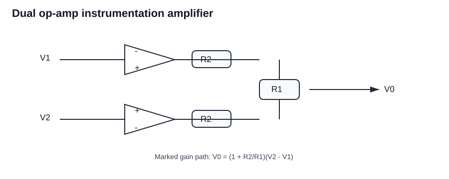
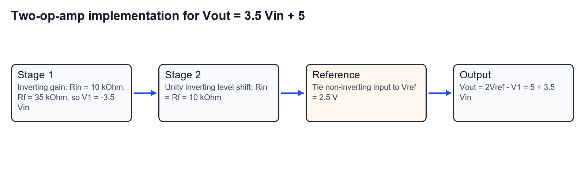
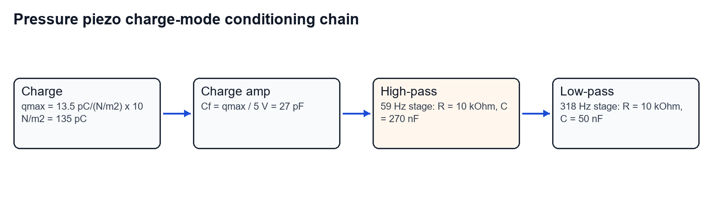
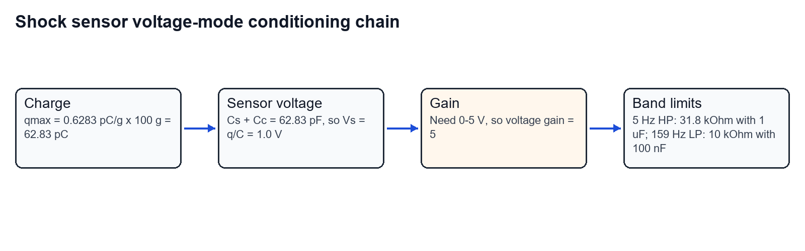
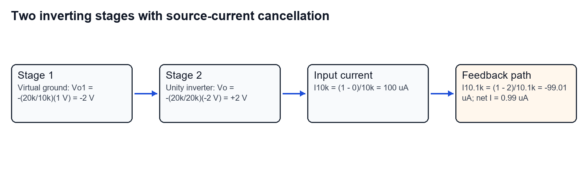
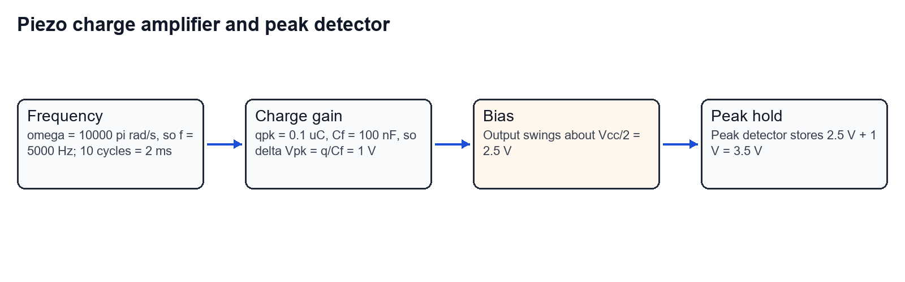
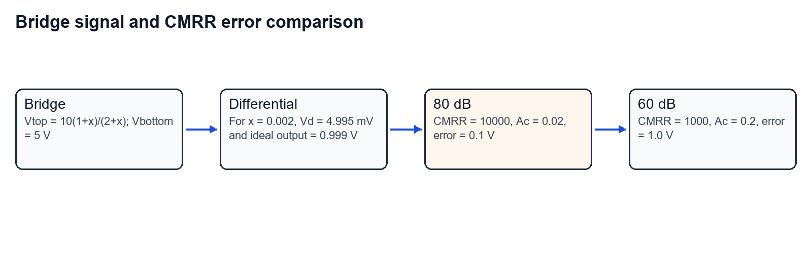
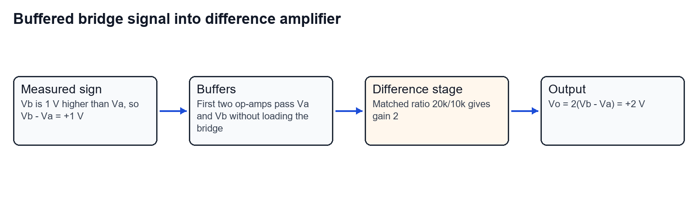

Worked from the Tutorial 5 PDF. Each answer is written as a marked calculation: given data, governing relation, substitution, result, and a short check.

## Question 1

A dual op-amp instrumentation amplifier offers high CMRR with potentiometer adjustment. Derive the mathematical model and prove

$$
V_0=\left(1+\frac{R_2}{R_1}\right)(V_2-V_1).
$$

### Given and target

- Inputs: $V_1$ and $V_2$.
- Matched resistor arms: $R_1$ and $R_2$.
- Trimming element: potentiometer used to balance resistor mismatch.
- Target: prove the differential gain expression and explain why the circuit gives good CMRR.

### Circuit marking

### Step-by-step derivation

**Step 1: Apply ideal op-amp input rules.**

For ideal op-amps, input currents are zero. With negative feedback, each input pair is forced to nearly the same voltage.

Therefore the node controlled by the $V_1$ side follows $V_1$, and the node controlled by the $V_2$ side follows $V_2$.

**Step 2: Write the differential voltage across the gain-setting path.**

The voltage driving the central gain-setting network is

$$
V_d=V_2-V_1.
$$

**Step 3: Convert differential voltage to current through $R_1$.**

The current through the $R_1$ path is

$$
I=\frac{V_2-V_1}{R_1}.
$$

**Step 4: Find the extra output contribution across $R_2$.**

The same differential current produces a voltage contribution across the matched $R_2$ feedback arm:

$$
V_{R_2}=IR_2=\frac{R_2}{R_1}(V_2-V_1).
$$

**Step 5: Add the direct differential term.**

The output contains the original differential term plus the feedback-arm contribution:

$$
V_0=(V_2-V_1)+\frac{R_2}{R_1}(V_2-V_1).
$$

Factor the common term:

$$
V_0=\left(1+\frac{R_2}{R_1}\right)(V_2-V_1).
$$

**Step 6: State the CMRR role of the potentiometer.**

If the same common-mode voltage appears on both inputs, it should cancel. In practice, resistor mismatch leaves a small common-mode output. The potentiometer trims this mismatch, so common-mode gain is minimized and CMRR is maximized.

### Final answer

$$
\boxed{V_0=\left(1+\frac{R_2}{R_1}\right)(V_2-V_1)}
$$

The potentiometer is used for common-mode balance, which improves CMRR.

## Question 2

Design an instrumentation circuit such that

$$
V_{out}=3.5V_{in}+5
$$

using two $35\,\mathrm{k\Omega}$ resistors, three $10\,\mathrm{k\Omega}$ resistors, and two IC 741 op-amps.

### Given and target

- Required transfer: $V_{out}=3.5V_{in}+5$.
- Available resistors: two $35\,\mathrm{k\Omega}$ and three $10\,\mathrm{k\Omega}$.
- Available active devices: two 741 op-amps.
- Target: realize gain $3.5$ and offset $+5\,\mathrm{V}$.

### Design map

### Step-by-step design

**Step 1: Create a gain magnitude of 3.5.**

Use the first op-amp as an inverting amplifier:

$$
V_1=-\frac{R_f}{R_{in}}V_{in}.
$$

Choose

$$
R_f=35\,\mathrm{k\Omega},\qquad R_{in}=10\,\mathrm{k\Omega}.
$$

Then

$$
V_1=-\frac{35}{10}V_{in}=-3.5V_{in}.
$$

**Step 2: Use the second op-amp to invert again.**

Use the second op-amp with

$$
R_f=10\,\mathrm{k\Omega},\qquad R_{in}=10\,\mathrm{k\Omega}.
$$

That gives a unity inverting path for $V_1$.

**Step 3: Add the offset through the non-inverting reference.**

For an inverting stage whose non-inverting input is held at $V_{ref}$,

$$
V_{out}=V_{ref}\left(1+\frac{R_f}{R_{in}}\right)-\frac{R_f}{R_{in}}V_1.
$$

Since $R_f/R_{in}=1$,

$$
V_{out}=2V_{ref}-V_1.
$$

**Step 4: Choose the reference voltage.**

We need the constant term to be $+5\,\mathrm{V}$:

$$
2V_{ref}=5\,\mathrm{V}
$$

so

$$
V_{ref}=2.5\,\mathrm{V}.
$$

**Step 5: Substitute $V_1$.**

$$
V_{out}=2(2.5)-(-3.5V_{in})
$$

$$
V_{out}=5+3.5V_{in}.
$$

### Final answer

Use the first 741 as an inverting gain stage with $R_f=35\,\mathrm{k\Omega}$ and $R_{in}=10\,\mathrm{k\Omega}$, giving $V_1=-3.5V_{in}$. Use the second 741 as a unity inverting level-shift stage with $10\,\mathrm{k\Omega}$ input and feedback resistors, and set its non-inverting input to $2.5\,\mathrm{V}$.

$$
\boxed{V_{out}=3.5V_{in}+5}
$$

## Question 3

Design a charge-mode amplifier with signal conditioning for a pressure piezoelectric transducer. Pressure range is $0$ to $10\,\mathrm{N/m^2}$, output range is $0$ to $5\,\mathrm{V}$, frequency band is $59$ to $318\,\mathrm{Hz}$, sensitivity is $13.5\,\mathrm{pC/(N/m^2)}$, piezo shunt resistance is $10\,\mathrm{G\Omega}$, piezo capacitance is $4\,\mathrm{nF}$, cable capacitance is $1\,\mathrm{nF}$, and the stated feedback resistance is $10\,\mathrm{k\Omega}$.

### Given and target

- $P_{max}=10\,\mathrm{N/m^2}$.
- Charge sensitivity $S_q=13.5\,\mathrm{pC/(N/m^2)}$.
- Required output at full pressure: $5\,\mathrm{V}$.
- Required band: $59$ to $318\,\mathrm{Hz}$.
- Cable and transducer capacitances are present, but charge-mode gain is ideally set by feedback capacitance.
- Target: select charge-amplifier gain and band-limiting components.

### Conditioning chain

### Step-by-step design

**Step 1: Calculate maximum input charge.**

$$
q_{max}=S_qP_{max}
$$

$$
q_{max}=13.5\,\mathrm{pC/(N/m^2)}\times10\,\mathrm{N/m^2}
$$

$$
q_{max}=135\,\mathrm{pC}.
$$

**Step 2: Choose feedback capacitance for a 5 V full-scale output.**

For a charge amplifier,

$$
|V_o|=\frac{q}{C_f}.
$$

Therefore

$$
C_f=\frac{q_{max}}{V_{FS}}.
$$

Substitute:

$$
C_f=\frac{135\,\mathrm{pC}}{5\,\mathrm{V}}=27\,\mathrm{pF}.
$$

**Step 3: Check the feedback-resistance conflict.**

If $R_f=10\,\mathrm{k\Omega}$ is placed in parallel with $C_f=27\,\mathrm{pF}$, the charge amplifier low-frequency corner becomes

$$
f_L=\frac{1}{2\pi R_fC_f}.
$$

$$
f_L=\frac{1}{2\pi(10\,000)(27\times10^{-12})}
$$

$$
f_L\approx5.89\times10^5\,\mathrm{Hz}.
$$

That is not $59\,\mathrm{Hz}$. So the stated $10\,\mathrm{k\Omega}$ cannot be the parallel feedback resistor if the same charge amplifier is also required to use $C_f=27\,\mathrm{pF}$ and pass $59\,\mathrm{Hz}$.

**Step 4: State the feedback resistor actually needed for a 59 Hz charge-amplifier corner.**

Keeping $C_f=27\,\mathrm{pF}$,

$$
R_f=\frac{1}{2\pi f_LC_f}.
$$

$$
R_f=\frac{1}{2\pi(59)(27\times10^{-12})}
$$

$$
R_f\approx100\,\mathrm{M\Omega}.
$$

**Step 5: If the given $10\,\mathrm{k\Omega}$ must be used, put the band shaping after the charge amplifier.**

For a $59\,\mathrm{Hz}$ high-pass stage with $R=10\,\mathrm{k\Omega}$,

$$
C_{HP}=\frac{1}{2\pi Rf_L}
$$

$$
C_{HP}=\frac{1}{2\pi(10\,000)(59)}
$$

$$
C_{HP}\approx270\,\mathrm{nF}.
$$

**Step 6: Design the 318 Hz low-pass stage.**

Using $R=10\,\mathrm{k\Omega}$,

$$
C_{LP}=\frac{1}{2\pi Rf_H}
$$

$$
C_{LP}=\frac{1}{2\pi(10\,000)(318)}
$$

$$
C_{LP}\approx50.0\,\mathrm{nF}.
$$

### Final answer

The charge sensitivity requires

$$
\boxed{C_f=27\,\mathrm{pF}}
$$

for $0$ to $5\,\mathrm{V}$ over $0$ to $10\,\mathrm{N/m^2}$. A true $59\,\mathrm{Hz}$ charge-amplifier low-frequency corner with this $C_f$ needs about

$$
\boxed{R_f\approx100\,\mathrm{M\Omega}}.
$$

If the given $10\,\mathrm{k\Omega}$ value must be used in later signal-conditioning stages, use approximately

$$
\boxed{C_{HP}=270\,\mathrm{nF}},\qquad
\boxed{C_{LP}=50\,\mathrm{nF}}
$$

with $10\,\mathrm{k\Omega}$ stages for $59\,\mathrm{Hz}$ and $318\,\mathrm{Hz}$ respectively.

## Question 4

A piezo shock sensor measures up to $100g$. Crystal capacitance is $60\,\mathrm{pF}$, crystal resistance is $1\,\mathrm{G\Omega}$, charge sensitivity is $0.6283\,\mathrm{pC/g}$, cable capacitance is $2.83\,\mathrm{pF}$, the desired output is $0$ to $5\,\mathrm{V}$, the passband is $5$ to $159\,\mathrm{Hz}$, and the given feedback capacitance is $1\,\mu\mathrm{F}$.

### Given and target

- Shock range: $0$ to $100g$.
- Charge sensitivity: $0.6283\,\mathrm{pC/g}$.
- Sensor capacitance: $60\,\mathrm{pF}$.
- Cable capacitance: $2.83\,\mathrm{pF}$.
- Required output: $0$ to $5\,\mathrm{V}$.
- Required band: $5$ to $159\,\mathrm{Hz}$.
- Target: design a voltage-mode signal-conditioning platform.

### Conditioning chain

### Step-by-step design

**Step 1: Calculate maximum charge.**

$$
q_{max}=0.6283\,\mathrm{pC/g}\times100g.
$$

$$
q_{max}=62.83\,\mathrm{pC}.
$$

**Step 2: Calculate total input capacitance in voltage mode.**

$$
C_T=C_s+C_c.
$$

$$
C_T=60\,\mathrm{pF}+2.83\,\mathrm{pF}=62.83\,\mathrm{pF}.
$$

**Step 3: Convert charge to sensor voltage.**

In voltage mode,

$$
V_s=\frac{q}{C_T}.
$$

$$
V_s=\frac{62.83\,\mathrm{pC}}{62.83\,\mathrm{pF}}
$$

$$
V_s=1.0\,\mathrm{V}.
$$

**Step 4: Choose signal gain for 0 to 5 V output.**

Full-scale input is $1.0\,\mathrm{V}$ and full-scale output is $5\,\mathrm{V}$:

$$
A_v=\frac{5}{1}=5.
$$

**Step 5: Design the 5 Hz high-pass stage using the stated $1\,\mu\mathrm{F}$ capacitor.**

$$
R_{HP}=\frac{1}{2\pi f_LC}.
$$

$$
R_{HP}=\frac{1}{2\pi(5)(1\times10^{-6})}
$$

$$
R_{HP}=31.8\,\mathrm{k\Omega}.
$$

**Step 6: Design the 159 Hz low-pass stage.**

Choose $R=10\,\mathrm{k\Omega}$:

$$
C_{LP}=\frac{1}{2\pi Rf_H}.
$$

$$
C_{LP}=\frac{1}{2\pi(10\,000)(159)}
$$

$$
C_{LP}\approx100\,\mathrm{nF}.
$$

### Final answer

The sensor gives $1.0\,\mathrm{V}$ at $100g$, so use voltage gain

$$
\boxed{A_v=5}
$$

to obtain $0$ to $5\,\mathrm{V}$. Set the lower cutoff with

$$
\boxed{R_{HP}\approx31.8\,\mathrm{k\Omega},\quad C_{HP}=1\,\mu\mathrm{F}}
$$

and set the upper cutoff with one practical choice

$$
\boxed{R_{LP}=10\,\mathrm{k\Omega},\quad C_{LP}\approx100\,\mathrm{nF}}.
$$

## Question 5

For the shown two-op-amp amplifier circuit, determine the source current $I$ and output voltage.

### Given and target

- Source voltage: $V_s=1\,\mathrm{V}$.
- First input resistor: $10.0\,\mathrm{k\Omega}$.
- First feedback resistor: $20.0\,\mathrm{k\Omega}$.
- Second-stage input resistor: $20.0\,\mathrm{k\Omega}$.
- Second-stage feedback resistor: $20.0\,\mathrm{k\Omega}$.
- Source-to-final-output resistor: $10.1\,\mathrm{k\Omega}$.
- Target: find $V_o$ and the source current $I$ indicated in the PDF figure.

### Analysis map

### Step-by-step solution

**Step 1: Use the virtual-ground rule.**

Both op-amps have their non-inverting terminals grounded. With ideal negative feedback, both inverting input nodes are at virtual ground:

$$
V_- \approx 0\,\mathrm{V}.
$$

**Step 2: Calculate the first-stage output.**

The first stage is an inverting amplifier:

$$
V_{o1}=-\frac{20.0\,\mathrm{k\Omega}}{10.0\,\mathrm{k\Omega}}V_s.
$$

$$
V_{o1}=-2(1\,\mathrm{V})=-2\,\mathrm{V}.
$$

**Step 3: Calculate the second-stage output.**

The second stage is also inverting:

$$
V_o=-\frac{20.0\,\mathrm{k\Omega}}{20.0\,\mathrm{k\Omega}}V_{o1}.
$$

$$
V_o=-1(-2\,\mathrm{V})=+2\,\mathrm{V}.
$$

**Step 4: Compute current through the $10.0\,\mathrm{k\Omega}$ input resistor.**

Current leaving the $1\,\mathrm{V}$ source through the input resistor is

$$
I_{10k}=\frac{1-0}{10.0\,\mathrm{k\Omega}}.
$$

$$
I_{10k}=100.0\,\mu\mathrm{A}.
$$

**Step 5: Compute current through the $10.1\,\mathrm{k\Omega}$ path.**

This resistor connects the $1\,\mathrm{V}$ source node to the $2\,\mathrm{V}$ output node:

$$
I_{10.1k}=\frac{1-2}{10.1\,\mathrm{k\Omega}}.
$$

$$
I_{10.1k}=-99.01\,\mu\mathrm{A}.
$$

The negative sign means current flows from the output node back toward the source node.

**Step 6: Add the source-node currents.**

Taking the PDF arrow direction as current from source into the network:

$$
I=I_{10k}+I_{10.1k}.
$$

$$
I=100.0\,\mu\mathrm{A}-99.01\,\mu\mathrm{A}.
$$

$$
I=0.99\,\mu\mathrm{A}.
$$

### Final answer

$$
\boxed{V_o=+2.0\,\mathrm{V}}
$$

$$
\boxed{I\approx0.99\,\mu\mathrm{A}}
$$

in the arrow direction shown at the source.

## Question 6

Practice: the circuit uses an ideal op-amp powered from $5\,\mathrm{V}$. The piezoelectric charge is

$$
q_p=0.1\sin(10000\pi t)\,\mu\mathrm{C}.
$$

Determine the peak detector output after 10 cycles.

### Given and target

- Supply voltage: $V_{CC}=5\,\mathrm{V}$.
- Bias: $V_{CC}/2=2.5\,\mathrm{V}$.
- Feedback capacitor: $C_f=100\,\mathrm{nF}$.
- Charge waveform: $q_p=0.1\sin(10000\pi t)\,\mu\mathrm{C}$.
- Target: peak detector output after 10 cycles.

### Circuit calculation map

### Step-by-step solution

**Step 1: Find the signal frequency.**

The angular frequency is

$$
\omega=10000\pi\,\mathrm{rad/s}.
$$

Since $\omega=2\pi f$,

$$
f=\frac{10000\pi}{2\pi}=5000\,\mathrm{Hz}.
$$

**Step 2: Find the time for 10 cycles.**

$$
T=\frac{1}{f}=\frac{1}{5000}=0.2\,\mathrm{ms}.
$$

For 10 cycles:

$$
10T=2\,\mathrm{ms}.
$$

This is enough time for an ideal peak detector to charge to the waveform peak.

**Step 3: Convert charge peak to output voltage swing.**

Charge-amplifier voltage swing is

$$
\Delta V_{pk}=\frac{q_{pk}}{C_f}.
$$

$$
\Delta V_{pk}=\frac{0.1\,\mu\mathrm{C}}{100\,\mathrm{nF}}.
$$

Convert units:

$$
0.1\,\mu\mathrm{C}=100\,\mathrm{nC}.
$$

Then

$$
\Delta V_{pk}=\frac{100\,\mathrm{nC}}{100\,\mathrm{nF}}=1\,\mathrm{V}.
$$

**Step 4: Add the mid-supply bias.**

The op-amp output is centered around

$$
V_{bias}=\frac{V_{CC}}{2}=2.5\,\mathrm{V}.
$$

The positive peak is therefore

$$
V_{peak}=2.5\,\mathrm{V}+1.0\,\mathrm{V}=3.5\,\mathrm{V}.
$$

**Step 5: Check against the supply rail.**

$$
3.5\,\mathrm{V}<5\,\mathrm{V}.
$$

So the output is not clipped by the supply.

### Final answer

$$
\boxed{V_{PD}=3.5\,\mathrm{V}}
$$

after 10 cycles, for an ideal peak detector.

## Question 7

Practice: a resistance bridge unbalance is amplified 200 times by a differential amplifier. The bridge has $R=1\,\mathrm{k\Omega}$ and $x=2\times10^{-3}$ with a $10\,\mathrm{V}$ excitation. Compare two amplifiers: $A_d=200$, CMRR $=80\,\mathrm{dB}$ and $A_d=200$, CMRR $=60\,\mathrm{dB}$. Assume common-mode voltage is $5\,\mathrm{V}$.

### Given and target

- Excitation: $10\,\mathrm{V}$.
- Bridge resistors: three arms are $R$, one arm is $R(1+x)$.
- $R=1\,\mathrm{k\Omega}$.
- $x=2\times10^{-3}$.
- Differential gain: $A_d=200$.
- Common-mode voltage: $V_c=5\,\mathrm{V}$.
- Target: calculate output and CMRR error for both amplifiers, then choose the better one.

### Bridge and CMRR map

### Step-by-step solution

**Step 1: Calculate the bottom midpoint voltage.**

The lower branch has equal resistors, so its midpoint is half of $10\,\mathrm{V}$:

$$
V_b=\frac{10}{2}=5.000\,\mathrm{V}.
$$

**Step 2: Calculate the top midpoint voltage.**

The upper branch has $R$ on one side and $R(1+x)$ on the other side. The midpoint voltage is

$$
V_t=10\frac{R(1+x)}{R+R(1+x)}.
$$

Cancel $R$:

$$
V_t=10\frac{1+x}{2+x}.
$$

Substitute $x=0.002$:

$$
V_t=10\frac{1.002}{2.002}.
$$

$$
V_t=5.004995\,\mathrm{V}.
$$

**Step 3: Calculate bridge differential voltage.**

$$
V_d=V_t-V_b.
$$

$$
V_d=5.004995-5.000000.
$$

$$
V_d=4.995\,\mathrm{mV}.
$$

**Step 4: Calculate the ideal differential output.**

$$
V_{od}=A_dV_d.
$$

$$
V_{od}=200(4.995\,\mathrm{mV}).
$$

$$
V_{od}=0.999\,\mathrm{V}.
$$

**Step 5: Convert 80 dB CMRR to linear ratio.**

$$
CMRR_{80}=10^{80/20}=10^4=10000.
$$

Common-mode gain is

$$
A_c=\frac{A_d}{CMRR}.
$$

$$
A_{c,80}=\frac{200}{10000}=0.02.
$$

Common-mode error:

$$
V_{e,80}=A_{c,80}V_c=0.02(5)=0.1\,\mathrm{V}.
$$

So the output including same-polarity common-mode error is approximately

$$
V_{o,80}=0.999+0.1=1.099\,\mathrm{V}.
$$

**Step 6: Convert 60 dB CMRR to linear ratio.**

$$
CMRR_{60}=10^{60/20}=10^3=1000.
$$

$$
A_{c,60}=\frac{200}{1000}=0.2.
$$

Common-mode error:

$$
V_{e,60}=A_{c,60}V_c=0.2(5)=1.0\,\mathrm{V}.
$$

So the output including same-polarity common-mode error is approximately

$$
V_{o,60}=0.999+1.0=1.999\,\mathrm{V}.
$$

**Step 7: Compare error.**

For 80 dB:

$$
\%\,\mathrm{error}_{80}=\frac{0.1}{0.999}\times100\approx10.0\%.
$$

For 60 dB:

$$
\%\,\mathrm{error}_{60}=\frac{1.0}{0.999}\times100\approx100.1\%.
$$

### Final answer

For the 80 dB amplifier:

$$
\boxed{V_o\approx1.099\,\mathrm{V}},\qquad
\boxed{V_{error}=0.1\,\mathrm{V}}.
$$

For the 60 dB amplifier:

$$
\boxed{V_o\approx1.999\,\mathrm{V}},\qquad
\boxed{V_{error}=1.0\,\mathrm{V}}.
$$

The $80\,\mathrm{dB}$ CMRR amplifier is better because its common-mode error is one-tenth of the $60\,\mathrm{dB}$ case.

## Question 8

Practice: the potential difference between terminals $V_a$ and $V_b$ is measured as $1\,\mathrm{V}$, with $V_b$ at the higher potential. Analyze the circuit to determine the corresponding voltage signal.

### Given and target

- Measured condition: $V_b$ is $1\,\mathrm{V}$ higher than $V_a$.
- Difference amplifier resistors: $10\,\mathrm{k\Omega}$ input resistors and $20\,\mathrm{k\Omega}$ feedback/reference resistors.
- Target: output voltage signal.

### Circuit calculation map

### Step-by-step solution

**Step 1: Write the measured polarity.**

Since $V_b$ is higher than $V_a$ by $1\,\mathrm{V}$,

$$
V_b-V_a=+1\,\mathrm{V}.
$$

Equivalently,

$$
V_a-V_b=-1\,\mathrm{V}.
$$

**Step 2: Identify the buffer stages.**

The first two op-amps act as buffers. They present high input impedance to the bridge, so the bridge nodes are not loaded. Their outputs are still $V_a$ and $V_b$.

**Step 3: Calculate the difference-amplifier gain.**

The final stage has matched ratios:

$$
\frac{R_f}{R_{in}}=\frac{20\,\mathrm{k\Omega}}{10\,\mathrm{k\Omega}}=2.
$$

**Step 4: Apply the final-stage polarity.**

From the shown difference-amplifier connection, the output is

$$
V_o=2(V_b-V_a).
$$

Substitute:

$$
V_o=2(1\,\mathrm{V}).
$$

$$
V_o=2\,\mathrm{V}.
$$

### Final answer

$$
\boxed{V_o=+2\,\mathrm{V}}
$$

for the polarity stated in the question.
