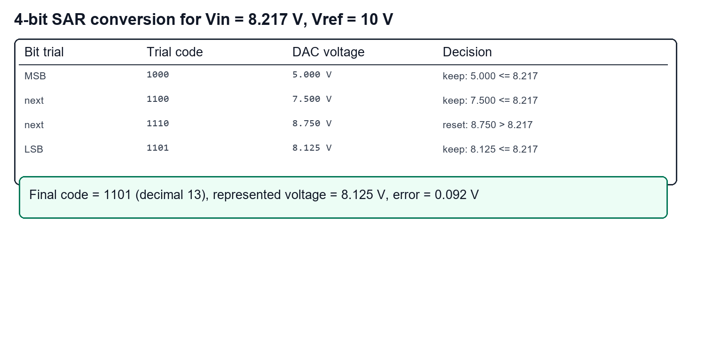
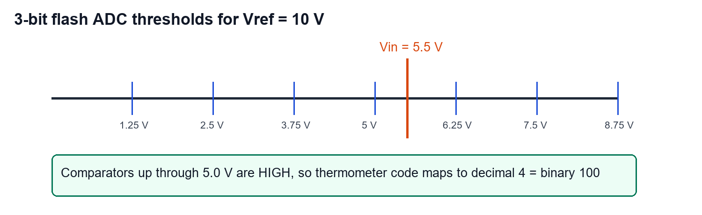
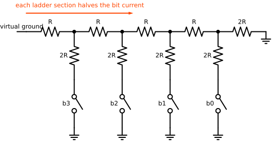
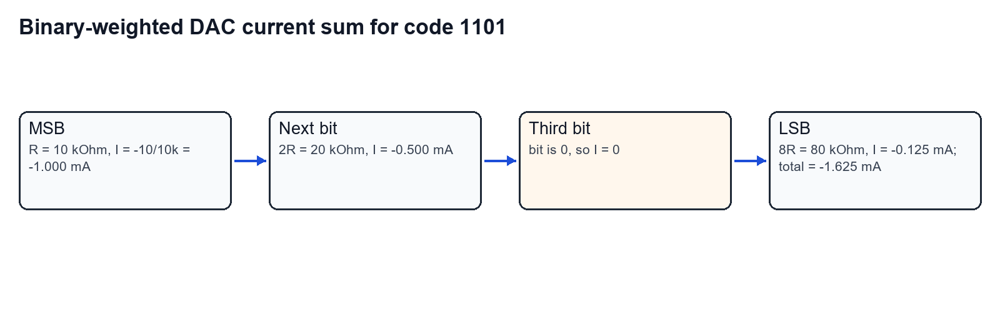
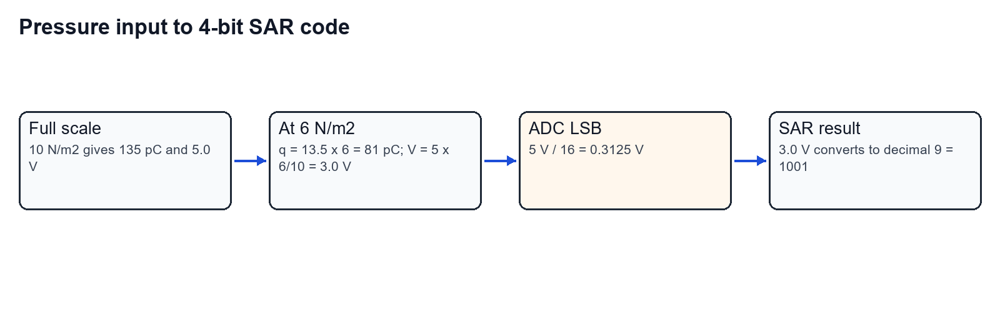
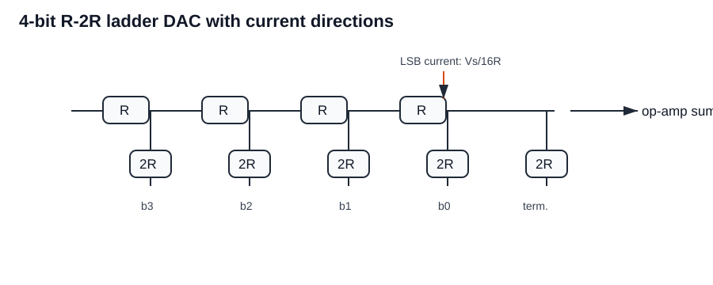
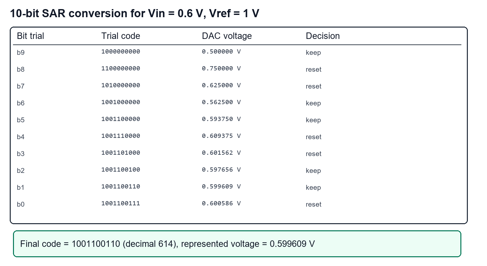
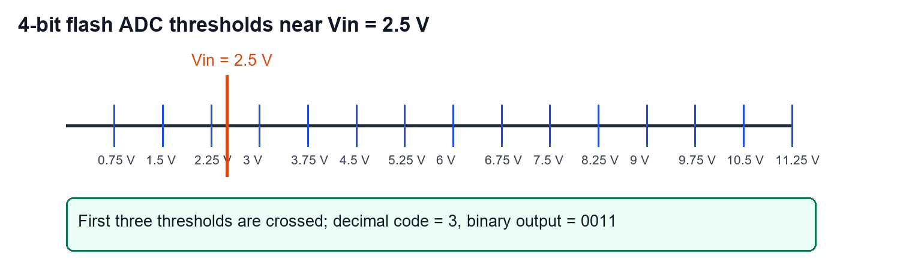
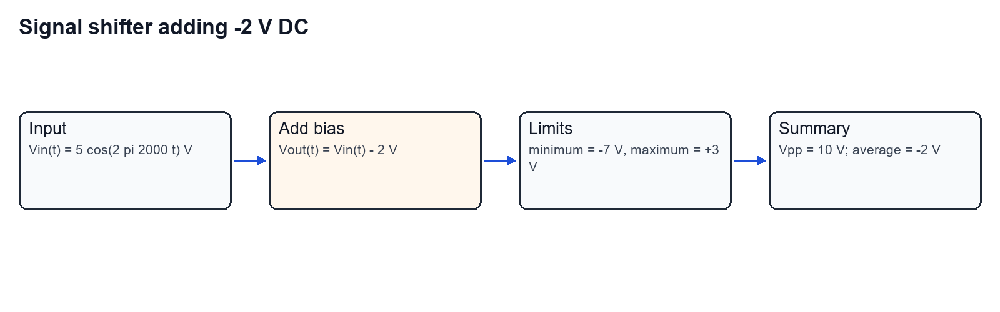

Worked from the Tutorial 6 PDF. The focus is on ADC/DAC bit weights, exact threshold comparisons, signal-conditioning scaling, and final digital codes.

## Question 1

Find the successive-approximation A/D output for a 4-bit converter with $V_{in}=8.217\,\mathrm{V}$ and $V_{ref}=10\,\mathrm{V}$.

### Given and target

- ADC type: successive approximation register (SAR).
- Resolution: $n=4$ bits.
- Reference: $V_{ref}=10\,\mathrm{V}$.
- Input: $V_{in}=8.217\,\mathrm{V}$.
- Target: final 4-bit output code and quantization error.

### SAR trial table

### Step-by-step solution

**Step 1: Calculate LSB size.**

$$
LSB=\frac{V_{ref}}{2^n}.
$$

$$
LSB=\frac{10}{2^4}=\frac{10}{16}=0.625\,\mathrm{V}.
$$

**Step 2: Test the MSB.**

Trial code `1000` gives

$$
V_{DAC}=8(0.625)=5.000\,\mathrm{V}.
$$

Since $5.000<8.217$, keep the MSB.

**Step 3: Test the next bit.**

Trial code `1100` gives

$$
V_{DAC}=12(0.625)=7.500\,\mathrm{V}.
$$

Since $7.500<8.217$, keep the bit.

**Step 4: Test the third bit.**

Trial code `1110` gives

$$
V_{DAC}=14(0.625)=8.750\,\mathrm{V}.
$$

Since $8.750>8.217$, reset that bit.

**Step 5: Test the LSB.**

Trial code `1101` gives

$$
V_{DAC}=13(0.625)=8.125\,\mathrm{V}.
$$

Since $8.125<8.217$, keep the LSB.

**Step 6: Calculate quantization error.**

$$
e_q=V_{in}-V_{DAC}=8.217-8.125.
$$

$$
e_q=0.092\,\mathrm{V}.
$$

### Final answer

$$
\boxed{\text{SAR output}=1101}
$$

Decimal code is $13$, represented analog value is $8.125\,\mathrm{V}$, and quantization error is $0.092\,\mathrm{V}$.

## Question 2

Design a 3-bit flash ADC with $V_{ref}=10\,\mathrm{V}$, assume a suitable value of $R$, and find the digital output for $V_{in}=5.5\,\mathrm{V}$.

### Given and target

- ADC type: flash ADC.
- Resolution: $n=3$ bits.
- Reference: $V_{ref}=10\,\mathrm{V}$.
- Input: $V_{in}=5.5\,\mathrm{V}$.
- Target: comparator thresholds, thermometer result, and binary output.

### Flash threshold map

### Step-by-step solution

**Step 1: Count output levels and comparators.**

A 3-bit ADC has

$$
2^3=8
$$

quantization levels. A flash ADC needs

$$
2^3-1=7
$$

comparators.

**Step 2: Choose equal ladder resistors.**

Use eight equal resistor sections between $V_{ref}$ and ground. The absolute value of $R$ can be chosen based on power; the code calculation only needs equal sections.

**Step 3: Calculate LSB size.**

$$
LSB=\frac{V_{ref}}{2^3}=\frac{10}{8}=1.25\,\mathrm{V}.
$$

**Step 4: List comparator thresholds.**

The seven thresholds are

$$
1.25,\;2.50,\;3.75,\;5.00,\;6.25,\;7.50,\;8.75\,\mathrm{V}.
$$

**Step 5: Compare $5.5\,\mathrm{V}$ with thresholds.**

$5.5\,\mathrm{V}$ is above $1.25$, $2.50$, $3.75$, and $5.00\,\mathrm{V}$, but below $6.25\,\mathrm{V}$.

So four comparators are high.

**Step 6: Encode thermometer output.**

Four high comparators correspond to decimal code $4$:

$$
4_{10}=100_2.
$$

### Final answer

Use seven comparators and an equal resistor ladder with threshold spacing $1.25\,\mathrm{V}$. For $V_{in}=5.5\,\mathrm{V}$,

$$
\boxed{\text{digital output}=100}
$$

## Question 3

With a neat schematic, prove that an R-2R ladder DAC with digital input `0001` produces

$$
V_o=-\frac{V_s}{16}.
$$

Assume $V_s$ is the reference/source voltage.

### Given and target

- DAC type: 4-bit R-2R ladder.
- Digital input: `0001`.
- Active bit: LSB only.
- Op-amp feedback: $R_f=R$.
- Target: prove the analog output is $-V_s/16$.

### Circuit marking

### Step-by-step proof

**Step 1: Write the 4-bit DAC weight.**

For a 4-bit DAC, the bit weights are

$$
\frac{8}{16},\quad \frac{4}{16},\quad \frac{2}{16},\quad \frac{1}{16}.
$$

**Step 2: Select the active bit for `0001`.**

The code `0001` has only the LSB connected to $V_s$. Its weight is

$$
\frac{1}{16}.
$$

**Step 3: Write the equivalent summing-node current.**

The R-2R ladder presents the LSB contribution as

$$
I_{LSB}=\frac{V_s}{16R}.
$$

**Step 4: Use the inverting summing amplifier.**

The output is

$$
V_o=-R_fI_{LSB}.
$$

With $R_f=R$,

$$
V_o=-R\left(\frac{V_s}{16R}\right).
$$

Therefore

$$
V_o=-\frac{V_s}{16}.
$$

### Final answer

$$
\boxed{V_o=-\frac{V_s}{16}}
$$

for digital input `0001`.

## Question 4

For a 4-bit binary-weighted D/A converter with $R=10\,\mathrm{k\Omega}$, $R_f=5\,\mathrm{k\Omega}$, $V_{ref}=-10\,\mathrm{V}$, and input word `1101`, determine resolution, MSB switch current, output current, and output voltage.

### Given and target

- DAC type: binary-weighted inverting DAC.
- $R=10\,\mathrm{k\Omega}$ for the MSB branch.
- Branch resistors: $R$, $2R$, $4R$, $8R$.
- $R_f=5\,\mathrm{k\Omega}$.
- $V_{ref}=-10\,\mathrm{V}$.
- Input code: `1101`.
- Target: resolution, MSB current, total output current, and $V_o$.

### Current contribution map

### Step-by-step solution

**Step 1: Calculate output resolution.**

The LSB branch is $8R=80\,\mathrm{k\Omega}$. Its current magnitude is

$$
I_{LSB}=\frac{10}{80\,\mathrm{k\Omega}}=0.125\,\mathrm{mA}.
$$

With $R_f=5\,\mathrm{k\Omega}$, one LSB at the output is

$$
\Delta V_o=R_fI_{LSB}=5\,\mathrm{k\Omega}\times0.125\,\mathrm{mA}.
$$

$$
\Delta V_o=0.625\,\mathrm{V}.
$$

**Step 2: Calculate MSB switch current.**

The MSB branch uses $R=10\,\mathrm{k\Omega}$:

$$
I_{MSB}=\frac{V_{ref}}{R}.
$$

$$
I_{MSB}=\frac{-10}{10\,\mathrm{k\Omega}}=-1.000\,\mathrm{mA}.
$$

**Step 3: Calculate all active branch currents for `1101`.**

For `1101`, active branches are MSB, second bit, and LSB:

$$
I_{MSB}=-1.000\,\mathrm{mA}.
$$

$$
I_{2nd}=\frac{-10}{20\,\mathrm{k\Omega}}=-0.500\,\mathrm{mA}.
$$

The third bit is zero:

$$
I_{3rd}=0.
$$

The LSB branch is

$$
I_{LSB}=\frac{-10}{80\,\mathrm{k\Omega}}=-0.125\,\mathrm{mA}.
$$

**Step 4: Sum output current.**

$$
I_{in}=(-1.000)+(-0.500)+0+(-0.125).
$$

$$
I_{in}=-1.625\,\mathrm{mA}.
$$

**Step 5: Calculate output voltage.**

For the inverting op-amp,

$$
V_o=-R_fI_{in}.
$$

$$
V_o=-(5\,\mathrm{k\Omega})(-1.625\,\mathrm{mA}).
$$

$$
V_o=8.125\,\mathrm{V}.
$$

### Final answer

$$
\boxed{\text{resolution}=0.625\,\mathrm{V/LSB}}
$$

$$
\boxed{I_{MSB}=-1.000\,\mathrm{mA}}
$$

$$
\boxed{I_{in}=-1.625\,\mathrm{mA}}
$$

$$
\boxed{V_o=8.125\,\mathrm{V}}
$$

## Question 5

Design a charge-mode amplifier and signal-conditioning circuit for a pressure piezoelectric transducer. The conditioned output is acquired by a 4-bit SAR ADC over $0$ to $5\,\mathrm{V}$ for pressure $0$ to $10\,\mathrm{N/m^2}$. Sensitivity is $13.5\,\mathrm{pC/(N/m^2)}$, shunt resistance is $10\,\mathrm{G\Omega}$, capacitance is $4\,\mathrm{nF}$, cable capacitance is $1\,\mathrm{nF}$, feedback resistance is stated as $10\,\mathrm{k\Omega}$, required band is $59$ to $318\,\mathrm{Hz}$, and input pressure is $6\,\mathrm{N/m^2}$.

### Given and target

- Pressure range: $0$ to $10\,\mathrm{N/m^2}$.
- Output voltage range: $0$ to $5\,\mathrm{V}$.
- Charge sensitivity: $13.5\,\mathrm{pC/(N/m^2)}$.
- ADC: 4-bit SAR.
- Test pressure: $6\,\mathrm{N/m^2}$.
- Target: complete system chain and digital output code.

### System chain

### Step-by-step solution

**Step 1: Calculate full-scale charge.**

$$
q_{FS}=13.5\,\mathrm{pC/(N/m^2)}\times10\,\mathrm{N/m^2}.
$$

$$
q_{FS}=135\,\mathrm{pC}.
$$

**Step 2: Choose charge-amplifier feedback capacitance for 5 V full scale.**

$$
C_f=\frac{q_{FS}}{V_{FS}}.
$$

$$
C_f=\frac{135\,\mathrm{pC}}{5\,\mathrm{V}}=27\,\mathrm{pF}.
$$

**Step 3: Check the stated $10\,\mathrm{k\Omega}$ feedback resistance.**

If $10\,\mathrm{k\Omega}$ is placed directly across $27\,\mathrm{pF}$,

$$
f_L=\frac{1}{2\pi R_fC_f}.
$$

$$
f_L=\frac{1}{2\pi(10\,000)(27\times10^{-12})}\approx5.89\times10^5\,\mathrm{Hz}.
$$

That does not match the required $59\,\mathrm{Hz}$. Therefore the practical design should keep $C_f=27\,\mathrm{pF}$ for charge-to-voltage gain and implement the $59$ to $318\,\mathrm{Hz}$ band in following filter stages, or use about $100\,\mathrm{M\Omega}$ as the actual charge-amplifier bleed resistor.

**Step 4: Select post-amplifier filter values using $10\,\mathrm{k\Omega}$ stages.**

For $59\,\mathrm{Hz}$ high-pass:

$$
C_{HP}=\frac{1}{2\pi(10\,000)(59)}\approx270\,\mathrm{nF}.
$$

For $318\,\mathrm{Hz}$ low-pass:

$$
C_{LP}=\frac{1}{2\pi(10\,000)(318)}\approx50\,\mathrm{nF}.
$$

**Step 5: Calculate voltage at $6\,\mathrm{N/m^2}$.**

Pressure fraction is

$$
\frac{6}{10}=0.6.
$$

The scaled output voltage is

$$
V_o=0.6(5\,\mathrm{V})=3.0\,\mathrm{V}.
$$

**Step 6: Calculate 4-bit ADC LSB.**

$$
LSB=\frac{5}{16}=0.3125\,\mathrm{V}.
$$

**Step 7: Calculate ADC code.**

$$
\text{code}=\left\lfloor\frac{3.0}{0.3125}\right\rfloor.
$$

$$
\text{code}=\lfloor9.6\rfloor=9.
$$

Decimal $9$ is

$$
9_{10}=1001_2.
$$

**Step 8: Show SAR bit decisions for $3.0\,\mathrm{V}$.**

- Trial `1000` gives $2.5\,\mathrm{V}$, keep.
- Trial `1100` gives $3.75\,\mathrm{V}$, reset.
- Trial `1010` gives $3.125\,\mathrm{V}$, reset.
- Trial `1001` gives $2.8125\,\mathrm{V}$, keep.

### Final answer

Use the chain:

$$
\boxed{\text{piezo sensor} \rightarrow \text{charge amplifier} \rightarrow 59\,\mathrm{Hz}\ \text{HPF} \rightarrow 318\,\mathrm{Hz}\ \text{LPF} \rightarrow \text{4-bit SAR ADC}}
$$

with $C_f=27\,\mathrm{pF}$ for charge gain. At $6\,\mathrm{N/m^2}$, the ADC input is $3.0\,\mathrm{V}$ and the digital code is

$$
\boxed{1001}
$$

## Question 6

An analog signal

$$
V_{in}(t)=2\sin(2\pi ft)\,\mathrm{V}
$$

with $f=1\,\mathrm{kHz}$ is fed into a signal shifter that adds a DC bias of $3\,\mathrm{V}$. Determine the output equation, peak-to-peak voltage, and average value.

### Given and target

- Input amplitude: $2\,\mathrm{V}$.
- Frequency: $f=1\,\mathrm{kHz}=1000\,\mathrm{Hz}$.
- DC bias: $+3\,\mathrm{V}$.
- Target: $V_{out}(t)$, $V_{pp}$, and average value.

### Signal shift map

### Step-by-step solution

**Step 1: Substitute the frequency.**

$$
V_{in}(t)=2\sin(2\pi(1000)t)\,\mathrm{V}.
$$

**Step 2: Add the DC bias.**

$$
V_{out}(t)=V_{in}(t)+3.
$$

Therefore

$$
V_{out}(t)=2\sin(2\pi(1000)t)+3\,\mathrm{V}.
$$

**Step 3: Calculate peak-to-peak voltage.**

The sinusoid amplitude is $2\,\mathrm{V}$, so

$$
V_{pp}=2A=2(2)=4\,\mathrm{V}.
$$

**Step 4: Calculate average value.**

The average of the sine term over a full cycle is zero. The average is therefore the DC bias:

$$
V_{avg}=3\,\mathrm{V}.
$$

**Step 5: Check minimum and maximum values.**

$$
V_{min}=3-2=1\,\mathrm{V}.
$$

$$
V_{max}=3+2=5\,\mathrm{V}.
$$

### Final answer

$$
\boxed{V_{out}(t)=2\sin(2\pi(1000)t)+3\,\mathrm{V}}
$$

$$
\boxed{V_{pp}=4\,\mathrm{V}},\qquad
\boxed{V_{avg}=3\,\mathrm{V}}
$$

## Question 7

Practice: with a schematic, prove that an R-2R ladder DAC with digital input `0100` produces

$$
V_o=-\frac{V_s}{4}.
$$

Assume $V_s$ is the source voltage.

### Given and target

- DAC type: 4-bit R-2R ladder.
- Digital input: `0100`.
- Op-amp feedback: $R_f=R$.
- Target: prove the output is $-V_s/4$.

### Circuit marking

### Step-by-step proof

**Step 1: Convert code `0100` to decimal weight.**

For a 4-bit code,

$$
0100_2=4_{10}.
$$

The full-scale denominator is $2^4=16$, so the normalized weight is

$$
\frac{4}{16}=\frac{1}{4}.
$$

**Step 2: Write equivalent ladder current.**

The R-2R ladder sends the active code contribution to the virtual-ground summing node as

$$
I=\frac{V_s}{4R}.
$$

**Step 3: Use the inverting output relation.**

$$
V_o=-R_fI.
$$

With $R_f=R$,

$$
V_o=-R\left(\frac{V_s}{4R}\right).
$$

Therefore

$$
V_o=-\frac{V_s}{4}.
$$

### Final answer

$$
\boxed{V_o=-\frac{V_s}{4}}
$$

for digital input `0100`.

## Question 8

Practice: with a schematic of a 10-bit SAR ADC, obtain the binary output for $V_{in}=0.6\,\mathrm{V}$ and $V_{ref}=1\,\mathrm{V}$. Highlight all conversion steps.

### Given and target

- ADC type: SAR.
- Resolution: $n=10$ bits.
- Reference: $V_{ref}=1\,\mathrm{V}$.
- Input: $V_{in}=0.6\,\mathrm{V}$.
- Target: 10-bit output code and SAR decision sequence.

### SAR decision table

### Step-by-step solution

**Step 1: Calculate LSB size.**

$$
LSB=\frac{V_{ref}}{2^{10}}=\frac{1}{1024}.
$$

$$
LSB=0.0009765625\,\mathrm{V}.
$$

**Step 2: Work through the SAR trials.**

The SAR sets one bit at a time. If the DAC trial voltage is less than or equal to $0.6\,\mathrm{V}$, the bit is kept. If it is greater than $0.6\,\mathrm{V}$, the bit is reset.

The kept/reset sequence is:

| Trial bit | Trial code | DAC voltage | Decision |
|---|---:|---:|---|
| $b_9$ | `1000000000` | $0.500000\,\mathrm{V}$ | keep |
| $b_8$ | `1100000000` | $0.750000\,\mathrm{V}$ | reset |
| $b_7$ | `1010000000` | $0.625000\,\mathrm{V}$ | reset |
| $b_6$ | `1001000000` | $0.562500\,\mathrm{V}$ | keep |
| $b_5$ | `1001100000` | $0.593750\,\mathrm{V}$ | keep |
| $b_4$ | `1001110000` | $0.609375\,\mathrm{V}$ | reset |
| $b_3$ | `1001101000` | $0.601562\,\mathrm{V}$ | reset |
| $b_2$ | `1001100100` | $0.597656\,\mathrm{V}$ | keep |
| $b_1$ | `1001100110` | $0.599609\,\mathrm{V}$ | keep |
| $b_0$ | `1001100111` | $0.600586\,\mathrm{V}$ | reset |

**Step 3: Read final code.**

The final kept code is

$$
1001100110_2.
$$

**Step 4: Confirm decimal value.**

$$
1001100110_2=614_{10}.
$$

Represented voltage:

$$
V_{DAC}=614\left(\frac{1}{1024}\right).
$$

$$
V_{DAC}=0.599609375\,\mathrm{V}.
$$

### Final answer

$$
\boxed{\text{binary output}=1001100110}
$$

Decimal code is $614$, representing $0.599609\,\mathrm{V}$.

## Question 9

Practice: for a supply excitation of $+12\,\mathrm{V}$, determine the digital output of a 4-bit flash ADC for $V_{in}=2.5\,\mathrm{V}$. Draw the complete schematic assuming a 4:2 priority encoder is incorporated.

### Given and target

- ADC type: flash ADC.
- Resolution stated: 4 bits.
- Reference/excitation: $+12\,\mathrm{V}$.
- Input: $2.5\,\mathrm{V}$.
- Target: digital output code.

### Flash threshold map

### Step-by-step solution

**Step 1: State the flash ADC structure.**

A 4-bit flash ADC has

$$
2^4=16
$$

levels and normally needs

$$
2^4-1=15
$$

comparators. The comparator outputs form a thermometer code, which is then encoded into a 4-bit binary output.

The PDF mentions a 4:2 priority encoder. That is a smaller encoder block; a full 4-bit flash implementation would use a larger thermometer-to-binary encoder or cascaded priority-encoder blocks.

**Step 2: Calculate LSB size.**

$$
LSB=\frac{V_{ref}}{2^4}.
$$

$$
LSB=\frac{12}{16}=0.75\,\mathrm{V}.
$$

**Step 3: List relevant thresholds.**

The first thresholds are

$$
0.75,\;1.50,\;2.25,\;3.00,\ldots
$$

**Step 4: Compare $V_{in}=2.5\,\mathrm{V}$.**

$2.5\,\mathrm{V}$ is above $0.75$, $1.50$, and $2.25\,\mathrm{V}$, but below $3.00\,\mathrm{V}$.

So the decimal code is

$$
\left\lfloor\frac{2.5}{0.75}\right\rfloor=3.
$$

**Step 5: Convert decimal code to 4-bit binary.**

$$
3_{10}=0011_2.
$$

### Final answer

$$
\boxed{\text{digital output}=0011}
$$

for $V_{in}=2.5\,\mathrm{V}$ with $V_{ref}=12\,\mathrm{V}$.

## Question 10

Practice: an analog signal

$$
V_{in}(t)=5\cos(2\pi ft)\,\mathrm{V}
$$

with $f=2\,\mathrm{kHz}$ passes through a signal shifter that adds $-2\,\mathrm{V}$. Determine the output equation, peak-to-peak voltage, and average value.

### Given and target

- Input amplitude: $5\,\mathrm{V}$.
- Frequency: $f=2\,\mathrm{kHz}=2000\,\mathrm{Hz}$.
- DC shift: $-2\,\mathrm{V}$.
- Target: $V_{out}(t)$, $V_{pp}$, and average value.

### Signal shift map

### Step-by-step solution

**Step 1: Substitute the frequency.**

$$
V_{in}(t)=5\cos(2\pi(2000)t)\,\mathrm{V}.
$$

**Step 2: Add the shifter bias.**

$$
V_{out}(t)=V_{in}(t)-2.
$$

Therefore

$$
V_{out}(t)=5\cos(2\pi(2000)t)-2\,\mathrm{V}.
$$

**Step 3: Calculate peak-to-peak voltage.**

The cosine amplitude is $5\,\mathrm{V}$, so

$$
V_{pp}=2A=2(5)=10\,\mathrm{V}.
$$

**Step 4: Calculate average value.**

The average of the cosine term over a full cycle is zero. The average is the DC shift:

$$
V_{avg}=-2\,\mathrm{V}.
$$

**Step 5: Check minimum and maximum values.**

$$
V_{min}=-2-5=-7\,\mathrm{V}.
$$

$$
V_{max}=-2+5=+3\,\mathrm{V}.
$$

### Final answer

$$
\boxed{V_{out}(t)=5\cos(2\pi(2000)t)-2\,\mathrm{V}}
$$

$$
\boxed{V_{pp}=10\,\mathrm{V}},\qquad
\boxed{V_{avg}=-2\,\mathrm{V}}
$$
