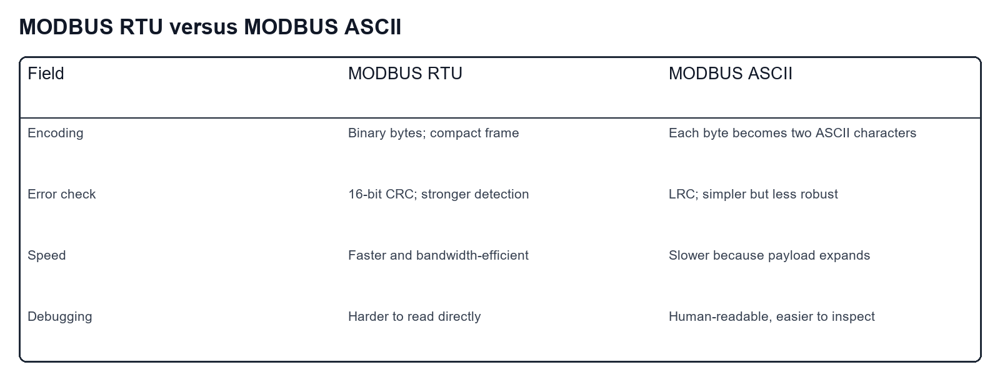
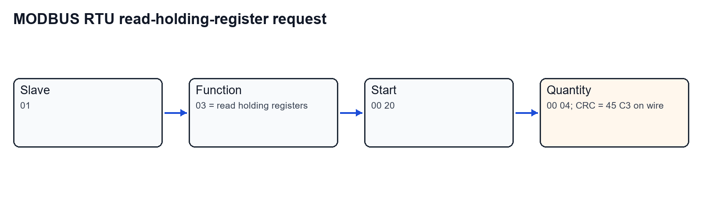
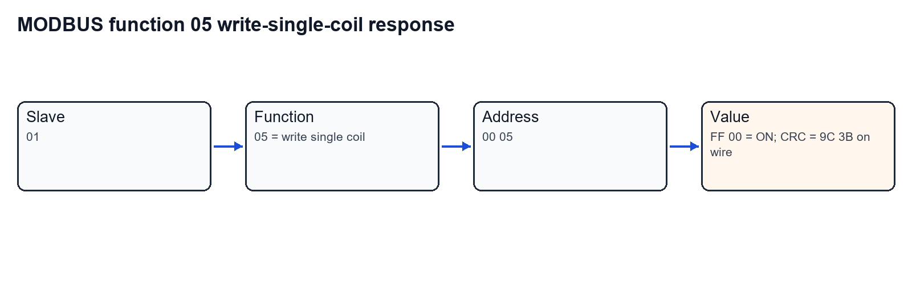
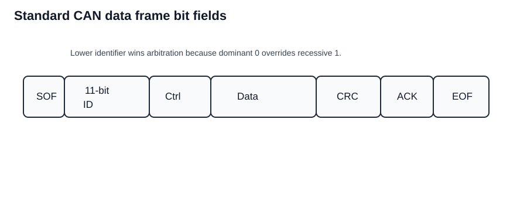
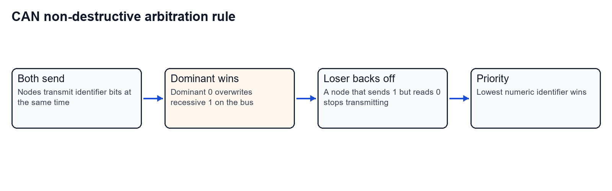
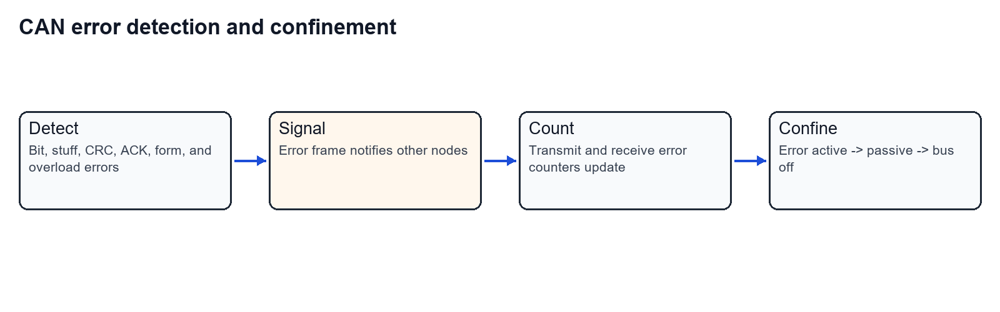
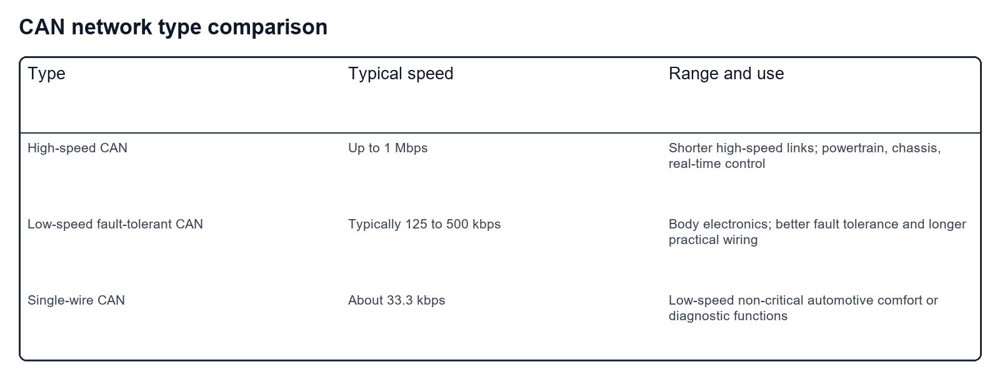
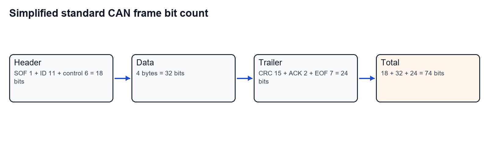
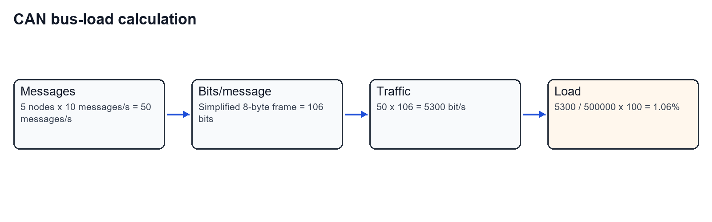

Worked from the Tutorial 7 PDF. Protocol answers are kept field-by-field so the frame layouts, byte counts, arbitration rules, and bus-load calculations are inspectable.

## Question 1

Explain the basic structure and components of a MODBUS protocol message. Discuss the differences between MODBUS RTU and MODBUS ASCII, including advantages and disadvantages.

### Message structure




### Step-by-step answer

**Step 1: State the purpose of MODBUS.**

MODBUS is an industrial communication protocol used by a master, such as a PLC or SCADA computer, to exchange data with slave devices such as sensors, drives, meters, and controllers.

**Step 2: Break the message into fields.**

| Field | Size | Purpose |
|---|---:|---|
| Slave address | 1 byte | Selects the target slave device. Valid normal slave addresses are usually 1 to 247. |
| Function code | 1 byte | Tells the slave what operation to perform, such as read coils, read holding registers, or write a coil. |
| Data field | Variable | Carries starting addresses, register counts, coil values, register values, or returned data. |
| Error check | 2 bytes in RTU, LRC in ASCII | Detects transmission errors. RTU uses CRC; ASCII uses LRC. |

**Step 3: Explain MODBUS RTU.**

MODBUS RTU sends compact binary bytes. It is efficient because each data byte is sent directly as one byte. RTU uses a 16-bit CRC, so it has strong error detection. It is usually the preferred mode for industrial serial links where speed and reliability matter.

**Step 4: Explain MODBUS ASCII.**

MODBUS ASCII sends each byte as two ASCII characters. For example, byte `0x3F` is sent as characters `3` and `F`. This makes frames easier to inspect manually, but it doubles the character count and reduces speed. ASCII uses LRC rather than CRC.

**Step 5: Compare advantages and disadvantages.**

| Item | MODBUS RTU | MODBUS ASCII |
|---|---|---|
| Encoding | Binary | Text/ASCII |
| Speed | Faster | Slower |
| Bandwidth use | Efficient | Less efficient |
| Error check | CRC, stronger | LRC, simpler |
| Human readability | Poor | Good |
| Typical use | Normal industrial serial communication | Diagnostics, simple text-oriented troubleshooting |

### Final answer

MODBUS messages contain slave address, function code, data, and error checking. RTU is compact, faster, and uses CRC, so it is normally preferred for reliable industrial links. ASCII is slower because each byte becomes two characters, but it is easier to read manually and can be useful for diagnostics.

## Question 2

Describe the structure of a typical MODBUS RTU frame and give an example frame to read 4 holding registers starting at address `0x0020`.

### Given and target

- Slave address: assume `0x01`.
- Function: read holding registers, function code `0x03`.
- Starting address: `0x0020`.
- Quantity: 4 registers, encoded as `0x0004`.
- Target: request frame and expected response structure.

### Request frame map



### Step-by-step solution

**Step 1: Write the request fields before CRC.**

| Field | Hex bytes |
|---|---:|
| Slave address | `01` |
| Function code | `03` |
| Starting address | `00 20` |
| Quantity of registers | `00 04` |

Bytes before CRC:

```text
01 03 00 20 00 04
```

**Step 2: Compute the MODBUS RTU CRC.**

Using the standard MODBUS CRC-16 algorithm, the CRC value for `01 03 00 20 00 04` is `0xC345`.

MODBUS RTU transmits CRC low byte first, so the wire order is:

```text
45 C3
```

The PDF prints `C8 F1` as the CRC for this frame. That does not match the standard MODBUS CRC calculation for these six request bytes.

**Step 3: Write the complete request frame using the calculated CRC.**

```text
01 03 00 20 00 04 45 C3
```

**Step 4: Write the response structure.**

Reading 4 registers returns 8 data bytes because each register is 16 bits:

```text
01 03 08 [8 data bytes] [CRC low] [CRC high]
```

Example data from the PDF response text is:

```text
12 34 56 78 9A BC DE F0
```

### Final answer

The request fields are:

```text
01 03 00 20 00 04
```

The standard MODBUS CRC for those bytes is transmitted as `45 C3`, so the complete calculated request frame is:

```text
01 03 00 20 00 04 45 C3
```

The response contains slave address, function code, byte count `08`, eight data bytes, and CRC.

## Question 3

A MODBUS RTU register contains `0x3F40`. Convert it to decimal and show how it is transmitted.

### Given and target

- Register value: `0x3F40`.
- Target: decimal value and transmitted byte order.

### Step-by-step solution

**Step 1: Expand the hexadecimal value.**

$$
0x3F40=(3\times16^3)+(15\times16^2)+(4\times16^1)+(0\times16^0).
$$

**Step 2: Substitute powers of 16.**

$$
0x3F40=(3\times4096)+(15\times256)+(4\times16)+0.
$$

**Step 3: Add terms.**

$$
0x3F40=12288+3840+64.
$$

$$
0x3F40=16092.
$$

**Step 4: State MODBUS register byte order.**

MODBUS sends a 16-bit register in big-endian register order:

```text
High byte: 3F
Low byte:  40
```

### Final answer

$$
\boxed{0x3F40=16092_{10}}
$$

The register is transmitted as:

```text
3F 40
```

## Question 4

A MODBUS RTU message has slave address `0x01`, function `0x03`, byte count `0x02`, and data `0x12 0x34`. Calculate transmission time at 9600 bps using 8N1 framing.

### Given and target

- Address: 1 byte.
- Function: 1 byte.
- Byte count: 1 byte.
- Data: 2 bytes.
- CRC: 2 bytes.
- Serial framing: 8N1.
- Baud rate: 9600 bps.
- Target: transmission time.

### Step-by-step solution

**Step 1: Count frame bytes.**

$$
\text{bytes}=1+1+1+2+2=7.
$$

**Step 2: Convert bytes to transmitted bits.**

In 8N1, each byte has:

- 1 start bit
- 8 data bits
- 0 parity bits
- 1 stop bit

So each byte uses 10 transmitted bits.

$$
\text{total bits}=7\times10=70.
$$

**Step 3: Calculate transmission time.**

$$
t=\frac{70}{9600}.
$$

$$
t=0.0072917\,\mathrm{s}.
$$

$$
t=7.29\,\mathrm{ms}.
$$

### Final answer

$$
\boxed{t\approx7.29\,\mathrm{ms}}
$$

CRC bytes are included in the count.

## Question 5

A master writes coil address `0x0005` with value `0xFF00`. What MODBUS RTU response frame does the slave return?

### Given and target

- Slave address: assume `0x01`.
- Function: write single coil, `0x05`.
- Coil address: `0x0005`.
- Coil value: `0xFF00`, meaning ON.
- Target: successful slave response frame.

### Response frame map



### Step-by-step solution

**Step 1: State the MODBUS function behavior.**

For function `0x05`, a successful slave response echoes the request address and value.

**Step 2: Write the response bytes before CRC.**

```text
01 05 00 05 FF 00
```

**Step 3: Compute the MODBUS CRC.**

The standard MODBUS CRC for `01 05 00 05 FF 00` is `0x3B9C`.

CRC is transmitted low byte first:

```text
9C 3B
```

**Step 4: Write the full response frame.**

```text
01 05 00 05 FF 00 9C 3B
```

### Final answer

The successful response frame is:

```text
01 05 00 05 FF 00 9C 3B
```

## Question 6

Explain CAN protocol, architecture, key features, network components, message structure, and message types.

### CAN frame



### Step-by-step answer

**Step 1: Define CAN.**

CAN, or Controller Area Network, is a multi-master serial bus used for real-time communication between embedded controllers. It is common in automotive and industrial systems.

**Step 2: State the physical architecture.**

A CAN network contains multiple nodes connected to a shared bus. Each node normally has:

- host microcontroller
- CAN controller
- CAN transceiver
- connection to the differential pair, CAN_H and CAN_L

**Step 3: List key protocol features.**

- Multi-master communication: any node can start transmission when the bus is idle.
- Broadcast messaging: frames are seen by all nodes.
- Identifier-based priority: lower numeric identifier has higher priority.
- Non-destructive arbitration: the winning frame continues without corruption.
- Error detection: bit, stuff, CRC, ACK, and form errors are checked.
- Fault confinement: faulty nodes can become error-passive or bus-off.

**Step 4: Break down a standard CAN data frame.**

| Field | Purpose |
|---|---|
| SOF | Marks start of frame. |
| Identifier | Gives message identity and priority. |
| Control/DLC | Carries frame control bits and data length. |
| Data field | Carries 0 to 8 data bytes in classical CAN. |
| CRC | Detects corrupted frames. |
| ACK | Receivers acknowledge correct reception. |
| EOF | Marks end of frame. |

**Step 5: List CAN message types.**

- Data frame: carries payload data.
- Remote frame: requests data from another node.
- Error frame: signals detected error.
- Overload frame: asks for delay before more traffic.

### Final answer

CAN is a robust multi-master differential serial bus using CAN_H/CAN_L, identifier-based arbitration, CRC/error checks, acknowledgement, and fault confinement. Its main frame types are data, remote, error, and overload frames.

## Question 7

Describe CAN arbitration and how message priority is selected in a multi-master environment.

### Arbitration map



### Step-by-step answer

**Step 1: State when arbitration happens.**

Arbitration happens when two or more CAN nodes begin transmitting at the same time while the bus is idle.

**Step 2: State dominant and recessive bit behavior.**

CAN uses dominant and recessive bus states. Dominant `0` overwrites recessive `1` on the bus.

**Step 3: Explain bitwise comparison.**

During the identifier field, each transmitter also reads the bus. If a node transmits recessive `1` but reads dominant `0`, it has lost arbitration.

**Step 4: Explain non-destructive result.**

The losing node stops transmitting and retries later. The winning message is not corrupted, so arbitration is non-destructive.

**Step 5: State priority rule.**

Because `0` is dominant, the message with the lowest numeric identifier wins.

### Final answer

CAN arbitration is bitwise and non-destructive. Dominant `0` beats recessive `1`; therefore the lowest numeric identifier has the highest priority and continues transmitting.

## Question 8

Explain CAN error detection mechanisms, types of errors, and how data integrity is ensured.

### Error flow



### Step-by-step answer

**Step 1: List CAN error checks.**

CAN can detect:

- bit error
- stuff error
- CRC error
- acknowledgement error
- form error
- overload condition

**Step 2: Explain bit error.**

A transmitter monitors the bus while sending. If the bit read from the bus does not match the expected transmitted bit outside allowed arbitration behavior, a bit error is detected.

**Step 3: Explain stuff error.**

CAN uses bit stuffing for synchronization. After five consecutive identical bits, the transmitter inserts an opposite bit. If the receiver sees a stuffing-rule violation, it detects a stuff error.

**Step 4: Explain CRC error.**

The transmitter appends a CRC. The receiver recalculates the CRC from the received bits. A mismatch gives a CRC error.

**Step 5: Explain ACK and form errors.**

ACK error occurs when no receiver acknowledges the frame. Form error occurs when fixed-format fields have illegal bit values.

**Step 6: Explain recovery and integrity.**

When an error is detected, nodes send an error frame. Error counters track repeated faults. Nodes move through error-active, error-passive, and bus-off states, which prevents a faulty node from permanently corrupting the bus.

### Final answer

CAN ensures integrity through bit monitoring, bit-stuffing checks, CRC, ACK checking, frame-format checks, error frames, retransmission, and fault confinement.

## Question 9

Discuss types of CAN networks such as single-wire, high-speed, and low-speed CAN. Compare speed, range, and applications.

### Comparison



### Step-by-step answer

**Step 1: High-speed CAN.**

High-speed CAN uses differential CAN_H/CAN_L signaling and supports speeds up to about $1\,\mathrm{Mbps}$. It is used for powertrain, chassis, and other time-critical control systems. At $1\,\mathrm{Mbps}$, practical length is commonly around $40\,\mathrm{m}$.

**Step 2: Low-speed/fault-tolerant CAN.**

Low-speed CAN uses lower data rates, commonly around $125$ to $500\,\mathrm{kbps}$ depending on implementation. It is used for body electronics such as doors, seats, HVAC, and comfort functions. Fault-tolerant variants can keep communication alive under some wiring faults.

**Step 3: Single-wire CAN.**

Single-wire CAN uses one signal wire plus ground return. It is lower speed, often around $33.3\,\mathrm{kbps}$, and is used for non-critical automotive body or diagnostic functions.

### Final answer

High-speed CAN is used for fast real-time control over shorter lengths. Low-speed/fault-tolerant CAN is used for body electronics and more fault-tolerant wiring. Single-wire CAN is a lower-speed, lower-cost option for non-critical functions.

## Question 10

CAN message: ID `0x3A2`, standard 11-bit identifier, data length 4 bytes, data `0x12 0x34 0x56 0x78`. Calculate total bits in a standard CAN frame.

### Given and target

- SOF: 1 bit.
- Identifier: 11 bits.
- Control field as used in the tutorial: 6 bits.
- Data field: 4 bytes.
- CRC field as used in the tutorial: 15 bits.
- ACK field: 2 bits.
- EOF: 7 bits.
- Target: simplified total bit count.

### Bit-count map



### Step-by-step solution

**Step 1: Convert data bytes to bits.**

$$
4\,\mathrm{bytes}\times8=32\,\mathrm{bits}.
$$

**Step 2: Add fixed fields.**

$$
\text{fixed fields}=1+11+6+15+2+7.
$$

$$
\text{fixed fields}=42\,\mathrm{bits}.
$$

**Step 3: Add data bits.**

$$
\text{total}=42+32=74\,\mathrm{bits}.
$$

**Step 4: Note the PDF arithmetic discrepancy.**

The PDF lists the same field sizes but prints 73 bits. The arithmetic for the listed fields is 74 bits:

$$
1+11+6+32+15+2+7=74.
$$

Real CAN bit counts can also increase because of bit stuffing, which the simplified tutorial count ignores.

### Final answer

Using the field sizes stated in the question/tutorial:

$$
\boxed{74\,\mathrm{bits}}
$$

The PDF's printed 73-bit result omits one bit relative to its own listed fields.

## Question 11

Two CAN nodes transmit IDs `0x1A5` and `0x1B3` simultaneously. Which wins arbitration and why?

### Given and target

- Node 1 ID: `0x1A5`.
- Node 2 ID: `0x1B3`.
- Target: winning node.

### Step-by-step solution

**Step 1: Convert IDs to decimal.**

$$
0x1A5=(1\times256)+(10\times16)+5=421.
$$

$$
0x1B3=(1\times256)+(11\times16)+3=435.
$$

**Step 2: Apply CAN priority rule.**

In CAN, the lower numeric identifier has higher priority.

**Step 3: Compare.**

$$
421<435.
$$

So `0x1A5` has higher priority.

### Final answer

$$
\boxed{\text{Node 1 with ID }0x1A5\text{ wins arbitration.}}
$$

It wins because it has the lower numeric CAN identifier.

## Question 12

For high-speed CAN, desired bus speed is $500\,\mathrm{kbps}$. What is the maximum length? If speed increases to $1\,\mathrm{Mbps}$, how does range change?

### Given and target

- First speed: $500\,\mathrm{kbps}$.
- Second speed: $1\,\mathrm{Mbps}$.
- Target: practical maximum lengths and trend.

### Step-by-step answer

**Step 1: State typical length at 500 kbps.**

A common practical guideline is:

$$
500\,\mathrm{kbps}\rightarrow100\,\mathrm{m}.
$$

**Step 2: State typical length at 1 Mbps.**

At higher speed, bit time is shorter. The bus has less propagation-delay margin. A common guideline is:

$$
1\,\mathrm{Mbps}\rightarrow40\,\mathrm{m}.
$$

**Step 3: State trend.**

Increasing speed reduces maximum bus length because propagation delay, reflections, and signal settling consume a larger fraction of each bit time.

### Final answer

$$
\boxed{500\,\mathrm{kbps}\approx100\,\mathrm{m}}
$$

$$
\boxed{1\,\mathrm{Mbps}\approx40\,\mathrm{m}}
$$

The range decreases as speed increases.

## Question 13

A CAN message has expected CRC `0xC3E5`, but the received CRC is `0xD1A0`. What error occurred and what mechanism detects it?

### Given and target

- Expected CRC: `0xC3E5`.
- Received CRC: `0xD1A0`.
- Target: error type and detection mechanism.

### Step-by-step solution

**Step 1: Compare CRC values.**

```text
expected: C3 E5
received: D1 A0
```

They are not equal.

**Step 2: Identify error type.**

A mismatch between calculated/expected CRC and received CRC is a CRC error.

**Step 3: Identify detection mechanism.**

The receiver recalculates the cyclic redundancy check from the received message bits and compares it with the CRC field in the frame.

### Final answer

$$
\boxed{\text{CRC error}}
$$

It is detected by the CAN cyclic redundancy check mechanism.

## Question 14

A CAN network has 5 nodes. Each sends 8-byte messages at 10 messages/s. Bus speed is $500\,\mathrm{kbps}$. Find network load.

### Given and target

- Nodes: 5.
- Message rate per node: 10 messages/s.
- Payload per message: 8 bytes.
- Bus speed: $500\,\mathrm{kbps}=500000\,\mathrm{bit/s}$.
- Target: load percentage.

### Load map



### Step-by-step solution

**Step 1: Calculate total messages per second.**

$$
N_m=5\times10=50\,\mathrm{messages/s}.
$$

**Step 2: Calculate simplified bits per 8-byte frame.**

Using the same simplified tutorial field count:

$$
\text{bits/frame}=1+11+6+64+15+2+7.
$$

$$
\text{bits/frame}=106\,\mathrm{bits}.
$$

**Step 3: Calculate traffic rate.**

$$
\text{traffic}=50\times106=5300\,\mathrm{bit/s}.
$$

**Step 4: Calculate load percentage.**

$$
\text{load}=\frac{5300}{500000}\times100.
$$

$$
\text{load}=1.06\%.
$$

### Final answer

$$
\boxed{\text{network load}=1.06\%}
$$

This is the simplified load ignoring bit stuffing, inter-frame spacing, retries, and error frames.

## Question 15

A CAN message has ID `0x123`, standard 11-bit identifier, data length 8 bytes, and no error or overload frames. Find minimum and maximum frame size.

### Given and target

- Standard identifier: 11 bits.
- Data length: 8 bytes.
- No error frames.
- No overload frames.
- Target: simplified minimum and maximum frame size.

### Step-by-step solution

**Step 1: Convert data length to bits.**

$$
8\,\mathrm{bytes}\times8=64\,\mathrm{bits}.
$$

**Step 2: Add the simplified tutorial fields.**

$$
\text{frame bits}=1+11+6+64+15+2+7.
$$

$$
\text{frame bits}=106\,\mathrm{bits}.
$$

**Step 3: Interpret minimum and maximum.**

Under the tutorial's simplified assumption of no error/overload frames and ignoring bit stuffing, minimum and maximum are both the same:

$$
106\,\mathrm{bits}.
$$

In a real CAN bus, bit stuffing can increase the actual transmitted length, so the real maximum can be larger than this simplified value.

### Final answer

Under the simplified tutorial count:

$$
\boxed{\text{minimum}=106\,\mathrm{bits}}
$$

$$
\boxed{\text{maximum}=106\,\mathrm{bits}}
$$

Real transmitted maximum may be larger if bit stuffing is included.
