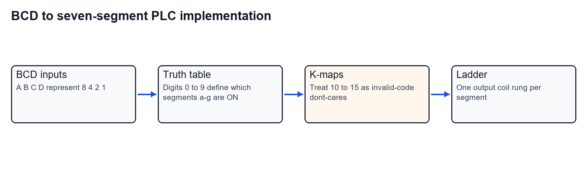
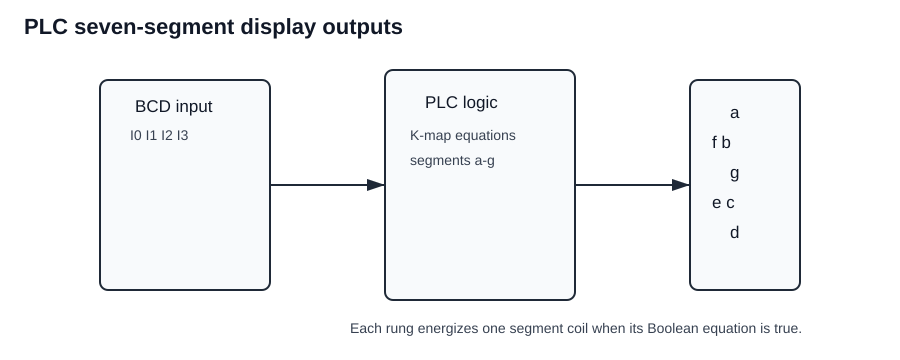
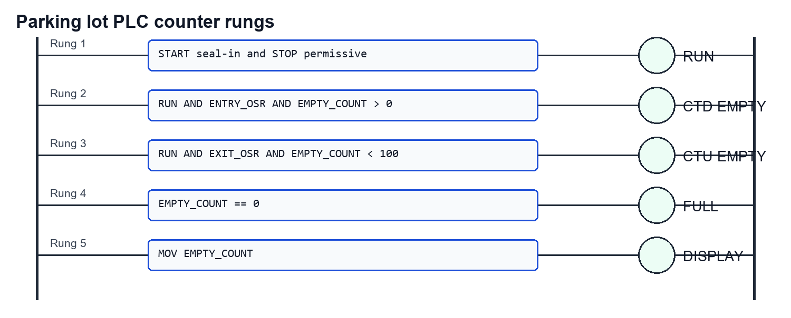
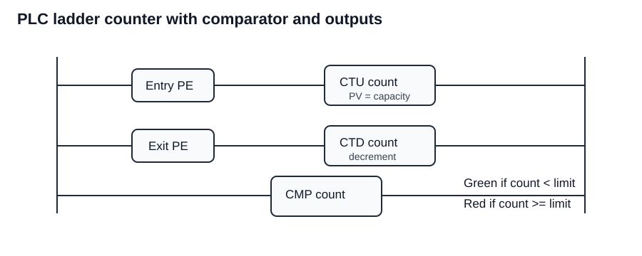
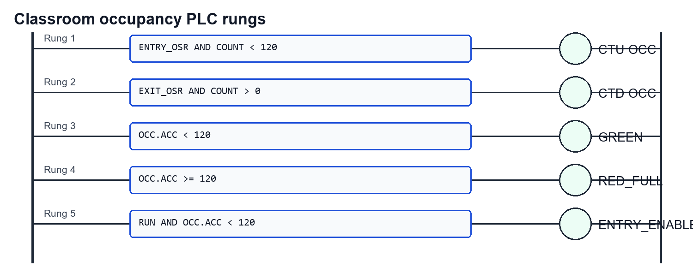
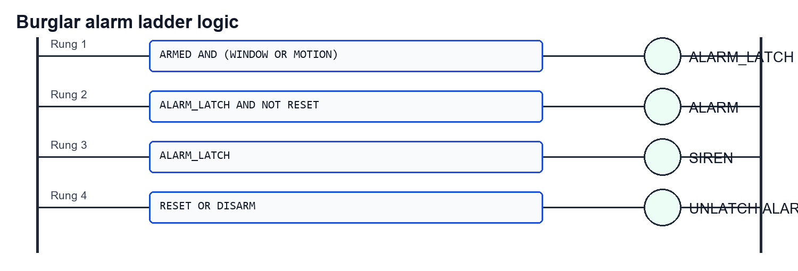
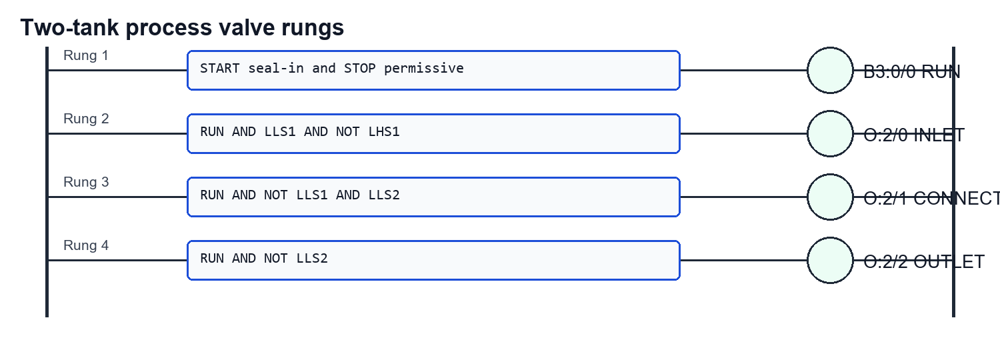
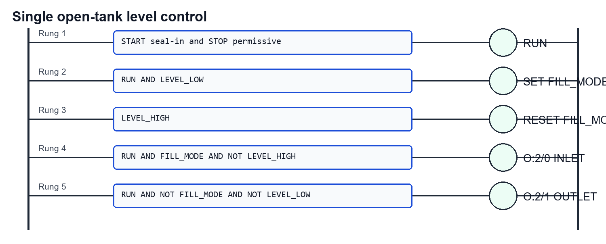
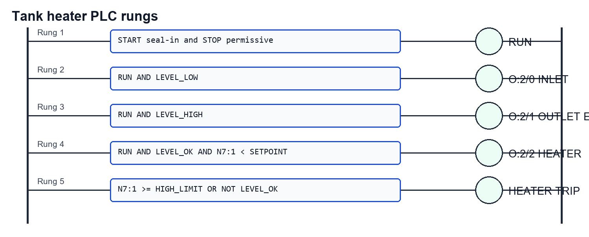
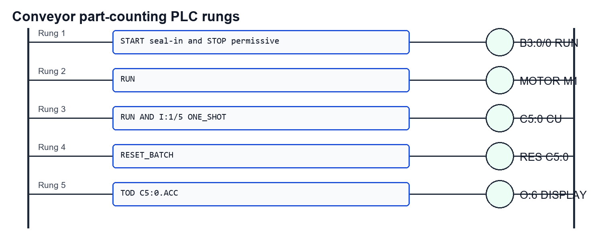

Worked from the Tutorial 8 PDF. Each PLC answer is written as an implementable ladder plan: I/O assignment, internal bits, rung logic, and final output behavior.

## Question 1

Implement a PLC ladder program to display digits 0 to 9 on a seven-segment LED display. Use K-maps to obtain the output equations.

### Given and target

- BCD inputs: $A$, $B$, $C$, $D$.
- Bit weights: $A=8$, $B=4$, $C=2$, $D=1$.
- Outputs: seven segment coils $a$ through $g$.
- Valid digits: 0 to 9.
- Invalid BCD codes: 10 to 15, treated as don't-cares for K-map simplification.

### Implementation map





### Step-by-step solution

**Step 1: Define segment truth table.**

Use active-high segment outputs for a common-cathode style display:

| Digit | a | b | c | d | e | f | g |
|---:|---:|---:|---:|---:|---:|---:|---:|
| 0 | 1 | 1 | 1 | 1 | 1 | 1 | 0 |
| 1 | 0 | 1 | 1 | 0 | 0 | 0 | 0 |
| 2 | 1 | 1 | 0 | 1 | 1 | 0 | 1 |
| 3 | 1 | 1 | 1 | 1 | 0 | 0 | 1 |
| 4 | 0 | 1 | 1 | 0 | 0 | 1 | 1 |
| 5 | 1 | 0 | 1 | 1 | 0 | 1 | 1 |
| 6 | 1 | 0 | 1 | 1 | 1 | 1 | 1 |
| 7 | 1 | 1 | 1 | 0 | 0 | 0 | 0 |
| 8 | 1 | 1 | 1 | 1 | 1 | 1 | 1 |
| 9 | 1 | 1 | 1 | 1 | 0 | 1 | 1 |

**Step 2: Use K-map don't-cares.**

BCD codes 10 to 15 do not represent decimal display digits, so use them as don't-cares in the K-maps.

**Step 3: Write one valid minimized active-high SOP set.**

Using $A$ as MSB and $D$ as LSB:

$$
a=B'D'+A+BD+C
$$

$$
b=CD+B'+C'D'
$$

$$
c=C'+D+B
$$

$$
d=CD'+BC'D+B'D'+A+B'C
$$

$$
e=CD'+B'D'
$$

$$
f=A+BD'+BC'+C'D'
$$

$$
g=CD'+A+B'C+BC'
$$

**Step 4: Convert equations to ladder rungs.**

Each product term becomes contacts in series. OR terms become parallel branches. Each final segment equation drives one output coil.

Example for segment $e$:

```text
e = (C AND NOT D) OR (NOT B AND NOT D)
```

Ladder implementation:

```text
|--[ C ]--[/D]----------------( O:e )--|
|--[/B]--[/D]--------------------------|
```

**Step 5: Repeat for all seven segment outputs.**

Use seven output coils:

```text
O:a, O:b, O:c, O:d, O:e, O:f, O:g
```

### Final answer

Use four BCD input contacts $A,B,C,D$, treat codes 10 to 15 as don't-cares, and implement seven ladder rungs using the minimized equations above. Each rung energizes one segment output coil.

## Question 2

A parking lot has capacity 100 cars. Empty spots are displayed outside, and available spots are indicated by LEDs. Implement this using PLC ladder logic.

### Given and target

- Capacity: 100 cars.
- Entry sensor: detects entering car.
- Exit sensor: detects leaving car.
- Bay sensors: detect occupied spots.
- Outputs: empty count display, full indicator, per-bay red/green LEDs.
- Target: count empty spaces and indicate availability.

### Ladder map





### Step-by-step solution

**Step 1: Assign PLC tags.**

| Tag | Meaning |
|---|---|
| `ENTRY` | entry sensor |
| `EXIT` | exit sensor |
| `ENTRY_OSR` | one-shot from entry sensor |
| `EXIT_OSR` | one-shot from exit sensor |
| `EMPTY.ACC` | empty-space counter accumulator |
| `FULL` | lot full lamp |
| `DISPLAY` | outside count display register |

**Step 2: Initialize empty count.**

At reset or first scan:

```text
EMPTY.ACC = 100
```

**Step 3: Decrement empty spaces on entry.**

Only count one pulse per vehicle:

```text
RUN AND ENTRY_OSR AND EMPTY.ACC > 0 -> CTD EMPTY
```

**Step 4: Increment empty spaces on exit.**

```text
RUN AND EXIT_OSR AND EMPTY.ACC < 100 -> CTU EMPTY
```

**Step 5: Drive full indication.**

```text
EMPTY.ACC == 0 -> FULL
```

**Step 6: Drive display.**

```text
MOV EMPTY.ACC -> DISPLAY
```

**Step 7: Drive bay LEDs.**

For each bay:

```text
BAY_SENSOR_ON  -> RED_OCCUPIED_LED
BAY_SENSOR_OFF -> GREEN_AVAILABLE_LED
```

### Final answer

Use an up/down counter initialized to 100 empty spaces. Entry one-shots decrement the count, exit one-shots increment it, `FULL` turns on at zero empty spaces, `DISPLAY` receives `EMPTY.ACC`, and each bay sensor drives red/green availability LEDs.

## Question 3

A classroom capacity is 120 students. The entry door green light is ON while count is below 120; red light turns ON when count is 120 or more. Count entries and exits using PLC ladder logic.

### Given and target

- Maximum capacity: 120.
- Entry sensor: counts students entering.
- Exit sensor: counts students leaving.
- Outputs: green entry lamp, red full lamp, optional entry inhibit.

### Ladder map



### Step-by-step solution

**Step 1: Use one-shot contacts for entry and exit.**

Raw sensors may remain ON for more than one scan, so create:

```text
ENTRY_OSR
EXIT_OSR
```

**Step 2: Count entries.**

```text
ENTRY_OSR AND OCC.ACC < 120 -> CTU OCC
```

This prevents counting above the sanctioned capacity.

**Step 3: Count exits.**

```text
EXIT_OSR AND OCC.ACC > 0 -> CTD OCC
```

This prevents negative occupancy.

**Step 4: Drive green lamp.**

```text
OCC.ACC < 120 -> GREEN_ENTRY
```

**Step 5: Drive red lamp.**

```text
OCC.ACC >= 120 -> RED_FULL
```

**Step 6: Inhibit entry when full.**

If an entry actuator or gate is used:

```text
RUN AND OCC.ACC < 120 -> ENTRY_ENABLE
```

### Final answer

Use `CTU` for entry pulses and `CTD` for exit pulses. Green lamp logic is `OCC.ACC < 120`; red full logic is `OCC.ACC >= 120`; entry is enabled only while the count is below 120.

## Question 4

Design a burglar alarm for a house. The alarm activates if an unauthorized person is detected by a window sensor or motion detector. Implement in PLC ladder logic; K-map may be used.

### Given and target

- `ARMED`: alarm system armed.
- `WINDOW`: window sensor active.
- `MOTION`: motion detector active.
- `RESET`: reset/acknowledge pushbutton.
- Outputs: alarm latch and siren.

### Ladder map



### Step-by-step solution

**Step 1: Write truth condition.**

Alarm should turn on only when the system is armed and at least one intrusion sensor is active:

$$
ALARM=ARMED(WINDOW+MOTION).
$$

**Step 2: K-map simplification.**

The expression is already minimal:

$$
ALARM=ARMED\cdot WINDOW+ARMED\cdot MOTION.
$$

**Step 3: Build ladder rung.**

Use `ARMED` contact in series with a parallel branch:

```text
ARMED AND (WINDOW OR MOTION) -> ALARM_LATCH
```

**Step 4: Add seal-in latch.**

Once an intrusion occurs, latch the alarm until reset:

```text
ALARM_LATCH AND NOT RESET -> ALARM
```

**Step 5: Drive output devices.**

```text
ALARM -> SIREN
ALARM -> WARNING_LIGHT
```

### Final answer

The ladder equation is:

$$
\boxed{ALARM=ARMED(WINDOW+MOTION)}
$$

Use armed contact in series with parallel window/motion contacts, latch the alarm, and unlatch it with reset or disarm.

## Question 5

Two simultaneous processes occur in two separate tanks connected through a valve. Control the fluid levels through PLC ladder programming.

### Given and target

From the PDF figure:

| Address | Meaning |
|---|---|
| `I:1/0` | Level High Switch Tank 1, `LHS1` |
| `I:1/1` | Level Low Switch Tank 1, `LLS1` |
| `I:1/3` | Level Low Switch Tank 2, `LLS2` |
| `O:2/0` | Inlet valve |
| `O:2/1` | Tank connecting valve |
| `O:2/2` | Outlet valve |
| `I:1/14` | Start |
| `I:1/15` | Stop |
| `B3:0/0` | Master/run coil bit |

### Ladder map



### Step-by-step solution

**Step 1: Create master run latch.**

```text
START OR B3:0/0, in series with NOT STOP -> B3:0/0
```

This keeps the process running after the start button is released and drops everything on stop.

**Step 2: Fill Tank 1 when it is low and not high.**

```text
B3:0/0 AND LLS1 AND NOT LHS1 -> O:2/0
```

This opens the inlet valve only when Tank 1 needs liquid.

**Step 3: Transfer from Tank 1 to Tank 2 when Tank 2 is low.**

```text
B3:0/0 AND NOT LLS1 AND LLS2 -> O:2/1
```

This requires Tank 1 to have usable liquid and Tank 2 to require filling.

**Step 4: Allow Tank 2 outlet when Tank 2 has enough liquid.**

With only a low switch listed for Tank 2, use the inverse of low as the outlet permissive:

```text
B3:0/0 AND NOT LLS2 -> O:2/2
```

**Step 5: Interlock all outputs with stop/master.**

Every valve rung must include `B3:0/0`, so pressing stop de-energizes all valves.

### Final answer

Use a master latch `B3:0/0`, then control:

```text
O:2/0 = RUN AND LLS1 AND NOT LHS1
O:2/1 = RUN AND NOT LLS1 AND LLS2
O:2/2 = RUN AND NOT LLS2
```

with stop in the master latch path.

## Question 6

Practice: one open tank liquid level must be controlled. At Level Low, outlet is blocked and inlet is allowed until high level. At Level High, outlet is allowed and inlet is blocked. Implement this using PLC ladder programming.

### Given and target

From the PDF figure:

| Address | Meaning |
|---|---|
| `I:1/0` | Level High Switch |
| `I:1/1` | Level Low Switch |
| `O:2/0` | Inlet valve |
| `O:2/1` | Outlet valve |
| `I:1/14` | Start |
| `I:1/15` | Stop |

### Ladder map



### Step-by-step solution

**Step 1: Create run latch.**

```text
START OR RUN, in series with NOT STOP -> RUN
```

**Step 2: Create fill mode latch.**

When low level is reached:

```text
RUN AND LEVEL_LOW -> SET FILL_MODE
```

When high level is reached:

```text
LEVEL_HIGH -> RESET FILL_MODE
```

**Step 3: Open inlet during fill mode.**

```text
RUN AND FILL_MODE AND NOT LEVEL_HIGH -> O:2/0
```

**Step 4: Open outlet after high level is reached.**

```text
RUN AND NOT FILL_MODE AND NOT LEVEL_LOW -> O:2/1
```

**Step 5: Add fail-safe behavior.**

Stop should drop both outputs. High level blocks inlet; low level blocks outlet.

### Final answer

Use a `FILL_MODE` latch:

```text
SET FILL_MODE at Level Low
RESET FILL_MODE at Level High
INLET = RUN AND FILL_MODE AND NOT Level High
OUTLET = RUN AND NOT FILL_MODE AND NOT Level Low
```

## Question 7

Practice: using PLC ladder programming, control heating of a liquid in a tank using a heater.

### Given and target

From the PDF figure:

| Address | Meaning |
|---|---|
| `I:1/0` | Level High Switch |
| `I:1/1` | Level Low Switch |
| `O:2/0` | Inlet valve |
| `O:2/1` | Outlet valve |
| `O:2/2` | Heater |
| `I:1/14` | Start |
| `I:1/15` | Stop |
| `N7:1` | Temperature data register |

### Ladder map



### Step-by-step solution

**Step 1: Create run latch.**

```text
START OR RUN, in series with NOT STOP -> RUN
```

**Step 2: Maintain safe liquid level.**

Use low and high level switches to prevent dry heating:

```text
LEVEL_OK = NOT LEVEL_LOW
```

If filling is part of the process:

```text
RUN AND LEVEL_LOW -> O:2/0 INLET
RUN AND LEVEL_HIGH -> O:2/1 OUTLET_ENABLE
```

**Step 3: Compare temperature with setpoint.**

Let the required setpoint be `SP` and high safety limit be `HIGH_LIMIT`:

```text
TEMP_LOW = N7:1 < SP
TEMP_HIGH = N7:1 >= HIGH_LIMIT
```

**Step 4: Drive heater only when safe.**

```text
RUN AND LEVEL_OK AND TEMP_LOW AND NOT TEMP_HIGH -> O:2/2
```

**Step 5: Add trip/alarm.**

```text
TEMP_HIGH OR NOT LEVEL_OK -> HEATER_TRIP
```

### Final answer

Heater rung:

```text
O:2/2 = RUN AND LEVEL_OK AND (N7:1 < SP) AND NOT TEMP_HIGH
```

Add low-level inhibit and high-temperature trip so the heater cannot energize dry or overheated.

## Question 8

Practice: parts move on a conveyor. Count the number of parts collected at the end and display the count on the PLC display.

### Given and target

From the PDF figure:

| Address | Meaning |
|---|---|
| `I:1/0` | Start |
| `I:1/1` | Stop |
| `I:1/5` | Proximity switch, part detection |
| `C5:0` | Counter up |
| `O:6` | Display address |
| `TOD` | Hexadecimal to BCD conversion instruction |
| `B3:0/0` | Latching bit |

### Ladder map



### Step-by-step solution

**Step 1: Create conveyor run latch.**

```text
I:1/0 OR B3:0/0, in series with NOT I:1/1 -> B3:0/0
```

**Step 2: Drive motor while running.**

```text
B3:0/0 -> M1
```

**Step 3: Count one part per sensor event.**

Use a one-shot from the proximity sensor so one part gives one count:

```text
B3:0/0 AND I:1/5 ONE_SHOT -> C5:0 CU
```

**Step 4: Reset count for a new batch.**

```text
RESET_BATCH -> RES C5:0
```

**Step 5: Convert count for display.**

The counter accumulator may be binary/integer. Use `TOD` to convert to BCD for the display:

```text
TOD C5:0.ACC -> O:6
```

### Final answer

Use a start/stop latch `B3:0/0` for conveyor running, count proximity-switch one-shots into `C5:0`, reset `C5:0` for a new batch, and send `TOD C5:0.ACC` to display output `O:6`.
