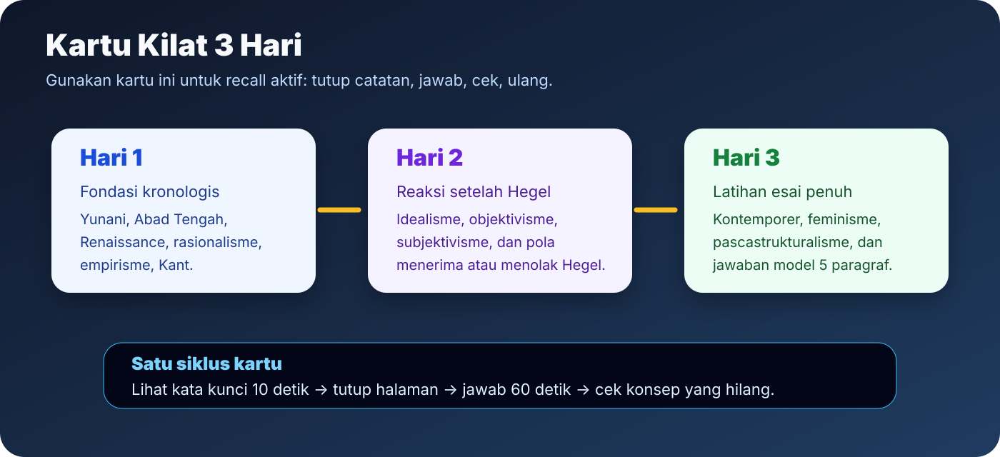
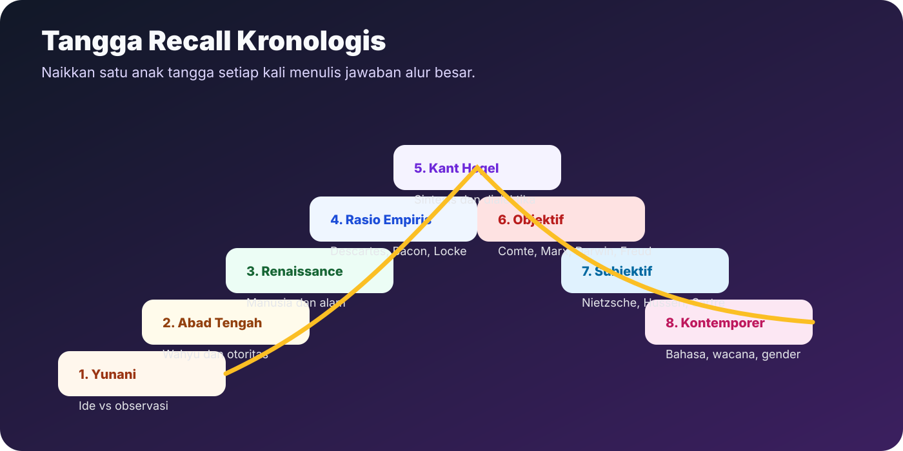
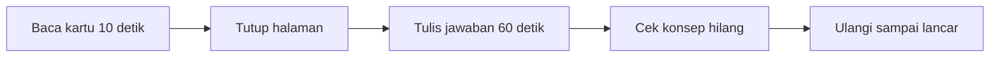
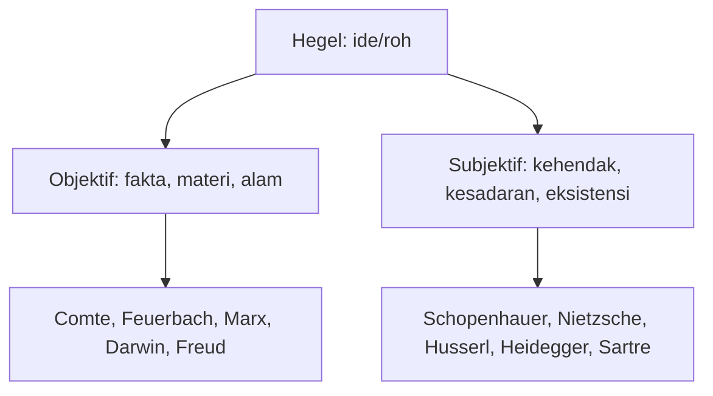
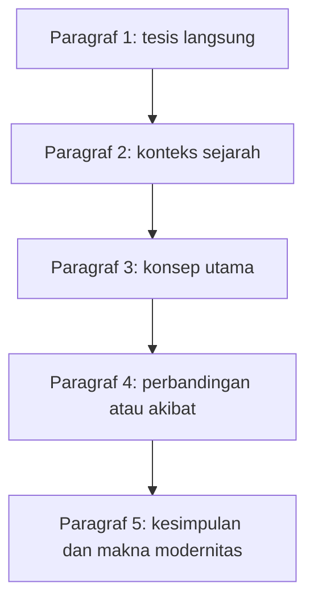

# Kartu Kilat 3 Hari

Halaman ini dipakai saat waktu tinggal tiga hari. Tujuannya bukan membaca ulang semua catatan, tetapi memaksa otak mengeluarkan urutan, konsep, dan perbandingan tanpa melihat jawaban.

## Cara Pakai

## Hari 1 - Fondasi Sampai Kant

| Kartu | Pertanyaan recall | Jawaban minimum |
|---|---|---|
| 1 | Apa beda Plato dan Aristoteles? | Plato menekankan ide tetap; Aristoteles menekankan substansi konkret, observasi, dan sebab. |
| 2 | Mengapa Abad Tengah penting? | Ia memperlihatkan dominasi teologi dan otoritas, lalu menjadi latar yang dikritik modernitas. |
| 3 | Mengapa Renaissance menjadi pintu modernitas? | Pusat perhatian bergeser ke manusia, alam, seni, rasio, dan kebebasan berpikir. |
| 4 | Apa inti rasionalisme? | Akal mencari dasar pasti yang tidak bergantung pada pengalaman inderawi yang mudah keliru. |
| 5 | Apa inti empirisme? | Pengalaman memberi bahan pengetahuan, tetapi harus dibersihkan dari bias dan diuji. |
| 6 | Apa posisi Kant? | Pengetahuan butuh isi dari pengalaman dan bentuk dari rasio; manusia mengetahui fenomena, bukan noumena. |

**Tes 3 menit:** jelaskan alur Plato -> Aristoteles -> Abad Tengah -> Renaissance -> rasionalisme -> empirisme -> Kant dalam satu paragraf.

**Jawaban model pendek:** Pemikiran modern berakar dari ketegangan antara Plato yang menekankan ide dan Aristoteles yang menekankan realitas konkret. Abad Tengah memasukkan filsafat ke dalam kerangka teologi dan otoritas. Renaissance menggeser pusat perhatian ke manusia dan alam. Rasionalisme mencari dasar pasti melalui akal, sedangkan empirisme menekankan pengalaman. Kant menyintesis keduanya dengan menyatakan bahwa pengalaman memberi isi dan rasio memberi bentuk.

## Hari 2 - Hegel dan Reaksi Modern

| Kartu | Pertanyaan recall | Jawaban minimum |
|---|---|---|
| 1 | Mengapa Hegel menjadi simpul? | Karena ia membangun sistem idealisme besar: realitas dan sejarah bergerak melalui dialektika roh. |
| 2 | Apa beda Fichte, Schelling, Hegel? | Fichte mulai dari Aku; Schelling dari identitas absolut; Hegel dari roh dan dialektika sejarah. |
| 3 | Apa itu reaksi objektif? | Reaksi yang memindahkan pusat dari ide ke fakta, materi, masyarakat, alam, dan psike. |
| 4 | Bagaimana Marx membalik Hegel? | Bentuk dialektika dipertahankan, tetapi isinya diubah dari ide menjadi kondisi material dan konflik kelas. |
| 5 | Apa itu reaksi subjektif? | Reaksi yang menekankan kehendak, pengalaman sadar, pilihan, kecemasan, dan eksistensi individu. |
| 6 | Apa rumus Sartre? | Eksistensi mendahului esensi: manusia ada dulu, lalu membentuk diri melalui pilihan. |

## Hari 3 - Kontemporer dan Esai

| Kartu | Pertanyaan recall | Jawaban minimum |
|---|---|---|
| 1 | Apa fokus kontemporer? | Bahasa, struktur, interpretasi, ideologi, wacana, kekuasaan, identitas, dan gender. |
| 2 | Apa inti Saussure? | Makna lahir dari sistem tanda, bukan hubungan langsung kata dengan benda. |
| 3 | Apa beda hermeneutika dan analitik? | Hermeneutika menafsirkan makna dalam konteks; analitik menjernihkan konsep dan logika bahasa. |
| 4 | Apa kritik pascastrukturalisme? | Struktur dan makna tidak pernah final; pembaca, wacana, dan perbedaan mengubah makna. |
| 5 | Apa kritik postmodernisme? | Curiga pada narasi besar seperti kemajuan, rasio universal, dan identitas stabil. |
| 6 | Mengapa feminisme masuk kontemporer? | Ia mengkritik struktur sosial yang membentuk ketidakadilan gender dan relasi kuasa. |

## Template Esai 5 Paragraf

## Latihan Kilat

**Soal 1:** Bandingkan rasionalisme dan empirisme, lalu jelaskan posisi Kant.

**Jawaban inti:** Rasionalisme menekankan akal sebagai dasar kepastian, sedangkan empirisme menekankan pengalaman sebagai sumber isi pengetahuan. Kant tidak memilih salah satu secara mutlak. Ia menyatakan bahwa pengalaman memberi bahan, tetapi rasio memberi bentuk agar pengalaman menjadi pengetahuan. Karena itu, Kant menjadi sintesis antara rasionalisme dan empirisme.

**Soal 2:** Mengapa Hegel penting bagi pemikiran setelahnya?

**Jawaban inti:** Hegel penting karena sistem idealismenya menjadi titik rujukan besar. Pemikir sesudahnya menerima, membalik, atau menolak Hegel. Marx membalik dialektika Hegel menjadi material, positivisme menolak spekulasi metafisis, dan eksistensialisme menolak sistem total yang mengabaikan individu konkret.

**Soal 3:** Buat alur dari modernitas klasik ke kontemporer.

**Jawaban inti:** Modernitas klasik dimulai dari pencarian dasar pengetahuan melalui rasio dan pengalaman. Kant menyintesis keduanya. Idealisme Jerman memuncak pada Hegel, lalu ditanggapi oleh objektivisme dan subjektivisme. Pemikiran kontemporer kemudian menggeser fokus ke bahasa, struktur, wacana, interpretasi, identitas, dan gender.

## Checklist Malam Sebelum Ujian

- Bisa menulis kronologi besar tanpa melihat catatan.
- Bisa membedakan rasionalisme, empirisme, Kant, dan Hegel.
- Bisa menjelaskan reaksi objektif dan subjektif terhadap Hegel.
- Bisa menjawab minimal 5 soal latihan dalam struktur 5 paragraf.
- Bisa menutup jawaban dengan makna bagi modernitas.
