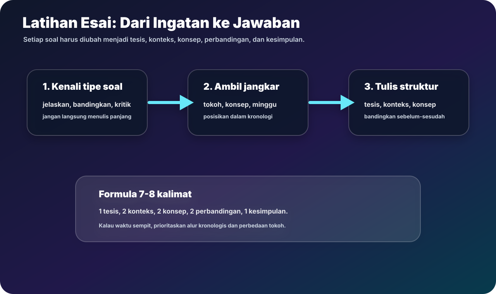
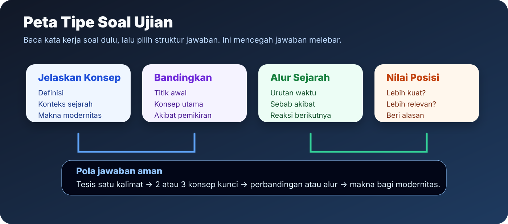
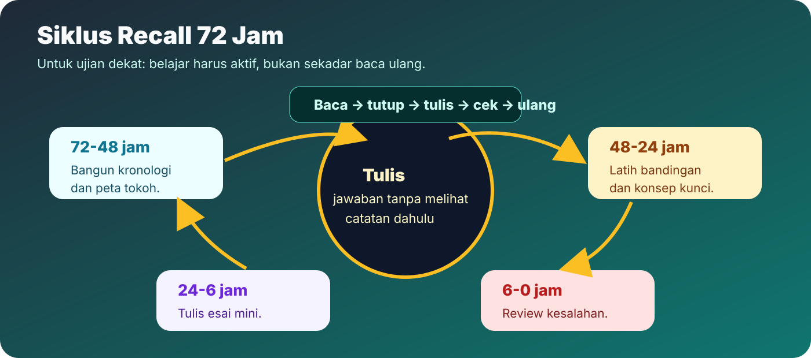
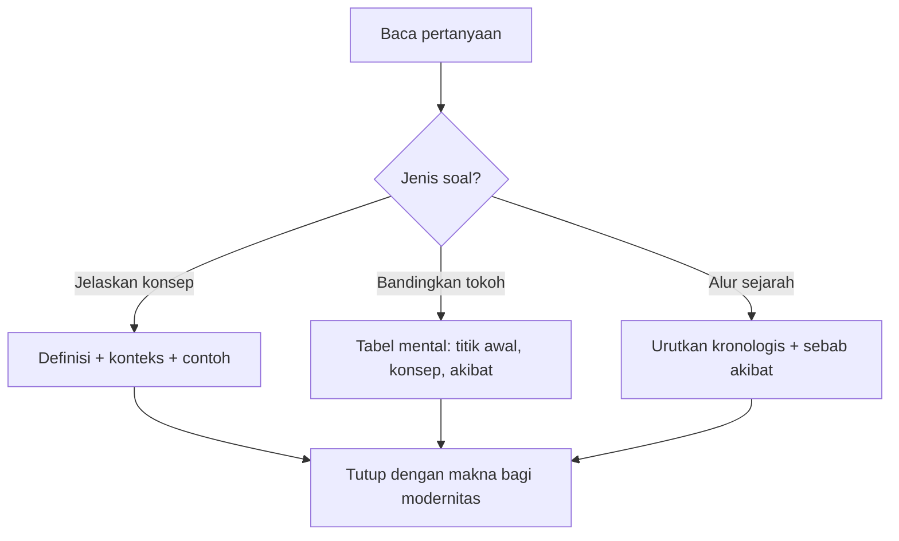
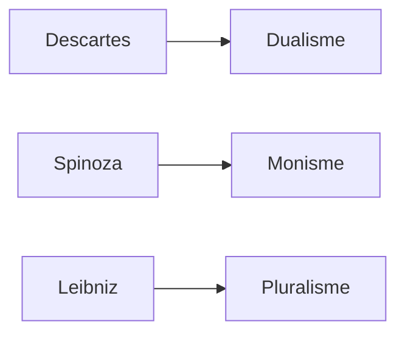
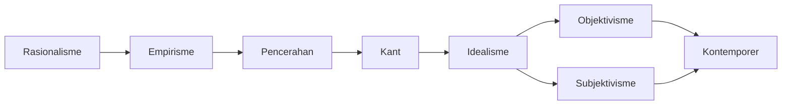

# Latihan Ujian dan Jawaban Model

Gunakan halaman ini pada hari terakhir. Targetnya bukan menghafal semua kalimat, tetapi menguasai pola jawaban. Setiap jawaban model sudah memakai pola tesis, alasan, perbandingan, dan kesimpulan.

## Peta Strategi Jawaban

## 1. Plato dan Aristoteles sering dianggap bertentangan. Mana yang lebih berterima?

**Jawaban model:** Pemikiran Aristoteles lebih berterima dalam konteks pemikiran modern karena lebih dekat dengan cara kerja ilmu pengetahuan yang mengandalkan observasi, klasifikasi, dan analisis dunia konkret. Plato penting karena menekankan realitas ide dan kebenaran universal, tetapi kecenderungannya memisahkan dunia ideal dari dunia inderawi membuat pengetahuan tampak terlalu jauh dari pengalaman. Aristoteles memberi tempat pada akal sekaligus pengalaman: manusia memahami realitas dengan mengamati benda konkret, menemukan sebab, dan menyusun konsep. Jadi, Aristoteles lebih berterima jika ukurannya adalah kedekatan dengan ilmu modern, sedangkan Plato tetap penting sebagai dasar idealisme.

**Kata kunci penilaian:** ide, pengalaman, akal, ilmu modern.

## 2. Apakah Descartes dapat dikategorikan sebagai skeptisis?

**Jawaban model:** Descartes tidak tepat dikategorikan sebagai skeptisis dalam arti final. Ia memang menggunakan keraguan secara radikal, tetapi keraguan itu bersifat metodis. Tujuannya bukan berhenti pada ketidakpastian, melainkan menemukan dasar kebenaran yang kokoh. Melalui keraguan, Descartes menemukan cogito ergo sum: aku berpikir, maka aku ada. Karena cogito menjadi evidensi dan fondasi sistem filsafatnya, Descartes adalah peragu metodis, bukan skeptisis final.

**Kata kunci penilaian:** keraguan metodis, cogito, evidensi, bukan skeptisis final.

## 3. Bandingkan Descartes, Spinoza, dan Leibniz.

**Jawaban model:** Descartes bersifat dualistik karena membedakan realitas ide dan realitas materi. Spinoza bersifat monistik karena hanya ada satu substansi, yaitu Tuhan atau alam, dan semua realitas lain bergantung pada substansi itu. Leibniz bersifat pluralistik karena realitas terdiri dari banyak monade yang memiliki perseptio dan appetitus. Ketiganya sama-sama rasionalis karena membangun filsafat dari akal, tetapi berbeda dalam struktur realitas: dua substansi, satu substansi, atau banyak substansi.

## 4. Jelaskan empat idola Bacon dan relevansinya bagi ilmu.

**Jawaban model:** Empat idola Bacon adalah idola tribus, specus, fori, dan theatri. Idola tribus adalah prasangka umum manusia sebagai manusia. Idola specus berasal dari keterbatasan pendidikan dan lingkungan pribadi. Idola fori muncul dari bahasa dan komunikasi yang menyesatkan. Idola theatri berasal dari sistem pemikiran atau tradisi lama yang diterima tanpa kritik. Relevansinya bagi ilmu adalah bahwa observasi tidak otomatis objektif; manusia harus membersihkan bias agar pengalaman benar-benar dapat menjadi dasar pengetahuan.

## 5. Bandingkan kontrak sosial Hobbes, Locke, dan Rousseau.

| Tokoh | Kondisi alamiah | Alasan negara | Implikasi |
|---|---|---|---|
| Hobbes | Egoistik dan berbahaya | Menghindari kekacauan | Negara kuat |
| Locke | Ada hukum alamiah, tetapi tidak selalu ditegakkan | Melindungi hak | Negara terbatas |
| Rousseau | Manusia pada dasarnya baik | Peradaban merusak manusia | Kehendak umum |

**Jawaban model:** Hobbes melihat keadaan alamiah sebagai keadaan egoistik dan tidak stabil, sehingga negara kuat diperlukan untuk menghentikan kekacauan. Locke lebih moderat: keadaan alamiah memiliki hukum alamiah, tetapi hukum itu tidak selalu ditegakkan, sehingga negara dibentuk untuk melindungi hak. Rousseau berbeda lagi karena manusia pada dasarnya baik, sedangkan peradaban dan ketimpangan sosial membuat manusia rusak. Perbedaan ini menunjukkan bahwa kontrak sosial tidak tunggal: Hobbes menekankan keamanan, Locke menekankan hak, dan Rousseau menekankan kehendak umum.

## 6. Jelaskan perbedaan Pencerahan Inggris, Perancis, dan Jerman.

**Jawaban model:** Pencerahan Inggris lebih teoritik dan epistemologis, terlihat pada Berkeley dan Hume yang melanjutkan empirisme dan membahas kesadaran. Pencerahan Perancis lebih praktis dan politis, terlihat pada Montesquieu, Voltaire, dan Rousseau yang membahas demokrasi, agama alamiah, absolutisme, dan kontrak sosial. Pencerahan Jerman berpusat pada Kant yang menyintesis rasionalisme dan empirisme. Jadi, Inggris menekankan teori pengetahuan, Perancis menekankan reformasi sosial-politik, dan Jerman menekankan kritik atas dasar pengetahuan.

## 7. Bagaimana Kant menyelesaikan pertentangan rasionalisme dan empirisme?

**Jawaban model:** Kant menyatakan bahwa pengetahuan membutuhkan isi dan bentuk. Isi berasal dari pengalaman inderawi, sedangkan bentuk berasal dari rasio. Empirisme benar karena tanpa pengalaman tidak ada bahan pengetahuan. Rasionalisme benar karena tanpa struktur rasio, pengalaman tidak dapat dipahami sebagai pengetahuan. Kant juga membedakan fenomena dan noumena. Pengetahuan manusia hanya menjangkau fenomena, yaitu realitas sebagaimana tampak dan diolah oleh kesadaran.

## 8. Mengapa Hegel menjadi pusat reaksi filsafat sesudahnya?

**Jawaban model:** Hegel menjadi pusat reaksi karena ia membangun sistem idealisme yang sangat luas: realitas dipahami sebagai gerak ide atau roh menuju Yang Absolut melalui dialektika. Setelah Hegel, pemikir lain menentukan posisi dengan menerima, membalik, atau menolak sistemnya. Feuerbach membalik idealisme menjadi materialisme antropologis, Marx membalik dialektika Hegel menjadi dialektika material, positivisme menolak spekulasi metafisis, dan eksistensialisme menolak sistem totalitas yang dianggap menenggelamkan individu.

## 9. Jelaskan tiga tahap perkembangan manusia menurut Comte.

**Jawaban model:** Comte membagi perkembangan manusia menjadi tahap teologis, metafisis, dan positif. Pada tahap teologis, manusia menjelaskan alam melalui Tuhan, dewa, atau kekuatan supernatural. Pada tahap metafisis, penjelasan supernatural diganti dengan abstraksi metafisis. Pada tahap positif, manusia tidak lagi mencari sebab di luar fakta yang teramati, melainkan menjelaskan hubungan antar-fakta secara ilmiah. Tahap positif menjadi dasar positivisme karena ilmu dianggap sebagai pengetahuan paling matang.

## 10. Bagaimana Marx mengubah dialektika Hegel?

**Jawaban model:** Marx mempertahankan struktur dialektika Hegel tetapi mengubah isinya. Hegel melihat sejarah sebagai gerak ide atau roh, sedangkan Marx melihat sejarah sebagai gerak kondisi material. Karena itu, dialektika Marx disebut dialektika material. Konflik sejarah terjadi karena pertentangan ekonomi dan kelas sosial. Marx juga menolak filsafat sebagai spekulasi belaka; tugas filsafat adalah mengubah realitas material.

## 11. Jelaskan naturalisme melalui Darwin dan Freud.

**Jawaban model:** Naturalisme menolak penjelasan di luar alam dan menyatakan bahwa manusia harus dipahami sebagai bagian dari fenomena alam. Darwin menjelaskan makhluk hidup melalui evolusi dan seleksi alam: yang paling adaptif bertahan dan meneruskan sifatnya. Freud menjelaskan manusia melalui struktur psikis alamiah, terutama ketidaksadaran. Dengan Darwin dan Freud, manusia tidak lagi dipahami sebagai makhluk sepenuhnya rasional, tetapi sebagai organisme dan subjek psikis yang dibentuk oleh proses alam dan dorongan tidak sadar.

## 12. Jelaskan filsafat kehendak Schopenhauer dan Nietzsche.

**Jawaban model:** Schopenhauer memahami kehendak sebagai dasar metafisik yang mengendalikan fenomena. Keinginan manusia melahirkan penderitaan, sehingga seni atau kontemplasi estetis menjadi jalan meredakan rasa sakit. Nietzsche mengubah pusat kehendak menjadi kehendak untuk berkuasa. Bagi Nietzsche, kehidupan adalah pertarungan kekuatan yang kreatif dan produktif. Ia menolak nilai lama melalui kritik nihilistik dan mengajukan gagasan ubermensch.

## 13. Apa yang dimaksud fenomenologi Husserl?

**Jawaban model:** Fenomenologi Husserl adalah usaha mendeskripsikan hal-hal sebagaimana menampakkan diri dalam kesadaran. Filsafat harus dimulai dari pengalaman sadar, bukan dari asumsi metafisis yang belum diperiksa. Konsep kuncinya adalah epoche atau reduksi, yaitu penundaan asumsi tentang kenyataan agar esensi fenomena tampak. Dengan demikian, fenomenologi menjadi metode untuk memahami struktur pengalaman subjektif secara ketat.

## 14. Jelaskan eksistensi mendahului esensi menurut Sartre.

**Jawaban model:** Menurut Sartre, manusia tidak memiliki hakikat yang ditentukan sejak awal. Manusia pertama-tama ada di dunia, lalu mendefinisikan dirinya melalui pilihan. Karena itu, eksistensi mendahului esensi. Kebebasan manusia sangat besar, tetapi kebebasan itu membawa tanggung jawab. Orang yang hanya mengikuti sistem moral siap pakai tanpa memilih secara sadar sedang menipu dirinya sendiri.

## 15. Jelaskan strukturalisme Saussure dan dampaknya.

**Jawaban model:** Saussure membedakan langue dan parole. Langue adalah sistem bahasa, sedangkan parole adalah penggunaan bahasa konkret. Ia juga membedakan signifier dan signified. Dengan ini, makna dipahami sebagai hasil sistem tanda, bukan hubungan langsung dengan benda. Dampaknya besar karena budaya, sastra, mitos, dan masyarakat dapat dianalisis sebagai sistem tanda. Strukturalisme menggeser pusat dari subjek individual ke struktur.

## 16. Apa perbedaan hermeneutika dan filsafat analitik?

**Jawaban model:** Hermeneutika menekankan penafsiran makna dalam teks, tanda, tradisi, dan konteks. Filsafat analitik menekankan analisis bahasa, logika, dan kejelasan konsep. Keduanya sama-sama memperhatikan bahasa, tetapi orientasinya berbeda: hermeneutika mencari pemahaman makna dalam konteks, sedangkan analitik mencari ketepatan proposisi dan kejernihan argumen.

## 17. Jelaskan kritik pascastrukturalisme terhadap strukturalisme.

**Jawaban model:** Pascastrukturalisme mengkritik keyakinan strukturalisme bahwa struktur dapat menjadi dasar stabil bagi makna. Bagi pascastrukturalisme, struktur tidak final dan makna selalu bergerak. Dalam analisis teks, pembaca dapat menggantikan penulis sebagai pusat, sehingga makna tidak tunggal. Kritik ini membuka jalan bagi postmodernisme dan teori wacana.

## 18. Jelaskan feminisme sebagai pemikiran kontemporer.

**Jawaban model:** Feminisme adalah filsafat dan gerakan yang memperhatikan kedudukan perempuan dalam masyarakat. Ia mengkritik penindasan perempuan yang berakar pada struktur politik, ekonomi, hubungan sosial, peran reproduksi, dan praktik seksual. Konsep kuncinya adalah pembedaan seks dan gender. Seks adalah kenyataan biologis, sedangkan gender adalah konstruksi sosial. Dengan pembedaan ini, feminisme menunjukkan bahwa banyak ketidakadilan terhadap perempuan berasal dari struktur sosial yang dapat diubah.

## 19. Buat satu alur besar dari rasionalisme sampai kontemporer.

**Jawaban model:** Alurnya dimulai dari rasionalisme yang mencari dasar pasti pengetahuan melalui akal. Empirisme menantangnya dengan menekankan pengalaman inderawi. Pencerahan membawa akal dan pengalaman ke ranah sosial-politik. Kant menyintesis rasio dan pengalaman, lalu idealisme mengembangkan realitas sebagai ide, subjek, atau roh. Hegel menjadi puncak idealisme, kemudian ditolak oleh pemikiran objektif seperti positivisme, materialisme, dan naturalisme. Sebagai reaksi lain, pemikiran subjektif menekankan kehendak, kesadaran, dan eksistensi. Pada abad ke-20, fokus berpindah ke bahasa, struktur, interpretasi, masyarakat, wacana, dan identitas.

## Checklist Hafalan Terakhir

- Descartes bukan skeptisis final; ia memakai keraguan sebagai metode.
- Spinoza monisme, Leibniz pluralisme, Descartes dualisme.
- Bacon penting karena idola menunjukkan observasi bisa bias.
- Hobbes, Locke, Rousseau wajib dibandingkan lewat kondisi alamiah dan tujuan negara.
- Kant adalah jembatan rasionalisme-empirisme.
- Hegel penting karena menjadi pusat reaksi setelah idealisme.
- Marx membalik dialektika Hegel dari ide menjadi materi.
- Nietzsche, Husserl, dan Sartre mengembalikan perhatian pada subjek.
- Saussure menggeser filsafat kontemporer ke bahasa dan struktur.
- Feminisme memakai pembedaan seks/gender untuk mengkritik struktur sosial.
