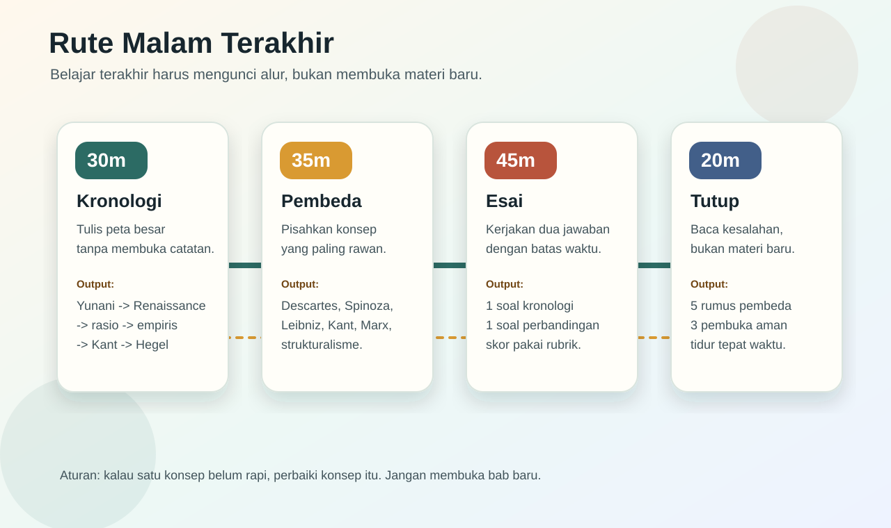
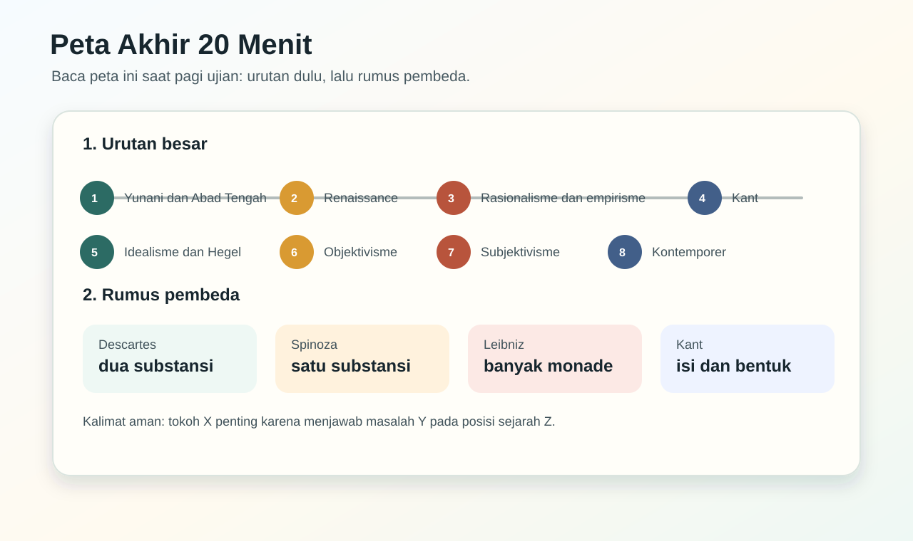
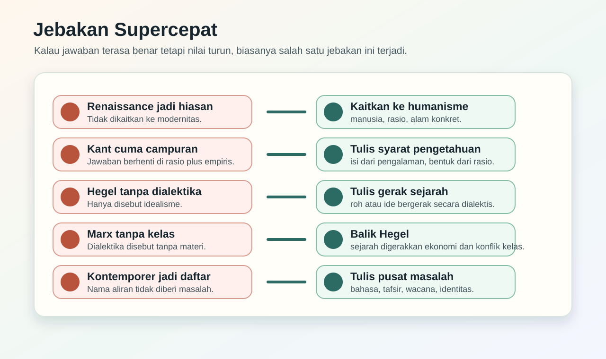
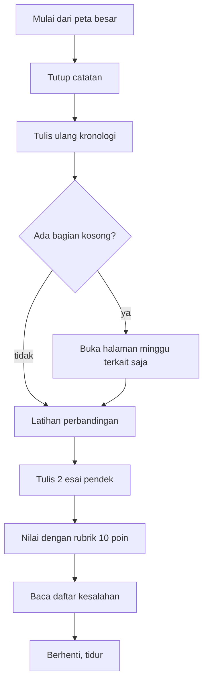
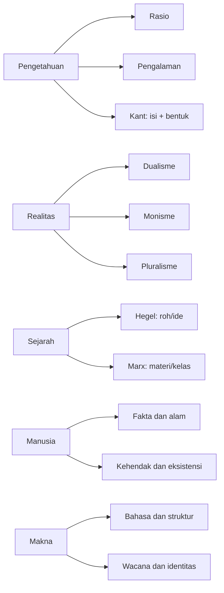
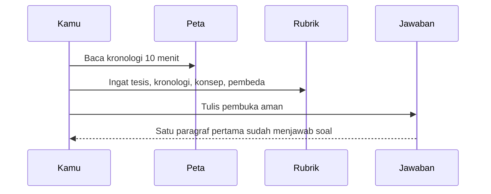
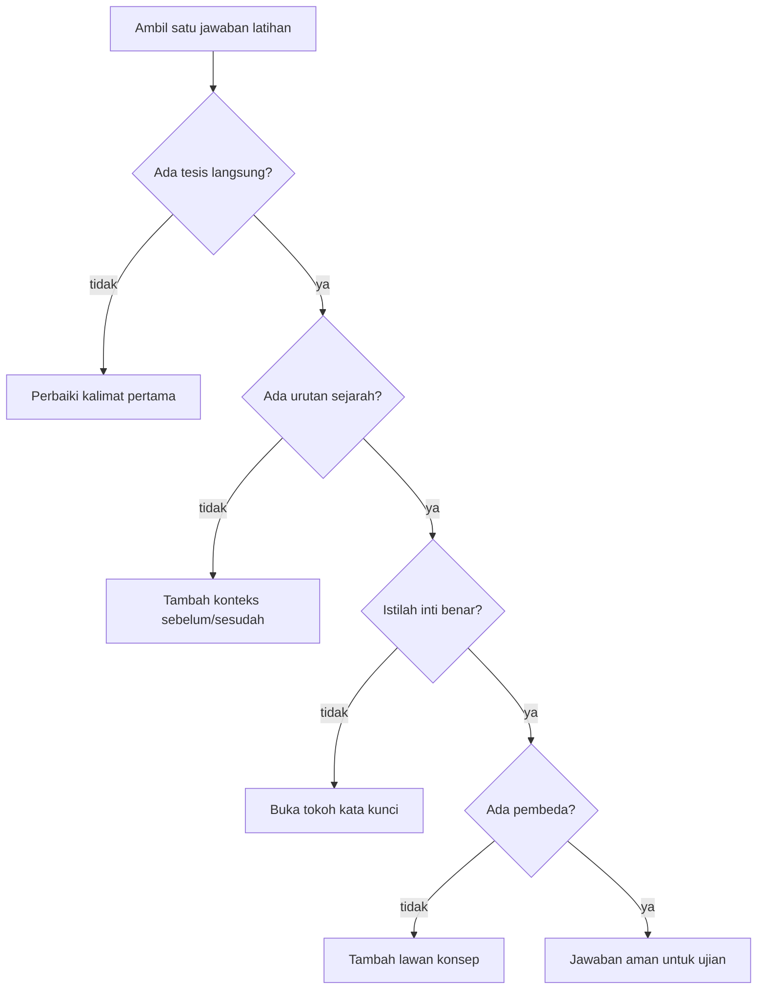

# Malam Terakhir dan Pagi Ujian

Halaman ini dipakai saat materi sudah pernah dibaca dan waktu tinggal sangat sedikit. Jangan pakai halaman ini untuk belajar dari nol. Pakai untuk mengunci urutan, memperbaiki konsep yang tertukar, dan menulis jawaban yang bisa langsung dinilai.

## Urutan Cram yang Benar

## 1. Peta Besar Tanpa Catatan

Tulis urutan ini dari ingatan. Kalau satu titik kosong, buka catatan hanya pada titik itu.

| Urutan | Tema | Kalimat pengunci |
|---:|---|---|
| 1 | Yunani dan Abad Tengah | Plato memberi arah ideal, Aristoteles memberi arah observasi, Abad Tengah menjaga hubungan filsafat dan teologi. |
| 2 | Renaissance | Humanisme menggeser pusat perhatian ke manusia, alam, dan kemampuan rasional. |
| 3 | Rasionalisme | Descartes, Spinoza, dan Leibniz mencari dasar pengetahuan melalui akal. |
| 4 | Empirisme | Bacon, Hobbes, Locke, Berkeley, dan Hume menekankan pengalaman, observasi, dan kritik atas bias. |
| 5 | Pencerahan dan Kant | Akal dan pengalaman masuk ke politik, masyarakat, dan kritik syarat pengetahuan. |
| 6 | Idealisme | Fichte, Schelling, dan Hegel memperbesar peran subjek, ide, dan roh. |
| 7 | Reaksi objektif | Comte, Feuerbach, Marx, Darwin, dan Freud menarik manusia ke fakta, materi, alam, dan psike. |
| 8 | Reaksi subjektif | Schopenhauer, Nietzsche, Husserl, Kierkegaard, Heidegger, dan Sartre menekankan kehendak, kesadaran, dan eksistensi. |
| 9 | Kontemporer | Bahasa, struktur, tafsir, wacana, identitas, dan gender menjadi pusat analisis. |

## 2. Lima Poros yang Wajib Aman

### Rumus Pembeda Superpendek

| Jika soal menyebut | Jangan jawab dengan | Jawab aman |
|---|---|---|
| Descartes | sekadar rasionalisme | keraguan metodis, cogito, dualisme. |
| Spinoza | dualisme | satu substansi: Tuhan atau alam. |
| Leibniz | monisme | banyak monade dengan persepsi dan dorongan. |
| Bacon | pengalaman biasa | induksi dan pembersihan idola. |
| Kant | kompromi campuran | syarat kemungkinan pengetahuan: isi dan bentuk. |
| Hegel | idealisme umum | dialektika roh atau ide dalam sejarah. |
| Marx | kritik sosial saja | pembalikan Hegel menjadi dialektika material. |
| Nietzsche | pesimisme | kritik nilai, nihilisme, kehendak untuk berkuasa. |
| Husserl | psikologi biasa | fenomenologi, epoche, kesadaran intensional. |
| Saussure | bahasa sebagai kata | sistem tanda: signifier dan signified. |

## 3. Pagi Ujian: Baca Ini, Bukan Materi Baru

Pagi ujian cukup lakukan tiga hal:

1. Baca peta kronologis 10 menit.
2. Baca rumus pembeda 10 menit.
3. Tulis tiga pembuka jawaban di kertas kosong.

Jangan membuka materi baru. Kalau ada konsep yang belum pernah dipahami, biarkan. Nilai lebih aman datang dari jawaban yang rapi pada konsep yang sudah dikenal.

## 4. Pembuka Jawaban Siap Pakai

Gunakan pembuka ini sebagai pola, bukan sebagai hafalan mati.

### Soal konsep

**Pola:** Konsep X penting karena menjawab masalah Y dalam konteks Z.

**Contoh:** Cogito Descartes penting karena menjawab kebutuhan modern akan dasar pengetahuan yang pasti. Dalam konteks rasionalisme, Descartes memakai keraguan metodis untuk menemukan satu hal yang tidak dapat diragukan, yaitu bahwa subjek sedang berpikir.

### Soal perbandingan

**Pola:** X dan Y sama-sama membahas A, tetapi berbeda pada B.

**Contoh:** Hegel dan Marx sama-sama memakai pola dialektika untuk memahami sejarah, tetapi berbeda pada dasar geraknya. Hegel melihat sejarah sebagai gerak ide atau roh, sedangkan Marx melihat sejarah sebagai gerak kondisi material dan konflik kelas.

### Soal kronologi

**Pola:** Perkembangan ini bergerak dari A menuju B karena masalah C belum selesai.

**Contoh:** Perkembangan dari rasionalisme menuju empirisme terjadi karena pencarian kepastian melalui akal perlu ditantang oleh pengalaman inderawi. Empirisme menegaskan bahwa pengetahuan tidak cukup dibangun dari ide bawaan atau deduksi rasional, tetapi harus memperhatikan pengalaman dan observasi.

## 5. Latihan Kilat 30 Menit

Kerjakan berurutan, jangan pilih-pilih.

### Latihan 1: Descartes sampai Kant

**Soal:** Jelaskan alur rasionalisme, empirisme, dan Kant.

**Jawaban inti:** Rasionalisme mencari dasar pengetahuan melalui akal, sedangkan empirisme menekankan pengalaman sebagai sumber isi pengetahuan. Kant menyatakan bahwa keduanya sama-sama perlu: pengalaman memberi isi, rasio memberi bentuk. Karena itu, Kant bukan sekadar campuran, melainkan filsuf kritis yang menjelaskan syarat kemungkinan pengetahuan manusia.

### Latihan 2: Hegel sampai Marx

**Soal:** Mengapa Marx disebut membalik Hegel?

**Jawaban inti:** Hegel memahami sejarah sebagai gerak ide atau roh melalui dialektika. Marx mempertahankan bentuk dialektika, tetapi mengganti dasarnya menjadi kondisi material, ekonomi, dan konflik kelas. Karena itu, Marx membalik Hegel dari idealisme menjadi materialisme.

### Latihan 3: Kontemporer

**Soal:** Mengapa bahasa menjadi penting dalam pemikiran kontemporer?

**Jawaban inti:** Bahasa menjadi penting karena makna tidak lagi dianggap hanya berasal dari subjek individual atau benda di luar bahasa. Saussure menunjukkan bahwa makna muncul dari sistem tanda. Hermeneutika menekankan penafsiran, sedangkan pascastrukturalisme dan postmodernisme menunjukkan bahwa makna dapat bergerak dan terkait dengan wacana serta kekuasaan.

## 6. Skor Cepat Sebelum Tidur

Kalau satu jawaban sudah aman, berhenti memperbaiki halaman itu. Tujuan malam terakhir adalah stabil, bukan sempurna di semua detail.

## 7. Daftar Jangan Dilakukan

- Jangan membaca semua halaman dari awal sampai akhir.
- Jangan menambah tokoh baru yang belum pernah dipahami.
- Jangan menghafal kalimat model tanpa mengerti posisi kronologisnya.
- Jangan menulis jawaban panjang tanpa tesis.
- Jangan membandingkan tokoh tanpa menyebut titik beda.
- Jangan tidur setelah membuka materi baru yang membuat peta besar kacau.
