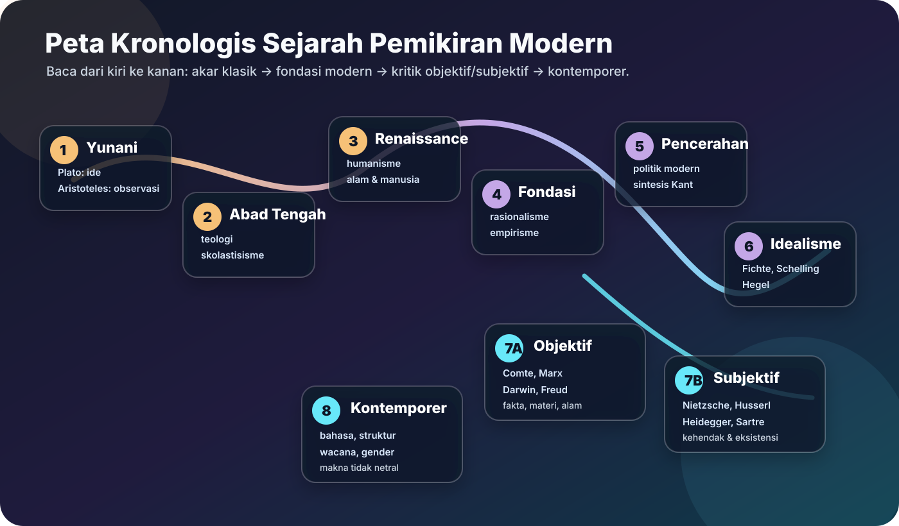
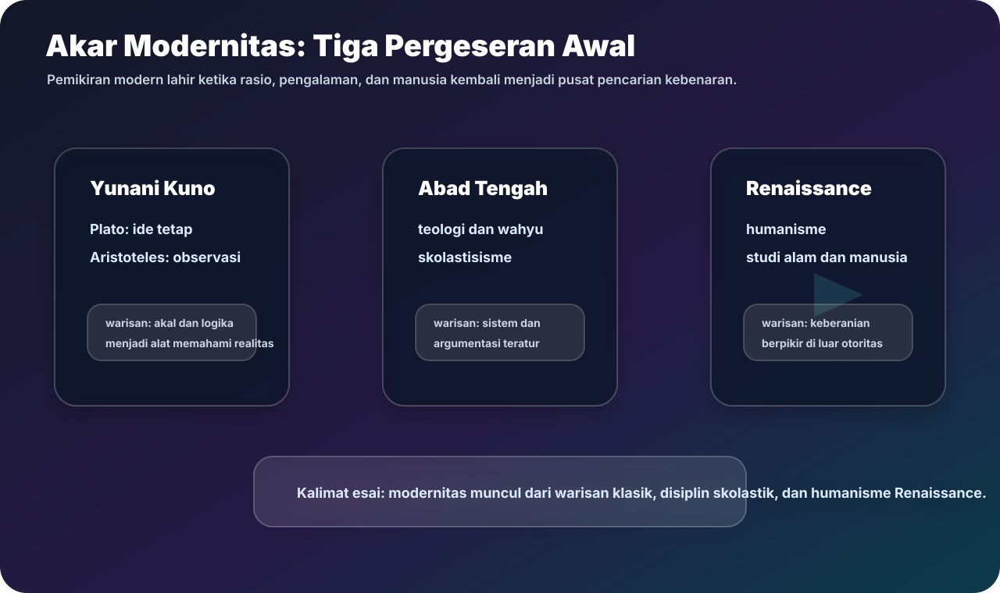
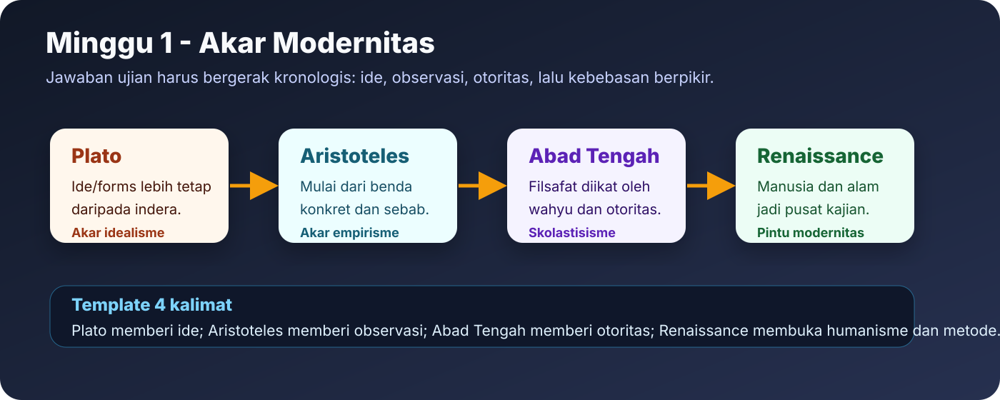
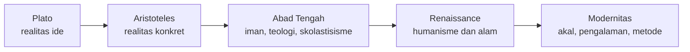
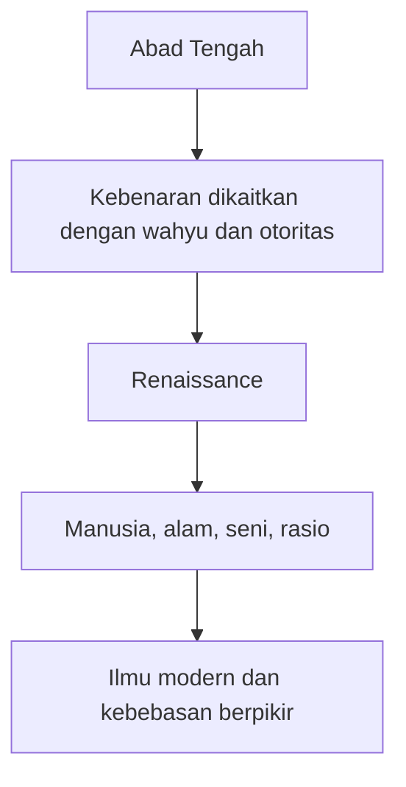

# Minggu 1 - Akar Modernitas

Minggu pertama menjelaskan bahwa pemikiran modern tidak lahir tiba-tiba. Modernitas muncul dari tegangan antara warisan Yunani Kuno, dominasi teologi Abad Tengah, dan perubahan orientasi pada Renaissance.

## Alur Kronologis

## Plato: Ide Lebih Tinggi daripada Indera

Plato menekankan dunia ide atau forms. Benda-benda yang ditangkap indera selalu berubah, sedangkan ide bersifat tetap dan universal. Karena itu, pengetahuan sejati tidak cukup berasal dari pancaindera. Akal harus menangkap bentuk ideal di balik benda-benda.

**Makna bagi modernitas:** Plato menjadi akar idealisme. Ia memberi warisan bahwa realitas terdalam bisa dipahami sebagai sesuatu yang rasional, ideal, dan tidak sepenuhnya tergantung pada materi.

## Aristoteles: Dunia Konkret sebagai Awal Pengetahuan

Aristoteles lebih dekat dengan observasi. Ia tidak menolak akal, tetapi akal bekerja melalui pengamatan terhadap benda konkret, klasifikasi, dan pencarian sebab. Bentuk tidak berada di dunia lain seperti pada Plato, melainkan berada dalam benda itu sendiri.

**Makna bagi modernitas:** Aristoteles menjadi akar empirisme dan ilmu pengetahuan karena memberi tempat penting kepada observasi, logika, dan penggolongan realitas.

## Abad Tengah: Teologi dan Otoritas

Abad Tengah ditandai oleh dominasi teologi dan skolastisisme. Filsafat sering diarahkan untuk menjelaskan dan membela iman. Kebenaran tidak hanya dicari melalui rasio atau pengalaman, tetapi juga melalui wahyu dan otoritas gereja.

Modernitas muncul sebagian sebagai reaksi terhadap pola ini. Rasionalisme dan empirisme sama-sama mencari dasar pengetahuan yang dapat dipertanggungjawabkan tanpa bergantung sepenuhnya pada otoritas tradisional.

## Renaissance: Jembatan Menuju Modernitas

Renaissance memindahkan pusat perhatian dari dunia teosentris menuju manusia, alam, seni, dan kemampuan rasional. Manusia mulai dipandang sebagai pusat aktivitas budaya dan pengetahuan. Alam dipelajari sebagai objek yang dapat diamati, dihitung, dan dijelaskan.

## Perbandingan Plato dan Aristoteles

| Aspek | Plato | Aristoteles |
|---|---|---|
| Realitas utama | Ide/forms yang tetap | Substansi konkret |
| Sumber pengetahuan | Akal menangkap ide universal | Observasi lalu penalaran |
| Arah pengaruh | Idealisme | Empirisme dan ilmu |
| Risiko posisi | Terlalu jauh dari pengalaman | Dapat terlalu terikat pada dunia inderawi |

## Peta Jawaban Ujian

Jika ditanya hubungan Plato, Aristoteles, dan modernitas, jawab begini:

1. Plato memberi akar bagi idealisme karena menekankan realitas ide.
2. Aristoteles memberi akar bagi empirisme karena menekankan observasi dunia konkret.
3. Abad Tengah menyerap filsafat dalam kerangka teologi.
4. Renaissance membuka jalan bagi modernitas dengan humanisme dan studi alam.

## Latihan Singkat

**Pertanyaan:** Mengapa Renaissance dapat disebut pintu masuk pemikiran modern?

**Jawaban model:** Renaissance dapat disebut pintu masuk pemikiran modern karena ia menggeser pusat perhatian dari otoritas teologis menuju manusia, alam, dan kemampuan rasional. Dalam Renaissance, manusia mulai dipahami sebagai subjek aktif yang mampu mencipta, meneliti, dan menafsirkan dunia. Alam tidak hanya dilihat sebagai simbol teologis, tetapi sebagai objek yang dapat diamati dan dijelaskan. Pergeseran ini menyiapkan rasionalisme, empirisme, dan ilmu modern.

**Kata kunci:** Plato, Aristoteles, skolastisisme, teologi, otoritas, humanisme, Renaissance, observasi.
