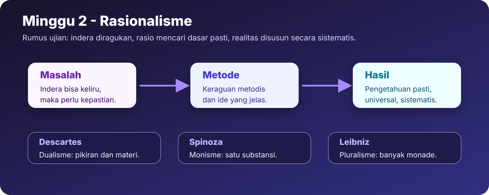
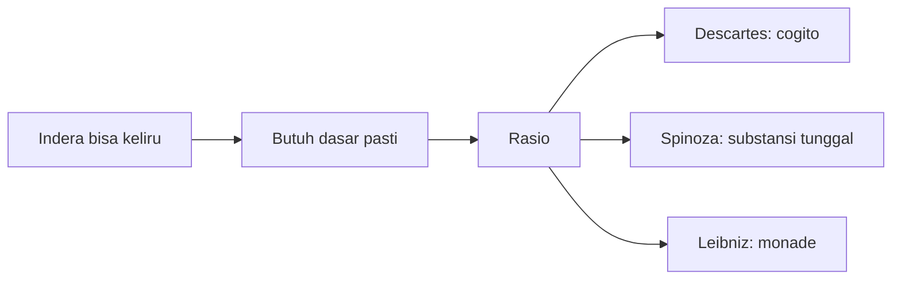
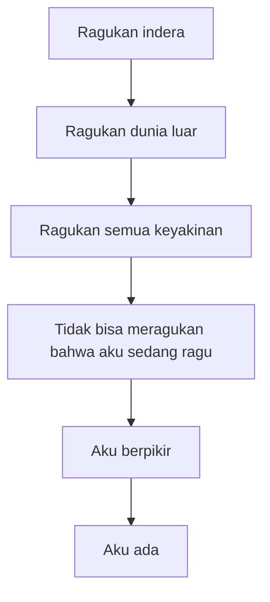
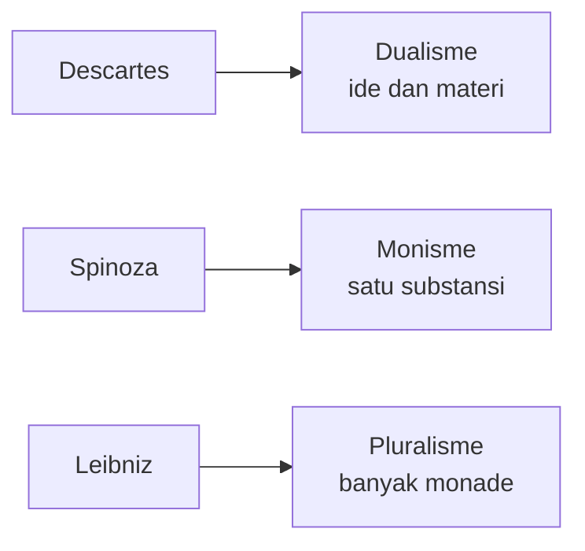

# Minggu 2 - Rasionalisme

Rasionalisme menempatkan rasio sebagai dasar utama pengetahuan yang hakiki. Ia muncul sebagai respons terhadap skolastisisme dan kepercayaan berlebihan pada indera. Pertanyaan besarnya: **apa dasar pengetahuan yang benar-benar pasti?**

## Alur Konsep

## Gagasan Umum Rasionalisme

Rasionalisme percaya bahwa akal dapat mencapai kebenaran yang pasti, universal, dan sistematis. Indera dianggap tidak cukup kuat karena mudah tertipu: benda jauh tampak kecil, mimpi terasa nyata, dan pengalaman berubah-ubah.

Rasionalisme bukan sekadar berpikir abstrak. Ia adalah proyek membangun fondasi pengetahuan yang kokoh.

## Descartes: Keraguan Metodis dan Cogito

Descartes memulai dari metode keraguan. Semua yang dapat diragukan harus diragukan: indera, dunia luar, bahkan pengetahuan yang tampak biasa. Tujuannya bukan menjadi skeptisis, tetapi menemukan kepastian yang tidak bisa diragukan.

Kepastian itu adalah **cogito ergo sum**: aku berpikir, maka aku ada. Jika aku ragu, berarti aku sedang berpikir. Jika aku berpikir, aku harus ada sebagai subjek yang berpikir.

Dalam metafisika, Descartes bersifat dualistik:

| Realitas | Penjelasan |
|---|---|
| Res cogitans | Realitas berpikir, jiwa, ide, subjek |
| Res extensa | Realitas keluasan, tubuh, materi, dunia fisik |

## Spinoza: Monisme Substansi

Spinoza berbeda dari Descartes. Jika Descartes membagi realitas menjadi dua, Spinoza melihat realitas sebagai satu substansi. Substansi tunggal itu disebut Tuhan atau alam. Segala sesuatu bergantung pada substansi ini dan tidak berdiri sendiri secara hakiki.

**Kunci ujian:** Spinoza adalah rasionalis monistik. Ia membangun sistem dari aksioma dan melihat realitas sebagai satu kesatuan.

## Leibniz: Pluralisme Monade

Leibniz menolak dualisme Descartes dan monisme Spinoza. Baginya, realitas terdiri dari banyak substansi kecil yang disebut **monade**. Monade memiliki perseptio, yaitu kemampuan menerima atau merepresentasikan sesuatu, dan appetitus, yaitu dorongan untuk berubah atau mengejar keadaan tertentu.

Monade bertingkat: material, primitif, animal, manusiawi, dan Tuhaniah. Dengan ini, Leibniz membangun realitas yang plural tetapi tetap rasional.

## Perbandingan Tiga Rasionalis

| Tokoh | Metode dasar | Struktur realitas | Kata kunci |
|---|---|---|---|
| Descartes | Keraguan metodis | Dualisme | Cogito, evidensi |
| Spinoza | Aksioma | Monisme | Tuhan, substansi |
| Leibniz | Prinsip rasional | Pluralisme | Monade, perseptio, appetitus |

## Latihan Singkat

**Pertanyaan:** Apakah Descartes dapat disebut skeptisis?

**Jawaban model:** Descartes tidak tepat disebut skeptisis dalam arti akhir. Ia memang meragukan segala sesuatu, tetapi keraguan itu bersifat metodis. Tujuannya adalah menemukan dasar pengetahuan yang pasti. Dari keraguan, Descartes menemukan cogito: aku berpikir, maka aku ada. Karena ia menemukan kepastian dan membangun sistem filsafat dari kepastian itu, Descartes adalah peragu metodis, bukan skeptisis final.

**Kata kunci:** rasio, keraguan metodis, cogito, evidensi, dualisme, aksioma, monisme, substansi, monade.
