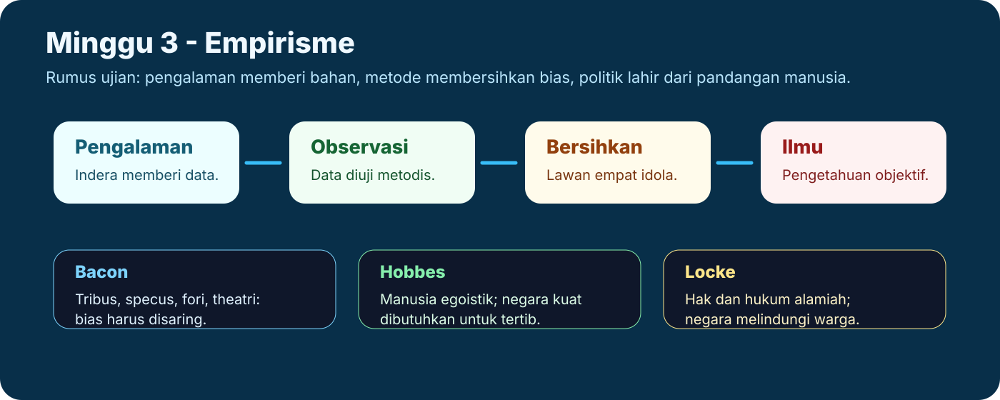
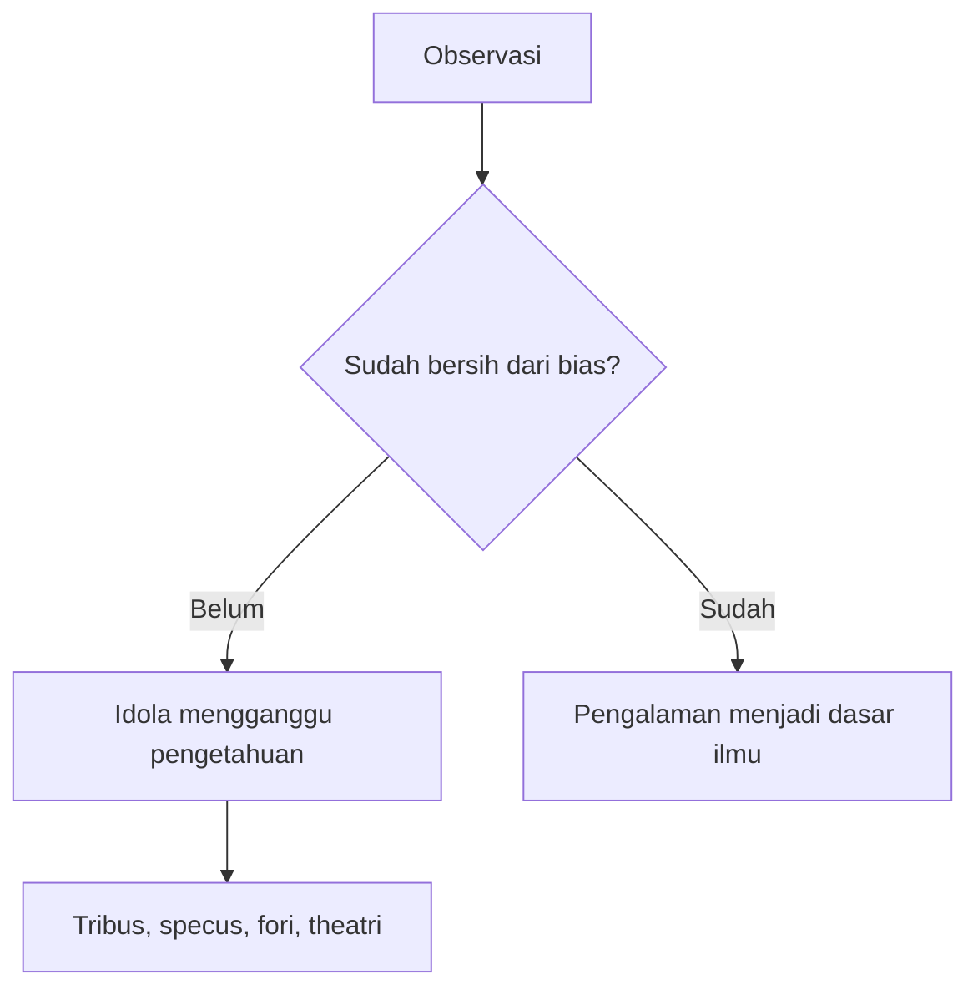
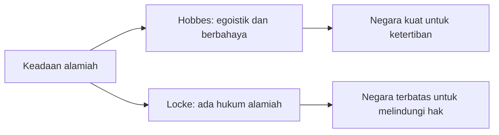

# Minggu 3 - Empirisme

Empirisme menekankan pengalaman pancaindera sebagai sumber utama pengetahuan. Jika rasionalisme berkembang kuat di Eropa Daratan, empirisme berkembang kuat di Inggris. Empirisme menantang rasionalisme dengan pertanyaan: **apakah akal punya isi tanpa pengalaman?**

## Alur Konsep

## Gagasan Umum Empirisme

Empirisme tidak selalu menolak akal. Akal tetap bekerja, tetapi bahan pengetahuan berasal dari pengalaman. Karena itu, empirisme menjadi dasar penting ilmu modern: ilmu memerlukan pengamatan, pengujian, dan pembebasan diri dari prasangka.

## Francis Bacon: Idola sebagai Hambatan Ilmu

Bacon menekankan bahwa pengalaman hanya berguna jika manusia membersihkan bias berpikir. Hambatan itu disebut **idola**.

| Idola | Arti | Contoh cepat |
|---|---|---|
| Idola tribus | Prasangka manusia sebagai manusia | Mengira alam selalu mengikuti keinginan manusia |
| Idola specus | Prasangka pribadi dari pendidikan/lingkungan | Satu orang terlalu terikat pada kebiasaan belajarnya |
| Idola fori | Prasangka bahasa dan komunikasi | Kata yang kabur membuat orang salah paham |
| Idola theatri | Prasangka dari sistem lama | Menerima teori lama tanpa kritik |

## Thomas Hobbes: Realisme Naif dan Negara Kuat

Hobbes percaya bahwa indera memberi pengetahuan secara langsung. Karena itu, posisinya kadang disebut realisme naif. Dalam filsafat politik, Hobbes terkenal dengan pandangan bahwa kondisi alamiah manusia bersifat egoistik: **homo homini lupus**, manusia menjadi serigala bagi manusia lain.

Karena keadaan alamiah tidak stabil, manusia membentuk kontrak sosial dan negara yang kuat untuk menciptakan damai dan ketertiban.

## John Locke: Pengalaman dan Hak

Locke tetap empirisis, tetapi lebih kompleks daripada Hobbes. Ia menerima pengalaman inderawi dan pengalaman batin. Namun pengalaman batin tetap berawal dari pengalaman inderawi, sehingga Locke tetap empirisis.

Dalam politik, Locke juga memakai kontrak sosial. Bedanya, bagi Locke keadaan alamiah memiliki hukum alamiah. Negara dibentuk bukan terutama untuk menekan kekacauan total, tetapi untuk melindungi hak dan menegakkan hukum alamiah.

## Kontrak Sosial: Hobbes vs Locke

| Aspek | Hobbes | Locke |
|---|---|---|
| Kondisi alamiah | Berbahaya, egoistik | Ada hukum alamiah, tetapi lemah pelaksanaannya |
| Tujuan negara | Menghentikan kekacauan | Melindungi hak |
| Kecenderungan politik | Negara kuat | Liberalisme politik |

## Latihan Singkat

**Pertanyaan:** Jelaskan relevansi empat idola Bacon bagi ilmu modern.

**Jawaban model:** Empat idola Bacon penting karena menunjukkan bahwa observasi tidak otomatis objektif. Idola tribus, specus, fori, dan theatri dapat membuat manusia melihat realitas secara keliru. Ilmu modern membutuhkan pengalaman, tetapi pengalaman harus dibersihkan dari bias. Karena itu, Bacon tidak hanya menekankan pancaindera, melainkan juga disiplin metodis agar data yang diperoleh benar-benar dapat menjadi dasar pengetahuan.

**Kata kunci:** empirisme, pancaindera, observasi, idola, realisme naif, kontrak sosial, hukum alamiah.
