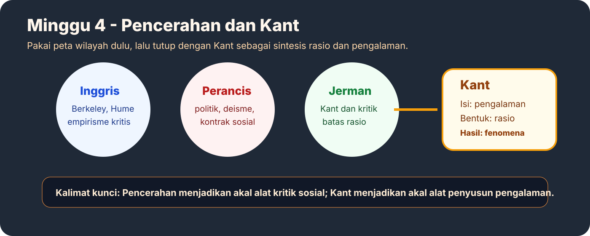
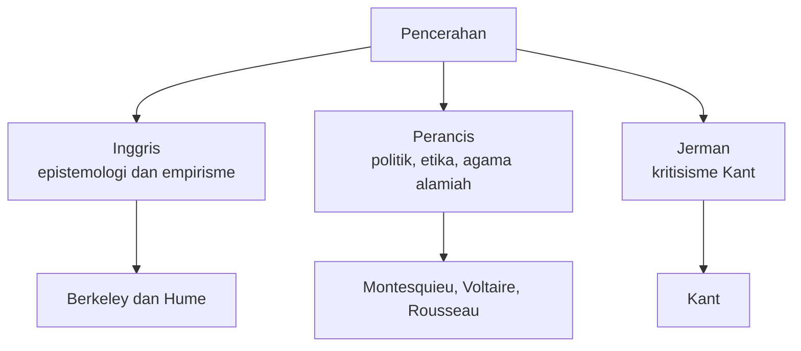
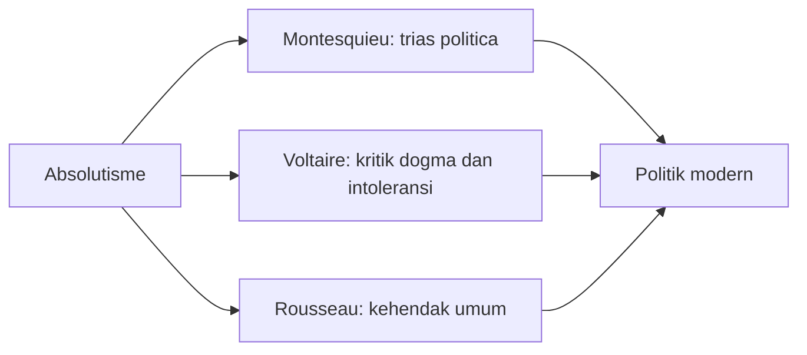
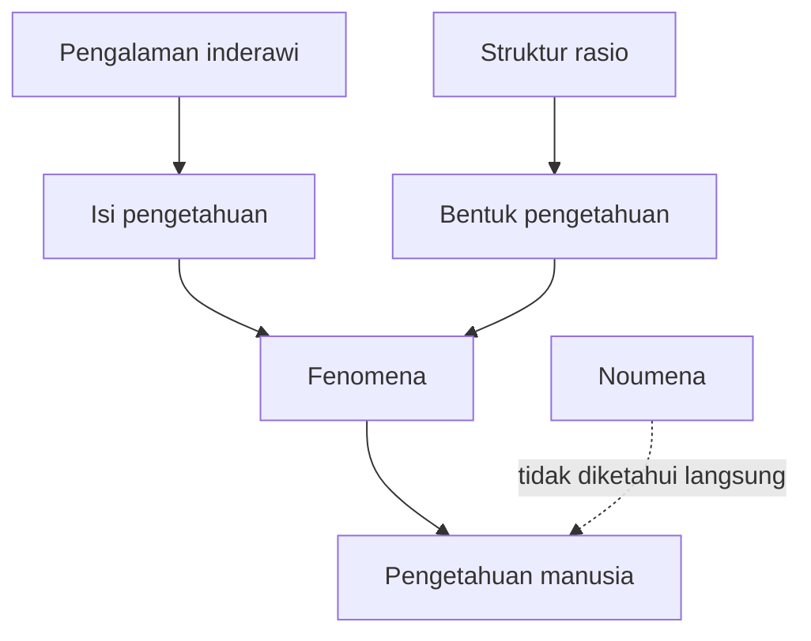

# Minggu 4 - Masa Pencerahan

Masa Pencerahan atau Aufklarung adalah periode ketika akal dipakai untuk mengkritik otoritas lama dan menyusun ulang masyarakat. Berbeda dari rasionalisme yang lebih teoritis, Pencerahan membawa akal ke politik, hukum, etika, agama, dan kebudayaan.

## Peta Wilayah Pencerahan

## Ciri Umum Pencerahan

Pencerahan percaya bahwa manusia dapat membebaskan diri dari dogma melalui akal. Otoritas gereja, wahyu, absolutisme politik, dan tradisi lama mulai dikritik. Pencerahan bukan hanya teori pengetahuan; ia menjadi proyek pembebasan sosial.

## Pencerahan Inggris: Berkeley dan Hume

Berkeley secara epistemologis empirisis karena pengetahuan berasal dari pengalaman. Namun secara metafisis ia idealis: yang dialami manusia adalah ide, bukan benda material yang berdiri sendiri di luar kesadaran. Rumus cepatnya: realitas yang diketahui selalu berada dalam pengalaman sadar.

Hume lebih radikal. Ia meragukan substansi tetap dan melihat pengetahuan sebagai rangkaian pengalaman. Hume mendorong empirisme ke arah skeptisisme metafisis karena ia tidak menerima realitas substansial yang berdiri sendiri secara pasti.

## Pencerahan Perancis: Politik dan Kritik Otoritas

Montesquieu menolak absolutisme dan mengajukan trias politica: pemisahan kekuasaan legislatif, eksekutif, dan yudikatif. Tujuannya mencegah kesewenang-wenangan.

Voltaire menekankan agama alamiah, deisme, etika, dan kritik terhadap intoleransi. Ia menerima Tuhan sebagai pencipta, tetapi menolak dominasi dogma agama atas akal.

Rousseau mengkritik peradaban yang membuat manusia saling bersaing. Dalam kontrak sosial, ia menekankan kehendak umum sebagai dasar legitimasi politik.

## Kant: Sintesis Rasionalisme dan Empirisme

Kant adalah titik penting karena ia tidak memilih rasionalisme atau empirisme secara mutlak. Menurut Kant, pengetahuan membutuhkan dua unsur:

| Unsur | Asal | Fungsi |
|---|---|---|
| Isi pengetahuan | Pengalaman inderawi | Memberi bahan |
| Bentuk pengetahuan | Rasio | Mengatur pengalaman menjadi pengetahuan |

Tanpa pengalaman, pikiran kosong. Tanpa rasio, pengalaman kacau. Kant juga membedakan fenomena dan noumena. Manusia hanya mengetahui fenomena, yaitu realitas sebagaimana tampak dan diolah oleh kesadaran. Noumena adalah realitas pada dirinya sendiri yang tidak dapat dijangkau langsung.

## Flowchart Kant

## Latihan Singkat

**Pertanyaan:** Bagaimana Kant menyelesaikan pertentangan rasionalisme dan empirisme?

**Jawaban model:** Kant menyelesaikan pertentangan itu dengan menyatakan bahwa pengetahuan membutuhkan pengalaman dan rasio sekaligus. Empirisme benar karena pengalaman memberi isi pengetahuan. Rasionalisme benar karena rasio memberi bentuk agar pengalaman dapat dipahami. Dengan sintesis ini, Kant menunjukkan bahwa manusia tidak mengetahui realitas sebagaimana adanya, melainkan fenomena yang sudah diolah oleh struktur kesadaran.

**Kata kunci:** Pencerahan, Aufklarung, deisme, trias politica, kehendak umum, Kant, fenomena, noumena.
