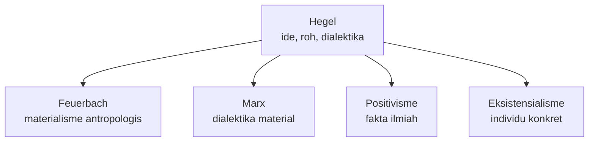

# Minggu 5 - Idealisme

Idealisme berkembang setelah Kant. Jika Kant masih membatasi pengetahuan pada fenomena, para idealis Jerman mencoba memahami realitas sebagai aktivitas ide, subjek, roh, atau Yang Absolut.

## Alur Besar Idealisme

## Fichte: Aku Absolut

Fichte memulai dari aku absolut. Realitas bukan-aku diturunkan dari aktivitas aku. Artinya, subjek bukan penerima pasif realitas, melainkan prinsip aktif yang membentuk medan pengalaman.

**Kunci ujian:** Fichte menekankan subjek sebagai sumber. Dunia bukan-aku dipahami dalam hubungan dengan aktivitas aku.

## Schelling: Identitas Absolut

Schelling mengkritik posisi yang terlalu menekankan aku. Baginya, aku dan bukan-aku sama-sama bersumber dari Absolut yang netral. Alam dan roh bukan dua hal yang sepenuhnya terpisah, melainkan ekspresi dari satu dasar yang sama.

**Kunci ujian:** Schelling menekankan kesatuan asal antara subjek dan objek.

## Hegel: Dialektika Roh

Hegel adalah puncak idealisme Jerman. Realitas dipahami sebagai gerak ide atau roh menuju Yang Absolut. Gerak ini terjadi secara dialektis: tesis, antitesis, dan sintesis. Sejarah bukan kumpulan peristiwa acak, tetapi proses rasional tempat roh menyadari dirinya.

## Tiga Idealis dalam Satu Tabel

| Tokoh | Titik awal | Cara melihat realitas | Kata kunci |
|---|---|---|---|
| Fichte | Aku absolut | Realitas bukan-aku lahir dalam aktivitas aku | Subjek, aktivitas |
| Schelling | Identitas absolut | Subjek dan objek berasal dari Absolut | Alam, roh, identitas |
| Hegel | Roh/ide | Realitas bergerak dialektis menuju Absolut | Dialektika, sejarah |

## Mengapa Hegel Penting?

Hegel menjadi pusat reaksi filsafat sesudahnya. Pemikir setelah Hegel sering menentukan posisi dengan menerima, membalik, atau menolak sistemnya. Feuerbach membalik idealisme menjadi materialisme antropologis. Marx membalik dialektika Hegel menjadi dialektika material. Positivisme menolak spekulasi metafisis. Eksistensialisme menolak sistem totalitas yang menenggelamkan individu.

## Flowchart Reaksi terhadap Hegel

## Latihan Singkat

**Pertanyaan:** Jelaskan idealisme Fichte, Schelling, dan Hegel secara perbandingan.

**Jawaban model:** Fichte memulai dari aku absolut sehingga realitas bukan-aku dipahami sebagai hasil aktivitas subjek. Schelling menolak penekanan berlebihan pada aku dan menyatakan bahwa aku serta bukan-aku berasal dari identitas absolut yang netral. Hegel memahami realitas sebagai gerak ide atau roh menuju Yang Absolut melalui dialektika. Jadi, Fichte menekankan subjek, Schelling menekankan kesatuan asal, dan Hegel menekankan proses historis-dialektis.

**Kata kunci:** idealisme, aku absolut, identitas absolut, roh, dialektika, tesis, antitesis, sintesis.
