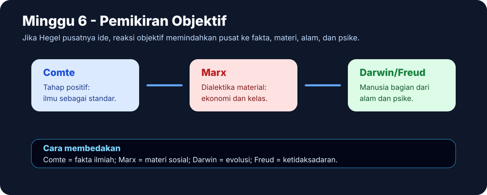
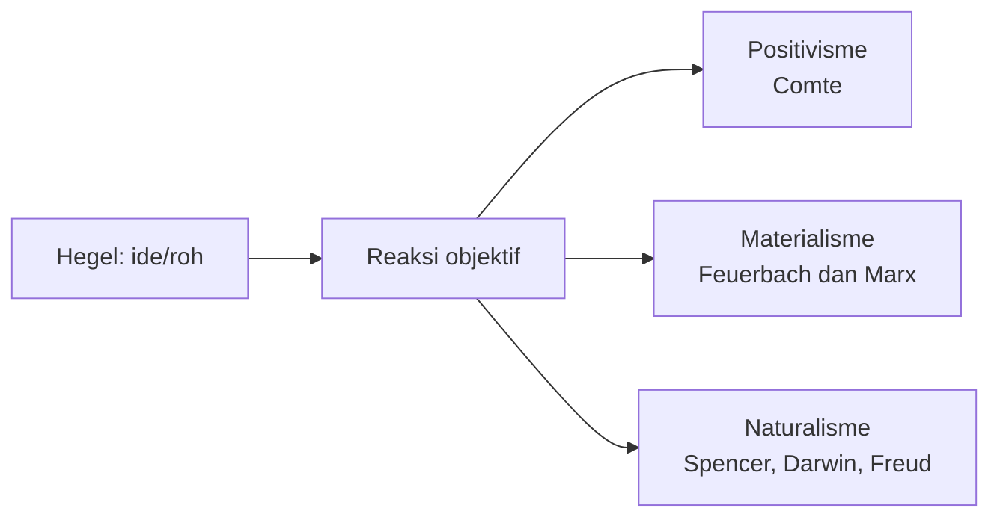
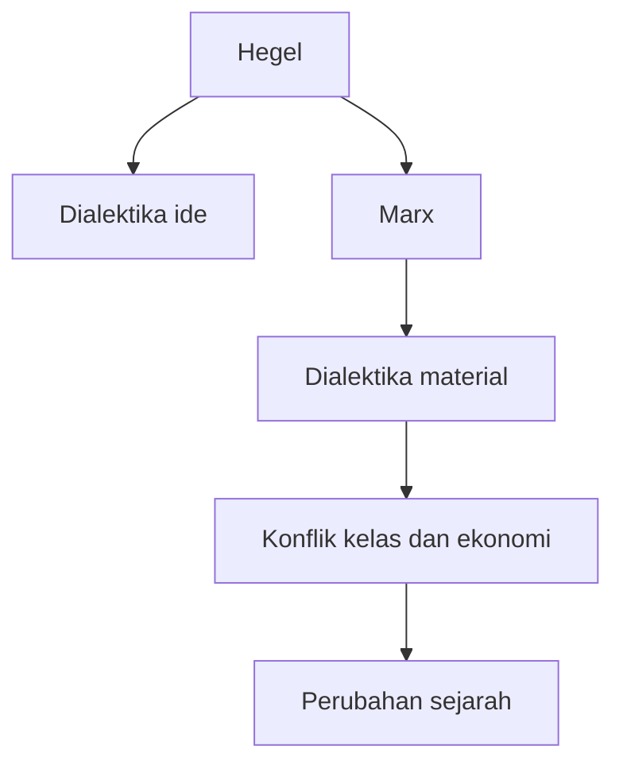

# Minggu 6 - Pemikiran Objektif Pembentuk Modernitas

Pemikiran objektif muncul sebagai reaksi negatif terhadap idealisme Hegel. Jika Hegel menempatkan ide atau roh sebagai pusat, pemikiran objektif menggeser pusat ke fakta, materi, masyarakat, alam, dan proses ilmiah.

## Alur Umum

## Positivisme Comte

Comte menyatakan bahwa perkembangan manusia melewati tiga tahap:

1. **Teologis:** peristiwa dijelaskan melalui Tuhan, dewa, atau kekuatan supernatural.
2. **Metafisis:** penjelasan memakai abstraksi metafisis.
3. **Positif:** manusia menjelaskan hubungan antar-fakta secara ilmiah.

**Kunci ujian:** Positivisme menolak spekulasi yang tidak dapat diuji dan menganggap ilmu positif sebagai bentuk pengetahuan paling matang.

## Feuerbach dan Marx: Materialisme

Feuerbach membalik Hegel dengan menempatkan manusia konkret sebagai dasar. Agama dipahami sebagai proyeksi manusia. Realitas bukan terutama roh, melainkan manusia material.

Marx mempertahankan struktur dialektika Hegel, tetapi mengubah isinya. Bagi Hegel, sejarah bergerak melalui ide. Bagi Marx, sejarah bergerak melalui kondisi material, ekonomi, dan konflik kelas. Karena itu, Marx disebut memakai **dialektika material**.

## Naturalisme: Spencer, Darwin, Freud

Naturalisme menolak penjelasan di luar alam. Manusia dipahami sebagai bagian dari proses alam.

Darwin menjelaskan makhluk hidup melalui evolusi dan seleksi alam. Makhluk yang paling adaptif bertahan dan meneruskan sifatnya.

Freud menjelaskan manusia melalui struktur psikis, terutama ketidaksadaran. Ego, id, dan superego menunjukkan bahwa manusia tidak sepenuhnya dikuasai rasio sadar.

| Tokoh | Fokus | Makna bagi modernitas |
|---|---|---|
| Comte | Fakta ilmiah | Ilmu positif sebagai standar pengetahuan |
| Feuerbach | Manusia material | Agama sebagai proyeksi manusia |
| Marx | Ekonomi dan kelas | Sejarah sebagai konflik material |
| Darwin | Evolusi alam | Manusia bagian dari proses biologis |
| Freud | Ketidaksadaran | Subjek tidak sepenuhnya rasional |

## Latihan Singkat

**Pertanyaan:** Bagaimana Marx mengubah dialektika Hegel?

**Jawaban model:** Marx mempertahankan bentuk dialektika Hegel, tetapi mengubah isinya dari ideal menjadi material. Hegel memahami sejarah sebagai gerak ide atau roh, sedangkan Marx memahami sejarah sebagai gerak kondisi material, terutama ekonomi dan konflik kelas. Karena itu, dialektika Marx disebut dialektika material. Filsafat tidak cukup menafsirkan dunia; bagi Marx, filsafat harus mengubah realitas material.

**Kata kunci:** positivisme, tiga tahap Comte, materialisme, Feuerbach, Marx, dialektika material, naturalisme, Darwin, Freud.
