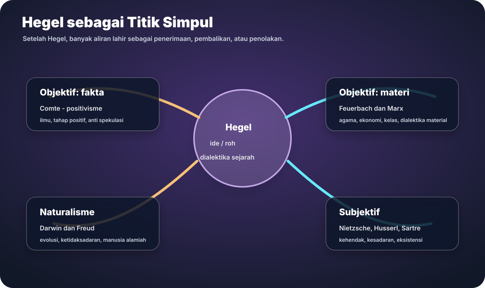
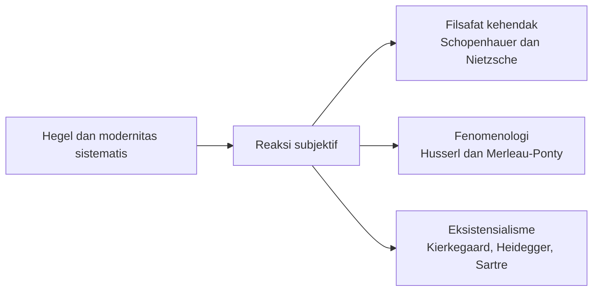
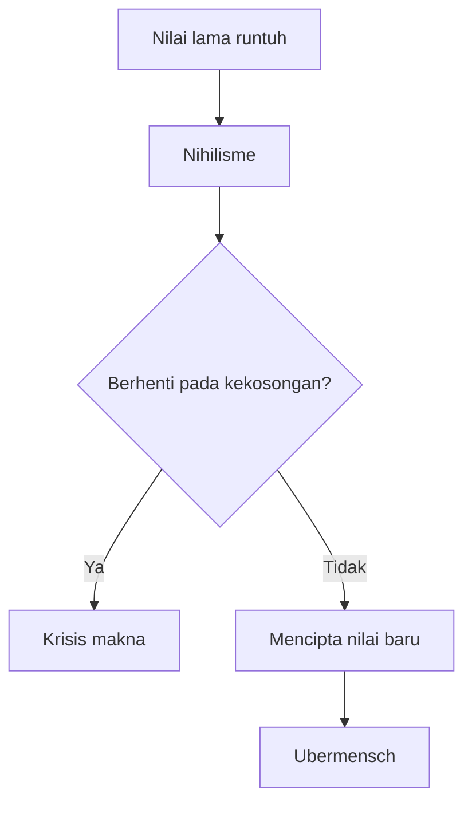

# Minggu 7 - Pemikiran Subjektif Pembentuk Modernitas

Pemikiran subjektif merespons Hegel dari arah lain. Jika pemikiran objektif menekankan fakta, materi, dan alam, pemikiran subjektif menekankan kehendak, kesadaran, pengalaman, dan eksistensi konkret.

## Alur Umum

## Schopenhauer: Kehendak dan Penderitaan

Schopenhauer memahami kehendak sebagai dasar metafisik yang menggerakkan fenomena. Keinginan manusia tidak pernah benar-benar selesai, sehingga hidup selalu berhubungan dengan penderitaan. Seni dan kontemplasi estetis menjadi jalan untuk meredakan penderitaan.

## Nietzsche: Kehendak untuk Berkuasa

Nietzsche mengubah gagasan kehendak menjadi kehendak untuk berkuasa. Kehidupan adalah pertarungan kekuatan yang kreatif dan produktif. Ia mengkritik nilai moral lama, membuka tema nihilisme, dan mengajukan gagasan ubermensch sebagai manusia yang mencipta nilai.

## Fenomenologi Husserl

Fenomenologi berusaha mendeskripsikan hal-hal sebagaimana menampakkan diri dalam kesadaran. Husserl memakai **epoche** atau reduksi: menunda asumsi tentang dunia agar struktur pengalaman tampak lebih jernih.

Reduksi dapat dipahami sebagai langkah:

1. Tunda asumsi tentang realitas luar.
2. Perhatikan bagaimana sesuatu menampakkan diri dalam kesadaran.
3. Cari esensi pengalaman.
4. Jelaskan struktur kesadaran secara ketat.

## Eksistensialisme: Kierkegaard, Heidegger, Sartre

Eksistensialisme menekankan keberadaan manusia konkret, pilihan, kecemasan, kebebasan, dan tanggung jawab. Kierkegaard menekankan subjektivitas dan lompatan iman. Heidegger menekankan Dasein, keberadaan manusia yang selalu berada-di-dunia. Sartre menyatakan bahwa eksistensi mendahului esensi.

Menurut Sartre, manusia tidak memiliki hakikat tetap sejak awal. Manusia pertama-tama ada, lalu mendefinisikan dirinya melalui pilihan. Kebebasan ini membawa tanggung jawab.

## Perbandingan Cepat

| Aliran | Fokus | Pertanyaan inti |
|---|---|---|
| Filsafat kehendak | Dorongan non-rasional | Apa yang menggerakkan manusia selain rasio? |
| Fenomenologi | Kesadaran dan pengalaman | Bagaimana realitas menampakkan diri? |
| Eksistensialisme | Kebebasan dan pilihan | Bagaimana manusia memberi makna pada hidupnya? |

## Latihan Singkat

**Pertanyaan:** Jelaskan konsep "eksistensi mendahului esensi" menurut Sartre.

**Jawaban model:** Menurut Sartre, manusia tidak memiliki hakikat yang ditentukan sejak awal. Manusia pertama-tama hadir di dunia, lalu membentuk dirinya melalui pilihan. Karena tidak ada esensi tetap yang mendahului hidup manusia, manusia bebas menentukan makna dirinya. Namun kebebasan ini juga membawa tanggung jawab. Manusia tidak bisa bersembunyi di balik moral siap pakai tanpa memilih secara sadar.

**Kata kunci:** kehendak, penderitaan, nihilisme, ubermensch, epoche, fenomenologi, Dasein, eksistensi mendahului esensi.
