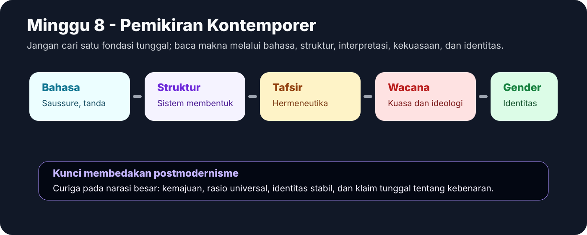
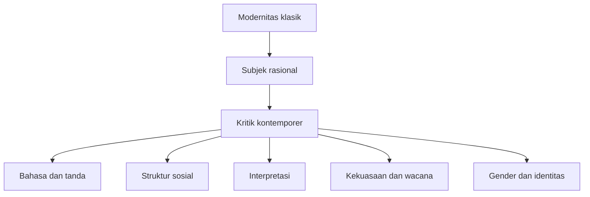
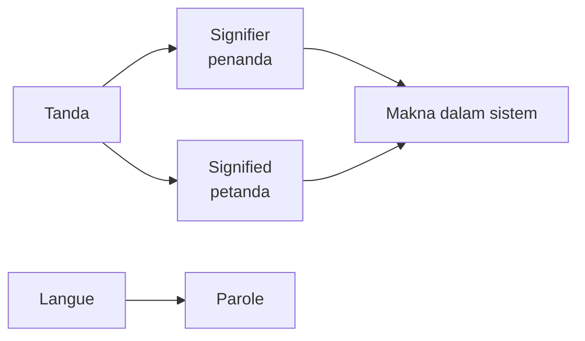
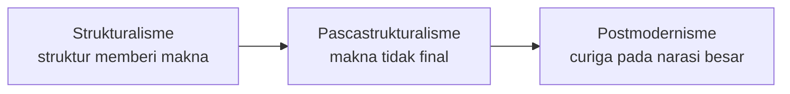

# Minggu 8 - Pemikiran Kontemporer

Pada abad ke-20, fokus filsafat bergeser dari fondasi akal dan pengalaman menuju bahasa, struktur, interpretasi, masyarakat, wacana, kekuasaan, identitas, dan gender.

## Alur Umum

## Strukturalisme Saussure

Saussure membedakan **langue** dan **parole**. Langue adalah sistem bahasa, sedangkan parole adalah penggunaan bahasa konkret. Ia juga membedakan **signifier** atau penanda dan **signified** atau petanda. Makna tidak muncul dari hubungan langsung kata dengan benda, melainkan dari sistem tanda.

**Dampak:** budaya, sastra, mitos, dan masyarakat dapat dianalisis sebagai sistem tanda. Fokus bergeser dari subjek individual ke struktur yang membentuk pikiran dan tindakan.

## Hermeneutika dan Filsafat Analitik

Hermeneutika menekankan penafsiran makna dalam teks, tanda, tradisi, dan konteks. Ia bertanya bagaimana pesan dipahami.

Filsafat analitik menekankan analisis bahasa, logika, dan kejernihan konsep. Keduanya sama-sama memperhatikan bahasa, tetapi orientasinya berbeda.

| Aspek | Hermeneutika | Filsafat analitik |
|---|---|---|
| Fokus | Interpretasi makna | Kejelasan konsep dan logika |
| Objek | Teks, tradisi, konteks | Proposisi, bahasa, argumen |
| Tujuan | Memahami makna | Menghindari kekaburan |

## Neo-Marxisme dan Teori Kritis

Neo-Marxisme melanjutkan perhatian Marx pada masyarakat, ekonomi, dan kekuasaan, tetapi tidak selalu mereduksi semuanya ke ekonomi. Ia melihat budaya, ideologi, media, dan rasionalitas modern sebagai arena dominasi.

## Pascastrukturalisme dan Postmodernisme

Pascastrukturalisme mengkritik strukturalisme karena struktur dianggap tidak pernah final. Makna selalu bergerak, pembaca dapat menggantikan penulis sebagai pusat, dan konsep diri yang tunggal dianggap konstruksi.

Postmodernisme mengkritik narasi besar modernitas: kemajuan, rasio universal, ilmu sebagai satu-satunya kebenaran, dan identitas stabil. Ia menekankan pluralitas, fragmentasi, dan kecurigaan terhadap klaim total.

## Feminisme

Feminisme adalah filsafat dan gerakan yang memperhatikan kedudukan perempuan dalam masyarakat. Ia mengkritik penindasan yang berasal dari struktur politik, ekonomi, hubungan sosial, peran reproduksi, dan praktik seksual.

Konsep pentingnya adalah perbedaan **seks** dan **gender**. Seks adalah kenyataan biologis, sedangkan gender adalah konstruksi sosial tentang peran dan identitas. Dengan pembedaan ini, feminisme menunjukkan bahwa banyak ketidakadilan bukan berasal dari biologi, melainkan dari struktur sosial yang dapat dikritik dan diubah.

## Latihan Singkat

**Pertanyaan:** Jelaskan dampak strukturalisme Saussure bagi pemikiran kontemporer.

**Jawaban model:** Saussure berdampak besar karena ia menunjukkan bahwa makna dibentuk oleh sistem tanda. Dengan membedakan langue dan parole serta signifier dan signified, ia menggeser analisis dari subjek individual ke struktur bahasa. Dampaknya, budaya, sastra, mitos, dan masyarakat dapat dipahami sebagai sistem tanda. Inilah dasar penting bagi strukturalisme dan kritik kontemporer terhadap gagasan bahwa makna berasal langsung dari individu.

**Kata kunci:** langue, parole, signifier, signified, hermeneutika, analitik, Neo-Marxisme, pascastrukturalisme, postmodernisme, feminisme, seks, gender.
