# Sejarah Pemikiran Modern

Catatan ini disusun untuk kondisi ujian dalam 3 hari: pahami alur besar dulu, kuasai perbandingan tokoh, lalu latih jawaban esai. Urutan pembahasan dibuat kronologis dari akar Yunani Kuno sampai pemikiran kontemporer.

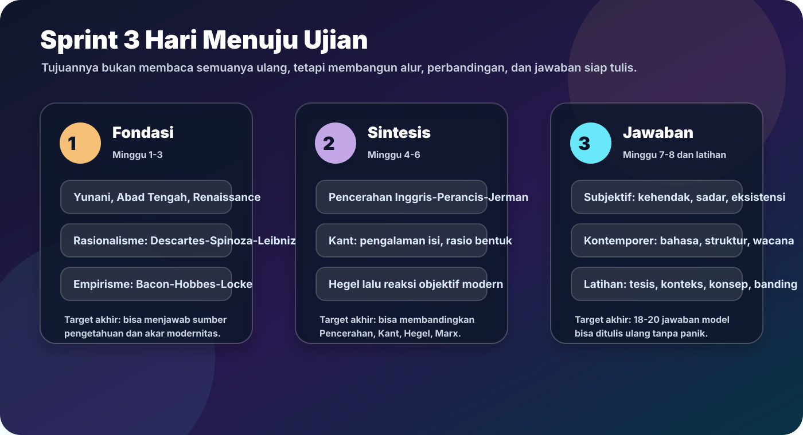

:::info Cara pakai 3 hari
**Hari 1:** Minggu 1-3, fokus akar modernitas, rasionalisme, empirisme.  
**Hari 2:** Minggu 4-6, fokus Pencerahan, Kant, Idealisme, objektivisme modern.  
**Hari 3:** Minggu 7-8 dan latihan esai, fokus subjektivisme, kontemporer, dan jawaban perbandingan.
:::

## Jalur Cepat 3 Hari

Kalau waktu benar-benar tinggal sedikit, jangan baca halaman secara acak. Pakai urutan ini:

| Waktu | Buka halaman | Output wajib |
|---|---|---|
| H-3 pagi | [Overview](overview) dan [Kartu Kilat 3 Hari](kartu-kilat-3-hari) | Timeline besar tanpa melihat catatan. |
| H-3 malam | [Tokoh dan Kata Kunci](tokoh-kata-kunci) | 20 tokoh dengan satu konsep inti. |
| H-2 | [Perbandingan Rawan Tertukar](perbandingan-rawan-tertukar) | 6 paragraf pembeda konsep. |
| H-1 | [Rubrik dan Simulasi Esai](rubrik-simulasi-esai) | 2 esai penuh yang dinilai 10 poin. |
| Malam terakhir | [Malam Terakhir](malam-terakhir) | Satu peta akhir, dua esai pendek, daftar kesalahan. |
| Pagi ujian | [Latihan Ujian](latihan-ujian) | Baca jawaban model, bukan materi baru. |

## Peta Kronologis Utama

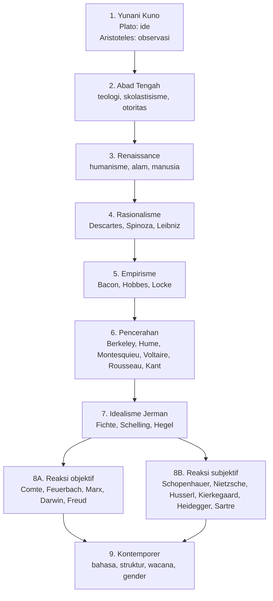

## Inti Mata Kuliah

Sejarah Pemikiran Modern membahas perubahan cara manusia Barat memahami pengetahuan, realitas, masyarakat, subjek, bahasa, dan kekuasaan. Alurnya tidak acak. Modernitas dimulai ketika manusia mulai mencari dasar pengetahuan yang tidak bergantung penuh pada otoritas lama. Rasionalisme memberi pusat pada akal, empirisme memberi pusat pada pengalaman, Pencerahan membawa keduanya ke proyek sosial-politik, Kant membuat sintesis, idealisme memperbesar peran subjek/roh, lalu pemikiran setelah Hegel bereaksi melalui fakta objektif, materi, kehendak, eksistensi, bahasa, struktur, dan kekuasaan.

## Tabel Cepat Minggu 1-8

| Minggu | Tema | Tokoh/konsep pusat | Pertanyaan ujian inti |
|---|---|---|---|
| 1 | Akar modernitas | Plato, Aristoteles, Abad Tengah, Renaissance | Dari mana cara berpikir modern muncul? |
| 2 | Rasionalisme | Descartes, Spinoza, Leibniz | Apakah akal dapat menjadi dasar pengetahuan pasti? |
| 3 | Empirisme | Bacon, Hobbes, Locke | Apakah pengalaman inderawi adalah sumber utama pengetahuan? |
| 4 | Pencerahan | Berkeley, Hume, Montesquieu, Voltaire, Rousseau, Kant | Bagaimana akal, pengalaman, dan politik modern disusun ulang? |
| 5 | Idealisme | Fichte, Schelling, Hegel | Apakah realitas terdalam adalah ide, roh, atau subjek? |
| 6 | Objektivisme modern | Comte, Feuerbach, Marx, Spencer, Darwin, Freud | Apakah realitas dapat dijelaskan secara ilmiah, material, dan natural? |
| 7 | Subjektivisme modern | Schopenhauer, Nietzsche, Husserl, Merleau-Ponty, Kierkegaard, Heidegger, Sartre | Bagaimana kehendak, kesadaran, dan eksistensi mengubah modernitas? |
| 8 | Kontemporer | Strukturalisme, hermeneutika, analitik, Neo-Marxisme, pascastrukturalisme, postmodernisme, feminisme | Apakah bahasa, struktur, wacana, dan kekuasaan membentuk manusia? |

## Poros Besar yang Harus Dihafal

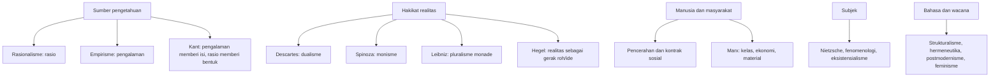

## Tokoh Jangkar Visual

Gunakan empat tokoh ini sebagai penanda peta besar: Descartes membuka rasionalisme modern, Kant menjadi titik sintesis, Marx membalik Hegel menjadi materialisme, Nietzsche membuka kritik tajam terhadap nilai modern.

<table>
  <tr>
    <td align="center"> <strong>Descartes</strong> fondasi rasio</td>
    <td align="center"> <strong>Kant</strong> sintesis kritis</td>
    <td align="center"> <strong>Marx</strong> dialektika material</td>
    <td align="center"> <strong>Nietzsche</strong> kritik nilai</td>
  </tr>
</table>

Sumber visual: Wikimedia Commons untuk [Descartes](https://commons.wikimedia.org/wiki/File:Frans_Hals_-_Portret_van_Ren%C3%A9_Descartes.jpg), [Kant](https://commons.wikimedia.org/wiki/File:Immanuel_Kant_portrait_c1790.jpg), [Marx](https://commons.wikimedia.org/wiki/File:Karl_Marx_001.jpg), dan [Nietzsche](https://commons.wikimedia.org/wiki/File:Nietzsche1882.jpg). Semua dipilih karena berstatus publik domain atau ditandai bebas pakai di halaman sumbernya.

## Paket Visual Revisi

Gunakan empat infografik ini sebagai peta cepat sebelum membaca catatan mingguan.

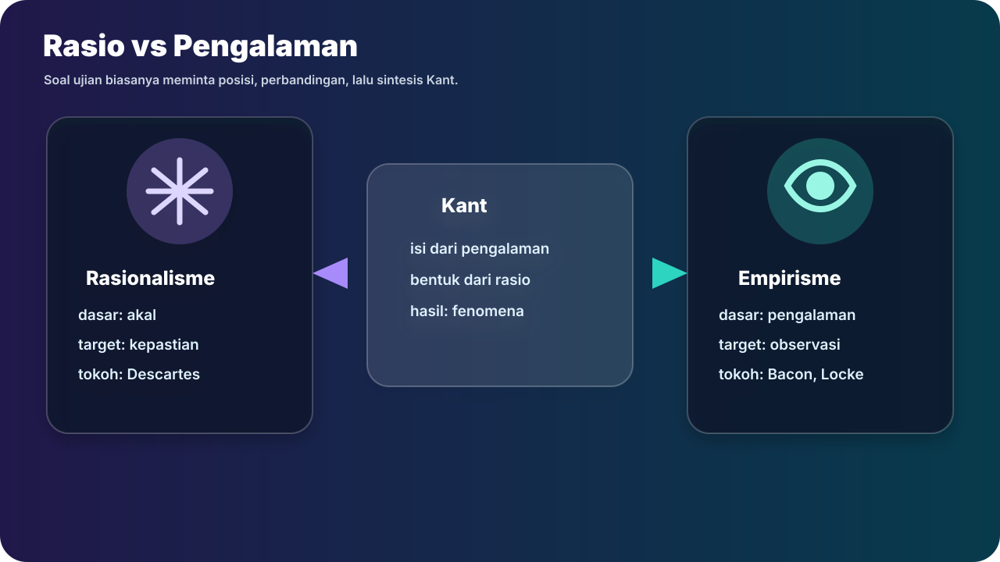

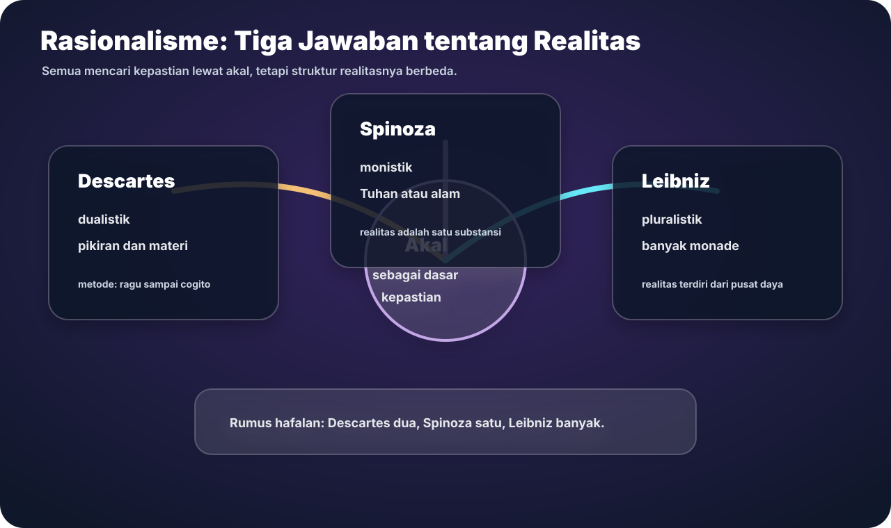

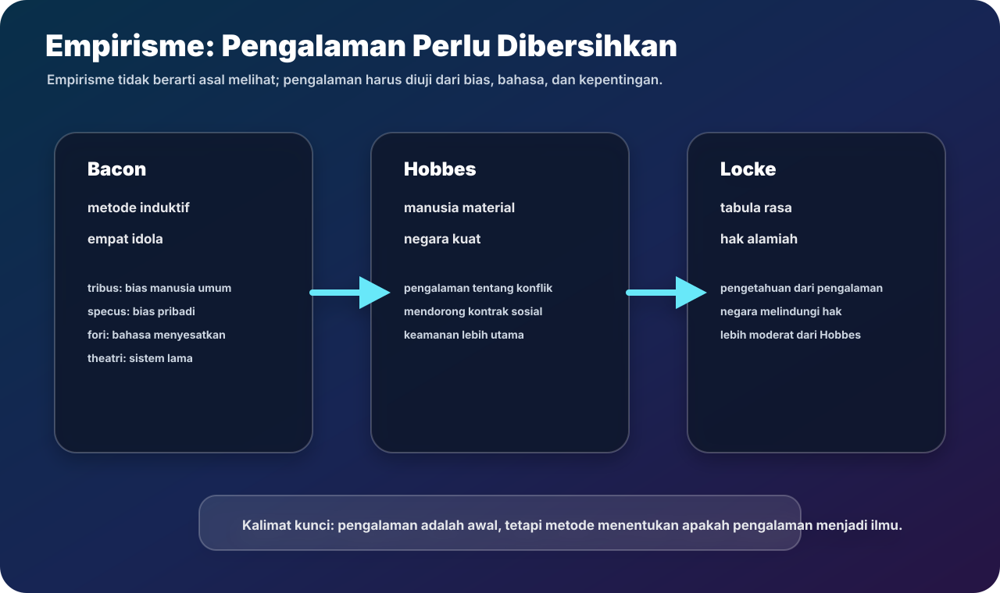

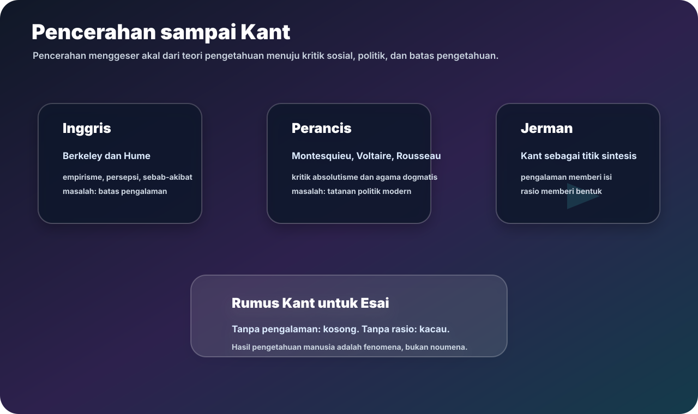

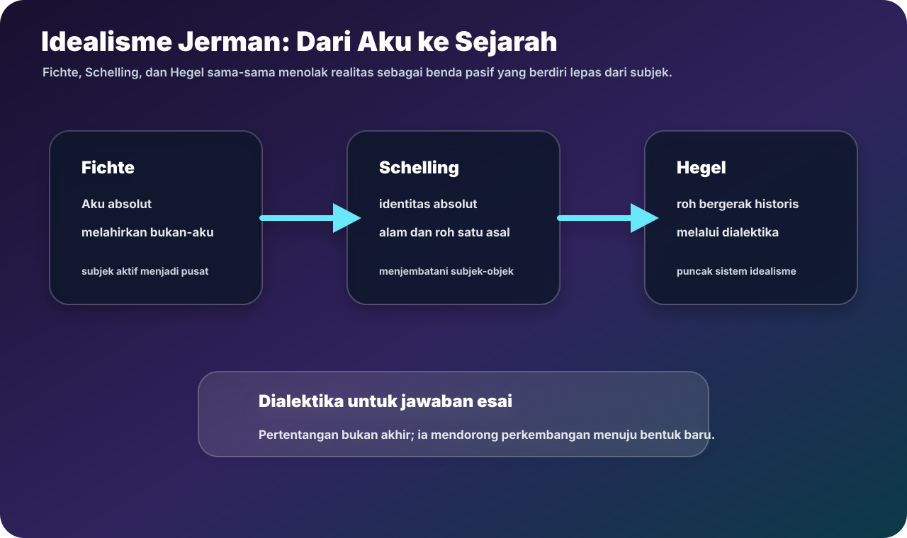

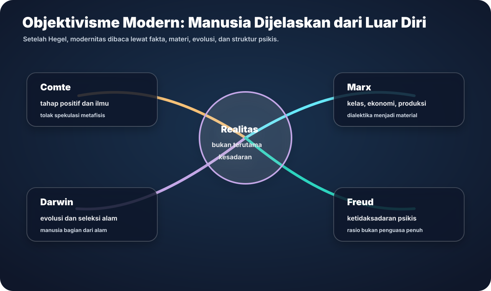

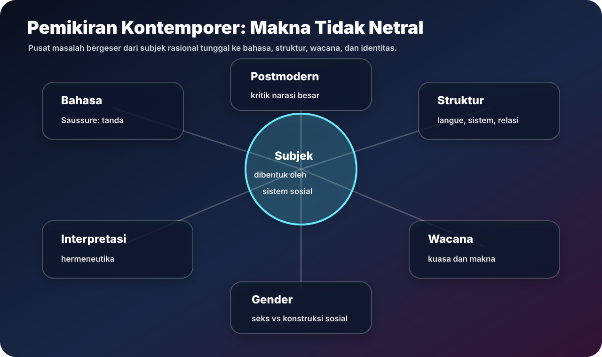

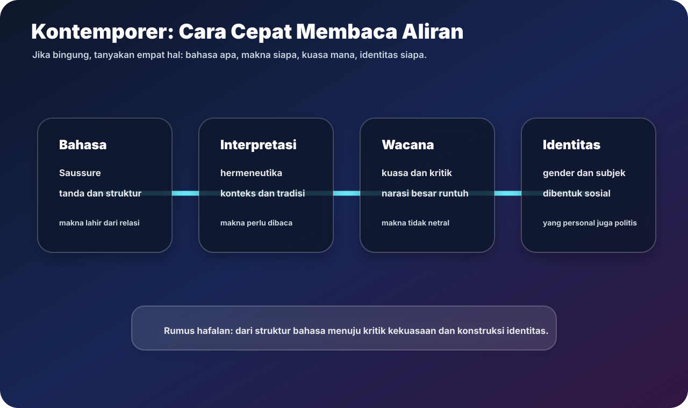

## Rumus Jawaban Esai

Untuk hampir semua pertanyaan, pakai pola:

1. **Tesis:** jawab langsung dalam satu kalimat.
2. **Konteks kronologis:** sebut posisi tokoh/aliran dalam alur modernitas.
3. **Konsep kunci:** jelaskan 2-4 istilah penting.
4. **Perbandingan:** bedakan dengan tokoh/aliran sebelum atau sesudahnya.
5. **Kesimpulan:** tarik makna bagi pemikiran modern.

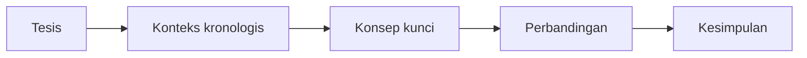

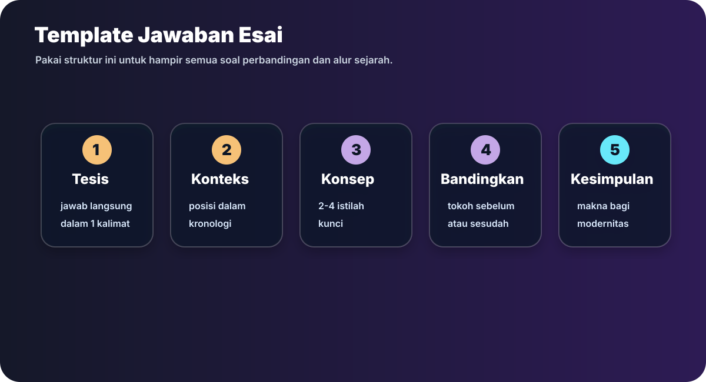

## Sumber Catatan

Catatan utama diringkas dan disusun ulang dari `Sejarah_Pemikiran_Modern_Catatan_Kronologis.pdf`, yang menyebut RPS Sejarah Pemikiran Modern, Sesi 2 Rasionalisme, Sesi 3 Empirisme, Sesi 4 Masa Pencerahan, Sesi 5 Idealisme, Sesi 6 Pemikiran Objektif Pembentuk Modernitas, Sesi 7 Pemikiran Subjektif Pembentuk Modernitas, dan Sesi 8 Pemikiran Kontemporer.
