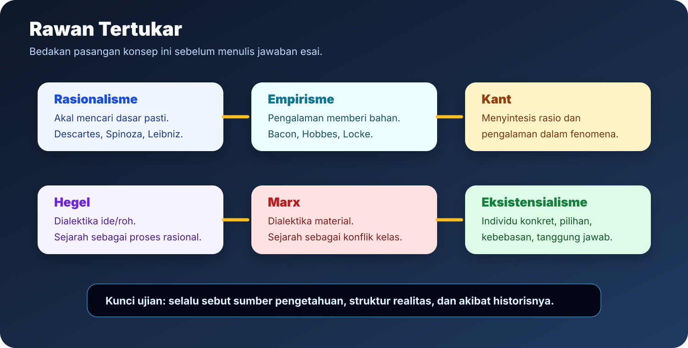
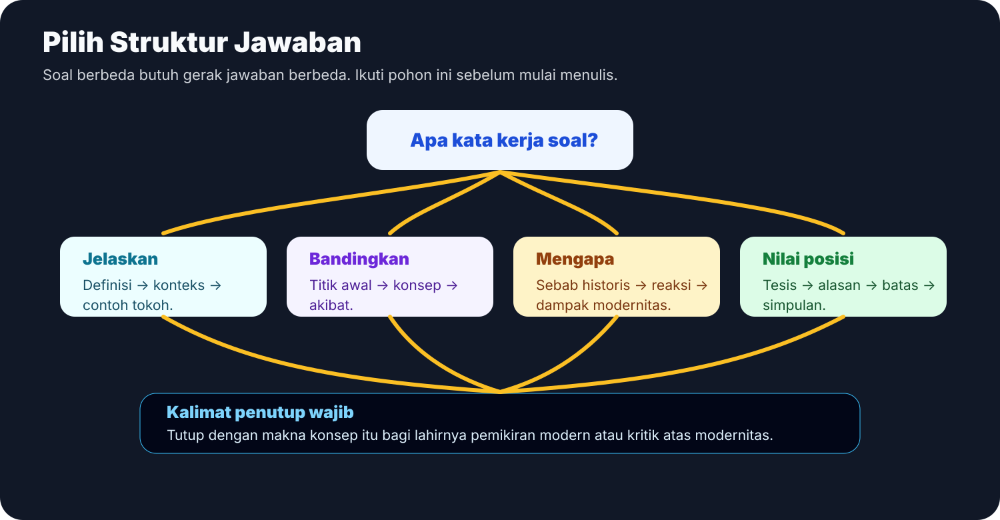
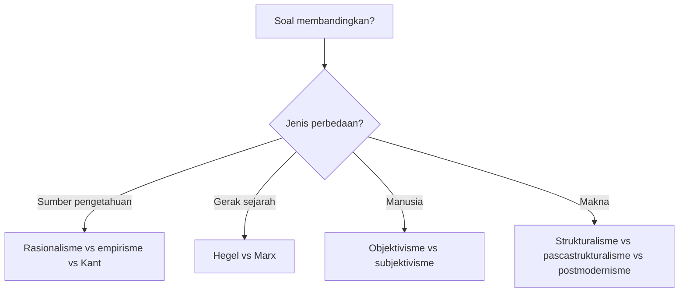
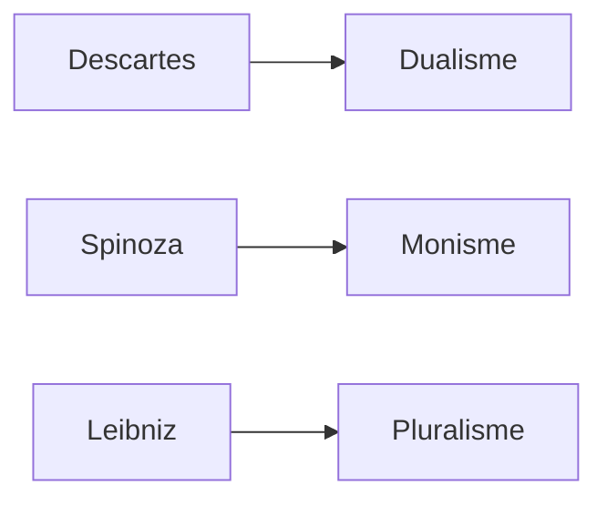

# Perbandingan Rawan Tertukar

Halaman ini untuk mencegah jawaban yang kelihatan hafal tetapi konsepnya tertukar. Baca pasangan konsep, lalu latih menulis perbedaan dalam satu paragraf.

## Peta Cepat

## 1. Rasionalisme, Empirisme, Kant

| Aspek | Rasionalisme | Empirisme | Kant |
|---|---|---|---|
| Titik awal | Akal | Pengalaman | Relasi akal dan pengalaman |
| Masalah utama | Kepastian | Sumber isi pengetahuan | Syarat kemungkinan pengetahuan |
| Risiko | Terlalu abstrak | Terlalu bergantung pada indera | Membatasi pengetahuan pada fenomena |
| Kalimat aman | Akal memberi dasar pasti. | Pengalaman memberi bahan. | Pengalaman memberi isi, rasio memberi bentuk. |

**Jawaban satu paragraf:** Rasionalisme menekankan akal sebagai dasar kepastian, sedangkan empirisme menekankan pengalaman sebagai sumber isi pengetahuan. Kant menyelesaikan pertentangan itu dengan menyatakan bahwa pengalaman memberi bahan, tetapi rasio memberi bentuk. Karena itu, Kant bukan sekadar campuran rasionalisme dan empirisme, melainkan kritik atas syarat pengetahuan manusia.

## 2. Descartes, Spinoza, Leibniz

| Tokoh | Struktur realitas | Kata kunci | Jangan tertukar dengan |
|---|---|---|---|
| Descartes | Dua substansi | res cogitans, res extensa | Spinoza, karena Spinoza menolak dua substansi |
| Spinoza | Satu substansi | Tuhan atau alam | Descartes, karena Spinoza monistik |
| Leibniz | Banyak substansi | monade | Spinoza, karena Leibniz pluralistik |

## 3. Hobbes, Locke, Rousseau

| Tokoh | Keadaan alamiah | Negara dibentuk untuk | Arah jawaban |
|---|---|---|---|
| Hobbes | Berbahaya dan egoistik | Ketertiban | Negara kuat |
| Locke | Ada hukum alamiah tetapi lemah pelaksanaan | Hak | Negara terbatas |
| Rousseau | Manusia baik, masyarakat merusak | Kehendak umum | Legitimasi rakyat |

**Kalimat pembeda:** Hobbes menekankan keamanan, Locke menekankan hak, Rousseau menekankan kehendak umum.

## 4. Hegel dan Marx

| Aspek | Hegel | Marx |
|---|---|---|
| Dasar gerak sejarah | Ide atau roh | Kondisi material |
| Bentuk gerak | Dialektika | Dialektika material |
| Fokus | Kesadaran historis | Ekonomi dan konflik kelas |
| Cara menulis | Hegel menjelaskan sejarah sebagai gerak rasional roh. | Marx membalik Hegel menjadi kritik material atas masyarakat. |

**Jawaban satu paragraf:** Hegel memahami sejarah sebagai gerak ide atau roh melalui dialektika. Marx mempertahankan bentuk dialektika, tetapi membalik isinya menjadi material. Bagi Marx, sejarah digerakkan oleh kondisi ekonomi dan konflik kelas, bukan perkembangan roh. Karena itu, Marx dapat disebut membalik Hegel dari idealisme menjadi materialisme.

## 5. Objektivisme dan Subjektivisme Modern

| Aspek | Objektivisme | Subjektivisme |
|---|---|---|
| Fokus | Fakta, materi, alam, psike | Kehendak, kesadaran, pilihan |
| Tokoh | Comte, Feuerbach, Marx, Darwin, Freud | Schopenhauer, Nietzsche, Husserl, Kierkegaard, Heidegger, Sartre |
| Pertanyaan | Apa yang membentuk manusia dari luar/dasar objektif? | Bagaimana manusia mengalami, memilih, dan memberi makna? |

## 6. Strukturalisme, Pascastrukturalisme, Postmodernisme

| Aliran | Posisi tentang makna | Rumus pembeda |
|---|---|---|
| Strukturalisme | Makna muncul dari struktur tanda | Struktur memberi makna. |
| Pascastrukturalisme | Struktur tidak final | Makna bergerak dan tidak tunggal. |
| Postmodernisme | Curiga pada narasi besar | Rasio, kemajuan, dan identitas stabil dikritik. |

## Latihan Kilat

**Soal:** Bedakan Kant dan Hegel.

**Jawaban inti:** Kant membahas syarat kemungkinan pengetahuan manusia dan membatasi pengetahuan pada fenomena. Hegel bergerak lebih jauh dengan memahami realitas dan sejarah sebagai gerak roh melalui dialektika. Jadi, Kant adalah filsuf kritis tentang batas pengetahuan, sedangkan Hegel adalah filsuf sistematis tentang perkembangan realitas dan sejarah.

**Soal:** Bedakan strukturalisme dan postmodernisme.

**Jawaban inti:** Strukturalisme melihat makna sebagai hasil struktur tanda. Postmodernisme lebih radikal karena mencurigai narasi besar, klaim universal, dan identitas stabil. Jadi, strukturalisme masih mencari struktur makna, sedangkan postmodernisme mencurigai klaim total tentang makna.
