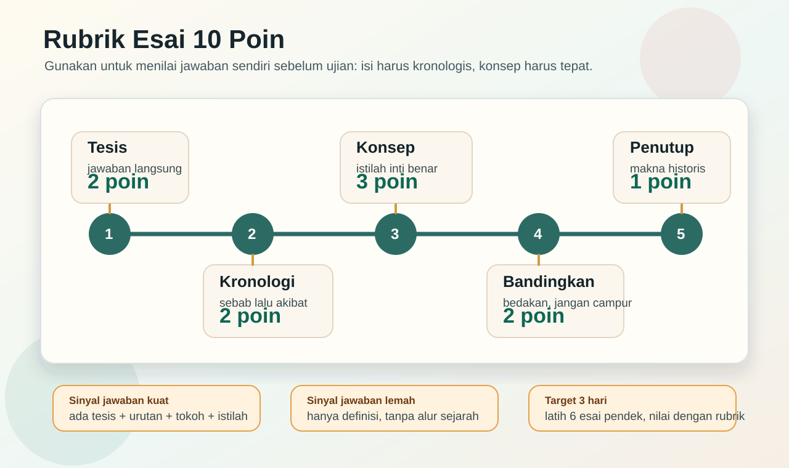
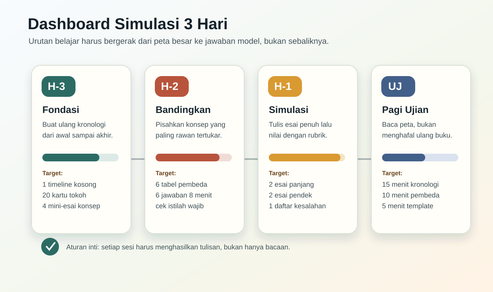
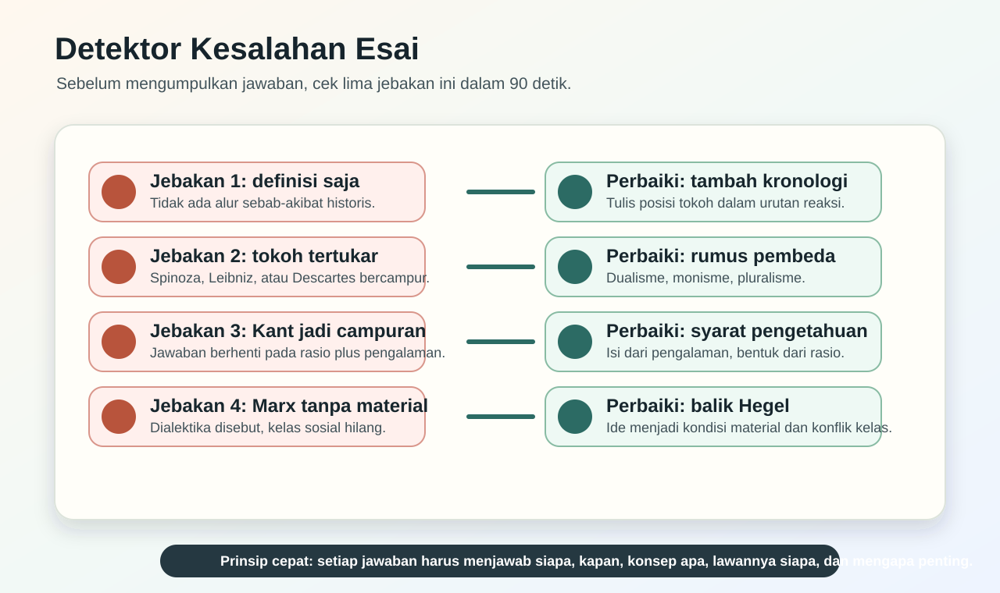
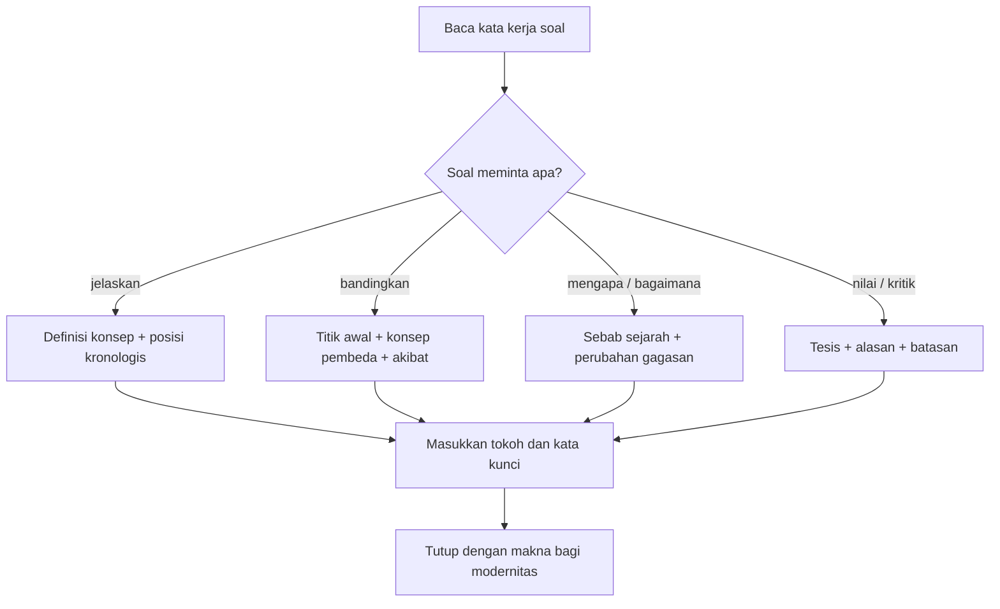
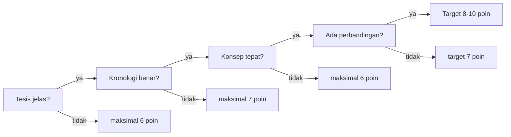

# Rubrik dan Simulasi Esai 3 Hari

Halaman ini dipakai setelah kamu membaca kronologi dan perbandingan. Tujuannya sederhana: mengubah hafalan menjadi jawaban yang bisa dinilai. Dalam tiga hari terakhir, setiap sesi belajar harus menghasilkan tulisan pendek, bukan hanya membaca ulang catatan.

## Alur Menjawab di Kertas Ujian

## Rubrik 10 Poin

| Bagian | Poin | Tanda jawaban aman |
|---|---:|---|
| Tesis | 2 | Kalimat pertama langsung menjawab pertanyaan. |
| Kronologi | 2 | Tokoh ditempatkan dalam urutan sejarah yang benar. |
| Konsep | 3 | Istilah inti dipakai tepat, bukan sekadar disebut. |
| Perbandingan | 2 | Ada pembeda dengan tokoh atau aliran lain. |
| Penutup | 1 | Ada makna bagi pemikiran modern atau akibat historis. |

**Target realistis:** kalau waktu sempit, jangan mengejar jawaban sempurna. Kejar 7 sampai 8 poin: tesis jelas, konsep benar, dan minimal satu perbandingan.

## Simulasi Waktu 45 Menit

```mermaid
gantt
  title Satu Sesi Simulasi Esai SPM
  dateFormat X
  axisFormat %s
  section Persiapan
  Pilih 3 soal dan buat outline :0, 7
  section Menulis
  Esai 1 panjang :7, 18
  Esai 2 sedang :25, 12
  section Pemeriksaan
  Rubrik 10 poin :37, 5
  Daftar kesalahan ulang :42, 3
```

### H-3: Kuasai Tulang Punggung Kronologi

Latihan yang harus selesai:

- Tulis ulang urutan besar: Yunani, Renaissance, rasionalisme, empirisme, Pencerahan, Kant, idealisme, objektivisme, subjektivisme, kontemporer.
- Tutup catatan, lalu tulis 20 tokoh dengan satu kata kunci masing-masing.
- Jawab empat soal konsep dalam 8 menit per soal.

**Soal cepat:** Mengapa Renaissance penting sebagai pintu modernitas?

**Jawaban model:** Renaissance penting karena menggeser perhatian dari tatanan teosentris menuju manusia, rasio, dan dunia konkret. Humanisme Renaissance menempatkan manusia sebagai pusat pencarian makna dan membuka ruang bagi kritik atas otoritas lama. Karena itu, Renaissance menjadi pintu modernitas: manusia mulai percaya bahwa dunia dapat dipahami dan ditata melalui kemampuan rasional.

### H-2: Latih Konsep yang Rawan Tertukar

Latihan yang harus selesai:

- Buat tabel pembeda untuk Descartes, Spinoza, Leibniz.
- Buat tabel pembeda untuk Hobbes, Locke, Rousseau.
- Buat tabel pembeda untuk Kant, Hegel, Marx.
- Tulis enam paragraf pendek, masing-masing 120 sampai 160 kata.

**Soal cepat:** Mengapa Kant bukan sekadar kompromi antara rasionalisme dan empirisme?

**Jawaban model:** Kant bukan sekadar kompromi karena ia tidak hanya mengambil sebagian dari rasionalisme dan sebagian dari empirisme. Ia mengubah pertanyaannya menjadi: apa syarat agar pengetahuan mungkin? Menurut Kant, pengalaman memberi isi pengetahuan, tetapi rasio memberi bentuk agar pengalaman dapat dipahami. Karena itu, pengetahuan manusia tidak menjangkau benda pada dirinya sendiri, melainkan fenomena. Kant adalah filsuf kritis yang menjelaskan batas dan syarat pengetahuan.

### H-1: Simulasi dan Koreksi

Latihan yang harus selesai:

- Tulis dua esai panjang dengan batas waktu.
- Nilai sendiri memakai rubrik 10 poin.
- Catat tiga kesalahan paling sering, lalu perbaiki dalam versi kedua.
- Jangan membuka materi baru pada malam terakhir kecuali untuk memperbaiki kekeliruan yang sudah terdeteksi.

**Soal cepat:** Jelaskan mengapa Hegel menjadi pusat reaksi pemikiran modern setelahnya.

**Jawaban model:** Hegel menjadi pusat reaksi karena ia membangun sistem besar yang memahami realitas dan sejarah sebagai gerak roh menuju Yang Absolut melalui dialektika. Setelah Hegel, banyak pemikir menentukan posisinya dengan menerima, membalik, atau menolak sistem tersebut. Feuerbach menggeser idealisme ke manusia konkret, Marx membalik dialektika menjadi materialisme historis, positivisme menolak spekulasi metafisis, dan eksistensialisme menolak sistem total yang menenggelamkan individu. Jadi, Hegel penting bukan hanya karena sistemnya, tetapi karena sistem itu menjadi titik lawan bagi pemikiran sesudahnya.

## Template Jawaban Menurut Jenis Soal

### 1. Soal "Jelaskan"

Pola:

1. Definisikan konsep.
2. Sebut tokoh dan posisi kronologis.
3. Jelaskan fungsi konsep dalam sistem pemikirannya.
4. Tutup dengan akibat bagi modernitas.

**Contoh:** Jelaskan cogito Descartes.

**Jawaban model:** Cogito adalah titik pasti yang ditemukan Descartes melalui keraguan metodis. Ketika segala sesuatu diragukan, fakta bahwa subjek sedang berpikir tidak dapat diragukan. Karena itu, cogito ergo sum menjadi dasar kepastian: aku berpikir, maka aku ada. Cogito penting dalam modernitas karena memindahkan dasar pengetahuan ke subjek rasional.

### 2. Soal "Bandingkan"

Pola:

1. Tulis kesamaan dulu.
2. Pisahkan titik awal masing-masing tokoh.
3. Jelaskan perbedaan konsep inti.
4. Tutup dengan akibat pemikiran.

**Contoh:** Bandingkan Hegel dan Marx.

**Jawaban model:** Hegel dan Marx sama-sama memakai pola dialektika untuk memahami sejarah. Perbedaannya terletak pada dasar gerak sejarah. Hegel melihat sejarah sebagai gerak ide atau roh, sedangkan Marx melihat sejarah sebagai gerak kondisi material dan konflik kelas. Dengan demikian, Marx membalik Hegel: dialektika tidak lagi idealistik, tetapi material.

### 3. Soal "Mengapa"

Pola:

1. Jawab sebab utama dalam kalimat pertama.
2. Beri latar sejarah.
3. Tunjukkan perubahan konsep.
4. Tulis konsekuensi.

**Contoh:** Mengapa postmodernisme mengkritik modernitas?

**Jawaban model:** Postmodernisme mengkritik modernitas karena modernitas terlalu percaya pada rasio, kemajuan, dan narasi besar. Bagi postmodernisme, klaim universal sering menyembunyikan relasi kuasa dan mengabaikan perbedaan. Kritik ini muncul setelah pemikiran kontemporer menaruh perhatian pada bahasa, struktur, wacana, dan identitas. Karena itu, postmodernisme tidak sekadar anti-ilmu, tetapi curiga terhadap klaim total yang mengatasnamakan kebenaran tunggal.

## Detektor Kesalahan 90 Detik

Sebelum jawaban dikumpulkan, cek ini:

- Apakah kalimat pertama sudah menjawab soal?
- Apakah tokoh berada pada urutan sejarah yang benar?
- Apakah istilah kunci dijelaskan, bukan hanya disebut?
- Apakah ada pembeda dengan aliran lain?
- Apakah penutup menunjukkan makna, bukan mengulang pembuka?

## Paket Latihan Terakhir

Kerjakan dalam urutan ini supaya tetap kronologis.

| Urutan | Soal | Jawaban inti |
|---:|---|---|
| 1 | Jelaskan peralihan dari Plato-Aristoteles ke modernitas. | Modernitas lebih dekat ke Aristoteles karena ilmu modern menuntut observasi dan klasifikasi, tetapi Plato tetap penting bagi idealisme. |
| 2 | Jelaskan rasionalisme Descartes. | Descartes mencari kepastian melalui keraguan metodis dan menemukan cogito sebagai dasar subjek modern. |
| 3 | Bandingkan empirisme Bacon dan Hume. | Bacon menekankan metode induksi dan pembersihan bias, Hume menajamkan empirisme sampai skeptisisme tentang kausalitas. |
| 4 | Jelaskan Kant sebagai jembatan. | Pengalaman memberi isi, rasio memberi bentuk, dan pengetahuan manusia terbatas pada fenomena. |
| 5 | Bandingkan Hegel dan Marx. | Hegel idealistik, Marx materialistik; Marx membalik dialektika menjadi analisis kelas dan ekonomi. |
| 6 | Jelaskan subjektivisme modern. | Subjektivisme menekankan kehendak, kesadaran, eksistensi, dan pilihan manusia. |
| 7 | Jelaskan strukturalisme. | Makna lahir dari sistem tanda, bukan dari subjek individual saja. |
| 8 | Jelaskan feminisme kontemporer. | Feminisme mengkritik struktur sosial yang menindas perempuan dan membedakan seks biologis dari gender sosial. |

## Skor Diri

Setelah menulis satu jawaban, beri skor cepat:

Kalau skor di bawah 7, jangan langsung pindah soal. Perbaiki jawaban yang sama satu kali lagi. Ujian tiga hari lagi lebih membutuhkan pola yang stabil daripada bacaan baru yang belum menyatu.
