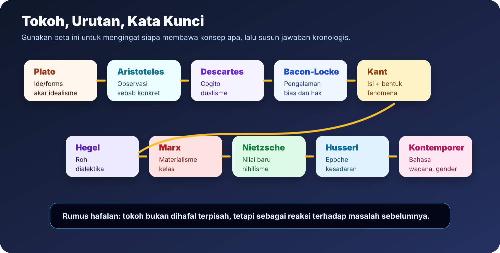
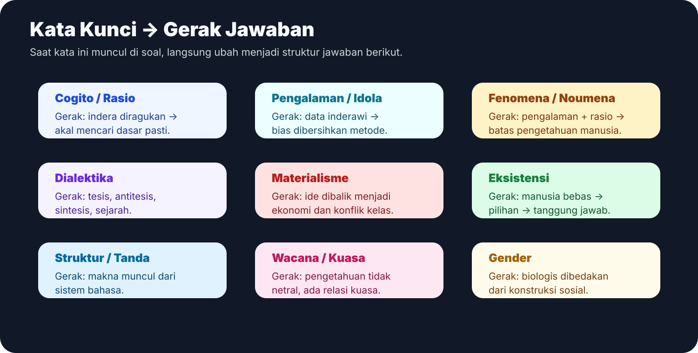
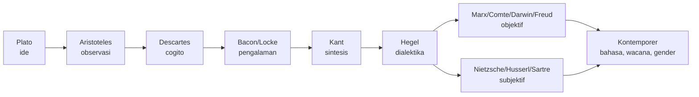
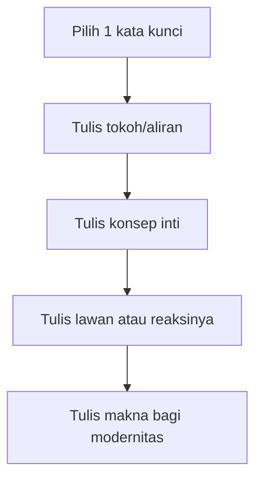

# Tokoh dan Kata Kunci

Halaman ini adalah indeks cepat. Pakai untuk mengubah hafalan nama tokoh menjadi jawaban esai yang bergerak: **tokoh -> konsep -> masalah yang dijawab -> makna bagi modernitas**.

## Peta Besar Tokoh

## Indeks Tokoh Cepat

| Tokoh/aliran | Kata kunci wajib | Gerak jawaban |
|---|---|---|
| Plato | ide, forms, universal | Pengetahuan sejati tidak cukup dari indera; akal menangkap realitas ideal. |
| Aristoteles | substansi, observasi, sebab | Pengetahuan mulai dari benda konkret, klasifikasi, dan pencarian sebab. |
| Descartes | keraguan metodis, cogito, dualisme | Indera diragukan untuk menemukan kepastian subjek berpikir. |
| Spinoza | substansi tunggal, Tuhan/alam | Realitas adalah satu kesatuan rasional; bukan dua substansi seperti Descartes. |
| Leibniz | monade, perseptio, appetitus | Realitas plural tetapi tetap teratur secara rasional. |
| Bacon | idola, metode, bias | Pengalaman harus dibersihkan dari prasangka agar menjadi ilmu. |
| Hobbes | manusia egoistik, negara kuat | Politik lahir dari kebutuhan menghindari kekacauan keadaan alamiah. |
| Locke | pengalaman, hak, negara terbatas | Negara dibentuk untuk melindungi hak dan hukum alamiah. |
| Kant | isi, bentuk, fenomena, noumena | Pengalaman memberi bahan; rasio memberi struktur; pengetahuan terbatas pada fenomena. |
| Fichte | Aku absolut | Subjek aktif membentuk medan pengalaman. |
| Schelling | identitas absolut | Subjek dan objek bersumber dari dasar yang sama. |
| Hegel | roh, dialektika, sejarah | Realitas bergerak rasional melalui konflik dan sintesis. |
| Comte | tiga tahap, positif | Ilmu positif menjadi bentuk pengetahuan paling matang. |
| Feuerbach | manusia material, proyeksi agama | Idealisme dibalik ke manusia konkret. |
| Marx | dialektika material, kelas | Sejarah bergerak oleh ekonomi dan konflik kelas. |
| Darwin | evolusi, seleksi alam | Manusia dipahami sebagai bagian dari proses alam. |
| Freud | id, ego, superego, ketidaksadaran | Subjek tidak sepenuhnya rasional karena dibentuk dorongan psikis. |
| Schopenhauer | kehendak, penderitaan | Dasar realitas adalah kehendak yang melahirkan penderitaan. |
| Nietzsche | nihilisme, nilai baru, ubermensch | Manusia harus mencipta nilai setelah nilai lama runtuh. |
| Husserl | epoche, kesadaran | Fenomena dipahami sebagaimana menampakkan diri dalam kesadaran. |
| Heidegger | Dasein, berada-di-dunia | Manusia dipahami sebagai keberadaan konkret dalam dunia. |
| Sartre | eksistensi mendahului esensi | Manusia membentuk diri melalui pilihan dan tanggung jawab. |
| Saussure | langue, parole, signifier, signified | Makna muncul dari sistem tanda, bukan dari benda secara langsung. |
| Pascastrukturalisme | makna tidak final | Struktur tidak stabil; pembaca, perbedaan, dan wacana mengubah makna. |
| Postmodernisme | kritik narasi besar | Menolak klaim total tentang rasio, kemajuan, dan identitas stabil. |
| Feminisme | seks, gender, struktur sosial | Ketidakadilan gender dibaca sebagai konstruksi sosial dan relasi kuasa. |

## Gerak Jawaban Berdasarkan Kata Kunci

| Jika soal menyebut... | Mulai dari... | Jangan lupa tutup dengan... |
|---|---|---|
| Rasionalisme | masalah kepastian dan kelemahan indera | perbedaan Descartes, Spinoza, Leibniz |
| Empirisme | pengalaman sebagai sumber bahan | Bacon: pengalaman harus dibersihkan dari idola |
| Pencerahan | akal sebagai kritik otoritas | Inggris epistemologis, Perancis politis, Jerman kritis |
| Kant | konflik rasionalisme-empirisme | fenomena/noumena dan batas pengetahuan |
| Hegel | idealisme dan dialektika | mengapa ia menjadi titik reaksi modern |
| Marx | pembalikan Hegel | ekonomi, kelas, dan dialektika material |
| Eksistensialisme | individu konkret | kebebasan, kecemasan, pilihan, tanggung jawab |
| Kontemporer | kritik atas subjek/fondasi tunggal | bahasa, struktur, wacana, identitas, gender |

## Latihan Recall 5 Menit

**Contoh:** kata kunci *dialektika*.

**Jawaban cepat:** Dialektika terutama terkait dengan Hegel. Pada Hegel, realitas dan sejarah bergerak melalui pertentangan yang menghasilkan sintesis. Marx kemudian membalik dialektika Hegel dari ide menjadi materi, sehingga sejarah dipahami melalui ekonomi dan konflik kelas. Maknanya bagi modernitas adalah bahwa sejarah tidak dipahami sebagai kumpulan peristiwa acak, melainkan sebagai proses perubahan yang memiliki struktur.

## Kesalahan Umum

- Menulis tokoh tanpa menjelaskan masalah yang dijawab.
- Menjelaskan konsep tanpa menempatkannya dalam urutan sejarah.
- Mencampur rasionalisme dan empirisme tanpa menjelaskan sumber pengetahuan.
- Menyebut Hegel tetapi tidak menjelaskan mengapa ia menjadi pusat reaksi.
- Menyebut kontemporer sebagai satu aliran tunggal, padahal isinya bahasa, struktur, tafsir, wacana, identitas, dan gender.
