# Week 5 - Carrier Protection, Auto-Reclosing, and Synchronizing

## Orientation

Welcome to Week 5 of our Power System Protection and Switchgear journey. This week, we transition from standalone distance relays to **communication-aided protection schemes** that protect transmission lines with high speed and selectivity. We will explore how carrier signals (historically over power lines) enable relays at both ends of a line to coordinate tripping decisions, and then dive deep into the automatic reclosing philosophy that restores service after transient faults.

The week is structured around five lectures that build progressively:

1. **Carrier Blocking Scheme** - where a received signal *prevents* tripping
2. **Carrier Unblocking Scheme** - a refinement addressing blocking scheme limitations
3. **Carrier Aided Transfer Tripping Schemes** - where a received signal *initiates* tripping
4. **Auto-Reclosing Fundamentals** - why and how we automatically restore lines
5. **Auto-Reclosing Application Factors and Synchronizing** - the engineering details that make reclosing safe

By the end of this week, you will understand not just *what* these schemes do, but *why* they are designed the way they are, and *how* to apply them correctly in real power systems.

---

## Learning Outcomes

After completing this week's material, you should be able to:

1. **Explain** the fundamental difference between carrier blocking and carrier tripping schemes, and identify when each is appropriate.
2. **Analyze** the time-distance characteristics of carrier-aided schemes, including zone settings (80% vs. 120-150%) and the role of reverse-looking relays.
3. **Trace** the control circuit operation for internal and external faults in carrier blocking, unblocking, and transfer tripping schemes.
4. **Compare** direct underreach, permissive underreach, acceleration of Zone-2, pre-acceleration of Zone-2, and overreach transfer tripping schemes.
5. **Calculate** dead time requirements using the IEC standard formula and explain the factors affecting deionization time.
6. **Apply** the IEC circuit breaker operating cycle (O + 0.3s + CO + 3min + CO) to design reclosing sequences.
7. **Evaluate** the six factors to consider when applying auto-reclosing: choice of zone, dead time, reclaim time, instantaneous trip lockout, intermediate lockout, and breaker supervision.
8. **Design** a fuse-saving coordination scheme for distribution feeders with reclosers.
9. **Explain** the phasing voltage and angular methods for synchronism check, and their role in safe reclosing.
10. **Diagnose** common maloperation scenarios in carrier-aided schemes and auto-reclosing systems.

---

## Syllabus Map

| Lecture | Topic | Key Concepts |
|---------|-------|--------------|
| Lecture 21 | Carrier Aided Schemes for Transmission Lines - III | Directional comparison review, carrier blocking scheme, time-distance characteristics, control circuit, disadvantages, carrier unblocking scheme |
| Lecture 22 | Carrier Aided Schemes for Transmission Lines - IV | Classification of transfer tripping schemes, direct underreach, permissive underreach, acceleration of Zone-2, pre-acceleration, overreach transfer tripping |
| Lecture 23 | Auto-reclosing and Synchronizing - I | Fault statistics (80% transient), history, advantages, classification (phase, attempts, speed), single-phase vs. three-phase |
| Lecture 24 | Auto-reclosing and Synchronizing - II | Sequence of events, dead time, reclaim time, IEC operating cycle, instantaneous trip lockout, intermediate lockout, breaker supervision |
| Lecture 25 | Auto-reclosing and Synchronizing - III | Synchronism check, phasing voltage method, angular method |

---

# Lecture 21: Carrier Aided Schemes for Transmission Lines - III

## 21.1 Directional Comparison Scheme - Brief Review

Before diving into carrier blocking, let me recall the directional comparison scheme from previous weeks. The core idea is beautifully simple: **compare the direction of power flow at both ends of the protected line**.

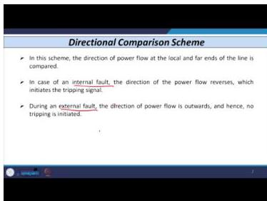
*Figure 21.1: Directional comparison scheme - internal faults reverse power flow direction at both ends, while external faults show outward flow.*

**Physical Intuition:** Imagine two observers at opposite ends of a bridge. If someone is attacking the bridge itself, both observers see the "threat" coming toward them. If the attack is outside the bridge, one observer sees it approaching while the other sees it receding.

**Internal fault:** Power flow direction reverses at both ends → both relays detect fault in forward direction → tripping initiated.

**External fault:** Power flow is outward at the local end → no tripping.

**Equipment used** (same as phase comparison scheme):
- Wave trap
- Coupling capacitors
- Power gap
- Transmitter
- Receiver
- Square wave generator

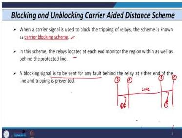
*Figure 21.2: Equipment arrangement for directional comparison scheme showing wave traps, coupling capacitors, and communication equipment.*

## 21.2 Carrier Blocking Scheme - Introduction and Principle

The **carrier blocking scheme** inverts the logic: a received carrier signal is used to **block** relay operation rather than initiate it.

**Definition:** When a carrier signal received from the remote end is used to block the operation of a relay, the scheme is known as a carrier blocking scheme.

**Basic Arrangement:**
- Relays located at each end of the protected line
- Relays monitor the region **within** as well as **behind** the line
- Blocking signal sent for any fault **behind** the relay on either side → tripping prevented

**Illustrative Example:** Consider a line between buses A and B (Line 1 to be protected). Additional lines connect B to C and A to D. If a fault occurs on an adjoining line (beyond bus B or bus A), a blocking signal is generated. These faults are **out-of-zone faults** for the relays protecting Line 1.

## 21.3 Time-Distance Characteristic of Carrier Blocking Scheme

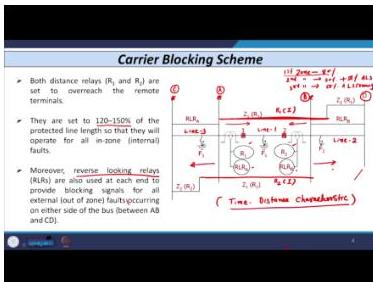
*Figure 21.3: Four-bus system with Line 1 protected between buses B and C, showing relay locations and zone reaches.*

**System Configuration:**
- 4 buses: A, B, C, D
- Line 1: between buses B and C (protected line)
- Lines 2 and 3: adjoining sections
- Relays R₁ and R₂ at buses B and C respectively
- Circuit breakers 1 and 2

**Zone Settings - THE KEY DIFFERENCE:**

| Setting | Conventional Distance Relay | Carrier Blocking Scheme |
|---------|----------------------------|------------------------|
| Zone 1 reach | 80% of line | **120-150% of line** |
| Zone 2 | Conventional | Conventional |
| Zone 3 | Conventional | Conventional |

**Why 120-150%?** The first zone must overreach the protected line so that both relays see *all* internal faults instantaneously. The blocking signal prevents tripping for external faults.

**Reverse Looking Relays (RLR):**
- Two additional relays: RLRₐ and RLRʙ
- RLRₐ at bus A looks in the **opposite direction** to main relay R₁
- RLRʙ at bus B looks in the **opposite direction** to R₂
- These detect faults *behind* the protected line (on adjoining sections)

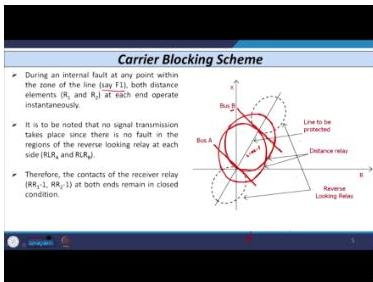
*Figure 21.4: RX-plane representation showing Zone 1 reach of R₁ and R₂ at 120% of Line 1, with reverse-looking relay reaches shown as dotted circles.*

## 21.4 Control Circuit of Carrier Blocking Scheme

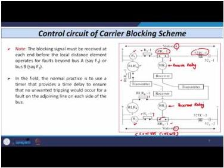
*Figure 21.5: Control circuit showing relay contacts, receiver relay, reverse-looking relays, and trip coil connections.*

**Components:**
- Relay R₁ (station A) with NO contact R₁-1
- Relay R₂ (station B) with NO contact R₂-1
- Receiver relay RR (coil) with NC contact RR₁-1
- Reverse looking relay RLRₐ (station A) with NO contact RLRₐ-1
- Reverse looking relay RLRʙ (station B)
- Transmitter and receiver at each end
- Trip coil of circuit breaker (52 TC-1)

### Operation - Internal Fault (at F₁)

1. Fault occurs at F₁ on Line 1
2. Both R₁ and R₂ detect fault in **first zone** (120-150% reach)
3. R₁ contact closes; R₂ contact closes
4. RR₁-1 is normally closed → direct tripping command initiated at both ends
5. Breaker 1 at substation A trips; Breaker 2 at substation B trips
6. **Instantaneous tripping achieved**

### Operation - External Fault (at F₂)

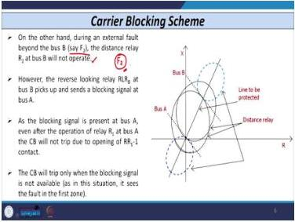
*Figure 21.6: External fault at F₂ beyond bus B - showing why blocking is needed.*

1. Fault occurs at F₂ (beyond bus B, on adjoining line)
2. R₁ detects fault in first zone (reach 120-150%) → R₁-1 closes → tripping command initiated at bus A
3. R₂ does **NOT** detect fault (reverse side) → R₂-1 remains open → no tripping at bus B
4. RLRʙ (reverse looking relay at B) detects fault → contact closes → transmitter sends blocking signal to bus A
5. Receiver at bus A energizes RR₁ → NC contact RR₁-1 **opens**
6. Before command through R₁ reaches trip coil, RR₁-1 opens → **no tripping** at substation A
7. Breaker 1 remains closed

**Critical Timing Requirement:** The blocking signal must arrive at each end **before** the local distance relay operates. For fault at F₂: blocking from B to A required. For fault at F₃: blocking from A to B required.

**Coordination Method:** A timer provides time delay, ensuring the blocking signal arrives before local relay trips. The timer is set according to the opening time of the RR₁ contact.

**The Fundamental Problem:** Zone 1 of a distance relay is inherently instantaneous. Adding a timer defeats the purpose of instantaneous operation. This is the fundamental limitation of the carrier blocking scheme.

## 21.5 Disadvantages of Carrier Blocking Scheme

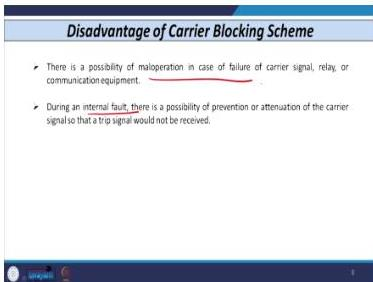
*Figure 21.7: Summary of carrier blocking scheme disadvantages.*

**Disadvantage 1: Maloperation due to communication failure/delay**
- If blocking signal unavailable or delayed from far-end:
  - RR₁-1 or RR₂-1 (normally closed) must open for external faults
  - Delay in opening → maloperation possible

**Disadvantage 2: Failure for internal faults**
- Carrier signal may be prevented or attenuated
- Tripping command may not reach breaker
- Breaker may not open

**Conclusion:** To avoid both maloperation (external fault) and failure (internal fault), we need a different scheme → **Carrier Unblocking Scheme**.

## 21.6 Carrier Unblocking Scheme

**Principle:** Continuously transmit a **low energy carrier signal** to check system status. During internal fault, the signal frequency shifts to an **unblock frequency** → tripping initiated.

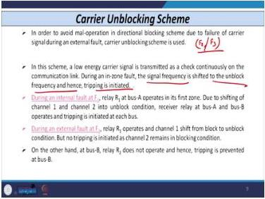
*Figure 21.8: Carrier unblocking scheme concept showing two-channel arrangement.*

**Channel Arrangement:**
- Channel 1: for transmission
- Channel 2: for low energy carrier signal (normally in blocking condition)
- Low energy carrier continuously transmitted A→B and B→A
- Function: blocks operation normally
- On internal fault: status shifts from **block to unblock** → tripping initiated

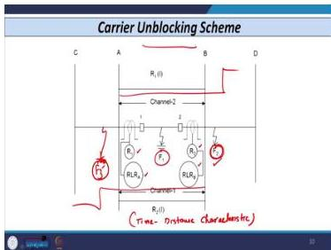
*Figure 21.9: Time-distance characteristic for carrier unblocking scheme - same configuration as blocking scheme.*

### Operation - Internal Fault (at F₁)

1. R₁ at bus A operates in first zone
2. Channel shifts from blocking to unblocking condition
3. Receiver relay at both buses remains in closed condition (NC contact)
4. Tripping initiated at each bus

### Operation - External Fault (at F₂)

1. R₁ operates (senses fault in first zone)
2. Channel 1 shifts from block to unblock
3. **No tripping** because Channel 2 remains in blocking condition
4. Reason: R₂ does not detect fault F₂ (reverse fault for R₂)
5. At bus B, R₂ does not operate → no tripping given

**Discrimination:** Internal vs. external fault easily discriminated by checking both channels.

## 21.7 Carrier Aided Transfer Tripping Scheme - Introduction

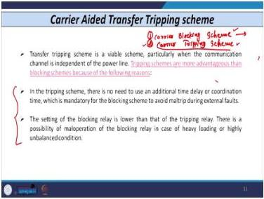
*Figure 21.10: Introduction to transfer tripping schemes as an alternative to blocking.*

**Fundamental Choice: Blocking vs. Tripping Scheme**

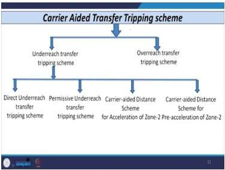
*Figure 21.11: Comparison of blocking and tripping schemes.*

| Feature | Carrier Blocking Scheme | Carrier Tripping Scheme |
|---------|------------------------|------------------------|
| Signal use | Blocks relay operation | Initiates relay operation |
| Coordination required | Yes (local relay vs. receiver relay) | No additional coordination needed |
| Setting | Usually lower | Higher |
| Maloperation risk | Higher (heavy loading, unbalanced conditions) | Lower |
| Field usage | Less common | Widely used |

**Advantages of Carrier Tripping Scheme:**
1. No need for additional time delay or coordination
2. No requirement to open receiver relay contact before local relay operates
3. Higher settings possible → less maloperation risk

## Lecture 21 Recap

- **Carrier blocking scheme**: Received signal *prevents* tripping; Zone 1 set to 120-150% of line
- **Reverse-looking relays** detect faults behind the protected line and initiate blocking
- **Critical coordination**: Blocking signal must arrive before local relay operates
- **Fundamental limitation**: Timer needed for coordination conflicts with instantaneous Zone 1
- **Carrier unblocking scheme**: Continuous low-energy signal; shifts from block to unblock on internal faults
- **Transfer tripping**: Received signal *initiates* tripping; no coordination delay needed

---

# Lecture 22: Carrier Aided Schemes for Transmission Lines - IV

## 22.1 Classification of Carrier Aided Transfer Tripping Schemes

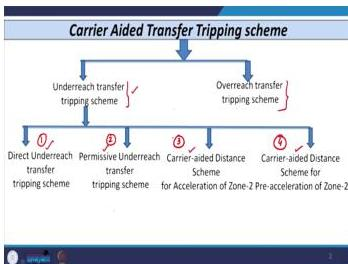
*Figure 22.1: Classification tree for carrier aided transfer tripping schemes.*

**Underreach Transfer Tripping Schemes:**
1. Direct Underreach Transfer Tripping Scheme
2. Permissive Underreach Transfer Tripping Scheme
3. Carrier Aided Distance Scheme for Acceleration of Zone-2
4. Carrier Aided Distance Scheme for Pre-acceleration of Zone-2

**Overreach Transfer Tripping Scheme**

## 22.2 Direct Underreach Transfer Tripping Scheme

### Zone Settings

**Zone 1 of both relays R₁ and R₂ set to reach only the original 80% of total line length.** This is the conventional distance relay setting.

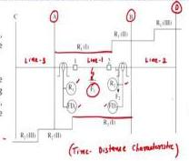
*Figure 22.2: Time-distance characteristic showing Zone 1 at 80% from each end.*

**System Configuration:**
- Line 1 between buses A and B (protected line)
- Line 2 between bus A and C (adjoining)
- Line 3 between bus B and D (adjoining)
- Relays R₁ (bus A) and R₂ (bus B)
- Fault detectors FD₁ and FD₂ (instantaneous overcurrent relays)

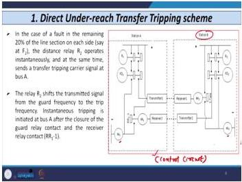
*Figure 22.3: Control circuit for direct underreach transfer tripping scheme.*

### Operation - Fault within First Zone of Both Relays (at F₁)

1. Fault at F₁ (within 80% region, specifically within 60% of line from either end)
2. R₁ detects fault in first zone → contact closes
3. R₂ detects fault in first zone → contact closes
4. FD₁ operates (current exceeds predetermined limit) → contact closes
5. FD₂ operates → contact closes
6. Auxiliary relay coils 86(1) and 86(2) energized at both buses
7. **Instantaneous tripping** initiated at both ends

### Operation - Fault in Remaining 20% (at F₂, near bus B side)

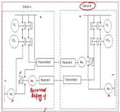
*Figure 22.4: Fault at F₂ in the 20% region beyond R₁'s Zone 1 but within R₂'s Zone 1.*

1. Fault at F₂ in the 20% region beyond R₁'s first zone but within R₂'s first zone
2. R₂ detects fault in first zone → operates instantaneously
3. FD₂ operates → contact closes
4. Direct tripping command initiated at bus B → coil of 86(2) energized
5. Simultaneously, R₂ sends transfer tripping carrier signal through transmitter to bus A
6. Receiver at bus A receives signal → receiver relay RR₁ coil energized
7. Contact RR₁-1 closes
8. Coil of 86(1) at substation A energized → tripping initiated → breaker at A opens

### Operation - Fault in Remaining 20% (at F₃, near bus A side)

1. R₁ operates instantaneously
2. Direct tripping at bus A
3. R₁ sends signal through transmitter to bus B
4. Receiver at B receives → receiver relay coil energized → contact closes
5. Coil of 86(2) energized → tripping at bus B

### Why "Direct" Underreach?

- When tripping signal received from other substation, receiver relay contact **directly closes**
- No other series contact in series with RR₁-1 or RR₂-1
- As soon as tripping signal available, direct tripping initiated

### Why "Underreach"?

- First zone of R₁ and R₂ covers only **80%** of line length (not 100% or beyond)
- In overreach schemes, first zone covers entire line or beyond

### Disadvantages

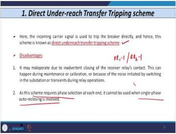
*Figure 22.5: Key disadvantages of direct underreach transfer tripping.*

1. **Maloperation due to inadvertent closing of receiver relay contact:**
   - RR₁-1 or RR₂-1 may close inadvertently due to:
     - Maintenance activities
     - Calibration
     - Noise from switching surges
     - Transient or abnormal conditions
   - Result: Wrong tripping

2. **Phase selection logic required:**
   - Cannot be used when single-phase auto-reclosing is involved
   - Single-pole tripping (only faulted phase opens) not possible

**Remedy (and its drawback):**

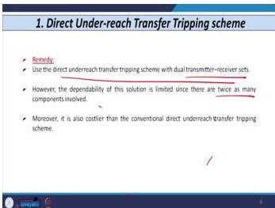
*Figure 22.6: Remedy using dual transmitter and receiver sets.*

- Use dual transmitter and receiver set
- **Drawback:** Cost increases significantly
- Hence, this remedy is not commonly used

## 22.3 Permissive Underreach Transfer Tripping Scheme

### Time-Distance Characteristic

Same as direct underreach: Zone 1 of R₁ covers 80%; Zone 1 of R₂ covers 80%.

### Control Circuit Difference

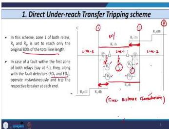
*Figure 22.7: Control circuit showing fault detector contact in series with receiver relay contact.*

**Additional contact in series with receiver relay contact:**
- FD₁ contact in series with RR₁-1 at substation A
- FD₂ contact in series with RR₂-1 at substation B

**Principle:** When carrier signal received from far end, tripping occurs **only after confirming** that the local fault detector unit has operated. The scheme "waits for permission" from the fault detector unit.

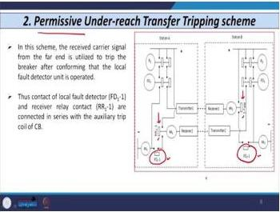
*Figure 22.8: Comparison of direct and permissive underreach control circuits.*

### Operation - Internal Fault (at F₁)

1. R₁ senses fault; FD₁ operates → FD₁ contact closes
2. Direct tripping initiated at bus A
3. R₂ senses fault; FD₂ operates → FD₂ contact closes
4. Direct tripping initiated at bus B

### Operation - Fault in Remaining 20% (at F₂)

1. R₂ detects fault in first zone → operates
2. FD₂ operates → tripping initiated at bus B → coil of 86(2) energized
3. R₂ transmits signal through transmitter to bus A
4. Receiver at A receives → RR₁ coil energized → RR₁-1 contact closes
5. **However**, direct tripping is NOT initiated immediately
6. Tripping occurs only when FD₁ contact also closes
7. FD₁ will definitely close because fault current exceeds predetermined value (fault at F₂ is within FD₁'s reach)

**Advantage over Direct Underreach:** Maloperation due to noise-induced closing of receiver relay contact is avoided. Tripping occurs only when BOTH receiver relay contact AND local fault detector contact are closed.

## 22.4 Carrier Aided Distance Scheme for Acceleration of Zone-2

### Concept of Zone-2 Acceleration

- Conventional Zone 2 covers the remaining 20% beyond Zone 1
- Zone-2 operation is delayed (typically 300-600 ms timer)
- **Acceleration of Zone 2** = converting Zone 2 into Zone 1 behavior:
  - Faults in the 20% region cleared instantaneously
  - Achieved by increasing first zone reach on each side

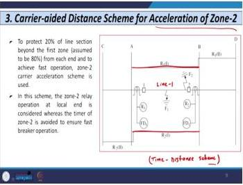
*Figure 22.9: Time-distance characteristic showing extended Zone 1 to 95-100% of line.*

**Time-Distance Characteristic:**
- First zone of R₁ extended to approximately **95-100%** of Line 1
- First zone of R₂ extended to approximately **95-100%** of Line 1
- Zone 2 of both relays covers beyond the line

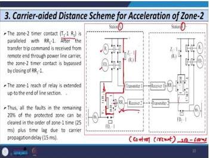
*Figure 22.10: Control circuit showing Zone 2 timer contact in parallel with receiver relay contact.*

**Control Circuit Features:**
- Similar to permissive underreach transfer tripping scheme
- Additional path included:
  - Zone 2 contact of R₁: Z₂-1 (R₁)
  - Timer contact: T₁-1 (R₁) - timer 1, first contact, for relay R₁
- Timer contact T₁-1 (R₁) connected **in parallel** with receiver relay contact RR₁-1
- Same arrangement replicated at substation B

### Operation - Fault in Remaining 20% (at F₂)

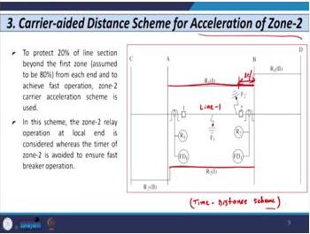
*Figure 22.11: Fault at F₂ showing Zone 2 operation at R₁ and transfer trip from R₂.*

1. R₂ sees fault in first zone → operates
2. R₁ sees fault in **second zone** (beyond R₁'s extended first zone)
3. Z₂-1 (R₁) contact closes immediately (Zone 2 circle encompasses Zone 1 in Mho relay)
4. Normally, timer T₁ would delay tripping by 300-600 ms
5. **However**, RR₁-1 contact is in parallel with T₁-1 (R₁)
6. When transfer trip command received from bus B, RR₁ coil energized → RR₁-1 closes
7. This **bypasses** the Zone 2 timer → tripping given directly
8. Result: Instantaneous tripping for faults in the 20% region

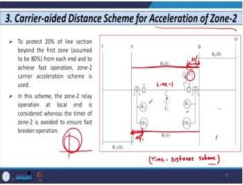
*Figure 22.12: Mho relay characteristic showing Zone 2 circle encompassing Zone 1.*

**Key Point:** Zone 2 timer contact is bypassed by closing of RR₁-1 contact. This achieves fast breaker operation without waiting for Zone 2 timer.

## 22.5 Carrier Aided Distance Scheme for Pre-acceleration of Zone-2

### Difference from Acceleration of Zone-2

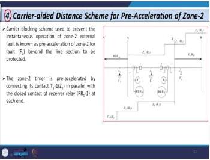
*Figure 22.13: Pre-acceleration scheme showing reverse-looking relays.*

- **Reverse looking relays** present at each bus in pre-acceleration scheme
- In acceleration of Zone-2 scheme, no reverse looking relays used

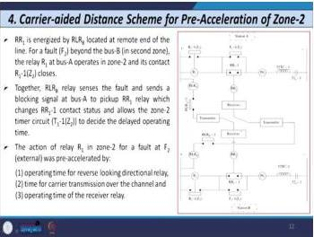
*Figure 22.14: Control circuit for pre-acceleration scheme.*

**Control Circuit:**
- RR₁ coil energized based on signal received from remote end (substation B)
- R₁ operates in Zone 2 → contact R₁-1, Z₁ closes
- Reverse looking relay at B senses fault at F₂ → sends blocking signal to bus A
- Receiver relay at A picks up → changes status of RR₁-1 contact
- This allows Zone 2 timer contact T₁-1, Z₂ to be decided/operated

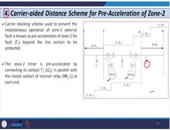
*Figure 22.15: Reverse-looking relay operation in pre-acceleration scheme.*

**Timing Considerations:**
- Operating time of conventional relay or reverse looking relay
- Operating time of receiver relay
- Carrier transmission delay from one bus to another

## 22.6 Overreach Transfer Tripping Scheme

### Zone Settings

**First zone reach of R₁ goes beyond the protected line section. First zone reach of R₂ goes beyond the protected line section. Usual setting: 120% to 150% on each side.**

*Figure 22.16: Time-distance characteristic showing Zone 1 overreaching the protected line.*

### Operation - Internal Fault (at F₁)

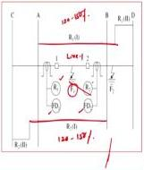
*Figure 22.17: Internal fault operation in overreach transfer tripping scheme.*

1. Both R₁ and R₂ sense fault in first zone → operate instantaneously
2. FD₁ and FD₂ also sense fault → contacts close
3. Direct tripping initiated on each side
4. Simultaneously, each relay sends carrier signal to far end:
   - R₁ sends signal to bus B → receiver relay contact closes at B
   - R₂ sends signal to bus A → receiver relay contact closes at A
5. Auxiliary relay coils 86(1) and 86(2) energized → breakers trip

### Operation - External Fault (at F₂, beyond bus B)

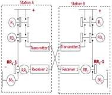
*Figure 22.18: External fault operation showing why tripping is prevented.*

1. R₁ operates in first zone (reach 120%) → detects fault
2. R₁ sends carrier signal to bus B → receiver relay RR₂ contact closes
3. **However**, R₂ does NOT sense fault (fault is beyond R₂'s reach on reverse side)
4. No tripping initiated at bus B
5. Since R₂ does not operate, **no signal transmitted** from bus B to bus A
6. Receiver relay at A remains open
7. Even though R₁ operates and FD₁ operates, no tripping at bus A
8. Tripping prevented at bus A

*Figure 22.19: Control circuit for overreach transfer tripping scheme.*

### Advantages and Disadvantages

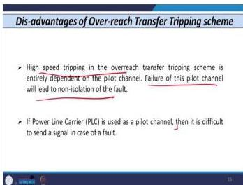
*Figure 22.20: Summary of overreach transfer tripping scheme pros and cons.*

**Advantages:**
1. High-speed tripping achieved on both sides of the relay
2. Better than underreach schemes for speed

**Disadvantages:**
1. If communication channel fails → probability of maloperation for faults beyond zone on each side (F₂ or F₃)
2. With power line carrier communication (historically used in India), this scheme may face difficulties
   - Note: Modern practice no longer uses power line carrier for signal transmission

## Lecture 22 Recap

| Scheme | Zone 1 Setting | Key Feature | Main Disadvantage |
|--------|---------------|-------------|-------------------|
| Direct Underreach | 80% | Receiver contact directly closes | Maloperation from noise |
| Permissive Underreach | 80% | FD contact in series with RR contact | Slightly slower |
| Acceleration of Zone-2 | 95-100% | Timer bypassed by RR contact | Complex control |
| Pre-acceleration of Zone-2 | 95-100% | Reverse-looking relays added | More complex |
| Overreach Transfer Tripping | 120-150% | Fastest, no coordination needed | Channel failure risk |

---

# Lecture 23: Auto-reclosing and Synchronizing - I

## 23.1 Introduction and Motivation

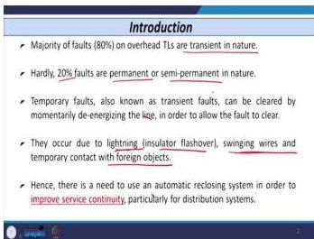
*Figure 23.1: Fault statistics showing 80% of overhead line faults are transient.*

**Key Statistics:**
- **80%** of faults on overhead transmission lines are **transient** in nature
- **20%** of faults are permanent or semi-permanent

**Nature of Transient Faults:**
- Can be cleared by momentarily de-energizing the line
- Causes:
  - Lightning (flashover of insulator)
  - Swinging of wires
  - Temporary contact with foreign objects

**Need for Auto-reclosing:**
- Improves service continuity (distribution systems)
- Improves stability and reliability (transmission systems)
- High-speed auto-reclosing in tie lines between areas improves system stability

**Important Note:**

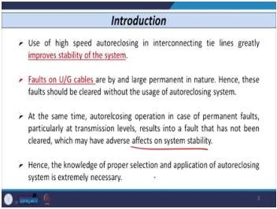
*Figure 23.2: Warning - auto-reclosing should NOT be used for underground cables.*

- Faults on **underground cables** are usually **permanent** in nature
- Auto-reclosing should **NOT** be used for underground cables
- Use only for overhead conductors

**Risk with Permanent Faults:**
- Auto-reclosing on permanent faults may:
  - Damage circuit breaker contacts
  - Affect system stability (worst case)
- Proper selection and application of auto-reclosing is critical

## 23.2 History of Auto-reclosing

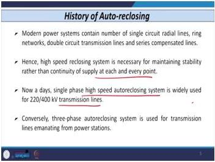
*Figure 23.3: Historical development of auto-reclosing from 1975 onwards.*

**Timeline:**
- **1975:** American Electric Power System introduced high-speed reclosing for radial lines
  - Concept: Rapidly reclosing a single line rather than providing a second, redundant path
- **1984 (IEEE Power System Relaying Committee report):**
  - Automatic reclosing first applied on:
    - Radial distribution feeders
    - Ring networks
    - Sub-transmission networks (protected by instantaneous relays)
  - **Multi-shot reclosing relay** used: recloses circuit in 2-3 attempts before final lockout
  - **Success rate: 73% to 88%**

**Modern Applications:**

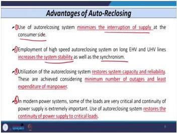
*Figure 23.4: Modern applications on 220 kV and 400 kV EHV/UHV lines.*

- Modern power systems contain radial lines, ring networks, double circuit and series compensated lines
- High-speed reclosing necessary to maintain stability (not just continuity of supply)
- Auto-reclosers used for **220 kV and 400 kV EHV and UHV lines**
- Three-phase auto-reclosing used for transmission lines emanating from substations

## 23.3 Advantages of Auto-Reclosing System

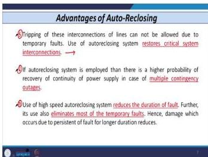
*Figure 23.5: Summary of auto-reclosing advantages.*

**Advantage 1: Minimizes interruption of supply at consumer side**
- 80-90% of faults on overhead conductors are transient/temporary
- Faults may die out after first reclosing time
- Supply continues with minimal interruption

**Advantage 2: Improves system stability and synchronization**
- High-speed auto-reclosing for EHV and UHV lines
- Critical for maintaining synchronism of the network

**Advantage 3: Restores system capacity and reliability**
- Minimum number of outages
- Least expenditure on manpower (no need to send line crew for transient faults)

**Advantage 4: Restores continuity for critical loads**
- Hospitals, military loads, etc.
- Uninterrupted power supply maintained

**Advantage 5: Improves stability for long/tie lines**
- Tripping of very long lines or tie lines due to temporary faults impacts stability of whole network
- Auto-reclosing restores critical system interconnections

**Advantage 6: Beneficial in multiple contingency outages**

**Advantage 7: Reduces fault duration**
- High-speed auto-reclosers reduce the time fault persists
- Eliminates most temporary faults
- Reduces damage due to prolonged fault persistence

**Additional Advantages (Distribution Systems):**
- Maximum benefit where permanent outages due to transient faults beyond tap fuses can be reduced
- Delayed auto-reclosing schemes increase chances of clearing semi-permanent faults where fuses are used
- Maximum benefit for **unattended substations** (reduces staff requirement)
- Gives relief to system operators during power system restoration after outages

## 23.4 Classification of Auto-Reclosing Relays (ARR)

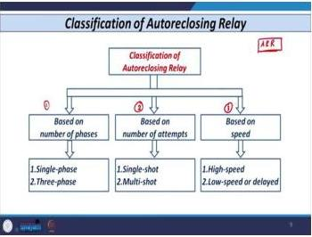
*Figure 23.6: Classification of auto-reclosing relays.*

**Three Classification Bases:**

| Classification Basis | Types |
|---------------------|-------|
| Number of phases | Single-phase, Three-phase |
| Number of attempts | Single-shot, Multi-shot |
| Speed | High-speed, Low-speed/delayed |

## 23.5 Single-Phase Auto-Reclosing

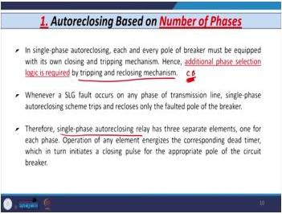
*Figure 23.7: Single-phase auto-reclosing concept showing per-phase operation.*

**Requirements:**
- Each pole of the breaker must have its own closing and tripping mechanism
- Additional **phase selection logic** required for tripping and closing

**Operation:**
- Single line-to-ground fault on any phase → trips and restores only the faulted phase
- Other two healthy phases remain closed
- Single-phase ARR has **3 separate elements** (one per phase)
- Operation of any element energizes corresponding timer
- Timer gives closing pulse for appropriate pole of circuit breaker

**Cost Consideration:**
- Single-phase auto-recloser is **slightly costlier** than three-phase auto-recloser
- Circuitry required for each phase

**Reset Behavior:**

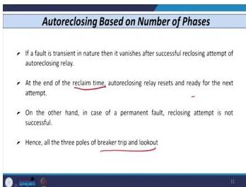
*Figure 23.8: Reset behavior after successful reclosing.*

- If fault is transient → vanishes after successful reclosing attempt
- At end of reclaim time, ARR resets and is ready for next operation
- Similar to protective relays (overcurrent, distance) which reset after fault clearance

**Permanent Fault Behavior:**
- Reclosing attempt unsuccessful
- All 3 poles of breaker operate again
- Finally goes into **lockout condition**

**Advantages:**

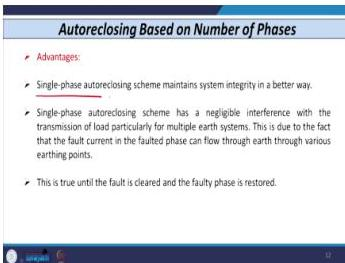
*Figure 23.9: Advantages of single-phase auto-reclosing.*

1. Maintains system integrity better than three-phase schemes
2. Negligible interference with load transmission (especially with multiple earth systems)
   - Fault current in faulted phase flows through earth from various earthing points
   - This holds until fault is cleared and faulty phase restored

**Disadvantages:**

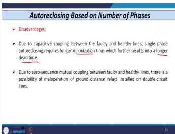
*Figure 23.10: Disadvantages of single-phase auto-reclosing.*

1. **Longer deionization time required** due to capacitive coupling between faulty and healthy lines
   - Results in longer dead time
2. **Zero-sequence mutual coupling** between conductors:
   - Possibility of maloperation of ground distance relay
   - Particularly on double circuit lines (6 conductors from one bus)
   - Voltage induced on relay of parallel line → maloperation possible

## 23.6 Auto-Reclosing Based on Number of Attempts

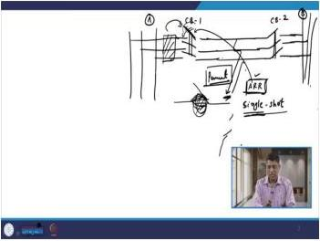
*Figure 23.11: Single-shot vs. multi-shot reclosing.*

**Single-Shot Reclosing Relay:**
- Executes only **one** reclosing attempt
- Thereafter remains in **lockout stage** irrespective of fault type (transient or permanent)
- Used for long EHV and UHV lines, particularly in areas with high probability of lightning incidence

**Multi-Shot Reclosing Relay:**
- Pursues **two or three** reclosing sequences within a specified time interval
- Used in distribution systems to improve service continuity

**Sequence of Events (Single-Shot, Transient Fault):**
1. Fault occurs at T = 0
2. Relay (distance/overcurrent) senses fault → operates after its operating time (e.g., 20-30 ms)
3. Relay gives signal to breaker trip coil AND to auto-reclosing relay simultaneously
4. Trip coil energized → contacts begin to separate
5. **Opening time of breaker:** from trip coil energization to contact separation
6. **Arcing time:** from contact separation to arc quenching
7. **Operating time of breaker** = opening time + arcing time
8. **Fault clearing time** = relay operating time + breaker operating time
9. After arc quenched, contacts fully open
10. **Dead time of auto-recloser** starts from instant relay operates (receives signal from protective device)

## 23.7 Auto-Reclosing Based on Speed

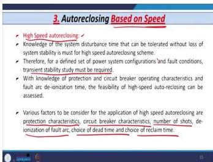
*Figure 23.12: High-speed vs. slow/delayed auto-reclosing.*

**High-Speed Auto-Reclosing:**
- Knowledge of disturbance tolerance of the power system is critical
- **Transient stability study is a prerequisite** for defined system configurations and fault conditions
- Requires knowledge of:
  - Relay and breaker operating characteristics
  - Deionization time of arc (arcing time)
- Factors to consider:
  - Protection characteristics
  - Circuit breaker characteristics
  - Number of shots (single or multiple)
  - Deionization time of fault arc
  - Choice of dead time
  - Choice of reclaim time

**Slow/Delayed Auto-Reclosing:**

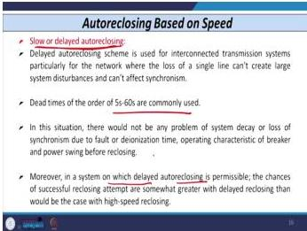
*Figure 23.13: Slow/delayed auto-reclosing characteristics.*

- Used for transmission systems where loss of a single line creates large disturbances on synchronism
- When system is highly interconnected, loss of one line has minimal impact → delayed reclosing acceptable
- **Dead time: 5 to 60 seconds** commonly used
- No problem of system decay or loss of synchronism due to fault
- Chances of successful reclosing are **somewhat greater** than high-speed reclosing
  - Reason: If fault persists for longer duration, it can be easily cleared by delayed reclosing

## Lecture 23 Recap

- **80% of overhead line faults are transient** - auto-reclosing exploits this
- **Never use auto-reclosing on underground cables** - faults are permanent
- **Single-phase reclosing**: Better system integrity but longer deionization time and zero-sequence coupling issues
- **Single-shot vs. multi-shot**: EHV/UHV lines use single-shot; distribution uses multi-shot
- **High-speed vs. delayed**: Stability requirements dictate choice; delayed gives 5-60 s dead time
- **Fault clearing time** = relay operating time + breaker operating time
- **Breaker operating time** = opening time + arcing time

---

# Lecture 24: Auto-reclosing and Synchronizing - II

## 24.1 Sequence of Events - Detailed Analysis

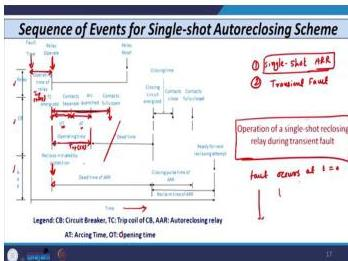
*Figure 24.1: Sequence of events for transient fault with single-shot auto-reclosing.*

**Assumptions:**
- Single-shot auto-reclosing relay
- Transient fault

**Event Sequence (from fault inception):**

| Time Point | Event |
|------------|-------|
| T = 0 | Fault occurs (fault inception) |
| After relay operating time (20-25 ms) | Relay operates; gives signal to breaker trip coil AND to ARR |
| Trip coil energized | Contact separation begins |
| Contact opening time | From trip coil energization to contact separation |
| Arcing time | From contact separation to arc quenching |
| Arc quenched | Contacts fully open |
| After arc quenched | Dead time of circuit breaker begins |

**Definitions:**
- **Contact opening time of breaker:** Time from trip coil energization to contact separation
- **Arcing time:** Time from contact separation to arc quenching
- **Operating time of circuit breaker** = Opening time + Arcing time
- **Fault clearing time** = Relay operating time + Breaker operating time
- **Dead time of circuit breaker:** Time after arc is fully quenched (contacts fully open)

**ARR Signal Initiation:**
- When protective device (relay) operates, it simultaneously gives signal to:
  1. Circuit breaker trip coil
  2. Auto-reclosing relay (ARR)
- ARR receives signal at the same instant relay operates
- **Dead time of auto-recloser** starts from this instant

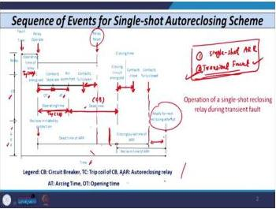
*Figure 24.2: Continued sequence showing dead time, reclosing, and reclaim time.*

## 24.2 Dead Time of Circuit Breaker - Definition and Physical Meaning

**Definition:** Dead time means once the arc is quenched. Normally arc is quenched by some medium. Once the arc phenomena occurs, whatever air or medium is there is ionized; you have to deionize that particular region using some medium (arc quenching medium). Once the arc is fully quenched, the breaker is not ready immediately.

**Physical Intuition:** You need to give some rest so that the dielectric strength of whatever medium you use is regained. This is known as the dead time of the circuit breaker.

**Sequence Context (Transient Fault):**
- After the contacts of the breaker are fully open, after some time delay, the relay becomes reset
- Resetting of relay is carried out only when the contacts of the circuit breaker become fully open with some safety margin after that time period
- When the relay resets, the task of the auto recloser starts
- Auto recloser issues a closing command (closing pulse); the closing circuit of the breaker is energized
- After the closing time of the breaker, the contacts become closed
- Since the fault is transient in nature, it has already died out; the system is healthy, so no further opening is required

**Reclaim Time of Auto-reclosing Relay (Definition):** The instant from where the closing pulse is issued by the auto recloser until the contact of the circuit breaker becomes fully reclosed. This time is known as the reclaim time of the auto reclosing relay. After this time, the auto recloser is ready for the next reclosing attempt.

## 24.3 Sequence of Events for Permanent Fault (Single-Shot Auto Reclosing)

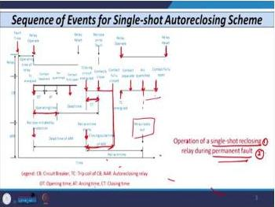
*Figure 24.3: Sequence of events for permanent fault showing lockout condition.*

**Assumptions:** Permanent fault; single-shot auto reclosing relay.

**Sequence:**
1. Fault occurs; relay operates (relay operating time)
2. Breaker has operating time; relay gives command to breaker and also issues command to auto recloser
3. Contacts of circuit breaker become fully open; arc is quenched
4. Dead time exists
5. Auto reclosing relay issues closing pulse to circuit breaker; closing circuit energized
6. Contacts close (closing time of breaker after command issued by auto recloser)
7. Since fault is permanent, it does not die out; protective relay operates again, senses fault, gives signal to breaker and auto recloser
8. Trip coil energized; contacts separate; arc quenched; contacts fully open (no arc)
9. Command given to auto recloser; its contact goes to lockout condition because it is a permanent fault
10. After one reclosing attempt, fault found permanent; further auto reclosing attempts not carried out
11. Relay becomes reset; ready for next operation

## 24.4 Factors to be Considered While Applying Auto Reclosing Philosophy

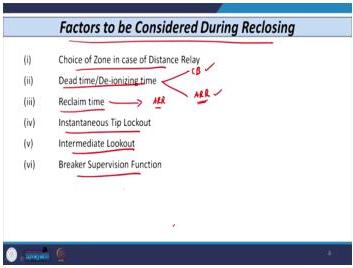
*Figure 24.4: Six factors to consider when applying auto-reclosing.*

**Six Major Factors:**
1. **Choice of zone** - only if distance relay is used
2. **Dead time or deionization time** - dead time for auto recloser; deionization time for circuit breaker
3. **Reclaim time** - specifically applicable to auto reclosing relay only, not to circuit breaker
4. **Instantaneous trip lockout**
5. **Intermediate lockout**
6. **Breaker supervision function**

## 24.5 Factor 1 - Choice of Zone in Case of Distance Relay

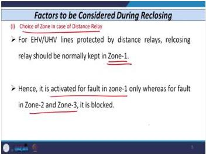
*Figure 24.5: Zone selection for auto-reclosing with distance relays.*

**Context:** For EHV and UHV lines, distance relay or carrier-aided distance scheme/pilot scheme may be used.

**Key Rule:** Reclosing relay should normally be kept for **Zone 1 only**. Do not use reclosing relay for Zone 2 and Zone 3. If auto reclosing feature is used with distance relay, it is activated for Zone 1 only; for Zone 2 and 3, the working of the auto recloser must be blocked.

**Reasoning:**
- Zone 1 of distance relay covers approximately 80%-90% of line length
- For faults in Zone 1: relay operates in 25-30 ms (1 to 1.5 cycles)
- For faults in remaining 20% on each side (total 40%): fault sensed by distance relay on either side in second zone; operating time 30-40 ms
- Opening time calculation:
  - One side: 25 ms (relay) + 50 ms (breaker, 2.5 cycles) = **75 ms**
  - Other side: 300 ms (zone 2 minimum) + 50 ms = **350 ms**
- Simultaneous opening of breakers is not possible for faults in the remaining 20% region on each side
- High-speed auto reclosing should NOT be applied for the remaining 20% region
- Reclosing attempt should only be for the **60% region** from the midpoint of the transmission line where both relays sense the fault in first zone

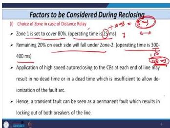
*Figure 24.6: Explanation of Zone 1 coverage and the 60% region suitable for high-speed reclosing.*

**Additional Warning:** When high-speed auto reclosing is applied at each end of the line, it may result in no dead time or insufficient dead time to allow deionization of arc. Transient faults may appear as permanent faults, causing unnecessary breaker operation.

**Consequence of Incorrect Application:** One side clears fault in 75 ms, other side may take 350 ms. If another fault occurs consecutively, the breaker may not get sufficient deionization time; dielectric strength of the medium may not recover; there are fair chances of arc re-striking.

**Remedies:**

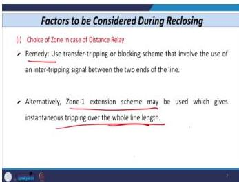
*Figure 24.7: Remedies for the zone selection problem.*

1. Use tripping scheme or transfer tripping scheme, or blocking scheme - involves transfer of signal from the other end on each side
2. Extend Zone 1 of distance relay (acceleration of Zone 1) - convert remaining 20% on each side (Zone 2) into Zone 1 so entire line is protected in first zone. **Caveat:** Fair chances of mal-operation because extending Zone 1 or converting Zone 1 into Zone 2 is very difficult

## 24.6 Factor 2 - Dead Time or Deionization Time

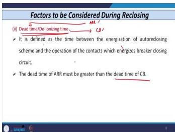
*Figure 24.8: Definition of dead time and deionization time.*

**Definitions:**
- **Dead time** - considered for auto reclosing relay
- **Deionization time** - considered for circuit breaker

**Formal Definition:** Time between the energization of auto reclosing scheme and the operation of contact which energizes the breaker closing circuit.

**For Circuit Breaker:** Dead time starts from the instant the arc is fully quenched and goes up to when the closing command is issued to the closing coil.

**For Auto Reclosing Relay:** Dead time starts once the relay (original protective device) operates and gives signal to the auto recloser. Reclaim time starts when the closing circuit of the circuit breaker is energized.

**Key Relationship:** Dead time of auto reclosing relay is **always greater than** the deionization time of the circuit breaker.

*Figure 24.9: IEC standard formula for minimum dead time.*

**IEC Standard Formula for Minimum Dead Time (High-Speed Reclosing):**

$$t = 10.5 + \frac{\mathrm{kV}}{34.5} \text{ cycles}$$

Where:
- $t$ = dead time in cycles (convert to milliseconds)
- $\mathrm{kV}$ = line-to-line voltage or system line-to-line voltage

**Worked Examples:**
- For 220 kV line: dead time = **0.3 seconds**
- For 400 kV line: dead time = **0.4 seconds**

## 24.7 Dead Time of Arcing Fault vs. Circuit Breaker Dead Time

**Key Distinction:** Dead time of an arcing fault on a reclosing operation is **not the same** as the dead time of the circuit breakers involved.

**Reason:** Dead time of the fault is the interval during which the faulted line is de-energized from **all terminals**. It is mandatory that the faulty line be de-energized from all sides - not just local and remote - which takes more time. Simultaneous opening of breakers on both sides is very important.

**Arcing Fault Context:** Most faults are solid (no fault resistance path). If a fault involves a fault resistance path, it may convert into an arcing fault. Arcing faults are caused by high-resistance faults and may create danger to personnel working in the field.

**Single-Pole Tripping and Reclosing:** Requires **longer dead time** because only the faulty phase pole opens while the other two healthy poles remain closed. Energization of two phases keeps the arc conducting for a longer period.

## 24.8 Deionization Time - Purpose and Dependence Factors

**Purpose:** De-ionizing time is necessary to ensure dispersion of ionized air so that the arc will not re-strike when the line is re-energized.

**Physical Intuition:** When contacts open, the arc is quenched using a medium (air, pressurized air, oil, or gas). That medium has dielectric strength used to quench the arc. After quenching, time is needed (dead time or deionization time) so the dielectric strength is regained and the breaker is ready for the next opening operation.

**Factors on Which Deionization Time Depends:**
1. Arcing time (denoted AT)
2. Fault duration (time interval the fault persists)
3. Wind conditions
4. Circuit voltage (system voltage)
5. Capacitive coupling to adjacent conductors

## 24.9 Factor 3 - Reclaim Time

*Figure 24.10: Definition of reclaim time.*

**Definition:** Reclaim time is the time between the instant when the reclosing relay makes the contact (first attempt) before it initiates another reclosing attempt. It is the time between two adjacent reclosing attempts.

**Precautions for Reclaim Time Selection:**
- When the line is energized due to a reclosing attempt and a new fault occurs before the reclaim time has elapsed, it is **mandatory to block** the operation of the reclosing relay and obtain a signal for **definite tripping** of the breaker
- Once the reclaim time has expired, the reclosing relay returns to its initial position and starts a new reclosing sequence

**Design Constraints:**
- Reclaim time must **not be too small** - otherwise the intended operating cycle of the breaker is exceeded when two faults occur close together
- If the breaker is closed **manually**, the operation of the reclosing relay is blocked. It cannot start again until the reclaim time (usually **25 seconds**) has elapsed

*Figure 24.11: IEC standard operating cycle for circuit breakers.*

**IEC Standard Operating Cycle for Circuit Breakers:**

$$O + 0.3 \text{ s} + CO + 3 \text{ min} + CO$$

Where:
- $O$ = opening of the breaker
- $CO$ = closing followed by opening
- 0.3 s = 300 ms delay between first opening and first CO
- 3 min = delay between first CO and second CO

**Worked Example (Meaning of the Operating Cycle):**

*Figure 24.12: Three-phase circuit with breakers at both ends (Substation A and B).*

- Three-phase circuit with breakers at both ends (Substation A and Substation B), line between them
- Fault occurs on the line; relay at Substation A senses fault, gives signal to breaker
- Trip coil energized; contacts separate; arc forms and is quenched by quenching medium
- Relay time + breaker operating time = **fault clearing time**
- After contacts open: 0.3 s (300 ms) time delay
- First reclosing attempt performed by breaker A; contacts close
- If fault is transient: breaker remains closed
- If fault is permanent: relay at A senses again, gives signal, trip coil energized, contacts separate, arc quenched - this is the **CO** (closing followed by opening)
- For second reclosing attempt: 3-minute time delay
- Close contacts again; if fault persists, relay detects, breaker opens, remains in **lockout condition**
- The time between first reclosing attempt and second closing attempt is the **reclaim time**

**Warning:** If reclaim time is too small, chances of recuperation issues; some faults may not be cleared or relay may mal-operate.

## 24.10 Factor 4 - Instantaneous Trip Lockout

*Figure 24.13: Instantaneous trip lockout concept in distribution systems.*

**Background Statistics:** 80%-90% of faults on distribution systems are temporary and disappear in a short period of time.

**Application:** Reclosers in coordination with fuses are used in distribution systems such that fuses operate **only for permanent faults**, improving reliability of power supply.

**Fuse Saving Concept:**
- Fuse should **not** operate first; recloser should operate first to clear transient faults
- Thereafter, fuse is allowed to blow if fault is permanent in nature
- After first attempt of recloser, it remains in lockout condition

*Figure 24.14: Distribution system showing utility source, recloser, HT feeder, and laterals with fuses.*

**System Configuration:**
- Utility source → recloser → 11 kV HT feeder → laterals protected by fuses
- Fault occurs on a lateral
- Recloser characteristic must fall below fuse characteristic
- If fault is transient: recloser operates, reclosing attempt successful, system healthy
- If fault is permanent: reclosing attempt unsuccessful, breaker opens again, recloser goes to lockout condition, then fuse operates

*Figure 24.15: Time-current characteristics showing recloser-fuse coordination for fuse saving.*

**Key Point:** This philosophy is known as **fuse saving concept**, widely adopted at distribution level.

**Requirement:** Proper coordination between recloser and fuse is necessary; otherwise mal-operation occurs.

**Note on Modern Context:** With renewable energy sources (solar, wind) connected to distribution networks, coordination becomes entirely different - identified as a good research area.

## 24.11 Factor 5 - Intermediate Lockout

*Figure 24.16: Introduction to intermediate lockout concept.*

**Context:** Tappings from transmission lines can be taken frequently to provide in-between connections to load. This is usually carried out through a transformer and known as **Line in Line out (LILO)** activity. This configuration is widely known as **tapped transmission line** or **multi-terminal line**.

*Figure 24.17: Tapped transmission line or multi-terminal line structure.*

**Structure:** Source → bus → line → transformer tappings to loads; possibly renewable sources connected.

**For Attended Substations:**

*Figure 24.18: Behavior for attended substations.*

- Whenever fault occurs on tapped lines, most attended substations are disconnected as there is no provision of intermediate lockout feature in reclosing relay
- An attempt of **manual reclosing** is carried out by the operator at the remote end after lockout, subject to the condition that fault no longer exists
- Service at the local end can be easily restored after successful operation of reclosing relay in conjunction with the synchro check relay

**For Unattended Substations:**

*Figure 24.19: Intermediate lockout behavior for permanent faults.*

- Intermediate lockout feature is available in reclosing relay
- This feature is activated on a **permanent fault** and bypasses all the upcoming reclosing operations of the relay

**Behavior:** Even if the recloser is capable of 3 reclosing operations, if the fault is determined to be permanent (using available algorithms), after the first reclosing attempt the recloser goes directly to lockout condition. The remaining reclosing attempts cannot be attempted.

## 24.12 Factor 6 - Breaker Supervision Function

*Figure 24.20: Breaker supervision function concept.*

**Purpose:** Maintains stability of power system; decides the breaker maintenance schedule.

**Key Concepts:**
- Regular maintenance of circuit breaker depends on the wear withstanding capability of the breaker
- Manufacturers specify how many mechanical operations the breaker can successfully carry out (same as MCBs)
- When digital relays are used, a separate function issues alarm or warning when breaker maintenance is needed
- Digital relay associated with circuit breaker issues commands based on the breaker supervision function
- Settings specified in terms of:
  - Maximum number of allowable reclosing operations
  - Time span for which reclosing operations are permitted
- Relay issues command indicating how many reclosing operations are permitted and the time between each reclosing operation

*Figure 24.21: Breaker supervision function issuing maintenance alarms.*

## Lecture 24 Recap

- **Dead time (CB)**: Arc quenching to closing command; **Dead time (ARR)**: Relay operation to closing circuit energized
- **Deionization time** depends on: arcing time, fault duration, wind, voltage, capacitive coupling
- **IEC formula**: $t = 10.5 + \frac{\mathrm{kV}}{34.5}$ cycles (220 kV → 0.3 s; 400 kV → 0.4 s)
- **Reclaim time**: Between adjacent reclosing attempts; must not be too small
- **IEC operating cycle**: $O + 0.3 \text{ s} + CO + 3 \text{ min} + CO$
- **Fuse saving**: Recloser operates first for transient faults; fuse only for permanent
- **Intermediate lockout**: Bypasses remaining reclosing attempts after permanent fault
- **Breaker supervision**: Digital relay function for maintenance scheduling

---

# Lecture 25: Auto-reclosing and Synchronizing - III

## 25.1 Review of Factors

*Figure 25.1: Review of the six factors for auto-reclosing application.*

Before diving into synchronism check, let me review the six factors from Lecture 24:
1. Choice of zone (Zone 1 only for distance relays)
2. Dead time or deionization time
3. Reclaim time
4. Instantaneous trip lockout
5. Intermediate lockout
6. Breaker supervision function

## 25.2 Synchronism Check (Synchro Check)

*Figure 25.2: Introduction to synchronism check.*

**Definition:** Synchronism check is a relay or an element in the reclosing system.

**Function:** Senses the voltage on the two sides of the breaker. Whenever the minimum voltage exists across the contacts of the circuit breaker (phase-wise), reclosing attempt is made. The impact on the contacts of the breaker should be minimized.

**Setting Basis:** Based on the angular difference of the two voltages. Options:
- Difference of magnitude only
- Difference of angular difference only
- Phasor difference (both magnitude and angle)

**Main Function:** Minimize the shock on the system when the circuit breaker closes.

**Important Note:** Angular difference between voltages can be measured; however, this does not determine any transient condition.

*Figure 25.3: Angular difference measurement between bus and line voltages.*

**Two Methods for Synchro Check Element:**
1. Phasing voltage method
2. Angular method

## 25.3 Phasing Voltage Method

*Figure 25.4: Phasing voltage method principle.*

**Principle:**
- Bus voltage is used as a reference
- Line voltage is supplied to the synchro check element/relay as a controlling voltage
- Two voltages are compared
- When the difference exceeds a predetermined value, the output of the synchro check relay is available

*Figure 25.5: Phasor diagram showing bus voltage reference and line voltage comparison.*

**Phasor Diagram Interpretation:**
- Bus voltage acts as reference
- Line voltage (on either side) is compared with the reference value
- Pickup value or predetermined threshold varies within a range (shown in slides)
- If the difference between the two voltages is within the predetermined threshold value, closing operation of breaker is allowed; otherwise closing is not allowed
- Continuous checking is performed sample by sample; whenever the difference is within the set value, closing is allowed

*Figure 25.6: Control circuit for phasing voltage method.*

**Control Circuit Elements:**
- Three bus voltages; three lines emanating
- Voltage transformer elements on both sides
- Secondary side: 52b (circuit breaker associated switch)
- 25 O - operating element (synchro check operating coil)
- 25 R - restraining coil of synchro check relay/element
- When within predetermined threshold: operation not carried out; otherwise operation is performed

## 25.4 Angular Method

*Figure 25.7: Angular method principle.*

**Principle:**
- Bus voltage used as reference ($V_{\mathrm{ref}}$)
- Line voltage used as input voltage ($V_{\mathrm{in}}$)
- Compare the two voltages
- Verifies magnitude of $V_{\mathrm{ref}}$ and $V_{\mathrm{in}}$ - checks if within prescribed limit
- Along with magnitude, verifies angular difference - checks if within pre-set or predetermined value

*Figure 25.8: Angular method operation with interlocking.*

**Operation:**
- If both angular difference and difference in voltage magnitude are within predetermined limits: closing operation of breaker is permitted
- If difference is beyond the limit: closing operation is not allowed
- Modern practice: interlocking is provided with synchro check relay/element for automatic operation in unattended substations
- Even if operator presses the closing button, closing is not allowed when difference is above the limit

## 25.5 Comparison of Synchro Check Methods

| Feature | Phasing Voltage Method | Angular Method |
|---------|----------------------|----------------|
| Reference | Bus voltage | Bus voltage ($V_{\mathrm{ref}}$) |
| Input | Line voltage | Line voltage ($V_{\mathrm{in}}$) |
| Comparison | Voltage difference | Magnitude AND angle |
| Output | Close if within threshold | Close if both within limits |
| Complexity | Simpler | More comprehensive |
| Interlocking | Basic | Modern practice includes interlocking |

## Lecture 25 Recap

- **Synchronism check** senses voltage across breaker contacts before reclosing
- **Phasing voltage method**: Compares bus and line voltage magnitudes; closes when difference within threshold
- **Angular method**: Verifies both magnitude and angular difference; more comprehensive
- **Interlocking**: Modern practice prevents closing even with manual operator command when limits exceeded
- **Purpose**: Minimize shock on system when breaker closes

---

## Worked Examples

### Worked Example 1: Dead Time Calculation for a 220 kV Line

**Problem:** Calculate the minimum dead time for a 220 kV transmission line using the IEC standard formula. Express the answer in cycles and seconds (assume 50 Hz system frequency).

**Solution:**

Using the IEC standard formula:
$$t = 10.5 + \frac{\mathrm{kV}}{34.5} \text{ cycles}$$

Substituting kV = 220:
$$t = 10.5 + \frac{220}{34.5} = 10.5 + 6.38 = 16.88 \text{ cycles}$$

At 50 Hz, one cycle = 20 ms:
$$t = 16.88 \times 20 \text{ ms} = 337.6 \text{ ms} \approx 0.34 \text{ seconds}$$

The lecture states this as approximately **0.3 seconds** for a 220 kV line.

**Engineering Interpretation:** The dead time must be at least 0.3 seconds to allow sufficient deionization of the arc quenching medium. If the dead time is shorter, the dielectric strength may not recover, and the arc may re-strike when the line is re-energized.

---

### Worked Example 2: Fault Clearing Time Asymmetry in End Regions

**Problem:** For a fault in the end region of a transmission line (beyond Zone 1 of one relay), calculate the fault clearing times at both ends. Relay operating time for Zone 1 is 25 ms, for Zone 2 is 300 ms. Breaker operating time is 50 ms.

**Solution:**

For a fault in the end region (say near bus B):

**At the end where the fault is in Zone 1 (bus B):**
- Relay operating time (Zone 1) = 25 ms
- Breaker operating time = 50 ms
- Fault clearing time = 25 + 50 = **75 ms**

**At the end where the fault is in Zone 2 (bus A):**
- Relay operating time (Zone 2) = 300 ms (minimum)
- Breaker operating time = 50 ms
- Fault clearing time = 300 + 50 = **350 ms**

**Engineering Interpretation:** This significant difference (75 ms vs. 350 ms) means the breakers do NOT open simultaneously. If high-speed auto-reclosing is applied, the breaker at bus B may reclose before the fault is cleared from bus A, leading to insufficient deionization time and possible arc re-striking. This is why high-speed auto-reclosing should NOT be applied for the end regions.

---

### Worked Example 3: Fuse-Saving Coordination for a Distribution Feeder

**Problem:** A distribution feeder has a recloser with a minimum trip current of 200 A and a fuse with a minimum melt current of 400 A. The recloser is set for two fast operations followed by two delayed operations. If a permanent fault of 1000 A occurs on a lateral protected by the fuse, describe the sequence of operations. Assume the recloser's fast curve operates in 0.1 s at 1000 A, and the fuse melts in 0.5 s at 1000 A.

**Solution:**

**Sequence of operations for a permanent fault at 1000 A:**

1. **First recloser operation (fast):** Recloser operates in 0.1 s (fast curve) - this is BEFORE the fuse melts (0.5 s). The recloser opens, clearing the fault temporarily. The fuse is "saved" because it did not have time to melt.

2. **First reclosing attempt:** After the dead time (typically 0.5-2 s), the recloser closes. Since the fault is permanent, the fault current of 1000 A flows again.

3. **Second recloser operation (fast):** Recloser operates again in 0.1 s - again before the fuse melts. The recloser opens again.

4. **Second reclosing attempt:** After another dead time, the recloser closes again.

5. **Third recloser operation (delayed):** Now the recloser uses its delayed curve (e.g., 2 s at 1000 A). This gives the fuse time to operate. The fuse melts in 0.5 s, which is BEFORE the recloser's delayed operation at 2 s.

6. **Fuse operates:** The fuse blows, isolating the permanent fault on the lateral.

7. **Recloser remains closed:** Since the fuse has cleared the fault, the recloser does not need to operate again. The main feeder remains energized.

**Engineering Interpretation:** This is the fuse saving concept in action - the recloser's fast operations save the fuse for transient faults, while the delayed operations allow the fuse to operate for permanent faults.

---

### Worked Example 4: IEC Operating Cycle Analysis

**Problem:** A 400 kV transmission line has a single-shot auto-reclosing scheme. A permanent fault occurs. Using the IEC operating cycle, determine the time sequence of breaker operations and identify when the breaker goes to lockout.

**Solution:**

The IEC operating cycle is: **O + 0.3 s + CO + 3 min + CO**

**Sequence for a permanent fault:**

1. **First opening (O):** Fault occurs at T = 0. Relay operates (25 ms) + breaker operates (50 ms) = fault cleared at T = 75 ms. Breaker is now open.

2. **Dead time:** 0.3 s (300 ms) delay for deionization. The auto-reclosing relay issues a closing command at T = 0.3 s.

3. **First reclosing attempt (C of CO):** Breaker closes at approximately T = 0.3 s + closing time (say 50 ms) = 0.35 s. Since the fault is permanent, the relay senses the fault again.

4. **Second opening (O of CO):** Relay operates (25 ms) + breaker operates (50 ms) = fault cleared at approximately T = 0.425 s. This completes the **CO** operation.

5. **Reclaim time:** 3 minutes delay. The reclosing relay waits for the reclaim time to elapse.

6. **Second reclosing attempt (C of second CO):** Breaker closes at approximately T = 3 min + 0.35 s. Since the fault is still permanent, the relay operates again.

7. **Third opening (O of second CO):** Breaker opens again. After this, the breaker goes to **lockout condition**. No further reclosing attempts are made.

**Engineering Interpretation:** The IEC cycle ensures that the breaker does not exceed its rated operating duty. If the reclaim time were too small, the breaker could be forced to operate more frequently than its design allows, leading to contact wear and potential failure.

---

### Worked Example 5: Synchro Check Setting Verification

**Problem:** A synchro check relay uses the angular method. The bus voltage is 220 kV ∠0° and the line voltage is 215 kV ∠-15°. The relay settings are: maximum voltage magnitude difference = 5% of nominal, maximum angular difference = 20°. Determine whether the reclosing operation is permitted.

**Solution:**

**Step 1: Check voltage magnitude difference:**
- Nominal voltage = 220 kV
- Voltage magnitude difference = |220 - 215| = 5 kV
- Percentage difference = (5 / 220) × 100 = 2.27%
- Allowable limit = 5%
- 2.27% < 5% → **Magnitude check PASSED**

**Step 2: Check angular difference:**
- Angular difference = |-15° - 0°| = 15°
- Allowable limit = 20°
- 15° < 20° → **Angle check PASSED**

**Step 3: Decision:**
- Both checks passed → **Reclosing operation is PERMITTED**

**Engineering Interpretation:** The synchro check relay will allow the breaker to close. The voltage difference is well within limits, and the angular difference of 15° indicates the two systems are sufficiently synchronized. If the angle had been, say, 35°, the closing would be blocked even if the operator pressed the close button (due to interlocking in modern practice).

---

## Mermaid Diagrams

### Diagram 1: Carrier Blocking Scheme - Internal vs. External Fault Logic

### Diagram 2: Classification of Carrier Aided Transfer Tripping Schemes

### Diagram 3: Auto-Reclosing Sequence of Events

### Diagram 4: Fuse Saving Concept Coordination

---

## Common Mistakes and Protection-Engineering Checks

### Carrier-Aided Schemes

| Mistake | Consequence | Correct Practice |
|---------|-------------|------------------|
| Setting Zone 1 to 80% in carrier blocking scheme | Internal faults in end regions not seen instantaneously by both relays | Zone 1 = 120-150% in blocking/unblocking schemes |
| Setting Zone 1 to 120% in underreach schemes | Overreach beyond protected line; maloperation for external faults | Zone 1 = 80% in underreach schemes |
| Ignoring coordination between local relay and receiver relay in blocking scheme | Maloperation for external faults if blocking signal delayed | Use timer; understand the fundamental limitation |
| Using direct underreach with single-pole auto-reclosing | Cannot select faulted phase | Use permissive scheme or add phase selection |
| Assuming blocking signal always available | Maloperation on communication failure | Consider unblocking scheme or transfer tripping |

### Auto-Reclosing

| Mistake | Consequence | Correct Practice |
|---------|-------------|------------------|
| Auto-reclosing on underground cables | Repeated breaker operations on permanent faults; contact damage | Never use ARR for cables |
| Using ARR for Zone 2 or Zone 3 faults | Reclosing when fault may not be cleared from both ends | Block ARR for Zones 2 and 3; Zone 1 only |
| Setting reclaim time too small | Exceeds breaker operating cycle; breaker damage | Follow IEC cycle: O + 0.3s + CO + 3min + CO |
| Assuming dead time of arcing fault = breaker dead time | Insufficient deionization; arc re-striking | Fault dead time requires de-energization from ALL terminals |
| Manual closing without blocking ARR | ARR may initiate unwanted reclosing sequence | Block ARR on manual close; 25 s delay |
| Fuse operating before recloser for transient faults | Unnecessary fuse replacement; reduced reliability | Fuse saving concept: recloser first, fuse for permanent |
| Ignoring single-pole tripping dead time requirements | Arc continues due to healthy phase coupling | Longer dead time for single-pole schemes |
| No intermediate lockout for unattended substations | Multiple reclosing attempts on permanent faults | Enable intermediate lockout feature |
| Ignoring breaker supervision | Missed maintenance; unexpected breaker failure | Monitor reclosing operations count |

### Protection-Engineering Checks

1. **Check zone settings** before applying any carrier-aided scheme
2. **Verify communication channel** reliability before selecting scheme
3. **Calculate dead time** using IEC formula for the specific voltage level
4. **Confirm recloser-fuse coordination** using time-current curves
5. **Test synchro check** settings for both magnitude and angle limits
6. **Verify breaker operating cycle** compliance for multi-shot reclosing
7. **Check for zero-sequence coupling** on double circuit lines with single-pole reclosing

---

## Quick Revision Sheet

### Carrier-Aided Schemes Comparison

| Scheme | Zone 1 Setting | Signal Use | Coordination Needed | Maloperation Risk |
|--------|---------------|------------|-------------------|-------------------|
| Carrier Blocking | 120-150% | Block | Yes (timer) | High (comm. failure) |
| Carrier Unblocking | 120-150% | Block/Unblock | Yes | Lower |
| Direct Underreach | 80% | Trip | No | Medium (noise) |
| Permissive Underreach | 80% | Trip (with FD) | No | Low |
| Acceleration of Zone-2 | 95-100% | Trip (bypass timer) | No | Low |
| Pre-acceleration of Zone-2 | 95-100% | Trip (with RLR) | No | Low |
| Overreach Transfer Tripping | 120-150% | Trip | No | Medium (channel) |

### Key Formulas

| Formula | Meaning | Units |
|---------|---------|-------|
| $t = 10.5 + \frac{\mathrm{kV}}{34.5}$ | Minimum dead time (IEC) | cycles |
| $O + 0.3 \text{ s} + CO + 3 \text{ min} + CO$ | IEC breaker operating cycle | s/min |
| Fault clearing time = Relay time + Breaker time | Total clearing | ms |
| Breaker operating time = Opening + Arcing | Breaker total | ms |

### Dead Time Examples

| Voltage (kV) | Dead Time (cycles) | Dead Time (s) |
|--------------|-------------------|---------------|
| 220 | 10.5 + 220/34.5 = 16.9 | ~0.3 |
| 400 | 10.5 + 400/34.5 = 22.1 | ~0.4 |

### Auto-Reclosing Classification

| Basis | Types |
|-------|-------|
| Phases | Single-phase, Three-phase |
| Attempts | Single-shot, Multi-shot |
| Speed | High-speed, Low-speed/delayed |

### Six Factors for Auto-Reclosing

1. Choice of zone (Zone 1 only)
2. Dead time/deionization time
3. Reclaim time
4. Instantaneous trip lockout
5. Intermediate lockout
6. Breaker supervision

### Synchro Check Methods

| Method | Compares | Closes When |
|--------|----------|-------------|
| Phasing voltage | Voltage magnitude | Difference within threshold |
| Angular | Magnitude AND angle | Both within limits |

---

## Practice Quiz

### Questions 1-6: Single-Answer MCQs

**Question 1:** In a carrier blocking scheme, the first zone reach of the distance relays is set to:

Options: (a) 80% of the protected line (b) 95-100% of the protected line (c) 120-150% of the protected line (d) 50% of the protected line

> Answer and explanation
> The correct answer is (c) 120-150% of the protected line.
> In the carrier blocking scheme, Zone 1 must overreach the protected line so that both relays see ALL internal faults instantaneously. The blocking signal prevents tripping for external faults. Setting Zone 1 to 80% (option a) is for conventional distance relays and underreach transfer tripping schemes. Option (b) is for acceleration of Zone-2 schemes. Option (d) would leave a large unprotected region.

---

**Question 2:** The fundamental limitation of the carrier blocking scheme is:

Options: (a) High cost of equipment (b) The timer needed for coordination conflicts with instantaneous Zone 1 operation (c) It cannot detect internal faults (d) It requires three-phase tripping only

> Answer and explanation
> The correct answer is (b) The timer needed for coordination conflicts with instantaneous Zone 1 operation.
> The blocking signal must arrive before the local relay operates. A timer provides this coordination delay, but Zone 1 of a distance relay is inherently instantaneous. Adding a timer defeats the purpose of instantaneous operation. This is the fundamental limitation that motivated the development of the carrier unblocking scheme.

---

**Question 3:** In the direct underreach transfer tripping scheme, the first zone of relays R₁ and R₂ covers:

Options: (a) 120-150% of the line (b) 95-100% of the line (c) 80% of the line (d) 50% of the line

> Answer and explanation
> The correct answer is (c) 80% of the line.
> The direct underreach scheme uses conventional distance relay settings with Zone 1 at 80% of the line length. The "underreach" in the name refers to this setting - the first zone does not reach the full line length. For faults in the remaining 20%, the relay at the far end (which sees the fault in its Zone 1) sends a transfer trip signal to initiate tripping at the local end.

---

**Question 4:** What percentage of faults on overhead transmission lines are transient in nature?

Options: (a) 50% (b) 60% (c) 80% (d) 95%

> Answer and explanation
> The correct answer is (c) 80%.
> According to the lecture, 80% of faults on overhead transmission lines are transient and can be cleared by momentarily de-energizing the line. The remaining 20% are permanent or semi-permanent. This statistic is the fundamental motivation for auto-reclosing systems.

---

**Question 5:** Auto-reclosing should NOT be used for underground cables because:

Options: (a) They are too expensive to reclose (b) Faults on underground cables are usually permanent (c) Underground cables cannot be de-energized (d) The fault current is too low

> Answer and explanation
> The correct answer is (b) Faults on underground cables are usually permanent.
> Unlike overhead lines where faults are often transient (lightning flashover, swinging wires), faults on underground cables are typically permanent - cable insulation breakdown does not self-heal. Auto-reclosing on permanent faults may damage circuit breaker contacts and affect system stability.

---

**Question 6:** The IEC standard formula for minimum dead time in high-speed reclosing is:

Options: (a) $t = 10.5 + \frac{\mathrm{kV}}{34.5}$ cycles (b) $t = 34.5 + \frac{\mathrm{kV}}{10.5}$ cycles (c) $t = \frac{\mathrm{kV}}{34.5}$ cycles (d) $t = 10.5 \times \frac{\mathrm{kV}}{34.5}$ cycles

> Answer and explanation
> The correct answer is (a) $t = 10.5 + \frac{\mathrm{kV}}{34.5}$ cycles.
> This IEC standard formula gives the minimum dead time in cycles. For a 220 kV line: $t = 10.5 + 220/34.5 = 10.5 + 6.38 = 16.88$ cycles ≈ 0.3 seconds (at 50 Hz). For 400 kV: $t = 10.5 + 400/34.5 = 10.5 + 11.59 = 22.09$ cycles ≈ 0.4 seconds.

---

### Questions 7-9: Multiple Select Questions (MSQ)

**Question 7:** Which of the following are advantages of the carrier tripping scheme over the carrier blocking scheme? (Select all that apply)

Options: (a) No additional coordination needed (b) No requirement to open receiver relay contact before local relay operates (c) Higher settings possible (d) Lower cost of equipment

> Answer and explanation
> The correct answers are (a), (b), and (c).
> The carrier tripping scheme has three key advantages over blocking: (a) No additional time delay or coordination is needed since the received signal initiates tripping rather than blocking; (b) There is no requirement to open the receiver relay contact before the local relay operates - this eliminates the fundamental timing constraint of the blocking scheme; (c) Higher settings are possible, reducing maloperation risk under heavy loading and unbalanced conditions. Option (d) is incorrect - the carrier tripping scheme is not necessarily lower cost; in fact, some variants (like dual transmitter/receiver) can be more expensive.

---

**Question 8:** Which of the following are factors affecting deionization time? (Select all that apply)

Options: (a) Arcing time (b) Wind conditions (c) Circuit voltage (d) Ambient temperature

> Answer and explanation
> The correct answers are (a), (b), and (c).
> Deionization time depends on: (a) Arcing time - longer arcing means more ionization to disperse; (b) Wind conditions - wind helps disperse ionized particles; (c) Circuit voltage - higher voltage requires more dielectric strength recovery. Option (d) ambient temperature is not listed in the lecture as a factor affecting deionization time.

---

**Question 9:** Which of the following are valid classifications of auto-reclosing relays? (Select all that apply)

Options: (a) Single-phase vs. Three-phase (b) Single-shot vs. Multi-shot (c) High-speed vs. Low-speed (d) Electromechanical vs. Digital

> Answer and explanation
> The correct answers are (a), (b), and (c).
> Auto-reclosing relays are classified on three bases: (a) Number of phases - single-phase or three-phase; (b) Number of attempts - single-shot or multi-shot; (c) Speed - high-speed or low-speed/delayed. Option (d) is not a classification basis mentioned in the lecture for auto-reclosing relays.

---

### Questions 10-13: Short Answer/Concept

**Question 10:** Explain why the dead time of an arcing fault is different from the dead time of the circuit breakers involved.

> Answer and explanation
> The dead time of an arcing fault is the interval during which the faulted line is de-energized from ALL terminals. This is different from the dead time of the circuit breakers because:
> 1. The fault must be cleared from every terminal connected to the line - not just the local and remote ends of the protected line, but any other connected sources.
> 2. Simultaneous opening of breakers on both sides is very important - if one side opens faster than the other, the fault may still be fed from the slower side.
> 3. The breaker dead time starts when the arc is quenched at that particular breaker, but the fault dead time only starts when ALL breakers have cleared the fault.
> This distinction is critical for single-pole tripping where the two healthy phases remain energized, keeping the arc conducting for a longer period.

---

**Question 11:** What is the fuse saving concept in distribution systems, and why is it important?

> Answer and explanation
> The fuse saving concept is a coordination philosophy where:
> 1. The recloser operates FIRST to clear transient faults - the fuse should NOT operate first.
> 2. The fuse is allowed to blow only if the fault is permanent.
> 3. After the first reclosing attempt, if the fault persists, the recloser goes to lockout condition, and then the fuse operates.
> This is important because 80-90% of faults on distribution systems are temporary. If the fuse operated first for every fault, we would have unnecessary fuse replacements and extended outages. The fuse saving concept improves reliability by allowing the recloser to clear transient faults without blowing the fuse, and the fuse only operates for permanent faults where the recloser cannot clear the fault.

---

**Question 12:** Why should the auto-reclosing relay be used only for Zone 1 faults when distance relays are employed?

> Answer and explanation
> The auto-reclosing relay should be used only for Zone 1 faults because:
> 1. Zone 1 of a distance relay covers approximately 80-90% of the line length, and both relays see faults in this region instantaneously (25-30 ms).
> 2. For faults in the remaining 20% on each side (total 40%), one relay sees the fault in Zone 1 (clears in ~75 ms) while the other sees it in Zone 2 (clears in ~350 ms due to the Zone 2 timer).
> 3. This means simultaneous opening of breakers is NOT possible for faults in the end regions.
> 4. If high-speed auto-reclosing is applied, the breaker that opened first may reclose before the other end has cleared the fault, resulting in insufficient deionization time and possible arc re-striking.
> 5. Transient faults may appear as permanent faults, causing unnecessary breaker operations.
> Therefore, reclosing should only be attempted for the 60% region from the midpoint where both relays sense the fault in Zone 1.

---

**Question 13:** What is the purpose of the synchronism check element in auto-reclosing systems?

> Answer and explanation
> The synchronism check (synchro check) element serves to:
> 1. Sense the voltage on both sides of the circuit breaker before allowing reclosing.
> 2. Verify that the voltage difference (magnitude and/or angle) across the breaker contacts is within acceptable limits.
> 3. Minimize the shock on the system when the circuit breaker closes - closing with large voltage differences can cause severe transients, equipment damage, and system instability.
> 4. Ensure that the two systems being connected are sufficiently synchronized before closing.
> The synchro check can be implemented using either the phasing voltage method (comparing voltage magnitudes) or the angular method (comparing both magnitude and angle). Modern practice includes interlocking so that even manual closing commands are blocked when the difference exceeds limits.

---

### Questions 14-16: Numerical/Analytical

**Question 14:** Calculate the minimum dead time for a 400 kV transmission line using the IEC standard formula. Express your answer in both cycles and seconds (assume 50 Hz system frequency).

> Answer and explanation
> Using the IEC standard formula:
> $$t = 10.5 + \frac{\mathrm{kV}}{34.5} \text{ cycles}$$
> $$t = 10.5 + \frac{400}{34.5} = 10.5 + 11.59 = 22.09 \text{ cycles}$$
> At 50 Hz, one cycle = 20 ms:
> $$t = 22.09 \times 20 \text{ ms} = 441.8 \text{ ms} \approx 0.44 \text{ seconds}$$
> The lecture states this as approximately 0.4 seconds for a 400 kV line.
> Note: The formula gives the MINIMUM dead time. In practice, engineers may add safety margins based on system-specific factors such as fault duration, wind conditions, and capacitive coupling.

---

**Question 15:** For a fault in the end region of a transmission line (beyond Zone 1 of one relay), calculate the fault clearing times at both ends. Relay operating time for Zone 1 is 25 ms, for Zone 2 is 300 ms. Breaker operating time is 50 ms.

> Answer and explanation
> For a fault in the end region (say near bus B):
> **At the end where the fault is in Zone 1 (bus B):**
> - Relay operating time (Zone 1) = 25 ms
> - Breaker operating time = 50 ms
> - Fault clearing time = 25 + 50 = **75 ms**
> 
> **At the end where the fault is in Zone 2 (bus A):**
> - Relay operating time (Zone 2) = 300 ms (minimum)
> - Breaker operating time = 50 ms
> - Fault clearing time = 300 + 50 = **350 ms**
> 
> This significant difference (75 ms vs. 350 ms) means the breakers do NOT open simultaneously. If high-speed auto-reclosing is applied, the breaker at bus B may reclose before the fault is cleared from bus A, leading to insufficient deionization time and possible arc re-striking. This is why high-speed auto-reclosing should NOT be applied for the end regions.

---

**Question 16:** A distribution feeder has a recloser with a minimum trip current of 200 A and a fuse with a minimum melt current of 400 A. The recloser is set for two fast operations followed by two delayed operations. If a permanent fault of 1000 A occurs on a lateral protected by the fuse, describe the sequence of operations. Assume the recloser's fast curve operates in 0.1 s at 1000 A, and the fuse melts in 0.5 s at 1000 A.

> Answer and explanation
> **Sequence of operations for a permanent fault at 1000 A:**
> 
> 1. **First recloser operation (fast):** Recloser operates in 0.1 s (fast curve) - this is BEFORE the fuse melts (0.5 s). The recloser opens, clearing the fault temporarily. The fuse is "saved" because it did not have time to melt.
> 
> 2. **First reclosing attempt:** After the dead time (typically 0.5-2 s), the recloser closes. Since the fault is permanent, the fault current of 1000 A flows again.
> 
> 3. **Second recloser operation (fast):** Recloser operates again in 0.1 s - again before the fuse melts. The recloser opens again.
> 
> 4. **Second reclosing attempt:** After another dead time, the recloser closes again.
> 
> 5. **Third recloser operation (delayed):** Now the recloser uses its delayed curve (e.g., 2 s at 1000 A). This gives the fuse time to operate. The fuse melts in 0.5 s, which is BEFORE the recloser's delayed operation at 2 s.
> 
> 6. **Fuse operates:** The fuse blows, isolating the permanent fault on the lateral.
> 
> 7. **Recloser remains closed:** Since the fuse has cleared the fault, the recloser does not need to operate again. The main feeder remains energized.
> 
> This is the fuse saving concept in action - the recloser's fast operations save the fuse for transient faults, while the delayed operations allow the fuse to operate for permanent faults.

---

### Questions 17-18: Scenario/Troubleshooting

**Question 17:** A carrier blocking scheme is protecting a transmission line between buses A and B. During an external fault beyond bus B, the breaker at bus A trips incorrectly. What could be the cause, and how would you troubleshoot?

> Answer and explanation
> **Scenario analysis:** For an external fault beyond bus B:
> - R₁ at bus A should detect the fault in its Zone 1 (120-150% reach) and initiate tripping
> - RLRʙ at bus B should detect the fault and send a blocking signal to bus A
> - The receiver relay RR₁ at bus A should open its NC contact RR₁-1 before R₁'s tripping command reaches the trip coil
> 
> **Possible causes of maloperation:**
> 1. **Blocking signal delay:** The blocking signal from bus B did not arrive before R₁ operated. This could be due to communication channel delay or failure.
> 2. **RLRʙ failure:** The reverse-looking relay at bus B did not detect the fault or its contact did not close, so no blocking signal was sent.
> 3. **Receiver relay failure:** The receiver relay RR₁ at bus A did not energize or its NC contact RR₁-1 did not open.
> 4. **Timer miscoordination:** The timer set for coordination was too long, allowing R₁ to trip before the blocking signal arrived.
> 5. **Communication channel failure:** The carrier signal was attenuated or lost entirely.
> 
> **Troubleshooting steps:**
> 1. Check the communication channel - verify carrier signal strength and continuity
> 2. Verify RLRʙ operation - test with secondary injection to confirm it detects reverse faults
> 3. Check receiver relay RR₁ - verify it energizes when carrier signal is received
> 4. Review timer settings - ensure coordination margin is adequate
> 5. Check for any maintenance or calibration activities that may have affected the scheme
> 6. Review event records from digital relays to confirm the sequence of operations

---

**Question 18:** A 220 kV transmission line has a single-shot auto-reclosing scheme. After a transient fault, the breaker at one end recloses successfully, but the breaker at the other end does not reclose. The synchro check relay at the second end is preventing the reclose. What could be the reason, and what settings would you check?

> Answer and explanation
> **Scenario analysis:** The synchro check relay at the second end is preventing reclosure because the voltage conditions across the breaker contacts are not within the preset limits.
> 
> **Possible reasons:**
> 1. **Voltage magnitude difference:** The bus voltage and line voltage magnitudes differ significantly. This could happen if the line was de-energized for a long time and the line-side voltage has decayed or is being held by capacitive coupling only.
> 2. **Angular difference:** The phase angle between bus and line voltages exceeds the preset limit. This could occur if the two systems have drifted apart in angle during the dead time.
> 3. **Frequency difference:** Although not directly measured by the synchro check, a frequency difference between the two sides would cause the phase angle to rotate continuously, and the synchro check may never see the angle within limits.
> 4. **Dead time too long:** If the dead time was too long, the systems may have drifted too far apart.
> 5. **Settings too restrictive:** The synchro check settings (voltage difference limit, angle limit) may be too tight for this application.
> 
> **Settings to check:**
> 1. **Voltage difference limit (ΔV):** Typically 5-10% of nominal voltage. If the line-side voltage has decayed significantly, this limit may be exceeded.
> 2. **Angle limit (Δδ):** Typically 10-30 degrees. If the systems have drifted apart, this limit may be exceeded.
> 3. **Dead time setting:** Verify it is appropriate for the system (using IEC formula: for 220 kV, ~0.3 s minimum).
> 4. **Synchro check method:** Check whether phasing voltage or angular method is being used, and verify the settings match the intended method.
> 5. **Voltage transformer connections:** Verify that the VT connections are correct and providing accurate voltage measurements.
> 
> **Resolution:** If the dead time was too long, reduce it. If the angle limit is too restrictive, consider increasing it (with proper engineering justification). If the line-side voltage has decayed, consider using a "voltage check" mode that allows closing when one side is dead (for energizing a de-energized line).

---

## Source Provenance

These study notes are based on the NPTEL course "Power System Protection and Switchgear" by Prof. Bhaveshkumar R. Bhalja, IIT Roorkee. The source material was extracted using Mistral OCR 4 and drafted with assistance from DeepSeek V4 Flash. The content was locally reviewed and generated on 2026-08-05. The NPTEL lecture videos and the professor's expertise are the authoritative sources for this material; AI tools were used only for transcription and drafting assistance and are not authoritative sources themselves.
