# Week 6 - Protection of Transformers, Generators, and Motors

## Orientation

Welcome to Week 6 of Power System Protection and Switchgear. This week, we move from the study of individual relays and their characteristics to the application of these relays in protecting the three most critical and expensive assets in a power system: **transformers**, **generators**, and **induction motors**.

The philosophy of protection is rooted in economics and physics. As Professor Bhalja emphasizes, "Faults are inevitable, if you use transformer as one of the equipment." Our job as protection engineers is not to prevent faults (which is impossible) but to detect them rapidly, isolate the faulty equipment with minimal disturbance to the healthy system, and limit the damage to the equipment itself.

The economic constraint is fundamental: "We have to use a particular protective device only when the cost of that particular protective device is almost 10 to 15 percent of the cost of the equipment to be protected." This rule explains why a 100 MVA power transformer justifies a sophisticated differential relay, while a 100 kVA distribution transformer relies on simpler overcurrent protection. The same logic applies to generators and motors: the larger and more critical the machine, the more comprehensive and expensive its protection scheme must be.

This week is structured into five lectures:

1. **Lecture 26: Protection of Transformers-I** - Classification of faults, Buchholz relay, overcurrent protection, and restricted earth fault protection.
2. **Lecture 27: Protection of Transformers-II** - Biased/percentage differential protection, factors affecting transformer protection (CT mismatch, tap changers, inrush), and a complete design example.
3. **Lecture 28: Protection of Generators-I** - Introduction to generator protection, Mertz-Price circulating current differential protection, and high-impedance differential protection.
4. **Lecture 29: Protection of Generators-II** - Reverse power protection, stator earth fault protection, and neutral grounding transformers.
5. **Lecture 30: Protection of Induction Motors** - Faults, thermal overload, negative sequence, stalling, and a complete relay setting calculation example.

By the end of this week, you will not only understand the theory behind each protection scheme but also be able to perform the engineering calculations required to set relays in the field. This is where the theoretical relay characteristics from previous weeks become practical, life-saving settings.

---

## Detailed Learning Outcomes

After completing this week's study, you will be able to:

1. **Classify** transformer faults into incipient, internal, and external categories and explain the physical mechanisms that cause them.
2. **Explain** the construction, working principle, and limitations of the Buchholz relay for detecting incipient transformer faults.
3. **Design** a Restricted Earth Fault (REF) protection scheme and explain its necessity for star-connected windings.
4. **Analyze** the sources of spill current in circulating current differential protection and explain how biased (percentage) differential protection mitigates them.
5. **Calculate** CT ratios, interposing CT (ICT) ratios, and relay bias settings for a power transformer differential protection scheme, considering tap changers and CT errors.
6. **Describe** the phenomenon of magnetizing inrush, its harmonic content, and the techniques used to prevent relay mal-operation.
7. **Apply** the Mertz-Price circulating current principle to generator stator protection and calculate the stabilizing resistance and knee point voltage for a high-impedance scheme.
8. **Explain** the need for time-delayed reverse power protection and design its control circuit.
9. **Calculate** the neutral grounding resistance for a generator and determine the percentage of winding unprotected against earth faults.
10. **Select** appropriate relay settings (thermal, instantaneous overcurrent, negative sequence, and stalling) for an induction motor based on its nameplate data and starting characteristics.

---

## Syllabus Map

| Lecture | Topic | Key Protection Devices |
| :---: | :--- | :--- |
| 26 | Protection of Transformers-I | Buchholz Relay, Overcurrent Relay, Restricted Earth Fault (REF) Relay |
| 27 | Protection of Transformers-II | Biased/Percentage Differential Relay, Interposing CTs (ICTs), Harmonic Restraint |
| 28 | Protection of Generators-I | Mertz-Price Differential Relay, High-Impedance Differential Relay |
| 29 | Protection of Generators-II | Reverse Power Relay (32), Neutral Grounding Resistor (NGR), Neutral Grounding Transformer (NGT) |
| 30 | Protection of Induction Motors | Thermal Relay (49), Negative Sequence Relay (46), Instantaneous OC Relay (50), Stalling Relay (51) |

---

## Lecture 26: Protection of Transformers-I

### 26.1 Physical Intuition: Why Transformers Need Special Protection

A transformer is a static, highly efficient machine. However, its protection is complex because it must contend with a variety of fault types, from slow-developing insulation degradation to catastrophic short circuits. The protection scheme must be economical. As Professor Bhalja states, "We have to use a particular protective device only when the cost of that particular protective device is almost 10 to 15 percent of the cost of the equipment to be protected." This economic rule dictates that a large power transformer (e.g., 100 MVA) justifies a sophisticated differential relay, while a small distribution transformer (e.g., 100 kVA) relies on simpler overcurrent protection.

The transformer is unique among power system equipment because it has no rotating parts, yet it faces a wider variety of fault conditions than most other equipment. These range from slow-developing insulation degradation (incipient faults) to sudden catastrophic short circuits (internal faults) and faults occurring on connected lines or busbars (external faults). Each category requires a different detection strategy and a different urgency of response.

### 26.2 Classification of Transformer Faults

Transformer faults are categorized into three main types based on their location and nature.

| Fault Category | Also Known As | Location | Detection Device | Urgency to Trip |
| :--- | :--- | :--- | :--- | :--- |
| **Incipient** | Minor faults | Outside winding/core (e.g., oil leakage, cooling failure) | Buchholz Relay, Oil/Winding Temperature Indicators | Low (alarm first) |
| **Internal** | Electrical faults | Inside winding and core (e.g., short circuits, earth faults) | Differential Relay, Overcurrent Relay | High (immediate trip) |
| **External** | Through faults | Outside the transformer (e.g., faults on connected lines/busbars) | Back-up Overcurrent Relay | Medium (time-delayed) |

**Incipient faults** are the most insidious. They do not immediately cause a catastrophic failure but, if left unattended, they "may be converted into the actual electrical faults or internal faults of the transformer." Therefore, detection is necessary, but there is "no urgency to trip" immediately. The protection engineer must distinguish between conditions that require immediate disconnection and those that merely require operator attention.

**Internal faults** occur "in the winding and the core of the transformer." These are electrical faults such as phase-to-phase short circuits, phase-to-earth faults, and inter-turn faults. They require immediate detection and tripping because the fault current can cause catastrophic damage within milliseconds.

**External faults** "occur outside the transformer, and this faults are not part of the transformer itself." These are faults on the connected transmission lines, busbars, or downstream equipment. The transformer must withstand the through-fault current until the fault is cleared by the primary protection of the faulty zone. The transformer's own protection must not operate for these external faults, but it may provide time-delayed back-up protection.

### 26.3 Reasons for Occurrence of Incipient Faults

#### (a) Leakage of Oil

The transformer tank is filled with oil for insulation and cooling. If oil leaks, the level drops. In the worst case, "the bushings and the other parts of the winding, they may expose to the air." This exposure leads to increased winding temperature, which "finally damage the insulation of the winding." This is detected by an **oil level indicator** in the conservator tank.

The oil serves two critical functions: it provides dielectric insulation between the windings and the tank, and it transfers heat from the windings to the cooling surfaces. A loss of oil compromises both functions. Even a small leak that reduces the oil level by a few centimeters can expose the upper portions of the winding to air, leading to localized overheating and accelerated insulation aging.

#### (b) Deterioration of Quality of Oil

The transformer has a main tank (completely filled) and a conservator tank (half-filled). The unfilled portion of the conservator allows for oil level changes due to temperature. As the transformer load changes, the oil temperature changes, causing the oil to expand and contract. The unfilled portion of the conservator accommodates these volume changes.

To prevent moisture from entering the oil (which would reduce its dielectric strength), the conservator breathes through a **breather** containing an oil cup and **silica gel**. Moisture is absorbed in two stages: first in the oil cup, then in the silica gel. The silica gel must be regularly checked and replaced during maintenance.

The two-stage absorption is important because the oil cup captures the bulk of the moisture, while the silica gel captures any remaining moisture that passes through. If the silica gel becomes saturated, moisture can enter the conservator and contaminate the oil, reducing its dielectric strength and potentially leading to internal flashover.

#### (c) Failure of Cooling System

Failure of oil pumps, fans, or radiator blockage prevents heat dissipation. This causes "oil and winding temperature will increase." This is detected by **oil temperature indicators** and **winding temperature indicators**.

The cooling system is designed to maintain the oil and winding temperatures within specified limits at rated load. If the cooling system fails, the transformer can only operate at a reduced load, or it must be tripped if the temperature exceeds safe limits. The temperature indicators provide both alarm and trip functions, with the alarm set at a lower temperature to warn the operator and the trip set at a higher temperature to protect the transformer.

#### (d) Inter-turn Fault

This is a short circuit of a few turns of one winding. It is a critical incipient fault because it "cannot be detected by relays" (specifically, conventional differential protection). It causes local overheating, and "in the worst case, this can transfer into major fault." The local heat decomposes the oil, producing inflammable gases. This is detected by **gas operated relays**.

The reason conventional differential protection cannot detect inter-turn faults is that the current entering and leaving the winding remains the same. Only a small circulating current flows in the shorted turns, which is not reflected in the terminal currents. However, the local overheating caused by this circulating current decomposes the oil and produces gases, which can be detected by the Buchholz relay.

### 26.4 Gas Operated Relays

There are two main types of gas-operated relays:

1. **Buchholz Relay:** Connected in the pipe between the conservator tank and the main tank. This is the standard in India.
2. **Sudden Pressure Relay:** Not connected between the tanks; used in some other countries.

The Buchholz relay is named after its inventor, Karl Buchholz, and has been in use since the 1920s. It remains one of the most effective and economical devices for detecting incipient faults in oil-immersed transformers. The sudden pressure relay operates on a different principle, detecting the rapid pressure rise inside the transformer tank that accompanies a severe internal fault.

### 26.5 Working of the Buchholz Relay

The Buchholz relay is an oil-tight container with two floats, each equipped with a mercury switch. The relay is normally full of oil, and the floats are held in their seats by buoyancy (the "UNC effect" mentioned in the lecture refers to the upthrust from the oil).

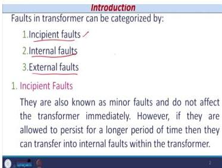
*Figure 26.1: Construction of a Buchholz relay showing the upper and lower floats with their respective mercury switches.*

**Operating Principle:**

When an incipient fault occurs, the heat decomposes the oil, creating gas bubbles. These bubbles rise and collect in the relay housing, causing the oil level to fall. The rate of gas generation depends on the severity of the fault:

- **Slow gas generation** (minor fault): The oil level falls slowly, and only the upper float is affected.
- **Rapid gas generation** (severe fault): The oil level falls suddenly, or the oil surges towards the conservator, affecting both floats.

| Float | Circuit | Function |
| :--- | :--- | :--- |
| **Upper Float** | Alarm | Indicates a minor fault (slow gas generation). Operator must investigate. |
| **Lower Float** | Trip | Initiates circuit breaker trip (rapid gas generation or oil surge). |

**Operating Sequence:**

1. **Minor Fault (Slow Gas Formation):** Gas bubbles collect, oil level drops slowly. The upper float loses buoyancy, tilts, and actuates its mercury switch, closing the **alarm circuit**. The operator is alerted to investigate the cause of the gas generation. The transformer can continue to operate temporarily, but the operator must take corrective action.

2. **Severe Fault (Rapid Gas Formation):** A violent fault causes a surge of oil towards the conservator. The oil level drops suddenly, or the oil flow itself pushes the lower float. The lower float, which has a **baffle plate** to catch the oil surge, tilts and actuates its mercury switch, closing the **trip circuit**. This energizes the trip coil of the circuit breaker, isolating the transformer.

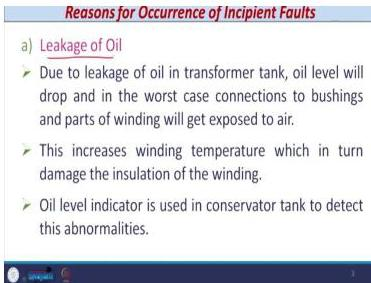
*Figure 26.2: Operating sequence of the Buchholz relay for minor (alarm) and major (trip) faults.*

The baffle plate on the lower float is a critical design feature. It provides a larger surface area for the oil surge to act upon, making the lower float more sensitive to rapid oil movement rather than just a slow drop in oil level. This ensures that the trip function responds to the violent conditions of a major fault, while the alarm function responds to the gradual conditions of a minor fault.

### 26.6 Drawbacks of the Buchholz Relay

1. **Mal-operation due to vibration:** Earthquakes or mechanical vibrations can cause the floats to move, leading to false alarms or trips. This is a particular concern in seismically active areas or in installations near heavy machinery.

2. **Slow operating time:** The operating time is about **0.1 second (100 ms)**, which is slow compared to other protection devices. While this is acceptable for incipient fault detection, it is too slow for internal electrical faults.

3. **Limited application:** It only protects against incipient (non-electrical) faults. It "cannot be used for the protection of transformer against the electrical fault or internal fault in the winding or core." The Buchholz relay is a mechanical device and cannot respond to the rapid current changes associated with electrical faults.

### 26.7 Internal Faults: Overcurrent Protection

For distribution transformers, where a differential relay is too expensive, overcurrent protection is used. The configuration typically includes:

- 3 line CTs (one per phase).
- 3 overcurrent relays (one per phase).
- 1 earth fault relay.

The operating principle is simple: if a short circuit occurs, the current exceeds the relay's pickup value, and the relay initiates a breaker trip. Overcurrent relays are also used as **back-up protection** for power transformers.

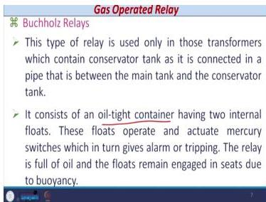
*Figure 26.3: Overcurrent protection scheme for a distribution transformer with CTs and relays on the delta side.*

The overcurrent protection scheme is simple and economical, making it suitable for distribution transformers where the cost of a differential relay would be disproportionate to the transformer's value. However, it has limitations:

- It cannot distinguish between internal faults and external faults that produce similar current magnitudes.
- It is slower than differential protection.
- It may not be sensitive enough to detect low-magnitude internal faults.

For these reasons, overcurrent protection is used as the primary protection for distribution transformers and as back-up protection for power transformers.

### 26.8 Restricted Earth Fault Protection (REF)

#### The Grounding Problem

For a Δ-Y power transformer, the HV side is typically Y-connected. The phase voltage is reduced to $1/\sqrt{3}$ of the line voltage. The neutral point must be grounded. If the neutral is isolated, a line-to-ground fault causes the healthy phase voltages to rise to full line voltage, increasing insulation requirements for the transformer and connected lines. Therefore, the neutral is **always solidly grounded** to limit voltage rise.

The grounding decision involves a trade-off:

| Grounding Method | Fault Current | Healthy Phase Voltage Rise | Insulation Requirement |
| :--- | :--- | :--- | :--- |
| Isolated neutral | Zero (no path) | Full line voltage | Maximum |
| High impedance grounding | Reduced | Up to 80% of line voltage | Moderate |
| Solid grounding | Very high | Contained | Minimum |

"To save the insulation requirement, this neutral, this star point of this HV side of the star delta transformer is always solidly grounded." The insulation requirement applies not only to the transformer HV winding but also to the "line insulators" on transmission lines emanating from the switchyard.

#### The Need for REF

The problem is that for a fault on the star side, the zero-sequence current flows in the star winding and the neutral, but it is **not reflected on the delta side**. A standard differential protection scheme with CTs on both sides will not see this zero-sequence current and will fail to detect an earth fault on the star side.

This is a fundamental limitation of differential protection for Δ-Y transformers. The delta winding provides a circulating path for the zero-sequence current, preventing it from appearing in the line currents on the delta side. Therefore, the differential relay sees no difference between the primary and secondary currents, even when a serious earth fault exists on the star side.

#### REF Scheme Configuration

The REF scheme is a restricted form of earth fault protection. It uses:

- 3 line CTs on the star side.
- 1 neutral CT.
- A relay connected between the common point of the line CT secondaries and the neutral CT secondary.
- A **stabilizing resistance ($R_S$)** in series with the relay coil to prevent operation during external faults.

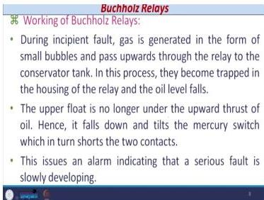
*Figure 26.4: Restricted Earth Fault (REF) protection scheme for a star-connected winding.*

The stabilizing resistance is critical for the scheme's stability. "Just to ensure that the relay should not operate in normal condition, or when there is no earth fault." During external faults, the CT secondary currents circulate in the pilot wires, and the stabilizing resistance limits the voltage across the relay, preventing mal-operation.

#### REF Scheme Operation

- **External Fault:** The fault current flows through the line CTs. The secondary currents from the line CTs and the neutral CT circulate in the pilot wires in opposite directions. The net current through the relay is zero, so the relay remains stable. "During an external fault, the fault current circulates in the pilot wires and no current flows through the relay."

- **Internal Fault:** The fault current flows only through the neutral CT (and not the line CTs). The secondary current from the neutral CT flows through the relay. If this current exceeds the pickup, the relay operates.

The REF scheme is "restricted" because it only protects the star winding of the transformer, not the entire transformer. It is a complement to, not a replacement for, the main differential protection.

### 26.9 Circulating Current Differential Protection

#### Basic Principle

Differential protection is based on Kirchhoff's Current Law. For a healthy transformer, the primary and secondary currents are related by the turns ratio. If CTs are chosen correctly, the secondary currents ($i_1$ and $i_2$) will be equal in magnitude and 180° out of phase. The relay measures the difference, $|i_1 - i_2|$.

- **Normal/External Fault:** $i_1 = i_2$, so the differential current is zero, and the relay does not operate.
- **Internal Fault:** The balance is disturbed ($i_1 \neq i_2$), and the differential current flows through the relay, causing it to operate.

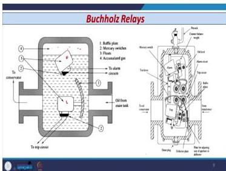
*Figure 26.5: Circulating current differential protection for a transformer winding.*

The differential protection is "widely used for the protection against the short circuit in case of power transformers" rated approximately **1 MVA** or above. The relay standard number is **87** (differential relay).

#### Why Differential Current is Not Zero in Practice (Spill Current)

In practice, the differential current is never exactly zero due to:

1. **CT Polarity:** If polarity is wrong, the relay sees the sum of currents ($i_1 + i_2$) instead of the difference, causing mal-operation. "Polarity of the CT, that is very important."

2. **Unequal Lead Lengths:** The CTs are in the switchyard, and the relay is in the control room. The pilot wires have different lengths, so the voltage drops are unequal, creating a small differential current. The relay should be at an **equipotential point** — voltage drops on both sides should be equal. "These 2 lead length are not equal. So, voltage drops are not equal, hence this i₁ − i₂ current that flows through the relay that is not practically 0."

3. **Non-identical CT Saturation:** Even CTs from the same manufacturer have slightly different saturation characteristics, so their secondary currents are not perfectly matched. "Even if primary currents I₁ and I₂ are equal, secondary currents i₁ and i₂ are not equal."

This non-zero current is called the **spill current**. It is not a fault current, but it flows through the relay. Its value is high during external faults. The spill current cannot be avoided, which is why we need **biased differential protection** (Lecture 27).

**Definition:** "Whenever in practical condition whatever current flows through the relay when there is no internal fault in normal or external fault condition that is known as the spill current."

### 26.10 Lecture 26 Recap

- Transformer faults are classified as incipient, internal, or external.
- Incipient faults are detected by the Buchholz relay (alarm for minor, trip for major).
- The Buchholz relay is slow and cannot detect electrical faults.
- Distribution transformers use overcurrent protection; power transformers use differential protection.
- REF protection is essential for detecting earth faults on the star side of a Δ-Y transformer.
- Circulating current differential protection suffers from spill current due to CT mismatch and unequal lead lengths.

---

## Lecture 27: Protection of Transformers-II

### 27.1 Physical Intuition: The Need for Biased Protection

The spill current from a simple differential relay is a nuisance. It can cause the relay to mal-operate during external faults or normal load conditions. The solution is not to increase the pickup setting (which would reduce sensitivity to internal faults) but to make the relay less sensitive as the through-current increases. This is the principle of **biased or percentage differential protection**.

The key insight is that the spill current is proportional to the through-current. During an external fault, both the spill current and the through-current are high. If the relay's sensitivity is reduced as the through-current increases, the relay will remain stable for external faults while maintaining high sensitivity for internal faults (where the differential current is high but the through-current may be low).

### 27.2 Biased or Percentage Differential Protection

#### Construction

The biased differential relay has two coils:

1. **Operating Coil:** Connected at the midpoint of the restraining coil. The current through it is the differential current, $|i_1 - i_2|$.
2. **Restraining Coil:** Has $N$ turns. The current $i_1$ flows through half the turns, and $i_2$ flows through the other half. The net restraining current is the average, $(i_1 + i_2)/2$.

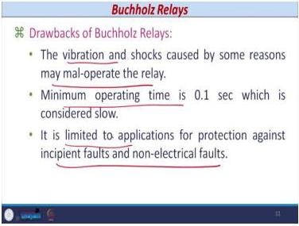
*Figure 27.1: Construction of a biased differential relay showing the operating coil at the midpoint of the restraining coil.*

The restraining coil produces a magnetic flux that opposes the flux produced by the operating coil. The relay operates only when the operating force exceeds the restraining force. By connecting the operating coil at the midpoint of the restraining coil, the relay responds to the difference between the two currents while being restrained by their average.

#### Relay Settings

1. **Basic Setting (Sensitivity):** This is the minimum differential current $(i_1 - i_2)$ required for operation. It determines the relay's sensitivity to internal faults.

2. **Bias Setting (Slope):** This is the percentage ratio of the differential current to the average restraining current.
    $$ \text{Bias Setting} = \frac{(i_1 - i_2)}{(i_1 + i_2)/2} \times 100\% $$

The bias setting determines the slope of the relay characteristic. A higher bias setting makes the relay less sensitive to differential current when the through-current is high, improving stability during external faults.

#### Operating Criteria

The relay operates only if **both** conditions are met:

1. The differential current $(i_1 - i_2)$ exceeds the basic setting.
2. The pick-up ratio $\frac{(i_1 - i_2)}{(i_1 + i_2)/2}$ exceeds the pre-set % bias.

"If the pick-up ratio (i₁−i₂)/((i₁+i₂)/2) is more than pre-set % bias and if the current (i₁−i₂) exceeds basic setting, the relay operate."

#### Why it Solves the Spill Current Problem

During an external fault, the spill current $(i_1 - i_2)$ is high. However, the average restraining current $(i_1 + i_2)/2$ is also very high. This keeps the pick-up ratio below the bias setting, making the relay stable.

"In case of external faults, there can be high spill current (i₁−i₂). But (i₁+i₂)/2 will also be high reducing the pick-up ratio below the bias setting, making the relay stable."

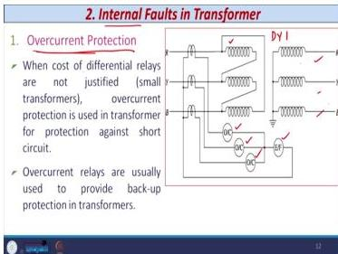
*Figure 27.2: Operating characteristic of a biased differential relay. The region above the characteristic is the operating region, and below is the blocking region.*

The relay characteristic is plotted with the differential current on the Y-axis and the bias current on the X-axis. The operating region is above the characteristic, and the blocking region is below. The spill current point falls in the blocking region because the restraining current increases, keeping the relay stable.

### 27.3 Factors to Consider for Transformer Protection

#### (a) Line CT Primary Rating

The CTs on the primary and secondary sides have different primary ratings due to the different voltage and current levels. The secondary currents are standardized (1 A or 5 A). A CT with a rating equal to or greater than the rated current is chosen. This leads to a mismatch in the secondary currents, which the differential relay must tolerate.

**Example:** For a 100 MVA, 220 kV/132 kV, Δ-Y transformer:
- CT ratio on 220 kV side: 300/1 A
- CT ratio on 132 kV side: 450/1 A

**Secondary Rating Rule:**
- If primary current > 1,000 A: secondary rating is 5 A.
- If primary current < 1,000 A: secondary rating is 1 A.

The CT selection rule is: "A CT with either the rated current or more than that is chosen." Due to different CT ratios, there is a **mismatch in secondary currents**. "In the differential protection scheme, this mismatch is to be taken care of and the relay should not operate for this unbalanced current."

#### (b) No Load Current

The primary current is given by:
$$ \overline{I_P} = K \times \overline{I_S} + \overline{I_0} $$

Where $I_0$ is the no-load current (1-2% of rated current). This component creates a small spill current, which the basic setting of the relay can handle.

"CT ratios are selected based on nominal transformation ratio hence some spill current will always flow through the relay because of no load current component." The no-load current contains both a magnetizing component and a loss component. "The basic setting of the relay can take care of this component."

#### (c) Inherent Phase Shift

In a Δ-Y transformer, the line currents on the secondary side are shifted by ±30° relative to the primary side. For a DY-1 connection, the secondary line current **leads** the primary line current by 30°. For a DY-11 connection, it **lags** by 30°.

Only **DY-1** or **DY-11** vector groups are used in practice. DY-7 and DY-5 are not used.

For differential protection to work, the CT secondary currents must be equal in magnitude and phase. To compensate for this phase shift:

- **CTs on the star side of the transformer are connected in delta.**
- **CTs on the delta side of the transformer are connected in star.**

This connection also eliminates the zero-sequence current on the star side. "Moreover, this will eliminate the zero-sequence current on the star side while the zero sequence component on the delta side will not produce current outside the delta."

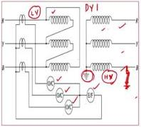
*Figure 27.3: CT connections for phase shift compensation in a DY-1 transformer.*

For a star/star transformer, "the CTs on both sides would need to be connected in delta." However, star/star vector groups are normally not used.

#### (d) Bias to Cover Tap Changing and CT Mismatch

Tap-changing transformers are common. CTs are chosen based on the nominal (central) tap. Operation on any other tap results in a CT secondary current mismatch. This mismatch adds to the spill current.

"In most of the cases, tap changing transformers are used." CTs are chosen based on a **fixed tap (nominal tap)** — normally the **central tap**. "Transformer operation on any tap other than this will result in mismatch of CT secondary current."

- **Option 1:** Use a bias differential relay with settings based on the worst-case tap. This reduces sensitivity for other taps. "For other conditions, the sensitivity or the operation of the relay that is affected, reduces the sensitivity."

- **Option 2:** Use adaptive settings that change based on the tap position. "We need to change the biased, percentage biased adaptively based on the change in the tappings of the transformer."

If the tap-change mismatch is small, the bias setting can handle it. If it is large, adaptive settings are required.

#### (e) Interposing Current Transformers (ICTs)

When the CT secondary currents are not equal (e.g., 4.582 A and 0.6561 A), an ICT is used to match them. ICTs are connected on the secondary side of the main CTs and compensate for both magnitude and phase shift.

"Interposing CTs are used to match the relay currents under through-load conditions corresponding to the ratings of the transformer." They compensate magnitude and phase shift at lower voltage/current levels.

"For a tap changing transformer, this is achieved corresponding to the nominal tap. For any other tap position, the bias can take care of CT mismatch."

#### (f) Magnetising Inrush

Magnetizing inrush is a large transient current drawn when a transformer is energized. It is not a fault. Its magnitude can be **5 to 12 times** the full load current.

"Magnetizing inrush is a condition when the transformer draws a very large current from the supply while the load current is either zero or of nominal magnitude." It occurs when energizing unloaded or lightly loaded transformers. "This Inrush current is not a fault."

- **Switching at voltage peak:** Flux is symmetrical, and the inrush current is normal. The B-H curve operates in the linear region, and "the magnitude of magnetizing inrush current is restricted to a normal value."

- **Switching at voltage zero:** Flux is asymmetrical, driving the core into saturation. The current becomes very high (10-12 times full load). "In order to produce the same amount of flux, the magnitude of current becomes very high."

**Harmonic Content of Inrush:**

| Harmonic Component | Percentage of Fundamental |
| :--- | :--- |
| DC | 55% |
| 2nd Harmonic | 63% |
| 3rd Harmonic | 26.8% |

**Detection Method:** The second harmonic component is monitored. If it exceeds a threshold (e.g., 20%), the relay is blocked, indicating an inrush condition, not a fault. "If second harmonic component exceeds say 20% then the operation of the relay is blocked, indicating that it is an Inrush phenomena it is not a fault."

**Techniques:**
1. Harmonic restraint
2. Harmonic blocking
3. DC biasing
4. Wave-shape monitoring

The factors that determine the inrush nature and magnitude are "the direction and magnitude of the residual magnetization flux in the core and switching instant."

### 27.4 Worked Example: Differential Protection Design

**Problem Statement:** Design a biased differential protection scheme for a 250 MVA, 15.75 kV/440 kV, DY-11 power transformer. Tap changer: -5% to +7.5% on HV side. Reactance: 14.59%. CT ratio error: ±3%.

**Relay Specifications:**
- Fixed sensitivity: 15% of 5 A.
- Bias settings: 10%, 20%, 30%.
- Instantaneous high-set: 10 times rated current.
- 2nd harmonic restraint: 15%.

**Step 1: Full Load Current on LV (Primary) Side**
$$ I_{LV} = \frac{250 \times 10^6}{\sqrt{3} \times 15.75 \times 10^3} = 9164 \, \text{A} $$

**CT Selection:** 10,000/5 A (since current > 1,000 A).

**Secondary Current:** $i_{LV} = 9164 \times (5/10000) = 4.582 \, \text{A}$

**Step 2: Full Load Current on HV (Secondary) Side**
$$ I_{HV} = \frac{250 \times 10^6}{\sqrt{3} \times 440 \times 10^3} = 328.04 \, \text{A} $$

**CT Selection:** 500/1 A (since current < 1,000 A). Note: 350 A, 400 A, or 450 A also possible (standard CTs in multiples of 50). 500 A is chosen deliberately for future load growth.

**Secondary Current:** $i_{HV} = 328.04 \times (1/500) = 0.6561 \, \text{A}$

**Observation:** The secondary currents (4.582 A and 0.6561 A) are not equal. An ICT is required.

**Step 3: ICT Ratio Calculation**

The ICT secondary (delta side) current must be equal to the LV side current (4.582 A). The current in the delta winding of the ICT is:
$$ i_{ICT,sec} = \frac{4.582}{\sqrt{3}} = 2.645 \, \text{A} $$

**ICT Ratio:**
$$ \frac{0.6561}{2.645} = 1:4.1 $$

**Step 4: Fault Current Calculations**

At the highest tap (+7.5%), the turns ratio is:
$$ \text{Turns Ratio} = \frac{440 \times 1.075}{15.75} = 30.03 $$

**Secondary-side fault current (3-phase):**
$$ I_{sf} = \frac{328.04}{0.1459} = 2248.39 \, \text{A} $$

**Primary-side fault current:**
$$ I_{pf} = 2248.39 \times 30.03 = 67.52 \, \text{kA} $$

**CT Secondary Fault Currents:**
- Primary side (10,000/5): $i_{pf} = 67.52 \times 10^3 \times (5/10000) = 33.76 \, \text{A}$
- Secondary side (500/1): $i_{sf} = 2248.39 \times (1/500) = 4.4968 \, \text{A}$

**Step 5: CT Ratio Error Consideration (Worst Case)**

Assume +3% error on primary side, -3% on secondary side.
- $i_{pf} = 33.76 \times 1.03 = 34.77 \, \text{A}$
- $i_{sf} = 4.4968 \times 0.97 = 4.3619 \, \text{A}$

**Step 6: ICT Effect on Secondary Side Current**

Through the ICT (ratio 4.1):
$$ i_{sf1} = 4.3619 \times 4.1 = 17.88 \, \text{A} $$

With -3% ICT error:
$$ i_{sf1} = 17.88 \times 0.97 = 17.35 \, \text{A} $$

After delta connection (×√3):
$$ i_{sf2} = \sqrt{3} \times 17.35 = 30.05 \, \text{A} $$

**Step 7: Differential Current and Percentage Bias**

**Differential Current:**
$$ I_{diff} = 34.77 - 30.05 = 4.72 \, \text{A} $$

**Percentage Bias:**
$$ \text{Bias} = \frac{4.72}{(34.77 + 30.05)/2} \times 100 = 14.56\% $$

**Step 8: Setting Selection**

- The calculated bias is 14.56%. We can select the 20% bias setting to provide a safety margin for CT saturation and mismatch. "Considering the CT saturation and mismatch, I can go for the higher setting that is 20%."
- The differential current (4.72 A) exceeds the sensitivity setting (15% of 5 A = 0.75 A).
- **Conclusion:** The relay with a 20% bias setting will operate correctly for internal faults while remaining stable for external faults.

### 27.5 Lecture 27 Recap

- Biased differential protection uses a restraining coil to prevent mal-operation due to spill current.
- The relay operates only if both the basic setting and the bias setting are exceeded.
- CT connections must compensate for the inherent phase shift in Δ-Y transformers.
- Magnetizing inrush is a transient phenomenon detected and blocked by second harmonic restraint.
- A complete design example involves calculating CT ratios, ICT ratios, and verifying relay settings.

---

## Lecture 28: Protection of Generators-I

### 28.1 Physical Intuition: The Heart of the Power System

The generator is "the heart of electrical power system" because it converts mechanical energy into electrical equivalent. Power is transmitted and distributed to residential, commercial, and industrial consumers. Generator capacity ranges from a few MW to **500 or 1000 MW**. "If any of the single unit that is going to be lost than that can lead to the instability of the power system network."

The generator is a **very expensive device**, and its loss can lead to system instability. The protection objective is to "minimize the outage time by rapid clearance or rapid detection of fault." A modern generator unit includes the stator, rotor, prime mover, and associated systems, all of which must be protected.

The modern generator unit comprises:

1. **Stator winding** and associated transformer
2. **Rotor winding** along with the excitation system (field winding)
3. **Prime mover** along with associated accessories

"Whenever we consider the protection of generator, we need to consider all this equipment along with the generator also, because if failure of any of the equipment that is going to affect the generator itself."

### 28.2 Types of Generator Protection

Large generators require approximately 13-14 types of protection. Key ones include:

1. **Differential Protection (87):** For phase-to-phase faults in the stator winding. "Meant for the instantaneous operation in case of short circuit or fault inside the winding of the generator."
2. **Stator Earth Fault Protection:** For insulation failure between the conductor and core.
3. **Rotor Earth Fault Protection:** For earth faults in the rotor circuit. "If there is a earth fault in the rotor first earth fault there is no problem, but whenever there is a second earth fault, then the circulating current flows and that is also going to damage."
4. **Field Winding Protection:** For failure of the excitation system.
5. **Turn-to-Turn Fault Protection:** For shorted turns in the same phase. Differential protection cannot detect few turns shorted in a phase because "the current entering and current leaving that remains same."
6. **Out-of-Step Protection:** For loss of synchronism.
7. **Loss of Excitation Protection:** For failure of the field.
8. **Reverse Power Protection (32):** For prime mover failure.
9. **Negative Phase Sequence Protection (46):** For unbalanced currents.

### 28.3 Differential Protection for Generators

Differential protection is the primary protection for stator phase faults. It is applied to generators rated **more than 1 MVA**. It operates in about one cycle or less.

The protection covers phase-to-phase faults between windings. Earth faults are covered by **separate earth fault protection** (particularly for large generators).

### 28.4 Circulating Current/Mertz-Price Differential Protection

This is the classic differential protection scheme applied to generator stators.

- CT₁ is on the neutral side, and CT₂ is on the terminal side.
- The relay is connected between the CT secondaries.
- In a healthy condition, $i_1 = i_2$, and no current flows through the relay.
- During an internal fault, $i_1 \neq i_2$, and the differential current flows through the relay, causing it to operate.

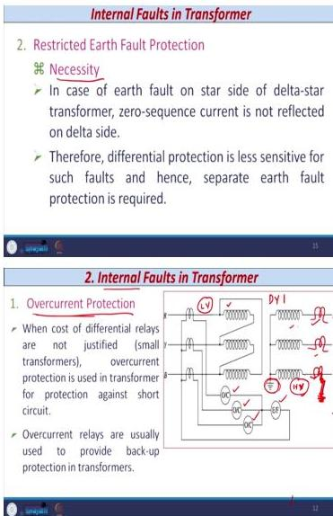
*Figure 28.1: Mertz-Price circulating current differential protection for a generator stator.*

The operating principle is based on the fact that "current entering and current leaving should be same" — I₁ = I₂. In ideal condition, i₁ = i₂, and the current through the operating coil is |i₁ − i₂| = 0. During an internal fault, there is a significant difference between i₁ and i₂, and the relay operates if the differential current exceeds the pickup value.

**Spill Current:** As with transformers, spill current flows due to non-identical CT saturation characteristics and unequal pilot wire lengths. "If the CTs are identical in nature, then the functioning of the differential relay is straightforward. However, in practice, it is impossible to achieve CTs with identical saturation characteristic. Hence, the secondary currents of CTs are unequal even though the primary currents are the same."

The relay setting must be greater than the spill current value so the relay does not operate in normal conditions. "Spill current that always flows through the relay."

### 28.5 High Impedance Differential Protection

To prevent mal-operation due to spill current, a **stabilizing resistance ($R_{ST}$)** is connected in series with the relay coil.

**External Fault Behavior:**

During a severe external fault, the CT near the fault (CT₂) saturates, while the other (CT₁) remains healthy. The saturated CT acts as a short circuit, and the healthy CT acts as a current source. The fault current flows through the saturated CT's secondary resistance and the lead resistance, creating a voltage across the relay circuit.

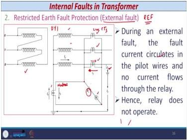
*Figure 28.2: High impedance differential protection scheme with stabilizing resistance.*

**Key Equations:**

The voltage across the relay circuit is:
$$ V_R = I_f \times (R_{CT} + R_L) $$

The relay current is:
$$ I_R = \frac{V_R}{R_R + R_{ST}} $$

Where:
- $V_R$ = Voltage across relay (V)
- $I_f$ = Fault current in CT secondary (A)
- $R_{CT}$ = CT secondary resistance (Ω)
- $R_L$ = Lead resistance (Ω)
- $R_R$ = Relay coil resistance (Ω)
- $R_{ST}$ = Stabilizing resistance (Ω)

**Physical Insight:** Increasing $R_{ST}$ reduces the relay current $I_R$, preventing operation during external faults. However, it also reduces the sensitivity during internal faults. "Incorporation of stabilizing resistance reduces the sensitivity of the relay during an internal fault."

**Knee Point Voltage (KPV):**

The CT must operate in its linear region. The condition for stability is:
$$ V_K \geq 2V_R $$

Where $V_K$ is the knee point voltage of the CT. "KPV of a CT decides the working range of the CT — whether it operates in the linear region or enters saturation." If the CT can withstand twice the relay voltage, it operates in the linear region; otherwise it enters saturation.

**Stabilizing Resistance Calculation:**

$$ R_{ST} = \frac{V_R}{I_S} - R_R $$

Where $I_S$ is the relay setting current.

**Practical Rule:** In the field, only **one-third** of the calculated value of $R_{ST}$ is connected in series with the relay.

### 28.6 Worked Example: High Impedance Differential Protection

**Given Data:**
- Generator: 200 MW, 13.8 kV, 0.9 pf, 50 Hz, star-connected.
- CT ratio: 10,000/5 A.
- CT secondary resistance: 1.5 Ω.
- Lead resistance (total): 0.3 Ω.
- Relay rated current: 5 A.
- Relay setting range: 5-20% of rated current.
- Relay burden: 1 VA.
- Through-fault current: 12 times full load current.

**Step 1: Full Load Current**
$$ I_{fl} = \frac{200 \times 10^6}{\sqrt{3} \times 13.8 \times 0.9 \times 10^3} = 9297 \, \text{A} $$

**Step 2: Fault Current**
$$ I_F = 12 \times 9297 = 111564 \, \text{A} $$

**Step 3: Fault Current on CT Secondary**
$$ i_f = \frac{111564 \times 5}{10000} = 55.78 \, \text{A} $$

**Step 4: Relay Setting Selection**

Select 10% of 5 A:
$$ I_s = 0.5 \, \text{A} $$

**Step 5: Relay Resistance**
$$ R_R = \frac{\text{Relay Burden}}{(I_s)^2} = \frac{1}{(0.5)^2} = 4 \, \Omega $$

**Step 6: Voltage Across Relay**
$$ V_R = i_f (R_{CT} + R_L) = 55.78 (1.5 + 0.3) = 100.4 \, \text{V} $$

**Step 7: Stabilizing Resistance**
$$ R_{ST} = \frac{V_R}{I_S} - R_R = \frac{100.4}{0.5} - 4 = 196.8 \, \Omega $$

**Practical Value:** One-third of calculated value:
$$ \frac{196.8}{3} \approx 65.6 \, \Omega \approx 66 \, \Omega $$

**Step 8: Knee Point Voltage**
$$ V_K \geq 2 \times V_R = 200.8 \, \text{V} $$

**Recommendation:** With a safety margin, KPV should not be less than 250 V.

### 28.7 Biased Differential Protection for Generators

The main drawback of the high-impedance scheme is reduced sensitivity. The biased differential protection scheme minimizes this effect. It uses an operating coil connected at the midpoint of a restraining coil, similar to the transformer protection scheme.

**Settings:**

- **Basic Setting (Slope 1):** Usually 5-10% of rated current.
- **Bias Setting (Slope 2):** Set at 120% of rated current, with a slope of about 30%.
- **Slope 3 (Digital Relays):** Set to about 70% to account for CT mismatch.

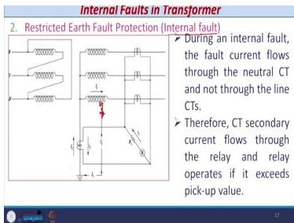
*Figure 28.3: Operating characteristic of a biased differential relay showing multiple slope regions.*

The characteristic has three distinct slope regions:

| Slope Region | Setting | Purpose |
| :--- | :--- | :--- |
| Slope 1 | 5-10% of rated current | Basic sensitivity for low through-currents |
| Slope 2 | 30% at 120% of rated current | Stability during moderate through-faults |
| Slope 3 | ~70% | Stability during severe CT mismatch |

### 28.8 Worked Example: Biased Differential Protection

**Given:**
- CT₁ ratio: 400/1 A.
- CT₂ ratio: 400/1 A.
- Relay pickup: 0.05 A.
- Slope setting: 10%.
- Fault currents: $I_1 = 400$ A, $I_2 = 375$ A.

**Case 1: Circuit Breaker CLOSED**

Secondary currents:
$$ i_1 = 1 \, \text{A}, \quad i_2 = 0.9375 \, \text{A} $$

Operating current: $i_1 - i_2 = 0.0625 \, \text{A}$

Restraining current: $\frac{i_1 + i_2}{2} = 0.96875 \, \text{A}$

**Check Conditions:**
1. $0.0625 \, \text{A} > 0.05 \, \text{A}$ ✓ (satisfied)
2. $\frac{0.0625}{0.96875} = 0.0645 < 0.1$ ✗ (not satisfied)

**Result: Relay does NOT operate.**

The differential current exceeds the basic setting, but the pick-up ratio (6.45%) is below the bias setting (10%). The relay remains stable.

**Case 2: Circuit Breaker OPEN**

With CB open, $i_2 = 0$, $i_1 = 1$ A.

Operating current: $i_1 - i_2 = 1 \, \text{A}$

Restraining current: $\frac{1 + 0}{2} = 0.5 \, \text{A}$

**Check Conditions:**
1. $1 \, \text{A} > 0.05 \, \text{A}$ ✓ (satisfied)
2. $\frac{1}{0.5} = 2 = 200\% > 10\%$ ✓ (satisfied)

**Result: Relay operates.**

With the circuit breaker open, the full current flows through CT₁ while CT₂ sees zero current. The differential current is 1 A, and the pick-up ratio is 200%, far exceeding the 10% bias setting. The relay operates correctly.

### 28.9 Lecture 28 Recap

- Generators require many types of protection due to their cost and criticality.
- Mertz-Price differential protection is the primary protection for stator phase faults.
- High-impedance differential protection uses a stabilizing resistance to prevent mal-operation during external faults.
- The stabilizing resistance reduces sensitivity, which is a key trade-off.
- Knee point voltage must be at least twice the relay voltage for stability.
- Biased differential protection offers a better sensitivity/stability trade-off.

---

## Lecture 29: Protection of Generators-II

### 29.1 Physical Intuition: Protecting the Prime Mover and Stator

This lecture covers two critical aspects of generator protection: protecting the prime mover from damage when it fails, and protecting the stator from the most common type of fault—earth faults.

The prime mover is the mechanical source that drives the generator. If it fails, the generator continues to be connected to the grid and acts as a motor, driving the failed prime mover. This motoring condition can cause severe damage to the prime mover, depending on its type. The stator earth fault is the most common type of generator fault, caused by insulation failure between the conductor and the core.

### 29.2 Reverse Power Protection

#### The Problem

When the prime mover (turbine) fails, the synchronous generator continues to be connected to the grid. It acts as a synchronous motor, drawing power from the bus to drive the turbine. This motoring condition can severely damage the turbine.

| Turbine Type | Damage Mechanism |
| :--- | :--- |
| **Steam** | Trapped steam on blades causes overheating and de-tempering. |
| **Hydro** | Reduced water flow causes cavitation, damaging blades. |
| **Diesel** | Unburned fuel presents a fire or explosion hazard. |
| **Gas** | Fire hazard in the gas turbine. |

For a steam turbine, the trapped steam on the turbine blades causes overheating due to turbulence. This can de-temper the blades, reducing their mechanical strength. For a hydro turbine, the reduced water flow causes cavitation, which creates excessive force on the turbine blades. For diesel and gas turbines, the unburned fuel presents a fire or explosion hazard.

#### The Protection Scheme

A **reverse power relay (32)** is used. It is a directional relay with current and voltage coils. It detects when power flows from the bus to the generator.

The relay is a low forward power relay (directional relay) with two coils — current coil and voltage coil. It uses leading maximum torque angle because when the generator acts as a motor, it behaves as an over-excited synchronous machine.

**Why is it Time-Delayed?**

1. Overheating of turbine blades is not instantaneous. The damage takes time to develop, so an instantaneous trip is not necessary.
2. During an internal fault, the differential protection trips instantaneously. If the reverse power relay also trips instantaneously, operators will be confused about the cause of the trip.
3. It prevents undesired tripping during transient power reversals.

**Scheme Configuration:**

- Three relays are connected in R, Y, B phases.
- The relay operates when power reduces to 0.5-3% of rated power.
- The control circuit uses an auxiliary relay (32GX) and a timer to provide the time delay.

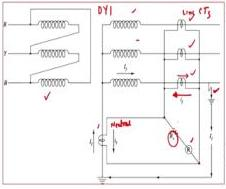
*Figure 29.1: Reverse power protection scheme with control circuit.*

**Operating Sequence:**

1. **Normal Condition:** Power is normal, relay 32 is energized, auxiliary relay 32GX is energized, contact 32GX-1 is open. No trip.

2. **Reverse Power Condition:** Relay 32 drops off, 32GX de-energizes, contact 32GX-1 closes, timer coil is energized. After the timer elapses, the timer contact closes, and the tripping command is issued.

### 29.3 Stator Earth Fault Protection

#### The Problem

Stator earth faults are caused by insulation failure between the conductor and the core. The arc temperature depends on the fault current magnitude. High fault current damages the stator core laminations, leading to increased eddy current losses and extensive damage. A fault near the terminal is more destructive than one near the neutral.

The physical mechanism is as follows:

- The conductor is at high potential, and the core is earthed.
- Breakdown of insulation causes an arc between the conductor and the core.
- The arc temperature depends on the fault current magnitude.
- High fault current leads to high arc temperature, which damages the laminations.
- Damaged laminations lead to increased eddy current losses, damaging a large portion of the stator core.
- Repair may take one month or longer, leading to loss of revenue.

The location of the fault is critical:

| Fault Location | Damage Severity |
| :--- | :--- |
| Near neutral | Moderate destruction |
| Near terminal | Very high destruction, possibly irreparable |

#### Limiting Earth Fault Current

To limit the damage, the neutral is grounded through a resistance or impedance. The resistor value is given by:

$$ R_n = \frac{10^6}{6\pi fC} $$

Where:
- $R_n$ = Neutral grounding resistance (Ω)
- $f$ = System frequency (Hz)
- $C$ = Capacitance of generator stator circuit to earth per phase (F)

**Worked Calculation (15.75 kV generator, C = 0.25 μF):**
$$ R_n = \frac{10^6}{6\pi \times 50 \times 0.25 \times 10^{-6}} = 4246 \, \Omega $$

**Resulting Fault Current:**
$$ I_F = \frac{15.75 \times 10^3}{\sqrt{3} \times 4246} = 2.14 \, \text{A} $$

The fault current is limited to about 2 A, which is small enough to prevent significant core damage.

#### Neutral Grounding Transformer (NGT)

A direct resistor connection for a high-voltage generator is impractical because the resistor must be rated for the full line voltage. For the 15.75 kV generator with $R_n = 4246 \, \Omega$, the neutral potential becomes:

$$ 4246 \times 2.14 = 9 \, kV $$

The peak value is $9 \times \sqrt{2} \approx 12.85 \, kV$. The resistor voltage rating must be at least the line voltage of the generator — very costly.

An NGT is used to step down the voltage and allow a low-voltage, low-resistance resistor.

- NGT primary rating: at least 1.5 times the generator phase voltage.
- NGT secondary voltage: kept low (e.g., 240 V).
- The resistor value is reduced by the square of the turns ratio:

$$ R_{secondary} = R_{primary} \times \left(\frac{V_{secondary}}{V_{primary}}\right)^2 $$

For the example:
$$ 4246 \times \left(\frac{240^2}{15750^2}\right) = 0.985 \, \Omega $$

Only about 0.9 Ω resistor is needed at 240 V rating, which is much more economical.

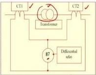
*Figure 29.2: Neutral grounding transformer (NGT) with a secondary resistor.*

**NGT kVA Rating:**

$$ kVA = \frac{10^3 V_G V_T}{\sqrt{3} N^2 R} $$

Where:
- $V_G$ = Phase-to-phase voltage of generator (kV)
- $V_T$ = High voltage rating of NGT (kV)
- $N$ = Turns ratio
- $R$ = Resistor connected across secondary (Ω)

### 29.4 Stator Earth Fault Protection Scheme

The scheme uses a relay connected to the secondary of the NGT or to a CT in the neutral. The fault current for a fault at a location P% from the neutral is:

$$ I_f = \frac{1000 \times V_G \times P}{\sqrt{3} \times Z_n \times 100} $$

Where:
- $V_G$ = Phase-to-phase voltage (kV)
- $P$ = Fault location (% from neutral end)
- $Z_n$ = Neutral impedance (Ω)

**Key Point:** Fault current is negligibly small for faults near the neutral. This means a portion of the winding near the neutral is unprotected.

**Percentage of Winding Unprotected:**

$$ P = \frac{Q P_{CT} \times \sqrt{3} \times Z_{n}}{1000 \times V_{G}} $$

Where:
- $Q$ = Relay pickup as percentage of CT rating
- $P_{CT}$ = CT primary rating (A)
- $Z_n$ = Neutral impedance (Ω)
- $V_G$ = Phase-to-phase voltage (kV)

The relay pickup is given by:
$$ I_{pu} = \left( \frac{Q P_{CT}}{100} \text{ primary} \right) A $$

### 29.5 Worked Example: Stator Earth Fault Protection

**Given:**
- Alternator: 11 kV, 3-phase, 30 MVA, star-connected.
- Earth-fault relay: 10% setting.
- Neutral resistance limits maximum earth-fault current to 40% of full load.
- CT ratio: 2000/1 A.

**Step 1: Full Load Current**
$$ I_{fl} = \frac{30 \times 10^6}{\sqrt{3} \times 11 \times 10^3} = 1574.6 \, \text{A} $$

**Step 2: Maximum Earth Fault Current**
$$ I_{fmax} = 0.40 \times 1574.6 = 629.8 \, \text{A} $$

**Step 3: Neutral Resistance**

Using $I_{fmax} = \frac{E_{ph}}{R_n}$ (neglecting sequence impedances compared to $Z_n$):
$$ R_n = \frac{11 \times 10^3}{\sqrt{3} \times 629.8} = 10.08 \, \Omega $$

**Step 4: Percentage of Winding Unprotected**

The fault current at P% from neutral is:
$$ I_f = \frac{1000 \times 11 \times P}{\sqrt{3} \times 10.08 \times 100} = P \times 6.3 $$

The relay pickup is 10% of 2000 A = 200 A.

Equating: $P \times 6.3 = 200 \Rightarrow P = 31.74\%$

**Interpretation:** 31.74% of the winding is unprotected from the neutral side; 68.26% is protected from the terminal side.

**Step 5: Resistor for 9.5% Unprotected Winding**
$$ I_f = \frac{11 \times 9.5 \times 10^3}{\sqrt{3} \times 100 \times R_n} = \frac{603.33}{R_n} $$

Equating to relay sensitivity (200 A):
$$ \frac{603.33}{R_n} = 200 \Rightarrow R_n = 3.016 \, \Omega $$

**Step 6: Maximum Fault Current for this Grounding**
$$ I_{fmax} = \frac{11 \times 10^3}{\sqrt{3} \times 3.016} = 2105.72 \, \text{A} = 133.73\% \text{ of full load current} $$

**Optimization Insight:** Lower $R_n$ gives better winding protection but higher fault current. Higher $R_n$ limits fault current but leaves more winding unprotected. A trade-off must be optimized.

| Neutral Resistance | % Winding Unprotected | Max Fault Current (% of FLC) |
| :--- | :--- | :--- |
| 10.08 Ω | 31.74% | 40% |
| 3.016 Ω | 9.5% | 133.73% |

### 29.6 Lecture 29 Recap

- Reverse power protection (32) is time-delayed to protect the prime mover and avoid confusion with differential protection.
- Stator earth faults are limited by grounding the neutral through a resistance.
- An NGT allows the use of a low-voltage, low-resistance grounding resistor.
- A portion of the stator winding near the neutral is always unprotected.
- There is a trade-off between fault current magnitude and the percentage of winding protected.

---

## Lecture 30: Protection of Induction Motors

### 30.1 Physical Intuition: The Workhorse of Industry

Induction motors are used extensively in industries and power plants for pumps, fans, and other auxiliary items. The loss of a motor leads to loss of production and revenue. The protection scheme depends on the motor's size, importance, and load.

Applications of large induction motors include:

- Water pumps
- Fans
- Auxiliary items in industries and power generating plants
- Industries: rubber, plastic
- Power plants: forced draft (FD) fans, induced draft (ID) fans, primary/secondary crusher house auxiliaries

The factors determining the protection scheme are:

1. Size of motor
2. Importance of motor
3. Load connected to motor

For small motors driving unimportant loads, fuses are adequate. For large motors (6.6 kV) in industries and power plants, sophisticated digital/numerical relay protection is required.

### 30.2 Faults and Abnormal Conditions

The primary cause of motor failure is **excessive heating**. A 10°C rise above the specified temperature can reduce the motor's life by ~50%.

The main causes of failure are:

- Electrical faults (insulation failure)
- Mechanical faults (mechanical failure)

| Fault/Abnormal Condition | Description |
| :--- | :--- |
| **Overloading** | Sustained current above rated value. |
| **Single Phasing** | One phase is not available. |
| **Phase Unbalance** | Unequal currents in the three phases. |
| **Phase Reversal** | Wrong phase sequence (e.g., RBY instead of RYB). |
| **Short Circuit** | Winding fault with large current. |
| **Earth Fault** | Fault between winding and core. |
| **Stalling/Locked Rotor** | Motor fails to start or runs at very low speed. |
| **Underload** | Sudden reduction of load. |

### 30.3 Thermal Overload Protection (49)

The thermal relay models the motor's thermal state. It must operate within the motor's thermal limit.

The thermal relay performs modeling/image modeling of the motor, accounting for all thermal processes (start, normal run, overload, standstill). Its basic function is to operate the motor within the prescribed temperature limit (thermal limit).

**Motor Thermal Limit Curves:**

The acceleration curves specify the current and associated time for the motor to accelerate from standstill to normal speed. Two curves are provided for large motors: at 100% rated voltage and at 80% rated voltage. Soft starters reduce inrush/starting current (5-6 times full load current — not a fault).

The motor thermal limit curves cover three running conditions:

1. Locked rotor or stall condition
2. Motor acceleration
3. Motor running overload

Curves should be provided for both hot and cold running conditions.

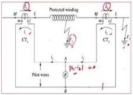
*Figure 30.1: Motor thermal limit curves for different operating conditions.*

| Curve | Condition |
| :--- | :--- |
| **A** | Cold running overload |
| **B** | Hot running overload |
| **C** | Acceleration curve at 80% of rated voltage |
| **D** | Acceleration curve at 100% of rated voltage |

The setting practice is to consider the acceleration curve at 80% of rated voltage.

**Coordination:**

- The thermal relay (49) characteristic must be **below** the motor thermal limit curve. If the relay curve is above the thermal limit curve, the insulation may burn before the relay operates. If the relay curve is too low, the motor cannot exploit its overload capability.
- The motor starting curve must be **below** the thermal relay (49) curve.
- The inverse time overcurrent relay (51) and instantaneous relay (50) are for short circuit protection.

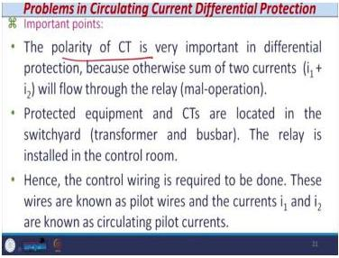
*Figure 30.2: Coordination of motor thermal limit, thermal relay, and overcurrent relay characteristics.*

### 30.4 Protection Against Unbalanced Currents (46)

Unbalanced currents produce a negative sequence current ($I_2$), which overheats the rotor. The heat produced by the negative sequence current is **6 times** the heat produced by the positive sequence current.

Causes of unbalanced currents:

1. Single phasing (disconnection of fuse or large motors)
2. Unbalanced fault conditions
3. Failure of circuit breakers

The motor draws very high current during single phasing, and the winding overheats, leading to insulation deterioration or damage. The negative sequence current ($I_2$) produced overheats and damages the rotor structure.

**Allowable Negative Sequence Current:**
$$ I_{2}^{2} \times t = 40 $$

Where:
- $I_2$ = Negative sequence current (per unit)
- $t$ = Time (seconds)

**Setting Basis:** The setting is based on the ratio of negative to positive sequence impedance ($Z_2/Z_1$).

For small motors, a phase unbalance relay is economically viable. The typical setting range for DMT/IDMT relays is $I_2 = 10–50\%$ in steps of 5%.

### 30.5 Protection Against Phase Reversal (47)

A phase reversal causes the motor to run in the opposite direction, which can damage loads. This is detected by measuring the negative sequence current.

The motor takes negative sequence current if the phase sequence changes, causing the motor to run in the opposite direction. Loads designed for a specific direction may be damaged.

### 30.6 Protection Against Phase Faults (87)

Large motors (beyond 1000 kW) use differential protection for stator winding short circuits.

CT placement: Three CTs within switchgear plus one CT in the neutral connection of the motor (minimizes burden and reduces error from long cable runs).

Small motors use overcurrent protection (IDMT or instantaneous relays) instead of differential relay (which is expensive).

**Pickup Setting Rule:** Set above the maximum starting current to avoid mal-operation during starting. If this is not possible, an interlock can block the relay during starting.

If the setting must be below the starting current, use an interlock that blocks the relay during motor starting. The limitation is that faults during starting cannot be detected.

**Modern Digital Relay Setting:** 400% to 2000% of rated current for instantaneous overcurrent relays.

### 30.7 Protection Against Stalling (Locked Rotor) (51)

When a motor stalls, the heat produced is 10-15 times the rated heat. The relay uses an $I^2t$ characteristic.

The motor can dissipate more heat during running than at standstill. If the motor fails to start after energization, the heat produced in the rotor and stator windings is 10-15 times the rated heat. The withstand capability is limited to a time period depending on the applied voltage and the $I^2t$ limit.

**Type 1 - Stalling at Starting:**

- Activated only during starting.
- Uses a speed signal.
- If the motor has not gained speed by the end of the time delay, a trip is issued.

The time delay $t_{start}$ is specified, and $t_{stall}$ is the stalling time specified by the manufacturer. On detection of start, the time delay for safe stalling begins. At the end of the time delay, the motor should have gained the required speed. If not, a locked rotor indication is given and a tripping command is issued.

**Type 2 - Stalling at Running:**

- Activated after the starting period.
- Detects overcurrent caused by stalling.
- Parameters: rotor stall current threshold ($I_{stall}$) and stalling rotor time ($t_{stall}$).

The relay detects overcurrent caused by stalling and issues a tripping command if the phase current exceeds $I_{stall}$.

**Stalling Relay Settings:**

- Current setting: 150% to 600% of relay rated current.
- Time setting: 6 to 60 seconds.
- Normal practice: $I_{stall}$ = one-third to one-fourth of starting current.
- Time setting: higher than acceleration time, lower than safe stalling time.

### 30.8 Loss of Load Protection

A sudden reduction of load (e.g., broken conveyor belt) requires tripping the motor. A definite minimum time delay relay is used.

Causes of sudden load reduction:

- Breakage of conveyor belt
- Prime failure of pump
- Shearing of drive pin

It is mandatory to trip the motor when the load is suddenly removed.

**Three Parameters:**

1. Undercurrent threshold.
2. Time associated with the threshold.
3. Inhibit start time delay.

The relay recognizes the difference between no-load before application of load and no-load after application of load.

### 30.9 Undervoltage Protection (27)

A voltage reduction below rated causes the current to increase, leading to insulation damage. The typical setting range is 70-100% of rated voltage.

When the voltage is reduced below rated, the current drawn increases beyond the rated/full load current, and the insulation is damaged by heating.

### 30.10 Complete Protection Scheme

A complete motor protection scheme includes:

- Three CTs for phase currents ($I_A, I_B, I_C$).
- A Core Balance CT (CBCT) for earth fault current.
- PTs for undervoltage protection.
- Temperature sensors (RTDs or thermistors).
- A digital relay with all protection functions.

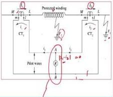
*Figure 30.3: Complete protection scheme for an induction motor.*

The scheme components include:

- Busbar with 3 phases (A, B, C)
- Circuit breaker
- Induction motor grounded through resistor or reactor
- Three CTs (one per phase) providing signals $I_A$, $I_B$, $I_C$
- Core balance current transformer (CBCT) for residual current measurement
- Four current signals available: 3-phase + 1 earth
- Temperature measurement signal from winding to digital relay (RTD or thermistors)
- PTs (potential transformers) for undervoltage protection

### 30.11 Worked Example: Relay Setting Calculation for Induction Motor

**Motor Data:**

| Parameter | Value |
| :--- | :--- |
| Rating | 2000 HP |
| Type | 3-phase, 50 Hz |
| Power factor | 0.85 |
| Rated voltage | 6.6 kV |
| Efficiency | 90% |
| Continuous overload capability | 110% of rated current |
| Starting current | 6 × rated value |
| Starting time at 100% voltage | 12 seconds |
| Starting time at 80% voltage | 16 seconds |
| Safe stalling time | 22 seconds |
| Safe stalling current | 1/3 of starting current |
| CT ratio | 200/1 A |
| Negative sequence impedance (Z₂) | 20% |
| Positive sequence impedance (Z₁) | 80% |

**Relay Setting Ranges:**

| Relay | Current Setting Range | Time Setting Range |
| :--- | :--- | :--- |
| Thermal relay (49) | 70% to 130% of 1 A, steps of 5% | — |
| Negative phase sequence relay (46) | 10% to 40% of 1 A | — |
| Instantaneous overcurrent relay (50) | 400% to 2000% of 1 A | — |
| Stalling relay (51) | 150% to 600% of 1 A, steps of 30% | 6 to 60 seconds |

**Step 1: Rated Full-Load Current**

$$ I_{R} = \frac{2000 \times 746}{6600 \times \sqrt{3} \times 0.85 \times 0.9} = 170.61 \, \text{A} $$

With 10% continuous overload capability:
$$ 170.61 \times 1.1 = 187.67 \, \text{A} $$

**Step 2: Thermal Relay (Overload) Setting**

The continuous overload current is the primary-side current. Convert to CT secondary:
$$ \frac{187.67}{200} \times 100\% = 93.83\% $$

**Selection Rule:** Choose the setting **below** this value.

**Selected Setting:** **90% of 1 A** (the next available setting just below 93.83%).

**Step 3: Instantaneous Overcurrent Relay Setting**

**Starting current at 80% rated voltage:**
$$ I_{\text{start}} = \frac{6 \times 170.61}{0.8} = 1279.56 \, \text{A} $$

**Convert to CT secondary:**
$$ \frac{1279.56}{200} = 6.39 \, \text{A} = 639\% \text{ of 1 A} $$

**Selection Rule:** Choose the next available setting **above** 639%.

**Selected Setting:** **650% of 1 A** (if steps of 50%) or **700% of 1 A** (if steps of 100%).

**Step 4: Negative Phase Sequence Relay Setting**

**Calculation:**
$$ \frac{Z_2}{Z_1} = \frac{0.2}{0.8} = 0.25 = 25\% $$

**Selection Rule:** The setting must be **greater than** 25% of 1 A.

**Selected Setting:** **30% of 1 A**

**Step 5: Stalling Relay Setting**

**Stalling current:**
$$ I_{\text{stall}} = \frac{I_{\text{start}}}{3} = \frac{1279.5}{3} = 426.5 \, \text{A} $$

**Convert to CT secondary:**
$$ \frac{426.5}{200} = 2.13 \, \text{A} = 213\% \text{ of 1 A} $$

**Selection Rule:** Choose the setting **just below** 213%.

**Selected Current Setting:** **210% of 1 A**

**Time Setting Selection:**

- Must be **higher than** the acceleration time (12 s at 100% voltage).
- Must be **lower than** the safe stalling time (22 s).

**Selected Time Setting:** **15 seconds**

**Summary of Relay Settings:**

| Relay | Current Setting | Time Setting |
| :--- | :--- | :--- |
| Thermal overload relay | 90% of 1 A | — |
| Instantaneous overcurrent relay | 650% or 700% of 1 A | — |
| Negative phase sequence relay | 30% of 1 A | — |
| Stalling relay | 210% of 1 A | 15 seconds |

### 30.12 Lecture 30 Recap

- Motor protection is primarily about preventing excessive heating.
- Thermal relays (49) must be coordinated with motor thermal limits.
- Negative sequence relays (46) protect against unbalanced currents and phase reversal.
- Instantaneous overcurrent relays (50) must be set above the starting current.
- Stalling relays (51) have current and time settings that must be carefully selected.
- A complete relay setting calculation involves converting primary currents to CT secondary values and selecting the appropriate settings from available ranges.

---

## Summary of Relay Numbers Used

| Relay Number | Function |
| :--- | :--- |
| 49 | Thermal overload protection |
| 46 | Negative phase sequence / unbalance protection |
| 47 | Phase reversal protection |
| 87 | Phase fault (differential) protection |
| 51 | Stalling/locked rotor protection; also inverse time overcurrent |
| 50 | Instantaneous overcurrent |
| 27 | Undervoltage protection |
| 32 | Reverse power protection |

---

## Common Mistakes and Protection-Engineering Checks

| Mistake | Correct Approach |
| :--- | :--- |
| Confusing spill current with fault current. | Spill current flows in normal conditions due to CT mismatch and unequal lead lengths. It is not a fault current. |
| Using the full calculated $R_{ST}$. | Always use one-third of the calculated stabilizing resistance in practice. |
| Forgetting both conditions in biased differential protection. | Both the basic setting AND the bias setting must be satisfied for relay operation. |
| KPV calculation error. | Remember $V_K \geq 2V_R$ - the factor of 2 is essential. |
| Units in stator earth fault equations. | $V_G$ is in kV, not volts. $P$ is in percent, not per unit. |
| Ignoring the trade-off in neutral grounding. | Lower $R_n$ gives better winding protection but higher fault current; higher $R_n$ limits fault current but leaves more winding unprotected. |
| Making reverse power protection instantaneous. | It must be time-delayed to avoid confusion with differential protection operation during internal faults. |
| Placing the thermal relay curve incorrectly. | Must be below the motor thermal limit curve but not too far below (to allow overload exploitation). |
| Setting overcurrent relay pickup for motors incorrectly. | Must be above the maximum starting current or use an interlock. |
| Setting stalling time incorrectly. | Must be between the acceleration time (lower bound) and the safe stalling time (upper bound). |
| Setting thermal relay above the overload capability. | Must be **below** the continuous overload current. |
| Setting instantaneous relay below starting current. | Must be **above** starting current. |
| Choosing the next lower setting for instantaneous relay. | Must choose the next **higher** available setting. |
| Choosing the next higher setting for stalling relay. | Must choose the next **lower** available setting. |
| Setting stalling time below acceleration time. | Must be **higher** than acceleration time. |
| Setting stalling time above safe stalling time. | Must be **lower** than safe stalling time. |
| Forgetting to convert primary current to CT secondary. | Always divide by CT ratio (e.g., 200/1). |
| Using 100% voltage starting time for stalling time setting. | Use the appropriate time based on the operating condition (80% voltage gives 16 s). |

---

## Quick Revision Sheet

| Relay Number | Function | Key Setting/Formula |
| :--- | :--- | :--- |
| **87** | Differential Protection | $I_{diff} = \|i_1 - i_2\|$ |
| **87B** | Biased Differential | Bias = $\frac{i_1 - i_2}{(i_1 + i_2)/2} \times 100\%$ |
| **REF** | Restricted Earth Fault | Relay in neutral CT path |
| **32** | Reverse Power | Time-delayed, 0.5-3% of rated power |
| **49** | Thermal Overload | Below motor thermal limit |
| **46** | Negative Sequence | $I_2^2 \times t = 40$ |
| **50** | Instantaneous OC | Above starting current |
| **51** | Stalling/IDMT OC | $I_{stall}$ = 1/3 of starting current |
| **27** | Undervoltage | 70-100% of rated voltage |

**Key Formulas:**

- Stabilizing Resistance: $R_{ST} = \frac{V_R}{I_S} - R_R$
- Knee Point Voltage: $V_K \geq 2V_R$
- Neutral Grounding Resistance: $R_n = \frac{10^6}{6\pi fC}$
- % Winding Unprotected: $P = \frac{Q P_{CT} \times \sqrt{3} \times Z_{n}}{1000 \times V_{G}}$
- Motor Full Load Current: $I_{R} = \frac{\text{Rating (HP)} \times 746}{\text{Voltage} \times \sqrt{3} \times \text{p.f.} \times \text{Efficiency}}$
- Fault Current at P% from Neutral: $I_f = \frac{1000 \times V_G \times P}{\sqrt{3} \times Z_n \times 100}$
- NGT kVA Rating: $kVA = \frac{10^3 V_G V_T}{\sqrt{3} N^2 R}$
- Relay Resistance: $R_R = \frac{\text{Relay Burden}}{(I_s)^2}$

---

## Mermaid Diagrams

### Diagram 1: Transformer Fault Classification and Protection Selection

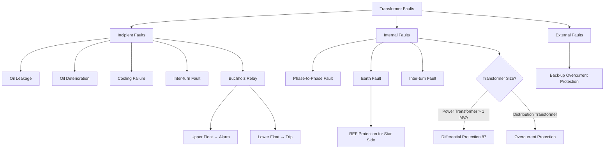

### Diagram 2: Biased Differential Protection Operating Logic

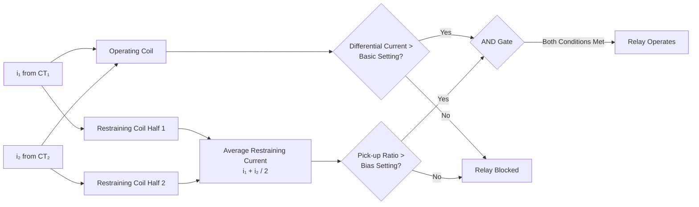

### Diagram 3: Generator Protection Scheme Overview

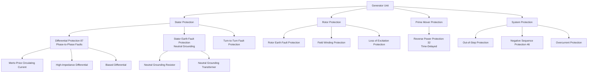

### Diagram 4: Induction Motor Protection Coordination

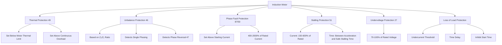

---

## Practice Quiz

**Q1. Which of the following is an incipient fault in a transformer?**
Options: (a) Phase-to-phase short circuit (b) Earth fault in the winding (c) Leakage of oil (d) External short circuit on the LV busbar

> Answer and explanation
> (c) Leakage of oil. Incipient faults are minor faults that occur outside the winding or core, such as oil leakage, cooling system failure, or deterioration of oil quality. Phase-to-phase and earth faults are internal (electrical) faults. An external short circuit is a through fault.

**Q2. The Buchholz relay is connected between the:**
Options: (a) Main tank and the radiator (b) Conservator tank and the main tank (c) Bushing and the winding (d) Tap changer and the main tank

> Answer and explanation
> (b) Conservator tank and the main tank. The Buchholz relay is placed in the pipe connecting the conservator tank to the main tank. This allows it to collect gas bubbles that rise from the main tank during an incipient fault.

**Q3. The upper float of a Buchholz relay is connected to the:**
Options: (a) Trip circuit (b) Alarm circuit (c) Indication circuit (d) Lockout circuit

> Answer and explanation
> (b) Alarm circuit. The upper float is designed to detect slow gas generation (minor faults) and operates the alarm circuit. The lower float, which has a baffle plate, is designed to detect rapid gas generation or oil surge (major faults) and operates the trip circuit.

**Q4. What is the primary purpose of the stabilizing resistance in a Restricted Earth Fault (REF) scheme?**
Options: (a) To increase the sensitivity of the relay (b) To limit the fault current (c) To prevent relay operation during external faults (d) To compensate for the phase shift

> Answer and explanation
> (c) To prevent relay operation during external faults. The stabilizing resistance ensures that the relay does not operate in normal conditions or during external faults. During an external fault, the CT secondary currents circulate in the pilot wires, and the stabilizing resistance limits the voltage across the relay, preventing mal-operation.

**Q5. The spill current in a circulating current differential protection scheme is caused by:**
Options: (a) Internal faults (b) Non-identical CT saturation characteristics (c) High system voltage (d) Low load current

> Answer and explanation
> (b) Non-identical CT saturation characteristics. Spill current flows in normal or external fault conditions due to non-identical CT saturation characteristics and unequal pilot wire lengths. It is not a fault current and can cause mal-operation if not addressed.

**Q6. In a biased differential relay, the relay operates when:**
Options: (a) The differential current exceeds the basic setting only (b) The bias setting exceeds the differential current (c) The differential current exceeds the basic setting AND the pick-up ratio exceeds the bias setting (d) The restraining current exceeds the differential current

> Answer and explanation
> (c) The differential current exceeds the basic setting AND the pick-up ratio exceeds the bias setting. The biased differential relay has two settings: the basic setting (minimum differential current) and the bias setting (slope). Both conditions must be satisfied for the relay to operate.

**Q7. (MSQ) Which of the following factors must be considered when applying differential protection to a power transformer?**
Options: (a) CT ratio mismatch (b) Magnetizing inrush current (c) Inherent phase shift (d) Tap changing facility

> Answer and explanation
> (a), (b), (c), (d). All of these factors are critical. CT ratios must be matched (often using ICTs), inrush current must be blocked (using harmonic restraint), the phase shift must be compensated (by connecting CTs in delta or star), and the tap changer position affects the CT secondary currents.

**Q8. (MSQ) Which of the following are methods to detect magnetizing inrush in a transformer?**
Options: (a) Second harmonic restraint (b) DC biasing technique (c) Wave-shape monitoring (d) Negative sequence current detection

> Answer and explanation
> (a), (b), (c). The second harmonic restraint, DC biasing, and wave-shape monitoring are all techniques used to detect inrush. Negative sequence current detection is used for unbalanced load protection, not inrush detection.

**Q9. (MSQ) The reverse power protection of a generator is time-delayed to:**
Options: (a) Allow the turbine to cool down (b) Prevent tripping during transient power reversals (c) Avoid confusion with differential protection during internal faults (d) Allow the generator to re-synchronize

> Answer and explanation
> (b), (c). The time delay prevents undesired tripping during transient power reversals and avoids confusion with the instantaneous operation of differential protection during internal faults. It is not for cooling or re-synchronization.

**Q10. What is the function of the baffle plate in a Buchholz relay?**

> Answer and explanation
> The baffle plate is connected to the lower float. It is designed to catch the surge of oil that occurs during a severe fault, causing the lower float to tilt and actuate the trip circuit. This makes the lower float more sensitive to rapid oil movement rather than just a slow drop in oil level.

**Q11. Why is the neutral of a Δ-Y power transformer always solidly grounded?**

> Answer and explanation
> If the neutral is isolated, a line-to-ground fault causes the healthy phase voltages to rise to full line voltage. This would significantly increase the insulation requirements for the transformer winding and the connected transmission lines. Solid grounding limits the voltage rise on healthy phases.

**Q12. What is the purpose of an Interposing Current Transformer (ICT) in a transformer differential protection scheme?**

> Answer and explanation
> An ICT is used to match the relay currents under through-load conditions when the secondary currents of the main CTs are not equal. It compensates for both magnitude and phase shift at lower voltage/current levels, ensuring that the differential relay sees balanced currents during normal operation.

**Q13. What is the significance of the knee point voltage (KPV) of a CT in a high-impedance differential protection scheme?**

> Answer and explanation
> The KPV decides the working range of the CT. For stability, the KPV must be at least twice the voltage across the relay circuit ($V_K \geq 2V_R$). If the KPV is too low, the CT will saturate during external faults, leading to mal-operation of the relay.

**Q14. A 100 MVA, 220 kV/132 kV, Δ-Y transformer has CT ratios of 300/1 A on the 220 kV side and 450/1 A on the 132 kV side. What is the approximate full load current on the 220 kV side?**
Options: (a) 262 A (b) 437 A (c) 524 A (d) 131 A

> Answer and explanation
> (a) 262 A. The full load current on the 220 kV side is calculated as $I = \frac{100 \times 10^6}{\sqrt{3} \times 220 \times 10^3} = 262.4 \, \text{A}$. The CT ratio of 300/1 A is chosen as it is the next standard rating above the full load current.

**Q15. A generator has a neutral grounding resistance of 10 Ω. The phase-to-phase voltage is 11 kV. What is the maximum earth fault current?**
Options: (a) 635 A (b) 1100 A (c) 6350 A (d) 110 A

> Answer and explanation
> (a) 635 A. The maximum earth fault current is $I_f = \frac{V_{ph}}{R_n} = \frac{11 \times 10^3}{\sqrt{3} \times 10} = 635 \, \text{A}$. This assumes the neutral resistance is much larger than the system sequence impedances.

**Q16. An induction motor has a starting current of 6 times its full load current of 100 A. The CT ratio is 100/1 A. What is the minimum setting for the instantaneous overcurrent relay (50) to avoid tripping during starting?**
Options: (a) 500% (b) 600% (c) 700% (d) 400%

> Answer and explanation
> (c) 700%. The starting current is 600 A. On the CT secondary, this is 6 A, which is 600% of 1 A. The relay setting must be above this value. The next available setting above 600% is 700%.

**Q17. Scenario: A power transformer is protected by a biased differential relay. During an external fault, the relay mal-operates and trips the transformer. What is the most likely cause?**
Options: (a) The bias setting is too high (b) The CTs are saturating differently, causing a high spill current (c) The transformer is experiencing magnetizing inrush (d) The basic setting is too low

> Answer and explanation
> (b) The CTs are saturating differently, causing a high spill current. During an external fault, the through-current is very high. If the CTs saturate differently, the spill current can be very high. If the bias setting is not high enough to restrain the relay for this spill current, the relay will mal-operate. The bias setting is designed to handle this, so it is likely too low or the CTs are severely mismatched.

**Q18. Scenario: A large induction motor trips on stalling protection (51) shortly after starting. The motor's starting time at 100% voltage is 10 seconds, and the safe stalling time is 20 seconds. The stalling relay time setting is 15 seconds. What is the most likely cause of the trip?**
Options: (a) The time setting is too high (b) The motor is overloaded (c) The motor is experiencing a phase reversal (d) The time setting is too low

> Answer and explanation
> (d) The time setting is too low. The stalling relay time setting must be higher than the motor's acceleration time. If the motor is starting at a voltage lower than 100%, its acceleration time will be longer than 10 seconds. If the actual starting time exceeds the relay's 15-second setting, the relay will trip the motor during a normal start. The setting should be based on the worst-case starting time (e.g., at 80% voltage), which is longer.

---

## Source Provenance

- **Primary Source:** NPTEL Course "Power System Protection and Switchgear" by Prof. Bhaveshkumar R. Bhalja, Department of Electrical Engineering, Indian Institute of Technology, Roorkee.
- **Lectures Covered:** 26, 27, 28, 29, and 30.
- **Extraction:** Mistral OCR 4 extraction of lecture slides and transcripts.
- **Drafting:** DeepSeek V4 Flash drafting and structuring of study notes.
- **Review:** Locally reviewed and generated on 2026-08-05.
- **Note:** The models used for drafting are not authoritative sources; the content is derived from the NPTEL lecture material.
