# Week 7 - Busbar Protection, Surges, and Arc Interruption

## Orientation

Welcome to Week 7. This week we move from line protection into two critical areas that determine whether a power system survives severe events: **busbar protection** and **surge/transient protection**, followed by the physics of **arc interruption** in circuit breakers.

The busbar is the electrical junction where multiple lines meet. A fault here is catastrophic because the fault current is the sum of contributions from every connected source. The protection must be fast (within one cycle), sensitive to internal faults, and absolutely stable for external faults. The challenge is that current transformers (CTs) saturate under high fault currents, producing spurious differential currents that can cause maloperation. We will study six busbar protection schemes, each with its own way of handling CT saturation.

Surges and transients are unavoidable. Lightning strikes, switching operations, and fault clearing all produce overvoltages that can destroy insulation. We will study the sources of surges, the behavior of ungrounded versus grounded neutrals, and the protection devices—from simple rod gaps to modern metal-oxide arresters. We will also examine how the system responds to severe upsets: islanding, load shedding, and frequency decline.

Finally, we study the physics of arc interruption. When a circuit breaker opens, an arc forms between the contacts. The arc must be extinguished at current zero, and the breaker must withstand the transient restriking voltage (TRV) that follows. We will derive the TRV equation, compute RRRV, and understand Slepian's and Cassie's theories of arc interruption.

The material is dense but highly examinable. Work through every derivation and example carefully.

---

## Learning Outcomes

By the end of this week, you will be able to:

1.  Explain why busbar protection requires high speed, high sensitivity, and external fault stability.
2.  Describe the six types of busbar protection schemes: circulating current differential, biased percentage differential, high impedance voltage differential, linear coupler, directional, and digital/numerical.
3.  Analyze the impact of CT saturation on busbar protection and explain how each scheme mitigates it.
4.  Identify the sources of transients and surges: line switching, capacitor bank switching, CCVT switching, reactor switching, arcing ground, and lightning.
5.  Compare neutral grounding methods (solid, resistance, reactance, resonant) and calculate Petersen coil parameters.
6.  Describe the construction and operation of surge protection devices: earthing screens, overhead ground wires, surge absorbers, rod gap, horn gap, multigap, expulsion, and valve-type arresters.
7.  Explain system response to severe upsets: islanding, under-frequency load shedding, and the rate of frequency decline equation.
8.  Apply the arc interruption theories (Slepian's and Cassie's) to predict whether a breaker will successfully interrupt a fault.
9.  Calculate maximum restriking voltage, RRRV, and natural frequency of oscillation for a given circuit.
10. Identify the factors affecting RRRV, recovery voltage, and TRV.

---

## Syllabus Map

| Lecture | Topic |
|---------|-------|
| Lecture 31 | Protection of Busbars |
| Lecture 32 | Protection against Transients and Surges along with System Response to Severe Upsets - I |
| Lecture 33 | Protection against Transients and Surges along with System Response to Severe Upsets - II |
| Lecture 34 | Arc Interruption Theory in Circuit Breaker - I |
| Lecture 35 | Arc Interruption Theory in Circuit Breaker - II |

---

## Lecture 31: Protection of Busbars

### 31.1 Physical Intuition: Why Busbar Protection is Special

Think of a busbar as a busy intersection. Multiple roads (transmission lines) meet at a single point. If a crash (fault) happens right at the intersection, traffic from all roads is blocked. In power system terms, a busbar fault draws fault current from **every connected source**. The fault current magnitude is enormous because all lines feed into the fault simultaneously.

The protection challenge is unique:

- **Speed**: A bus fault must be cleared within one cycle. The fault current is so high that even a few cycles of delay cause severe damage to equipment.
- **Sensitivity**: The relay must detect even small internal faults (phase-to-phase, phase-to-earth) reliably.
- **Stability**: If a fault occurs on a line *outside* the bus zone, the busbar relay must NOT operate. Otherwise, all healthy lines connected to the bus would be unnecessarily tripped, causing a widespread outage.

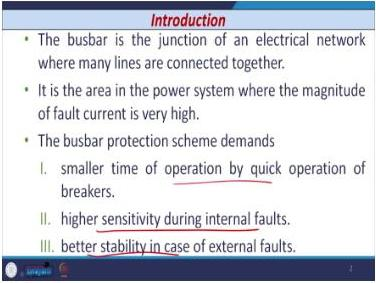

*Figure 31.1: The busbar is the main junction point where multiple transmission lines connect. Fault current magnitude is very high because all lines feed into the fault.*

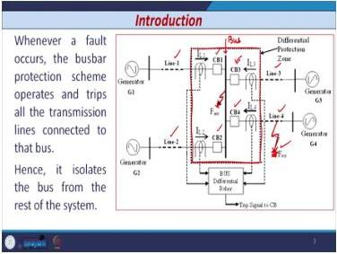

*Figure 31.2: The zone of busbar protection is shown with a dotted line. On internal bus fault, all four breakers (1-4) are tripped to isolate the bus.*

The operating logic is straightforward: when a fault occurs on the busbar (internal fault), the busbar protection scheme detects the fault and operates, tripping **ALL breakers** associated with the lines connected at the busbar. Consider a typical configuration: two incoming lines (Line-1, Line-2) with circuit breakers 1 and 2, and two outgoing lines (Line-3, Line-4) with circuit breakers 3 and 4. On an internal bus fault, all four breakers (1–4) are tripped, isolating the bus from the rest of the system. The critical distinction is that if an external fault occurs on a line (outside the busbar protection zone), the busbar protection relay must NOT operate—otherwise, three healthy lines would be unnecessarily disconnected.

### 31.2 Busbar Arrangements

The choice of busbar arrangement depends on several factors:

1.  **System voltage level** (132 kV, 220 kV, 400 kV)
2.  **Reliability of supply** required
3.  **Position of substation** in the system (is it a critical node?)
4.  **Flexibility and cost** (higher cost generally means higher flexibility)

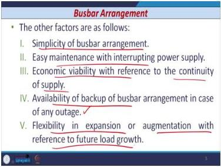

*Figure 31.3: Factors determining busbar arrangement: system voltage, reliability, substation position, flexibility, and cost.*

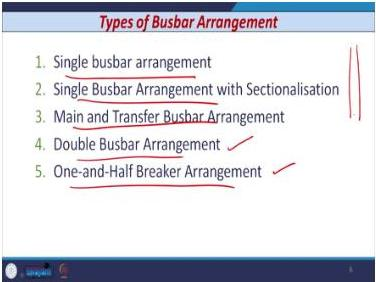

*Figure 31.4: Types of busbar arrangements: single, single with sectionalisation, main and transfer, double busbar, and one-and-half breaker.*

**Voltage-level usage:**

| Voltage Level | Arrangement |
|---------------|-------------|
| EHV and UHV | Double bus or one-and-half breaker |
| Distribution / Medium voltage | Single, single with sectionalisation, main and transfer |

**Additional factors:**

- Simplicity of the arrangement
- Easy maintenance with interrupting power supply
- Economic viability with reference to continuity of supply
- Availability of backup in case of outage
- Flexibility in expansion for future load growth

The concept of flexibility deserves elaboration: if any line connected to the busbar fails, is there another arrangement through which power can be supplied to that line? This is the essence of flexibility in busbar design. As cost increases, flexibility increases; as cost reduces, flexibility reduces.

### 31.3 Busbar Faults: Statistics and Causes

From survey data, bus faults are predominantly ground faults:

| Fault Type | Percentage |
|------------|------------|
| Line-to-ground | 67% |
| Double-line-to-ground | 15% |
| Triple-line-to-ground | 19% |

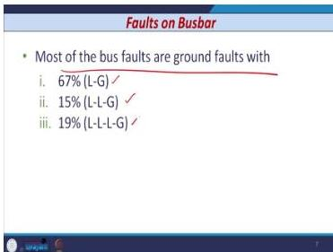

*Figure 31.5: Most bus faults are ground faults. Line-to-ground faults account for 67% of all bus faults.*

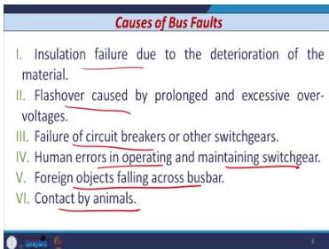

*Figure 31.6: Causes of bus faults include insulation failure, flashover, breaker failure, human errors, foreign objects, and animal contact.*

**Causes of busbar faults:**

1.  Insulation failure due to material deterioration
2.  Flashover caused by prolonged or excessive over-voltages
3.  Failure of breakers or other switchgear
4.  Human errors in operating and maintaining switchgear
5.  Foreign objects falling on the bus
6.  Contact by animals

**Factors determining damage from bus faults:**

- Fault type (what type of bus fault occurs)
- Fault duration (for how much duration the fault occurs)
- Fault level of the bus fault
- Withstand capability of the switchgear (circuit breakers)

### 31.4 Requirements of Busbar Protective Scheme

1.  **High-speed relaying** for internal faults: operate within one cycle to ensure minimum damage
2.  **Stability** during all types of external faults: no unnecessary interruption of power due to tripping of all breakers
3.  **Proper discrimination** between zones: trip minimum number of breakers
4.  **Reliable operation** to avoid extensive damage, danger to personnel, and disruption of service

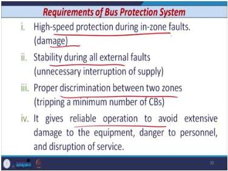

*Figure 31.7: The busbar protection scheme must be high-speed, stable during external faults, discriminating, and reliable.*

### 31.5 CT Saturation Phenomenon

#### 31.5.1 What is CT Saturation?

A current transformer (CT) is designed to reproduce its primary current as a proportional secondary current. This works only when the CT core operates in its linear region. When the required flux density exceeds the core limit, the CT saturates and enters the non-linear region. The secondary current becomes distorted and no longer follows the CT ratio.

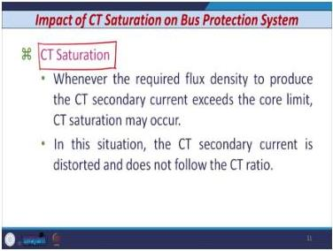

*Figure 31.8: CT saturation occurs when the required flux density exceeds the core limit. The secondary current becomes distorted.*

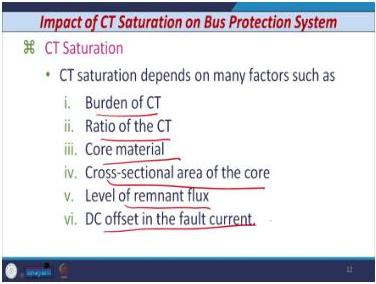

*Figure 31.9: Factors affecting CT saturation: burden, ratio, core material, core cross-sectional area, remnant flux, and DC offset.*

**Factors affecting CT saturation:**

1.  Burden of the CT
2.  Ratio of the CT
3.  Core material
4.  Cross-sectional area of the core
5.  Level of remnant flux
6.  DC offset in the fault current

#### 31.5.2 CT Equivalent Circuit

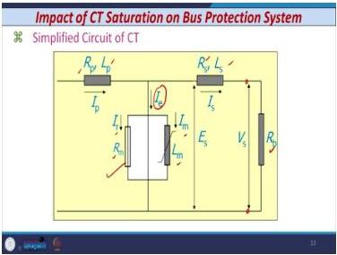

*Figure 31.10: Simplified equivalent circuit of a CT showing exciting current components, winding impedances, and burden.*

The equivalent circuit components:

| Symbol | Meaning |
|--------|---------|
| $I_p$ | Primary current |
| $I_s$ | Secondary current |
| $I_e$ | Exciting current |
| $I_m$ | Magnetizing component (reactive) |
| $I_r$ | Active component |
| $R_m$ | Iron loss equivalent resistance |
| $L_m$ | Non-linear magnetizing inductance |
| $R_p$, $L_p$ | Primary resistance, leakage inductance |
| $R_s$, $L_s$ | Secondary resistance, inductance |
| $E_s$ | Induced EMF of CT secondary |
| $V_s$ | CT terminal voltage |
| $R_b$ | Burden (leads + relay coils) |

#### 31.5.3 Why the Core Saturates

1.  During fault, $I_p$ is very high, so $I_s$ is also very high.
2.  Ideally, $I_s$ should be proportional to $I_p$.
3.  To flow $I_s \propto I_p$, the CT must develop sufficient $E_s$.
4.  To develop a large $E_s$ (to overcome the voltage drop in the secondary circuit), the core flux must be high.
5.  If the flux approaches saturation, the exciting current $I_e$ becomes large and $I_s$ decreases.


*Figure 31.11: To develop sufficient secondary EMF, the core flux must be high. If flux approaches saturation, exciting current increases and secondary current decreases.*

**Consequences of CT saturation:**

- $I_s$ is less than expected
- The core saturates during part of the cycle only
- $I_s$ becomes distorted

#### 31.5.4 Impact on Bus Protection

A high external fault current can cause one CT to saturate while others do not. This produces different secondary currents from the CTs, resulting in a differential current in the relay's operating element. The differential relay may then operate during external faults—a maloperation. **It is essential to detect CT saturation and block the relay operation.**

### 31.6 Types of Busbar Protection Schemes

#### 31.6.1 Circulating Current Differential Protection

**Principle:** Compare current entering and leaving the protected equipment.

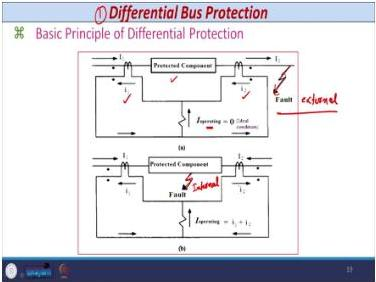

*Figure 31.12: Current entering and leaving the protected equipment are compared. External fault: currents cancel. Internal fault: currents add.*

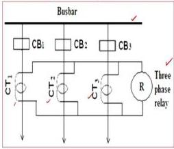

*Figure 31.13: Circulating current differential protection for a busbar with multiple feeders.*

- **External fault**: currents are ideally zero (practically not zero) - relay does not operate
- **Internal fault**: currents add; if sum exceeds pickup, relay operates

**Problems:**

- CT lead lengths are not equal, so burdens are not equal
- CTs produce different outputs for the same input
- Spill current flows in the operating element during normal and through-fault conditions

**Main requirement:** CTs must have the same ratio.

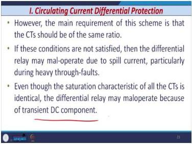

*Figure 31.14: CTs must have the same ratio. Even with identical CTs, transient DC components can cause maloperation.*

**Advantages:**

- Very simple

**Disadvantages:**

- Requires dedicated identical CTs
- May maloperate due to CT saturation, ratio mismatch, or transient DC component

#### 31.6.2 Biased/Percentage Differential Protection

**Purpose:** Avoid maloperation due to CT saturation and ratio mismatch.

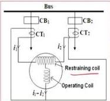

*Figure 31.15: Biased differential protection uses operating and restraining coils to provide stability against CT saturation.*

**Operating quantities:**

- Operating coil (OC): $|\vec{i}_1 - \vec{i}_2|$
- Restraining coil (RC): $\frac{\vec{i}_1 + \vec{i}_2}{2}$

**Operating principle:**

- The differential current $(i_1 - i_2)$ must exceed the restrain current $(i_1 + i_2)/2$
- The ratio is expressed as a percentage and is known as the **slope** of the relay characteristic

**Two settings (AND logic):**

1.  **Pick-up/sensitivity setting**: $|i_1 - i_2| > Th_1$
2.  **Percentage bias**: $\frac{|i_1 - i_2|}{(i_1 + i_2)/2} \times 100 > Th_2$

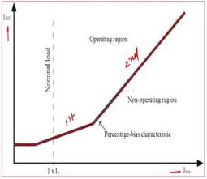

*Figure 31.16: Two-slope characteristic of a biased differential relay. Points above the line are in the operating region; points below are in the restraining region.*

**Advantages:**

1.  High tolerance against substantial CT saturation
2.  Reduced requirement of dedicated CTs
3.  Used where high-speed tripping is required

**Disadvantages:**

1.  May maloperate for close-in external faults due to complete CT saturation

#### 31.6.3 High Impedance Voltage Differential Protection

**Purpose:** Overcome spill current due to CT saturation during external faults.

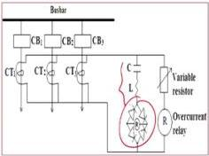

*Figure 31.17: High impedance scheme discriminates between internal and external faults through the relative magnitudes of voltage across the differential junction points.*

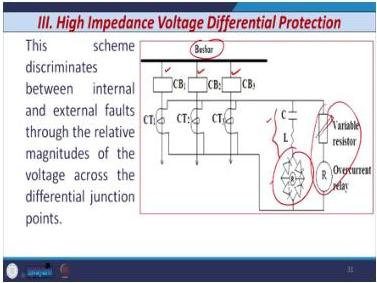

*Figure 31.18: CTs connected through variable resistors. An L-C circuit tuned to 50 Hz responds only to the fundamental frequency component.*

**Operating principle:**

- Discriminates between internal and external faults through relative magnitudes of voltage across differential junction points
- CT saturation effect controlled by CT secondary and lead resistance, plus added resistance in the relaying circuit
- Full wave bridge rectifier adds substantial resistance
- L-C circuit tuned to 50 Hz makes the relay immune to DC offset and harmonics

**Advantages:**

- Stability against transient DC component
- Improved CT saturation characteristic due to $R_{stab}$

**Disadvantages:**

- Stabilizing resistance reduces sensitivity
- Requires dedicated CTs (higher cost)
- May maloperate when secondary leakage reactance is present
- Not applicable when busbar reconfiguration is possible

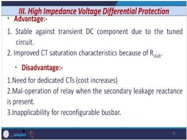

*Figure 31.19: Trade-off between stability and sensitivity in high impedance schemes.*

#### 31.6.4 Protection Using Linear Couplers

**Principle:** Use air core CTs (linear couplers) instead of conventional iron core CTs.

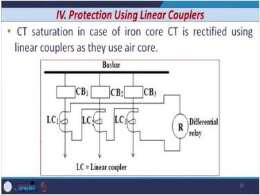

*Figure 31.20: Linear couplers (air core CTs) eliminate CT saturation. Output voltage is proportional to the derivative of input current.*

- Output voltage is proportional to the derivative of the input current
- If voltage sum across the relay is zero, input current equals output current (no fault)
- During internal fault, all line currents flow toward the bus, so induced voltage appears across the relay

**Advantages:**

- Effective when CT saturation is very predominant

**Disadvantages:**

- Requires additional equipment, increasing cost

#### 31.6.5 Directional Bus Protection Scheme

**Basic principle:**

- If power flow in one or more circuits is **away from the bus** → external fault
- If power flow in **all circuits is into the bus** → internal bus fault

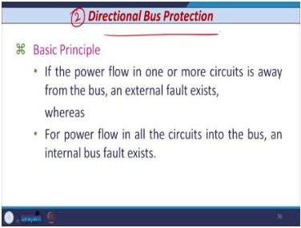

*Figure 31.21: Directional protection compares the direction of power flow. If all circuits feed into the bus, an internal fault exists.*

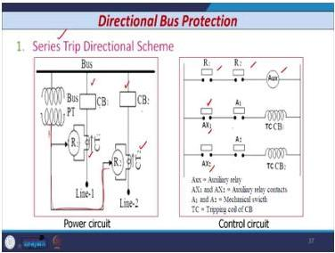

*Figure 31.22: Series trip scheme: relay contacts are connected in series. During internal fault, both relays close simultaneously, energizing the auxiliary relay.*

**Series Trip Directional Scheme:**

- Relay 1 and Relay 2 connected across CT secondaries
- Directional relays require PT secondary input
- Contacts of R1 and R2 connected in series
- During internal fault: R1 and R2 close simultaneously, energize auxiliary relay, which trips the CBs

**Advantages:**

- Not affected by CT saturation (compares direction, not magnitude)

**Disadvantages:**

- Too many series contacts compromise reliability
- Complex circuitry requiring periodic assessment
- More time to coordinate all series-connected contacts
- Operating time exceeds one cycle - not used in practice

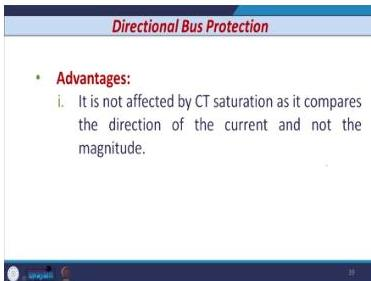

*Figure 31.23: Directional protection is immune to CT saturation but is slow and complex.*

#### 31.6.6 Digital/Numerical Busbar Protection Scheme

**Features:**

- Incorporates modeling of CT response to eliminate CT saturation errors
- Uses processing units that collect CT secondary current, PT secondary voltage, and CB/isolator status
- Central unit distinguishes between internal and external faults

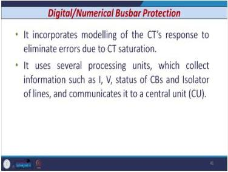

*Figure 31.24: Digital busbar protection uses processing units and a central unit with proper algorithms.*

**Classification:**

1.  **Decentralized**: separate Data Acquisition Units (DAUs) for each line
2.  **Centralized**: single central unit performs all functions

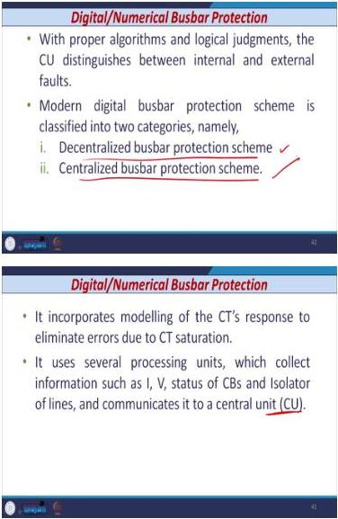

*Figure 31.25: Decentralized vs. centralized busbar protection schemes.*

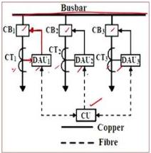

*Figure 31.26: Decentralized scheme: DAUs installed in each line sample and pre-process signals. Fibre optic cables transmit data between CU and DAUs.*

**Decentralized scheme:**

- DAUs installed in each line
- Separate Central Unit (CU) for gathering and processing information
- Fibre optic cables for data transmission
- Advantages: reduced wiring
- Disadvantages: complex circuitry, sufficient data transfer rate required

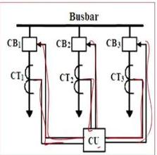

*Figure 31.27: Centralized scheme: all signals connected at a central location where a single relay performs all functions.*

**Centralized scheme:**

- All signals connected at a central location
- Single relay performs all functions
- All pre-processing and computations (sampling, filtering, A/D conversion, relay logic) performed by CU
- Disadvantage: more computational burden on the CU

### 31.7 Comparison of Busbar Protection Schemes

| Scheme | CT Saturation Handling | Speed | Complexity | Cost | Application |
|--------|------------------------|-------|------------|------|-------------|
| Circulating Current Differential | Poor | Fast | Low | Low | Simple buses |
| Biased Percentage Differential | Good | Fast | Medium | Medium | General purpose |
| High Impedance Voltage Differential | Good | Fast | Medium | High | Fixed bus configurations |
| Linear Coupler | Excellent | Fast | High | High | Severe saturation cases |
| Directional | Excellent (direction-based) | Slow (>1 cycle) | High | High | Not practical |
| Digital/Numerical | Excellent (modeling) | Fast | High | High | Modern substations |

### 31.8 Worked Example: Percentage Differential Relay Setting

**Problem:** A busbar has two incoming feeders. The CT ratios are 600/5 A and 400/5 A. The relay has a minimum pickup of 0.1 A and a percentage bias setting of 20%. Determine if the relay operates for an external fault of 3000 A.

**Solution:**

Step 1: Calculate secondary currents.

For CT1 (600/5):
$$I_{s1} = 3000 \times \frac{5}{600} = 25 \text{ A}$$

For CT2 (400/5):
$$I_{s2} = 3000 \times \frac{5}{400} = 37.5 \text{ A}$$

Step 2: Calculate differential current.
$$I_{diff} = |I_{s1} - I_{s2}| = |25 - 37.5| = 12.5 \text{ A}$$

Step 3: Calculate restraining current.
$$I_{rest} = \frac{I_{s1} + I_{s2}}{2} = \frac{25 + 37.5}{2} = 31.25 \text{ A}$$

Step 4: Check operating conditions.

Condition 1 (pickup): $I_{diff} = 12.5 \text{ A} > 0.1 \text{ A}$ ✓

Condition 2 (percentage bias):
$$\frac{I_{diff}}{I_{rest}} \times 100 = \frac{12.5}{31.25} \times 100 = 40\%$$

Since 40% > 20%, the relay **operates**.

**Interpretation:** This is an external fault, so the relay should NOT operate. The CT ratio mismatch causes a large spill current. This demonstrates why CTs must have the same ratio for simple differential protection. A biased relay with a higher slope setting would be needed, or CTs with matching ratios.

### 31.9 Exam Traps

1.  **CT saturation during external faults** is the most common cause of busbar protection maloperation.
2.  **Spill current** arises from unequal CT lead lengths creating unequal burdens.
3.  The percentage differential relay requires **AND logic** (both pickup AND bias conditions), not OR logic.
4.  Directional protection is **not affected by CT saturation** because it compares direction, not magnitude.
5.  High impedance scheme: adding stabilizing resistance **reduces sensitivity**.

### 31.10 Lecture Recap

- Busbar protection requires high speed (within one cycle), high sensitivity for internal faults, and stability for external faults.
- Bus faults are predominantly ground faults (67% line-to-ground).
- CT saturation is the primary challenge: it produces spurious differential currents during external faults.
- Six schemes exist: circulating current, biased percentage, high impedance, linear coupler, directional, and digital.
- Each scheme handles CT saturation differently, with trade-offs between speed, complexity, and cost.
- Digital schemes use CT modeling and central processing units for superior performance.

---

## Lecture 32: Protection against Transients and Surges along with System Response to Severe Upsets - I

### 32.1 Physical Intuition: Why Surges Matter

Power systems are subject to unavoidable disturbances. Lightning strikes, switching operations, and faults create transient overvoltages that can damage insulation and equipment. The key insight from the lecture: "Power surges are a fact of life, lightning strokes are intended to occur and equipment failures that is inevitable. So there is no way to prevent power surges and transients, but of course, there is a way to offer protection for the equipment against transient overvoltages and surges."

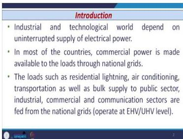

*Figure 32.1: National grids operate through long EHV and UHV transmission lines, which are exposed to surges and transients.*

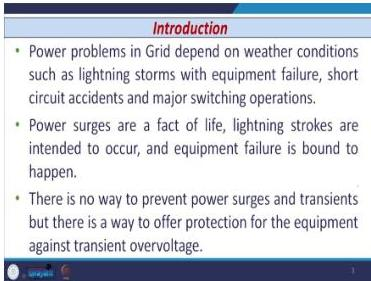

*Figure 32.2: Power problems depend on weather conditions, equipment failure, short circuit accidents, and major switching operations.*

The industrial and technological world depends on uninterrupted electric power supply. Commercial power is made available to loads through national grids, serving residential lighting, air conditioning, transportation, bulk supply to public sector, industrial sector, commercial sector, and communication sectors. National grids are operated through long EHV (extra high voltage) and long UHV (ultra high voltage) transmission lines.

### 32.2 Sources of Transients or Surges

**Definition:** An abrupt increase in voltage above the rated value for a short duration is known as a **voltage surge or transient voltage**.

**Characteristics:**

- Temporary in nature, exist for a very short duration
- Cause overvoltage in the power system
- May damage main equipment and affect system reliability

**Sources:**

1.  Switching of transmission lines
2.  Switching of capacitor banks
3.  Switching of CCVTs
4.  Switching of reactors
5.  Arcing ground
6.  Lightning strokes

Switching operations of EHV transmission lines are required for ordinary functioning of the electrical network. When energizing a line after maintenance, breakers are switched on from both ends, carried out without connecting any load. Switching of an unloaded line, opening or closing of isolating switches (circuit breakers), or when a circuit breaker interrupts inductive or capacitive current produces transient overvoltages. Switching surges depend on how repeatedly routine switching operations are performed. Their existence depends on the number of faults and their clearance, changes in system parameters, and alteration of system configuration.

### 32.3 Cause 1: Switching of Transmission Line

When EHV/UHV lines are energized by closing the line circuit breaker, switching surges are generated.

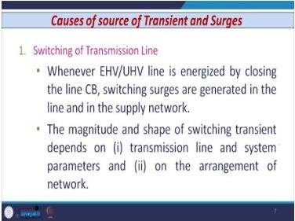

*Figure 32.3: Energizing an unloaded line produces switching surges. The severity depends on the difference between supply voltage and line voltage at the instant of energization.*

**Mechanism:**

- Large traveling waves are injected when closing occurs at an instant when the voltage difference ($V_s - V_l$) is high
- When the traveling wave reaches the open far end, it is reflected, producing a high transient overvoltage

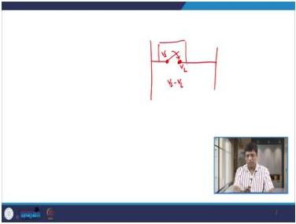

*Figure 32.4: The severity of switching transients depends on the difference between supply voltage and line voltage at the instant of energization.*

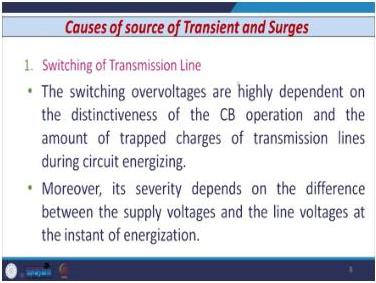

*Figure 32.5: Switching overvoltages depend on the distinctiveness of CB operation and the amount of trapped charges.*

**Key factors:**

- Switching overvoltages are highly dependent on the distinctiveness of the CB operation and the amount of trapped charges of transmission lines during circuit energizing
- Severity depends on the difference between supply and line voltages at energization

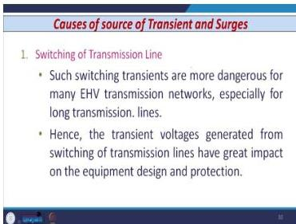

*Figure 32.6: Switching transients are more dangerous for long UHV lines and have great impact on equipment design and protection.*

The magnitude and shape of the switching transient depend on transmission line and system parameters, and the arrangement of the network. Such switching transients are more dangerous for many UHV lines, especially for long lines. Transient overvoltages from switching of transmission lines have great impact on equipment design and protection.

### 32.4 Cause 2: Switching of Capacitor Bank

Shunt capacitor banks are used for power factor improvement (distribution) and voltage/VAR support (transmission).

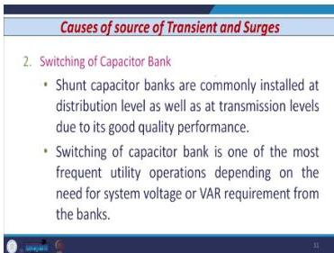

*Figure 32.7: Switching of capacitor banks is one of the most frequent utility operations, producing high magnitude and high frequency transients.*

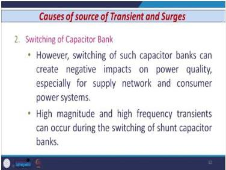

*Figure 32.8: Capacitor bank energization draws transient inrush current with high magnitude and frequency of several hundred Hertz.*

**Effects:**

- High magnitude and high frequency transients
- Transient inrush current with frequency of several hundred Hertz
- Transient overvoltage on the bus and neighboring system

**Back-to-back switching:**

- Switching one bank after another adjoining a previously energized bank results in much higher current magnitude and frequency

**Series compensated lines:**

- Trapped charges in the capacitor bank at line reclosing increase phase-to-ground and phase-to-phase voltages
- TRV experienced by the first CB to clear a fault is very high

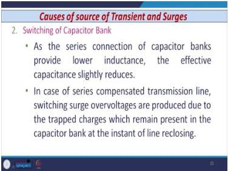

*Figure 32.9: Series compensated lines produce switching surge overvoltages due to trapped charges in the capacitor bank.*

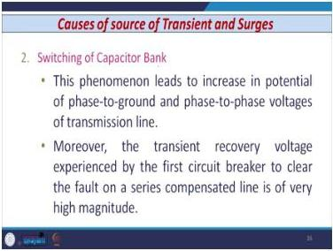

*Figure 32.10: The transient recovery voltage experienced by the first circuit breaker to clear a fault on a series compensated line is of very high magnitude.*

Shunt capacitor banks are commonly installed at distribution as well as transmission level. At distribution level, they are used for power factor improvement; at transmission level, for system voltage requirement or supply of VAR requirement. Switching of capacitor banks is one of the most frequent utility operations. When a capacitor bank is energized, it draws transient inrush current from the bus or transformer, distinguished by a surge of current having high magnitude and frequency of several hundred Hertz. This leads to transient overvoltage on the bus and neighbouring power system.

In series compensated transmission lines, switching surge overvoltages are produced due to trapped charges remaining in the capacitor bank at the instant of line reclosing. This leads to increase in potential of phase-to-ground as well as phase-to-phase voltages. The transient recovery voltage (TRV) experienced by the first circuit breaker to clear the fault on a series compensated line is also of very high magnitude.

### 32.5 Cause 3: Switching of CCVT

CCVTs are used for protective relaying and measurement. Normal switching can create unexpected overvoltage.

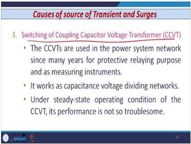

*Figure 32.11: Normal switching operation of CCVT can create unexpected overvoltage, affecting system reliability.*

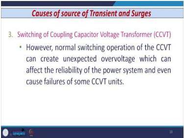

*Figure 32.12: CCVT switching can cause failures of one or multiple CCVT units.*

**Causes of transient overvoltage:**

- Ferro-resonance in the CCVT
- Nonlinear behavior of the potential transformer magnetic core
- Effect of stray capacitance in CCVT elements

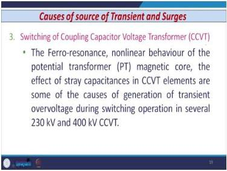

*Figure 32.13: Ferro-resonance and nonlinear core behavior cause transient overvoltages in 220 kV or 400 kV CCVTs.*

CCVTs are used in power system networks for protective relaying application and measurement purpose. They work as capacitance voltage dividing networks. Under steady-state operating conditions, performance is not troublesome. However, normal switching operation of CCVT can create unexpected overvoltage, affecting reliability of the power system and causing failures of one or multiple CCVT units. These occur in several 220 kV or 400 kV CCVTs.

### 32.6 Cause 4: Switching of Reactor

Shunt reactors compensate leading reactive power and limit voltage rise at the remote end of the line.

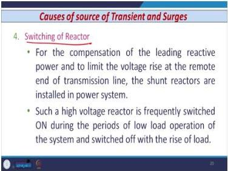

*Figure 32.14: Shunt reactors are frequently switched on/off during periods of low load operation.*

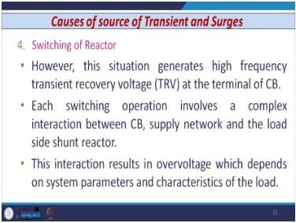

*Figure 32.15: Reactor switching generates high frequency transient recovery voltage at the circuit breaker terminal.*

**Key points:**

- **Energization** of reactors rarely generates high overvoltages
- **De-energization** may generate excessive overvoltages

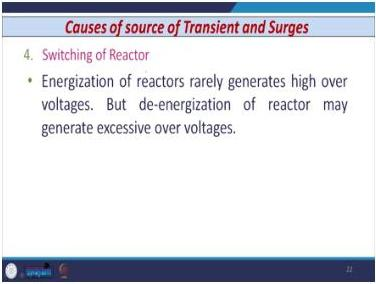

*Figure 32.16: De-energization of reactors may generate excessive overvoltages due to current chopping.*

**Mechanism:**

- **Current chopping**: current interruption before the natural current zero while interrupting small inductive current
- Discharge of energy stored in the reactor inductance causes electromagnetic transients

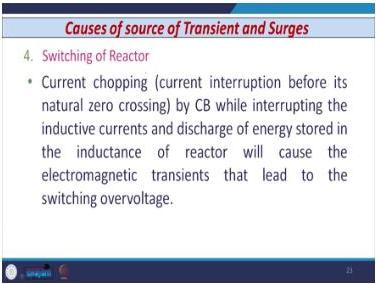

*Figure 32.17: Current chopping occurs when the circuit breaker interrupts current before the natural current zero.*

Shunt reactors are installed for compensation of leading reactive power and limiting voltage rise at the remote end of the line. High voltage reactors are frequently switched on/off during periods of low load operation, and switched off when load increases. Each switching operation involves complex interaction between the circuit breaker, supply network, and load side shunt reactor, resulting in overvoltage depending on system parameters and load characteristics. Energization of reactors rarely generates high overvoltages, but de-energization may generate excessive overvoltages due to current chopping—current interruption before the natural current zero by the circuit breaker while interrupting small inductive current. Discharge of energy stored in the inductance of the reactor causes electromagnetic transients that lead to switching overvoltages.

### 32.7 Cause 5: Arcing Ground

In an ungrounded 3-phase system, during a line-to-ground fault, the current magnitude is sufficient to maintain an arc. The intermittent arc produces transients, known as **arcing ground**.

**Effects:**

- Transients are cumulative in nature
- May cause serious damage by causing breakdown of insulation

### 32.8 Cause 6: Lightning Strokes

**Types:**

1.  Direct lightning stroke
2.  Indirect lightning stroke

**Key fact:** Most surges in transmission lines are caused by **indirect lightning strokes**.

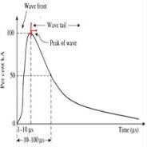

*Figure 32.18: Lightning current waveform: wave front 1-10 microseconds, wave tail beyond 10 microseconds.*

**Waveform characteristics:**

- Wave front: 1 to 10 microseconds
- Wave tail: beyond 10 microseconds
- Peak at the transition point

Lightning is the main source of overvoltage. Though less in number, lightning strikes badly affect the performance of power system components. In the worst case, complete failure of insulation can occur due to severe lightning discharge.

### 32.9 Neutral Grounding

Neutral grounding affects system performance during fault conditions, considering stability and protection.

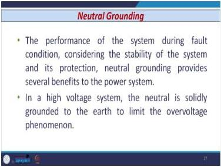

*Figure 32.19: Neutral grounding provides several benefits. In high voltage systems, the neutral is solidly grounded to limit overvoltage phenomena.*

### 32.10 Effects of Ungrounded Neutral

#### 32.10.1 Balanced Conditions

Under balanced conditions with a perfectly transposed line, the shunt capacitance to ground for each conductor is the same. Charging currents are displaced by 120°, leading the corresponding voltages by 90°.

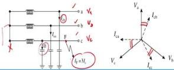

*Figure 32.20: Under balanced conditions, charging currents are displaced by 120° and lead voltages by 90°.*

#### 32.10.2 During LG Fault

When a line-to-ground fault occurs:

- Voltage of faulted phase reduces to zero
- Voltages of the other two healthy phases rise to line-to-line value
- Shunt capacitor charging currents of healthy phases are displaced by 60°
- Net charging current is **three times** the phase current under balanced conditions

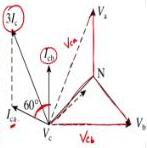

*Figure 32.21: During LG fault in an ungrounded system, healthy phase voltages rise to line-to-line value, and the net charging current is three times the phase current.*


*Figure 32.22: Vector diagram showing the resultant current is 3Ic during arcing ground conditions.*

**Vector analysis:**

- $V_a$, $V_b$, $V_c$ shown; line-to-line voltages drawn as dotted lines
- $I_{cb}$ leads voltage $V_{cb}$ by 90°
- $I_{ca}$ leads voltage $V_{ca}$ by 90°
- Angle between $I_{ca}$ and $I_{cb}$ is 60°
- Parallelogram gives resultant current = $3I_c$

### 32.11 Solid Grounding

**Definition:** The neutral is directly connected to the ground without any resistor or reactor.

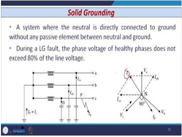

*Figure 32.23: In solid grounding, the neutral is directly connected to ground. Healthy phase voltages do not exceed 80% of line voltage during LG fault.*

**Effect during LG fault:**

- Phase voltage of healthy phases does not exceed 80% of the line voltage

### 32.12 Resistance Grounding

**Definition:** A high ohmic resistor is inserted between the neutral and ground.

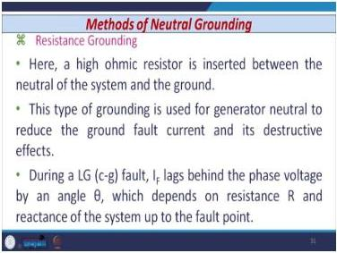

*Figure 32.24: Resistance grounding uses a high ohmic resistor between neutral and ground, typically for generator neutrals.*

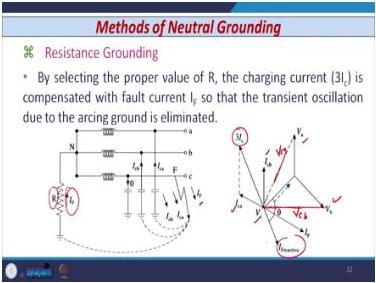

*Figure 32.25: Fault current lags behind the phase voltage by an angle θ, which depends on R and system reactance.*

**Application:** Used in generator neutrals to reduce ground fault current magnitude and its destructive effect.

**Behavior during LG fault:**

- Fault current $I_F$ lags behind the phase voltage by angle θ
- θ depends on R and the reactance of the system up to the fault point

**Purpose:**

- By selecting proper R, the charging current ($I_F = 3I_c$) is compensated
- Transient oscillation due to arcing ground is eliminated


*Figure 32.26: Vector diagram showing fault current compensation in resistance grounding.*

### 32.13 Reactance Grounding

**Definition:** A reactance is inserted between the neutral and earth.

**Condition:** When $X_0/X_1$ is greater than 3, the system is said to be reactance grounding.


*Figure 32.27: Reactance grounding is used in circuits with large charging current, such as synchronous motors and capacitor banks.*

**Application:** Used in circuits with large charging current:
- Neutral of synchronous motors
- Capacitor banks

### 32.14 Resonant Grounding

**Definition:** Includes an arc suppression coil (iron cored reactor) between the neutral and ground.


*Figure 32.28: Resonant grounding uses an arc suppression coil (Petersen coil) between neutral and ground.*

**Main functions of arc suppression coil:**

1.  Limit the earth fault current
2.  Extinguish the arc sustained during ground fault by balancing the fault current exactly with the charging current

**Alternative names:** Petersen coil or ground fault neutralizer


*Figure 32.29: For resonant grounding, the inductive reactance of the coil is chosen so that the fault current equals the charging current.*

**Mathematical Formulation:**

If the inductive reactance of the coil is $X_L$:
$$I_F = \frac{V_{ph}}{X_L}$$

If the capacitance of each phase is C:
$$3I_C = 3 \times V_{ph} \times \omega \times C$$

Where:
- $\omega = 2 \times \pi \times f$ = angular frequency
- $f$ = system frequency

**For resonant grounding:**
$$I_F = 3I_C$$
$$\frac{V_{ph}}{X_L} = 3 \times V_{ph} \times \omega \times C$$

Solving for L:
$$L = \frac{1}{3 \times \omega^2 \times C}$$

**Application:** Resonant grounding is generally used for medium voltage transmission lines connected to the generating source.

### 32.15 Grounding Practices


*Figure 32.30: Grounding practices by voltage level: solid grounding for low tension, resistance/reactance for medium voltage, solid grounding for 33 kV and above.*

| Voltage Level | Grounding Method |
|---------------|------------------|
| Low tension (220/440 V) | Solid grounding |
| Medium voltage (up to 3.3, 6.6, 11 kV) | Resistance or reactance grounding |
| 33 kV and above | Solidly grounded neutral |

**Additional practices:**

- Each voltage level should have one grounding system
- Resistance grounding: normally for generators
- Reactance grounding: for synchronous motors and capacitors
- Multiple power sources: connected to a common neutral bus with common resistor
- At least one generator should be properly grounded when operating in parallel

From generating station to distribution, each voltage level should be provided with one grounding system. If multiple power sources work in parallel in a plant, they are all connected to a common neutral bus connected to the ground through a common resistor. If a number of generators operate in parallel, at least one generator should be grounded properly.

### 32.16 Worked Example: Petersen Coil Sizing

**Problem:** A 220 kV, 3-phase, 50 Hz, 60 km long overhead transmission line has a capacitance of 1.2 μF per kilometer. Determine the inductive reactance and KVA rating of the arc suppression coil suitable for the system to eliminate the arcing ground effect.


*Figure 32.31: Example problem for Petersen coil sizing.*

**Given:**
- $V_L = 220$ kV
- $f = 50$ Hz
- Length = 60 km
- Capacitance per km = 1.2 μF/km

**Step 1: Calculate angular frequency**
$$\omega = 2 \times \pi \times f = 2 \times 3.14 \times 50 = 314 \text{ rad/s}$$

**Step 2: Calculate inductance L**
$$L = \frac{1}{3 \times \omega^2 \times C} = \frac{1}{3 \times (314)^2 \times 1.2} = 2.81 \text{ H}$$

**Step 3: Calculate inductive reactance**
$$X_L = 2 \times \pi \times f \times L = 2 \times \pi \times 50 \times 2.81 = 882.78 \text{ Ω}$$

**Step 4: Calculate MVA rating of arc suppression coil**
$$\text{MVA} = \frac{V_L^2}{3 \times \omega \times L} = \frac{220 \times 220}{3 \times 314 \times 2.81} = 18.28 \text{ MVA}$$

Converting to KVA:
$$= 18.28 \times 1000 = 18280 \text{ KVA}$$


*Figure 32.32: Calculation of inductance and inductive reactance for the Petersen coil.*


*Figure 32.33: Calculation of MVA rating of the arc suppression coil.*

**Step 5: Calculate fault current**
$$I_F = \frac{V_L}{\sqrt{3} \times X_L} \times 1000 = \frac{220}{\sqrt{3} \times 884.6} \times 1000 = 143.58 \text{ A}$$

### 32.17 Protection Against Surges

**Need for protection:**

- Lightning surges may cause serious damage to expensive equipment
- Direct stroke on equipment or strokes on transmission lines reaching equipment as traveling waves


*Figure 32.34: Lightning surges may cause serious damage to expensive equipment either by direct stroke or traveling waves.*

**Most commonly used protection devices:**

1.  Earthing screen
2.  Overhead ground wires
3.  Surge diverters
4.  Lightning arresters

### 32.18 Earthing Screen

**Purpose:** Protects substations against direct lightning strokes.


*Figure 32.35: Earthing screen consists of a network of copper conductors connected to earth at at least two points.*


*Figure 32.36: The screen provides a low resistance path, discharging lightning surges to earth.*

**Construction:**

- Network of copper conductors (shield or screen)
- Connected to earth at at least two points through low impedance

**Operation:**

- Direct stroke on station: screen provides low resistance path
- Lightning surges discharged to earth
- Equipment protected

### 32.19 Overhead Ground Wires

**Purpose:** Protects transmission lines against direct lightning strokes.


*Figure 32.37: Overhead ground wires protect transmission lines. Effectiveness depends on height above ground and shielding angle.*

**Effectiveness depends on:**

- Height of the ground wire above the ground
- Protection or shielding angle

**Operation:**

- Both ground wire and line conductor get induced charge
- Ground wire is earthed at regular intervals
- Induced charge is drained to earth

### 32.20 Surge Modifier or Absorber

**Components:** Surge capacitor, surge reactor, and surge absorber.


*Figure 32.38: Surge absorber uses a shunt capacitor and series air-cored inductor to reduce surge steepness and amplitude.*

**Construction:**

- Small shunt capacitor between line and earth
- Series air-cored inductor

**Operation:**

- Capacitor must charge before surge can impress high voltage on equipment
- Reactors offer high impedance to high frequency currents

**Effectiveness:**

- Reduces steepness of the wave
- Some effect on amplitude (energy dissipated by resistance of metallic shield)

A capacitor connected in parallel or inductor in series with the equipment offers protection against surges to some extent (not complete protection). Before the surge can impress a high voltage on the equipment, it must charge the capacitor. Reactors offer high impedance to high frequency currents. The absorber is effective not only in reducing the steepness of the wave but also has some effect on the amplitude—some energy is dissipated by the resistance of the metallic shield.

### 32.21 Exam Traps

1.  **Ungrounded neutral**: healthy phase voltages rise to line-to-line values during LG fault.
2.  **Solid grounding**: healthy phase voltages limited to 80% of line voltage, NOT eliminated.
3.  **Resonant grounding**: only suitable for medium voltage lines connected to generating sources.
4.  **Petersen coil calculation**: forgetting to multiply by 3 in the denominator of $L = \frac{1}{3\omega^2 C}$ is a common error.
5.  **Unit conversions**: capacitance in μF must be consistent when computing with ω in rad/s.

### 32.22 Lecture Recap

- Surges are unavoidable; protection is essential.
- Six sources of transients: line switching, capacitor banks, CCVTs, reactors, arcing ground, lightning.
- Neutral grounding methods: solid, resistance, reactance, resonant.
- Ungrounded neutrals cause arcing ground with 3Ic fault current.
- Petersen coil sizing: $L = \frac{1}{3\omega^2 C}$.
- Protection devices: earthing screens, overhead ground wires, surge absorbers.

---

## Lecture 33: Protection against Transients and Surges along with System Response to Severe Upsets - II

### 33.1 Lightning Arresters (Surge Diverters)

**Purpose:**

- Earthing screens and ground wires cannot protect against traveling waves reaching terminal apparatus
- Lightning arresters protect equipment from lightning overvoltages and some switching surges


*Figure 33.1: Five types of lightning arresters: rod gap, horn gap, multigap, expulsion type, and valve type.*

**Types of Lightning Arresters:**

1.  Rod gap arrester
2.  Horn gap arrester
3.  Multigap arrester
4.  Expulsion type arrester
5.  Valve type arrester

### 33.2 Rod Gap Arrester

**Construction:**

- Two rods: one connected to the line (line rod), one connected to earth (earth rod)
- Gap between the two rods = rod gap
- Mounted near transformer bushings on the transformer tank


*Figure 33.2: Rod gap arrester consists of two rods - one connected to the line, one to earth - mounted near transformer bushings.*

**Key design rule:**

- The distance between the gap and the insulator (distance X) must **not be less than 1/3 of the gap length**
- Otherwise, arcing may reach and damage the insulator

**Setting rule:**

- A rod gap should be set to break down at a voltage **not less than 30% below the voltage withstand level** of the equipment to be protected


*Figure 33.3: The distance between the gap and the insulator must not be less than 1/3 of the gap length. The gap should break down at a voltage not less than 30% below the equipment withstand level.*

**Operation:**

- When surge voltage reaches the design value, an arc appears in the gap
- Provides an ionized path to ground (essentially a short circuit)
- Equipment/bushing protected

### 33.3 Horn Gap Arrester

**Construction:**

- Horns constructed so the distance between them gradually increases toward the top
- Horns mounted on porcelain insulators


*Figure 33.4: Horn gap arrester has horns with gradually increasing distance toward the top, mounted on porcelain insulators.*


*Figure 33.5: Horn gap circuit includes a choke coil and resistor R. The choke offers high reactance at transient frequency.*

**Circuit components:**

- Apparatus to be protected connected at one point; earth at another
- Horn gap between these points (positions 1, 2, 3 - distance increases)
- One choke coil connected in the circuit
- One resistor R connected in the circuit

**Functions of components:**

- **Resistor R**: current limiting resistor - limits the magnitude of current
- **Choke coil**: small reactance at normal power frequency, very high reactance at transient frequency
- The choke does NOT allow transients to enter the apparatus


*Figure 33.6: On overvoltage, the arc moves upward into positions 1, 2, and 3. At position 3, the distance is too large, resulting in high resistance to the arc.*

**Operation:**

- On overvoltage, the arc moves upward into positions 1, 2, and 3
- At position 3, the distance is too large → high resistance to the arc
- Arc is lengthened; since $R = \rho L/A$, increasing arc length increases arc resistance
- Possibility of sustainability reduces → arc is extinguished

### 33.4 Multigap Arrester

**Construction:**

- Metallic cylinders (usually alloy of zinc), insulated from each other
- Separated by small intervals of air gaps
- Connected in series

**Voltage rating:** Can be employed up to 33 kV


*Figure 33.7: Multigap arrester uses zinc alloy cylinders separated by small air gaps, connected in series.*

**Components:**

- Series gap (X to Y)
- Shunt gap (Y to Z)
- Series resistance

**Operation:**

- During overvoltage, breakdown of the series gap X to Y occurs first
- High magnitude current is diverted to earth through the path of the shunted gaps by cylinders Y and Z
- Current bypasses the shunt resistance

**Effect of series resistance:**

- Limits the power loss to the arc
- By adding series resistance, the degree of protection against traveling waves is reduced

### 33.5 Expulsion Type Arrester

**Alternative name:** Protector tube

**Voltage rating:** Commonly used on systems operating at voltages up to 33 kV


*Figure 33.8: Expulsion type arrester consists of a rod gap X-Y in series with a second gap enclosed within a fibre tube.*

**Construction:**

- Rod gap X-Y in series with a second gap enclosed within a fibre tube
- Gap in the fibre tube formed by two electrodes:
  - Upper electrode connected to the rod gap
  - Lower electrode connected to the earth

**Operation:**

- Arc confined to the space inside the relatively small fibre tube
- Due to vaporization, high pressure gases are formed
- Gases expelled through the vent at the lower end of the tube

### 33.6 Valve Type Arrester

**Basic Configuration:**

- One end connected to terminal of equipment or line to be protected
- Other end effectively grounded
- During overvoltage, air insulation across gap breaks down
- Arc forms providing low-resistance path for surge to ground


*Figure 33.9: Valve type arrester: one end connected to equipment, other end grounded. During overvoltage, the gap breaks down providing a low-resistance path.*

**Two Types of Valve Arresters:**

1.  Silicon Carbide (SiC) Lightning Arrester
2.  Metal Oxide Lightning Arrester (ZnO - zinc oxide)


*Figure 33.10: Valve arrester construction: spark gap in series with a non-linear resistor, connected to ground.*

**Construction Details:**

- Spark gap provided (breaks down during overvoltage)
- Non-linear resistor connected in series with spark gap
- Connected to ground
- Cylinder/dumb-bell shape


*Figure 33.11: SiC vs ZnO characteristics: ZnO voltage remains almost constant over a wide current range, while SiC voltage increases with current.*

**Key Comparison (SiC vs ZnO):**

| Property | SiC | ZnO |
|----------|-----|-----|
| Voltage vs current | Voltage increases as current increases | Voltage almost constant over wide current range |
| Series gap | Essential (prevents thermal runaway) | Gapless operation possible |
| Practical use | Less common | Widely used |

**Critical Design Difference:**

- Series gap essential for SiC to prevent thermal runaway during normal operation
- Gapless operation possible with ZnO

### 33.7 Common Ratings of Lightning/Surge Arresters


*Figure 33.12: Common ratings of lightning arresters: rated voltage, rated current, normal voltage, BIL, and discharge voltage.*

| Rating | Description |
|--------|-------------|
| Rated Voltage | Maximum continuous operating voltage (steady-state) |
| Rated Current | Tested with 8/20 μs discharge current waves, 1.5 kA to 20 kA |
| Normal Voltage | Nominal continuous voltage before flashover |
| BIL (Basic Impulse Insulation Level) | Test voltage for 1.2/50 μs waveform |
| Discharge Voltage | Voltage at which arrester begins to conduct |

### 33.8 Power System Behavior During Disturbances

**Design Philosophy:**

- Normal practice: design interconnected power system to prevent uncontrolled widespread interruption (no blackouts)
- Faults inevitable; transients and surges occur
- 100% reliable system impossible
- Blackouts bound to occur


*Figure 33.13: Normal practice is to design the interconnected power system to prevent uncontrolled widespread interruption.*


*Figure 33.14: System should restore to normal condition as fast as possible. Restoration depends on pre-disturbance conditions, post-disturbance status, and target systems.*

**System Restoration:**

- System should restore to normal condition as fast as possible
- Restoration process depends on:
  - Pre-disturbance conditions
  - Post-disturbance status
  - Target systems

### 33.9 System Response to Islanding Conditions

**Islanding Definition:**

- Sustained frequency transient phenomenon
- System response during islanding condition


*Figure 33.15: Speed control of prime mover and generator determine the nature of dynamic/transient response during islanding.*


*Figure 33.16: Islanding response is particularly endemic during undervoltage or overvoltage conditions.*

**Key Parameters:**

- Speed control of prime mover and generator
- Their responses determine nature of dynamic/transient response
- Particularly endemic during undervoltage or overvoltage conditions

### 33.10 Undergenerated Islands

**Behavior:**

- Total generation less than required load demand
- If sufficient spinning reserve available: system frequency returns to normal within few seconds
- If generation insufficient: frequency reduces drastically
- Frequency reduction leads to tripping of generators through under-frequency relays


*Figure 33.17: In undergenerated islands, if spinning reserve is insufficient, frequency reduces drastically, leading to generator tripping.*


*Figure 33.18: Under-frequency load shedding schemes reduce connected load to match available generation.*

**Under-Frequency Load Shedding:**

- Schemes reduce connected load to match available generation
- Initial transient depends on load-shedding scheme
- Response of system frequency depends on prime mover characteristics

### 33.11 Over-Generated Islands

**Behavior:**

- System frequency increases
- Mechanical power generated by turbine reduces
- Ability of power plants to sustain partial load rejection decides system performance


*Figure 33.19: In over-generated islands, system frequency increases and turbine mechanical power reduces.*

### 33.12 Renewable Energy Integration

**Integration Levels:**

- Low voltage distribution grid (230/415 V): individual photovoltaic panels, micro-CHP
- High voltage distribution grid (66-132 kV): large industrial CHP, large-scale hydro, offshore wind parks
- Transmission level: large power plants


*Figure 33.20: Renewable energy sources integrate at different voltage levels: LV distribution, HV distribution, and transmission.*


*Figure 33.21: IEEE 1547 standard provides guidelines for interaction and requirements of distributed generators.*

**IEEE 1547 Standard:**

- Designed 2003, amended 2011 and 2015
- Guidelines for interaction and requirements of DGs

**General Requirements:**

- Voltage regulations must be followed
- Proper synchronization procedure
- Integrity between systems maintained
- Grounding systems evaluated
- Isolation of devices important

**Response During Abnormal Conditions:**

- Fault handling in network
- Synchronizing and reclosing requirements
- Voltage and frequency requirements

**Power Quality Requirements:**

- Limitation of DC injection
- Voltage flicker produced by DERs
- Harmonics injected by inverter-fed DG (e.g., photovoltaic systems)


*Figure 33.22: Reactive power imbalance may lead to overvoltage/undervoltage. Power plant auxiliaries can deteriorate due to reduced supply voltage or frequency.*

**Reactive Power Balance:**

- Significant difference between reactive power generated and absorbed may lead to overvoltage/undervoltage

**Power Plant Auxiliaries:**

- Performance can deteriorate due to reduction in supply voltage or frequency

**Power System Restoration:**

- Includes: restoration of generating units and loads, balance between generation and load, resynchronization of islands
- Can be speeded up by drawing power from captive power plants (diesel generator sets, gas-based plants)

### 33.13 Load-Shedding

**Definition:**

- Removal of load from supply over certain periods when demand exceeds power supply
- Also known as rolling blackout

**Process:**

- During fault, generating station tries to recover voltage and frequency through:
  - Automatic voltage regulation system
  - Speed governor control system
- Non-critical loads disconnected to normalize system quickly and safeguard remaining loads


*Figure 33.23: Factors for load-shedding scheme: maximum anticipated overload, number of steps, size of load shed, frequency setting, and time delay.*

**Factors for Load-Shedding Scheme:**

1.  Maximum anticipated overload
2.  Number of load-shedding steps (e.g., 50-30-20 in 3 steps vs. 20-20-20-40 in 4 steps)
3.  Size of load shed in each step
4.  Frequency setting of frequency relays
5.  Time delay adopted

### 33.14 Rate of Frequency Decline

**Why Frequency is Main Criteria of System Quality and Security:**

- Creates balance between supply and demand
- Only variable quantity that remains constant in all parts of network
- Extremely important for all users
- Reduction in frequency responsible for total blackout due to failure of power station or transmission line

**Mathematical Relationship:**
$$\frac{df}{dt} = -\frac{\Delta P}{2H}$$

Where:
- ΔP = decelerating power (kVA)
- H = inertia constant (MW-sec/MVA)

**Key Insight:**

- Reduction in frequency slower for given overload when inertia constant is large
- As frequency reduces, load power also decreases

### 33.15 Frequency Relays (ANSI Device 81)

**Applications:**

- Detect deviations of frequency from nominal (50 Hz)
- Graded load-shedding in overloaded systems
- Part of relaying schemes to open overloaded power system at predetermined points (prevent complete blackout)
- Isolation of small island networks during faults in supply authority system


*Figure 33.24: Frequency relays (ANSI device 81) detect frequency deviations and are used for graded load-shedding.*


*Figure 33.25: Frequency relay block diagram: PT input, low-pass filter, zero-crossing detector, and counter.*

**Block Diagram Operation:**

- Input voltage acquired through PT
- Secondary voltage stepped down to 6-12 V level
- Passed through low-pass filter (with transducer)
- Passed to multi-megahertz counter containing zero-crossing detector (ZCD)
- ZCD detects voltage zero crossing, starts counter until next voltage zero
- Accuracy: ~0.1% of fundamental frequency (50 Hz) desired

### 33.16 Islanding Phenomenon

**Definition:**

- Situation where system is electrically isolated from other parts but continues to be supplied by small sources of generation


*Figure 33.26: Islanding occurs when a system is electrically isolated but continues to be supplied by small generation sources.*

**IEEE 1547 Requirement:**

- Maximum delay of 2 seconds for detection of unintentional islanding


*Figure 33.27: Types of islanding: intentional (scheduled maintenance) and non-intentional/unintentional (undesirable).*

**Types of Islanding:**

1.  **Intentional Islanding:** Scheduled maintenance on utility grid; shutdown may cause islanding of generators
2.  **Non-intentional/Unintentional Islanding:** Undesirable condition

**Why Unintentional Islanding is Undesirable:**

- Potential damage to existing equipment
- Liability of utility
- Reduction of system reliability
- Power quality requirements

### 33.17 Hazards and Risks of Islanding


*Figure 33.28: Hazards of islanding: unregulated power system, deterioration of equipment life, and safety hazard to utility personnel.*

**1. Unregulated Power System:**

- Before islanding: frequency and voltage same as utility (regulated)
- After islanding: behavior unpredictable due to power mismatch between load and generation
- No control over frequency and voltage

**2. Deterioration of Equipment Life:**

- Voltage and frequency can vary significantly
- High risk to customers' equipment

**3. Safety Hazard to Utility Personnel:**

- Islanded network remains energized by DG units
- May cause harm to linemen during repair/maintenance

### 33.18 Out-of-Phase Reclosing

**Configuration:**

- Source connected to grid
- Circuit breaker with reclosing facility
- Feeder with laterals
- Fuses on laterals


*Figure 33.29: Out-of-phase reclosing configuration: source, CB with reclosing facility, feeder with laterals and fuses.*

**Fuse-Saving Concept:**

- Reclosers operate first for transient faults on laterals
- Fuse does not operate for transient faults
- Avoids mal-operation of fuse and unnecessary lineman dispatch

**Phase Shift Calculation:**
$$\text{Phaseshift} = \Delta f \times T_{off} \times 360$$

**Worked Example:**

- Reclosing time = 2.5 seconds
- Δf = 0.2 Hz (small frequency difference)
- Phaseshift = 0.2 × 2.5 × 360 = 180 degrees

**Consequence:**

- If reclosing occurs with 180° phase shift, high magnitude current flows
- Connected loads will be damaged

### 33.19 Islanding Detection Methods

**Classification:**

1.  Remote Technique
2.  Local Technique
    - Passive
    - Active
    - Hybrid


*Figure 33.30: Islanding detection methods: remote technique and local technique (passive, active, hybrid).*

### 33.20 Remote Technique

**Definition:** Based on communication between utilities and distributed energy resources


*Figure 33.31: Remote technique: power line signaling scheme and transfer trip scheme.*

**Two Types:**

1.  Power Line Signaling Scheme
2.  Transfer Trip Scheme


*Figure 33.32: Power line signaling scheme uses a carrier signal along with the fundamental 50 Hz signal.*

**Power Line Signaling Scheme:**

- Carrier signal used along with fundamental 50 Hz signal
- Transmits islanded/non-islanded information
- Advantages: simple, higher reliability
- Disadvantages: additional coupling transformer required; not economically viable for non-radial systems


*Figure 33.33: Transfer trip scheme uses carrier signal from remote end assessed at local end.*

**Transfer Trip Scheme:**

- Carrier signal from remote end assessed at local end
- Communication mediums: radio frequency, microwave frequency, GPS
- Advantages: most common scheme; easily implementable
- Disadvantages: very complex; difficult for larger systems; control difficult

### 33.21 Local Technique

**Definition:** Does not require communication medium; based on measurement of system parameters


*Figure 33.34: Local technique classification: passive, active, and hybrid.*

**Parameters Measured:**

- Voltage
- Frequency
- Impedance
- Rate of change of voltage
- Rate of change of frequency

### 33.22 Passive Islanding Detection Technique

**Working Principle:**

- Measures system parameters: variation in voltage, frequency, harmonic distortion


*Figure 33.35: Passive technique measures system parameters such as voltage, frequency, and harmonic distortion.*

**Advantages:**

- Short detection time
- Does not perturb system
- Very accurate when large mismatch exists between generation and load

**Disadvantages:**

- Possibility of nuisance tripping (depends on threshold setting)
- Difficult to detect islanding when mismatch is very small (≤10%)

### 33.23 Active Islanding Detection Technique

**Working Principle:**

- Small perturbation results in significant change in system parameters when small-scale sources are islanded
- Change negligible when connected to grid


*Figure 33.36: Active technique introduces a small perturbation. The change is significant when islanded but negligible when connected to the grid.*

**Advantages:**

- Capable of detecting islanding in perfect power balance situation
- Small non-detection zone (NDZ)

**Non-Detection Zone Definition:**

- Region where if islanding occurs, scheme cannot detect the phenomenon


*Figure 33.37: Active technique disadvantages: perturbation in system, low detection time, possible degradation of power quality and stability.*

**Disadvantages:**

- Can introduce perturbation in system
- Low detection time (extra time required to sense system response to perturbation)
- Possible degradation of power quality and system stability

### 33.24 Hybrid Islanding Detection Technique

**Working Principle:**

- Uses both active and passive schemes


*Figure 33.38: Hybrid technique uses both active and passive schemes.*

**Advantages:**

- Very small non-detection zone
- Perturbation introduced only when islanding is suspected

**Disadvantage:**

- Long islanding detection time (implementation of both active and passive techniques)

### 33.25 Comparison of Islanding Detection Techniques

| Technique | Detection Time | NDZ | Perturbation | Complexity | Cost |
|-----------|---------------|-----|--------------|------------|------|
| Remote - Power Line Signaling | Fast | Small | None | Low | High |
| Remote - Transfer Trip | Fast | Small | None | High | High |
| Local - Passive | Short | Large (≤10% mismatch) | None | Low | Low |
| Local - Active | Longer | Small | Yes | Medium | Medium |
| Local - Hybrid | Longest | Very small | Only when suspected | High | High |

### 33.26 Exam Traps

1.  **Rod gap setting**: gap too close to insulator (less than 1/3 of gap length) allows arcing to damage the insulator.
2.  **Rod gap breakdown voltage**: must be at least 30% below equipment withstand level.
3.  **ZnO vs SiC**: ZnO has nearly constant voltage (gapless operation possible); SiC requires series gap to prevent thermal runaway.
4.  **Islanding detection time**: IEEE 1547 requires maximum 2-second delay for unintentional islanding detection.
5.  **Phase shift calculation**: Phaseshift = Δf × T_off × 360; small frequency differences can produce large phase shifts.

### 33.27 Lecture Recap

- Five types of lightning arresters: rod gap, horn gap, multigap, expulsion, valve type.
- Valve type: SiC vs ZnO; ZnO superior with gapless operation.
- Arrester ratings: rated voltage, rated current, normal voltage, BIL, discharge voltage.
- System response to disturbances: islanding, under/over-generated islands, load shedding.
- Rate of frequency decline: $\frac{df}{dt} = -\frac{\Delta P}{2H}$.
- Islanding detection: remote (power line signaling, transfer trip) and local (passive, active, hybrid).

---

## Lecture 34: Arc Interruption Theory in Circuit Breaker - I

### 34.1 Physical Intuition: The Arc Problem

When a circuit breaker opens, the contacts separate while current is still flowing. The current does not stop instantly. Instead, an arc forms between the separating contacts. This arc is a conducting plasma with temperatures of 5000-8000°C at its core. The breaker must extinguish this arc and then withstand the voltage that appears across its contacts.

The fundamental challenge: the arc must be extinguished at current zero (for AC circuits), and the breaker must prevent re-striking as the voltage rises again.


*Figure 34.1: Circuit breakers are switching devices that must interrupt fault currents by extinguishing the arc.*


*Figure 34.2: The circuit breaker acts as a switch, but unlike a simple switch, it must handle the arc that forms during opening.*

### 34.2 Circuit Breaker Fundamentals

**Types of Circuit Breakers:**

- Low Voltage (LV): fuse, MCB, MCCB
- High Voltage (HV): focus of this lecture

**Fundamental Difference:**

- LV devices: air acts as arc quenching medium; no separate medium required
- HV circuit breakers: require separate arc quenching medium


*Figure 34.3: HV circuit breakers have main contacts (carry current when closed) and arcing contacts (take over during opening).*

**Circuit Breaker Contacts:**

- Main contact: carries current during closed condition
- Arcing contact: takes over during opening


*Figure 34.4: When contacts separate, current transfers from main contact to arcing contact, and arcing phenomena occurs.*

**Opening Sequence:**

1.  Initially, most current flows through main contact
2.  When contacts separate, current transfers from main contact to arcing contact
3.  Arcing phenomena occurs
4.  Arc plasma must be cooled
5.  Deionization technique needed to quench arc


*Figure 34.5: The arc plasma must be cooled and deionized to quench the arc.*

### 34.3 Fundamentals of Circuit Breaking

**Current Conduction in Gaseous Medium:**

- When no potential applied: small leakage current flows due to natural ionization
- When potential applied: charge carriers (electron-hole pairs) gain mobility
- Motion depends on intensity of applied electric field


*Figure 34.6: Current conduction in a gaseous medium: charge carriers gain mobility when potential is applied.*

**Discharge Process:**

- Ions move toward cathode, electrons toward anode
- Charges dispersed upon collision with electrodes
- Current flows between electrodes
- Process due to ionization: photoelectric or thermionic emission
- Continues as long as potential applied

### 34.4 Voltage-Current Relationship (O-P-Q-R Curve)


*Figure 34.7: Region O-P: linear relationship between current and voltage at small applied voltage.*

**Region O-P (Linear Region):**

- Linear relationship between current and voltage at small applied voltage
- Discharge current proportional to applied potential
- Continues until equilibrium reached (production of charge carriers = charge carriers received by electrodes)


*Figure 34.8: Region P-Q: saturation region where increase in applied voltage does not give significant current increase.*

**Region P-Q (Saturation Region):**

- Increase in applied voltage does not give significant current increase
- Depends on: intensity of ionization, quantity of gas between electrodes, gas pressure
- PQ represents saturation current limit


*Figure 34.9: Region Q-R: at high potential, ionization occurs freely and discharge becomes self-sustained.*

**Region Q-R (Self-Sustained Discharge):**

- At high potential, ionization occurs freely
- Free positive charges gain high velocity
- Strike cathode with enough force to knock out free electrons
- Discharge remains self-sustained (no external excitation required)
- Current rises exponentially even with constant applied voltage


*Figure 34.10: Breakdown voltage V_B forces high current density through the gas medium.*

**Breakdown Voltage (V_B):**

- Voltage forcing high current density (million charges) through gas medium
- QR gives indication of high current at breakdown voltage
- Gases no longer remain insulators; provide conducting path
- Continuous arc formed between electrodes surrounded by hot ionized gases
- Phenomenon applicable for both AC and DC voltages


*Figure 34.11: Complete discharge curve showing all three regions: linear, saturation, and self-sustained discharge.*

**Design Implications:**

- Quenching/extinction of high current done externally
- Critical to decide V_B and insulating medium when designing CB

### 34.5 Arc Phenomenon

**Formation:**

- Discharge occurs in AC and DC circuits due to voltage beyond breakdown voltage V_B
- Discharge current self-sustained, very high magnitude
- High magnitude due to self-inductance of circuit at contact separation
- Arc has low voltage drop, inducing very large current


*Figure 34.12: Arc formation: self-sustained discharge with very high current magnitude due to circuit self-inductance.*


*Figure 34.13: Factors responsible for arc formation: voltage across electrodes, nature of electrode, nature and pressure of medium, presence of ionizing agents, and CB design.*

**Factors Responsible for Arc Formation:**

1.  Voltage across electrode (magnitude and variation with time)
2.  Nature of electrode, shape, and separation method
3.  Nature and pressure of medium (gas, oil, air)
4.  Presence of external ionizing or deionizing agent
5.  Nature, shape, and position of circuit breaker

### 34.6 Arc Characteristics

**Definition:**

- Curve plotted between instantaneous voltage across electrode and corresponding arc current


*Figure 34.14: Arc characteristic: voltage vs current curve showing non-linear resistance behavior.*

**Key Properties:**

- Rate of current change has little effect on arc voltage (in some regions)
- Due to non-linear resistance characteristic of arc
- Arc characteristic is sluggish
- Heat content near arc important

**Voltage Distribution:**

- Voltage drop across electrode depends on collection of positive and negative charges (cathode/anode)
- Depends on electrode materials
- Voltage across main arc column depends on:
  - Type of medium gas surrounding arc
  - Pressure of gas
  - Magnitude of arc current
  - Length of arc


*Figure 34.15: Voltage drop across electrodes depends on charge collection and electrode materials.*


*Figure 34.16: Voltage distribution across the arc: anode drop (+V_A), cathode drop (+V_C), and arc column voltage (V_arc).*

**Voltage Components:**

- +V_A: voltage distribution across anode
- +V_C: voltage distribution across cathode
- V_arc: voltage distribution across arc column

**Arc Temperature:**

- Core temperature: 5000-8000°C
- Surrounding temperature: 2000-3000°C
- Voltage gradient uniformly distributed across arc length

### 34.7 Theory of Arc Quenching in AC Circuit

**Fundamental Principle:**

- Requires mechanism converting conducting medium to non-conducting/insulating path
- Deionization of ionization process
- AC circuit: arc quenching performed at natural current zero (every half cycle)
- DC circuit: no current zero available; entirely different approach


*Figure 34.17: AC arc quenching is performed at natural current zero. DC circuits require a different approach.*

**Waveform Analysis:**

- Arc current and arc voltage in phase (arc is purely resistive)
- Two major peak voltage alterations occur at high current zero crossing
- At current zero: deionization and cooling of arc is major effect
- Causes arc voltage to rise


*Figure 34.18: Arc current and voltage are in phase (arc is purely resistive).*


*Figure 34.19: At current zero, deionization and cooling of the arc cause the arc voltage to rise.*

**Timing Sequence:**

1.  Fault occurs
2.  Relay detects fault, sends signal to breaker
3.  **Pre-arcing time:** before arc formation (current flows through main contact)
4.  **Arcing time:** during arc formation
5.  Total short circuit time = pre-arcing time + arcing time (typically 2.5-3 cycles)

**Voltage Types During Interruption:**

- **Restriking Voltage:** appears during arcing when contacts separate; voltage suddenly increases after half cycle
- **Transient Restriking Voltage (TRV):** peaks of voltage when arc fully quenched
- **Recovery Voltage:** normal voltage after complete quenching

### 34.8 Definitions of Key Voltage Terms

**Restriking Voltage:**

- At zero crossing of arc current, arc tries to quench
- If deionization process doesn't achieve enough dielectric strength, arc restrikes
- Voltage at this instant = restriking voltage
- Occurs when current carried by main contact transfers to arcing contact


*Figure 34.20: Restriking voltage appears during arcing when contacts separate.*


*Figure 34.21: Restriking voltage at contact separation.*


*Figure 34.22: At current zero, if deionization is insufficient, the arc restrikes.*

**Arc Voltage:**

- Voltage across arc rod or contacts due to resistive nature
- Always in phase with arc current


*Figure 34.23: Arc voltage is always in phase with arc current due to the resistive nature of the arc.*

**Transient Restriking Voltage (TRV):**

- High frequency restriking voltage appearing across contacts immediately after arc extinction
- Fundamental difference from restriking voltage: TRV appears when arc is fully quenched; restriking voltage appears when arc still present


*Figure 34.24: TRV appears across contacts immediately after arc extinction.*


*Figure 34.25: TRV shown in the original waveform context.*

**TRV Equation:**

$$V_C = E_{max} \times (1 - \cos \omega t)$$

Where:
- V_C = transient restriking voltage across CB contacts (V)
- E_max = maximum system voltage (V)
- ω = angular frequency of oscillation (rad/s)
- t = time (s)


*Figure 34.26: TRV equation derivation: V_C = E_max × (1 - cos ωt).*

**Natural Frequency of Oscillation:**

$$f_n = \frac{1}{2\pi \sqrt{LC}}$$

Where:
- f_n = natural frequency of oscillation (Hz)
- L = inductance (H)
- C = capacitance (F)

- Natural frequency: 1-10 kHz
- Changes with system conditions and parameters (L and C)

**Rate of Rise of Restriking Voltage (RRRV):**

- Higher frequency of transient voltage → sharper slope of first voltage rise from zero to peak
- Slope of steepest tangent to restriking voltage curve = RRRV


*Figure 34.27: RRRV is the slope of the steepest tangent to the restriking voltage curve.*

**RRRV Calculation:**

$$\mathrm{RRRV} = \frac{dV_C}{dt}$$

$$\mathrm{RRRV} = \frac{d(E_{max} \times (1 - \cos \omega t))}{dt}$$

$$\mathrm{RRRV} = E_{max} \times \omega \times \sin \omega t$$


*Figure 34.28: RRRV calculation from the TRV equation.*


*Figure 34.29: Differentiating the TRV equation gives RRRV = E_max × ω × sin(ωt).*

**Maximum RRRV:**

- Occurs when ωt = π/2
- At t = (π/2)√(LC)
- Maximum value = E_max × ω


*Figure 34.30: Maximum RRRV occurs when ωt = π/2, giving RRRV_max = E_max × ω.*

**Recovery Voltage:**

- Power frequency steady-state voltage appearing across CB contacts after final arc extinction


*Figure 34.31: Recovery voltage is the power frequency steady-state voltage after final arc extinction.*

### 34.9 Exam Traps

1.  **Confusing restriking voltage with TRV**: Restriking voltage occurs during arcing (arc not fully quenched); TRV occurs immediately after arc extinction.
2.  **Arc voltage is in phase with arc current** because the arc is purely resistive.
3.  **AC vs DC interruption**: AC quenching at natural current zero; DC requires entirely different approach.
4.  **Maximum RRRV** occurs at ωt = π/2, not at t = 0.

### 34.10 Lecture Recap

- HV circuit breakers require separate arc quenching medium.
- Main contacts carry current; arcing contacts take over during opening.
- Discharge curve: linear (O-P), saturation (P-Q), self-sustained (Q-R).
- Arc temperature: core 5000-8000°C, surrounding 2000-3000°C.
- AC arc quenching at natural current zero.
- Key voltages: restriking voltage, TRV, recovery voltage.
- TRV equation: $V_C = E_{max} \times (1 - \cos \omega t)$.
- RRRV = $E_{max} \times \omega \times \sin \omega t$; maximum at ωt = π/2.

---

## Lecture 35: Arc Interruption Theory in Circuit Breaker - II

### 35.1 Review of Key Terms

**Summary of Voltage Terms:**

| Term | Definition |
|------|------------|
| Arc Voltage | Appears with arc current; in phase with arc current |
| Arc Current | Current during arcing |
| Restriking Voltage | After contact separation, before arc extinction |
| TRV | Voltage across contacts at arc extinction |
| RRRV | Rate of rise of restriking voltage; first peak of TRV |
| Recovery Voltage | Steady-state voltage after arc extinction |


*Figure 35.1: Summary of key voltage terms in arc interruption.*

### 35.2 Worked Example: Restriking Voltage Calculations

**Problem Statement:**

A 50 Hz, 13.8 kV, three-phase generator with grounded neutral has inductance of 15 mH/phase, connected to busbar through CB. Capacitance to earth between generator and CB is 0.05 μF/phase.


*Figure 35.2: Example problem: 50 Hz, 13.8 kV generator with L = 15 mH/phase and C = 0.05 μF/phase.*

**Given:**
- f = 50 Hz
- V_line = 13.8 kV
- L = 15 mH/phase = 15 × 10⁻³ H
- C = 0.05 μF/phase = 0.05 × 10⁻⁶ F
- Resistance of generator winding neglected

**Part (a): Maximum Restriking Voltage**

Equation: V_C = E_m × (1 - cos ωt)

Maximum occurs at t = π/ω:
- V_C(max) = E_m × (1 - cos π) = E_m × (1 - (-1)) = 2E_m

Calculate E_m:
- Phase voltage = 13.8/√3 kV
- E_m = (13.8/√3) × √2 = 11.27 kV

Maximum Restriking Voltage:
- V_C(max) = 2 × 11.27 = 22.54 kV


*Figure 35.3: Maximum restriking voltage = 2 × E_m = 22.54 kV.*

**Part (b): Time for Maximum Restriking Voltage**

t = π/ω where ω = 1/√(LC)

t = π√(LC) = π × √(15 × 10⁻³ × 0.05 × 10⁻⁶)

t = 8.6 × 10⁻⁵ s = 86 μs


*Figure 35.4: Time for maximum restriking voltage = π√(LC) = 86 μs.*

**Part (c): Average RRRV up to First Peak**

Average RRRV = Maximum Restriking Voltage / Time to reach first peak

= 22.54 kV / (8.6 × 10⁻⁵ s)

= 262.09 × 10³ kV/s


*Figure 35.5: Average RRRV = 22.54 kV / 86 μs = 262.09 × 10³ kV/s.*

**Part (d): Frequency of Oscillations**

f_n = 1/(2π√(LC))

= 1/(2π × √(15 × 10⁻³ × 0.05 × 10⁻⁶))

= 5.814 kHz


*Figure 35.6: Natural frequency of oscillation = 5.814 kHz.*

**Observations:**

- Frequency of oscillations very high (kHz range)
- RRRV very high: 22.54 kV for 13.8 kV generator

### 35.3 Arc Interruption Theories

**Classification:**

1.  High Resistance Interruption Theory
2.  Low Resistance Interruption Theory (preferred for quenching at contact separation)


*Figure 35.7: Arc interruption theories: high resistance and low resistance (Slepian's and Cassie's).*

**Low Resistance Theories:**

- Slepian's Theory (Race Theory)
- Cassie's Theory (Energy Balance Theory)

### 35.4 Slepian's Theory (Race Theory)

**Fundamental Concept:**

- At each current zero, race between RRRV and rate at which insulating medium recovers dielectric strength


*Figure 35.8: Slepian's Theory: race between RRRV and dielectric strength recovery rate.*

**Outcome:**

- If dielectric strength recovery rate > RRRV: arc quenched
- If RRRV > dielectric strength recovery rate: arc restrikes, not interrupted

**Dielectric Media:**

- Air, pressurized air, oil, SF6 gas, vacuum
- Dielectric strength varies with medium type

**Graphical Interpretation:**

- Part A (Arc interruption): dielectric recovery > voltage recovery → arc quenched
- Part B (Dielectric failure): voltage recovery > dielectric recovery → arc restrikes

**Restriking Process:**

- At natural current zero, arc interrupted
- Medium becomes deionized
- If voltage rises faster than dielectric recovery, medium re-ionizes
- Arc forms again

### 35.5 Cassie's Theory (Energy Balance Theory)

**Fundamental Concept:**

- If rate of heat dissipation across CB contacts > rate of heat generation: arc extinguished
- Otherwise: arc restrikes


*Figure 35.9: Cassie's Theory: if heat dissipation > heat generation, the arc is extinguished.*

**Thermal Interruption with Post-Current Zero:**

- At current zero, hot arc between contacts must be cooled
- Deionization requires cooling
- Two possibilities at current zero:
  - Arc quenched (heat dissipation > heat generation)
  - Arc restrikes (heat generation > heat dissipation)

**Key Principle:**

- Cool down the arc, reduce temperature/intensity
- Arc easily quenched

### 35.6 High Resistance Arc Interruption Theory

**Mechanism:**

- Arc formed across CB contacts
- Mechanism arranges arc in horn shape
- Arc lengthens


*Figure 35.10: High resistance theory: lengthening the arc increases its resistance, aiding quenching.*

**Resistance Relationship:**

R = ρL/A

Where:
- R = arc resistance (Ω)
- ρ = resistivity (Ω·m)
- L = arc length (m)
- A = cross-sectional area (m²)

**Effect:**

- Lengthening arc increases resistance
- Increased resistance → fair chances of quenching

**Modern Practice:**

- Lengthening and cooling of arc done simultaneously by same equipment

### 35.7 Cassie's Theory - Additional Considerations

**Arc Inertia:**

- Due to stored thermal energy, arc has inertia
- When current approaches natural zero, some electrical conductivity remains in arc path
- Gives rise to post-arc current


*Figure 35.11: Arc inertia gives rise to post-arc current. The race between energy removed and energy input determines interruption success.*

**Race Determination:**

- Race between:
  - Energy removed from arc (cooling medium or lengthening)
  - Energy input to arc path (post-arc current)
- Determines whether interruption successful or arc restrikes

**Time Scale:**

- Process very short: microseconds


*Figure 35.12: The interruption process occurs in microseconds. Key parameters: rate of current reduction and RRRV.*

**Key Parameters for Successful Interruption:**

1.  Rate of reduction of current toward zero
2.  Rate of RRRV after current zero

### 35.8 Factors Affecting RRRV, Recovery Voltage, and TRV

**Four Factors:**

1.  Power factor of circuit
2.  Circuit condition and type of fault
3.  Asymmetry in short circuit current
4.  Short line fault (close-in fault - fault very near CB)


*Figure 35.13: Four factors affecting RRRV, recovery voltage, and TRV.*

### 35.9 Factor 1: Power Factor of Circuit

**Relationship:**

- Instantaneous value of recovery voltage depends on power factor
- Higher power factor → lower voltage stress across CB contacts at current interruption


*Figure 35.14: Higher power factor leads to lower voltage stress across CB contacts at current interruption.*

**Normal (Prefault) Condition:**

- Load power factor very high (beyond 0.8)
- Interruption of load current with high power factor → low voltage stress
- Restriking voltage and RRRV also less

**Fault Condition:**

- Power factor reduces from 0.8 to approximately 0.3-0.4
- Purely reactive/inductive circuit
- Very low power factor, very high current magnitude
- Instantaneous recovery voltage high (voltage across contacts very high)


*Figure 35.15: During fault, power factor reduces to 0.3-0.4, causing high instantaneous recovery voltage.*

**Key Conclusion:**

- Interruption of small reactive short circuit current more difficult than interruption of resistive short circuit current
- Even small reactive current interruption more severe than larger resistive current


*Figure 35.16: Waveforms showing recovery voltage for high and low power factor conditions.*

**Graphical Interpretation:**

- φ (phase angle between recovery voltage and current) very high
- cos φ very low (low power factor)
- Recovery voltage instantaneous value very high at current zero for low power factor
- Value low for resistive current interruption

### 35.10 Factor 2: Circuit Condition and Type of Fault

**Lecture Statement:**

> "Let us now consider the second factor that is going to affect the RRRV, Recovery Voltage and Transient Restriking Voltage. So, the second point that is the circuit condition and the type of fault."

**Elaboration:**

- "Circuit condition" refers to the state of the system parameters - specifically whether the system is earthed or not earthed
- "Type of fault" refers to the nature of the fault occurring in the system

**Physical Intuition:**

- Different fault types (single line-to-ground, line-to-line, three-phase) and different system earthing conditions alter the impedance seen by the circuit breaker at the moment of interruption
- This changes the transient behavior and hence the magnitudes of RRRV, Recovery Voltage, and Transient Restriking Voltage


*Figure 35.17: Circuit condition (earthed vs unearthed) and type of fault affect RRRV, recovery voltage, and TRV.*

### 35.11 Comparison of Arc Interruption Theories

| Theory | Fundamental Concept | Key Parameter | Outcome |
|--------|---------------------|---------------|---------|
| Slepian's (Race) | Race between RRRV and dielectric recovery | Dielectric strength recovery rate | Arc quenched if dielectric recovery > RRRV |
| Cassie's (Energy Balance) | Race between heat dissipation and heat generation | Heat dissipation rate | Arc quenched if heat dissipation > heat generation |
| High Resistance | Lengthening arc increases resistance | Arc length (R = ρL/A) | Arc quenched when resistance too high to sustain |

### 35.12 Exam Traps

1.  **Slepian vs. Cassie**: Slepian = race between RRRV and dielectric recovery; Cassie = energy balance (heat dissipation vs. heat generation).
2.  **Forgetting √3 conversion**: For three-phase systems, phase voltage = line voltage/√3; maximum voltage requires ×√2.
3.  **Units in RRRV calculation**: Ensure consistent units (kV/s vs V/s); time in seconds, not microseconds.
4.  **Power factor effect**: Interruption of small reactive current is more severe than larger resistive current.
5.  **Circuit condition**: Whether the system is earthed or unearthed materially affects RRRV and recovery voltage.

### 35.13 Lecture Recap

- Six key voltage terms: arc voltage, arc current, restriking voltage, TRV, RRRV, recovery voltage.
- Worked example: maximum restriking voltage = 22.54 kV, time = 86 μs, RRRV = 262.09 × 10³ kV/s, frequency = 5.814 kHz.
- Three arc interruption theories: Slepian's (race), Cassie's (energy balance), high resistance.
- Four factors affecting RRRV, recovery voltage, TRV: power factor, circuit condition/fault type, asymmetry, short line fault.
- Low power factor (reactive) interruption is more severe than high power factor (resistive) interruption.

---

## Conceptual Diagrams

### Diagram 1: Busbar Protection Scheme Classification

```mermaid
graph TD
    A[Busbar Protection Schemes] --> B[Circulating Current Differential]
    A --> C[Biased Percentage Differential]
    A --> D[High Impedance Voltage Differential]
    A --> E[Linear Coupler]
    A --> F[Directional Protection]
    A --> G[Digital/Numerical]
    
    B --> B1[Simple, Low Cost]
    B --> B2[Poor CT Saturation Handling]
    
    C --> C1[Operating: |i1 - i2|]
    C --> C2[Restraining: (i1 + i2)/2]
    C --> C3[Good CT Saturation Handling]
    
    D --> D1[Stabilizing Resistance]
    D --> D2[L-C Tuned to 50 Hz]
    D --> D3[Reduced Sensitivity]
    
    E --> E1[Air Core CTs]
    E --> E2[No Saturation]
    E --> E3[High Cost]
    
    F --> F1[Direction Comparison]
    F --> F2[Not Affected by Saturation]
    F --> F3[Slow > 1 Cycle]
    
    G --> G1[CT Modeling]
    G --> G2[Central Processing Unit]
    G --> G3[Decentralized or Centralized]
```

### Diagram 2: Neutral Grounding Methods

```mermaid
graph TD
    A[Neutral Grounding Methods] --> B[Solid Grounding]
    A --> C[Resistance Grounding]
    A --> D[Reactance Grounding]
    A --> E[Resonant Grounding]
    
    B --> B1[Direct Connection to Ground]
    B --> B2[Healthy Phases ≤ 80% of Line Voltage]
    B --> B3[Used for 33 kV and Above]
    
    C --> C1[High Ohmic Resistor]
    C --> C2[Generator Neutrals]
    C --> C3[Limits Fault Current]
    
    D --> D1[Reactance Between Neutral and Earth]
    D --> D2[X0/X1 > 3]
    D --> D3[Synchronous Motors, Capacitors]
    
    E --> E1[Petersen Coil]
    E --> E2[L = 1/(3ω²C)]
    E --> E3[Medium Voltage Lines]
    E --> E4[Extinguishes Arcing Ground]
```

### Diagram 3: Arc Interruption Theories


### Diagram 4: Islanding Detection Techniques


---

## Worked Examples

### Worked Example 1: Percentage Differential Relay Setting

**Problem:** A busbar has two incoming feeders. The CT ratios are 600/5 A and 400/5 A. The relay has a minimum pickup of 0.1 A and a percentage bias setting of 20%. Determine if the relay operates for an external fault of 3000 A.

**Solution:**

Step 1: Calculate secondary currents.

For CT1 (600/5):
$$I_{s1} = 3000 \times \frac{5}{600} = 25 \text{ A}$$

For CT2 (400/5):
$$I_{s2} = 3000 \times \frac{5}{400} = 37.5 \text{ A}$$

Step 2: Calculate differential current.
$$I_{diff} = |I_{s1} - I_{s2}| = |25 - 37.5| = 12.5 \text{ A}$$

Step 3: Calculate restraining current.
$$I_{rest} = \frac{I_{s1} + I_{s2}}{2} = \frac{25 + 37.5}{2} = 31.25 \text{ A}$$

Step 4: Check operating conditions.

Condition 1 (pickup): $I_{diff} = 12.5 \text{ A} > 0.1 \text{ A}$ ✓

Condition 2 (percentage bias):
$$\frac{I_{diff}}{I_{rest}} \times 100 = \frac{12.5}{31.25} \times 100 = 40\%$$

Since 40% > 20%, the relay **operates**.

**Interpretation:** This is an external fault, so the relay should NOT operate. The CT ratio mismatch causes a large spill current. This demonstrates why CTs must have the same ratio for simple differential protection. A biased relay with a higher slope setting would be needed, or CTs with matching ratios.

### Worked Example 2: Petersen Coil Sizing

**Problem:** A 220 kV, 3-phase, 50 Hz, 60 km long overhead transmission line has a capacitance of 1.2 μF per kilometer. Determine the inductive reactance and KVA rating of the arc suppression coil suitable for the system to eliminate the arcing ground effect.

**Given:**
- $V_L = 220$ kV
- $f = 50$ Hz
- Length = 60 km
- Capacitance per km = 1.2 μF/km

**Step 1: Calculate angular frequency**
$$\omega = 2 \times \pi \times f = 2 \times 3.14 \times 50 = 314 \text{ rad/s}$$

**Step 2: Calculate inductance L**
$$L = \frac{1}{3 \times \omega^2 \times C} = \frac{1}{3 \times (314)^2 \times 1.2} = 2.81 \text{ H}$$

**Step 3: Calculate inductive reactance**
$$X_L = 2 \times \pi \times f \times L = 2 \times \pi \times 50 \times 2.81 = 882.78 \text{ Ω}$$

**Step 4: Calculate MVA rating of arc suppression coil**
$$\text{MVA} = \frac{V_L^2}{3 \times \omega \times L} = \frac{220 \times 220}{3 \times 314 \times 2.81} = 18.28 \text{ MVA}$$

Converting to KVA:
$$= 18.28 \times 1000 = 18280 \text{ KVA}$$

**Step 5: Calculate fault current**
$$I_F = \frac{V_L}{\sqrt{3} \times X_L} \times 1000 = \frac{220}{\sqrt{3} \times 884.6} \times 1000 = 143.58 \text{ A}$$

### Worked Example 3: Restriking Voltage Calculations

**Problem Statement:**

A 50 Hz, 13.8 kV, three-phase generator with grounded neutral has inductance of 15 mH/phase, connected to busbar through CB. Capacitance to earth between generator and CB is 0.05 μF/phase.

**Given:**
- f = 50 Hz
- V_line = 13.8 kV
- L = 15 mH/phase = 15 × 10⁻³ H
- C = 0.05 μF/phase = 0.05 × 10⁻⁶ F
- Resistance of generator winding neglected

**Part (a): Maximum Restriking Voltage**

Equation: V_C = E_m × (1 - cos ωt)

Maximum occurs at t = π/ω:
- V_C(max) = E_m × (1 - cos π) = E_m × (1 - (-1)) = 2E_m

Calculate E_m:
- Phase voltage = 13.8/√3 kV
- E_m = (13.8/√3) × √2 = 11.27 kV

Maximum Restriking Voltage:
- V_C(max) = 2 × 11.27 = 22.54 kV

**Part (b): Time for Maximum Restriking Voltage**

t = π/ω where ω = 1/√(LC)

t = π√(LC) = π × √(15 × 10⁻³ × 0.05 × 10⁻⁶)

t = 8.6 × 10⁻⁵ s = 86 μs

**Part (c): Average RRRV up to First Peak**

Average RRRV = Maximum Restriking Voltage / Time to reach first peak

= 22.54 kV / (8.6 × 10⁻⁵ s)

= 262.09 × 10³ kV/s

**Part (d): Frequency of Oscillations**

f_n = 1/(2π√(LC))

= 1/(2π × √(15 × 10⁻³ × 0.05 × 10⁻⁶))

= 5.814 kHz

**Observations:**

- Frequency of oscillations very high (kHz range)
- RRRV very high: 22.54 kV for 13.8 kV generator

### Worked Example 4: Out-of-Phase Reclosing Phase Shift

**Problem:** A reclosing circuit breaker has a reclosing time of 2.5 seconds. If the frequency difference between the island and the grid is 0.2 Hz, calculate the phase shift at the moment of reclosing.

**Solution:**

Given: T_off = 2.5 s, Δf = 0.2 Hz.

Phase shift = Δf × T_off × 360 = 0.2 × 2.5 × 360 = 180 degrees.

**Consequence:**

If reclosing occurs with a 180° phase shift, the voltage across the breaker contacts at the moment of closing is twice the system voltage (V_s - V_l = V - (-V) = 2V). This causes a very high magnitude current to flow, which can damage connected loads and equipment. This is why out-of-phase reclosing is dangerous and must be prevented through synchronization checks or islanding detection.

### Worked Example 5: Rate of Frequency Decline

**Problem:** A power system has an inertia constant H = 5 MW-sec/MVA. A generating station with a total capacity of 1000 MVA experiences a sudden loss of 200 MW of generation. Calculate the initial rate of frequency decline.

**Solution:**

Given: ΔP = 200 MW = 200,000 kW, H = 5 MW-sec/MVA, system MVA = 1000 MVA.

The per-unit decelerating power on the system base:
$$\Delta P_{pu} = \frac{200}{1000} = 0.2 \text{ pu}$$

The rate of frequency decline:
$$\frac{df}{dt} = -\frac{\Delta P}{2H} = -\frac{0.2}{2 \times 5} = -0.02 \text{ pu/s}$$

Converting to Hz/s (with f = 50 Hz):
$$\frac{df}{dt} = -0.02 \times 50 = -1 \text{ Hz/s}$$

**Interpretation:** The frequency declines at an initial rate of 1 Hz/s. This is a rapid decline that would trigger under-frequency load shedding relays. The reduction in frequency is slower for a given overload when the inertia constant is large. As frequency reduces, load power also decreases, which provides some natural damping.

---

## Common Mistakes and Protection-Engineering Checks

### Common Mistakes

1.  **CT saturation during external faults**: The most common cause of busbar protection maloperation. Always check CT saturation characteristics when setting busbar protection.

2.  **Spill current**: Unequal CT lead lengths create unequal burdens. Verify CT lead lengths are balanced or use biased relays.

3.  **Rod gap setting**: Setting the gap too close to the insulator (less than 1/3 of gap length) allows arcing to damage the insulator. Always maintain the 1/3 rule.

4.  **Rod gap breakdown voltage**: Must be at least 30% below the equipment withstand level. Setting too high fails to protect; too low causes unnecessary operations.

5.  **Petersen coil calculation**: Forgetting to multiply by 3 in the denominator of $L = \frac{1}{3\omega^2 C}$ is a common error. Always verify the resonant condition $I_F = 3I_C$.

6.  **Unit conversions**: The example uses capacitance in μF - must be consistent when computing with ω in rad/s.

7.  **Percentage differential relay**: Both conditions (pickup AND percentage bias) must be satisfied - using OR logic instead of AND is incorrect.

8.  **Directional protection**: Not affected by CT saturation because it compares direction, not magnitude - but it is slow (>1 cycle) and complex.

9.  **High impedance scheme**: Adding stabilizing resistance reduces sensitivity - a trade-off that must be remembered.

10. **Ungrounded neutral**: Healthy phase voltages rise to line-to-line values during LG fault - this is why arcing ground occurs.

11. **Solid grounding**: Healthy phase voltages are limited to 80% of line voltage - NOT eliminated entirely.

12. **Resonant grounding**: Only suitable for medium voltage lines connected to generating sources - not for all voltage levels.

13. **Confusing restriking voltage with TRV**: Restriking voltage occurs during arcing (arc not fully quenched); TRV occurs immediately after arc extinction.

14. **Forgetting √3 conversion**: For three-phase systems, phase voltage = line voltage/√3; maximum voltage requires ×√2.

15. **Units in RRRV calculation**: Ensure consistent units (kV/s vs V/s); time in seconds, not microseconds.

16. **Slepian vs. Cassie**: Slepian = race between RRRV and dielectric recovery; Cassie = energy balance (heat dissipation vs. heat generation).

17. **ZnO vs. SiC**: ZnO has nearly constant voltage over current range (gapless operation possible); SiC requires series gap to prevent thermal runaway.

18. **Islanding detection time**: IEEE 1547 requires maximum 2-second delay for unintentional islanding detection.

19. **Phase shift calculation**: Phaseshift = Δf × T_off × 360; small frequency differences can produce large phase shifts (0.2 Hz × 2.5 s = 180°).

20. **Load-shedding vs. rolling blackout**: These terms refer to the same process - removal of load when demand exceeds supply.

### Protection-Engineering Checks

| Check | What to Verify |
|-------|----------------|
| CT ratio matching | All CTs in the differential scheme must have the same ratio |
| CT saturation | Verify CTs do not saturate for maximum external fault current |
| Lead length balance | Ensure CT lead lengths are balanced to minimize spill current |
| Relay settings | Both pickup AND percentage bias conditions must be satisfied |
| Stabilizing resistance | Verify sensitivity is adequate after adding R_stab |
| Rod gap distance | Distance from insulator must be ≥ 1/3 of gap length |
| Rod gap breakdown | Must be ≥ 30% below equipment withstand level |
| Petersen coil | Verify L = 1/(3ω²C) for resonant grounding |
| TRV calculation | Use phase voltage = line voltage/√3, then ×√2 for peak |
| RRRV units | Ensure consistent units (kV/s vs V/s) |
| Islanding detection | Must detect within 2 seconds (IEEE 1547) |
| Phase shift | Verify reclosing phase shift is within safe limits |

---

## Quick Revision Sheet

### Busbar Protection

| Scheme | Principle | CT Saturation Handling | Speed |
|--------|-----------|----------------------|-------|
| Circulating Current Differential | Compare entering/leaving currents | Poor | Fast |
| Biased Percentage Differential | Operating vs restraining current | Good | Fast |
| High Impedance Voltage Differential | Voltage across junction points | Good | Fast |
| Linear Coupler | Air core CTs (no saturation) | Excellent | Fast |
| Directional | Compare power flow direction | Excellent (direction-based) | Slow (>1 cycle) |
| Digital/Numerical | CT modeling + central processing | Excellent | Fast |

**Key formulas:**
- Operating coil: $|\vec{i}_1 - \vec{i}_2|$
- Restraining coil: $\frac{\vec{i}_1 + \vec{i}_2}{2}$
- Percentage bias: $\frac{|i_1 - i_2|}{(i_1 + i_2)/2} \times 100$

### Bus Fault Statistics

| Fault Type | Percentage |
|------------|------------|
| Line-to-ground | 67% |
| Double-line-to-ground | 15% |
| Triple-line-to-ground | 19% |

### Neutral Grounding

| Method | Application | LG Fault Behavior |
|--------|-------------|-------------------|
| Solid | 33 kV and above, low tension | Healthy phases ≤ 80% of line voltage |
| Resistance | Generator neutrals | Fault current limited by R |
| Reactance | Synchronous motors, capacitors | X₀/X₁ > 3 |
| Resonant (Petersen coil) | Medium voltage lines | I_F = 3I_C, arc extinguished |

**Petersen coil formulas:**
- $L = \frac{1}{3 \times \omega^2 \times C}$
- $X_L = 2\pi f L$
- $\text{MVA} = \frac{V_L^2}{3 \times \omega \times L}$
- $I_F = \frac{V_L}{\sqrt{3} \times X_L}$

### Surge Protection Devices

| Device | Key Feature | Application |
|--------|-------------|-------------|
| Earthing screen | Copper conductor network, earthed at 2+ points | Substation protection |
| Overhead ground wires | Earthed at regular intervals | Transmission line protection |
| Surge modifier/absorber | Capacitor + inductor | Partial protection |
| Rod gap | Simple gap; 1/3 rule | Basic surge diversion |
| Horn gap | Horns with increasing gap | Arc lengthening |
| Multigap | Zinc cylinders with series gaps | Up to 33 kV |
| Expulsion type | Fibre tube with vent | Up to 33 kV |
| Valve type (SiC) | Series gap + non-linear resistor | Requires series gap |
| Valve type (ZnO) | Gapless, constant voltage | Widely used |

### Islanding Detection

| Technique | Detection Time | NDZ | Perturbation |
|-----------|---------------|-----|--------------|
| Remote - Power Line Signaling | Fast | Small | None |
| Remote - Transfer Trip | Fast | Small | None |
| Local - Passive | Short | Large | None |
| Local - Active | Longer | Small | Yes |
| Local - Hybrid | Longest | Very small | Only when suspected |

**Key formulas:**
- $\frac{df}{dt} = -\frac{\Delta P}{2H}$
- $\text{Phaseshift} = \Delta f \times T_{off} \times 360$

### Arc Interruption

**Key voltages:**
- Arc voltage: in phase with arc current
- Restriking voltage: during arcing
- TRV: after arc extinction
- RRRV: rate of rise of TRV
- Recovery voltage: steady-state after extinction

**Key formulas:**
- $V_C = E_{max} \times (1 - \cos \omega t)$
- $f_n = \frac{1}{2\pi \sqrt{LC}}$
- $\mathrm{RRRV} = E_{max} \times \omega \times \sin \omega t$
- Maximum RRRV at ωt = π/2: $\mathrm{RRRV}_{max} = E_{max} \times \omega$

**Theories:**
- Slepian's: race between RRRV and dielectric recovery
- Cassie's: heat dissipation vs heat generation
- High resistance: R = ρL/A, lengthen arc

**Factors affecting RRRV, recovery voltage, TRV:**
1. Power factor of circuit
2. Circuit condition and type of fault
3. Asymmetry in short circuit current
4. Short line fault

---

## Practice Quiz

### Questions 1-6: Single-Answer MCQs

**Q1. What percentage of bus faults are line-to-ground faults?**

Options: (a) 15% (b) 19% (c) 67% (d) 80%

> Answer and explanation
> The correct answer is (c) 67%. From survey data, 67% of bus faults are line-to-ground faults, 15% are double-line-to-ground, and 19% are triple-line-to-ground. Most bus faults are ground faults.

**Q2. Which busbar protection scheme is NOT affected by CT saturation because it compares the direction of current flow rather than magnitude?**

Options: (a) Circulating current differential (b) Biased percentage differential (c) Directional protection (d) High impedance voltage differential

> Answer and explanation
> The correct answer is (c) Directional protection. Directional protection compares the direction of power flow: if power flows in all circuits into the bus, an internal fault exists. Since it compares direction rather than magnitude, CT saturation does not affect it. However, it is slow (>1 cycle) and complex, making it impractical for real-world use.

**Q3. For resonant grounding, the inductance L of the Petersen coil is given by:**

Options: (a) $L = \frac{1}{\omega^2 C}$ (b) $L = \frac{1}{3\omega^2 C}$ (c) $L = \frac{3}{\omega^2 C}$ (d) $L = \frac{1}{2\omega^2 C}$

> Answer and explanation
> The correct answer is (b) $L = \frac{1}{3\omega^2 C}$. For resonant grounding, the fault current $I_F = V_{ph}/X_L$ must equal the charging current $3I_C = 3 \times V_{ph} \times \omega \times C$. Setting these equal: $V_{ph}/X_L = 3 \times V_{ph} \times \omega \times C$, which gives $X_L = 1/(3\omega C)$. Since $X_L = \omega L$, we get $L = 1/(3\omega^2 C)$. Forgetting the factor of 3 in the denominator is a common error.

**Q4. In Slepian's Theory of arc interruption, the arc is successfully quenched when:**

Options: (a) Heat dissipation > heat generation (b) Dielectric strength recovery rate > RRRV (c) RRRV > dielectric strength recovery rate (d) Arc resistance is minimized

> Answer and explanation
> The correct answer is (b) Dielectric strength recovery rate > RRRV. Slepian's Theory describes a race between the rate at which the insulating medium recovers its dielectric strength and the rate of rise of restriking voltage (RRRV). If dielectric recovery is faster, the arc is quenched. If RRRV is faster, the arc restrikes. Option (a) describes Cassie's Theory (energy balance).

**Q5. What is the maximum value of the transient restriking voltage (TRV) given by $V_C = E_{max} \times (1 - \cos \omega t)$?**

Options: (a) $E_{max}$ (b) $2E_{max}$ (c) $E_{max}/2$ (d) $\sqrt{2}E_{max}$

> Answer and explanation
> The correct answer is (b) $2E_{max}$. The maximum of $V_C = E_{max} \times (1 - \cos \omega t)$ occurs when $\cos \omega t = -1$, i.e., when $\omega t = \pi$. At this point, $V_C(max) = E_{max} \times (1 - (-1)) = 2E_{max}$. This is why the maximum restriking voltage is twice the peak system voltage.

**Q6. Which type of lightning arrester can operate without a series gap?**

Options: (a) Silicon carbide (SiC) arrester (b) Rod gap arrester (c) Metal oxide (ZnO) arrester (d) Multigap arrester

> Answer and explanation
> The correct answer is (c) Metal oxide (ZnO) arrester. ZnO arresters have a nearly constant voltage over a wide current range, allowing gapless operation. SiC arresters require a series gap to prevent thermal runaway during normal operation because their resistance decreases as voltage increases.

### Questions 7-9: Multiple Select Questions (MSQ)

**Q7. Which of the following are requirements of busbar protective schemes? (Select all that apply)**

Options: (a) High-speed relaying within one cycle for internal faults (b) Stability during all types of external faults (c) Operation for any fault anywhere in the system (d) Proper discrimination between zones to trip minimum breakers

> Answer and explanation
> The correct answers are (a), (b), and (d). The requirements of busbar protective schemes are: (1) high-speed relaying within one cycle for internal faults, (2) stability during all types of external faults (no unnecessary tripping), (3) proper discrimination between zones to trip the minimum number of breakers, and (4) reliable operation. Option (c) is incorrect because the busbar relay should NOT operate for external faults on connected lines.

**Q8. Which of the following are factors affecting CT saturation? (Select all that apply)**

Options: (a) Burden of the CT (b) Core material (c) System frequency (d) DC offset in the fault current

> Answer and explanation
> The correct answers are (a), (b), and (d). Factors affecting CT saturation include: burden of the CT, ratio of the CT, core material, cross-sectional area of the core, level of remnant flux, and DC offset in the fault current. System frequency is not listed as a factor affecting CT saturation in the lecture material.

**Q9. Which of the following are islanding detection techniques? (Select all that apply)**

Options: (a) Power line signaling scheme (b) Transfer trip scheme (c) Passive local technique (d) Active local technique

> Answer and explanation
> The correct answers are (a), (b), (c), and (d). All four are islanding detection techniques. Remote techniques include power line signaling and transfer trip schemes. Local techniques include passive, active, and hybrid methods. Each has its own advantages and disadvantages regarding detection time, non-detection zone, and system perturbation.

### Questions 10-13: Short-Answer/Concept Questions

**Q10. What is spill current in the context of circulating current differential protection?**

> Answer and explanation
> Spill current is a small differential current that flows in the operating element of a differential relay during normal and through-fault conditions. It arises because the lengths of the leads connecting CTs to the relay are not usually equal, causing unequal burdens on the CTs. This causes CTs to produce different current outputs for the same level of input currents. Even with identical CTs, the transient DC component in the fault current can cause spill current. The application of simple differential protection is adversely affected by CT characteristics that produce spill current.

**Q11. Define arcing ground and explain why it occurs in ungrounded systems.**

> Answer and explanation
> Arcing ground is the phenomenon of intermittent arc in an ungrounded 3-phase system during a line-to-ground fault. When an LG fault occurs in an ungrounded system, the voltage of the faulted phase reduces to zero, and the voltages of the other two healthy phases rise to line-to-line value. The shunt capacitor charging currents of the healthy phases are displaced by 60°, and the net charging current is three times the phase current under balanced conditions. This current is sufficient to maintain an arc. The intermittent arcing produces transients that are cumulative in nature and may cause serious damage to equipment by causing breakdown of insulation.

**Q12. State Slepian's Theory of arc interruption and explain the race concept.**

> Answer and explanation
> Slepian's Theory, also known as the Race Theory, states that at each current zero, there is a race between the rate of rise of restriking voltage (RRRV) and the rate at which the insulating medium recovers its dielectric strength. If the dielectric strength recovery rate is greater than the RRRV, the arc is quenched successfully. If the RRRV is greater than the dielectric strength recovery rate, the arc restrikes and interruption fails. The dielectric media include air, pressurized air, oil, SF6 gas, and vacuum, each with different dielectric strength recovery characteristics.

**Q13. What is the non-detection zone (NDZ) in islanding detection?**

> Answer and explanation
> The non-detection zone (NDZ) is the region where, if islanding occurs, the detection scheme cannot detect the phenomenon. For passive islanding detection techniques, the NDZ is large, particularly when the mismatch between generation and load is very small (≤10%). Active techniques have a small NDZ and can detect islanding even in perfect power balance situations. Hybrid techniques have a very small NDZ because they combine both active and passive methods.

### Questions 14-16: Numerical/Analytical Questions

**Q14. A 220 kV, 3-phase, 50 Hz overhead transmission line has a capacitance of 1.2 μF per kilometer. The line is 60 km long. Determine the inductance and KVA rating of the arc suppression coil required to eliminate the arcing ground effect.**

> Answer and explanation
> Given: V_L = 220 kV, f = 50 Hz, length = 60 km, C = 1.2 μF/km.
>
> Step 1: Angular frequency: ω = 2πf = 2 × 3.14 × 50 = 314 rad/s
>
> Step 2: Inductance: L = 1/(3ω²C) = 1/(3 × 314² × 1.2) = 2.81 H
>
> Step 3: Inductive reactance: X_L = 2πfL = 2 × π × 50 × 2.81 = 882.78 Ω
>
> Step 4: MVA rating: MVA = V_L²/(3ωL) = 220²/(3 × 314 × 2.81) = 18.28 MVA = 18280 KVA
>
> Step 5: Fault current: I_F = V_L/(√3 × X_L) × 1000 = 220/(√3 × 884.6) × 1000 = 143.58 A
>
> The arc suppression coil requires an inductance of 2.81 H and a rating of 18280 KVA.

**Q15. A 50 Hz, 13.8 kV, three-phase generator with grounded neutral has an inductance of 15 mH/phase and is connected to a busbar through a circuit breaker. The capacitance to earth between the generator and CB is 0.05 μF/phase. Calculate: (a) maximum restriking voltage, (b) time for maximum restriking voltage, (c) average RRRV up to first peak, and (d) frequency of oscillations.**

> Answer and explanation
> Given: f = 50 Hz, V_line = 13.8 kV, L = 15 mH = 15 × 10⁻³ H, C = 0.05 μF = 0.05 × 10⁻⁶ F.
>
> (a) Maximum restriking voltage:
> Phase voltage = 13.8/√3 kV
> E_m = (13.8/√3) × √2 = 11.27 kV
> V_C(max) = 2 × E_m = 2 × 11.27 = 22.54 kV
>
> (b) Time for maximum restriking voltage:
> ω = 1/√(LC) = 1/√(15 × 10⁻³ × 0.05 × 10⁻⁶)
> t = π√(LC) = π × √(15 × 10⁻³ × 0.05 × 10⁻⁶) = 8.6 × 10⁻⁵ s = 86 μs
>
> (c) Average RRRV:
> RRRV = V_C(max)/t = 22.54 kV/(8.6 × 10⁻⁵ s) = 262.09 × 10³ kV/s
>
> (d) Frequency of oscillations:
> f_n = 1/(2π√(LC)) = 1/(2π × √(15 × 10⁻³ × 0.05 × 10⁻⁶)) = 5.814 kHz
>
> The frequency of oscillations is very high (kHz range), and the RRRV is very high for a 13.8 kV generator.

**Q16. A reclosing circuit breaker has a reclosing time of 2.5 seconds. If the frequency difference between the island and the grid is 0.2 Hz, calculate the phase shift at the moment of reclosing. What is the consequence?**

> Answer and explanation
> Given: T_off = 2.5 s, Δf = 0.2 Hz.
>
> Phase shift = Δf × T_off × 360 = 0.2 × 2.5 × 360 = 180 degrees.
>
> If reclosing occurs with a 180° phase shift, the voltage across the breaker contacts at the moment of closing is twice the system voltage (V_s - V_l = V - (-V) = 2V). This causes a very high magnitude current to flow, which can damage connected loads and equipment. This is why out-of-phase reclosing is dangerous and must be prevented through synchronization checks or islanding detection.

### Questions 17-18: Scenario/Troubleshooting Questions

**Q17. A busbar differential protection scheme using circulating current principle is maloperating during external faults. The CTs have the same ratio but different lead lengths. What is the likely cause and what protection scheme modification would you recommend?**

> Answer and explanation
> The likely cause is spill current due to unequal CT lead lengths. Even though the CTs have the same ratio, unequal lead lengths create unequal burdens on the CTs. This causes the CTs to produce different secondary currents for the same primary current, resulting in a differential current in the operating element during external faults. Additionally, CT saturation during heavy through faults can exacerbate the problem.
>
> The recommended solution is to use a biased/percentage differential protection scheme. This scheme uses a restraining coil with current $(i_1 + i_2)/2$ and an operating coil with current $|i_1 - i_2|$. The relay operates only when the differential current exceeds both the pickup threshold AND the percentage bias setting. This provides high tolerance against CT saturation and ratio mismatch. Alternatively, a high impedance voltage differential scheme with stabilizing resistance could be used, though this reduces sensitivity.

**Q18. A 220 kV substation experiences frequent nuisance tripping of the busbar protection during lightning storms. Investigation shows the rod gap arresters are set to break down at 80% of the equipment withstand level. The distance between the gap and the transformer bushing insulator is 1/4 of the gap length. Identify the protection issues and recommend corrections.**

> Answer and explanation
> There are two protection issues:
>
> 1. **Rod gap breakdown voltage setting**: The rod gap should be set to break down at a voltage NOT LESS than 30% below the voltage withstand level of the equipment. Setting it at 80% of the withstand level means the gap breaks down at only 20% below the withstand level, which is too high. The gap may not protect the equipment adequately because it may not break down before the equipment insulation fails. The gap should be set to break down at approximately 70% of the equipment withstand level (30% below).
>
> 2. **Distance between gap and insulator**: The distance between the gap and the insulator must NOT be less than 1/3 of the gap length. At 1/4 of the gap length, there are fair chances of arcing reaching and damaging the insulator. The distance should be increased to at least 1/3 of the gap length.
>
> Corrections: (1) Reset the rod gap to break down at approximately 70% of the equipment withstand level. (2) Increase the distance between the gap and the insulator to at least 1/3 of the gap length. These corrections will ensure proper surge protection without damaging the insulator.

---

## Source Provenance

These study notes are based on the NPTEL course "Power System Protection and Switchgear" by Prof. Bhaveshkumar R. Bhalja, IIT Roorkee. The source material was extracted using Mistral OCR 4 and drafted with assistance from DeepSeek V4 Flash. The content was locally reviewed and generated on 2026-08-05. The NPTEL lecture videos and slides are the authoritative educational sources; the AI models used in drafting are not authoritative sources and should not be cited as such.
