# Week 8 - Circuit Breakers and Relay Testing

## Orientation

Welcome to Week 8. This week, we complete our deep dive into the arc interruption theory that governs circuit breaker (CB) operation, explore the different types of CBs used in power systems, and transition into the critical world of relay testing, commissioning, and maintenance. The material is split into five lectures that build on each other: first, we understand the physical phenomena that stress a CB during fault interruption (TRV, RRRV, current chopping, capacitive current); second, we learn how to quantify CB performance through ratings (breaking, making, short-time); third, we survey the landscape of CB technologies (from fuses and MCBs to SF6 and vacuum); and finally, we shift focus to the relays that command these breakers, learning how to verify they will operate correctly when needed.

The key intellectual thread this week is **stress and verification**. The first half of the week is about understanding the electrical and thermal stresses a CB faces. The second half is about the systematic procedures (type tests, commissioning tests, routine maintenance) that ensure protection equipment—both the CB and the relay—can withstand those stresses and operate reliably, potentially after years of inactivity.

### Learning Outcomes

By the end of this week, you will be able to:

1.  **Analyze** the factors affecting the Rate of Rise of Restriking Voltage (RRRV), Transient Restriking Voltage (TRV), and recovery voltage, including the impact of fault type, system earthing, and current asymmetry.
2.  **Calculate** the voltage stress across CB contacts for different fault scenarios, including the 1.5× phase voltage cases and the energy-balance equation for current chopping.
3.  **Explain** the phenomenon of current chopping and capacitive current interruption, including the mechanism of voltage escalation and the role of resistance switching in mitigating these effects.
4.  **Define and compute** the key ratings of a circuit breaker: rated current, rated voltage, symmetrical and asymmetrical breaking capacity, making capacity, and short-time rating.
5.  **Differentiate** between the operating principles, advantages, and disadvantages of low-voltage (fuse, MCB, ELCB) and high-voltage (air, oil, SF6, vacuum) circuit breakers.
6.  **Categorize** the three main types of relay tests (type, commissioning/acceptance, and routine maintenance) and describe the purpose and procedure for each of the eight type tests.
7.  **Apply** the correct procedures for secondary and primary injection testing, insulation resistance testing, and tripping tests, while adhering to critical safety precautions like CT shorting.
8.  **Interpret** the standard frequencies for routine maintenance checks, from continuous supervision to yearly tests.

### Syllabus Map: Week 8 Lectures

| Lecture | Topic | Key Focus Areas |
| :--- | :--- | :--- |
| **Lecture 36** | Arc Interruption Theory in Circuit Breaker - III | Factors affecting RRRV/TRV: fault type, earthing, asymmetry; Short line fault; Current chopping. |
| **Lecture 37** | Arc Interruption Theory in Circuit Breaker - IV | Capacitive current interruption; Voltage escalation; Resistance switching; CB ratings (breaking, making, short-time). |
| **Lecture 38** | Types of Circuit Breaker | LV CBs (Switch, Fuse, MCB, ELCB); HV CBs (Air, Oil, SF6, Vacuum); Construction, principles, pros/cons. |
| **Lecture 39** | Testing, Commissioning and Maintenance of Relays - I | Importance of testing; Precautions; The 8 Type Tests (operating value, time, reset, temperature, contact, overload, mechanical). |
| **Lecture 40** | Testing, Commissioning and Maintenance of Relays - II | Commissioning tests (insulation, secondary/primary injection, tripping, impulse); Routine maintenance frequency and checks. |

### How to Use This Note

Each lecture section begins with a physical intuition paragraph that frames the engineering problem in conceptual terms. Worked examples are embedded where they reinforce the theory. Tables summarize comparative data and key parameters. The Quick Revision Sheet at the end consolidates all equations, values, and procedures for exam preparation. The Practice Quiz contains 18 questions of varied formats—single-answer MCQs, multiple-select questions, short-answer conceptual questions, numerical problems, and scenario-based troubleshooting—each with a detailed answer and explanation.

---

## Lecture 36: Arc Interruption Theory in Circuit Breaker - III

### 36.1 Physical Intuition: The Stress of Interruption

When a circuit breaker opens to clear a fault, it doesn't just stop the current instantly. It must interrupt a high-magnitude, potentially asymmetrical current at a natural current zero. At that instant, the gap between the contacts is filled with highly conductive, ionized plasma (the arc). The moment the current reaches zero, the arc tries to extinguish, but the system voltage immediately begins to reappear across the contacts. This reappearing voltage, known as the **Transient Restriking Voltage (TRV)** , stresses the de-ionizing gap. If the gap's dielectric strength doesn't recover faster than the rate at which this voltage rises (the **Rate of Rise of Restriking Voltage, RRRV**), the gap breaks down again, and the arc restrikes. This week's lectures are fundamentally about understanding the different sources and characteristics of this voltage stress.

The severity of the interruption duty is not uniform across all fault scenarios. The system configuration—specifically how the neutral is earthed and whether the fault involves ground—determines the magnitude of the voltage that appears across the first pole to clear. Additionally, the point on the voltage wave at which the fault occurs determines whether the fault current is symmetrical or contains a decaying DC component, which in turn affects the recovery voltage at current zero. Finally, the location of the fault relative to the breaker (bus fault versus short line fault) and the nature of the load being interrupted (inductive versus capacitive) introduce distinct stress profiles that the CB designer and protection engineer must understand.

### 36.2 Factors Affecting RRRV, TRV, and Recovery Voltage

The severity of the TRV and RRRV is not constant; it depends heavily on the system configuration and the type of fault. The most critical factor discussed is the **circuit condition and type of fault**, specifically how the fault interacts with the system's neutral earthing.

#### Case 1: Earthed System, Grounded Fault (L-g, L-L-g, L-L-L-g)

In a system where the neutral is solidly earthed, a fault that involves ground (earth) constrains the phase-to-earth voltages. When the first pole of a three-phase CB interrupts the fault current, the voltage appearing across its contacts is simply the **phase voltage** (line-to-earth). This is because the earthed neutral provides a stable reference point, preventing the healthy phases from influencing the voltage on the faulted phase.

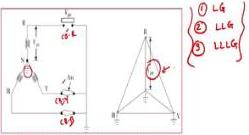
*Figure 36.1: Three-phase CB contacts with neutral earthed and a grounded fault. The voltage across each pole is the phase voltage.*

The physical reasoning is straightforward: with the neutral solidly connected to earth, the faulted phase is clamped to earth potential through the fault path. The healthy phases, while still at their normal phase-to-neutral voltages, do not contribute to the voltage across the first clearing pole because the neutral reference remains fixed. The first pole to clear therefore sees only its own phase voltage, which is the line-to-earth voltage.

#### Case 2: Non-Earthed System, Grounded Fault (L-g, L-L-g, L-L-L-g)

Now consider a system where the neutral is isolated (not earthed). If a ground fault occurs, the system is no longer referenced to earth. The healthy phases' capacitances to earth now form a voltage divider with the fault. This causes the neutral point to shift, and the voltage on the faulted phase can rise. For the first pole to clear, the voltage across its contacts becomes **1.5 times the phase voltage**. This is a significantly higher stress and must be considered in the CB's design.

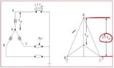
*Figure 36.2: Circuit for a non-earthed system with a grounded fault. The floating neutral leads to higher voltage stress on the first clearing pole.*

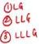
*Figure 36.3: Vector diagram for a non-earthed system with a grounded fault, illustrating the 1.5× phase voltage relationship.*

The vector diagram in Figure 36.3 reveals the mechanism. With the neutral floating, the healthy phase voltages redistribute. The neutral point shifts to a new position, and the voltage across the first clearing pole becomes the vector sum of the phase voltage and the shifted neutral voltage. This geometric addition yields exactly 1.5 times the phase voltage for a solid ground fault on one phase.

#### Case 3: Earthed System, Ungrounded Fault (L-L and L-L-L)

In an earthed system, a fault that does not involve ground (like a line-to-line fault) also creates a higher stress. When the first pole clears, the remaining two phases are still at fault potential. Through the system's inter-phase capacitances and the earthed neutral, the voltage on the clearing phase is pulled up. The result is again **1.5 times the phase voltage** across the contacts of the first pole to clear.

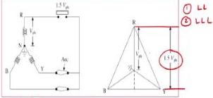
*Figure 36.4: Circuit for an earthed system with an ungrounded fault. The voltage across the first clearing pole is 1.5× the phase voltage.*

**Design Implication:** The circuit breaker contacts must be designed to withstand this maximum prospective voltage, which is 1.5 times the phase voltage in the two more severe cases. This is a fundamental design constraint that influences contact gap spacing, insulation coordination, and the choice of arc-quenching medium.

The three cases are summarized in the table below for quick reference:

| System Earthing | Fault Type | Voltage Across First Pole to Clear |
| :--- | :--- | :--- |
| Earthed | Grounded (L-g, L-L-g, L-L-L-g) | 1.0 × phase voltage |
| Non-earthed | Grounded (L-g, L-L-g, L-L-L-g) | 1.5 × phase voltage |
| Earthed | Ungrounded (L-L, L-L-L) | 1.5 × phase voltage |

### 36.3 Asymmetry of Short Circuit Current

Fault current is not always a pure sinusoid. Depending on the instant of fault inception (the switching angle $\theta$), a DC offset (transient component) may be present. This makes the current waveform asymmetrical.

The instantaneous fault current is given by:

$$i = \frac{E_m}{Z} \left[ e^{-Rt/L} + \sin(\omega t + \theta - \varphi) \right]$$

Where:

- $E_m$ = Peak system EMF (V)
- $Z$ = Total impedance of the fault loop ($\Omega$)
- $R$ = Resistance of the fault loop ($\Omega$)
- $L$ = Inductance of the fault loop (H)
- $\omega$ = Angular frequency (rad/s)
- $\theta$ = Switching angle (rad) - the point on the voltage wave where the fault occurs
- $\varphi$ = Line angle = $\tan^{-1}(X/R)$ (rad)

The term $e^{-Rt/L}$ represents the decaying DC component. Its initial magnitude depends on the switching angle $\theta$. If the fault occurs at the instant when the voltage is at its peak, the DC component is zero and the current is symmetrical. If the fault occurs at a voltage zero crossing, the DC component is at its maximum and the current is fully asymmetrical.

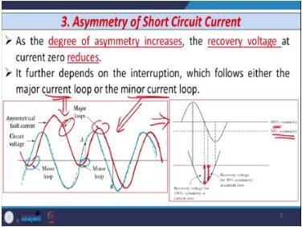
*Figure 36.5: Asymmetrical fault current waveform showing major and minor loops. The degree of asymmetry affects the recovery voltage at current zero.*

**Physical Intuition:** The DC component shifts the entire current waveform. This creates "major" and "minor" loops. If the fault occurs such that the DC offset is large, the current waveform has a large major loop and a small minor loop. The current zero occurs earlier in the minor loop, giving the system less time to recover. As the degree of asymmetry increases, the recovery voltage at the natural current zero **reduces**. This is because the current zero is reached sooner, and the system voltage has not yet built up to its full value.

The relationship between asymmetry and recovery voltage is inverse: higher asymmetry means the current zero is reached earlier in the voltage cycle, so the instantaneous system voltage at that moment is lower. This has a practical consequence: while asymmetrical currents are more stressful from a thermal and mechanical standpoint (higher peak currents), they are actually less stressful from a dielectric recovery standpoint because the recovery voltage is lower.

### 36.4 Short Line Fault (Close-in Fault)

A **short line fault** (or close-in fault) occurs on the transmission line very close to the circuit breaker terminals. This is one of the most severe duties for a CB.

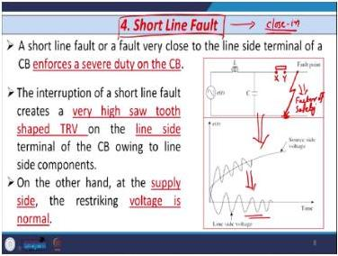
*Figure 36.6: Short line fault circuit and waveforms. The line-side TRV has a characteristic saw-tooth shape.*

**Why is it so severe?** When the CB interrupts the fault, there is a voltage wave that travels along the short line segment between the CB and the fault. This wave reflects back and forth, creating a very steep, saw-tooth shaped TRV on the **line side** of the CB. The **source side** sees a more conventional, less severe TRV. The combination of these two voltages across the CB contacts results in an extremely high RRRV.

The saw-tooth shape arises because the short line segment behaves like a transmission line with a characteristic (surge) impedance. The voltage wave launched at interruption travels to the fault point, reflects with a polarity reversal, and returns to the CB. The round-trip time is very short because the line is short, so the voltage rises and falls rapidly, creating the characteristic saw-tooth pattern.

The RRRV for a short line fault is given by:

$$\text{RRRV} = Z_S \frac{di}{dt}$$

Where:

- $Z_S$ = Surge impedance of the line ($\Omega$)
- $\frac{di}{dt}$ = Rate of change of current at current zero (A/s)

The rate of change of current is:

$$\frac{di}{dt} = \omega \sqrt{2} \times I_F$$

Where:

- $I_F$ = Magnitude of the fault current (A, RMS)

**Consequence:** This steep RRRV can exceed the rate at which the dielectric strength of the CB gap recovers, leading to arc reignition and restriking. The RRRV can reach several kV per microsecond for a fault just 1-2 km from the breaker.

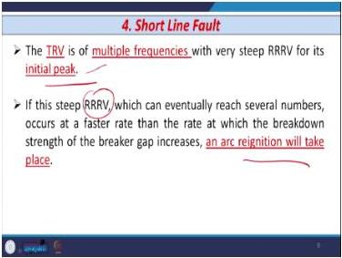
*Figure 36.7: TRV with multiple frequencies and a very steep RRRV, which can lead to arc reignition.*

The short line fault test is considered the most severe test for a CB. It proves the ability of the CB to handle extreme fault conditions and is useful for designing the short-circuit rating of the CB. The factor of safety must be determined, and the short-time rating of the CB must be decided accordingly.

### 36.5 Current Chopping (Interruption of Small Inductive Current)

**Current chopping** is the premature interruption of a small inductive current before its natural zero. This is a common problem when disconnecting unloaded transformers or shunt reactors, which draw a small, lagging magnetizing current.

**The Mechanism:**
1.  The CB attempts to interrupt a small current (e.g., 6.5 A).
2.  Due to the low current, the arc is unstable, and the CB may force the current to zero abruptly—this is the "chop."
3.  At the instant of chopping, the magnetic energy stored in the transformer's inductance ($\frac{1}{2}LI^2$) is suddenly released.
4.  This energy is converted into electrostatic energy ($\frac{1}{2}CV^2$) in the system's capacitance.

The energy balance equation is:

$$\frac{1}{2}LI^2 = \frac{1}{2}CV^2$$

Solving for the voltage across the CB:

$$V = I\sqrt{\frac{L}{C}}$$

Where:

- $I$ = Peak value of the chopped current (A)
- $L$ = Inductance of the circuit (H)
- $C$ = Capacitance of the system (F)

This voltage $V$ is superimposed on the power frequency voltage and can reach dangerously high levels, potentially damaging the transformer or CB insulation.

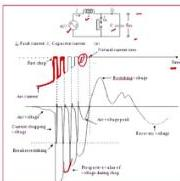
*Figure 36.8: Waveforms of arc current, arc voltage, and restriking voltage during current chopping. Note the successive chops and voltage build-up.*

The waveform in Figure 36.8 illustrates the successive chopping process. The first chop occurs at a relatively high current magnitude, producing a high voltage. If the gap restrikes (because Slepian's or Cassie's conditions are not satisfied), the arc re-establishes and the process repeats. Each successive chop occurs at a lower current magnitude, but the voltage continues to build up. After several chopping instances, the current is finally interrupted, but the voltage across the CB is very high.

**Factors Affecting Voltage Rise:**
- **Rate of Rise of Voltage (RRRV):** A lower RRRV gives the gap more time to de-ionize, allowing a higher overvoltage to build up before a restrike.
- **Effectiveness of Deionization:** The dielectric strength of the interrupting medium (e.g., SF6, vacuum) determines how quickly the gap can withstand voltage.

**CB Types and Chopping:**
- **Self-Blast CBs (Oil, Air-Blast):** Gas pressure is proportional to arc intensity. For small currents, the pressure is low, so interruption is slow, and chopping is less severe.
- **Forced Blast CBs (SF6, Air-Blast):** Gas pressure is independent of current. The arc is forcibly cooled, leading to rapid interruption and a high propensity for current chopping.
- **Vacuum CBs:** The arc is very stable at low currents, so the number of chops is very low. They are preferred for interrupting small inductive currents.

### 36.6 Worked Example: Current Chopping in a Power Transformer

**Problem:** A circuit breaker is used to disconnect a 220 kV/132 kV, 250 MVA, 50 Hz power transformer at no-load. The no-load current is 1% of the full-load current, and the system capacitance is 10,000 pF/phase. Find the worst-case overvoltage induced across the CB contacts.

**Solution:**

**Step 1: Calculate the rated (full-load) current of the transformer.**
$$I_r = \frac{S}{\sqrt{3} \times V} = \frac{250 \times 10^6}{\sqrt{3} \times 220 \times 10^3} = 656.08 \text{ A}$$

**Step 2: Calculate the no-load current.**
$$I_{NL} = 0.01 \times I_r = 0.01 \times 656.08 = 6.56 \text{ A}$$

**Step 3: Calculate the no-load reactance.**
$$X_0 = \frac{V_{phase}}{I_{NL}} = \frac{220 \times 10^3 / \sqrt{3}}{6.56} = 19.36 \times 10^3 \ \Omega$$

**Step 4: Calculate the no-load inductance.**
$$L_0 = \frac{X_0}{2\pi f} = \frac{19.36 \times 10^3}{2\pi \times 50} = 61.66 \text{ H}$$

**Step 5: Calculate the voltage across the CB.**
The current in the formula is the peak value of the chopped current.
$$V_{CB} = I_{peak} \sqrt{\frac{L_0}{C}} = (\sqrt{2} \times 6.56) \times \sqrt{\frac{61.66}{10,000 \times 10^{-12}}}$$
$$V_{CB} = 9.28 \times \sqrt{6.166 \times 10^9} = 9.28 \times 78,523.6 = 728.7 \text{ kV}$$

**Conclusion:** The calculated overvoltage of **728.7 kV** is far greater than the breaker's expected withstand voltage of approximately $\sqrt{2} \times 220/\sqrt{3} \approx 180$ kV (or even 300 kV with margin). This demonstrates that without proper protection (like surge arresters or resistance switching), the CB and transformer would be severely damaged.

### 36.7 Worked Example: RRRV for a Short Line Fault

**Problem:** A 400 kV, 50 Hz transmission line has a surge impedance of 350 Ω. A short line fault occurs 2 km from the circuit breaker. The fault current is 40 kA (RMS). Calculate the RRRV at the instant of current zero.

**Solution:**

**Step 1: Calculate the rate of change of current at current zero.**
$$\frac{di}{dt} = \omega \sqrt{2} \times I_F = 2\pi \times 50 \times \sqrt{2} \times 40,000$$
$$\frac{di}{dt} = 314.16 \times 1.414 \times 40,000 = 17.77 \times 10^6 \text{ A/s} = 17.77\,\text{A}/\mu\text{s}$$

**Step 2: Calculate the RRRV.**
$$\text{RRRV} = Z_S \times \frac{di}{dt} = 350 \times 17.77 \times 10^6$$
$$\text{RRRV} = 6.22 \times 10^9 \text{ V/s} = 6.22\,\text{kV}/\mu\text{s}$$

**Conclusion:** The RRRV is 6.22 kV/μs. This is an extremely steep voltage rise. For comparison, a typical SF6 CB gap can recover dielectric strength at a rate of 5-10 kV/μs. This value is at the margin, explaining why short line faults are so severe and why CBs must be specifically designed and tested for this duty.

### 36.8 Lecture 36 Recap

- The voltage across CB contacts at interruption depends on the fault type and system earthing. It is **1.5× phase voltage** for non-earthed systems with ground faults and earthed systems with ungrounded faults, but only **1× phase voltage** for earthed systems with ground faults.
- Asymmetrical fault current has a DC component that reduces the recovery voltage at current zero.
- A **short line fault** produces a saw-tooth TRV with a very high RRRV, making it a severe test for a CB.
- **Current chopping** of small inductive currents converts magnetic energy into a high-voltage electrostatic surge, calculated by $V = I\sqrt{L/C}$.
- Vacuum CBs are preferred for small inductive currents due to their low chopping tendency.

---

## Lecture 37: Arc Interruption Theory in Circuit Breaker - IV

### 37.1 Physical Intuition: The Trap Charge

While inductive currents are chopped before zero, capacitive currents are interrupted at a natural current zero. However, they present a different problem: **voltage escalation**. When a CB opens to interrupt a capacitive current (e.g., an unloaded transmission line or capacitor bank), the capacitor is left with a trapped charge at its peak voltage. This trapped charge acts as a DC offset, causing the voltage across the CB contacts to build up to twice the peak system voltage. If the gap restrikes, the voltage can escalate even further.

The fundamental difference between inductive and capacitive interruption lies in the energy storage element. An inductor stores energy in a magnetic field, and the current cannot change instantaneously. A capacitor stores energy in an electric field, and the voltage cannot change instantaneously. When interrupting an inductive current, the problem is the sudden release of magnetic energy. When interrupting a capacitive current, the problem is the trapped charge that holds the capacitor voltage at its last value while the supply voltage continues to oscillate.

### 37.2 Interruption of Capacitive Current

Consider a CB interrupting a capacitive load. The voltage across the CB is:

$$V_{CB} = V_S - V_C$$

Where:

- $V_S$ = Supply voltage (V)
- $V_C$ = Capacitor voltage (V)

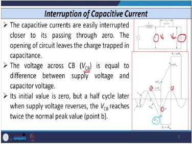
*Figure 37.1: Circuit and waveforms for capacitive current interruption. The trapped charge on the capacitor causes the CB voltage to rise to 2× the peak voltage.*

**The Sequence:**
1.  At point A, the current is zero, and the CB opens. The capacitor is charged to the peak supply voltage $+V_m$. The voltage across the CB is zero.
2.  The supply voltage reverses and goes to its negative peak $-V_m$ (point 2). The capacitor still holds its charge at $+V_m$. The voltage across the CB is now $V_{CB} = -V_m - (+V_m) = -2V_m$.
3.  This is a high stress on the CB gap. If the gap's dielectric strength is insufficient, it will restrike.

**Restriking and Voltage Escalation:**
If a restrike occurs, the circuit is reclosed. The capacitor voltage will oscillate at a high frequency around the supply voltage. At the moment of restrike (when $V_S = -V_m$), the capacitor voltage will swing from $+V_m$ towards $-V_m$, but it will overshoot to $-3V_m$ due to the oscillation.

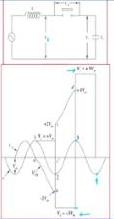
*Figure 37.2: Voltage escalation due to repeated restrikes. The voltage can double every half cycle.*

If the arc extinguishes again at the next current zero, the capacitor will be trapped at $-3V_m$. In the next half cycle, the supply goes to $+V_m$, and the CB voltage becomes $V_{CB} = +V_m - (-3V_m) = +4V_m$. This process can repeat, causing the voltage to escalate by $2V_m$ every half cycle. In practice, system resistance and damping limit this escalation, but it can still reach dangerously high values.

The escalation mechanism can be understood as a resonant charging process. Each restrike reconnects the capacitor to the source, and the high-frequency oscillation overshoots the target voltage. When the arc extinguishes at the next current zero, the capacitor is trapped at this overshoot value. The next half cycle adds another $2V_m$ to the CB voltage. Without damping, this would continue indefinitely, but system resistance and the finite dielectric strength of the gap eventually limit the process.

**Restrike-Free CBs:**
A restrike-free CB (like a modern vacuum CB) will not restrike. The voltage across the CB will simply rise to $V_m$ and stay there, as shown in Figure 37.3.

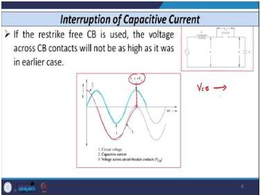
*Figure 37.3: Waveform for a restrike-free CB. The voltage across the CB is limited to the peak system voltage.*

### 37.3 Resistance Switching

**Resistance switching** is a technique used to mitigate the severe voltage transients (TRV, RRRV) and current chopping. A resistor is connected in parallel with the CB contacts.

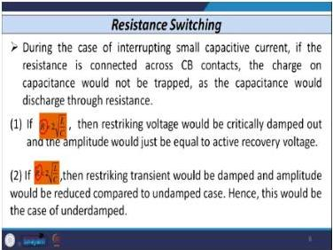
*Figure 37.4: Circuit diagram for resistance switching. A resistor R is connected in parallel with the CB contacts.*

**How it works:**
1.  When the CB contacts part, the main arc is established.
2.  The resistor provides an alternative path for the current, damping the high-frequency oscillations of the TRV.
3.  The resistor also helps to drain the trapped charge on capacitors and limit the voltage build-up from current chopping.

**Selection of Resistance Value:**
The critical damping resistance is given by:

$$R = 2\sqrt{\frac{L}{C}}$$

- **Underdamped ($R < 2\sqrt{L/C}$):** The TRV is oscillatory but damped. The amplitude is reduced.
- **Critically Damped ($R = 2\sqrt{L/C}$):** The TRV rises to the recovery voltage with no overshoot.
- **Overdamped ($R > 2\sqrt{L/C}$):** The TRV rises slowly to the recovery voltage without any peak. **This is the value used in practice** because it eliminates the first peak of the RRRV, making the TRV much less severe.

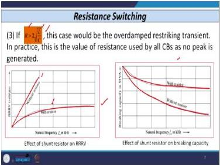
*Figure 37.5: Graphs showing the effect of resistance switching on RRRV and breaking capacity. With a resistor, RRRV is reduced and breaking capacity is improved.*

**Effect on Breaking Capacity:** By reducing the RRRV, the arc is less likely to restrike. This allows the CB to interrupt a higher current successfully, effectively increasing its breaking capacity.

The graphs in Figure 37.5 show two important relationships. First, without a resistor, RRRV increases with the natural frequency of the circuit. With a resistor, RRRV becomes steady after a certain point, remaining well below the no-resistor case. Second, without a resistor, breaking capacity decreases as natural frequency increases. With a resistor, breaking capacity remains high and relatively constant. Both effects demonstrate the protective value of resistance switching.

### 37.4 Ratings of Circuit Breakers

The ratings of a CB define its capabilities and limits. They are crucial for proper selection and application.

#### Rated Current and Rated Voltage
- **Rated Current:** The highest RMS current the CB can carry continuously without exceeding the temperature rise limits specified by standards.
- **Rated Voltage:** The maximum RMS voltage for which the CB is designed. It is the highest voltage of the system where the CB can be used.

#### Rated Breaking Capacity
The breaking capacity is defined at a specific time after fault inception, typically **1.5 cycles**. This is because the DC component of the fault current decays rapidly (within ~4 cycles), and the relay and CB take about 1-1.5 cycles to operate. The breaking current is the current flowing through the CB at the instant of contact separation.

There are two types of breaking current:

1.  **Symmetrical Breaking Current:** The RMS value of the AC component of the current at the instant of contact separation.
    $$I_{\text{sym}} = \frac{XY}{\sqrt{2}}$$
    Where $XY$ is the peak-to-peak value of the AC component.

2.  **Asymmetrical Breaking Current:** The RMS value of the total current, including both the AC and DC components.
    $$I_{\text{asym}} = \sqrt{\left(\frac{XY}{\sqrt{2}}\right)^2 + (YZ)^2}$$
    Where $YZ$ is the value of the DC component at the instant of contact separation.

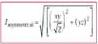
*Figure 37.6: Waveform for determining the symmetrical breaking current.*

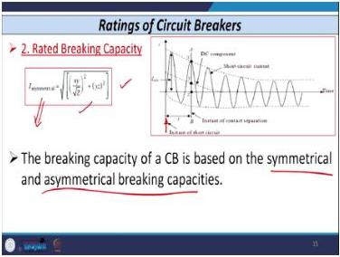
*Figure 37.7: Waveform for determining the asymmetrical breaking current.*

The **Breaking Capacity** in MVA is:

$$\text{Breaking Capacity} = \sqrt{3} \times V \times I \text{ (MVA)}$$

Where $V$ is the rated line voltage (kV) and $I$ is the rated breaking current (kA).

#### Rated Making Capacity
The **making capacity** is the peak value of the current (including the DC component) that the CB can close into without being damaged. It is defined for the first cycle after closure.

$$\text{Making Capacity} = \sqrt{2} \times \rho \times \text{Symmetrical Breaking Capacity}$$

Where $\rho$ is the asymmetry factor (typically 1.5 to 2, often 1.8).

**Why is Making Capacity > Breaking Capacity?**
- Making capacity is measured at the first peak of the fault current (~1 cycle), where the DC component is at its maximum.
- Breaking capacity is measured at contact separation (~2.5 cycles), where the DC component has decayed.
- Therefore, the making current is always higher. A typical value is $I_{mk} \approx 2.55$ to $2.6 \times I_{\text{sym}}$.

The physical reason for this difference is the electromagnetic forces at closure, which are proportional to the square of the peak instantaneous current. The CB must be mechanically robust enough to close and latch against these forces. Since the DC component is at its maximum during the first cycle, the peak current is highest at closure, making the making capacity the more demanding mechanical duty.

#### Short Time Rating
The **short-time rating** is the RMS value of the current that the CB can carry for a specified duration (e.g., 1 or 3 seconds) with the contacts fully closed, without damage. This ensures the CB can withstand the fault current while waiting for a delayed trip command (e.g., for backup protection coordination).

#### Rated Standard Duty Cycle
The standard duty cycle defines the sequence of operations the CB must be able to perform. The standard is:

$$\text{O - t - CO - t' - CO}$$

- **O** = Opening operation
- **t** = Time interval (15 s for non-rapid reclosing, 0.3 s for rapid reclosing)
- **CO** = Closing followed immediately by an opening operation
- **t'** = Time interval (3 minutes)
- **CO** = Closing followed immediately by an opening operation

### 37.5 Worked Example: Calculating CB Ratings

**Problem:** A 132 kV, three-phase, 50 Hz system has a symmetrical breaking current of 40 kA. The maximum asymmetry factor is 1.8. Calculate:
(a) The asymmetrical breaking current.
(b) The making capacity in MVA.
(c) The breaking capacity in MVA.

**Solution:**

**(a) Asymmetrical Breaking Current:**
The asymmetrical breaking current is the RMS value of the total current. Assuming the DC component is at its maximum, we can approximate it using the asymmetry factor $\rho$. The peak of the asymmetrical current is $\sqrt{2} \times \rho \times I_{\text{sym}}$. The RMS value of the asymmetrical current is this peak divided by $\sqrt{2}$.
$$I_{\text{asym}} = \rho \times I_{\text{sym}} = 1.8 \times 40 \text{ kA} = 72 \text{ kA}$$

**(b) Making Capacity:**
$$\text{Making Capacity} = \sqrt{2} \times \rho \times \text{Symmetrical Breaking Capacity}$$
First, find the symmetrical breaking capacity in MVA:
$$S_{\text{break}} = \sqrt{3} \times 132 \text{ kV} \times 40 \text{ kA} = 9145 \text{ MVA}$$
Now, calculate the making capacity:
$$\text{Making Capacity} = \sqrt{2} \times 1.8 \times 9145 \text{ MVA} = 23,278 \text{ MVA}$$

**(c) Breaking Capacity:**
$$\text{Breaking Capacity} = \sqrt{3} \times V \times I = \sqrt{3} \times 132 \times 40 = 9145 \text{ MVA}$$

### 37.6 Worked Example: Symmetrical and Asymmetrical Breaking Current from a Waveform

**Problem:** At the instant of contact separation, the AC component of the fault current has a peak-to-peak value (XY) of 56.57 kA. The DC component (YZ) at that instant is 10 kA. Calculate the symmetrical and asymmetrical breaking currents.

**Solution:**

**Step 1: Symmetrical breaking current.**
$$I_{\text{sym}} = \frac{XY}{\sqrt{2}} = \frac{56.57}{1.414} = 40 \text{ kA}$$

**Step 2: Asymmetrical breaking current.**
$$I_{\text{asym}} = \sqrt{\left(\frac{XY}{\sqrt{2}}\right)^2 + (YZ)^2} = \sqrt{40^2 + 10^2}$$
$$I_{\text{asym}} = \sqrt{1600 + 100} = \sqrt{1700} = 41.23 \text{ kA}$$

**Conclusion:** The symmetrical breaking current is 40 kA, and the asymmetrical breaking current is 41.23 kA. The difference is relatively small because the DC component has decayed significantly by the time of contact separation (1.5 cycles after fault inception).

### 37.7 Lecture 37 Recap

- Capacitive current interruption leaves a trapped charge, leading to a voltage of $2V_m$ across the CB. Restrikes can cause voltage escalation by $2V_m$ every half cycle.
- **Resistance switching** uses a parallel resistor to damp TRV oscillations. An overdamped value ($R > 2\sqrt{L/C}$) is used in practice to eliminate the first peak of RRRV.
- **Breaking capacity** is defined at contact separation (~1.5 cycles) and can be symmetrical (AC only) or asymmetrical (AC + DC).
- **Making capacity** is defined for the first cycle after closure and is always greater than breaking capacity.
- The **standard duty cycle** is O - t - CO - t' - CO.

---

## Lecture 38: Types of Circuit Breaker

### 38.1 Physical Intuition: The Arc Quenching Medium

The fundamental challenge of a circuit breaker is to quench the electric arc that forms between its contacts when interrupting current. Different CB technologies are defined by the medium they use to cool, lengthen, and de-ionize this arc. The choice of medium determines the voltage range, current rating, speed, cost, and maintenance requirements of the CB.

The arc is a plasma of ionized gas with extremely high temperature and conductivity. To interrupt the current, the CB must transform this conducting plasma into a non-conducting dielectric gap. This requires removing the free electrons and ions from the gap faster than they are being generated. The arc-quenching medium accomplishes this through various mechanisms: cooling (reducing thermal ionization), lengthening (increasing arc resistance), and de-ionization (absorbing free electrons).

### 38.2 Functions of HV and LV Circuit Breakers

**High Voltage (HV) CBs** (above 11 kV) operate in conjunction with protective relays, CTs, and PTs. Their functions include:
- Providing isolation between the main circuit and the source.
- Interrupting short circuit currents.
- Withstanding normal load currents.
- Opening contacts within a predetermined time (1.5-2.5 cycles).
- Closing under faulty conditions without restrike.

**Low Voltage (LV) CBs** (up to 415 V) are simpler devices installed directly in the field. They do not require complex pilot devices or tripping mechanisms. Their main function is to break short circuit currents or withstand overload currents.

### 38.3 Low Voltage Circuit Breakers

#### Switch
A simple electromechanical, manually operated device for making and breaking a circuit. It allows current to flow when closed and interrupts it when opened.

#### Fuse
A device that melts a metallic filament when excessive current flows, isolating the circuit. It works on the heating principle:

$$H = I^2Rt$$

Where:
- $I$ = Current (A)
- $R$ = Resistance of the filament ($\Omega$)
- $t$ = Time (s)

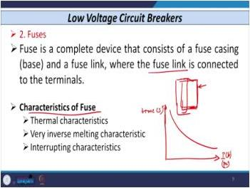
*Figure 38.1: Time-current characteristic of a fuse. Higher currents cause faster melting.*

The fuse has three main characteristics: thermal, melting, and interrupting. The time-current characteristic shown in Figure 38.1 is inverse—higher currents cause faster melting. This makes the fuse a simple and effective overcurrent protection device, but it has significant limitations.

**Disadvantages of Fuses:**
- Must be replaced after each operation.
- Slow operation.
- Power loss due to heat.
- No protection against overvoltages or lightning.

#### Miniature Circuit Breaker (MCB)
An MCB provides protection against overcurrents and short circuits. It has two operating principles:
1.  **High Current (Short Circuit):** A solenoid produces a strong magnetic field that trips the mechanism immediately.
2.  **Moderate Overcurrent:** A bimetallic strip heats up, bends, and trips the mechanism after a time delay.

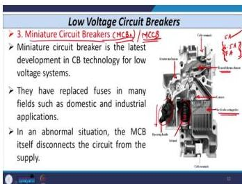
*Figure 38.2: Construction of a Miniature Circuit Breaker (MCB).*

The MCB combines both thermal and magnetic protection in a single device. The bimetallic strip provides time-delayed protection against sustained overloads, while the solenoid provides instantaneous protection against short circuits. This dual characteristic makes the MCB suitable for a wide range of low-voltage applications.

**Disadvantages of MCBs:**
- Susceptible to changes in environmental temperature.
- Cannot be reset immediately after tripping (must cool down).
- React more slowly to overloads than some other devices.

#### Earth Leakage Circuit Breaker (ELCB) / Residual Current Circuit Breaker (RCCB)
An ELCB protects against electrical shock by detecting leakage current to earth. It compares the current in the live and neutral wires. If there is a difference (leakage), it trips.

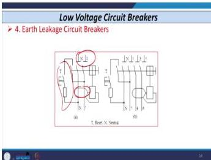
*Figure 38.3: Connection diagram for an ELCB. It detects the imbalance between live and neutral currents.*

The ELCB operates on the principle of current balance. Under normal conditions, the current in the live and neutral conductors is equal and opposite, producing no net magnetic flux in the sensing transformer. When leakage current flows to earth (through a person or faulty insulation), the currents become unbalanced, and the resulting flux trips the mechanism.

**Disadvantages of ELCBs:**
- Requires a third additional wire from the load.
- Separate devices cannot be grounded individually.
- The additional earth connection can be disabled.

### 38.4 High Voltage Circuit Breakers

#### Air Circuit Breaker (Air Break / Air Blast)
Air is used as the arc quenching medium. The arc is lengthened and cooled to increase its resistance.

- **Arc Splitter:** Splits the arc into several smaller arcs, which are easier to cool and quench.
- **Magnetic Blow:** A magnetic field or air blast lengthens the arc.

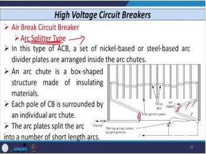
*Figure 38.4: Arc splitter method for increasing arc resistance.*

The arc splitter works by dividing the single arc into multiple smaller arcs in series. Each sub-arc has a lower temperature and is easier to cool. The total arc voltage is the sum of the individual sub-arc voltages, so the arc resistance increases substantially. The magnetic blow method uses a magnetic field to force the arc to travel through a longer path, increasing its length and resistance.

**Disadvantages:**
- Requires a separate air compressor.
- Very noisy.
- Not capable of interrupting small inductive currents (restriking).
- Almost obsolete.

#### Oil Circuit Breaker
Oil is used as the arc quenching medium. The dielectric strength of oil is 6-8 times that of air. The arc vaporizes the oil, creating a bubble of hydrogen gas that cools and de-ionizes the arc.

**Disadvantages:**
- Oil decomposes and becomes polluted with carbon, reducing its dielectric strength.
- Requires periodic maintenance (oil replacement).
- Decomposed products are inflammable.
- Risk of explosion if it fails to break the fault current.

#### SF6 Circuit Breaker
SF6 gas is used as the arc quenching medium. SF6 is an **electronegative gas**, meaning it absorbs free electrons. This makes it excellent at de-ionizing the arc plasma.

- **Non-Puffer Type:** The arc heats the SF6 gas, increasing its pressure. The pressurized gas is then forced through a nozzle to quench the arc.
- **Puffer Type:** A mechanical piston compresses the SF6 gas and forces it through the arc.

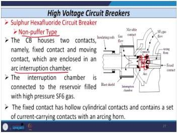
*Figure 38.5: Construction of a non-puffer type SF6 circuit breaker.*

SF6 gas has several remarkable properties: it is five times heavier than air, colorless and odorless, non-toxic (though its decomposition products SF2 and SF4 are toxic), non-inflammable, and has a dielectric strength almost 2.5 times that of oil. The electronegative nature of SF6 means it readily absorbs free electrons, which is the key to its arc-quenching capability. When the arc forms, SF6 gas rushes in by force, absorbs the free electrons from the ionized air, and the ionized air becomes de-ionized, allowing the arc to be easily quenched at natural current zero.

**Disadvantages:**
- SF6 decomposition products (SF2, SF4) are toxic.
- SF6 is heavier than air and can cause suffocation if it escapes.
- Moisture can react with SF6 to form harmful byproducts.
- Requires special care for handling and maintenance.

#### Vacuum Circuit Breaker
Vacuum is used as the arc quenching medium. The contacts are sealed in a vacuum envelope. The arc is extinguished very quickly because the vacuum has a very high dielectric strength and the arc plasma rapidly diffuses into the vacuum.

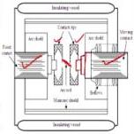
*Figure 38.6: Construction of a vacuum circuit breaker.*

The vacuum interrupter consists of a pair of contacts hermetically sealed in a vacuum envelope. The actuating motion is transmitted through bellows to the movable contact. When the contacts separate, an arc forms between them, but the vacuum rapidly diffuses the arc plasma, and the high dielectric strength of the vacuum prevents re-ignition. The contact material is typically an oxygen-free copper-chromium alloy, which is accepted as the best material for high-voltage vacuum CBs.

**Disadvantages:**
- Loss of vacuum makes the interrupter useless and cannot be repaired on site.
- May require surge suppressors for interrupting low magnetizing currents (current chopping).
- Uneconomical above 36 kV (though usable up to 132 kV). SF6 is more economical for EHV systems.

### 38.5 Worked Example: Selecting a CB Type

**Problem:** A utility needs to install a new CB for a 400 kV transmission line. The line has a high charging current (capacitive) and is connected to a large transformer bank. Which type of CB is most suitable, and why?

**Solution:**
For a 400 kV EHV system, the most suitable choice is an **SF6 circuit breaker**.

- **Voltage Rating:** Vacuum CBs are uneconomical above 36 kV. SF6 CBs are the standard for EHV systems (above 230 kV).
- **Capacitive Current:** SF6 CBs can be designed to be restrike-free, which is crucial for interrupting the high charging current of a long transmission line without causing voltage escalation.
- **Inductive Current:** SF6 CBs can be equipped with opening resistors to manage the TRV when interrupting the magnetizing current of the transformer, preventing damage from current chopping.

### 38.6 Worked Example: Fuse Sizing for a Domestic Circuit

**Problem:** A domestic circuit is protected by a fuse. The circuit supplies a 2 kW electric heater and a 1 kW iron, both operating at 230 V. The fuse element has a resistance of 0.05 Ω. Calculate the heat generated in the fuse element when both appliances are operating.

**Solution:**

**Step 1: Calculate the total current.**
$$I = \frac{P_{total}}{V} = \frac{2000 + 1000}{230} = \frac{3000}{230} = 13.04 \text{ A}$$

**Step 2: Calculate the heat generated per second.**
$$H = I^2Rt = (13.04)^2 \times 0.05 \times 1 = 170.04 \times 0.05 = 8.5 \text{ J/s}$$

**Conclusion:** The fuse element generates 8.5 J of heat per second under normal operating conditions. This heat is dissipated to the surroundings, keeping the fuse below its melting point. If a fault causes the current to rise to, say, 50 A, the heat generated would be $(50)^2 \times 0.05 = 125$ J/s—nearly 15 times higher—causing the fuse to melt quickly.

### 38.7 Lecture 38 Recap

- LV CBs (fuse, MCB, ELCB) are simple, self-contained devices for low-voltage applications.
- HV CBs (air, oil, SF6, vacuum) use different media to quench the arc and are used at higher voltages.
- **SF6** is the dominant technology for EHV systems due to its excellent dielectric strength and arc-quenching properties.
- **Vacuum** is preferred for medium voltage (up to 132 kV) due to its simplicity and low maintenance.
- The choice of CB depends on voltage, current, fault duty, and the nature of the load (capacitive, inductive).

---

## Lecture 39: Testing, Commissioning and Maintenance of Relays - I

### 39.1 Physical Intuition: The Idle Guardian

A protective relay is a sentinel that may operate only a handful of times in its entire life. It sits idle, monitoring currents and voltages, waiting for a fault. This inactivity makes testing absolutely critical. We cannot simply wait for a fault to see if the relay works. We must artificially inject signals to verify that it will operate correctly, quickly, and selectively when the real event occurs.

Consider a relay with a 10-year lifespan. It may operate hardly 10-20 times in that period. For the rest of the time, it does nothing. Yet when a fault occurs, it must operate correctly on the first attempt—there is no second chance. This is why testing is not just important; it is essential. The relay must:
- Operate only in fault conditions
- Not operate in normal conditions (no fault)
- Not operate during external faults (abnormal conditions)

### 39.2 Importance and Precautions in Relay Testing

**Why is testing crucial?**
- Relays must operate only during faults, not during normal or external fault conditions.
- They must operate within their specified time to clear faults before damage occurs.
- Digital relays have complex circuitry that requires rigorous testing.

**Key Precautions:**
- Testing must be done by a skilled person who understands both the relay and the test kit.
- **CT Secondary Safety:** The most critical precaution. An open-circuited CT secondary can develop a dangerously high voltage. When removing a relay, the CT secondary must be shorted first. Modern relays have a **CT shorting switch** that does this automatically.

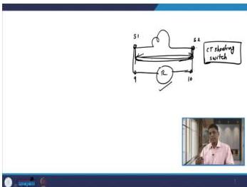
*Figure 39.1: Overcurrent relay connected to a CT. The CT shorting switch must be used when removing the relay.*

The CT shorting switch is a life-safety device. When the relay is removed from the panel, the CT secondary is automatically short-circuited, preventing the dangerous voltage build-up that would occur if the secondary were left open. This is non-negotiable safety practice.

### 39.3 The Three Categories of Relay Tests

1.  **Type Test:** Performed by the manufacturer on every relay design to prove it meets the relevant standards.
2.  **Commissioning and Acceptance Test:** Performed to verify the relay is correctly installed and functioning as per the purchase order. Acceptance tests are at the manufacturer's premises; commissioning tests are at the customer's site.
3.  **Routine Maintenance Test:** Performed periodically by the customer to ensure the relay continues to function correctly over its lifetime.

### 39.4 The Eight Type Tests

Type tests are comprehensive and are performed on each relay design. The eight tests are:

| No. | Test Name | Purpose |
| :--- | :--- | :--- |
| 1 | Operating Value Test | Verify the relay operates at the correct value of the operating quantity. |
| 2 | Operating Time Test | Verify the relay operates within the specified time for a given input. |
| 3 | Reset Value Test | Verify the relay resets at the correct percentage of the set value. |
| 4 | Reset Time Test | Verify the time taken for the relay to reset. |
| 5 | Temperature Rise Test | Verify the insulation can withstand the heat generated. |
| 6 | Contact Capacity Test | Verify the contacts can make and break the trip circuit current. |
| 7 | Overload Test | Verify the relay can withstand high currents without damage. |
| 8 | Mechanical Test | Verify the mechanical integrity of moving parts (electromechanical relays only). |

#### Type Test 1: Operating Value Test
The operating quantity (current, voltage, power, etc.) is applied, and the value at which the relay operates is noted. The relay must be **completely reset** before each reading.

The operating quantity depends on the relay type: current for overcurrent relays, voltage for overvoltage/undervoltage relays, power for low forward power relays, and frequency for frequency relays.

**Permissible Limits:**
- Voltage: ±10% of nominal value.
- Current: 90% to 110% of nominal value.

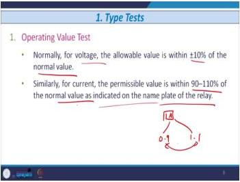
*Figure 39.2: Permissible limits for the operating value test.*

**Critical precaution:** The relay must be completely reset before taking the next reading. If the relay has only partially returned to its original position, the next reading will be incorrect.

#### Type Test 2: Operating Time Test
The operating time is the time from when the relay coil is energized to when the relay contact operates. For inverse overcurrent relays, this is measured for different Plug Setting Multipliers (PSMs) and Time Dial Settings (TDS).

The test procedure involves obtaining operating times for different values of PSM (ranging from 2 to 20 in steps of 1) and TDS (ranging from 0 to 1 in steps of 0.05). The results are compared against the nameplate graph.

**Permissible Deviations:**
- PSM 2 to 4: 12.5%
- PSM 4 to 20: 7.5%
- For DMT relays: ±5% up to 0.1 s.

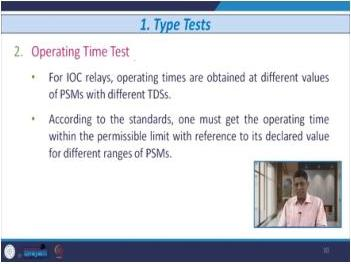
*Figure 39.3: Circuit for measuring the operating time of a relay.*

#### Type Test 3: Reset Value Test
The relay is set to operate, and then the actuating quantity is slowly reduced. The value at which the relay **just fails to operate** is the reset value. It is expressed as a percentage of the set value.

The procedure is: set the operating quantity such that the relay remains always in operating condition, then change the actuating quantity (current, voltage, power, or frequency) and note the value at which the relay just fails to operate.

#### Type Test 4: Reset Time Test
The time taken for the relay contacts to return to their normal state after the actuating quantity is removed. The ratio of resetting time to operating time should be as high as possible.

For an electromechanical relay, the disc starts moving when a fault occurs, causing the relay to operate. When the current is discontinued, the disc returns to its original position. The reset time is the time required for the disc to return from the operated position to the original position.

#### Type Test 5: Temperature Rise Test
The rated current is passed through the relay, and the temperature rise is measured. For voltage relays, 110% of the nominal voltage is applied. For two-input relays (distance, directional), both current and voltage are applied.

The purpose is to check the withstand capability of the insulation used in the relay with reference to temperature rise. For overcurrent relays, the rated current is passed through the relay. For voltage-based relays, 10% higher than the nominal value is applied. For two-input relays, both current and voltage quantities are applied to the respective coils until the relay circuit attains ambient temperature.

#### Type Test 6: Contact Capacity Test
Relay contacts must be able to make and break the trip circuit current. The test uses **inductive loading** at a low power factor (0.4 lagging) to simulate the actual trip coil. The time constant is 2-3 cycles, and operations are repeated every 25-30 seconds.

The relay contacts must actuate the trip coil of the circuit breaker (52-TC), so they must possess high volt-ampere (VA) capacity. The manufacturer must define the number of making/breaking operations. Per IEC standards, the breaking capacity is decided considering inductive loading at a very low power factor (0.4 lagging), with a very small time constant of 2-3 cycles, and the making and breaking process is repeated within a short time span of 25-30 seconds between successive operations.

#### Type Test 7: Overload Test
For inverse overcurrent relays, **20 times the plug setting current** is injected with TDS at maximum. For thermal relays, it is 8-10 times the plug setting. This verifies the continuous current-carrying capacity of the coil and contacts.

For IOC (Inverse Overcurrent) relays, 20 times the plug setting current (pickup value) is injected into the relay coil with TDS set at maximum (TDS = 1). The continuous current-carrying capacity is checked, and several operations are performed with averaging. For thermal relays, the same procedure is repeated at 8-10 times the plug setting. For two-input relays (distance, directional), 20 times the plug setting is injected into the current coil, and the rated voltage is applied to the voltage coil.

#### Type Test 8: Mechanical Test
This test is **only for electromechanical relays**. Double the plug setting current is injected, and several hundred operations are performed. The moving parts must be in proper condition after the test.

For current-based relays, double the plug setting current is injected into the current coil at maximum TDS (TDS = 1). For voltage-based relays, the rated voltage is applied to the voltage coil. After several hundred operations, the moving parts must be in proper condition without any damage.

### 39.5 Worked Example: Operating Value Test

**Problem:** A numerical overcurrent relay has a nominal current of 1 A and a plug setting of 100%. During a type test, the relay operates at 1.08 A. Does it pass the operating value test?

**Solution:**
The permissible range for current is 90% to 110% of the nominal value.
- Lower limit: 0.9 × 1 A = 0.9 A
- Upper limit: 1.1 × 1 A = 1.1 A

The relay operated at 1.08 A, which is within the range of 0.9 A to 1.1 A.

**Conclusion:** Yes, the relay passes the operating value test.

### 39.6 Worked Example: Operating Time Test Deviation

**Problem:** An inverse overcurrent relay has a declared operating time of 2.0 seconds at PSM 3 and TDS 1. During testing, the measured operating time is 2.2 seconds. Does the relay pass the operating time test?

**Solution:**

**Step 1: Determine the permissible deviation.**
For PSM 2 to 4, the permissible deviation is 12.5%.

**Step 2: Calculate the permissible range.**
- Upper limit: 2.0 × 1.125 = 2.25 s
- Lower limit: 2.0 × 0.875 = 1.75 s

**Step 3: Compare the measured value.**
The measured time of 2.2 s falls within the range of 1.75 s to 2.25 s.

**Conclusion:** Yes, the relay passes the operating time test at this PSM.

### 39.7 Lecture 39 Recap

- Relay testing is critical because relays operate so rarely.
- The three test categories are type, commissioning/acceptance, and routine maintenance.
- The eight type tests verify all aspects of relay performance, from operating value to mechanical integrity.
- The mechanical test is only for electromechanical relays.
- CT secondary safety is paramount when testing.

---

## Lecture 40: Testing, Commissioning and Maintenance of Relays - II

### 40.1 Physical Intuition: From Factory to Field

Type tests prove the relay design is sound. But the relay must still survive transportation, be installed correctly, and continue to work for years in a harsh substation environment. Commissioning tests verify the installation, and routine maintenance tests catch the slow deterioration caused by vibration, dampness, and heat.

The journey of a relay from the factory to the substation is fraught with hazards. It may be dropped during loading, subjected to vibration during transport, exposed to moisture in storage, and installed incorrectly by tired technicians. Commissioning tests catch these problems before the relay is placed in service. Once in service, the relay faces continuous vibration, temperature cycling, humidity, and electrical stress. Routine maintenance tests catch the slow deterioration that these factors cause.

### 40.2 Commissioning and Acceptance Tests

**Purpose:**
1.  Ensure no transit damage.
2.  Ensure correct installation.
3.  Verify the protection system works as per design and purchase order.
4.  Generate reference data for future testing.

**Acceptance tests** are done at the manufacturer's premises, while **commissioning tests** are done at the customer's premises.

### 40.3 The Five Commissioning Tests

#### Commissioning Test 1: Insulation Resistance Test
- All earth connections are removed.
- A **megger (500 V or 1000 V)** is used to measure the insulation resistance of the CT circuit and wiring to earth.
- The ideal value is approximately **5 megaohm**.
- This value is recorded as a baseline to detect future deterioration.

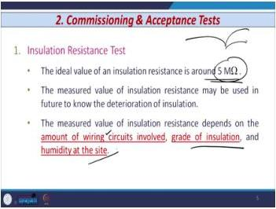
*Figure 40.1: Measuring insulation resistance with a megger.*

The measured insulation resistance depends on several factors: the type of wiring circuit, the insulation class/grade used, and the humidity at the installation location (dry vs. hilly/plain areas). The recorded value serves as a baseline. Future measurements are compared to this baseline to detect deterioration over time (e.g., after 2, 4, or 6 years).

#### Commissioning Test 2: Secondary Injection Test
- A test kit injects a precise current into the relay's current coil.
- This verifies the relay's calibration (operating value, operating time) is correct.

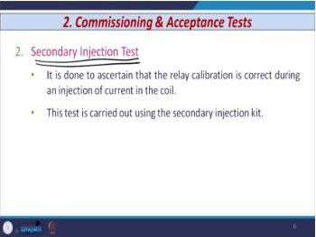
*Figure 40.2: Secondary injection test kit.*

The secondary injection test ensures the relay calibration is correct during injection of current into the current coil. Early manufacturers provided test blocks or test sockets, but modern practice uses separate secondary injection test kits from various manufacturers.

#### Commissioning Test 3: Primary Injection Test
- This test is **always performed after the secondary injection test**.
- It verifies the entire protection scheme, including the CT, relay, and wiring.
- A portable injection transformer injects a high current into the primary of the CT.
- The test kit has coarse, fine, and medium dials for current adjustment and a timer.
- **Harmonics:** Standard test kits filter out 2nd, 5th, and 7th harmonics, which can affect relay performance. Lab setups with autotransformers may not.

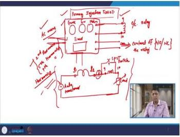
*Figure 40.3: Primary injection test kit connected to a relay.*

The primary injection test kit components include: supply connection to the relay coil (terminals 9 and 10 for an overcurrent relay), connection to the relay contact (NO or NC), three dials (coarse, fine, and medium) for current adjustment, AC mains supply, and a timer device. The test procedure is: connect the primary injection test kit to the relay coil and relay contact, adjust the current using the coarse/fine/medium dials, and the timer measures the time until the relay contact closes. The measured time is compared with the nameplate value.

The harmonics issue is critical. Standard primary injection test kits filter out 2nd, 5th, and up to 7th harmonics, so they have no effect on relay performance. Lab setups using an autotransformer and ammeter have fair chances of harmonics from the mains supply, which can affect relay performance. Utilities prefer primary injection test kits to ensure no harmonics are injected during testing.

#### Commissioning Test 4: Tripping Test
- This test verifies the complete tripping sequence from the relay to the CB.
- The relay contact must energize the auxiliary relay (86), whose contact energizes the CB trip coil (52-TC).
- All alarm and enunciator circuits are also checked.
- **Relay flags** must be checked to ensure they indicate operation correctly.

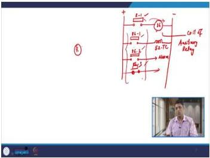
*Figure 40.4: Control circuit for the tripping test.*

The control circuit operates as follows: the relay contact feeds the coil of an auxiliary relay (86). The auxiliary relay contact 86-1 feeds the trip coil of the circuit breaker (52-TC). An additional contact 86-3 may feed an alarm or other purposes. The verification requirements are: the relay must give a tripping command to its contact, the relay contact must energize the auxiliary relay coil, and all auxiliary relay contacts used in the control circuit must change state (NO→close, NC→open).

Additional checks include: alarm and enunciator circuits (including voice alarms) checked after primary/secondary injection tests, performed by manual closing of the circuit breaker contact. Relay contacts must be clean and secure. All relay flags must be checked—the flag is a red-colored indicator with a nob; when the relay operates, the nob moves to the lower side showing a red indication. The operator takes action based on the flag position.

#### Commissioning Test 5: Impulse Test
- This test is **specifically for static relays**.
- It verifies the relay can withstand transient voltage surges (e.g., from lightning or switching).
- The standard waveform is a 1.2/60 μs exponential wave with a peak voltage between 1 kV and 5 kV.

If transient waves are present in incoming circuits, there is a possibility of mal-operation of static relays. The IEC standard waveform is an exponential wave with a rise time of 1.2 ms and a fall time of 60 μs. Components must withstand this wave to pass the test. The peak voltage varies between 1 kV and 5 kV, depending on the nature and location of the external wiring connected to the relay.

### 40.4 Routine Maintenance (Periodic) Test

**Purpose:** To ensure the protective device continues to sense faults and operate correctly, and does not operate during normal or external fault conditions.

**Conditions Requiring Periodic Testing:**
- Continuous vibration affects pivots and bearings.
- Dampness reduces insulation resistance.
- Atmospheric conditions deteriorate contacts and auxiliary switches.
- Heat from coil energization deteriorates insulation.
- Electrolysis can open-circuit coils and contacts.

The requirement is that protective gear must not deteriorate with age of installation. A device installed today must perform correctly after 5 years. The conditions requiring periodic testing and their effects are summarized below:

| Condition | Effect |
|-----------|--------|
| Continuous vibration | Affects pivots/bearings of electromechanical relays |
| Dampness (junction box, CB kiosk) | Reduces insulation resistance of multi-core cable and wiring |
| Atmosphere | Deterioration of ligaments, contacts, auxiliary switches |
| Environment/heat from coil energization | Insulation deterioration |
| Electrolysis | Open circuiting of coils/contacts (causes green spot) |

### 40.5 Frequency of Routine Maintenance Tests

| Frequency | Checks |
| :--- | :--- |
| **Continuous** | Pilot supervision, trip circuit supervision, relay voltage supervision, battery earth fault supervision, CT supervision of bus-bar. |
| **Daily** | All flags/indicators, carrier signal adequacy. |
| **Monthly** | Water level of liquid earth resistances. |
| **Bimonthly** | Channel test (e.g., carrier lights). |
| **Half-yearly** | All tripping tests. |
| **Yearly** | Operating level check, sensitivity check, tripping angle check, secondary injection test, insulation resistance test, tests on gas-operated relays (Buchholz), inspection of battery biasing equipment. |

The factors determining the frequency of testing include the type of equipment, fault history, and liability of equipment. Some equipment is checked continuously; others monthly, bimonthly, or yearly.

### 40.6 Worked Example: Primary Injection Test Setup

**Problem:** A primary injection test kit has a 10 kVA injection transformer. The secondary has multiple windings that can be connected in series or parallel. If the required test current is 1000 A at 10 V, and each winding is rated for 500 A, how should the windings be connected?

**Solution:**
- The required current is 1000 A.
- Each winding is rated for 500 A.
- To get 1000 A, the windings must be connected in **parallel**. This doubles the current capacity while keeping the voltage the same.
- The power requirement is $P = V \times I = 10 \text{ V} \times 1000 \text{ A} = 10 \text{ kVA}$, which matches the transformer rating.

**Conclusion:** The windings should be connected in parallel to achieve the required 1000 A test current.

### 40.7 Worked Example: Tripping Test Verification

**Problem:** During a tripping test, the relay contact closes, but the circuit breaker does not trip. The auxiliary relay (86) is verified to be functioning correctly. What are the possible causes of the failure?

**Solution:**

**Step 1: Analyze the trip circuit.**
The trip circuit is: Relay contact → Auxiliary relay (86) coil → 86-1 contact → CB trip coil (52-TC).

**Step 2: Identify possible failure points.**
1.  The 86-1 contact may not be closing properly (worn, dirty, or misaligned).
2.  The trip coil (52-TC) may be open-circuited.
3.  The wiring between 86-1 and 52-TC may be broken or loose.
4.  The CB mechanism may be mechanically stuck.
5.  The trip circuit supply voltage may be absent or too low.

**Step 3: Systematic troubleshooting.**
1.  Check the trip circuit supply voltage at the CB trip coil terminals.
2.  Verify the 86-1 contact closes by measuring continuity across it when the relay operates.
3.  Measure the resistance of the trip coil to check for an open circuit.
4.  Manually operate the CB trip mechanism to check for mechanical binding.

**Conclusion:** The failure is likely in one of the components between the auxiliary relay contact and the CB mechanism. Systematic voltage and continuity checks will isolate the fault.

### 40.8 Lecture 40 Recap

- Commissioning tests verify the installation and include insulation resistance, secondary injection, primary injection, tripping, and impulse tests.
- Primary injection tests the whole scheme and must follow secondary injection.
- The impulse test is only for static relays.
- Routine maintenance tests are performed at fixed intervals, from continuous supervision to yearly checks.
- The frequency of testing depends on the equipment's criticality and environment.

---

## Protection Logic Diagrams

### CB Contact Voltage During Fault Interruption

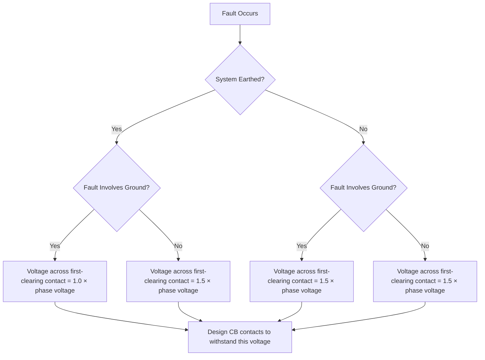

This flowchart captures the decision logic for determining the voltage stress across the first-clearing circuit breaker contact. The key distinction is whether the system neutral is earthed and whether the fault involves ground. Only when the system is earthed AND the fault involves ground does the voltage reduce to phase voltage (1.0×); all other combinations produce 1.5× phase voltage. In exams, this is a frequently tested discrimination point — students often confuse the earthed-system/grounded-fault case with the others. In engineering practice, this determines the insulation design requirement for breaker contacts.

### Relay Operating Time Measurement Sequence

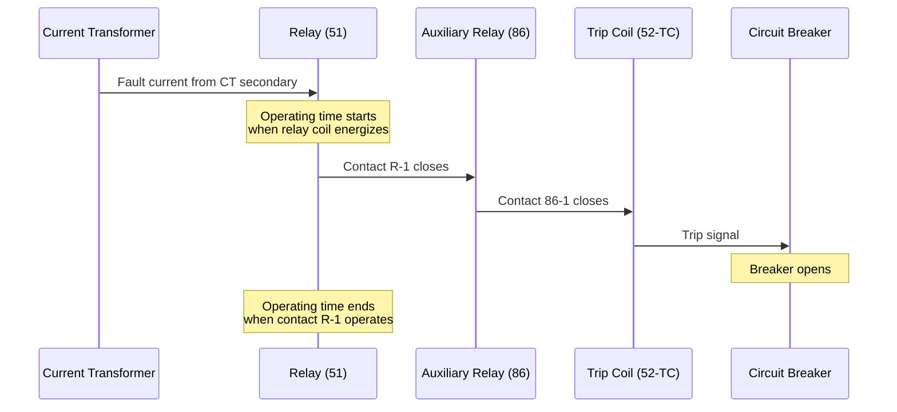

This sequence diagram illustrates the operating time measurement path for an overcurrent relay. The operating time is defined as the interval from relay coil energization to the instant the relay contact operates — not the time to breaker opening. The auxiliary relay (86) and trip coil (52-TC) are downstream elements that add their own delays. In testing, this distinction matters because the operating time test measures only the relay's own speed, while the tripping test verifies the complete chain. For exams, remember that operating time is measured at the relay contact, and the permissible deviation is 12.5% for PSM 2–4 and 7.5% for PSM 4–20.

### Protection Zones and Breaker Duty Cycle

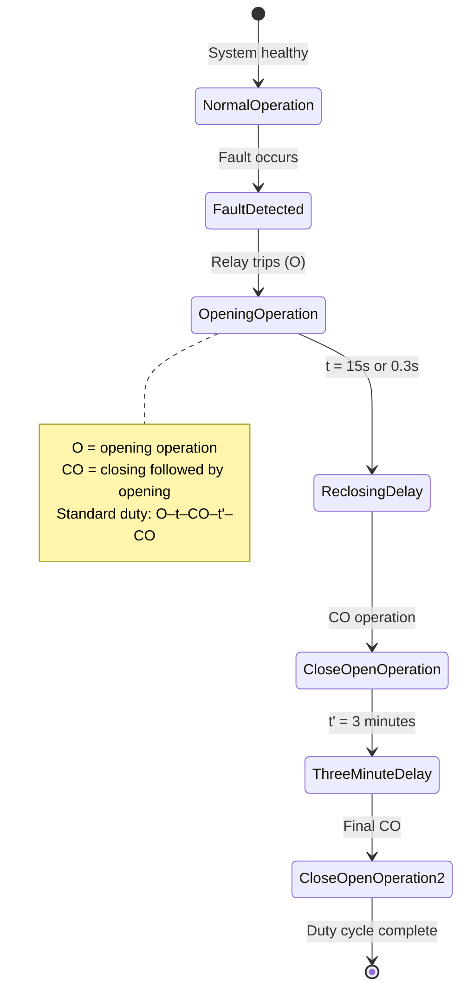

This state diagram represents the standard duty cycle for medium and high voltage circuit breakers as specified by IEEE/ANSI standards. The time constant t is 15 seconds for breakers not meant for rapid reclosing, but only 0.3 seconds for breakers designed for rapid reclosing. The final t' is always 3 minutes. Understanding this sequence is critical for breaker specification and testing — the breaker must withstand repeated fault interruptions within these time frames. In exams, the distinction between the two t values (15s vs 0.3s) is a common question.

### Relay Testing Decision Flow

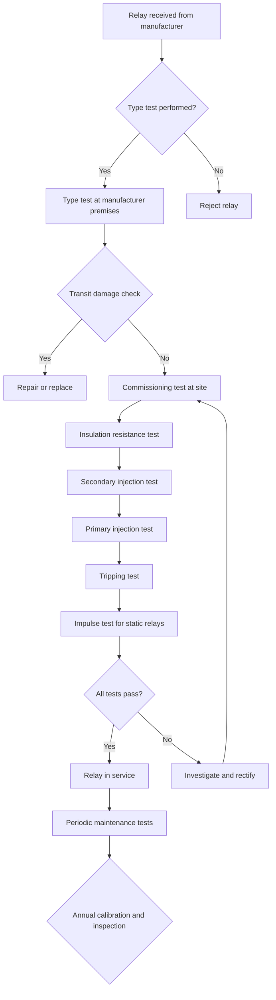

This flowchart shows the complete testing pathway for protective relays, from manufacturer type tests through commissioning to routine maintenance. The sequence is important: primary injection must always follow secondary injection, and the impulse test applies only to static relays. The insulation resistance test should show approximately 5 megaohm using a 500V or 1000V megger. For exams, remember that type tests are performed by manufacturers on every relay produced, commissioning tests occur at the customer premises, and routine maintenance tests happen at fixed intervals — yearly for complete calibration and inspection. The CT shorting switch must be used when removing relays to avoid dangerous open-circuit voltages.

## Common Mistakes and Protection-Engineering Checks

### Common Mistakes

1.  **Confusing Fault Cases:** Mixing up the 1.5× phase voltage cases. Remember: it's 1.5× for (non-earthed + grounded fault) and (earthed + ungrounded fault). It's 1× only for (earthed + grounded fault).
2.  **Current Chopping Formula:** Using the RMS value of current instead of the **peak** value in $V = I\sqrt{L/C}$.
3.  **Unit Conversions:** Forgetting to convert capacitance from pF to F (multiply by $10^{-12}$) in calculations.
4.  **Making vs. Breaking Capacity:** Thinking breaking capacity is higher. Making capacity is always higher because it's measured earlier when the DC component is larger.
5.  **Resistance Switching Value:** Choosing the critical damping value ($R = 2\sqrt{L/C}$). The **overdamped** value ($R > 2\sqrt{L/C}$) is used in practice.
6.  **CT Secondary Safety:** Forgetting to short the CT secondary before removing a relay. This is a life-safety issue.
7.  **SF6 Toxicity:** Thinking SF6 itself is toxic. It's the decomposition products (SF2, SF4) that are toxic.
8.  **Vacuum CB Range:** Thinking vacuum CBs are used for EHV. They are uneconomical above 36 kV; SF6 is used for EHV.
9.  **Duty Cycle Time Constants:** Confusing $t$ (15 s or 0.3 s) with $t'$ (3 minutes).
10. **Asymmetry and Recovery Voltage:** Thinking higher asymmetry means higher recovery voltage. It's the opposite—higher asymmetry reduces recovery voltage.
11. **Mechanical Test Applicability:** Applying the mechanical test to static or digital relays. It's only for electromechanical relays.
12. **Contact Capacity Test Loading:** Using resistive loading. The test must use **inductive loading** (0.4 pf lagging).
13. **Primary vs. Secondary Injection:** Performing primary injection before secondary injection. Primary must always follow secondary.
14. **Impulse Test Applicability:** Applying the impulse test to electromechanical relays. It's specifically for static relays.

### Protection-Engineering Checks

- **Check 1: Voltage Stress.** Always calculate the maximum voltage stress on the CB for the worst-case fault scenario (e.g., non-earthed system, line-to-line fault) to ensure the CB's rated voltage is sufficient.
- **Check 2: Current Chopping.** When disconnecting unloaded transformers or reactors, verify that the CB's current chopping characteristics will not produce damaging overvoltages. Consider surge arresters or resistance switching.
- **Check 3: Capacitive Current.** For lines and cables, ensure the CB is restrike-free to prevent voltage escalation.
- **Check 4: Making Capacity.** When specifying a CB, ensure its making capacity is greater than the maximum possible peak asymmetrical fault current.
- **Check 5: Relay Calibration.** During commissioning, always perform a secondary injection test to verify the relay's calibration before testing the entire scheme with a primary injection test.
- **Check 6: Insulation Resistance.** Record the insulation resistance value during commissioning. Compare future measurements to this baseline to detect deterioration.

---

## Quick Revision Sheet

### Key Equations

| Equation | Meaning |
| :--- | :--- |
| $i = \frac{E_m}{Z} [e^{-Rt/L} + \sin(\omega t + \theta - \varphi)]$ | Instantaneous asymmetrical fault current. |
| $\varphi = \tan^{-1}(X/R)$ | Line angle. |
| $\text{RRRV} = Z_S \frac{di}{dt}$ | RRRV for a short line fault. |
| $\frac{di}{dt} = \omega\sqrt{2} I_F$ | Rate of change of fault current. |
| $\frac{1}{2}LI^2 = \frac{1}{2}CV^2$ | Energy balance for current chopping. |
| $V = I\sqrt{L/C}$ | Voltage across CB due to current chopping. |
| $V_{CB} = V_S - V_C$ | Voltage across CB for capacitive current. |
| $R = 2\sqrt{L/C}$ | Critical damping resistance. |
| $I_{\text{sym}} = XY/\sqrt{2}$ | Symmetrical breaking current. |
| $I_{\text{asym}} = \sqrt{(XY/\sqrt{2})^2 + (YZ)^2}$ | Asymmetrical breaking current. |
| $\text{Breaking Capacity} = \sqrt{3} \times V \times I$ | Breaking capacity in MVA. |
| $\text{Making Capacity} = \sqrt{2} \times \rho \times \text{Sym. Breaking Cap.}$ | Making capacity. |
| $H = I^2Rt$ | Heat generated in a fuse. |

### Key Values and Limits

| Quantity | Value |
| :--- | :--- |
| Voltage variation limit (relay test) | ±10% of nominal |
| Current variation limit (relay test) | 90% - 110% of nominal |
| PSM 2-4 operating time deviation | 12.5% |
| PSM 4-20 operating time deviation | 7.5% |
| DMT relay error | ±5% up to 0.1 s |
| Contact capacity test power factor | 0.4 lagging |
| Contact capacity test time constant | 2-3 cycles |
| Contact capacity test interval | 25-30 s |
| Overload test current (IOC) | 20 × plug setting |
| Overload test current (thermal) | 8-10 × plug setting |
| Mechanical test current | 2 × plug setting |
| Insulation resistance ideal value | ~5 MΩ |
| Megger voltage | 500 V or 1000 V |
| Impulse test rise/fall time | 1.2 ms / 60 μs |
| Impulse test peak voltage | 1-5 kV |

### CB Types Comparison

| Type | Medium | Voltage Range | Advantages | Disadvantages |
| :--- | :--- | :--- | :--- | :--- |
| **Air** | Air | Up to 11 kV | Simple, cheap | Noisy, needs compressor, restriking, obsolete |
| **Oil** | Oil | Up to 220 kV | High dielectric strength | Inflammable, maintenance, explosion risk |
| **SF6** | SF6 gas | All voltages, esp. EHV | Excellent arc quenching, restrike-free | Toxic byproducts, heavier than air, costly |
| **Vacuum** | Vacuum | Up to 132 kV | Low chopping, long life, compact | Loss of vacuum, uneconomical above 36 kV |

### Relay Test Types

| Test Type | Performed By | Location | Purpose |
| :--- | :--- | :--- | :--- |
| **Type Test** | Manufacturer | Manufacturer's premises | Verify design compliance with standards. |
| **Acceptance Test** | Manufacturer | Manufacturer's premises | Verify performance per customer specs. |
| **Commissioning Test** | Manufacturer | Customer premises | Verify correct installation and operation. |
| **Routine Maintenance** | Customer/Operator | Substation | Periodic verification of continued correct operation. |

### Routine Maintenance Frequency

| Frequency | Checks |
| :--- | :--- |
| **Continuous** | Pilot supervision, trip circuit supervision, relay voltage supervision, battery earth fault supervision, CT supervision of bus-bar. |
| **Daily** | All flags/indicators, carrier signal adequacy. |
| **Monthly** | Water level of liquid earth resistances. |
| **Bimonthly** | Channel test (e.g., carrier lights). |
| **Half-yearly** | All tripping tests. |
| **Yearly** | Operating level, sensitivity, tripping angle, secondary injection, insulation resistance, gas-operated relay tests. |

### Fault Case Voltage Stress Summary

| System Earthing | Fault Type | Voltage Across First Pole to Clear |
| :--- | :--- | :--- |
| Earthed | Grounded (L-g, L-L-g, L-L-L-g) | 1.0 × phase voltage |
| Non-earthed | Grounded (L-g, L-L-g, L-L-L-g) | 1.5 × phase voltage |
| Earthed | Ungrounded (L-L, L-L-L) | 1.5 × phase voltage |

---

## Practice Quiz

### Questions 1-6: Single-Answer MCQs

**Q1. In a system with an isolated neutral, a line-to-line fault occurs. The voltage across the contacts of the first pole to clear is:**
Options: (a) 1.0 times the phase voltage (b) 1.5 times the phase voltage (c) 2.0 times the phase voltage (d) $\sqrt{3}$ times the phase voltage

> Answer and explanation
> The correct answer is (b). For a fault that does not involve ground (L-L or L-L-L) on an earthed system, or a ground fault on a non-earthed system, the voltage across the first clearing pole is 1.5 times the phase voltage. This is a key design consideration for CB contacts.

**Q2. What is the primary reason for the high severity of a short line fault?**
Options: (a) The fault current is higher than a bus fault. (b) The TRV on the line side has a very steep, saw-tooth shape. (c) The fault current has a large DC component. (d) The power factor of the fault is very low.

> Answer and explanation
> The correct answer is (b). A short line fault occurs a few kilometers from the CB. The voltage wave reflecting on the short line segment creates a very steep, saw-tooth shaped TRV on the line side, leading to an extremely high RRRV that can cause restriking.

**Q3. The voltage across a circuit breaker during current chopping is calculated using the formula $V = I\sqrt{L/C}$. The current $I$ in this formula is:**
Options: (a) The RMS value of the full-load current (b) The RMS value of the no-load current (c) The peak value of the chopped current (d) The peak value of the fault current

> Answer and explanation
> The correct answer is (c). The energy balance equation $\frac{1}{2}LI^2 = \frac{1}{2}CV^2$ uses the instantaneous current at the moment of chopping. Since chopping occurs abruptly, the worst-case voltage is calculated using the peak value of the current that was flowing.

**Q4. Which of the following is the correct standard duty cycle for a circuit breaker?**
Options: (a) O - CO - t - CO (b) O - t - CO - t' - CO (c) CO - t - O - t' - CO (d) O - t - CO - t - CO

> Answer and explanation
> The correct answer is (b). The standard duty cycle is O - t - CO - t' - CO, where O is an opening operation, CO is a close-open operation, t is a short time interval (15 s or 0.3 s), and t' is a longer interval (3 minutes).

**Q5. Which type test is performed ONLY on electromechanical relays?**
Options: (a) Overload test (b) Contact capacity test (c) Mechanical test (d) Temperature rise test

> Answer and explanation
> The correct answer is (c). The mechanical test involves performing several hundred operations and checking the condition of moving parts. This is only relevant for electromechanical relays, which have physical moving parts like discs and springs. Static and digital relays have no moving parts to test.

**Q6. What is the ideal insulation resistance value for a CT circuit measured during commissioning?**
Options: (a) 1 MΩ (b) 5 MΩ (c) 100 MΩ (d) 500 MΩ

> Answer and explanation
> The correct answer is (b). The ideal value is approximately 5 megaohm. This value is recorded as a baseline. Future measurements are compared to this baseline to detect any deterioration in the insulation over time.

### Questions 7-9: Multiple Select Questions (MSQ)

**Q7. Which of the following factors affect the RRRV and TRV across a circuit breaker?**
Options: (a) Type of fault (grounded or ungrounded) (b) Whether the system neutral is earthed or isolated (c) The degree of asymmetry of the fault current (d) The color of the circuit breaker housing

> Answer and explanation
> The correct answer is (a), (b), and (c). The type of fault and system earthing determine the magnitude of the recovery voltage (1× or 1.5× phase voltage). The asymmetry of the fault current affects the recovery voltage at current zero. The color of the housing has no effect on electrical performance.

**Q8. Which of the following are valid methods to increase the resistance of an arc in an air circuit breaker?**
Options: (a) Using an arc splitter to divide the arc into smaller arcs (b) Using a magnetic field to lengthen the arc (c) Increasing the system voltage (d) Forcing the arc to travel through a cooling medium

> Answer and explanation
> The correct answer is (a), (b), and (d). An arc splitter increases resistance by cooling multiple smaller arcs. A magnetic blow lengthens the arc, increasing its resistance. Cooling the arc also increases its resistance. Increasing the system voltage is a system parameter, not a method of arc resistance control.

**Q9. Which of the following checks are required to be performed CONTINUOUSLY in a substation?**
Options: (a) Trip circuit supervision (b) Battery earth fault supervision (c) Water level of liquid earth resistances (d) CT supervision of bus-bar protection

> Answer and explanation
> The correct answer is (a), (b), and (d). Trip circuit supervision, battery earth fault supervision, and CT supervision of bus-bar protection are all critical functions that must be monitored continuously. The water level of liquid earth resistances is a monthly check.

### Questions 10-13: Short-Answer / Concept

**Q10. Explain the phenomenon of voltage escalation during capacitive current interruption.**

> Answer and explanation
> When a CB interrupts a capacitive current, the capacitor is left with a trapped charge at the peak system voltage ($+V_m$). When the supply voltage reverses to its negative peak ($-V_m$), the voltage across the CB becomes $2V_m$. If the gap restrikes, the capacitor voltage oscillates and overshoots to $-3V_m$. If the arc extinguishes again, the capacitor is trapped at $-3V_m$. In the next half cycle, the CB voltage becomes $4V_m$. This process can repeat, causing the voltage to escalate by $2V_m$ every half cycle, potentially leading to a flashover.

**Q11. Why is the making capacity of a circuit breaker always greater than its breaking capacity?**

> Answer and explanation
> The making capacity is defined for the first cycle after the CB closes into a fault. At this instant, the DC component of the fault current is at its maximum, so the peak current is very high. The breaking capacity is defined at the instant of contact separation, which occurs about 1.5 to 2.5 cycles after fault inception. By this time, the DC component has decayed significantly, so the current to be interrupted is lower. Therefore, the making capacity is always greater.

**Q12. What is the purpose of resistance switching, and why is an overdamped resistance value used in practice?**

> Answer and explanation
> Resistance switching connects a resistor in parallel with the CB contacts to damp the high-frequency oscillations of the TRV and reduce the RRRV. This prevents arc reignition and reduces voltage stress. An overdamped value ($R > 2\sqrt{L/C}$) is used because it eliminates the first peak of the RRRV entirely, allowing the recovery voltage to rise smoothly to its steady-state value without any overshoot. This is the most benign condition for the CB gap.

**Q13. State the critical safety precaution that must be taken when removing a relay from a panel for testing, and explain why it is so important.**

> Answer and explanation
> The CT secondary must be short-circuited before the relay is removed. This is often done automatically by a CT shorting switch in modern relays. An open-circuited CT secondary is extremely dangerous because the CT will attempt to force the primary current through the open secondary, generating a very high voltage (potentially thousands of volts) that can endanger the operator's life and damage the CT insulation.

### Questions 14-16: Numerical / Analytical

**Q14. A 132 kV, 50 Hz system has a symmetrical breaking current of 31.5 kA. Calculate the making capacity in MVA, assuming an asymmetry factor of 1.8.**

> Answer and explanation
> First, calculate the symmetrical breaking capacity:
> $S_{\text{break}} = \sqrt{3} \times V \times I = \sqrt{3} \times 132 \times 31.5 = 7200 \text{ MVA}$.
> Now, calculate the making capacity:
> $\text{Making Capacity} = \sqrt{2} \times \rho \times S_{\text{break}} = \sqrt{2} \times 1.8 \times 7200 = 18,330 \text{ MVA}$.
> The making capacity is 18,330 MVA.

**Q15. A circuit breaker is used to disconnect a 33 kV, 10 MVA unloaded transformer. The no-load current is 2% of the full-load current. The system capacitance is 5000 pF. Calculate the worst-case overvoltage across the CB contacts. (Assume 50 Hz frequency).**

> Answer and explanation
> Step 1: Full-load current, $I_r = \frac{10 \times 10^6}{\sqrt{3} \times 33 \times 10^3} = 174.95 \text{ A}$.
> Step 2: No-load current, $I_{NL} = 0.02 \times 174.95 = 3.5 \text{ A}$.
> Step 3: No-load reactance, $X_0 = \frac{33 \times 10^3 / \sqrt{3}}{3.5} = 5443 \ \Omega$.
> Step 4: No-load inductance, $L_0 = \frac{5443}{2\pi \times 50} = 17.33 \text{ H}$.
> Step 5: Overvoltage, $V_{CB} = (\sqrt{2} \times 3.5) \times \sqrt{\frac{17.33}{5000 \times 10^{-12}}} = 4.95 \times \sqrt{3.466 \times 10^9} = 4.95 \times 58,872 = 291.4 \text{ kV}$.
> The worst-case overvoltage is approximately 291 kV.

**Q16. During a primary injection test, a relay with a nominal current of 1 A and a plug setting of 100% is tested. The test kit injects a current of 20 A into the CT primary. If the CT ratio is 100:1, what is the current seen by the relay? Is this a valid test for the relay's overload capability?**

> Answer and explanation
> The CT ratio is 100:1, meaning the secondary current is the primary current divided by 100.
> Relay current = 20 A / 100 = 0.2 A.
> The relay's plug setting is 100% of 1 A, which is 1 A. The injected current of 0.2 A is only 20% of the plug setting, which is below the pickup value.
> This is NOT a valid test for the relay's overload capability. The overload test requires injecting 20 times the plug setting current (20 A) into the relay coil. To achieve this, the primary injection current would need to be 20 A × 100 = 2000 A.

### Questions 17-18: Scenario / Troubleshooting

**Q17. A substation operator reports that a newly commissioned numerical overcurrent relay trips its associated circuit breaker intermittently, even when there is no fault on the system. The secondary injection test was successful. What is the most likely cause of the mal-operation?**

> Answer and explanation
> The most likely cause is the presence of harmonics or transients in the system that the relay is susceptible to. The secondary injection test uses a clean, filtered signal. However, the actual system may have harmonics from non-linear loads or transients from switching operations.
> Another likely cause is incorrect wiring or a loose connection in the trip circuit, causing spurious signals. However, since the secondary injection test was successful, the relay's calibration is likely correct.
> The problem is likely external to the relay. The operator should check for:
> 1.  **Harmonics:** Use a power quality analyzer to check for harmonics in the CT secondary circuit.
> 2.  **Wiring:** Inspect all wiring for loose connections or shorts.
> 3.  **CT Saturation:** Check if the CT is saturating under normal load, which could produce a distorted secondary current.
> 4.  **DC Injection:** Check for any DC offset in the CT secondary.

**Q18. During a routine maintenance test, the insulation resistance of a relay circuit is measured to be 0.5 MΩ. The commissioning test recorded a value of 5 MΩ. What is the likely cause of this deterioration, and what action should be taken?**

> Answer and explanation
> The insulation resistance has dropped by a factor of 10, indicating significant deterioration. The likely causes are:
> 1.  **Dampness:** Moisture ingress into the relay, junction box, or cabling.
> 2.  **Aging:** Natural deterioration of the insulation material over time.
> 3.  **Contamination:** Accumulation of dust, dirt, or chemical pollutants on the insulation surface.
> 4.  **Physical Damage:** Damage to the cable insulation.
> The action to take is to investigate the cause. The operator should:
> 1.  Visually inspect the relay, wiring, and junction boxes for signs of moisture, corrosion, or damage.
> 2.  Clean the insulation surfaces.
> 3.  If dampness is suspected, use a drying agent or heater to remove moisture.
> 4.  Re-measure the insulation resistance. If it is still low, the faulty component (relay, cable, etc.) must be identified and replaced.

---

## Assignment Screenshot Walkthrough

No separate assignment screenshots were supplied for this week. The assignment for Week 8 likely involves solving numerical problems on circuit breaker ratings and arc interruption theory, similar to the worked examples provided in the lectures. Focus on mastering the formulas for breaking capacity, making capacity, current chopping, and RRRV.

---

## Source Provenance

- **Primary Source:** NPTEL Course "Power System Protection and Switchgear", Lectures 36-40, by Prof. Bhaveshkumar R. Bhalja, IIT Roorkee.
- **Extraction:** Mistral OCR 4 extraction of lecture slides and transcripts.
- **Drafting:** DeepSeek V4 Flash drafting and structuring of study notes.
- **Review:** Locally reviewed and generated on 2026-08-05.

*Note: The models used for drafting and extraction are tools, not authoritative sources. All technical content is derived from the NPTEL lecture material.*
