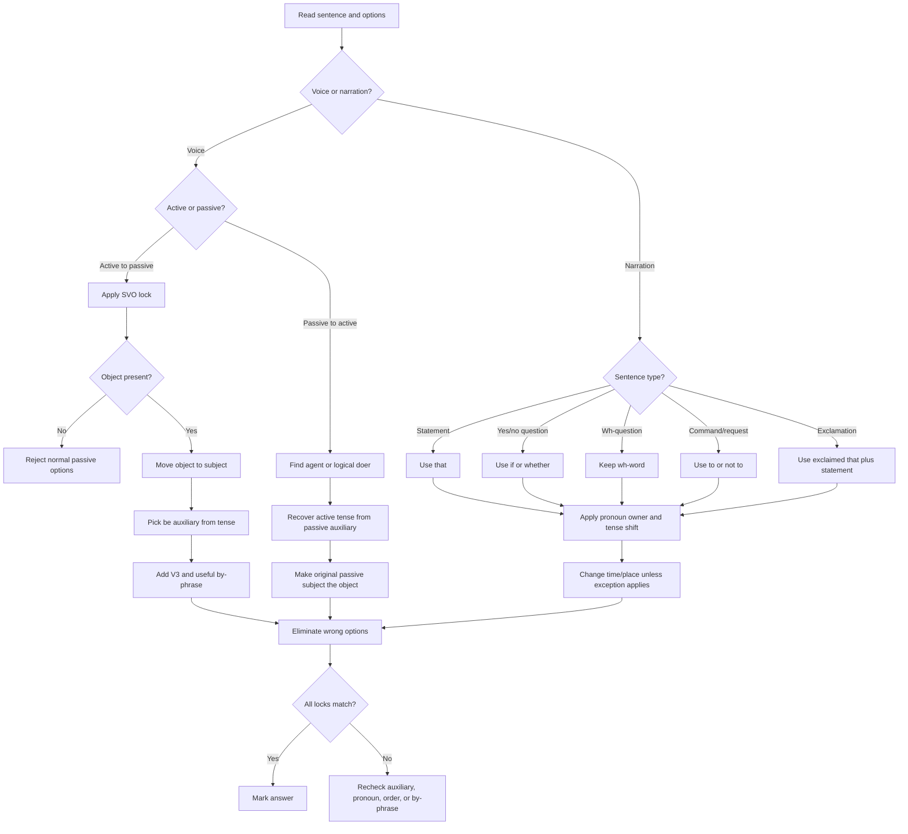

## Corpus Pressure

The promoted SSC book corpus currently gives this topic **785 promoted questions**. That makes active-passive voice and direct-indirect narration one of the dominant repeat areas in English. The largest cluster is `pinnacle-ssc-english-p0201-p0225`, which contributes **199 promoted questions**. The next largest is `pinnacle-ssc-english-p0176-p0200`, which contributes **188 promoted questions**. Two more clusters, `pinnacle-ssc-english-p0126-p0150` with **179 promoted questions** and `pinnacle-ssc-english-p0151-p0175` with **145 promoted questions**, show that this is not a side topic. It is a high-volume transformation engine.

The scoring idea is simple: SSC repeats the same transformations with small traps. You do not need literary interpretation. You need a mechanical voice ladder, a mechanical narration ladder, and strict option elimination. The winning habit is to classify the task in five seconds, then reject options by auxiliary, pronoun owner, question order, time word, universal truth exception, and by-phrase logic.

## Concept Ladder

**First principles: transformation, not translation**  
Voice and narration questions test whether you can preserve meaning while changing structure. Voice changes who appears as the grammatical subject. Narration changes quoted speech into reported speech. In both cases, the correct answer must keep the original meaning, tense logic, person reference, and sentence type.

**Level 1 - First 5-Second Classification**  
Classify the question before reading all options:
- Active to Passive: active subject performs action and an object receives it.
- Passive to Active: sentence uses be + V3, often with a by-phrase.
- Direct to Indirect: quotation marks or reported speech conversion.
- Indirect to Direct: reported clause must be restored to quoted speech.
- Voice inside narration: a reported clause also needs active/passive conversion.
- Error spotting crossover: one part of a sentence hides wrong voice or narration logic.

**Level 2 - Voice Ladder**  
The voice ladder has four locks:
1. SVO lock: subject, verb, object.
2. Tense lock: simple, continuous, perfect, future, or modal.
3. Auxiliary lock: correct form of be.
4. V3 lock: past participle form.

Passive formula = object + correct be auxiliary + V3 + by + doer when needed.  
Example: "The manager approved the plan" becomes "The plan was approved by the manager."

**Level 3 - Narration Ladder**  
The narration ladder has five locks:
1. Reporting verb lock: said, told, asked, ordered, requested, exclaimed.
2. Sentence type lock: statement, yes/no question, wh-question, command, request, exclamation, optative.
3. Pronoun owner lock: first person follows speaker, second person follows listener, third person stays.
4. Tense shift lock: past reporting verb usually causes backshift.
5. Time/place lock: now to then, here to there, tomorrow to the next day.

**Level 4 - SVO Lock for Voice**  
Only a transitive verb can be passivised in normal SSC questions. If there is no object, the sentence usually cannot become a normal passive. With phrasal verbs, keep the preposition: "look after the child" becomes "The child was looked after."

**Level 5 - Reporting Verb Lock for Narration**  
"Said to" is weak and usually changes:
- statement: told + object + that
- yes/no question: asked + object + if/whether
- wh-question: asked + object + wh-word
- command/order: ordered/told + object + to
- request/advice: requested/advised + object + to
- prohibition: told/ordered + object + not to
- exclamation: exclaimed with joy/sorrow/surprise that

**Level 6 - Pronoun Owner Rule**  
Pronoun owner means the person a pronoun belongs to:
- I, me, my, mine, we, us, our: change according to the speaker.
- you, your, yours: change according to the listener.
- he, she, it, they, him, her, them: usually unchanged unless context demands clarity.

**Level 7 - Tense Backshift Rule**  
If the reporting verb is past, present usually shifts to past, past usually shifts to past perfect, and will/can/may become would/could/might. If the reporting verb is present or future, do not backshift. Universal truth, habitual truth, proverbs, and permanent facts usually remain unchanged.

**Level 8 - Option Elimination**  
In SSC options, one option usually has the wrong auxiliary, one has wrong pronoun, one keeps question order, and one is correct. Do not read all four emotionally. Check the locks: voice ladder or narration ladder, then reject the wrong locks.

## Type System

| Type | Recognition cue | First lock | Method | Main trap |
|---|---|---|---|---|
| Active to Passive | Subject + verb + object | SVO lock | Object becomes subject; be + V3; by-phrase if useful | Wrong auxiliary or missing being/been |
| Passive to Active | be + V3, often by + agent | Agent lock | Agent becomes subject; V3 changes back to active verb form | Misreading tense from passive auxiliary |
| Modal Passive | can/may/must/should + V1 | Modal lock | modal + be + V3 | Writing modal + V3 without be |
| Continuous Passive | is/are/was/were + V-ing | Continuous lock | is/are/was/were + being + V3 | Missing being |
| Perfect Passive | has/have/had + V3 | Perfect lock | has/have/had + been + V3 | Missing been |
| Imperative Passive | Base verb command | Object lock | Let + object + be + V3 | Using is after let |
| Interrogative Passive | Auxiliary or wh-word question | Question order lock | Keep question frame, transform the verb phrase | Losing wh-word or wrong auxiliary position |
| Narration Statement | Quoted sentence with full stop | Reporting verb lock | that + pronoun + tense/time shifts | Wrong pronoun owner |
| Narration Yes/No Question | Quoted question starts with auxiliary | if/whether lock | asked + if/whether + statement order | Keeping question order |
| Narration Wh-Question | What/where/why/how/who/when | Wh lock | asked + wh-word + statement order | Adding if with wh-word |
| Narration Command | Quoted imperative | To lock | told/ordered/requested + object + to + V1 | Using that |
| Narration Negative Command | Do not / never | Not-to lock | told/ordered + object + not to + V1 | Writing to not |
| Narration Exclamation | What/how/alas/hurrah | Emotion lock | exclaimed with emotion that + statement | Keeping exclamation form |
| Universal Truth | Scientific or permanent fact | Exception lock | Do not backshift fact | Backshifting permanent fact |

## Speed Methods

**Voice algorithm**

1. Mark S, V, O.
2. Confirm the verb is transitive.
3. Move O to subject position.
4. Pick passive auxiliary from tense.
5. Add V3.
6. Add by-phrase only if the doer is meaningful.
7. Match number with the new subject.

**Passive auxiliary table**

| Active tense | Active cue | Passive form |
|---|---|---|
| Simple present | writes/write | is/am/are + V3 |
| Present continuous | is writing | is/am/are + being + V3 |
| Present perfect | has written | has/have + been + V3 |
| Simple past | wrote | was/were + V3 |
| Past continuous | was writing | was/were + being + V3 |
| Past perfect | had written | had + been + V3 |
| Simple future | will write | will be + V3 |
| Future perfect | will have written | will have been + V3 |
| Modal | can write | can be + V3 |

**Narration algorithm**

1. Lock reporting verb tense.
2. Lock sentence type.
3. Choose conjunction: that, if/whether, wh-word, to, not to.
4. Apply pronoun owner rule.
5. Apply tense backshift if reporting verb is past.
6. Change time/place words.
7. Convert question/exclamation into statement order where required.

**Backshift table**

| Direct form | Indirect form when reporting verb is past |
|---|---|
| is/am/are | was/were |
| do/does | did or main verb V2 |
| has/have | had |
| was/were | had been |
| did/V2 | had + V3 |
| will | would |
| can | could |
| may | might |
| must | had to, or must for strong rule/permanent necessity |
| today | that day |
| tomorrow | the next day |
| yesterday | the previous day |
| here | there |
| now | then |

**Pronoun owner table**

| Direct pronoun | Owner | Indirect decision |
|---|---|---|
| I, me, my | speaker | Match subject of reporting verb |
| We, us, our | speaker group | Match speaker group |
| You, your | listener | Match object of reporting verb |
| He, she, they | third person | Usually unchanged |

**36-second transformation loop**
- 0-5 seconds: classify voice or narration and identify subtype.
- 5-12 seconds: lock tense, pronoun owner, or SVO.
- 12-24 seconds: form the expected answer mentally.
- 24-32 seconds: eliminate options with wrong auxiliary, pronoun, question order, or by-phrase.
- 32-36 seconds: check meaning and mark.

## Trap Table

| Trap | Trigger wording | Wrong move | Correct move | Repair drill |
|---|---|---|---|---|
| No object in active voice | "He sleeps" | Force passive | Mark it as not normally passivised | Identify transitive vs intransitive verbs |
| Wrong new subject agreement | "The boys ate the mangoes" | Mangoes was eaten | Mangoes were eaten | Match auxiliary to new subject |
| Missing being | Present/past continuous | is written | is being written | Drill 20 continuous voice items |
| Missing been | Perfect tense | has written | has been written | Drill perfect passive table |
| Modal without be | must obey | must obeyed | must be obeyed | Write modal + be + V3 |
| Phrasal verb preposition dropped | looked after, laughed at | was looked by | was looked after by | Circle the preposition |
| By-phrase overuse | people/someone/they | by people everywhere | omit generic doer when natural | Rewrite generic-agent passives |
| Wrong reporting verb | said to in question | told if | asked if/whether | Classify sentence type first |
| Question order retained | where did he go | where did he went | where he went | Convert to statement order |
| If with wh-question | asked where | asked if where | asked where | Wh-word replaces if |
| Wrong pronoun owner | He said to me, "You..." | you -> he | you -> I/me/my by listener | Map speaker/listener |
| Time word unchanged | tomorrow, yesterday | keep original time word | next day, previous day | Drill time-place pairs |
| Universal truth backshifted | Earth revolves | Earth revolved | Earth revolves | Keep facts unchanged |
| Command uses that | "Close the door" | told that close | told me to close | Command = to + V1 |
| Negative command placement | "Do not go" | to not go | not to go | Negative command = not to |
| Exclamation form retained | What a day! | exclaimed what | exclaimed that it was a very fine day | Convert to statement |

## Flowchart

## Solved Examples

**Example 1: Simple Present Passive**  
She writes a story.  
Options: (a) A story is wrote by her. (b) A story is written by her. (c) A story was written by her. (d) A story has been written by her.  
**Solution**: SVO = She / writes / a story. Simple present passive = is/am/are + V3. Story is singular, so "is written". **Answer: (b)**

**Example 2: Present Continuous Passive**  
The children are playing cricket.  
Options: (a) Cricket is played by the children. (b) Cricket is being played by the children. (c) Cricket was being played by the children. (d) Cricket has been played by the children.  
**Solution**: Present continuous passive requires is/am/are + being + V3. Cricket is singular. **Answer: (b)**

**Example 3: Present Perfect Passive**  
I have finished the work.  
Options: (a) The work has finished by me. (b) The work has been finished by me. (c) The work is finished by me. (d) The work had been finished by me.  
**Solution**: Present perfect passive = has/have + been + V3. Work is singular. **Answer: (b)**

**Example 4: Phrasal Verb Passive**  
He looked after the child.  
Options: (a) The child was looked by him. (b) The child was looked after by him. (c) The child is looked after by him. (d) The child had looked after by him.  
**Solution**: Keep the preposition in a phrasal verb. Simple past passive = was + V3. **Answer: (b)**

**Example 5: Passive to Active**  
The letter was written by John.  
Options: (a) John was writing the letter. (b) John wrote the letter. (c) John has written the letter. (d) John writes the letter.  
**Solution**: Was written = simple past passive. Agent John becomes subject. Active verb = wrote. **Answer: (b)**

**Example 6: Modal Passive**  
You must obey the rules.  
Options: (a) The rules must be obeyed by you. (b) The rules must obeyed by you. (c) The rules are must obeyed by you. (d) The rules must have been obeyed by you.  
**Solution**: Modal passive = modal + be + V3. **Answer: (a)**

**Example 7: Imperative Passive**  
Open the door.  
Options: (a) Let the door opened. (b) Let the door be opened. (c) The door is open. (d) The door was opened.  
**Solution**: Imperative passive uses Let + object + be + V3. **Answer: (b)**

**Example 8: Interrogative Passive**  
Who wrote this book?  
Options: (a) By whom was this book written? (b) By whom this book was written? (c) Who was written this book? (d) This book was written by who?  
**Solution**: Keep interrogative order in passive: By whom + was + subject + V3. **Answer: (a)**

**Example 9: Statement Narration**  
He said, "I am going to the market."  
Options: (a) He said that he was going to the market. (b) He said that I am going to the market. (c) He said that he is going to the market. (d) He said that he had gone to the market.  
**Solution**: Reporting verb is past. I belongs to speaker He, so I -> he. Am going -> was going. **Answer: (a)**

**Example 10: Wh-Question Narration**  
She said to me, "Where do you live?"  
Options: (a) She asked me where did I live. (b) She asked me where I lived. (c) She asked me where do you live. (d) She asked me where I live.  
**Solution**: Said to -> asked. Keep where. Question order changes to statement order. You belongs to listener me, so you -> I. **Answer: (b)**

**Example 11: Yes/No Question Narration**  
He said to her, "Will you come tomorrow?"  
Options: (a) He asked her if she would come the next day. (b) He asked her if she will come tomorrow. (c) He said to her if she would come tomorrow. (d) He asked her that she would come the next day.  
**Solution**: Yes/no question uses if/whether. You belongs to her, will -> would, tomorrow -> the next day. **Answer: (a)**

**Example 12: Command Narration**  
The teacher said to the student, "Submit your homework."  
Options: (a) The teacher told the student to submit his homework. (b) The teacher told the student that submit your homework. (c) The teacher said the student to submit his homework. (d) The teacher asked the student to submit your homework.  
**Solution**: Command uses told + object + to + V1. Your belongs to the student. **Answer: (a)**

**Example 13: Negative Command Narration**  
Mother said to me, "Do not touch the wire."  
Options: (a) Mother told me not to touch the wire. (b) Mother told me to not touch the wire. (c) Mother said me not to touch the wire. (d) Mother told me to touch the wire.  
**Solution**: Negative command = told + object + not to + V1. **Answer: (a)**

**Example 14: Exclamation Narration**  
He said, "What a beautiful painting it is!"  
Options: (a) He exclaimed that it is a very beautiful painting. (b) He exclaimed that it was a very beautiful painting. (c) He said that what a beautiful painting it was. (d) He asked whether it was a beautiful painting.  
**Solution**: Exclamation changes to statement. Past reporting verb backshifts is -> was. **Answer: (b)**

**Example 15: Universal Truth Exception**  
The teacher said, "The Earth revolves around the Sun."  
Options: (a) The teacher said that the Earth revolved around the Sun. (b) The teacher said that the Earth revolves around the Sun. (c) The teacher told that the Earth revolves around the Sun. (d) The teacher asked that the Earth revolved around the Sun.  
**Solution**: Scientific fact remains in present tense. **Answer: (b)**

**Example 16: Reporting Verb Present**  
He says, "I am busy."  
Options: (a) He says that he is busy. (b) He says that he was busy. (c) He said that he was busy. (d) He told that he is busy.  
**Solution**: Reporting verb is present, so no backshift. I belongs to He. **Answer: (a)**

**Example 17: Passive with Two Objects**  
She gave me a pen.  
Options: (a) I was given a pen by her. (b) A pen was gave me by her. (c) I was gave a pen by her. (d) A pen is given me by her.  
**Solution**: With two objects, indirect object can become passive subject. Simple past passive = was given. **Answer: (a)**

**Example 18: Agent Omission**  
People speak English all over the world.  
Options: (a) English is spoken all over the world. (b) English is spoken by people all over the world. (c) English was spoken all over the world. (d) English has spoken all over the world.  
**Solution**: Generic agent "people" is naturally omitted. Simple present passive = is spoken. **Answer: (a)**

**Example 19: Passive Negative**  
They did not invite him.  
Options: (a) He was not invited by them. (b) He did not invited by them. (c) He has not invited by them. (d) He is not invited by them.  
**Solution**: Simple past negative passive = was/were + not + V3. **Answer: (a)**

**Example 20: Narration with Pronoun Owner**  
Ravi said to Sita, "I will help you."  
Options: (a) Ravi told Sita that he would help her. (b) Ravi told Sita that I would help you. (c) Ravi told Sita that she would help him. (d) Ravi asked Sita that he would help her.  
**Solution**: I belongs to Ravi, you belongs to Sita, will -> would. **Answer: (a)**

**Example 21: Narration with Time Word**  
She said, "I met him yesterday."  
Options: (a) She said that she had met him the previous day. (b) She said that she met him yesterday. (c) She said that I had met him the previous day. (d) She asked that she had met him yesterday.  
**Solution**: I -> she, met -> had met, yesterday -> the previous day. **Answer: (a)**

**Example 22: Wh-Question Without If**  
He said to me, "Why are you late?"  
Options: (a) He asked me why I was late. (b) He asked me if why I was late. (c) He asked me why was I late. (d) He told me why I was late.  
**Solution**: Wh-word stays; if is not used. Question order becomes statement order. **Answer: (a)**

**Example 23: Request Narration**  
The old man said to the boy, "Please help me."  
Options: (a) The old man requested the boy to help him. (b) The old man told the boy that help me. (c) The old man asked the boy if he helped him. (d) The old man ordered the boy to help me.  
**Solution**: Please indicates request. Me belongs to the old man, so me -> him. **Answer: (a)**

**Example 24: Indirect to Direct**  
He asked me whether I knew the answer.  
Options: (a) He said to me, "Do you know the answer?" (b) He said to me, "Did I know the answer?" (c) He asked me, "Whether I know the answer?" (d) He told me, "Do you know the answer?"  
**Solution**: Whether indicates a yes/no question. Backshift reverses knew -> know. I in indirect was listener, so direct pronoun is you. **Answer: (a)**

**Example 25: Mixed Voice and Narration**  
He said, "The manager approved the plan." Convert the quoted part into indirect passive.  
Options: (a) He said that the plan had been approved by the manager. (b) He said that the plan was approved by the manager. (c) He said that the manager had approved the plan. (d) He asked that the plan had been approved by the manager.  
**Solution**: First narration: approved -> had approved after past reporting verb. Then passive: the plan had been approved by the manager. **Answer: (a)**

## PYQ Mapping

**Practice route**  
/exams/ssc-cgl/topics/active-passive-direct-indirect

**Primary cluster: pinnacle-ssc-english-p0201-p0225**  
This cluster should be treated as the main transformation bank. It supplies voice/narration repetition at scale, especially statement narration, question narration, passive auxiliary errors, and commands. Use it for timed recognition: classify each item before solving.

**Primary cluster: pinnacle-ssc-english-p0176-p0200**  
This cluster strengthens narration patterns: pronoun owner, question order, if/whether, wh-word conversion, and tense backshift. Every wrong answer should be tagged as pronoun, tense, conjunction, or order.

**Primary cluster: pinnacle-ssc-english-p0126-p0150**  
Use this for active-passive structure and error-spotting crossover. It reinforces SVO lock, transitive verb checks, phrasal verb prepositions, and by-phrase choices.

**Primary cluster: pinnacle-ssc-english-p0151-p0175**  
Use this for mixed English transformation fatigue. Attempt it after a grammar block so that the brain learns to shift from sentence improvement and error spotting into exact transformation.

**Repair clusters**  
The smaller p0451-p0475, p0501-p0525, p0526-p0550, and p0551-p0569 clusters are useful for spaced revision. They should not be ignored, but the 200/200 priority is the four large clusters above.

## 200/200 Drill

**Daily 18-minute transformation block**

1. SVO lock, 3 minutes: mark subject, verb, object in 15 sentences. Skip any sentence without a clear object.
2. Passive auxiliary drill, 3 minutes: write passive auxiliary only for 20 tense cues.
3. Reporting verb lock, 3 minutes: classify 20 quoted sentences as statement, yes/no question, wh-question, command, request, exclamation, or optative.
4. Pronoun owner drill, 3 minutes: map I/we/you/my/your in 15 direct speech sentences.
5. Question order drill, 3 minutes: convert 10 questions into indirect statement order.
6. Error log, 3 minutes: tag misses as SVO, auxiliary, V3, by-phrase, reporting verb, pronoun owner, tense shift, time word, or question order.

**36-second exam routine**
- First 5 seconds: classify voice/narration and subtype.
- Next 7 seconds: lock SVO or reporting verb.
- Next 10 seconds: form the answer without options.
- Next 10 seconds: eliminate options by wrong lock.
- Final 4 seconds: check meaning preservation.

**Repair rules**
- Wrong auxiliary: rewrite the passive auxiliary table once and solve 20 voice items.
- Missing being/been: drill continuous/perfect passive separately.
- Wrong by-phrase: write whether the agent is specific, generic, obvious, or unknown.
- Wrong pronoun: draw speaker -> first person and listener -> second person arrows.
- Wrong question order: convert 20 direct questions into subject-before-verb order.
- Wrong universal truth: write five permanent facts and keep present tense in indirect speech.

For 200/200, do not study voice and narration as grammar theory. Study them as a transformation checklist. The corpus volume is high enough to make the pattern automatic if every miss is repaired by its exact lock.
<!-- SSC-FINAL-PRACTICE-QUEUE:START -->
## Final Practice Queue

1. Start one-by-one practice: [Voice and Narration practice](/exams/ssc-cgl/practice/active-passive-direct-indirect). Finish every question in this topic bank, not just the samples in the note.
2. Move to timed sets: [SSC CGL tests](/exams/ssc-cgl/tests?topic=active-passive-direct-indirect). Use topic drills first, then section mocks once accuracy is stable.
3. Repair every miss immediately: record the error label, redo 20 mixed questions from the same topic, then retest after 24 hours.
4. 200/200 rule: do not mark this topic exam-ready until correct answers come within 36 seconds and wrong answers are explained without looking at the solution.

<!-- SSC-FINAL-PRACTICE-QUEUE:END -->
