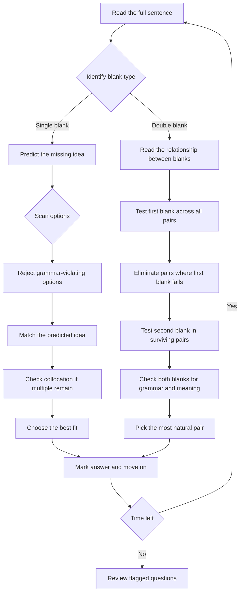

## Corpus Pressure

This note is built around the promoted SSC CGL book-PYQ slice for `fill-in-the-blanks`: **491 promoted questions**. The main pressure comes from `pinnacle-ssc-english-p0251-p0275`, which contributes **326 promoted questions**, and `pinnacle-ssc-english-p0276-p0300`, which contributes **154 promoted questions**. Smaller clusters at `p0376-p0400`, `p0351-p0375`, and `p0401-p0425` confirm that the topic is mostly single-blank English usage, with occasional cloze/vocabulary spillover.

For 200/200, treat this as a high-yield accuracy topic, not a guessing topic. A fill-in question is correct only when the option clears all three gates:

| Gate | What It Checks | Fast Rejection Signal |
|------|----------------|-----------------------|
| Grammar | part of speech, subject-verb agreement, tense, article, pronoun, preposition | sentence becomes structurally wrong |
| Meaning | whether the blank matches the idea, cause, contrast, tone, or result | option reverses the sentence logic |
| Collocation | natural word pairing and fixed usage | phrase sounds translated or uncommon in formal English |

### First 5-Second Classification

1. Look at the word immediately before and after the blank.
2. Decide whether the blank is grammar-led, vocabulary-led, collocation-led, or connector-led.
3. Predict the missing idea before reading options.
4. Eliminate any option that fails grammar even if it sounds meaningful.
5. If two options survive, choose the one with the natural collocation.

## Concept Ladder

**Level 1 - Word-Level Fit**  
- Fill-in-the-blanks is a sentence with one or two missing words.  
- The correct word must satisfy three constraints: meaning, grammar, and collocation (natural pairing).  

**Level 2 - Grammar Fit**  
- Parts of speech: noun, verb, adjective, adverb, preposition, article, conjunction, pronoun, determiner.  
- Subject-verb agreement: singular subjects take singular verbs; plural take plural.  
- Tense consistency: actions in the same time frame must use matching tenses.  
- Article rules: `a` before consonant sound, `an` before vowel sound, `the` for specific references.  
- Preposition patterns: `good at`, `interested in`, `afraid of`.  

**Level 3 - Vocabulary Fit**  
- Meaning must match sentence context (positive/negative tone, formal/informal register).  
- Commonly confused pairs: `adverse/averse`, `historic/historical`, `complement/compliment`.  
- Phrasal verbs: `call off` (cancel), `give up` (quit), `look into` (investigate).  

**Level 4 - Collocation & Idioms**  
- Fixed expressions: `make a decision`, `take a break`, `do homework`, `pay attention`.  
- Prepositional collocations: `on time`, `in time`, `by accident`, `for sure`.  

**Level 5 - Context & Coherence**  
- Read the whole sentence before choosing. Missing word must fit logically.  
- Double blanks: both words must work together and follow their own grammar rules.  
- Tone clues: words like `however`, `although`, `therefore` signal contrast or cause.  

**Level 6 - Exam Strategy**  
- **Predict before looking at options.** Cover options, fill in a likely word, then match.  
- Reject options that are wrong on any one constraint (meaning, grammar, collocation).  
- Eliminate fast: if two options are synonyms, both usually wrong unless one fits collocation perfectly.  
- Speed target: 15-20 seconds per single blank, 25-30 seconds per double blank.  

**Level 7 - 200/200 Integration**  
- No mistake on grammar-blank questions - these are 100% rule-based.  
- For vocabulary blanks, use elimination and root word knowledge.  
- In the 15-minute English section, allocate 2-3 minutes total for 4-5 fill-in-the-blank questions.  

## Type System

| Type | Recognition Cue | Method | Speed Target | Trap |
|---|---|---|---|---|
| Single blank - grammar (tense, agreement, article) | Missing verb, article, or preposition | Identify subject number/tense; apply rule directly | 10-12 sec | Ignoring subject-verb agreement when subject has interrupting phrase |
| Single blank - vocabulary (word meaning) | Word missing; options are different words | Predict meaning from context; eliminate opposites | 15-18 sec | Choosing a word that fits meaning but wrong part of speech |
| Preposition blank | Sentence has noun/verb/preposition missing | Recall fixed collocations; reject prepositions that never pair | 10-12 sec | Confusing `in/on/at` for time vs place |
| Article/determiner blank | Blank before noun phrase | Check vowel/consonant sound; check specific vs general | 8-10 sec | Using `a` before vowel-sound words like `hour`; correct article is `an` |
| Verb-form blank | Infinitive, gerund, participle missing | Look at verb pattern: `refuse to`, `suggest -ing`, `get used to` | 12-15 sec | Mistaking gerund for infinitive after certain verbs |
| Collocation/phrase blank | Standard fixed expression | Know common collocations; if unsure, pick the most natural pair | 15-20 sec | Translating from native language - may produce wrong collocation |
| Tone/context clue blank | Sentence includes `but`, `however`, `yet` | Identify contrast or cause; pick word that matches tone | 12-15 sec | Choosing a word that fits grammatically but breaks the logical flow |
| Double blank - option pairing | Two blanks; each option gives two words | Test first blank, eliminate; if both first works, test second | 25-30 sec | Selecting pair where first fits but second doesn't collocate |
| Option elimination under speed | All options look similar | Use rejection: rule out any options with grammar errors | 8-10 sec | Keeping an option because it sounds familiar, even if wrong |

## Speed Methods

**Recall Tables - Common Collocations**

| Verb + Preposition | Adjective + Preposition | Noun + Preposition |
|---|---|---|
| rely on | good at | demand for |
| insist on | interested in | solution to |
| succeed in | fond of | approach to |
| belong to | afraid of | cause of |
| wait for | similar to | effect on |

**Decision Rules**  
1. **Article blank:** If next word starts with vowel sound -> `an`, else `a`. If specific reference -> `the`. If general uncountable -> `no article`.  
2. **Subject-verb agreement:** Ignore words between subject and verb. `Neither/either/each` are always singular.  
3. **Tense: reported speech** - present becomes past, past becomes past perfect.  
4. **Preposition: time** - use `at` for clock time, `in` for months/years, `on` for days/dates.  
5. **Phrasal verb:** `call off` (cancel), `carry out` (execute), `bring up` (raise a topic).  

**Step-by-Step Algorithm for Single Blank**  
1. Read the entire sentence.  
2. Identify the missing part's function (verb? noun? preposition?).  
3. Predict a word mentally.  
4. Scan options - eliminate any that violate grammar.  
5. Match your predicted word to the remaining option(s). If two fit, check collocation.  
6. Mark the answer. (Total time: 12-18 sec)  

**Algorithm for Double Blank**  
1. Read the sentence and understand the relationship between blanks.  
2. Test the first blank against all options; eliminate any pair where first word fails.  
3. Among survivors, test the second blank for grammar and meaning.  
4. If more than one pair remains, check collocation of both words.  
5. Pick the pair that forms the most natural sentence.  

**When to Use Direct Formula vs Elimination**  
- Direct formula: article, preposition, subject-verb agreement, verb form (these are strict rules).  
- Elimination: vocabulary, collocation, tone - use elimination when you recognise one wrong option.  
- Option testing: for double blanks where first blank is easy, eliminate immediately.  
- Approximation: not applicable for English blanks - answers are precise.  
- Skip-and-return: if a vocabulary word is completely unknown, skip and come back after other questions.  

## Trap Table

| Trap | Trigger Wording | Wrong Move | Correct Move | Repair Drill |
|---|---|---|---|---|
| Subject-verb agreement with interrupting phrase | "The quality of the products ___ excellent." | Using `are` because `products` is plural | Use `is` because subject is `quality` (singular) | Practice: "The list of names ___ (is/are) long." |
| Article before consonant sound word | "She is ___ European." (vowel letters start, but sound consonant) | Picking `an` | Pick `a` because `European` starts with /j/ consonant sound | Drill: "___ one-hour session" -> `a` |
| `Few` vs `a few` vs `little` vs `a little` | "He had ___ friends." (implies negative) | Using `a few` (positive) | Use `few` for negative meaning, `a few` for positive | Memorise: `few` = not many, `a few` = some |
| `Than` vs `then` | "She is taller ___ him." | Writing `then` | Use `than` for comparison | Always compare: `than` has `a` for `comparison` |
| `Since` vs `for` in time | "He has been here ___ two hours." | Using `since` | Use `for` before duration, `since` before point in time | Rule: `for + length`, `since + start point` |
| `Loose` vs `lose` | "He did not want to ___ the match." | Using `loose` (adjective) | Use `lose` (verb meaning fail to win) | Spell check: `lose` has one `o`, `loose` has two |
| `Its` vs `it's` | "The dog wagged ___ tail." | Using `it's` (contraction) | Use `its` (possessive) | Rule: `it's` = `it is` or `it has` |
| `Compliment` vs `complement` | "The wine ___ the dish." | Using `compliment` (praise) | Use `complement` (complete) | Context: `complement` = goes well together |
| `Principal` vs `principle` | "The ___ of the school." | Using `principle` (rule) | Use `principal` (head of school) | Mnemonic: `principal` is your `pal` |
| `Accept` vs `except` | "All students ___ Ravi were present." | Using `accept` (receive) | Use `except` (excluding) | Think: `ex` = out |
| `Between` vs `among` | "Divide the money ___ the three brothers." | Using `between` (for two) | Use `among` (for more than two) | Rule: `between` two, `among` many |
| `Comprise` vs `compose` | "The committee ___ ten members." | Using `compose of` | Use `comprises` (no preposition) | Correct: `The committee comprises ten members.` |
| Double blank - first word fits but second fails | "He ___ the file and ___ it carefully." (options: found/read, accepted/studied) | Picking a pair where first works but second makes no sense | Test both blanks; if first works, test second immediately | Drill: always verify both blanks in double blank |
| Ignoring tone: `although` expects contrast | "Although he was tired, he ___ working." | Filling `continued` (correct) but if options include `stopped`, student chooses wrong because didn't notice `although` | Always underline contrast words like `but`, `although`, `however` | Practice: complete the contrast sentence |

## Flowchart

## Solved Examples

**Example 1: Preposition**  
He is good _____ mathematics.  
Options: (a) in (b) at (c) on (d) for  
**Solution**: The correct collocation is "good at" a subject or activity. **Answer: (b) at**

**Example 2: Article**  
She is _____ honest officer.  
Options: (a) a (b) an (c) the (d) no article  
**Solution**: "Honest" begins with a vowel sound, so the correct article is "an". **Answer: (b) an**

**Example 3: Tense**  
He said that he _____ the work before the deadline.  
Options: (a) finishes (b) will finish (c) finished (d) had finished  
**Solution**: In reported past context, the earlier completed action takes past perfect. **Answer: (d) had finished**

**Example 4: Subject-Verb Agreement**  
Neither of the answers _____ correct.  
Options: (a) are (b) were (c) is (d) have been  
**Solution**: "Neither" is singular, so the singular verb "is" is required. **Answer: (c) is**

**Example 5: Collocation**  
The committee will _____ a decision tomorrow.  
Options: (a) do (b) make (c) take (d) give  
**Solution**: The standard collocation is "take a decision" in Indian exam usage. **Answer: (c) take**

**Example 6: Connector**  
He studied hard, _____ he failed to clear the exam.  
Options: (a) because (b) although (c) yet (d) since  
**Solution**: The second clause contrasts with the first, so "yet" fits. **Answer: (c) yet**

**Example 7: Vocabulary Context**  
The medicine had an _____ effect on the patient.  
Options: (a) adverse (b) averse (c) reverse (d) diverse  
**Solution**: "Adverse effect" means harmful effect. "Averse" means unwilling. **Answer: (a) adverse**

**Example 8: Infinitive**  
She refused _____ the document.  
Options: (a) signing (b) to sign (c) sign (d) signed  
**Solution**: "Refuse" is followed by the infinitive "to sign". **Answer: (b) to sign**

**Example 9: Phrasal Verb**  
The meeting was _____ due to heavy rain.  
Options: (a) called off (b) called in (c) called on (d) called up  
**Solution**: "Called off" means cancelled. **Answer: (a) called off**

**Example 10: Quantifier**  
There is _____ milk left in the bottle.  
Options: (a) many (b) few (c) little (d) several  
**Solution**: Milk is uncountable, and the sentence suggests a small amount, so "little" fits. **Answer: (c) little**

**Example 11: Pronoun**  
Each of the students must bring _____ identity card.  
Options: (a) their (b) his or her (c) them (d) theirs  
**Solution**: "Each" is singular. In formal SSC grammar, "his or her" keeps agreement. **Answer: (b) his or her**

**Example 12: Comparative**  
This route is shorter _____ the other one.  
Options: (a) from (b) to (c) than (d) then  
**Solution**: Comparative degree uses "than". **Answer: (c) than**

**Example 13: Fixed Preposition**  
The child was afraid _____ the dark.  
Options: (a) from (b) of (c) with (d) by  
**Solution**: The adjective collocation is "afraid of". **Answer: (b) of**

**Example 14: Duration Marker**  
She has lived here _____ 2018.  
Options: (a) for (b) since (c) from (d) by  
**Solution**: Use "since" with a starting point in time. **Answer: (b) since**

**Example 15: Countable Quantity**  
There were _____ people at the station after midnight.  
Options: (a) little (b) much (c) few (d) less  
**Solution**: "People" is countable plural. "Few" fits countable plural and small number. **Answer: (c) few**

**Example 16: Positive Small Quantity**  
I have _____ friends who can help us today.  
Options: (a) few (b) a few (c) little (d) a little  
**Solution**: "A few" means some, and the sentence is positive. **Answer: (b) a few**

**Example 17: Contrast Connector**  
The task was difficult; _____, she completed it on time.  
Options: (a) therefore (b) however (c) because (d) since  
**Solution**: The second part contrasts with the first, so "however" is correct. **Answer: (b) however**

**Example 18: Cause Connector**  
He was absent _____ he was unwell.  
Options: (a) because (b) although (c) yet (d) unless  
**Solution**: The second clause gives the reason, so use "because". **Answer: (a) because**

**Example 19: Verb Pattern**  
They suggested _____ the plan once again.  
Options: (a) review (b) to review (c) reviewing (d) reviewed  
**Solution**: "Suggest" is followed by a gerund form. **Answer: (c) reviewing**

**Example 20: Infinitive Pattern**  
He agreed _____ the documents before noon.  
Options: (a) sign (b) signing (c) to sign (d) signed  
**Solution**: "Agree" is followed by the infinitive "to sign". **Answer: (c) to sign**

**Example 21: Confused Word Pair**  
The new policy will _____ every employee.  
Options: (a) affect (b) effect (c) infect (d) defect  
**Solution**: As a verb meaning "influence", the correct word is "affect". **Answer: (a) affect**

**Example 22: Word Form**  
His explanation was clear and _____.  
Options: (a) logic (b) logical (c) logically (d) logics  
**Solution**: The blank is after "clear and", so it needs an adjective parallel to "clear". **Answer: (b) logical**

**Example 23: Natural Collocation**  
The officer asked us to _____ attention to the instructions.  
Options: (a) give (b) pay (c) make (d) do  
**Solution**: The fixed collocation is "pay attention". **Answer: (b) pay**

**Example 24: Double Blank**  
The manager was _____ with the report and asked the team to _____ it.  
Options: (a) satisfied, ignore (b) dissatisfied, revise (c) pleased, reject (d) angry, praise  
**Solution**: "Dissatisfied" naturally leads to "revise it". Both blanks match meaning and collocation. **Answer: (b) dissatisfied, revise**

**Example 25: Formal Register**  
The committee decided to _____ the proposal after detailed discussion.  
Options: (a) throw (b) consider (c) look (d) see  
**Solution**: In formal usage, "consider the proposal" is natural and precise. **Answer: (b) consider**

## PYQ Mapping

| Corpus Cluster / Type | Promoted Question Pressure | What to Practice | Route |
|---|---:|---|---|
| `pinnacle-ssc-english-p0251-p0275` | 326 questions | Core single blanks: grammar, usage, context, and collocation | /exams/ssc-cgl/topics/fill-in-the-blanks |
| `pinnacle-ssc-english-p0276-p0300` | 154 questions | Advanced single blanks and vocabulary-led usage | /exams/ssc-cgl/topics/fill-in-the-blanks |
| `pinnacle-ssc-english-p0376-p0400` | 7 questions | Cloze-style spillover and context-led blanks | /exams/ssc-cgl/topics/vocabulary-cloze |
| `pinnacle-ssc-english-p0351-p0375` and `p0401-p0425` | 4 questions | Low-frequency mixed usage | /exams/ssc-cgl/topics/fill-in-the-blanks |
| Grammar blanks | Repeat pattern | Articles, prepositions, subject-verb agreement, tense, verb form | /exams/ssc-cgl/topics/grammar-error-spotting |
| Vocabulary blanks | Repeat pattern | Confused words, word form, tone, register | /exams/ssc-cgl/topics/vocabulary-cloze |
| Speed sprint | Section-level pressure | 5 blanks in under 90 seconds | /exams/ssc-cgl/tests/ssc-cgl-english-comprehension-speed-sprint |

## High-Frequency Usage Bank

### Preposition Pairs to Recall Automatically

| Expression | Correct Preposition | SSC-Style Sentence Pattern |
|---|---|---|
| good | at | She is good at reasoning. |
| interested | in | He is interested in current affairs. |
| fond | of | The child is fond of stories. |
| capable | of | She is capable of handling pressure. |
| responsible | for | The officer is responsible for the file. |
| similar | to | This method is similar to the previous one. |
| different | from | His answer is different from mine. |
| depend | on | Success depends on revision. |
| insist | on | He insisted on paying the bill. |
| apologize | for | She apologized for the delay. |
| accuse | of | He was accused of cheating. |
| prevent | from | The rain prevented us from leaving. |
| prefer | to | I prefer tea to coffee. |
| superior | to | This route is superior to that one. |
| inferior | to | The copy is inferior to the original. |

### Verb Pattern Bank

| Verb / Phrase | Followed By | Example |
|---|---|---|
| agree | to + verb | He agreed to help. |
| refuse | to + verb | She refused to answer. |
| decide | to + verb | They decided to leave. |
| avoid | verb + ing | Avoid making careless errors. |
| suggest | verb + ing | He suggested revising the note. |
| enjoy | verb + ing | She enjoys reading. |
| look forward to | verb + ing | I look forward to meeting you. |
| used to | base verb | He used to play chess. |
| get used to | noun / verb + ing | She got used to waking early. |
| make someone | base verb | The teacher made him repeat it. |

### Confused Word Bank

| Pair | Use This When | SSC Trap |
|---|---|---|
| affect / effect | affect = influence; effect = result | "The law will affect citizens." |
| advice / advise | advice = noun; advise = verb | "He gave me advice." |
| loose / lose | loose = not tight; lose = fail to keep/win | "Do not lose the receipt." |
| principal / principle | principal = head/main; principle = rule | "The principal addressed students." |
| complement / compliment | complement = complete; compliment = praise | "The sauce complements the dish." |
| adverse / averse | adverse = harmful; averse = unwilling | "Adverse effect" is fixed usage. |
| stationery / stationary | stationery = writing material; stationary = not moving | "The car remained stationary." |
| eligible / illegible | eligible = qualified; illegible = unreadable | "His handwriting was illegible." |
| eminent / imminent | eminent = famous; imminent = about to happen | "An imminent danger" means near. |
| historic / historical | historic = important; historical = related to history | "A historic victory" is important. |

### 36-Second Double-Blank Discipline

For double blanks, never read the pair as a vibe. Use this order:

1. Test blank 1 across all four options and strike impossible pairs.
2. Test blank 2 only among survivors.
3. Check whether the pair creates a cause-effect, contrast, or sequence relation.
4. Reject pairs where the first word is correct but the second creates an unnatural phrase.
5. If two pairs survive, prefer the more formal, precise, and commonly collocated pair.

## 200/200 Drill

**Timed Micro-Drills**

| Drill Type | Questions | Time | Target Accuracy | Repair Rule |
|---|---|---|---|---|
| Single blank - grammar | 10 | 2 min | 100% | If wrong, note the rule missed (agreement, article, tense) and revise immediately |
| Single blank - vocabulary | 10 | 3 min | 90% | Eliminate wrong options first; if unsure, pick the word with the most common prefix/suffix |
| Preposition blank | 8 | 1.5 min | 100% | Memorise the top 20 prepositional collocations (see Speed Methods recall table) |
| Double blank | 5 | 2 min | 80% | Always test first blank; if it passes, test second; never assume both are correct |
| Mixed speed sprint | 5 | 1 min | 100% | Use predict-before-options technique; if stuck, skip and return |

**Repair Drills**  
- **For subject-verb agreement:** Write 10 sentences with interrupting phrases (e.g., "The package of books ___ (is/are) heavy.") and correct each.  
- **For articles:** Take a paragraph from a newspaper; circle all articles. Replace each with the wrong article; then correct it.  
- **For collocation:** Create flashcards for 20 common collocations (verb+preposition, adjective+preposition). Review daily.  
- **For phrasal verbs:** List 10 phrasal verbs and their meanings. Write a sentence for each.  
- **For option elimination:** Solve 5 questions by covering options, predicting, then checking. Repeat until prediction matches correct answer 9/10 times.

**Final Target:** In the real SSC CGL Tier-I English section (15 minutes total), finish all fill-in-the-blank questions in under 3 minutes with 100% accuracy. Use the Speed Methods and Trap Table to eliminate mistakes before they reach the answer sheet.
<!-- SSC-FINAL-PRACTICE-QUEUE:START -->
## Final Practice Queue

1. Start one-by-one practice: [Fill in the Blanks practice](/exams/ssc-cgl/practice/fill-in-the-blanks). Finish every question in this topic bank, not just the samples in the note.
2. Move to timed sets: [SSC CGL tests](/exams/ssc-cgl/tests?topic=fill-in-the-blanks). Use topic drills first, then section mocks once accuracy is stable.
3. Repair every miss immediately: record the error label, redo 20 mixed questions from the same topic, then retest after 24 hours.
4. 200/200 rule: do not mark this topic exam-ready until correct answers come within 36 seconds and wrong answers are explained without looking at the solution.

<!-- SSC-FINAL-PRACTICE-QUEUE:END -->
