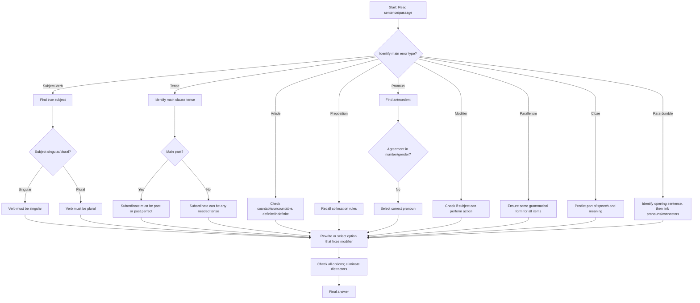

## Concept Ladder

**Rung 1 - Parts of Speech and Sentence Kernel**  
Every sentence has a subject (noun/noun phrase) and a predicate (verb + complements). The verb must agree with the subject in number and person. This is the non-negotiable foundation.

**Rung 2 - Tense and Aspect**  
English uses 12 tense-aspect combos (present/past/future x simple/continuous/perfect/perfect continuous). In SSC grammar, the focus is on correct sequence: if the main clause is past, the subordinate clause must shift back (sequence of tense). Example: He said that he was coming (not is).

**Rung 3 - Articles and Determiners**  
A/an for indefinite singular countable nouns; the for definite or previously mentioned. Zero article for general plurals/uncountables. Determiners like many, much, few, little each have countable/uncountable restrictions.

**Rung 4 - Prepositions and Phrasal Verbs**  
Prepositions link nouns to the rest of the sentence. Common errors: wrong preposition after adjectives (averse to, not from) or verbs (comply with, not to). Phrasal verbs (e.g., put off, break down) are tested in cloze.

**Rung 5 - Pronouns and Reference**  
Pronouns must agree with their antecedent in number, gender, and person. Avoid ambiguous reference (e.g., He told his father that he was wrong - who was wrong?). Use of who/whom, each/every, either/neither.

**Rung 6 - Modifier Placement**  
Dangling and misplaced modifiers cause illogical meanings. E.g., Walking to the store, the rain started. (Who is walking?) Fixed by adding the correct subject.

**Rung 7 - Parallelism**  
Items in a list, after correlative conjunctions (both...and, not only...but also), must share the same grammatical form. Error: She likes swimming, to run, and biking. Correct: swimming, running, biking.

**Rung 8 - Cloze Context Prediction**  
In cloze tests, read the entire passage first. Mark blank positions. Predict part of speech, then narrow meaning using context clues (contrast, cause-effect, sequence cues). Eliminate options that break grammar rules.

**Rung 9 - Sentence Improvement**  
Identify the error type (usually one of the above). Then pick the option that fixes only that error without altering meaning. Watch for unnecessary changes.

**Rung 10 - Para-Jumble Connectors and Pronoun Chains**  
For jumbled sentences, look for:
- Pronoun chains (a sentence containing "he" must have a prior noun).
- Logical sequence (time, cause-effect, general -> specific).
- Connectors (however, therefore, first, finally).

Integration: All ten rungs combine in the 25-question section. A 200/200 attempt requires rule recall PLUS contextual reading - never choose an answer purely on "sounds right".

## Type System

| Type | Recognition Cue | Method | Speed Target | Trap |
|------|-----------------|--------|--------------|------|
| 1. Subject-Verb Agreement Error | Verb mismatch with subject (especially in long clauses) | Identify true subject (ignore intervening phrases) | 15 sec | Collective nouns (team, committee) can be singular or plural based on meaning; "each of" + plural noun -> singular verb |
| 2. Tense Sequence Error | Main clause in past, subordinate in present/future | Apply backshift rule: past -> past/past perfect | 20 sec | Unreal conditionals (If I were) are exceptions; never change "would" in subordinate |
| 3. Article Error | Missing/unnecessary a/an/the before noun | Check countable/uncountable, definite/indefinite | 15 sec | "The" before plural generics is wrong (The dogs are loyal -> wrong if general) |
| 4. Preposition Error | Wrong preposition after verb/adjective | Memorize common collocations (insist on, refrain from) | 20 sec | Phrasal verbs change meaning with preposition (look after vs look for) |
| 5. Pronoun Reference Error | Pronoun without clear antecedent | Find the nearest logical antecedent; check agreement | 20 sec | "Their" used with singular "everyone" - use his/her or they (acceptable in modern usage but avoid in exam) |
| 6. Modifier Error | Dangling participle at start of sentence | See if the subject of the main clause can perform the action | 25 sec | Only the doer can be omitted in absolute phrases (Weather permitting) |
| 7. Parallelism Error | List with mixed forms (gerund + infinitive) | Convert all items to same form | 15 sec | Correlative conjunctions (not only...but also) must be followed by identical structures |
| 8. Cloze Vocab/Context Error | Word that fits grammatically but not contextually | Predict meaning before looking at options | 30 sec | Synonyms that differ in nuance (affect vs effect) - use context of sentence |
| 9. Sentence Improvement Error | Sentence that is grammatically correct but awkward/incorrect | Compare all four options; eliminate those that change meaning | 30 sec | Options that "sound academic" but violate grammar - check subject-verb first |
| 10. Para-Jumble Order Error | Jumbled sentences with no clear connector | Identify opening sentence (introduction), then pronoun/connector links | 2 min per set | A sentence that fits after two different preceding sentences - test both logical orders |

## Speed Methods

**Recall Table: Subject-Verb Agreement Rules**  
| Subject Type | Verb | Example |
|--------------|------|---------|
| Each/every + singular noun | Singular | Every student is present. |
| Either/neither + of + plural noun | Singular | Neither of the boys is ready. |
| The number of + plural noun | Singular | The number of errors is low. |
| A number of + plural noun | Plural | A number of issues remain. |
| And connecting two singular subjects* | Plural | He and I are going. |
| *Exception: If subjects form a single unit (bread and butter) | Singular | Bread and butter is my breakfast. |
| Collective noun (team, jury) as unit | Singular | The team is winning. |
| Collective noun as individual members | Plural | The team are divided in opinion. |

**Decision Rule for Tense Sequence**  
If main verb is past -> subordinate must be past or past perfect.  
If main verb is present -> subordinate can be any tense needed by logic.  
Exception: Universal truths remain present - He said the earth revolves (not revolved).

**Step-by-Step Algorithm for Cloze**  
1. Read full passage (30-60 sec).  
2. Identify part of speech of the blank (noun, verb, adjective, adverb).  
3. Scan surrounding context for clues: but -> contrast; because -> cause; first/second -> sequence.  
4. Predict the word (e.g., "She was _____ about the exam" -> likely anxious/confident).  
5. Check each option: discard those with wrong POS or wrong collocation.  
6. If two plausible, check nuance (e.g., affect (verb) vs effect (noun)).  

**Elimination Strategy for Sentence Improvement**  
- Compare original with each option only on the hypothesized error point.  
- If the error is tense, ignore preposition changes.  
- If two options are grammatically correct, choose the most concise and natural.  

**Para-Jumble Fast Mapping**  
1. Find the sentence with a general introduction or a pronoun without antecedent - that is likely the first.  
2. For remaining sentences, identify pronouns (he, she, it, they) and match with nouns in previous sentence.  
3. Look for time markers (then, later, finally) and logical connectors (however, therefore).  
4. Assemble the chain - test with the given options.

## Trap Table

| Trap # | Description | How to Avoid |
|--------|-------------|--------------|
| 1 | Subject separated by modifier (The book, including all chapters, are) | Mentally remove intervening phrase - subject is "book" (singular) -> is. |
| 2 | "One of the girls who is/are" - relative pronoun "who" refers to "girls" (plural) | Determine antecedent of relative pronoun: "who" refers to the plural noun "girls" -> use are. |
| 3 | Collective noun used inconsistently (The team is winning, but they are happy) | Keep verb agreement consistent: either singular (is, it) or plural (are, they) throughout. |
| 4 | "Since" with present perfect (Since we left, it rained) | Since + point in time -> present perfect continuous (has been raining) if action continues. |
| 5 | Few vs A few - "Few people came" (negative sense) vs "A few people came" (positive) | Context of the sentence determines meaning; check if the tone is negative or neutral. |
| 6 | Between vs Among - Between for two, Among for more than two | Count the items mentioned; if exactly two, use between; if three or more or general group, use among. |
| 7 | "Their" used with singular indefinite pronoun (Everyone brought their books) | In formal written English, use his or her, "their" is now accepted, but in SSC exams, avoid "their" with singular. |
| 8 | Dangling modifier: after "walking to the store, the rain started" | Rewrite so that the subject of the main clause performs the action of the participle. |
| 9 | "Not only...but also" parallelism: Not only he runs but also swims | Must be "not only runs but also swims" or "not only does he run but also swim". |
| 10 | Inverted subject-verb after "hardly", "rarely" (Hardly had I gone) | Correct inversion: Hardly + had + subject + past participle. |
| 11 | "As if" in unreal situations: He acts as if he is the boss (should be past tense "were") | After "as if/as though" use subjunctive "were" for present unreal. |
| 12 | Cloze: Word choice that fits grammar but violates context (e.g., "affect" vs "effect") | Always read the entire sentence from the passage; choose based on meaning, not just collocation. |

## Flowchart

## Solved Examples

**Example 1 (Subject-Verb Error Spotting)**  
Select the correct sentence:  
a) Each of the students have submitted their assignments.  
b) Each of the students has submitted their assignments.  
c) Each of the student have submitted their assignments.  
d) Each of the students has submitted his or her assignments.  

**Answer: d**  
Explanation: "Each" is singular, so verb is "has". "Students" is plural, but "each of" takes a singular verb. Pronoun "their" is possible but in formal exam style, "his or her" is preferred. Option b has "their" which may be considered ambiguous; option d is the most precise.

**Example 2 (Tense Sequence Error)**  
He told me that he will come the next day.  
Improvement:  
a) He told me that he would come the next day.  
b) He told me that he will be coming the next day.  
c) He told me that he has come the next day.  
d) No improvement.  

**Answer: a**  
Explanation: Main clause "told" is past tense. The subordinate clause must backshift: "will" becomes "would". Option a correctly uses "would".

**Example 3 (Article Error)**  
Fill in the blank: He is _____ honest man.  
a) a  
b) an  
c) the  
d) no article  

**Answer: b**  
Explanation: "Honest" begins with a vowel sound (//), so indefinite article "an" is correct. "Man" is singular countable, so "the" would imply specific man, but general reference calls for indefinite.

**Example 4 (Preposition Error)**  
He is averse _____ hard work.  
a) from  
b) to  
c) for  
d) with  

**Answer: b**  
Explanation: The correct collocation is "averse to". Common error: using "averse from". Prepositions after adjectives are fixed.

**Example 5 (Pronoun Reference Error)**  
When the captain spoke to the soldier, he was tired.  
What is the error?  
a) "he" is ambiguous - could refer to captain or soldier.  
b) "tired" should be "tiring".  
c) No error.  
d) "Spoke to" should be "spoke with".  

**Answer: a**  
Explanation: The pronoun "he" has two possible antecedents (captain, soldier). To fix, rewrite: "After speaking to the soldier, the captain felt tired." or "When the captain spoke to the soldier, the soldier was tired."

**Example 6 (Modifier Error)**  
Walking along the road, a car hit the pedestrian.  
Select the correct version:  
a) Walking along the road, the pedestrian was hit by a car.  
b) A car hit the pedestrian walking along the road.  
c) Both a and b are correct.  
d) No error.  

**Answer: c**  
Explanation: Original dangling modifier: "walking" does not attach to "car". Option a places "pedestrian" as subject of "walking". Option b clearly states that the pedestrian was walking (the modifier attaches to the nearest noun). Both correct, but c is the best answer as both a and b fix the error.

**Example 7 (Parallelism Error)**  
She likes swimming, to run, and biking.  
Improvement:  
a) She likes swimming, running, and biking.  
b) She likes to swim, to run, and biking.  
c) She likes to swim, running, and to bike.  
d) No improvement.  

**Answer: a**  
Explanation: Parallel structure requires all items in the same form. The original mixes gerund and infinitive. Option a uses all gerunds. Option b is partially parallel but ends with "biking" (gerund) causing mismatch.

**Example 8 (Cloze - Context Prediction)**  
The rapid ________ of the internet has transformed how we access information.  
a) growth  
b) shrinkage  
c) deterioration  
d) stagnation  

**Answer: a**  
Explanation: The sentence describes a positive transformation; "growth" fits the context of expansion. Shrinkage, deterioration, stagnation are negative and contradict "transformed how we access information".

**Example 9 (Sentence Improvement - Mixed Error)**  
The committee are divided over the issue, and they have decided to postpone.  
Select the best improvement:  
a) The committee is divided over the issue, and it has decided to postpone.  
b) The committee are divided over the issue, and it has decided to postpone.  
c) The committee are divided over the issue, and they have decided to postpone.  
d) No improvement.  

**Answer: a**  
Explanation: "Committee" here acts as a single unit (takes a singular verb "is"). The pronoun should also be singular "it". Option b mixes plural verb with singular pronoun; c is the original; a is consistent.

**Example 10 (Para-Jumble)**  
Arrange the sentences in logical order:  
A. This led to a series of protests across the country.  
B. The government announced a new tax policy.  
C. Consequently, the policy was revised.  
D. Many small businesses were affected.  

Options:  
a) B, A, D, C  
b) B, D, A, C  
c) A, B, D, C  
d) D, A, B, C  

**Answer: b**  
Explanation: The logical order: Announcement (B) -> effect on businesses (D) -> protest (A) -> consequence (C). Option b follows this sequence.

**Example 11 (Subject-Verb with Intervening Phrase)**  
The quality of the mangoes have not been good this year.  
Improvement:  
a) The quality of the mangoes has not been good this year.  
b) The quality of the mangoes have not been good this year.  
c) The quality of the mangoes are not good this year.  
d) No improvement.  

**Answer: a**  
Explanation: The true subject is "quality" (singular), not "mangoes". So verb must be "has". Option a corrects it.

**Example 12 (Tense in Conditional)**  
If I was you, I would accept the offer.  
Improvement:  
a) If I were you, I would accept the offer.  
b) If I am you, I would accept the offer.  
c) If I had been you, I would accept the offer.  
d) No improvement.  

**Answer: a**  
Explanation: In unreal conditional ("were" subjunctive) - the correct form is "If I were you". Option a is correct.

## PYQ Mapping

Each grammar type tested in SSC CGL Tier-I appears regularly. Use the following practice routes (local to the platform) to strengthen specific weaknesses:

- Subject-Verb Agreement, Tense, Articles, Prepositions -> practice at `/exams/ssc-cgl/topics/grammar-error-spotting`
- Sentence Improvement (all types) -> `/exams/ssc-cgl/topics/sentence-improvement`
- Fill in the Blanks (including cloze context) -> `/exams/ssc-cgl/topics/fill-in-the-blanks`
- Para-Jumbles (connector and pronoun logic) -> `/exams/ssc-cgl/topics/para-jumbles`

**Practice route priority**:  
1. Start with Error Spotting to build rule recall (20 questions daily).  
2. Then Sentence Improvement (10 questions daily) to apply rules in context.  
3. Then Fill in the Blanks (10 questions) for vocabulary and preposition control.  
4. Finally, Para-Jumbles (5 sets) for logical sequencing.

From official exam patterns, the distribution is roughly: 5 error spotting, 5 sentence improvement, 5 fill-in-the-blanks, 5 cloze (embedded in passage), 5 para-jumbles/other. Focus speed on error spotting (15 sec each) and para-jumbles (2 min each set).

## 200/200 Drill

**Timed Micro-Drills (Time per drill: 5 minutes, 10 questions)**

Drill 1 - Subject-Verb & Tense (Quick Recall)  
1. Each of the players (is/are) ready.  
2. The news (is/are) shocking.  
3. He said that he (was/is) coming.  
4. Neither the teacher nor the students (was/were) present.  
5. A number of issues (has/have) arisen.  
6. If I (was/were) rich, I would travel.  
7. She told me she (has/had) finished.  
8. The committee (has/have) submitted its report.  
9. Either you or he (is/are) responsible.  
10. Ten years (is/are) a long time.  

Answer Key: 1. is  2. is  3. was  4. were  5. have  6. were  7. had  8. has  9. is  10. is  

Drill 2 - Articles, Prepositions, Modifiers (Contextual)  
1. He is _____ university student. (a/an)  
2. He abstained _____ voting. (from/for)  
3. Having eaten lunch, the meeting began. (Fix modifier)  
4. She is interested _____ painting. (in/at)  
5. I have _____ few friends who help me. (a/no article)  
6. The children _____ the park are playing. (in/at)  
7. He is suffering _____ fever. (from/with)  
8. To play well, practice is needed. (Fix dangling)  
9. The _____ sun rises in the east. (a/the/no article)  
10. He was angry _____ me. (with/at/on)  

Answer Key: 1. a  2. from  3. After we ate lunch, the meeting began.  4. in  5. a (positive sense)  6. in  7. from  8. To play well, one needs practice.  9. no article (the sun is unique but we say "The sun" - careful: "sun" takes "the" because it is one of a kind. Actually the sentence should be "The sun rises in the east." So 9: the. 10. with  

**Repair Rules**  
- If you miss subject-verb agreement: always strip away prepositional phrases.  
- If you confuse tense: mark main verb, then apply backshift.  
- If you misplace modifier: ensure the subject after the comma is the doer.  
- If you guess cloze: read the whole passage first; never choose based on one line.  

**30-Day Challenge for 200/200**  
- Week 1: Master error spotting rules (2 drills daily).  
- Week 2: Sentence improvement and fill-in-the-blanks (2 drills daily).  
- Week 3: Cloze passages (1 passage daily with 5 blanks) and para-jumbles (2 sets).  
- Week 4: Mock tests (5 full English sections in 15 minutes each).  

**Final Tip**: The exam rewards accuracy over speed initially. Build rule recall first, then push speed. A 200/200 score is possible if you avoid the 12 traps listed and practice the micro-drills daily until automatic.

