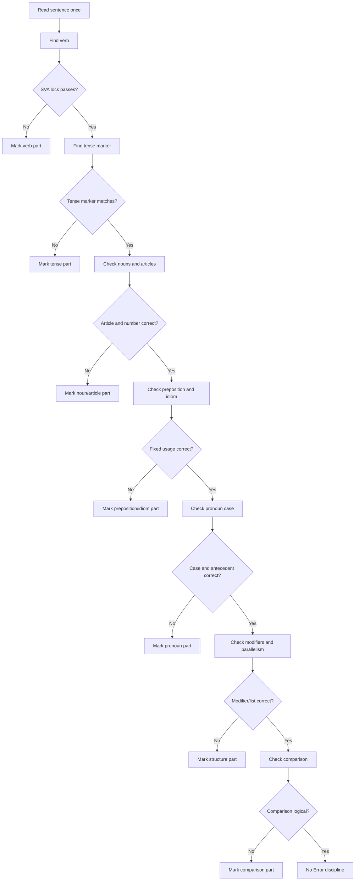

## Corpus Pressure

The promoted SSC book corpus currently gives this topic **581 promoted questions**. This is one of the biggest English scoring areas because it overlaps with sentence improvement, fill in the blanks, voice/narration, and cloze grammar. The largest cluster is `pinnacle-ssc-english-p0026-p0050`, which contributes **235 promoted questions**. The next cluster is `pinnacle-ssc-english-p0001-p0025`, which contributes **196 promoted questions**. The third major cluster is `pinnacle-ssc-english-p0051-p0075`, which contributes **148 promoted questions**.

For 200/200, grammar error spotting must be mechanical. You are not "feeling" English. You are scanning a sentence through fixed locks: SVA lock, tense marker, article-preposition, pronoun case, modifier placement, parallelism, comparison, idiom, and No Error discipline.

## Concept Ladder

**First principles: find the violated rule, not the awkward phrase**  
SSC error spotting gives one sentence divided into parts. Your task is to identify the part that breaks standard written grammar. Some parts sound awkward but are correct. Some parts sound familiar but are wrong. The answer must be tied to a rule.

**Level 1 - First 5-Second Classification**  
Classify the likely error family:
- Verb underlined: check subject-verb agreement and tense.
- Noun phrase underlined: check article, number, determiner, and comparison.
- Preposition underlined: check fixed usage and idiom.
- Pronoun underlined: check case, number, gender, and antecedent.
- Opening participle underlined: check modifier subject.
- List or correlative pair underlined: check parallelism.
- Nothing looks wrong: prepare for No Error discipline.

**Level 2 - SVA Lock**  
SVA lock means subject-verb agreement. Find the real subject and ignore interrupting phrases. "The quality of these mangoes is good" uses "is" because the subject is quality, not mangoes. Phrases like along with, together with, as well as, and in addition to do not change the subject number.

**Level 3 - Tense Marker Lock**  
Tense marker means a word or phrase that demands a tense. Yesterday, ago, last week usually demand simple past. Since and for with an ongoing action usually demand perfect tense. By the time with two past actions usually demands past perfect for the earlier action.

**Level 4 - Article-Preposition Lock**  
Articles test countability, specificity, and sound. Prepositions test fixed usage. "A university" is correct because the sound is yoo. "An honest man" is correct because h is silent. "Prefer to", "refrain from", "capable of", and "comply with" must be automatic.

**Level 5 - Pronoun Case and Owner Lock**  
After a preposition, use objective case: between you and me. After let, use object case: let him go. A pronoun must agree with its antecedent in number and person. Formal SSC patterns often treat everyone, each, and neither as singular.

**Level 6 - Modifier and Parallelism Lock**  
An opening -ing phrase must describe the subject immediately after the comma. Lists must stay in the same grammatical form. Correlative conjunctions need balance: not only X but also Y, either X or Y, neither X nor Y, both X and Y.

**Level 7 - Comparison and Idiom Lock**  
Comparisons must compare the same category: "The climate of Mumbai is warmer than that of Delhi." Avoid double comparatives such as more better. Idioms are fixed; do not reason them out under pressure.

**Level 8 - No Error Discipline**  
No Error discipline means you do not invent an error after the sentence passes every lock. In SSC, No Error is a real answer, not a surrender option. Mark it only after the scan is complete.

## Type System

| Type | Recognition cue | First lock | Method | Main trap |
|---|---|---|---|---|
| Subject-verb agreement | Verb near separated subject | SVA lock | Cross out intervening phrase; match verb to subject | Nearby plural noun |
| Either/or agreement | either/or, neither/nor | Nearest subject | Verb agrees with noun closest to it | Treating either as always singular |
| Each/every/anyone | each, every, everyone, nobody | Singular lock | Use singular verb and formal singular pronoun | Plural sense of group |
| Tense marker | since, for, ago, yesterday, by the time | Tense marker | Match marker to tense | Using past perfect without earlier past |
| Article | a/an/the before noun | Sound + specificity | Check vowel sound, countability, known noun | Letter not sound |
| Preposition | adjective/verb + preposition | Collocation | Recall fixed preposition | Translating from Hindi |
| Pronoun case | between, let, than, to, for | Case lock | Subject/object/possessive case | "I" sounding formal |
| Modifier | opening -ing/-ed phrase | Doer lock | Subject after comma must perform action | Dangling modifier |
| Parallelism | list, and/or, not only/but also | Form lock | Keep nouns/gerunds/infinitives parallel | Mixed forms |
| Comparison | than/as/superlative | Category lock | Compare same class and correct degree | City vs climate |
| Idiom | fixed expression | Phrase lock | Memorize exact phrase | Near-synonym preposition |
| No Error | no clear violation | Full scan | Mark after all locks pass | Overcorrection |

## Speed Methods

**15-second scan order**

1. Locate the verb: apply SVA lock.
2. Locate time markers: apply tense marker lock.
3. Scan nouns: article, number, countable/uncountable.
4. Scan prepositions and idioms.
5. Scan pronouns: case and antecedent.
6. Scan modifiers and word order.
7. Scan lists/correlatives for parallelism.
8. Scan comparisons.
9. If all pass, use No Error discipline.

**SVA high-frequency rules**

| Pattern | Correct rule |
|---|---|
| The list of items is | Subject before of decides |
| The players as well as the coach are | Main subject before as well as decides |
| Each of the boys is | Each/every/nobody/everyone singular |
| Neither the teacher nor the students are | Nearest subject after nor decides |
| One of the boys who are | Relative clause refers to boys |
| The number of students is | The number singular |
| A number of students are | A number plural sense |
| Mathematics is | Subject name treated singular |
| Police are | Police treated plural |
| Furniture is | Uncountable singular |

**Tense marker table**

| Marker | Expected tense |
|---|---|
| yesterday, ago, last year | Simple past |
| since + point of time | Present perfect or present perfect continuous |
| for + duration | Perfect/perfect continuous when action continues |
| by the time + past event | Past perfect for earlier action |
| already/yet/just | Present perfect in present context |
| no sooner did | Simple past after than |
| If I were you | Subjunctive were |
| universal truth | Simple present |

**Article-preposition bank**

| Expression | Correct form |
|---|---|
| an honest man | an before vowel sound |
| a university | a before yoo sound |
| the Ganga | the before river names |
| interested in | fixed preposition |
| capable of | fixed preposition |
| prefer A to B | to, not than |
| senior to | to, not than |
| different from | from |
| comply with | with |
| refrain from | from |
| accused of | of |
| insist on | on |

## Trap Table

| Trap | Trigger wording | Wrong move | Correct move | Repair drill |
|---|---|---|---|---|
| Intervening phrase | The quality of apples are | Agree with apples | Agree with quality | Cross out of-phrase |
| Along with | The captain along with players are | Treat players as subject | Captain is subject | Remove along-with phrase |
| Either/or | Either Ram or his friends is | Singular because either | Nearest subject friends -> are | Nearest noun drill |
| Since misuse | I am living here since 2015 | Present continuous | Have been living | Since/for drill |
| Past perfect misuse | I had gone yesterday | Use had for past | Simple past went | Earlier-past check |
| Article sound | a honest man | Letter h | an honest man | Sound drill |
| University article | an university | vowel letter u | a university | Sound drill |
| Pronoun after between | between you and I | I sounds formal | between you and me | Object-case drill |
| Let case | let he go | Subject case | let him go | Let + object drill |
| Dangling modifier | Walking home, the rain started | Rain walking | While I was walking | Doer after comma |
| Only placement | He only ate rice | only before verb | He ate only rice | Place near modified word |
| Parallelism | likes swimming, to run, and biking | Mixed forms | swimming, running, biking | List form drill |
| Comparison class | salary of a clerk is lower than a manager | salary vs manager | salary lower than that of manager | That-of drill |
| Double comparative | more better | Emphasis | better | Degree drill |
| No Error overcorrection | one of those who are | Force singular | Relative refers to plural noun | One-of drill |

## Flowchart

## Solved Examples

**Example 1: SVA with of-phrase**  
(1) The quality of these mangoes (2) are excellent (3) and their price (4) is reasonable. (5) No error  
**Solution**: Subject is quality, singular. Use is. **Answer: (2)**

**Example 2: Along with phrase**  
(1) The captain along with his players (2) are going (3) to attend the ceremony. (4) No error  
**Solution**: Along with does not change subject. Captain is singular. **Answer: (2)**

**Example 3: Either/or nearest subject**  
(1) Either the teacher (2) or the students (3) is responsible (4) for the delay. (5) No error  
**Solution**: Verb agrees with nearest subject students. Use are. **Answer: (3)**

**Example 4: Since marker**  
(1) She is living (2) in Delhi (3) since 2018. (4) No error  
**Solution**: Since + point of time needs perfect continuous. "has been living". **Answer: (1)**

**Example 5: Past marker**  
(1) I have seen (2) him yesterday (3) near the station. (4) No error  
**Solution**: Yesterday needs simple past: saw. **Answer: (1)**

**Example 6: Past perfect**  
(1) He had reached the station (2) before the train (3) arrived. (4) No error  
**Solution**: Earlier of two past actions takes past perfect. Sentence is correct. **Answer: (4)**

**Example 7: Article sound**  
(1) He is (2) a honest officer (3) in the department. (4) No error  
**Solution**: Honest begins with vowel sound. Use an. **Answer: (2)**

**Example 8: University sound**  
(1) She studies at (2) an university (3) in Pune. (4) No error  
**Solution**: University begins with yoo sound. Use a. **Answer: (2)**

**Example 9: River article**  
(1) Ganga is (2) one of the holiest rivers (3) in India. (4) No error  
**Solution**: River names take the. Use The Ganga. **Answer: (1)**

**Example 10: Prefer to**  
(1) I prefer coffee (2) than tea (3) in the morning. (4) No error  
**Solution**: Prefer takes to, not than. **Answer: (2)**

**Example 11: Senior to**  
(1) She is senior (2) than me (3) by two years. (4) No error  
**Solution**: Senior takes to. Also formal object after to is me. **Answer: (2)**

**Example 12: Between case**  
(1) This secret is (2) between you and I (3) only. (4) No error  
**Solution**: Between takes objective case: you and me. **Answer: (2)**

**Example 13: Let case**  
(1) The teacher (2) let he go (3) after the test. (4) No error  
**Solution**: Let takes object case: let him go. **Answer: (2)**

**Example 14: Dangling modifier**  
(1) Walking through the market, (2) a beautiful shop (3) attracted my attention. (4) No error  
**Solution**: Shop was not walking. Modifier is dangling. **Answer: (1)**

**Example 15: Only placement**  
(1) He only eats rice (2) during illness (3) to avoid spice. (4) No error  
**Solution**: If meaning is "eats only rice", only should be before rice. **Answer: (1)**

**Example 16: Parallelism**  
(1) She likes (2) swimming, running (3) and to cycle. (4) No error  
**Solution**: Keep all gerunds: swimming, running, and cycling. **Answer: (3)**

**Example 17: Not only inversion**  
(1) Not only he was late, (2) but he also (3) forgot the file. (4) No error  
**Solution**: With sentence-opening not only, use inversion: Not only was he late. **Answer: (1)**

**Example 18: Comparison class**  
(1) The climate of Chennai (2) is hotter than Delhi (3) in May. (4) No error  
**Solution**: Compare climate with climate: hotter than that of Delhi. **Answer: (2)**

**Example 19: Double comparative**  
(1) This method is (2) more easier (3) than the old one. (4) No error  
**Solution**: Easier is already comparative. Remove more. **Answer: (2)**

**Example 20: One of those who**  
(1) He is one of those players (2) who always practice (3) after school. (4) No error  
**Solution**: Who refers to players, plural. Practice is correct. **Answer: (4)**

**Example 21: A number / the number**  
(1) A number of students (2) is waiting (3) outside the hall. (4) No error  
**Solution**: A number of = plural sense. Use are waiting. **Answer: (2)**

**Example 22: Uncountable noun**  
(1) The furniture in this room (2) are old (3) and damaged. (4) No error  
**Solution**: Furniture is uncountable singular. Use is. **Answer: (2)**

**Example 23: Police plural**  
(1) The police (2) is investigating (3) the matter. (4) No error  
**Solution**: Police is treated plural. Use are investigating. **Answer: (2)**

**Example 24: No sooner**  
(1) No sooner did he arrive (2) than the children (3) had started shouting. (4) No error  
**Solution**: After no sooner did, use simple past: started. **Answer: (3)**

**Example 25: No Error discipline**  
(1) One of the boys (2) who are standing there (3) is my cousin. (4) No error  
**Solution**: "Who are standing" refers to boys; "one is my cousin" is singular. Sentence is correct. **Answer: (4)**

## PYQ Mapping

**Practice route**  
/exams/ssc-cgl/topics/grammar-error-spotting

**Primary cluster: pinnacle-ssc-english-p0026-p0050**  
Use this as the first grammar-error bank. It should be tagged into SVA, tense marker, article-preposition, pronoun case, and No Error. The volume makes it ideal for timed 15-second scanning.

**Primary cluster: pinnacle-ssc-english-p0001-p0025**  
Use this for foundation rules and mixed traps. It is especially useful before attempting sentence improvement because the same grammar locks reappear in correction format.

**Primary cluster: pinnacle-ssc-english-p0051-p0075**  
Use this for fatigue practice after vocabulary or reading comprehension. The goal is to keep the scan order stable when English section time pressure is high.

**Crossover practice**  
Sentence Improvement, Active-Passive Direct-Indirect, Fill in the Blanks, and Cloze Test all reuse these grammar locks. Any mistake in those topics should be repaired here if the root cause is SVA, tense, article, preposition, pronoun, modifier, parallelism, comparison, or idiom.

## 200/200 Drill

**Daily 18-minute grammar block**

1. SVA lock, 3 minutes: underline only the real subject and verb in 20 sentences.
2. Tense marker drill, 3 minutes: write the marker and required tense for 20 phrases.
3. Article-preposition drill, 3 minutes: complete 25 fixed expressions.
4. Pronoun case drill, 3 minutes: convert subject/object/possessive forms after prepositions and verbs.
5. Structure drill, 3 minutes: repair modifiers, parallel lists, and comparisons.
6. No Error discipline, 3 minutes: solve 10 correct sentences without inventing errors.

**15-second exam routine**
- 0-3 seconds: locate verb and subject.
- 3-6 seconds: check time marker and noun/article.
- 6-9 seconds: check preposition and pronoun.
- 9-12 seconds: check modifier, parallelism, comparison.
- 12-15 seconds: choose the part or mark No Error.

**Repair rules**
- SVA miss: cross out every phrase between subject and verb in 20 examples.
- Tense miss: write marker -> tense -> corrected sentence.
- Preposition miss: add it to the fixed-expression bank and drill both directions.
- Pronoun miss: write the governing word: between, let, than, to, for, with.
- Structure miss: rewrite the sentence in a simpler form before checking the rule.
- No Error miss: write which lock you falsely suspected and why it passed.

Grammar error spotting becomes reliable when the scan order is automatic. Do not read options first. Read the sentence, apply locks, mark the violated part, and move.
<!-- SSC-FINAL-PRACTICE-QUEUE:START -->
## Final Practice Queue

1. Start one-by-one practice: [Grammar and Error Spotting practice](/exams/ssc-cgl/practice/grammar-error-spotting). Finish every question in this topic bank, not just the samples in the note.
2. Move to timed sets: [SSC CGL tests](/exams/ssc-cgl/tests?topic=grammar-error-spotting). Use topic drills first, then section mocks once accuracy is stable.
3. Repair every miss immediately: record the error label, redo 20 mixed questions from the same topic, then retest after 24 hours.
4. 200/200 rule: do not mark this topic exam-ready until correct answers come within 36 seconds and wrong answers are explained without looking at the solution.

<!-- SSC-FINAL-PRACTICE-QUEUE:END -->
