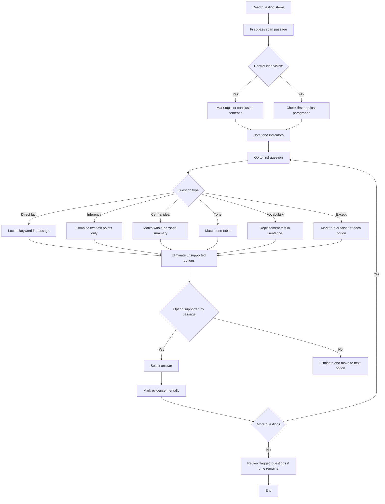

## Corpus Pressure

This note is built around the promoted SSC CGL book-PYQ slice for `reading-comprehension`: **450 promoted questions**. The corpus pressure is concentrated in three clusters: `pinnacle-ssc-english-p0401-p0425`, which contributes **232 promoted questions**, `pinnacle-ssc-english-p0351-p0375`, which contributes **130 promoted questions**, and `pinnacle-ssc-english-p0376-p0400`, which contributes **88 promoted questions**. This is not a low-frequency topic. It is a complete English sub-skill that must be trained as a timed evidence game.

For 200/200, Reading Comprehension must be handled with a strict evidence ladder:

## Evidence Ladder

| Evidence Level | What It Means | Use It For | Reject If |
|---|---|---|---|
| Level 1: Direct line | The passage states the answer directly or with a simple synonym | direct fact, except questions | option changes number, time, cause, scope, or actor |
| Level 2: Paraphrase | Every clause in the option maps to a passage statement | central idea, title, purpose | option is broader or narrower than the passage |
| Level 3: Forced inference | The answer must follow from two passage facts | inference, assumption | option is merely possible, common sense, or outside knowledge |
| Level 4: Tone signal | Adjectives, verbs, contrast words, and conclusion reveal attitude | tone, author's attitude | option labels emotion not shown by the author |

### First 5-Second Classification

1. Read the question stem and mark the type: fact, inference, title, tone, word-in-context, except, purpose, or structure.
2. Decide where evidence lives: a line, a paragraph, whole passage, or sentence around a word.
3. Predict the answer in plain words before reading options.
4. Reject options with extreme language, outside knowledge, half-truths, or reversed cause/effect.
5. If the answer requires more than two evidence links, mark and return; the English section cannot absorb long RC wandering.

## Concept Ladder

**Step 1: First Principles - What Is Reading Comprehension?**
Reading Comprehension (RC) in SSC CGL Tier-I tests your ability to extract meaning from a short passage (250-400 words) within a 15-minute English section. Every question is passage-dependent: no prior knowledge, no assumptions beyond the text.

**Step 2: The Core Skill - Active Reading with a Purpose**
You do not read for enjoyment; you read to locate evidence. The goal is to map passage structure in under 60 seconds so that questions can be answered quickly. Active reading means:
- Scanning the first and last sentence of each paragraph for the central argument.
- Underlining key names, numbers, dates, and contrast words (but, however, yet).
- Noting the author's attitude (positive, negative, neutral) from adjectives and verbs.

**Step 3: Passage First-Read Strategy**
1. Read the question stems first (if allowed) to know what to look for.
2. Skim the passage at 300-400 words per minute. Do not linger on unfamiliar words.
3. Mark the passage with simple codes: CI for central idea sentence, T for tone indicators, V for vocabulary context.
4. Spend no more than 60-70 seconds on the first read.

**Step 4: Question Types and Their Demands**
- **Central Idea / Title**: Requires synthesising the overall message. Look for repetitive keywords and the concluding sentence.
- **Direct Fact**: Locate a specific detail. Answer is verbatim or near-verbatim from the passage.
- **Inference**: Must be logically deduced from one or two sentences. Never bring outside knowledge.
- **Tone / Author's Attitude**: Recognised through word choice, punctuation (!, ?), and rhetorical devices.
- **Vocabulary in Context**: Replace the word with the given options in the original sentence - only one fits grammatically and semantically.
- **Negative / Except Questions**: Identify the three correct statements from the passage; the remaining option is the answer.

**Step 5: Option Elimination - The SSC Game Changer**
Most RC questions have three distractors that are either:
- Opposite to the passage
- Too broad or too narrow
- Unreferred (not mentioned at all)
- Using absolute words (always, never, all) when the passage is tentative

Algorithm:
1. Read the question and predict an answer in your own words.
2. Eliminate any option that does not match the passage evidence.
3. Choose the best match among remaining - often the one that uses synonyms of passage words.

**Step 6: Integration - 200/200 Level**
A 200/200 scorer does not rely on luck. They:
- Complete all RC questions in under 8 minutes (leaving 7 minutes for other English topics).
- Use a repeatable process: first-read -> question attack -> evidence mark -> elimination -> final check.
- Never spend more than 90 seconds on any single question; if stuck, they mark and move.
- Practise with a timer to internalise speed and accuracy.

## Type System

| Type | Recognition Cue | Method | Speed Target | Trap |
|------|----------------|--------|--------------|------|
| Central Idea / Title | "The passage is mainly about...", "The best title is..." | Identify topic sentence (often first or last). Check keyword repetition. Summarise in one sentence. Eliminate options too specific or too broad. | 40 sec | Choosing a supporting detail as the main idea; or a title that covers only one paragraph. |
| Direct Fact | "According to the passage...", "Which of the following is true?" | Locate keywords in passage. Match exactly or with synonym. No inference. | 25 sec | Distractor using opposite or slightly changed wording (e.g., "always" instead of "often"). |
| Inference | "It can be inferred that...", "The passage suggests..." | Combine two or more passage facts. Stay within logical boundaries. Do not create new facts. | 50 sec | Over-inference (conclusion not supported) or using common sense. |
| Tone / Attitude | "The tone of the passage is...", "Author's attitude towards..." | Scan for emotional words, punctuation, and rhetorical questions. Classify as positive, negative, neutral, critical, optimistic, etc. | 45 sec | Misreading irony; confusing neutral with sarcastic. |
| Vocabulary in Context | "Choose the synonym closest in meaning to the word 'X' as used in the passage." | Replace the word with each option in the original sentence. Only one fits both grammar and context. | 20 sec | Choosing a dictionary meaning that does not match the passage usage. |
| Negative / Except | "All of the following are true EXCEPT..." | Identify three true statements from passage; the leftover is false or not mentioned. | 60 sec | Overlooking a true statement that is paraphrased; selecting a true statement due to haste. |
| Purpose / Function | "The author mentions 'X' in order to..." | Locate the phrase. Ask: why is it here? To illustrate, contrast, give example, refute, etc. | 40 sec | Confusing purpose with content (e.g., "to show that X happened" when it is to provide evidence). |
| Structure | "How is the passage organised?" | Look at paragraph openings: problem-solution, cause-effect, chronological, compare-contrast. | 35 sec | Picking a structure that fits one paragraph but not the whole passage. |

## Speed Methods

**Method 1: P.A.S.S. - Passage Mapping (60 seconds)**
- **P**review: Read question stems (20 sec)
- **A**nalyse: Scan passage - underline topic sentence, contrast words, tone indicators (30 sec)
- **S**ynthesise: Mentally note central idea and tone (10 sec)
- **S**olve: Go to questions; for each, locate evidence quickly.

**Method 2: E.L.I.M.I.N.A.T.E. - Option Elimination Decision Rule**
| Step | Action | Time |
|------|--------|------|
| 1 | Read question and predict answer in your words. | 5 sec |
| 2 | Identify extreme words (all, none, never, always) - often wrong. | 3 sec |
| 3 | Eliminate options that are opposite to passage. | 5 sec |
| 4 | Eliminate options that are not mentioned (outside passage). | 5 sec |
| 5 | Eliminate options that use exact passage words but twist meaning. | 5 sec |
| 6 | Choose the remaining option; it is usually the answer. | 2 sec |

**Method 3: Tone Detection Table**
| Tone | Words | Example |
|------|-------|---------|
| Positive | optimistic, hopeful, admirable, beneficial | "The innovation transformed lives." |
| Negative | critical, pessimistic, deplorable, alarming | "The policy has caused irreparable damage." |
| Neutral | factual, objective, descriptive | "The experiment lasted six months." |
| Sarcastic | ironic, mocking, scornful | "What a brilliant idea to ignore the evidence." |
| Ambivalent | mixed, hesitant, uncertain | "While promising, the results raise questions." |

**Method 4: Vocabulary in Context - Replacement Test**
1. Locate the sentence with the given word.
2. Remove the word; insert each option.
3. The correct option will make sense in that specific sentence.
4. Check collocation (e.g., "mitigate" goes with "risk", not "increase").
5. Do not rely solely on memory; always read the surrounding text.

**Method 5: Negative Question - True/False Grid**
- Draw a small table mentally or on scratchpad:
  - Option A: True? (mark if supported)
  - Option B: True?
  - Option C: True?
  - Option D: ?
- Identify the one not supported - that is the answer.
- Be careful: sometimes three are true and one is false; sometimes one is true and three are false (rarely). Usually three true, one false.

## Trap Table

| Trap | Trigger Wording | Wrong Move | Correct Move | Repair Drill |
|------|-----------------|------------|--------------|--------------|
| Extreme Language | "always, never, all, every" | Choose option because it matches your opinion. | Verify if passage has absolute words. If not, eliminate. | Practise spotting absolutes in options vs passage. |
| Outside Knowledge | "As we know, X is famous for..." | Use your own knowledge to answer. | Stick strictly to passage content. | Rewrite passage in your own words; check against options. |
| Synonym Switch | "The author said 'consequence' but option has 'result'" | Assume they are same without checking nuance. | Match the exact context; 'consequence' may be negative, 'result' neutral. | Do synonym replacement drills in context. |
| Half-True Option | "The passage mentions X and Y, so option saying X is correct" | Pick option because part of it is true. | Check that every clause in option is fully supported. | Break complex options into clauses; verify each. |
| Tone Misread | "The passage is critical" when the author only reports criticism | Assume any negative word indicates criticism. | Distinguish between reporting criticism and author's own criticism. | Practise tone with passages that use direct quotes. |
| Inference Jump | "The passage says A caused B; you infer A caused C" | Overstretch the link. | Only make obvious, logical connections - especially cause-effect and conditionals. | Practise "what must be true" vs "what might be true". |
| Title Too Broad | "A passage about Indian economy; choose 'Economy and Society'" | Pick a broad title that fits. | Select the title that captures the specific focus. | Compare narrow and broad titles; always prefer specific. |
| Title Too Narrow | "One paragraph talks about microfinance; choose 'Microfinance'" | Pick a detail as title. | Ensure title covers whole passage, not just one paragraph. | Summarise each paragraph and check title covers all. |
| Except Question Overlook | "Which is NOT true? Option B is true but you pick A" | Rush and pick first option that seems false. | Verify true/false for each option individually. | Do timed except-question sets. |
| Word in Context - Dictionary Bias | "Pristine means pure, clean; choose 'pure'" (but passage says "pristine forest") | Choose 'pure' without checking collocation. | 'Pristine' in passage may mean unspoiled, not just clean. | Always read 2 lines around the word. |
| Author's Purpose Confusion | "Author says 'For example' - purpose is to give example" (wrong) | Think purpose is example itself. | Real purpose is often to support a claim or illustrate a point. | Practise distinguishing 'what' from 'why'. |
| Sequence Error | "The passage first discusses X then Y; option reverses order" | Choose option because both X and Y appear. | Trace the logical order. | Number the events as they appear. |
| Negative Trap | "The author refutes the idea that..." | Assume author agrees with the refuted idea. | The author introduces a view to oppose it; the passage supports the opposite. | Practise identifying concession and refutation structures. |
| Comparison Distortion | "Passage says A is better than B; option says B is worse than A" | Miss the symmetric relationship. | 'Better than' does not always mean B is bad; just inferior. | Practise comparative statements. |
| Unstated Assumption | "The passage implies that policy failed" (but it only says there were challenges) | Assume failure from challenges. | 'Challenges' does not equal 'failure'. | Distinguish weak vs strong inferences. |

## Flowchart

## Solved Examples

**Example 1 (Direct Fact)**
Passage: "The harpy eagle, one of the largest raptors in the world, inhabits the tropical rainforests of Central and South America. Its primary diet consists of sloths and monkeys."  
Question: According to the passage, the harpy eagle feeds mainly on:  
A) rodents and fish  
B) sloths and monkeys  
C) fruits and nuts  
D) other birds  
Answer: B  
Explanation: The passage directly states "primary diet consists of sloths and monkeys." Option B is verbatim.

**Example 2 (Inference)**
Passage: "By 2050, urban areas are expected to house 68% of the world's population. Already, cities consume over two-thirds of global energy."  
Question: It can be inferred that:  
A) Rural areas will become uninhabitable by 2050.  
B) Urban energy consumption will likely increase.  
C) City populations are declining.  
D) Energy consumption is unrelated to population.  
Answer: B  
Explanation: The passage states that cities currently consume >2/3 of energy, and urban population will increase. It logically follows that urban energy consumption will rise. Option A is extreme, C opposite, D contradicts.

**Example 3 (Central Idea)**
Passage: "Microplastics have been found in the deepest ocean trenches and in Arctic ice. They enter the food chain, accumulate in animals, and have been detected in human blood. While the health effects are still being studied, the pervasive nature of microplastics raises serious environmental concerns."  
Question: The central idea of the passage is:  
A) Microplastics are found only in the ocean.  
B) Microplastics are a widespread pollutant with potential health and environmental risks.  
C) The health effects of microplastics are well understood.  
D) Arctic ice is free of microplastics.  
Answer: B  
Explanation: The passage covers the spread, food chain entry, and health concerns. Option B captures both pervasiveness and risk. A and D are false; C contradicts "still being studied".

**Example 4 (Tone)**
Passage: "It is truly commendable that the government has allocated funds for renewable energy projects. This forward-looking initiative will undoubtedly benefit future generations."  
Question: The tone of the passage is:  
A) critical  
B) neutral  
C) admiring  
D) sarcastic  
Answer: C  
Explanation: Words like "truly commendable", "forward-looking", "undoubtedly benefit" indicate a positive, admiring tone. Not neutral, not critical, not sarcastic.

**Example 5 (Vocabulary in Context)**
Passage: "The researcher attempted to **mitigate** the adverse effects of the experiment by adjusting the temperature."  
Question: The word "mitigate" as used in the passage most closely means:  
A) increase  
B) eliminate  
C) reduce  
D) measure  
Answer: C  
Explanation: "Mitigate" means to make less severe. In the sentence, adjusting temperature reduces adverse effects. "Increase" is opposite; "eliminate" too strong; "measure" doesn't fit.

**Example 6 (Negative / Except)**
Passage: "The Renaissance saw a resurgence in art, science, and literature. Key figures include Leonardo da Vinci, Michelangelo, and Galileo. This period followed the Middle Ages and preceded the Age of Enlightenment."  
Question: All of the following are true EXCEPT:  
A) The Renaissance came after the Middle Ages.  
B) Leonardo da Vinci was a key figure.  
C) The Renaissance only influenced art.  
D) The period preceded the Age of Enlightenment.  
Answer: C  
Explanation: The passage states resurgence in art, science, and literature, not only art. Options A, B, D are directly stated.

**Example 7 (Purpose)**
Passage: "The shift to remote work has increased productivity in many sectors. **For instance**, software companies report a 20% rise in output."  
Question: The author mentions "software companies" in order to:  
A) show that remote work is beneficial only for tech firms.  
B) provide an example supporting the claim about productivity.  
C) compare software companies with other sectors.  
D) argue that remote work reduces productivity.  
Answer: B  
Explanation: The phrase "For instance" signals an example. The sentence is giving evidence for the claim of increased productivity.

**Example 8 (Inference - Author's Assumption)**
Passage: "Many people believe that drinking eight glasses of water a day is essential. However, recent studies suggest that water needs vary greatly depending on activity level and climate."  
Question: The author assumes that:  
A) The old belief is completely false.  
B) Individual factors affect water requirements.  
C) Everyone should drink the same amount.  
D) Studies are unreliable.  
Answer: B  
Explanation: The author presents old belief versus new studies; the assumption underlying the studies is that water needs vary by activity and climate. Option A is extreme; C opposite; D not mentioned.

**Example 9 (Structure)**
Passage: "The first paragraph presents the problem of plastic waste. The second paragraph discusses its impact on marine life. The third paragraph proposes recycling as a solution."  
Question: How is the passage organised?  
A) Problem-solution  
B) Chronological order  
C) Compare and contrast  
D) Cause and effect  
Answer: A  
Explanation: The structure is problem (paragraph 1), impact (paragraph 2), solution (paragraph 3). This fits problem-solution.

**Example 10 (Title Selection)**
Passage: "The Amazon rainforest produces about 20% of the world's oxygen. Its deforestation threatens biodiversity and accelerates climate change. Conservation efforts include protected areas and sustainable practices."  
Question: Which is the most appropriate title for the passage?  
A) The Amazon's Oxygen Production  
B) Deforestation in the Amazon  
C) The Amazon: A Vital Ecosystem Under Threat  
D) Conservation Practices  
Answer: C  
Explanation: The passage covers oxygen, deforestation threat, and conservation. Option C encompasses all. A and D are too narrow; B only focuses on threat.

**Example 11 (Half-True Option)**
Passage: "The new policy reduced paperwork for small businesses but increased reporting duties for large firms."  
Question: Which statement is supported by the passage?  
A) The policy reduced paperwork for every business.  
B) Small businesses faced less paperwork, while large firms had more reporting duties.  
C) Large firms no longer had reporting duties.  
D) The policy affected only large firms.  
Answer: B  
Explanation: Option B maps both clauses correctly. A overgeneralises, C reverses the passage, and D ignores small businesses.

**Example 12 (Extreme Language)**
Passage: "Some researchers believe that early sleep improves memory retention."  
Question: Which option is best supported?  
A) All researchers agree that early sleep always improves memory.  
B) Some researchers link early sleep with better memory retention.  
C) Sleep has no effect on memory.  
D) Memory depends only on sleep.  
Answer: B  
Explanation: The passage uses "some" and "believe"; options with all, always, no, and only are too extreme.

**Example 13 (Vocabulary in Context)**
Passage: "The minister's statement was **ambiguous**, leaving officials unsure about the next step."  
Question: "Ambiguous" most nearly means:  
A) clear  
B) uncertain  
C) angry  
D) official  
Answer: B  
Explanation: The context "leaving officials unsure" points to uncertain or unclear. The replacement test confirms B.

**Example 14 (Tone - Neutral Reporting)**
Passage: "The report lists three causes of water scarcity: low rainfall, poor storage, and excessive use."  
Question: The tone is:  
A) sarcastic  
B) neutral  
C) angry  
D) celebratory  
Answer: B  
Explanation: The passage reports facts without emotion or judgement. Negative subject matter does not automatically make the tone critical.

**Example 15 (Purpose of Example)**
Passage: "Several cities have improved public transport. For example, Indore expanded bus routes and increased service frequency."  
Question: Indore is mentioned to:  
A) prove that only Indore has good transport.  
B) give an example of cities improving public transport.  
C) criticise bus routes.  
D) compare Indore with all cities.  
Answer: B  
Explanation: "For example" supports the previous general claim. The purpose is evidence, not exclusivity.

**Example 16 (Sequence)**
Passage: "The committee first examined the accounts, then interviewed the officials, and finally submitted a report."  
Question: What happened immediately before the report was submitted?  
A) Accounts were examined.  
B) Officials were interviewed.  
C) The report was rejected.  
D) The committee was formed.  
Answer: B  
Explanation: The sequence is accounts -> interviews -> report. Immediately before the report, officials were interviewed.

**Example 17 (Cause and Effect)**
Passage: "Because the river overflowed after heavy rainfall, nearby fields remained submerged for two days."  
Question: Why did the fields remain submerged?  
A) The river overflowed after heavy rainfall.  
B) Farmers irrigated them.  
C) The river dried up.  
D) Rainfall stopped completely.  
Answer: A  
Explanation: The causal connector "because" gives the reason directly.

**Example 18 (Except Question)**
Passage: "The museum is closed on Mondays, offers free entry to students, and displays manuscripts from the medieval period."  
Question: All are true EXCEPT:  
A) The museum is closed on Mondays.  
B) Students can enter free.  
C) It displays medieval manuscripts.  
D) It remains open every day.  
Answer: D  
Explanation: A, B, and C are stated. D contradicts the Monday closure.

**Example 19 (Inference Boundary)**
Passage: "The number of electric buses in the city doubled this year, but diesel buses still form the majority of the fleet."  
Question: It can be inferred that:  
A) Electric buses now form the majority.  
B) Diesel buses are no longer used.  
C) Electric buses increased, but diesel buses are still more numerous.  
D) The city banned diesel buses.  
Answer: C  
Explanation: C combines both facts. A, B, and D go beyond or contradict the passage.

**Example 20 (Central Idea)**
Passage: "Community libraries provide affordable access to books, quiet study spaces, and digital resources. In areas with limited internet access, they also help students complete online applications."  
Question: The passage mainly highlights:  
A) why books are outdated.  
B) the role of community libraries in learning and access.  
C) the cost of online applications.  
D) the design of library buildings.  
Answer: B  
Explanation: The passage lists multiple access functions of libraries. B covers all of them.

**Example 21 (Author's Attitude)**
Passage: "The proposal is ambitious, but without proper funding and trained staff, it may remain only a promise."  
Question: The author's attitude is best described as:  
A) cautiously critical  
B) completely celebratory  
C) indifferent  
D) sarcastic  
Answer: A  
Explanation: "Ambitious" is positive, but the funding/staff warning makes the attitude cautious and critical.

**Example 22 (Structure)**
Passage: "The first paragraph describes the rise of online learning. The second paragraph lists its benefits. The third paragraph discusses unequal access."  
Question: The passage is organised mainly as:  
A) chronology only  
B) introduction, advantages, and limitation  
C) biography  
D) fiction narrative  
Answer: B  
Explanation: The passage moves from trend to benefits to limitation.

**Example 23 (Paraphrase Evidence)**
Passage: "The scheme was designed to support farmers during periods of crop failure."  
Question: Which option best paraphrases the sentence?  
A) The scheme helped farmers when crops failed.  
B) The scheme stopped all crop failure.  
C) Farmers designed the scheme.  
D) Crop failure was impossible under the scheme.  
Answer: A  
Explanation: A preserves the meaning. B and D exaggerate; C reverses actor.

**Example 24 (Word Function)**
Passage: "Although the technology is expensive, it can reduce long-term energy costs."  
Question: The word "Although" signals:  
A) addition  
B) contrast  
C) conclusion  
D) example  
Answer: B  
Explanation: "Although" introduces a contrast between high initial cost and long-term savings.

**Example 25 (Outside Knowledge Trap)**
Passage: "The passage says that the lake attracts migratory birds during winter."  
Question: Which statement is supported?  
A) The lake attracts migratory birds in winter.  
B) The lake is the largest in India.  
C) All birds at the lake are migratory.  
D) The lake freezes every winter.  
Answer: A  
Explanation: Only A is stated. B, C, and D may sound plausible in some contexts, but they are not supported by the given passage.

## PYQ Mapping

| Corpus Cluster / Type | Promoted Question Pressure | What to Practice | Route |
|---|---:|---|---|
| `pinnacle-ssc-english-p0401-p0425` | 232 questions | High-density RC passages, direct fact, inference, vocabulary-in-context | /exams/ssc-cgl/topics/reading-comprehension |
| `pinnacle-ssc-english-p0351-p0375` | 130 questions | Passage evidence, title, tone, and except questions | /exams/ssc-cgl/topics/reading-comprehension |
| `pinnacle-ssc-english-p0376-p0400` | 88 questions | Mixed RC plus cloze/vocabulary spillover | /exams/ssc-cgl/topics/reading-comprehension |
| Direct Fact questions | Most common | Locate exact phrase or synonym; no inference | /exams/ssc-cgl/topics/reading-comprehension |
| Inference questions | High weight | Apply the "must be true" filter | /exams/ssc-cgl/topics/reading-comprehension |
| Central Idea / Title | Repeat type | Summarise each passage in one sentence before options | /exams/ssc-cgl/topics/reading-comprehension |
| Tone / Attitude | High payoff | Use tone lists and context clues | /exams/ssc-cgl/topics/vocabulary-cloze |
| Vocabulary in Context | Integrated with RC | Replacement test in the original sentence | /exams/ssc-cgl/topics/vocabulary-cloze |
| Timed English sprint | Section pressure | Build 8-minute RC habits inside the 15-minute English timer | /exams/ssc-cgl/tests/ssc-cgl-english-comprehension-speed-sprint |

## 200/200 Drill

**Timed Micro-Drills (Total 10 minutes)**

**Drill 1: Rapid First-Read (3 minutes)**
- Take 5 unseen passages of ~250 words.
- For each, write down central idea in 10 words and tone in one word.
- Time: 36 seconds per passage. Target: 4/5 correct.

**Drill 2: Direct Fact Sprint (2 minutes)**
- 10 direct fact questions from past SSC passages.
- Use only keyword matching. Time per question: 12 seconds.
- Repair: If wrong, check if you misread the passage or fell for synonym switch.

**Drill 3: Inference or Assumption? (2 minutes)**
- 8 questions labelled "inference" with a mix of direct facts, valid inferences, and outside-knowledge traps.
- Decide: passage evidence? logical step? or unsupported?
- Target: 7/8 correct. Repair: Re-categorise each question.

**Drill 4: Except Question Blitz (1.5 minutes)**
- 5 except questions. Mark T/F for each option on scratch in 18 seconds per question.
- Target: 5/5. Repair: If wrong, check if you misidentified a true statement as false.

**Drill 5: Vocabulary in Context (1.5 minutes)**
- 10 vocabulary-in-context items (single sentence with word).
- Use replacement test. Time per: 9 seconds.
- Target: 9/10. Repair: Review collocation.

**Repair Rules**
- If you exceed 90 seconds on any question: abandon and move on. Revisit only if time remains.
- If you get a direct fact wrong: practice locating exact phrases - your scan speed may be too fast.
- If you get inference wrong: ask "Is this conclusion forced by the text?" If no, eliminate.
- If you pick an outside knowledge option: mentally flag "STOP - passage only".
- If you misread tone: return to tone words table before next drill.

**Final 200/200 Check**
- Score 90%+ on these drills three consecutive times.
- Then raise the bar to 95%+ with every wrong answer tagged as fact miss, inference jump, tone miss, or option-trap miss.
<!-- SSC-FINAL-PRACTICE-QUEUE:START -->
## Final Practice Queue

1. Start one-by-one practice: [Reading Comprehension practice](/exams/ssc-cgl/practice/reading-comprehension). Finish every question in this topic bank, not just the samples in the note.
2. Move to timed sets: [SSC CGL tests](/exams/ssc-cgl/tests?topic=reading-comprehension). Use topic drills first, then section mocks once accuracy is stable.
3. Repair every miss immediately: record the error label, redo 20 mixed questions from the same topic, then retest after 24 hours.
4. 200/200 rule: do not mark this topic exam-ready until correct answers come within 36 seconds and wrong answers are explained without looking at the solution.

<!-- SSC-FINAL-PRACTICE-QUEUE:END -->
