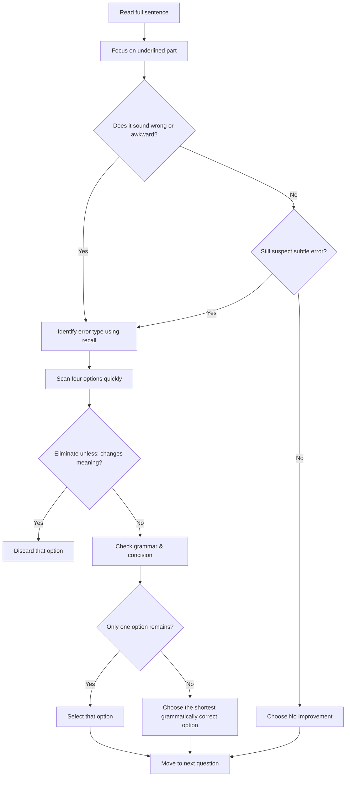

## Concept Ladder

### Corpus Pressure

The uploaded book-PYQ corpus marks `sentence-improvement` as a 200/200 dominant-repeat English topic with 590 promoted questions. The pressure is concentrated in three dense Pinnacle SSC English page clusters: 258 questions from `pinnacle-ssc-english-p0101-p0125`, 230 from `pinnacle-ssc-english-p0076-p0100`, and 97 from `pinnacle-ssc-english-p0051-p0075`, with five additional cross-page items. This is a major English accuracy area, not a minor grammar add-on.

| Corpus signal | What it demands | 15-minute English implication |
|---:|---|---|
| 590 promoted questions | Agreement, tense, preposition, pronoun, redundancy, parallelism, modifier, and no-improvement logic | Train a fixed decision sequence, not a gut-feel approach |
| Three dense grammar clusters | Repeated patterns with option variation | Each trap family needs quick recognition and repair |
| Frequent No Improvement options | Original sentence can be correct | Do not force a change without a visible error |
| Meaning-preservation traps | Some options are grammatical but alter meaning | Eliminate meaning-changing options before style choices |
| Speed pressure | English has 25 questions in 15 minutes | Sentence improvement should average 15-25 seconds |

### First 5-Second Classification

| Signal in underlined part | Bucket | First check |
|---|---|---|
| Verb after long subject | Subject-verb agreement | Find the real subject, ignore intervening phrase |
| Since, for, yesterday, already, before | Tense/sequence | Match time marker and event order |
| who, whom, I, me, its, it's | Pronoun | Check case and antecedent |
| in/on/at/to/with/about | Preposition/collocation | Recall fixed pair |
| extra repeated meaning | Redundancy | Prefer shorter exact phrase |
| not only, either, neither, as well as | Parallelism/conjunction | Match grammatical form |
| phrase at sentence start | Modifier | Ensure it modifies the nearest logical noun |
| sentence already clean | No Improvement | Choose it only after grammar, meaning, and concision checks |

**Rung 1: What is Sentence Improvement?**  
Sentence Improvement (SI) asks you to choose the best alternative for an underlined part of a sentence. The goal is to make the sentence grammatically correct, concise, and idiomatic while preserving its original meaning. Options often include "No improvement" (marked as N/I or similar).  

**Rung 2: Core Skills Required**  
- Grammar: tense, subject-verb agreement, pronoun case, articles, prepositions, conjunctions.  
- Usage: parallel structure, modifier placement, redundancy, word order.  
- Vocabulary: correct idiom, collocation, formal correctness (especially in SSC context).  
- Speed Reading: quickly identify the error or decide no change is needed.

**Rung 3: The SSC CGL Tier-I Context**  
English Comprehension is a 15-minute section with about 25 questions. Sentence Improvement appears typically 3-5 times per shift. High accuracy demands a systematic decision flow:  
1. Read the whole sentence.  
2. Focus on the underlined part. Does it sound wrong or awkward?  
3. Compare options quickly: eliminate wordy, grammatically wrong, or meaning-altering choices.  
4. Always consider "No improvement" - it is correct ~25-30% of the time.  
5. Pick the option that is most concise, grammatically correct, and retains meaning.

**Rung 4: Difficulty Progression**  
- Easy: obvious subject-verb agreement, single word replacement.  
- Medium: misplaced modifier, tense sequence error, redundant phrasing.  
- Hard: multiple errors in underlined part, ambiguous pronoun, or seemingly correct but non-standard construction.

**Rung 5: Integration for 200/200**  
To score 200/200, you must avoid both careless errors and overthinking. Learn the repeated patterns (e.g., 'being' is almost always wrong, 'have been' vs 'had been'). Use the Flowchart (see below) to decide in under 20 seconds per question. Master the Trap Table to avoid common pitfalls.

## Type System

| Type | Recognition Cue | Method | Speed Target | Trap |
|------|-----------------|--------|--------------|------|
| Subject-Verb Agreement | Underlined verb; look for singular/plural subject | Find subject; check number and person. Use verb elimination. | 15 sec | Distant subject, intervening phrases like "along with", "as well as" (not plural) |
| Tense & Sequence | Underlined verb alone or with time words (yesterday, since, already) | Determine time reference. Use past perfect for two past events, present perfect for unfinished. | 20 sec | "had + past" when simple past works; using past perfect without another past event |
| Pronoun Error | Underlined pronoun or possessive | Identify antecedent; check case (subject/object/possessive) and gender neutrality. | 15 sec | It's vs its; they vs them; ambiguous antecedent (e.g., "he" could refer to two males) |
| Preposition Idiom | Underlined preposition before a noun/gerund | Know common collocations (insist on, refrain from, prohibit from). | 12 sec | "accommodate with" should be "accommodate to"; "discuss about" is wrong (discuss + direct object) |
| Article Usage | Underlined a/an/the or no article | Check noun countability, first mention, definite reference. | 18 sec | "The" used with general plural; "a" before honest (an) because of sound |
| Redundancy / Wordiness | Underlined phrase longer than necessary | Cut unnecessary words: "return back" -> return; "combine together" -> combine | 10 sec | Thinking a longer phrase sounds more formal (e.g., "due to the fact that" vs "because") |
| Parallel Structure | Underlined part after "and", "or", "but" | Ensure same grammatical form (noun with noun, infinitive with infinitive, gerund with gerund). | 20 sec | Mixed forms like "to swim and running" |
| Modifier Placement | Underlined phrase that seems to modify wrong noun | Move modifier closest to word it modifies; avoid dangling participles. | 22 sec | "Walking down the street, the building loomed" (dangling) |
| No Improvement (N/I) | Sentence seems fine | Trust your ear after quick grammar check. If all options seem wrong, choose N/I. If two options are equally correct (rare), pick the shorter one. | 8 sec | Overthinking a correct sentence; "No improvement" is often correct when you hesitate |
| Idiom & Collocation | Underlined phrase with fixed expression | Know SSC-preferred idioms: "have a bearing on", "in accordance with", "at a loss". | 15 sec | Wrong preposition: "consist of" vs "consist from" |
| Conditional & Subjunctive | "If" clause with "was" vs "were" | Use "were" for unreal present/future; "if I were", not "if I was". | 12 sec | Using "would have" in the if-clause (should be "had" for past unreal) |
| Comparison | Underlined part with "than", "as", "like" | Ensure proper case after "than" (e.g., "she is taller than I" not "me"); avoid "as ... as" double mistakes. | 18 sec | Using objective case after "than" in formal English (though common in speech, SSC prefers nominative) |
| Conjunction Error | Underlined "and", "but", "or", "so" | Check logical relationship: "and" vs "but", "so" vs "for". | 12 sec | "Since" used for reason vs time; comma splice |
| Voice (Active/Passive) | Underlined verb with be + past participle | Active is preferred unless agent is unknown/unimportant. | 15 sec | Unnecessary passive that makes sentence wordy |

## Speed Methods

**Decision Rule 1: The 15-Second Line**  
- Read sentence (3 sec).  
- Focus on underlined part (2 sec).  
- Does it instantly sound wrong? If YES, scan options for correct fix (5 sec). If NO, check for subtle errors (5 sec).  
- If still unsure, read all options and pick the shortest grammatically correct one (5 sec).  
- If two options seem correct, "No improvement" often wins.

**Decision Rule 2: The "Being" Trap**  
If the underlined part contains "being" (e.g., "him being"), it is almost always wrong. use possessive + gerund ("his being") or restructure. Exception: passive continuous ("is being built").

**Decision Rule 3: The "No Improvement" Bias**  
- If the underlined part is a single word and it looks fine, choose N/I.  
- If the underlined part is a short phrase (2-3 words) and no option looks obviously better, trust the original.  
- If two options are grammatically correct, N/I remains strong unless original has a tangible error.

**Recall Table: Common Fixes**

| Original | Correct | Reason |
|----------|---------|--------|
| It is me. | It is I. | Subjective case after "to be" (formal) |
| Between you and I | Between you and me | Preposition takes objective case |
| The reason is because | The reason is that | Redundant; "reason...that" preferred |
| Equally as good | Equally good OR as good | "Equally as" redundant |
| Hardly...when | Hardly...than (inversion) | Correlative conjunction: "hardly...when" |

**Step-by-Step Algorithm**  
1. Mark the error type using the recognition cues from Type System.  
2. For answer: check each option systematically:  
   a. Does it change meaning? Eliminate.  
   b. Does it introduce a new error? Eliminate.  
   c. Is it more concise than the original while still correct? Prefer it if original was wordy.  
   d. If two options are equally correct, choose the one that sounds most natural in standard English.  
3. If no option clearly correct, pick "No improvement".

## Trap Table

| Trap | Trigger Wording | Wrong Move | Correct Move | Repair Drill |
|------|-----------------|------------|--------------|--------------|
| Subject-verb with "along with" | "The teacher along with the students ___ present." | Choose plural verb because students are plural. | Verb must agree with "teacher" (singular) - use singular. | Write 5 sentences with "along with", "together with", "as well as", and underline the correct verb. |
| Being as a gerund subject | "_____ always late, he was fired." Choose "Being" vs "He being" vs "Him being". | Choose "Him being" because "him" sounds natural. | Use "Being" as a gerund phrase (no subject pronoun) or "His being" for possessive. | Practice rewriting "___ being a student, he studied hard." (Answer: Being / His being) |
| Past perfect with single past action | "He had gone yesterday." | No improvement because past perfect is formal. | Use simple past "He went yesterday" unless another past action is implied. | Write 5 sentences with past perfect only when two past actions are ordered. |
| Preposition at end of relative clause | "This is the house where I lived in." | Change "where" to "which". | Remove extra preposition: "the house where I lived" OR "the house in which I lived". | Drill: rewrite 5 sentences ending with stranded preposition. |
| "Who" vs "Whom" | "Meet the manager ___ you will report to." | Choose "who" because it is subjective. | "Whom" is correct (object of preposition "to"). | Write 10 sentences: replace blank with who/whom. |
| Redundant phrase "return back" | "Please return back the book." | No improvement; sounds okay. | Change to "return the book". | List 10 common redundancies: advance forward, repeat again, etc. |
| "One of the" with plural noun + singular verb | "One of the boys are missing." | Keep "are" because "boys" is plural. | Subject is "One" (singular) - use "is". | Drill: Write "one of the + plural noun + singular verb" 10 times. |
| "Each of the" with singular verb | "Each of the students have a book." | No improvement because "students" is plural. | Change "have" to "has". | Underline verb in 5 "Each of the" sentences. |
| Misplaced modifier | "Covered in chocolate, the kids ate the donuts." | Keep as is; funny but fine. | Place modifier next to what it modifies: "The kids ate the donuts covered in chocolate." | Rearrange 5 dangling modifier sentences. |
| "If I was" vs "If I were" | "If I was rich, I would travel." | No improvement; "was" is common in speech. | Use "were" for unreal conditional. | Write 5 unreal if-sentences using "were". |
| "Not only...but also" parallelism | "He is not only smart but also a good athlete." | Keep as is. | Correct: "He is not only smart but also a good athlete" (but "smart" adjective, "good athlete" noun - not parallel). Better: "He is not only smart but also athletic." | Write 5 sentences with "not only...but also" using same grammatical form. |
| "Each" vs "Either/Neither" | "Either of the options are fine." | Keep "are". | Subject "Either" is singular - use "is". | Drill: Correct 5 sentences with either/neither + plural verb. |
| "Because" vs "Because of" | "He was late because the rain." | Keep "because" (common error). | Use "because of" before noun phrase. | Write 5 sentences using "because of" correctly. |
| "There is/are" with collective noun | "There is a group of students waiting." | Change to "There are" because students are many. | Keep "is" (group is singular). | Drill: 5 sentences with collective nouns and "there is/are". |
| "Since" for reason vs time | "Since he arrived, we left." Could mean because or from that time. | Keep ambiguous. | Rearrange to avoid ambiguity: "Because he arrived, we left" OR "After he arrived, we left." | Write 5 unambiguous sentences using "since". |

## Flowchart

## Solved Examples

**Example 1**  
The manager, along with his team members, (are / is) attending the conference.  
Options:  
a) are  
b) is  
c) were  
d) no improvement  

**Answer:** b) is  
**Explanation:** The subject is "manager" (singular). "Along with" does not make the subject plural. Use singular verb "is".

**Example 2**  
He promised to return back the money by Monday.  
Options:  
a) return back  
b) return  
c) give back  
d) no improvement  

**Answer:** b) return  
**Explanation:** "Return back" is redundant. "Return" alone means give back.

**Example 3**  
Either of the two dresses are suitable for the party.  
Options:  
a) are  
b) is  
c) was  
d) no improvement  

**Answer:** b) is  
**Explanation:** "Either" is singular, so the verb must be "is".

**Example 4**  
She is one of those teachers who (love / loves) their job.  
Options:  
a) love  
b) loves  
c) is loving  
d) no improvement  

**Answer:** a) love  
**Explanation:** The antecedent of "who" is "teachers" (plural), so the verb is "love".

**Example 5**  
If I was you, I would accept the offer.  
Options:  
a) was  
b) were  
c) am  
d) no improvement  

**Answer:** b) were  
**Explanation:** Unreal conditional requires "were" for all persons.

**Example 6**  
The reason he failed is because he did not study.  
Options:  
a) because  
b) that  
c) due to  
d) no improvement  

**Answer:** b) that  
**Explanation:** "The reason...is that" is correct; "because" is redundant.

**Example 7**  
The book, which I read it yesterday, was fascinating.  
Options:  
a) which I read it  
b) that I read it  
c) which I read  
d) no improvement  

**Answer:** c) which I read  
**Explanation:** The pronoun "it" is redundant after the relative pronoun "which".

**Example 8**  
He is better than me in mathematics.  
Options:  
a) better than me  
b) better than I  
c) more better than me  
d) no improvement  

**Answer:** b) better than I  
**Explanation:** After "than", use the subjective case in formal English (though "me" is common). "Better than I" is correct in SSC exams.

**Example 9**  
Not only he is intelligent but also hardworking.  
Options:  
a) Not only he is  
b) He is not only  
c) Not only is he  
d) no improvement  

**Answer:** c) Not only is he  
**Explanation:** With "not only" at the beginning, invert subject and verb: "Not only is he".

**Example 10**  
The committee have decided to postpone the meeting.  
Options:  
a) have decided  
b) has decided  
c) was decided  
d) no improvement  

**Answer:** b) has decided  
**Explanation:** "Committee" is a collective noun treated as singular in American English (SSC standard). Use "has".

**Example 11**  
He is enough old to join the army.  
Options:  
a) enough old  
b) old enough  
c) so old  
d) no improvement  

**Answer:** b) old enough  
**Explanation:** "Enough" comes after adjectives: "old enough".

**Example 12**  
She insisted on me to accompany her.  
Options:  
a) on me  
b) on my  
c) me to  
d) no improvement  

**Answer:** b) on my  
**Explanation:** "Insist on" takes a possessive gerund: "my accompanying".

**Example 13**  
He is senior than all the other officers in the department.  
Options:  
a) senior than  
b) senior to  
c) more senior than  
d) no improvement  

**Answer:** b) senior to  
**Explanation:** "Senior" takes "to", not "than", in standard SSC usage.

**Example 14**  
She has been working here since five years.  
Options:  
a) since five years  
b) for five years  
c) from five years  
d) no improvement  

**Answer:** b) for five years  
**Explanation:** Use "for" with duration and "since" with starting point.

**Example 15**  
No sooner did he arrive when the meeting began.  
Options:  
a) when  
b) than  
c) then  
d) no improvement  

**Answer:** b) than  
**Explanation:** The correct correlative is "No sooner...than".

**Example 16**  
Hardly had she reached the station than the train left.  
Options:  
a) than  
b) when  
c) then  
d) no improvement  

**Answer:** b) when  
**Explanation:** The correct pair is "Hardly/Scarcely...when".

**Example 17**  
He discussed about the problem with his teacher.  
Options:  
a) discussed about  
b) discussed  
c) discussed on  
d) no improvement  

**Answer:** b) discussed  
**Explanation:** "Discuss" takes a direct object; do not use "about" after it.

**Example 18**  
The news are shocking.  
Options:  
a) are  
b) is  
c) were  
d) no improvement  

**Answer:** b) is  
**Explanation:** "News" is singular in form and takes a singular verb.

**Example 19**  
The jury were unanimous in its decision.  
Options:  
a) were unanimous in its  
b) was unanimous in its  
c) were unanimous in their  
d) no improvement  

**Answer:** b) was unanimous in its  
**Explanation:** When a collective noun acts as one body, use singular verb and singular pronoun.

**Example 20**  
Neither of the answers are correct.  
Options:  
a) are  
b) is  
c) were  
d) no improvement  

**Answer:** b) is  
**Explanation:** "Neither of" is singular in this construction.

**Example 21**  
He is not only a good speaker but also writes well.  
Options:  
a) but also writes well  
b) but also a good writer  
c) and also writes well  
d) no improvement  

**Answer:** b) but also a good writer  
**Explanation:** "Not only" should balance parallel forms: a good speaker / a good writer.

**Example 22**  
Walking through the market, the flowers looked beautiful.  
Options:  
a) the flowers looked beautiful  
b) I found the flowers beautiful  
c) beautiful were the flowers  
d) no improvement  

**Answer:** b) I found the flowers beautiful  
**Explanation:** The opening modifier must describe the person walking, not the flowers.

**Example 23**  
This is the most unique painting in the gallery.  
Options:  
a) most unique  
b) very unique  
c) unique  
d) no improvement  

**Answer:** c) unique  
**Explanation:** "Unique" already means one of a kind; avoid degree words like most/very.

**Example 24**  
The child resembles to his father.  
Options:  
a) resembles to  
b) resembles  
c) is resembling to  
d) no improvement  

**Answer:** b) resembles  
**Explanation:** "Resemble" takes a direct object; do not use "to".

**Example 25**  
He did not know where did she live.  
Options:  
a) where did she live  
b) where she lived  
c) where does she live  
d) no improvement  

**Answer:** b) where she lived  
**Explanation:** In an indirect question, use statement word order: subject before verb.

## PYQ Mapping

The book-PYQ corpus contains 590 promoted sentence-improvement questions. The main source clusters are:

- **p0101-p0125 cluster (258 questions)**: high-density replacement decisions, agreement, tense, pronoun, preposition, and no-improvement traps.
- **p0076-p0100 cluster (230 questions)**: core grammar correction, redundancy, word order, and fixed usage.
- **p0051-p0075 cluster (97 questions)**: earlier grammar bank items that overlap with error spotting and sentence improvement.
- **Cross-page spillover (5 questions)**: items in p0401-p0425, p0226-p0250, p0276-p0300, and p0376-p0400 show that SI patterns also appear inside broader English drills.

To practice, use the following routes:  
- [Sentence Improvement topic practice](/exams/ssc-cgl/topics/sentence-improvement)  
- [Grammar Error Spotting topic](/exams/ssc-cgl/topics/grammar-error-spotting) - strengthens error detection.  
- [English Comprehension Speed Sprint](/exams/ssc-cgl/tests/ssc-cgl-english-comprehension-speed-sprint) - mixed questions under 15-minute timer.

Aim to solve 20-30 Sentence Improvement questions daily from previous year papers. Focus on "No improvement" decisions - they appear in 1 out of 4 questions.

## 200/200 Drill

**Timed Micro-Drill 1** (45 seconds - 3 questions)  
1. Each of the players (have / has) a new uniform.  
2. She is a woman whom I believe is honest. (whom/who)  
3. He hardly understands the problem, does he? (rewrite if needed)  

**Answers:** 1. has, 2. who (subject of "is"), 3. No improvement (hardly is negative, tag is positive).  

**Timed Micro-Drill 2** (60 seconds - 4 questions)  
1. The data (is / are) insufficient for the analysis.  
2. Would you mind (him / his) opening the window?  
3. This is the house that I lived in it. (correct)  
4. He is senior than me. (correct)  

**Answers:** 1. is (treating data as a singular mass noun in this sentence), 2. his, 3. "This is the house that I lived in.", 4. "senior to me" (senior takes "to", not "than").  

**Repair Rules**  
- Rule 1: If you catch a grammar error, fix it immediately.  
- Rule 2: If two options seem correct, pick the shorter one unless it changes meaning.  
- Rule 3: When in doubt, do not pick an option that adds words unnecessarily.  
- Rule 4: If the underlined part has "being", double-check - it is often incorrect.  
- Rule 5: "No improvement" is your friend. Use it when you cannot find a clear error.  

**Final Exam Strategy for Sentence Improvement (15-second/question)**  
- Seconds 1-5: Read.  
- Seconds 5-10: Decide error or no error.  
- Seconds 10-15: Pick answer, mark.  

Practice with a timer. Aim for 95% accuracy. Use the Flowchart and Trap Table as quick references. Review your mistakes by repair drills. With consistent effort, Sentence Improvement becomes your scoring zone.

Final standard: Sentence Improvement is a controlled decision task. A 200/200 attempt requires quick error classification, meaning preservation, and the discipline to select No Improvement when the original is already correct.
<!-- SSC-FINAL-PRACTICE-QUEUE:START -->
## Final Practice Queue

1. Start one-by-one practice: [Sentence Improvement practice](/exams/ssc-cgl/practice/sentence-improvement). Finish every question in this topic bank, not just the samples in the note.
2. Move to timed sets: [SSC CGL tests](/exams/ssc-cgl/tests?topic=sentence-improvement). Use topic drills first, then section mocks once accuracy is stable.
3. Repair every miss immediately: record the error label, redo 20 mixed questions from the same topic, then retest after 24 hours.
4. 200/200 rule: do not mark this topic exam-ready until correct answers come within 36 seconds and wrong answers are explained without looking at the solution.

<!-- SSC-FINAL-PRACTICE-QUEUE:END -->
