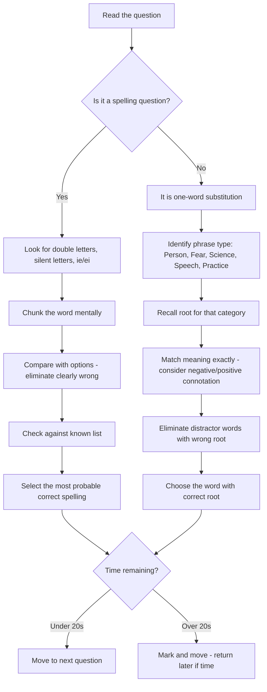

## Concept Ladder

### Corpus Pressure

The uploaded book-PYQ corpus marks `spelling-one-word` as a 200/200 dominant-repeat English topic with 594 promoted questions. The pressure is concentrated in two Pinnacle SSC English zones: 318 questions from `pinnacle-ssc-english-p0551-p0569` and 270 questions from `pinnacle-ssc-english-p0426-p0450`, with six additional cross-page items. This means spelling and one-word substitution are not side topics; they are fast-memory marks that should be banked before cloze and comprehension consume time.

| Corpus signal | What it demands | 15-minute English implication |
|---:|---|---|
| 594 promoted questions | Spelling, OWS, near-word pairs, suffix traps, roots | A dedicated recall bank is mandatory |
| 318 spelling-heavy rows | Double letters, silent letters, ie/ei, British spellings | Correct spelling should be selected in 10-20 seconds |
| 270 vocabulary/OWS rows | Person, fear, science, speech, practice categories | Root families must be automatic |
| Cross-page spillover | Spelling/OWS appears outside obvious chapters | Revise with vocabulary, idioms, and cloze |
| High option similarity | Four options often differ by one letter | Slow reading of every letter is safer than phonetic guessing |

### First 5-Second Classification

| What appears | Bucket | First action |
|---|---|---|
| Four similar spellings | Spelling | Scan double letters, silent letters, suffix, British form |
| "One who..." | Person OWS | Identify person root: phil, mis, gyn, anthro, biblio |
| "Fear of..." | Phobia OWS | Attach object root to phobia |
| "Study of..." | Science OWS | Attach subject root to -ology/-ics |
| "A speech/poem..." | Speech/literary OWS | Separate eulogy, elegy, epigram, epitaph |
| "System/practice of..." | Practice OWS | Check mono/poly/bi/archy/gamy roots |
| Meaning pair in a sentence | Near-word trap | Use meaning cue before spelling cue |
| British/American pair | Standard spelling | Prefer SSC/British form unless context says otherwise |

**First Principles:**
- Spelling is the correct arrangement of letters to form a word. English spelling is often non-phonetic due to historical borrowings and silent letters.
- One-word substitution (OWS) is the ability to replace a descriptive phrase with a single, precise word. This tests vocabulary compacity and root knowledge.

**Building Blocks:**
1. **Phonetic vs. Non-Phonetic Words:** Many words are spelled as they sound (e.g., "cat"), but traps come from silent letters (e.g., "doubt" has a silent 'b'), double consonants (e.g., "occurrence" has two 'c's and two 'r's), and vowel pairs (e.g., "chief" vs. "receive" - the "i before e except after c" rule with many exceptions).
2. **Suffix & Prefix Rules:** Adding suffixes can change spelling. For verbs ending in consonant + vowel + consonant, double the final consonant before adding -ed/-ing if the final syllable is stressed (e.g., "occur" -> "occurring") but usually do not double it if the stress is not final (e.g., "benefit" -> "benefited"). Prefixes usually preserve the base word: "mis" + "spell" = "misspell".
3. **Root-Based Memory Hooks:** One-word substitution often relies on Latin/Greek roots: e.g., "phil" = love (bibliophile = book lover), "phob" = fear (claustrophobia = fear of enclosed spaces), "cide" = killing (homicide = killing a person), "graph/graphy" = writing (calligraphy = beautiful writing). Learn 20 high-frequency roots.

**Exam-Level Integration:**
- SSC CGL Tier-I English section has 25 questions in 15 minutes. Spelling and OWS typically contribute 4-6 questions. You must answer each in under 20 seconds to leave time for reading comprehension.
- Spelling questions present four nearly identical spellings; one is correct. OWS gives a phrase; choose the one word that matches.
- High-count areas from the book-PYQ corpus: double-letter words (accommodate, committee, millennium), silent-letter words (receipt, write, honour), ie/ei traps (believe, perceive), and OWS categories: persons (misanthrope, altruist), fears (xenophobia, hydrophobia), professions (archaeologist, lexicographer), and sciences (philology, entomology).

**Memory Principles:**
- Chunking: break long words into syllables (e.g., "accommodation" = ac-com-mo-da-tion).
- Association: link tricky words with a mnemonic. For "necessary" (one 'c', two 's's): "A **necessary** shirt has **one** collar and **two** sleeves."
- Active recall: daily 5-minute drill with a list of 20 high-frequency error words.

## Type System

| Type | Recognition Cue | Method | Speed Target | Trap |
|------|----------------|--------|--------------|------|
| Spelling: Double Consonant | Word with multiple double letters (e.g., accommodation, committee) | Chunk the word; recall the pattern (e.g., "com-mit-tee" has double 'm', 't', 'e') | 15 sec | Missing one double (e.g., "acomodation" - wrong) |
| Spelling: Silent Letters | Words like debt, receipt, doubt, write | Memorise common silent consonants; use mnemonic (e.g., "debt" has a 'b' because it's like "debit") | 20 sec | Adding a sound (e.g., "debt" spelled "det") |
| Spelling: ie/ei | Words like receive, believe, ceiling | Apply "i before e except after c" and know exceptions (seize, weird) | 15 sec | Forgetting exceptions (e.g., "recieve" - wrong for "receive") |
| Spelling: Suffix -able/-ible | Words like acceptable, possible | Check if the base word is intact; -able if base word is complete (accept -> acceptable); -ible if not (permit -> permissible?) | 20 sec | Overgeneralising (e.g., "acceptible" - wrong) |
| Spelling: Prefix Traps | Words with mis-, dis-, un- (e.g., misspell, dissatisfied) | Prefixes usually do not change base spelling (mis + spell = misspell) | 15 sec | Dropping a letter (e.g., "mispell" - wrong) |
| OWS: Person | "one who..." e.g., one who hates mankind | Identify root (mis- = hate, anthro = human = misanthrope) | 10 sec | Confusing similar words (e.g., misanthrope vs. misogynist) |
| OWS: Fear | "fear of..." e.g., fear of water | Recall phobia roots (hydro = water = hydrophobia) | 10 sec | Wrong root (e.g., "aquaphobia" is also fear of water but less common; SSC uses hydrophobia) |
| OWS: Science | "study of..." e.g., study of fossils | Recall -ology roots (paleo = ancient, ology = study = paleontology) | 10 sec | Mixing subjects (e.g., archaeology vs. paleontology) |
| OWS: Speech Act | "a speech..." e.g., a speech praising someone | Recall specific terms (eulogy = praise; elegy = mourning) | 12 sec | Homophone trap (eulogy vs. elegy) |
| OWS: Practice/System | "system of marriage to one person" | Monogamy (mono = one, gamy = marriage) | 10 sec | Poly vs. mono confusion |
| Near-word confusion (spelling) | Options like "stationary" vs. "stationery" | Use meaning cue: stationAry = standing still (like 'a' for 'are'), stationEry = paper (like 'e' for envelope) | 20 sec | Ignoring meaning context |
| Silent 'h' in wh- words | Which, what, where, when | No method needed - but trap in "where" vs. "wear" (different meaning) | 15 sec | Homophone confusion |
| -sion vs. -tion | Words like suspicion, fiction | Usually -tion after consonants, -sion after 's' or 'ss' (mission, session). But exceptions (suspicion). | 20 sec | Using wrong suffix (e.g., "suspition" - wrong) |
| British vs. American | Colour/color, centre/center | SSC follows British English (e.g., colour, colour, centre) | 15 sec | Choosing American spelling |

## Speed Methods

**Recall Tables for Roots (Learn 5 per day):**

| Root | Meaning | Example |
|------|---------|---------|
| phil | love | philanthropist, bibliophile |
| phob | fear | acrophobia (heights), claustrophobia (enclosed) |
| cide | killing | homicide, suicide, pesticide |
| graph | writing | graphic, autobiography |
| biblio | book | bibliography, bibliophile |
| anthrop | human | misanthropist, anthropology |
| hydro | water | hydrophobia, hydrology |
| mono | one | monogamy, monotony |
| poly | many | polygamy, polysyllabic |
| neo | new | neologism, neophyte |
| pseudo | false | pseudonym, pseudoscience |
| ambi | both | ambidextrous, ambiguous |
| bene | good | benefactor, benevolent |
| mal | bad | malevolent, malpractice |
| pre | before | predict, premonition |

**Decision Rules for Spelling:**

1. **Double letter doubt?** Write the word in chunks. "Accommodation" = ac-com-mo-da-tion: double c and double m. "Occurrence" = oc-cur-rence: double c and double r. Train the high-frequency double-letter set until the pattern is visual, not phonetic.

2. **Silent letter rule:** If the word has a consonant cluster not pronounced, memorise with a mnemonic. For "debt", link the silent b to "debit". For "receipt", remember the receipt is a paper proof, so it carries a silent p.

3. **-ie- or -ei-?** Rule: "i before e except after c" and if the sound is 'ee'. Example: believe (i before e), receive (e after c). Exceptions: weird, seize, height, leisure - these must be memorised.

4. **-able or -ible?** Use the base word: if the base word is a complete English verb/adjective and keeps its form, usually -able (e.g., accept -> acceptable, adapt -> adaptable). If the -ible version is more common due to Latin origin, learn as a unit (e.g., possible, visible, audible).

**Step-by-Step OWS Algorithm:**

1. Read the phrase. Identify the core: person? fear? study? act?
2. Recall the relevant root. For "fear of foreigners" -> foreign = "xeno", fear = "phobia" -> xenophobia.
3. If no root known, eliminate options by part of speech (noun, adjective).
4. Match the meaning exactly: e.g., "one who loves books" = bibliophile (book lover), not bibliographer (someone who writes about books).
5. Use the options: often the correct word has a recognisable root while distractors have different roots.

**Speed Target in Exam:**
- Spelling: 15-20 seconds per question.
- OWS: 10-15 seconds per question.
- If stuck beyond 25 seconds, mark it and move. Return only if time permits. At the end, guess based on common patterns (double letters are often present in correct spelling; OWS options with "logy" often belong to sciences).

## Trap Table

| Trap | Trigger Wording | Wrong Move | Correct Move | Repair Drill |
|------|-----------------|------------|--------------|--------------|
| Missing double consonant | "accomodation" vs. "accommodation" | Choose the one with single consonant | Always use double m and double c | Write accommodation 10 times as "ac-commo-da-tion" |
| Silent 'b' in debt | "det" vs. "debt" | Pick "det" because it sounds right | Remember "debt" has b like "debit" | Mnemonic: debt keeps b for billing |
| ie/ei exception (weird) | "wierd" vs. "weird" | Use "i before e" rule and choose "wierd" | Memorise "weird" is an exception | List of exceptions: weird, seize, leisure, height, foreign |
| -ible vs -able (permissible) | "permittable" or "permissible"? | Assume -able is always safe | Learn "permissible" is from Latin "permittere" - use -ible | For verbs ending in -mit, use -ible: "permissible", "admissible", "compatible" (not from -mit but still -ible) |
| Prefix miss- vs dis- | "mispell" vs. "misspell" | Drop one 's' because "mis" + "spell" looks odd | Keep both 's's: mis + spell = misspell | Common pairs: misspelled, misspent, dissatisfied (dis + satisfied - still double 's') |
| Homophone stationary vs stationery | "The car was stationery." (meaning still) | Choose "stationery" regardless | Remember: stationAry = standing still (like 'a' for 'at rest'), stationEry = paper (like 'e' for envelope) | Use mnemonic: "The car is **A**t rest, so stationary with an A" |
| Fear of water (hydrophobia) vs aquaphobia | "fear of water" | Pick "aquaphobia" because it sounds more common | SSC normally uses "hydrophobia" - check options | Learn both but remember "hydro" is Greek for water; "aqua" is Latin - SSC often uses Greek roots |
| Misanthrope vs misogynist | "one who hates mankind" | Choose "misogynist" | "misogynist" = hates women; "misanthrope" = hates all humanity | Drill: mis-anthrope (anthro = mankind), miso-gynist (gyn = woman) |
| Eulogy vs. elegy | "a speech praising the dead" | Choose "elegy" | "elegy" is a poem of mourning; "eulogy" is a speech or writing praising | Mnemonic: Eulogy has 'eu' (good) and 'log' (speech); Elegy has 'e' (sad) and 'leg' (lament) |
| Study of insects (entomology) vs etymology | "study of insects" | Choose "etymology" (study of words) | "entomology" from Greek "entomon" (insect) | Use the N in eNtomology for Nature/insects |
| Suffix -ance vs -ence (important) | "importence" vs "importance" | Pick "importence" because it sounds like 'imporTance' | "importance" ends with -ance; "impotence" ends with -ence (different word) | Rule: -ance if base word has 'ant' (important -> importance); -ence if base has 'ent' (dependent -> dependence) |
| Silent 'h' in 'whether' vs 'weather' | "whether to go" | Spell "weather" (climate) | "whether" has 'h' for choice, "weather" has 'a' for atmosphere | Mnemonic: "We**h**ether - **h**ave a choice? **h**as an h" |
| -sion vs -tion after 's' | "suspision" vs "suspicion" | Use -sion because it follows 's'? | "suspicion" is an exception - it is -cion, not -sion | Memorise: suspicion, electrician, physician - all -cian not -sion |
| American vs British spelling | "center" vs "centre" | Choose American "center" | SSC follows British English: centre, colour, programme | Before exam, check which spelling appears in previous papers. If in doubt, British is safer |
| Confusing 'pre' and 'per' | "permanant" vs "permanent" | Write "permanant" because it sounds like 'ant' | Correct spelling is "permanent" (ends with -ent, not -ant) | Associate: permanent has 'man' in the middle - 'man' is permanent, not 'manant' |

## Flowchart

## Solved Examples

**Example 1 (Spelling - Double Letter)**
Which of the following is the correct spelling?
(a) accomodation
(b) accommodation
(c) acommodation
(d) accomodation

**Explanation:** The correct spelling is "accommodation" with double 'c' and double 'm'. Options (a), (c), (d) each miss one double. Therefore, (b) is correct.

**Answer: (b)**

**Example 2 (Spelling - Silent Letter)**
Which is correct?
(a) debt
(b) det
(c) debb
(d) dett

**Explanation:** "debt" has a silent 'b'. Option (a) is correct. Others are phonetic misrepresentations.

**Answer: (a)**

**Example 3 (Spelling - ie/ei)**
Choose the correct spelling:
(a) recieve
(b) receive
(c) receeve
(d) recieve

**Explanation:** "i before e except after c" - after 'c', it's 'ei' (receive). Option (b) is correct.

**Answer: (b)**

**Example 4 (Spelling - Suffix -ance)**
Which is correct?
(a) importance
(b) importence
(c) importants
(d) impotance

**Explanation:** The base word is "important" with an 'a', so the noun is "importance". Option (a) correct.

**Answer: (a)**

**Example 5 (OWS - Person)**
Select the one word for "one who hates women":
(a) misanthrope
(b) misogynist
(c) misogamist
(d) feminist

**Explanation:** "misogynist" (miso = hatred, gyn = woman). Misanthrope hates mankind; misogamist hates marriage; feminist supports women. So (b) is correct.

**Answer: (b)**

**Example 6 (OWS - Fear)**
"fear of heights" is called:
(a) claustrophobia
(b) agoraphobia
(c) acrophobia
(d) hydrophobia

**Explanation:** "acrophobia" (acro = height). Claustrophobia is fear of enclosed spaces; agoraphobia is fear of open spaces; hydrophobia is fear of water. Option (c) correct.

**Answer: (c)**

**Example 7 (OWS - Speech Act)**
"a speech praising someone" is:
(a) elegy
(b) eulogy
(c) panegyric
(d) both b and c

**Explanation:** "eulogy" and "panegyric" both mean a speech of praise. In SSC CGL, both may be offered, but "eulogy" is more common. Check options - if both present, choose the one that appears. Here (d) says both b and c - that is correct.

**Answer: (d)**

**Example 8 (OWS - Science)**
"study of coins and medals" is:
(a) numismatics
(b) philately
(c) archaeology
(d) epigraphy

**Explanation:** Numismatics is study of coins/medals. Philately is stamp collecting; archaeology is study of ancient history through artefacts; epigraphy is study of inscriptions. Option (a) correct.

**Answer: (a)**

**Example 9 (Spelling - British vs American)**
Choose the correct spelling for SSC CGL:
(a) center
(b) centre
(c) centere
(d) centr

**Explanation:** SSC follows British English, so "centre" is correct.

**Answer: (b)**

**Example 10 (OWS - Practice)**
"system of marriage to one spouse at a time" is:
(a) polygamy
(b) monogamy
(c) bigamy
(d) matriarchy

**Explanation:** Monogamy (mono = one, gamy = marriage). Polygamy is multiple spouses; bigamy is crime of two marriages; matriarchy is female-led system. Option (b) correct.

**Answer: (b)**

**Example 11 (Spelling - Necessary)**
Choose the correct spelling:
(a) neccessary
(b) necessary
(c) necessery
(d) necesary

**Explanation:** "Necessary" has one c and two s letters. Mnemonic: one collar and two sleeves.

**Answer: (b)**

**Example 12 (Spelling - Occurrence)**
Choose the correct spelling:
(a) occurence
(b) occurrence
(c) ocurence
(d) occurrance

**Explanation:** "Occurrence" has double c and double r: oc-cur-rence. The ending is -ence.

**Answer: (b)**

**Example 13 (Spelling - Separate)**
Choose the correct spelling:
(a) seperate
(b) separate
(c) seprate
(d) seperete

**Explanation:** "Separate" has "para" in the middle: sep-a-rate. The common wrong form is "seperate".

**Answer: (b)**

**Example 14 (Spelling - Stationary/Stationery)**
Fill the blank: The car remained ___ for two hours.
(a) stationery
(b) stationary
(c) stationory
(d) stationnary

**Explanation:** "Stationary" means standing still. "Stationery" means writing material.

**Answer: (b)**

**Example 15 (Spelling - British Standard)**
Choose the preferred SSC spelling:
(a) color
(b) colour
(c) colur
(d) coulor

**Explanation:** SSC generally follows British spelling. "Colour" is the standard form.

**Answer: (b)**

**Example 16 (OWS - Book Lover)**
One who loves books is called:
(a) bibliophile
(b) bibliographer
(c) philologist
(d) calligrapher

**Explanation:** Biblio = book, phil = love. A bibliophile loves books.

**Answer: (a)**

**Example 17 (OWS - One Who Hates Mankind)**
One who hates mankind is:
(a) misogynist
(b) misanthrope
(c) philanthropist
(d) pessimist

**Explanation:** Anthro = human/mankind. Misanthrope means one who hates mankind.

**Answer: (b)**

**Example 18 (OWS - Fear of Foreigners)**
Fear or hatred of foreigners is:
(a) xenophobia
(b) claustrophobia
(c) hydrophobia
(d) acrophobia

**Explanation:** Xeno = foreigner/stranger, phobia = fear.

**Answer: (a)**

**Example 19 (OWS - Study of Words)**
The study of the origin of words is:
(a) entomology
(b) etymology
(c) epigraphy
(d) philately

**Explanation:** Etymology studies word origins. Entomology studies insects.

**Answer: (b)**

**Example 20 (OWS - Study of Inscriptions)**
The study of inscriptions is:
(a) numismatics
(b) epigraphy
(c) archaeology
(d) cartography

**Explanation:** Epigraphy is the study of inscriptions.

**Answer: (b)**

**Example 21 (OWS - Government by the Rich)**
Government by the wealthy is:
(a) democracy
(b) plutocracy
(c) autocracy
(d) theocracy

**Explanation:** Pluto = wealth. Plutocracy means rule by the rich.

**Answer: (b)**

**Example 22 (OWS - One Who Walks in Sleep)**
One who walks in sleep is:
(a) somnambulist
(b) somniloquist
(c) insomniac
(d) noctambulist

**Explanation:** Somnambulist means a sleepwalker. Somniloquist means one who talks in sleep.

**Answer: (a)**

**Example 23 (OWS - One Who Talks in Sleep)**
One who talks in sleep is:
(a) somnambulist
(b) somniloquist
(c) insomniac
(d) ventriloquist

**Explanation:** Somniloquist means one who talks in sleep.

**Answer: (b)**

**Example 24 (Spelling - Receive)**
Choose the correct spelling:
(a) recieve
(b) receive
(c) receieve
(d) receve

**Explanation:** After c, use ei in "receive".

**Answer: (b)**

**Example 25 (Spelling - Millennium)**
Choose the correct spelling:
(a) milenium
(b) millenium
(c) millennium
(d) millenniem

**Explanation:** "Millennium" has double l and double n.

**Answer: (c)**

## PYQ Mapping

Use these practice routes to master each type:

- **Spelling-heavy cluster**: Focus on `pinnacle-ssc-english-p0551-p0569`, which contributes 318 promoted questions. Drill words like accommodation, committee, millennium, occurrence, parallel, necessary, separate, and receive.
- **OWS/vocabulary cluster**: Practice `pinnacle-ssc-english-p0426-p0450`, which contributes 270 promoted questions. Prioritise person, fear, science, speech, practice, and government/system categories.
- **Cross-page spillover**: Six additional items come from p0351-p0375, p0401-p0425, p0101-p0125, and p0526-p0550. Treat these as evidence that spelling and OWS can appear inside broader vocabulary sets.
- **One-word substitution - persons & professions**: Use the root tables above. Practice identifying roots rapidly.
- **One-word substitution - fears & sciences**: Associate phobia and ology lists. Use spaced repetition.
- **Near-word confusion (spelling)**: Practise pairs like stationAry/stationEry, affect/effect, principle/principal. See /exams/ssc-cgl/topics/spelling-one-word for more.
- **Suffix tricks**: Practice -able/-ible, -ance/-ence from the trap table. Create own drill list from synonyms-antonyms section at /exams/ssc-cgl/topics/synonyms-antonyms.
- **Full speed test**: Take SSC CGL English Comprehension Speed Sprint at /exams/ssc-cgl/tests/ssc-cgl-english-comprehension-speed-sprint.

## 200/200 Drill

**Timed Micro-Drills (5 minutes each):**

1. **Spelling Correct-Only Sprint** (1 min): Write down 10 commonly misspelled words from memory: accommodate, committee, millennium, occurrence, parallel, separate, necessary, receive, weird, debt. Check against answer key. Repeat until 10/10 correct.

2. **One-Word Substitution Categorisation** (1 min): Given 10 phrases, categorise as Person, Fear, Science, Speech Act, or Practice. Do not write the word - just the category. Build neural speed.

3. **Root Recall** (2 mins): Shuffle a list of 30 roots with meanings. For each, give the word (e.g., phil love -> philanthropist). Time yourself for all 30.

4. **Option Elimination** (30 secs per question): Solve 5 spelling questions with four options. Use the process: chunk -> check double letters -> silent letters -> suffix. Record your time.

**Repair Rules:**

- If you miss a double consonant: write the word in syllables 5 times.
- If you choose the wrong ie/ei word: write the exception list 3 times.
- If you confuse OWS categories: draw a root map for that category.
- If you run out of time in a drill: reduce target words; quality over quantity. However, aim to increase speed gradually.

**Final Speed Plan for English Section (15 mins for 25 questions):**

- Spelling & OWS (approx. 5 questions): 60-80 seconds total.
- Use the algorithm: for spelling, immediately chunk and check trap triggers. For OWS, categorise and recall root.
- Mark and guess only one question; do not spend more than 25 seconds per.
- Use the Trap Table as a quick reference before the exam.

**Daily Active Recall (before exam):** Spend 10 minutes reviewing the Speed Methods root table and the Trap Table. Do 10 random spelling questions and 10 OWS from the PYQ corpus.

Final standard: spelling and OWS should be fast-memory marks. Maintain a missed-word list, revise roots every third day, and keep the direct spelling/OWS questions under 20 seconds each.
<!-- SSC-FINAL-PRACTICE-QUEUE:START -->
## Final Practice Queue

1. Start one-by-one practice: [Spelling and One-Word Substitution practice](/exams/ssc-cgl/practice/spelling-one-word). Finish every question in this topic bank, not just the samples in the note.
2. Move to timed sets: [SSC CGL tests](/exams/ssc-cgl/tests?topic=spelling-one-word). Use topic drills first, then section mocks once accuracy is stable.
3. Repair every miss immediately: record the error label, redo 20 mixed questions from the same topic, then retest after 24 hours.
4. 200/200 rule: do not mark this topic exam-ready until correct answers come within 36 seconds and wrong answers are explained without looking at the solution.

<!-- SSC-FINAL-PRACTICE-QUEUE:END -->
