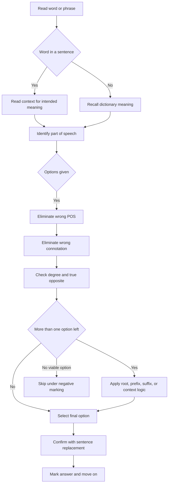

## Corpus Pressure

This note is built around the promoted SSC CGL book-PYQ slice for `synonyms-antonyms`: **427 promoted questions**. The pressure is concentrated in two vocabulary clusters: `pinnacle-ssc-english-p0526-p0550`, which contributes **245 promoted questions**, and `pinnacle-ssc-english-p0501-p0525`, which contributes **180 promoted questions**. The tiny support spillover from `p0401-p0425` and `p0476-p0500` confirms that this is not a random vocabulary topic; it is a dense word-meaning bank from the English book-PYQ core.

For 200/200, treat this topic as controlled elimination under negative marking:

| First Clue | Filter | What to Reject |
|---|---|---|
| Word form: `-ly`, `-tion`, `-ous`, `-ive`, `-ate` | Part of speech | noun/adverb/verb mismatch |
| Positive or negative emotional colour | Connotation | same dictionary field but wrong tone |
| Extreme vs mild meaning | Degree | weak synonym for strong word, weak opposite for strong antonym |
| Prefix/root visible | Root decode | false prefix traps like invaluable, inflammable, nonplussed |
| Word appears in sentence | Context replacement | dictionary meaning that fails the sentence |

### First 5-Second Classification

1. Decide whether the question asks **nearest meaning** or **opposite meaning**.
2. Identify the part of speech before reading options deeply.
3. Mark the word's tone: positive, negative, neutral, formal, or harsh.
4. Use root/prefix only after POS and tone filters.
5. Attempt only if two options can be eliminated; otherwise skip and protect marks.

## Concept Ladder

### Rung 1: Word Meaning - The Foundation
A synonym is a word having the same or nearly the same meaning as another word (e.g., *happy* / *joyful*). An antonym expresses the opposite meaning (e.g., *hot* / *cold*). Mastery begins with accurate dictionary meaning recall, not approximate guesswork.

### Rung 2: Part of Speech Control
The correct synonym/antonym must match the given word's part of speech (noun, verb, adjective, adverb). A noun synonym for *courage* is *bravery*; *bravely* (adverb) is wrong. SSC often gives words with multiple POS - you must identify the intended POS from the question format (e.g., *light* as noun vs adjective changes synonym).

### Rung 3: Connotation - Positive, Neutral, Negative
Words carry emotional colour. *Thrifty* (positive) vs *stingy* (negative) are not synonyms despite similar dictionary meaning. SSC uses connotation to create traps: *confident* (positive) vs *arrogant* (negative) are antonyms in tone even if both relate to self-assurance.

### Rung 4: Register - Formal, Informal, Technical
Register refers to context (formal vs colloquial). *Children* (neutral) vs *offspring* (formal) vs *kids* (informal). SSC Tier-I rarely tests extreme register mismatch directly but uses it in elimination: if four options are literary and one is slang, slang is likely wrong.

### Rung 5: Polarity and Degree for Antonyms
Antonyms can be strict binary (*alive* / *dead*) or gradable (*hot* / *warm* / *cold*). SSC often tests gradable antonyms with degree traps: *huge* synonym may be *enormous*, not *large* (degree mismatch). For antonyms, choose the strongest opposite among options, not a mere difference.

### Rung 6: Word Families - Roots, Prefixes, Suffixes
Knowing roots (*bene* = good: benevolence, beneficial) and prefixes (*un-*, *in-*, *dis-* for negation) allows you to deduce meanings of unfamiliar words and predict antonyms. *Amorphous* = without form (a=without, morph=form). Antonym would be *shaped* or *structured*.

### Rung 7: Contextual vs Dictionary Meaning
A word's meaning in a sentence may differ from its isolated meaning. SSC sometimes provides the word in a phrase or sentence. Always default to the given context if a sentence is provided; ignore dictionary primary meaning if context shifts. Example: *run* in "run a company" -> synonym is *manage*, not *sprint*.

### Rung 8: Confusable Near-Synonyms and False Antonyms
*Historic* vs *historical*, *continuous* vs *continual*. SSC exploits pairs that appear similar but have distinct meanings. False antonyms: *flammable* and *inflammable* mean same (both easily set on fire). Antonym of *flammable* is *non-flammable*.

### Rung 9: Elimination Strategy - Process of Elimination under 36 seconds
For synonym/antonym questions, you read the word, identify POS, quickly recall known meaning, then eliminate three options that are clearly wrong (wrong POS, wrong connotation, degree mismatch). With even 50% familiarity, elimination yields correct answer.

### Rung 10: Integration - 200/200 Mindset
Every synonym/antonym question is an opportunity to secure marks only when elimination is disciplined. SSC has negative marking, so blind guessing is not a strategy. Use elimination until one option remains, or until two options remain with a clear root, connotation, or context clue. Maintain 36-second pacing and spend extra time only on high-confidence tricky pairs.

## Type System

| Type | Recognition Cue | Method | Speed Target | Trap |
|------|-----------------|--------|--------------|------|
| Direct Synonym (dictionary match) | Word is common; options have familiar words | Quick recall; if meaning is exact, select; else eliminate POS/register mismatches | 20 sec | Near-synonym with different connotation |
| Synonym in Context | Word appears in a sentence (or phrase given) | Read context to infer intended meaning; ignore common meanings not fitting context | 35 sec | Using dictionary meaning instead of contextual |
| Antonym - Polarity Based | Word has clear opposite (tall/short) | Find direct opposite; if gradable, choose the strongest opposite among options | 20 sec | Antonym vs non-antonym (e.g., sad/not sad is not antonym) |
| Antonym - Prefix Based | Word has negating prefix (un-, in-, dis-, non-) | Antonym is root word without prefix, or a different word. But beware of false friends: *inflammable* has no antonym prefix | 30 sec | Assuming prefix-in = not -> antonym is root; but *invaluable* means very valuable, not valueless |
| Connotation Shift | Options include positive/neutral/negative words | Sort options by connotation; pick matching tone if given word is clearly positive or negative | 25 sec | Ignoring connotation and picking neutral option |
| Part-of-Speech Mismatch | Options are different parts of speech | Identify POS of given word; eliminate options of different POS | 10 sec | Verb synonym for noun given word |
| Degree Mismatch (Sy/An) | Word with extreme meaning vs moderate options | For synonym, choose closest in intensity; for antonym, choose strongest opposite | 30 sec | Picking a weak synonym because it matches vaguely |
| False Antonym | Two words look like antonyms but are not | Memorise common false pairs (like *ravel/unravel*) | 40 sec | Assuming every "un-" word is antonym of root |
| Confusable Pair | Words like *affect/effect*, *persecute/prosecute* | Rely on specific meaning difference; often tested as synonym of one word with distractor of the other | 35 sec | Mixing up the pair |
| Negative Prefix with Changed Meaning | *nonplussed* meaning confused, not calm | Learn the small set of such words; use context if given | 45 sec | Applying standard prefix rule |

## Speed Methods

### Method 1: POS Filter (5 seconds)
1. Check given word's POS (often obvious from form: -ly = adverb, -tion = noun, -ous = adjective).
2. Scan options; eliminate any that are different POS.
3. Example: Given word *decisive* (adjective). Options: *decision* (noun) - wrong; *decidedly* (adverb) - wrong; *conclusive* (adj) - correct.

### Method 2: Connotation Flash (10 seconds)
1. Decide if given word is Positive, Neutral, or Negative (e.g., *frugal* positive, *stingy* negative).
2. Eliminate options with opposite connotation.
3. Example: Synonym for *stubborn* (negative). Options: *persistent* (positive) - eliminate; *obstinate* (negative) - correct.

### Method 3: Root/Prefix/Suffix Decode (15 seconds)
1. For unknown words, break into known parts.
2. *Benevolent* = bene (good) + volent (wishing) -> meaning generous. Synonym: *charitable*.
3. *Ameliorate* = a (toward) + melior (better) -> improve. Antonym: *worsen*.

### Method 4: Context Injection (10 seconds)
1. If sentence given, replace word with each option; see which makes sense in that exact context.
2. *He was a very ______ person, always giving to charity.* Options: *stingy* (wrong), *benevolent* (correct).

### Method 5: Two-Step Elimination (15 seconds)
1. Step 1: Eliminate options that are obviously wrong (wrong POS, opposite connotation).
2. Step 2: Among remaining, pick the one with closest meaning (for synonym) or strongest opposite (for antonym).
3. If still unsure, mark the most familiar word that did not get eliminated.

### Recall Tables for High-Frequency Roots

| Root | Meaning | Examples | Synonyms for derivatives | Antonyms |
|------|---------|----------|-------------------------|----------|
| bene | good | benefit, benevolent, benign | favourable, kindly, harmless | harsh, malignant |
| mal | bad | malevolent, malicious, malady | evil, spiteful, disease | good, kind, healthy |
| equi | equal | equidistant, equivalent, equitable | same, fair, balanced | unequal, biased |
| omni | all | omnipotent, omniscient, omnipresent | all-powerful, all-knowing, everywhere | limited, ignorant, absent |
| ante/pre | before | antecedent, predict, preliminary | prior, forecast, initial | subsequent, follow-up, final |
| post | after | postpone, posterior, postmortem | delay, later, after-death | advance, prior, pre-autopsy |
| anti/contra | against | antipathy, contradict, contrary | hostility, oppose, opposite | sympathy, agree, compatible |
| pro | for, forward | promote, proactive, prolific | advance, forward-looking, productive | demote, reactive, inefficient |
| sub | under | subordinate, substandard, subdue | inferior, below, suppress | superior, above, liberate |
| super/supra | above | superior, supernatural, supranational | higher, extraordinary, beyond-global | inferior, natural, national |

### Decision Rules for Unknown Words
- If you don't know the word at all: use prefix decoding (50% accuracy) > connotation from sound (>25% accuracy) > random guess for unknown word (25% in 4 options). But never guess if negative marking applies; skip if you have no clue after 20 seconds.
- *Rule:* If you can eliminate 2 options, guess among remaining 2 (50% chance). If you eliminate 0 or 1, skip the question rather than risk negative marking.

## Trap Table

| Trap | Trigger Wording | Wrong Move | Correct Move | Repair Drill |
|------|-----------------|------------|--------------|--------------|
| Connotation flip | Positive word; negative option present | Choosing negative option because it seems like a synonym | Check connotation: positive word needs positive synonym | List 10 positive words and their negative near-synonyms (e.g., confident vs arrogant) |
| Degree mismatch | Word of extreme degree (e.g., huge); options like big, large, enormous | Choosing big or large because they are synonyms of huge | Pick the word with matching intensity (enormous) | Rank synonyms by intensity: small, tiny, minuscule, microscopic |
| Part of speech trap | Word ends in -ly (adverb); options include adjective and adverb | Choosing adjective because meaning matches | Identify POS - only adverbial synonym is correct | Convert given word to different POS and practice identifying |
| False antonym with prefix | Word with un-, in-, dis-; options include root word | Thinking root word is antonym | Check if prefix negates meaning; if word meaning is not simply opposite of root, root may be synonym, not antonym | Drill: list words where un- means not (unhappy) vs where un- means reversal (unravel) vs un- changes meaning (unctuous) |
| Context dependence | Word given with sentence; student ignores sentence | Using primary dictionary meaning | Read sentence; extrapolate meaning from context | Practice 20 words with two different context sentences; find correct synonym each time |
| Confusable pair | Words like historic/historical; economic/economical | Substituting one for the other | Learn precise definitions of confusable pairs | Make flashcards for 30 confusable pairs |
| Negative prefix misinterpretation | Invaluable, inflammable, nonplussed | Assuming invaluable = not valuable | Memorise these exceptions: invaluable = very valuable; inflammable = flammable; nonplussed = confused | Write sentences for each exception; practice synonym/antonym |
| Synonym from same root but different meaning | Word is affect (verb); option effect (noun) | Choosing effect because similar root and common confusion | Know affect=influence (verb), effect=result (noun) | Write 5 sentences using affect and effect correctly |
| Antonym not opposite but just different | Word has specific meaning; option is unrelated word | Choosing option that is different but not opposite | Antonym must be opposite; if no clear opposite among options, eliminate all and pick nearest opposite or skip | Practice identifying true binary opposites vs mere differences |
| Idiomatic usage | Word used in idiomatic phrase (e.g., *run* the show) | Choosing synonym of *run* as in jog | Understand idiom meaning; choose synonymous phrase if possible | Study 30 common idioms with verb synonyms |
| Homophone interference | Word *stationary* vs *stationery* | Choosing homophone instead of correct synonym | Check spelling; in synonym question, homophone has different meaning | List 20 homophone pairs with meanings |
| Overthinking | Simple word; student expects trick and picks obscure option | Choosing a rare word that may not be correct synonym | Trust simple synonym if it matches exactly | Quick 10-question drill with common words; trust first instinct |
| Guessing incomplete elimination | 2 options remain; student guesses without further analysis | Random guess with 50% chance | Apply remaining clue: degree, connotation, POS (already done), root similarity | Practice elimination until 2 options; then use contextual sentence test (if applicable) |
| Skimming options too fast | Options contain word that looks like given word (false friend) | Picking the option that looks similar but has different meaning | Read meaning not spelling | Find 10 false cognates within English (e.g., sensible vs sensitive) |

## Flowchart

## Solved Examples

**Example 1**
Select the synonym of the given word: **PRUDENT**
A) Careless
B) Wise
C) Rash
D) Foolish
**Explanation:** Prudent means showing care and good judgment; synonym is wise. Careless, rash, foolish are all negative antonyms. **Answer: B**

**Example 2**
Select the antonym of the given word: **BENEVOLENT**
A) Kind
B) Charitable
C) Generous
D) Malevolent
**Explanation:** Benevolent means kindly; antonym is malevolent (wishing evil). Others are synonyms. **Answer: D**

**Example 3**
Select the synonym of the given word in the sentence: "The judge was known for his **equitable** decisions."
A) Partial
B) Fair
C) Harsh
D) Lenient
**Explanation:** Equitable in context of decisions means fair and impartial. Partial is opposite; harsh/lenient not meanings. **Answer: B**

**Example 4**
Select the antonym of: **OMNIPOTENT**
A) All-powerful
B) Almighty
C) Weak
D) Supreme
**Explanation:** Omnipotent means all-powerful; antonym is weak. Others are synonyms. **Answer: C**

**Example 5**
Select the synonym of: **MALEVOLENT**
A) Kind
B) Friendly
C) Spiteful
D) Benevolent
**Explanation:** Malevolent means having a wish to do evil; synonym is spiteful. Others are antonyms. **Answer: C**

**Example 6**
Select the antonym of: **AMELIORATE**
A) Improve
B) Enhance
C) Worsen
D) Upgrade
**Explanation:** Ameliorate means to make better; antonym is worsen. Others are synonyms. **Answer: C**

**Example 7**
Select the synonym of: **NONPLUSSED**
A) Unfazed
B) Confused
C) Calm
D) Indifferent
**Explanation:** Nonplussed means surprised and confused; synonym is confused. Others are often wrongly thought as meanings. **Answer: B**

**Example 8**
Select the antonym of: **FRUGAL**
A) Thrifty
B) Economical
C) Spendthrift
D) Frugal (itself)
**Explanation:** Frugal means sparing with money; antonym is spendthrift (one who spends freely). Thrifty/economical are synonyms. **Answer: C**

**Example 9**
Select the synonym of: **PERSEVERE**
A) Quit
B) Continue
C) Persist
D) Both B and C
**Explanation:** Persevere means to continue in a course of action despite difficulty; synonyms: continue, persist. Quit is antonym. Both B and C are correct. **Answer: D**

**Example 10**
Select the antonym of: **SUBTERRANEAN**
A) Underground
B) Aboveground
C) Underworld
D) Subterranean (itself)
**Explanation:** Subterranean means under the earth; antonym is aboveground. Others are synonyms or not relevant. **Answer: B**

**Example 11 (Mixed)**
Select the word which is nearest in meaning to: **CONCISE**
A) Verbose
B) Brief
C) Lengthy
D) Detailed
**Explanation:** Concise means giving a lot of information in few words; synonym is brief. Verbose/lengthy/detailed are opposite. **Answer: B**

**Example 12**
Select the word which is farthest in meaning to: **HARBINGER**
A) Forerunner
B) Messenger
C) Follower
D) Herald
**Explanation:** Harbinger means one that announces or foreshadows; synonyms: forerunner, messenger, herald. antonym is follower. **Answer: C**

**Example 13**
Select the synonym of: **EXACERBATE**
A) Relieve
B) Worsen
C) Reduce
D) Calm
**Explanation:** Exacerbate means to make a problem worse. Relieve, reduce, and calm move in the opposite direction. **Answer: B**

**Example 14**
Select the antonym of: **EPHEMERAL**
A) Temporary
B) Short-lived
C) Permanent
D) Fleeting
**Explanation:** Ephemeral means lasting for a very short time. Permanent is the true opposite. **Answer: C**

**Example 15**
Select the synonym of: **OBSTINATE**
A) Flexible
B) Yielding
C) Stubborn
D) Gentle
**Explanation:** Obstinate means stubbornly refusing to change. Flexible and yielding are antonyms. **Answer: C**

**Example 16**
Select the antonym of: **LUCID**
A) Clear
B) Coherent
C) Confusing
D) Plain
**Explanation:** Lucid means clear and easy to understand. Confusing is the opposite. **Answer: C**

**Example 17**
Select the synonym of: **METICULOUS**
A) Careless
B) Careful
C) Negligent
D) Hasty
**Explanation:** Meticulous means extremely careful and detail-oriented. **Answer: B**

**Example 18**
Select the antonym of: **AFFLUENT**
A) Wealthy
B) Prosperous
C) Poor
D) Rich
**Explanation:** Affluent means wealthy or prosperous. Poor is the opposite. **Answer: C**

**Example 19**
Select the synonym of: **CANDID**
A) Frank
B) Secretive
C) Deceptive
D) Reserved
**Explanation:** Candid means frank, honest, and open in expression. **Answer: A**

**Example 20**
Select the antonym of: **ANCIENT**
A) Old
B) Modern
C) Archaic
D) Primitive
**Explanation:** Ancient means very old; modern is the nearest opposite. **Answer: B**

**Example 21**
Select the synonym of: **ELOQUENT**
A) Articulate
B) Silent
C) Incoherent
D) Harsh
**Explanation:** Eloquent means fluent and persuasive in speech. Articulate is the nearest synonym. **Answer: A**

**Example 22**
Select the antonym of: **TIMID**
A) Shy
B) Fearful
C) Bold
D) Hesitant
**Explanation:** Timid means shy or lacking courage. Bold is the strongest opposite. **Answer: C**

**Example 23**
Select the synonym of: **ALLEVIATE**
A) Intensify
B) Ease
C) Aggravate
D) Exacerbate
**Explanation:** Alleviate means to make pain or difficulty less severe. Ease is the synonym; exacerbate is the opposite. **Answer: B**

**Example 24**
Select the antonym of: **TRANSPARENT**
A) Clear
B) Obvious
C) Opaque
D) Visible
**Explanation:** Transparent means allowing light through or easy to see through. Opaque is the opposite. **Answer: C**

**Example 25**
Select the synonym of: **HOSTILE**
A) Friendly
B) Antagonistic
C) Helpful
D) Cordial
**Explanation:** Hostile means unfriendly or antagonistic. Friendly, helpful, and cordial are antonyms or positive-tone distractors. **Answer: B**

## High-Frequency Vocabulary Bank

### Meaning and Opposite Pairs

| Word | Meaning | Synonym | Antonym |
|---|---|---|---|
| benevolent | kind, charitable | generous | malevolent |
| malevolent | wishing harm | spiteful | benevolent |
| ameliorate | improve | enhance | worsen |
| exacerbate | worsen | aggravate | alleviate |
| ephemeral | short-lived | temporary | permanent |
| concise | brief | terse | verbose |
| lucid | clear | coherent | confusing |
| obstinate | stubborn | adamant | flexible |
| frugal | economical | thrifty | spendthrift |
| affluent | wealthy | prosperous | poor |
| candid | frank | honest | deceptive |
| meticulous | careful | precise | careless |
| hostile | unfriendly | antagonistic | cordial |
| timid | shy | fearful | bold |
| opaque | not transparent | cloudy | transparent |

### Prefix and Root Watchlist

| Element | Meaning / Caution | Exam Use |
|---|---|---|
| bene | good | benevolent, benign, beneficial |
| mal | bad | malevolent, malicious, malady |
| ameli | better | ameliorate = improve |
| ex / extra | out, beyond, intensify in some words | exacerbate is not "remove"; it means worsen |
| anti / contra | against | antipathy, contrary, contradict |
| sub | under | subordinate, substandard, subterranean |
| super / supra | above | superior, supernatural |
| in- | may mean not, but not always | invaluable means very valuable; inflammable means flammable |
| non- | may not be simple negation in learned words | nonplussed means confused |
| un- | not or reverse action | unhappy = not happy; unravel = undo/tangle depending usage |

### Connotation Ladder

| Neutral / Positive | Negative Near-Word | Why It Matters |
|---|---|---|
| confident | arrogant | both relate to self-belief; tone differs |
| frugal | stingy | both saving money; one positive, one negative |
| persistent | obstinate | both continuing; obstinate is stubbornly negative |
| careful | timid | both cautious; timid implies fear |
| direct | blunt | both plain-spoken; blunt can be rude |
| curious | nosy | both interested; nosy is intrusive |
| slim | skinny | both thin; skinny can be negative |
| economical | miserly | both sparing; miserly is strongly negative |

## PYQ Mapping

| Corpus Cluster / Type | Promoted Question Pressure | What to Practice | Route |
|---|---:|---|---|
| `pinnacle-ssc-english-p0526-p0550` | 245 questions | Dense synonym/antonym vocabulary, roots, connotation, degree traps | /exams/ssc-cgl/topics/synonyms-antonyms |
| `pinnacle-ssc-english-p0501-p0525` | 180 questions | Core word meaning, opposite pairs, context-light SSC vocabulary | /exams/ssc-cgl/topics/synonyms-antonyms |
| `pinnacle-ssc-english-p0401-p0425` and `p0476-p0500` | 2 questions | Vocabulary spillover from RC/cloze pages | /exams/ssc-cgl/topics/vocabulary-cloze |
| Root-based questions | High frequency | bene, mal, equi, omni, sub, super, anti/contra | /exams/ssc-cgl/topics/synonyms-antonyms |
| Connotation traps | Medium frequency | positive vs negative near-synonyms | /exams/ssc-cgl/topics/vocabulary-cloze |
| Prefix and exception traps | Medium frequency | inflammable, invaluable, nonplussed, unravel | /exams/ssc-cgl/topics/synonyms-antonyms |
| Contextual synonyms | Lower frequency but high-trap | sentence replacement and word-in-context | /exams/ssc-cgl/tests/ssc-cgl-english-comprehension-speed-sprint |

## 200/200 Drill

**Timed Micro-Drills (45 seconds each)**

1. **Drill A - Speed POS Filter** (5 words)
   - *Decisive (adj)*; options: decided, decision, decisively, inconclusive  
   - *Bravery (noun)*; options: brave, bravely, courage, bravado  
   - *Quickly (adv)*; options: fast, quick, speed, accelerate  
   - *Beautiful (adj)*; options: beauty, beautifully, pretty, beautify  
   - *Negotiate (verb)*; options: negotiation, negotiator, bargain, negotiable  
   *Answer key: inconclusive, courage, fast, pretty, bargain*

2. **Drill B - Connotation Sort** (5 words, assign P/N/N)
   - *Frugal* (P)
   - *Stingy* (N)
   - *Confident* (P)
   - *Arrogant* (N)
   - *Persistent* (P)
   - *Obstinate* (N)
   *Then choose correct synonym for each from mixed options.*

3. **Drill C - Prefix Antonyms** (8 words)
   - Write antonym of:
     - *amoral* (moral)
     - *inflammable* (non-flammable / fire-resistant)
     - *unravel* (tangle)
     - *nonplussed* (unfazed)
     - *invaluable* (worthless)
     - *disheveled* (tidy)
     - *unprecedented* (common)
     - *preposterous* (sensible)
   *Note: Many prefixes do not simply reverse; confirm meaning.*

4. **Drill D - Contextual Synonyms** (4 sentences)
   - "The **ameliorate** effects of the medicine were immediate." Synonym: *improving*
   - "She tried to **persevere** despite the setbacks." Synonym: *continue*
   - "He gave a **concise** summary." Synonym: *brief*
   - "The **malevolent** glare made everyone uncomfortable." Synonym: *spiteful*

5. **Drill E - Speed Elimination (60 seconds for 5 questions)**
   - Q1: Synonym of *celestial* (options: heavenly, earthly, aerial, marine) -> Eliminate earthly (opposite). Answer: heavenly.
   - Q2: Antonym of *exacerbate* (options: worsen, relieve, aggravate, intensify) -> Eliminate worsen/aggravate/intensify (all synonyms). Answer: relieve.
   - Q3: Synonym of *ephemeral* (options: lasting, temporary, eternal, permanent) -> Eliminate lasting/eternal/permanent. Answer: temporary.
   - Q4: Antonym of *benevolent* (options: kind, generous, malevolent, charitable) -> Eliminate kind/generous/charitable. Answer: malevolent.
   - Q5: Synonym of *amnesty* (options: punishment, pardon, penalty, conviction) -> Eliminate punishment/penalty/conviction. Answer: pardon.

**Repair Rules (for missed questions)**
- If you missed a question due to unknown word: add that word to your vocabulary notebook with root, prefix, connotation.
- If missed due to degree mismatch: practice ranking synonyms by intensity (use a thesaurus and group words).
- If missed due to connotation error: write the word and label its connotation; practice with 3 similar words.
- If missed due to false antonym: learn the specific exception; create a mnemonic.

**Weekly Maintenance**
- Every Saturday: revise 30 words from the PYQ-mapped pages (0501-0550) with a timed elimination test.
- Score target: 8/10 in 90 seconds. If below, redo the day's drills.

**Final Tip for 200/200**: In the exam, treat each synonym/antonym as a logical puzzle, not a recall test. Use elimination relentlessly. Even if you don't know the word, you can often reduce to 2 options. Never guess randomly; skip if you cannot eliminate at least 2. With practice, you'll reach 95%+ accuracy within the 36-second per question pacing for the 4-5 vocab questions in Tier-I English.
<!-- SSC-FINAL-PRACTICE-QUEUE:START -->
## Final Practice Queue

1. Start one-by-one practice: [Synonyms and Antonyms practice](/exams/ssc-cgl/practice/synonyms-antonyms). Finish every question in this topic bank, not just the samples in the note.
2. Move to timed sets: [SSC CGL tests](/exams/ssc-cgl/tests?topic=synonyms-antonyms). Use topic drills first, then section mocks once accuracy is stable.
3. Repair every miss immediately: record the error label, redo 20 mixed questions from the same topic, then retest after 24 hours.
4. 200/200 rule: do not mark this topic exam-ready until correct answers come within 36 seconds and wrong answers are explained without looking at the solution.

<!-- SSC-FINAL-PRACTICE-QUEUE:END -->
