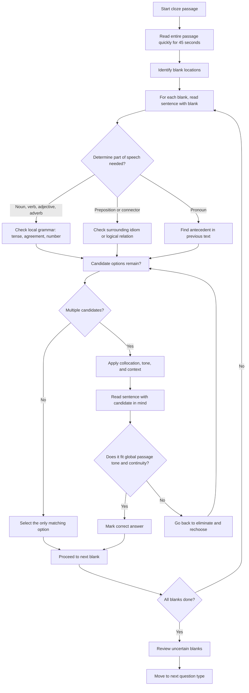

## Concept Ladder

**First Principles - Single Word Meaning**  
Every word has a dictionary meaning (denotation) and a feel (connotation). At the start, you must know at least 2000-3000 commonly tested words (see PYQ vocabulary lists). A word's part of speech (noun, verb, adjective, adverb, preposition, conjunction) determines its grammatical job.

### Corpus Pressure

The uploaded book-PYQ corpus marks `vocabulary-cloze` as a 200/200 dominant-repeat English topic with 893 promoted questions. The top subtopic chunks are concentrated in the English book pages `p0276-p0350`, so this is a focused English scoring zone rather than a scattered miscellaneous bucket.

For a 200/200 attempt, this topic has two jobs:

| Corpus signal | What it demands | Section implication |
|---:|---|---|
| 893 promoted questions | Repeated vocabulary, cloze, collocation, tone, and context patterns | This cannot be left to "English sense" alone |
| Concentrated English pages | Same traps recur across options | Maintain a repair notebook of wrong words and collocations |
| Cloze speed pressure | 5 blanks can consume too much section time | Predict before options and average 25-30 seconds per blank |
| Vocab uncertainty | Unknown words still appear | Use roots, prefixes, suffixes, tone, and elimination |
| Negative marking | A near-synonym trap can cost 2.5 marks | Every option must be rejected for a reason |

The heaviest book-PYQ blocks for this topic are:

| Book-PYQ block | Promoted question pressure | How to use it |
|---|---:|---|
| `pinnacle-ssc-english-p0326-p0350` | **365 promoted questions** | High-volume cloze and vocabulary repetitions; mine this first for daily timed sets |
| `pinnacle-ssc-english-p0301-p0325` | **333 promoted questions** | Second-pass pressure block; use it for collocation, connector, and tone retesting |
| `pinnacle-ssc-english-p0276-p0300` | **195 promoted questions** | Foundation block; use it to build the word, idiom, and preposition repair deck |

The permanent standard is: read the passage once, predict the blank type, eliminate by grammar first, then meaning/collocation/tone, then global passage flow. Do not pick the word that merely sounds impressive.

**Context - The Sentence Neighbourhood**  
Words do not live alone. In a cloze test, the surrounding words before and after the blank decide the correct choice. Examples:  
- The blank verb must agree in number and tense with its subject.  
- The blank adjective must collocate with the noun it modifies (e.g., "heavy rain" not "strong rain").  
- Connectors (however, therefore, moreover) show logical relationships between clauses.

**Collocation - Fixed Word Partnerships**  
Certain words naturally pair together in English. SSC CGL tests these heavily. Examples:  
- Perform + task (not "make a task")  
- Make a decision / take a decision both occur in Indian exam English, but options usually make one collocation clearly more natural in context.  
- Strong + argument (not "powerful argument" in many contexts)  
- Catch + sight (not "take sight").

**Tone and Register - Formal vs Informal**  
The passage's tone (scientific, journalistic, narrative, explanatory) dictates appropriate vocabulary. Formal passages avoid contractions, phrasal verbs, and casual idioms. A blank in a government report will not accept "get" but will accept "obtain".

**Global Passage Flow - Beyond One Blank**  
A cloze test is a unified whole. The correct word must not only fit the local sentence but also maintain the overall argument, sequence of events, and author's attitude. Pronouns refer back to earlier nouns; verb tenses set a timeline. First read the entire passage (45 seconds) before attempting any blank.

### The Blank Prediction Rule

Before looking at options, write a mental prediction:

| Blank environment | Prediction question | Example |
|---|---|---|
| Article before blank | Is a noun needed? | "a _____ policy" -> adjective+noun or noun |
| Modal before blank | Is base verb needed? | "will _____" -> base verb |
| Preposition before blank | Is noun/gerund needed? | "interested in _____" -> noun/gerund |
| Two clauses | Is connector logic needed? | contrast, result, addition, concession |
| Pronoun slot | What is the antecedent? | singular/plural, person, distance |
| Adjective slot | What noun is being described? | collocation and tone |
| Near-synonym options | What exact nuance does the sentence demand? | intensity, formality, domain |

Options are confirmation tools, not starting points. If you start with options, every familiar word looks tempting.

**Exam-Level Integration - 15-Minute English Section**  
English section has about 25 questions (Vocabulary/Cloze 5-8 Q, Reading Comprehension 10-12 Q, Fillers/Sentence Improvement 5-8 Q). You have 15 minutes total. For cloze: spend 2 minutes reading the passage once, then 2-3 minutes answering 5 blanks. Total per cloze = ~1 minute per blank. Speed comes from anticipating the word before looking at options.

## Type System

| Type | Recognition Cue | Method | Speed Target | Trap |
|------|-----------------|--------|--------------|------|
| Grammar Fit Blank | Blank preceded by a subject, verb, or preposition; often tests subject-verb agreement, tense, determiner, pronoun case | 1. Identify the subject and its number/person. 2. Check tense of surrounding verbs. 3. Eliminate options that break grammar rules. | 15 sec per blank | Ignoring that the noun is uncountable (e.g., "information" takes singular verb). |
| Collocation Blank | Common verb-noun or adjective-noun pair; phrase sounds natural to native ear | 1. Read the blank with the surrounding 2-3 words. 2. Choose the option that naturally pairs (e.g., "draw a conclusion"). Use known collocation lists. | 20 sec per blank | Selecting a synonym that changes the idiom (e.g., "make a mistake" vs "do a mistake"). |
| Connector Blank | Blank between two clauses; options are transition words (however, therefore, moreover, nevertheless) | 1. Determine the logical relationship: contrast, cause-effect, addition, sequence. 2. Pick the matching connector. Watch punctuation (comma vs semicolon). | 15 sec per blank | Choosing "however" when the clause is a result, not a contrast. |
| Pronoun Reference Blank | Blank after a noun phrase; options include it, they, its, their, this, that | 1. Locate the antecedent in the previous sentence or clause. 2. Match in number (singular/plural) and gender. 3. Consider distance: "this/that" for nearby vs distant referent. | 10 sec per blank | Using "they" when antecedent is singular (e.g., "the committee" - could be singular or plural depending on context; in SSC, usually singular). |
| Tone/Vocabulary Blank | Blank requires a word with specific intensity or formality; options are near-synonyms | 1. Assess passage tone (formal, neutral, emotional). 2. Pick the word with appropriate register and precise meaning. 3. Eliminate emotional words if passage is factual. | 25 sec per blank | Choosing an overly strong word (e.g., "disaster" vs "problem") because it sounds impressive but misreads tone. |
| Preposition Blank | Blank before a noun or gerund; options are in, on, at, for, with, by, about | 1. Check the verb or adjective before the blank. 2. Recall fixed preposition patterns (e.g., "interested in", "depend on", "prohibit from"). 3. Use elimination: if no idiom, choose the most natural. | 10 sec per blank | Using "on" with "Monday morning" (correct is "on Monday morning") but with "morning" alone we say "in the morning". Context matters. |
| Parallel Structure Blank | Blank in a list of items; options are different parts of speech | 1. See if blank is part of a series: verb, verb, _____. 2. Match the grammatical form (gerund, infinitive, base verb). 3. Look for "and" or "or" as cue. | 20 sec per blank | Breaking parallelism, e.g. "to swim, to run, and cycling" should be "to swim, to run, and to cycle". |
| Meaning from Context Blank | Unknown word in a sentence with clues (definition, example, contrast, cause-effect) | 1. Ignore the word; read the whole sentence for clues. 2. Look for "that is", "i.e.", "such as", "but", "because". 3. Infer the meaning and match to option. | 30 sec per blank | Choosing a word that fits the general idea but not the specific nuance from context. |

### First 5-Second Classification

Before you spend time on vocabulary meaning, classify the blank. This prevents the common SSC mistake of liking a word before checking whether the sentence can legally accept it.

| First cue in 5 seconds | Blank class | Immediate action | Time ceiling |
|---|---|---|---:|
| Article or determiner before the blank: a, an, the, this, many, much | Noun or adjective-noun slot | Decide countable/uncountable, singular/plural, then check whether the option can sit before the noun | 15 sec |
| Modal or helping verb before the blank: will, can, should, has, had, is | Verb form slot | Lock tense and verb form before checking meaning | 15 sec |
| A preposition or verb-preposition pair surrounds the blank | Collocation or preposition slot | Recall the fixed pair: depend on, interested in, prevent from, comply with | 20 sec |
| Two clauses meet around the blank | Connector logic slot | Mark relation as contrast, result, addition, concession, example, or sequence | 15 sec |
| Options are pronouns or determiners | Reference slot | Find the antecedent and match number, person, and distance | 10 sec |
| Options are close synonyms | Tone/register/degree slot | Compare intensity, formality, and domain; reject the word that is too strong or too casual | 25 sec |
| Unknown word appears in options | Root, prefix, suffix slot | Reduce the word to polarity and part of speech, then use context to eliminate | 25 sec |
| Full cloze passage is given | Cloze Passage Scan | Spend 45 seconds on topic, tense, pronoun chain, and positive/negative flow before blank solving | 45 sec |
| Two options survive local grammar | Global-flow slot | Choose the option that keeps the passage's argument and tone consistent | 20 sec |
| No class is visible quickly | Mark-and-return slot | Skip after one elimination pass and return after nearby blanks clarify the passage | 5 sec |

### Full Type Tree for 200/200

| Cluster | Subtype | Recognition cue | Fast action | Trap |
|---|---|---|---|---|
| Cloze grammar | Subject-verb agreement | Verb options differ by number/person | Find head subject, ignore prepositional phrase | Nearest noun controls verb |
| Cloze grammar | Tense sequence | Past/present/future options | Match surrounding timeline | One sentence in different tense misleads |
| Cloze grammar | Article/determiner | a, an, the, some, many | Countable/uncountable and specificity | "Information" treated as countable |
| Cloze grammar | Pronoun | it, they, this, those, its, their | Locate antecedent | Collective noun confusion |
| Cloze grammar | Parallelism | and/or list | Match form exactly | Gerund/infinitive mismatch |
| Cloze logic | Contrast connector | but, however, although, yet | Check opposite meaning | Choosing therefore |
| Cloze logic | Result connector | therefore, thus, hence, consequently | Check cause -> effect | Choosing moreover |
| Cloze logic | Addition connector | moreover, furthermore, also | Check same-direction idea | Choosing nevertheless |
| Cloze logic | Example connector | for example, such as, namely | Check illustration | Choosing conclusion connector |
| Cloze meaning | Positive/negative polarity | praised, failed, danger, benefit | Mark + or - tone before options | Opposite-polarity synonym |
| Cloze meaning | Intensity | slight, severe, grave, enormous | Match degree | Overdramatic word |
| Cloze meaning | Domain word | science, economy, law, environment | Use domain-specific term | Generic synonym |
| Cloze collocation | Verb+noun | make/take/give/draw/pay/cast | Use natural pair | Direct synonym not collocational |
| Cloze collocation | Adjective+noun | heavy rain, strong evidence | Test phrase as unit | Word meaning correct but pair unnatural |
| Cloze collocation | Preposition | interested in, depend on | Recall fixed pattern | Literal preposition |
| Vocabulary | Synonym | closest meaning | Match part of speech and intensity | Near synonym with different register |
| Vocabulary | Antonym | opposite meaning | Check prefix and context | Selecting unrelated negative word |
| Vocabulary | One-word substitution | "one who..." | Identify person/place/action/object | Similar profession |
| Vocabulary | Idiom/phrase | phrase in sentence | Meaning of whole phrase | Literal meaning |
| Vocabulary | Spelling/confusables | affect/effect, eminent/imminent | Define both before choosing | Sound-based choice |
| Unknown word | Prefix/suffix clue | un-, in-, mis-, re-, -able, -tion | Reduce to root and polarity | False friend |
| Passage flow | First blank | Sets topic/tone | Solve after full passage scan | Overfocus on first sentence |
| Passage flow | Last blank | Summarizes or concludes | Check whole passage direction | Local grammar only |

### Elimination Order

Use this order for every blank:

1. **Part of speech**: noun, verb, adjective, adverb, preposition, connector, pronoun.
2. **Grammar**: subject-verb, tense, article, number, parallelism.
3. **Local meaning**: immediate sentence meaning and polarity.
4. **Collocation**: natural word partnership.
5. **Connector logic**: contrast, result, addition, example, concession.
6. **Tone/register**: formal, informal, neutral, technical, emotional.
7. **Global passage flow**: topic, timeline, pronoun chain, author's attitude.

If an option survives all seven filters, it is usually correct. If two survive, choose the one that fits the passage's global purpose, not the stronger-looking word.

## Speed Methods

**15-Minute English Section Speed Plan**  
- Divide 15 min into segments:  
  - 2 min: Fast English scan and easy direct vocabulary/filler questions.  
  - 3 min: One cloze passage with 5 blanks.  
  - 6 min: Reading comprehension or para-based questions.  
  - 3 min: Sentence improvement, error spotting, active-passive/direct-indirect.  
  - 1 min: Review marked English questions only.  
- For cloze: 40-45 sec first read, 2 min 15 sec for 5 blanks, and final 10-15 sec review. Use anticipation before options.

### Cloze Time Budget

| Stage | Time | Work |
|---|---:|---|
| Passage scan | 40-45 sec | Topic, tone, tense, pronoun chain, positive/negative flow |
| Blank 1-5 first pass | 90 sec | Solve grammar/collocation/direct meaning blanks |
| Hard blanks | 35-40 sec | Use one sentence before and after |
| Review | 10-15 sec | Check connectors and pronouns across the passage |

Never spend 60 seconds on one blank during the first pass. Mark it, solve the easier blanks, then return with more context from the completed passage.

**Recall Table - Common Collocations Tested in SSC CGL**  
| Verb + Noun | Adjective + Noun | Preposition + Phrase |
|-------------|------------------|----------------------|
| draw a conclusion | heavy rain | in accordance with |
| make an effort | strong evidence | on behalf of |
| take a stand | tough decision | by means of |
| pay attention | high probability | in addition to |
| give a speech | grave concern | with respect to |
| set a goal | sheer luck | due to |
| bring about change | deep-seated issue | except for |
| cast doubt | pivotal role | prior to |

**Step-by-Step Algorithm for Cloze Blank**  
1. Read the sentence containing the blank completely.  
2. Identify the required part of speech. (If blank is after article "a/an/the" -> noun; after "will" -> base verb; etc.)  
3. Check local clues: subject-verb agreement, tense, number, preposition.  
4. If multiple options remain, read 1-2 sentences before and after for context.  
5. Eliminate options that break collocation or tone.  
6. If stuck, plug each option into the blank and read the sentence aloud in your mind. The one that sounds most natural and logical is likely correct.  
7. Never leave a blank. Educated guess: remove the most unlikely option, then guess.

**Decision Rules for Vocabulary Blanks**  
- If options are all synonyms, check register and intensity.  
- If options are all one word but different parts of speech, eliminate based on grammar immediately.  
- If options include a word you don't know, use word root, prefix, suffix to guess meaning. Common prefixes: un- (not), in- (not), re- (again), pre- (before), mis- (wrong).  
- When two options seem equally plausible, pick the one that matches the passage's main idea more exactly.

### Word-Root and Confusable Bank

| Pattern | Meaning/use | Examples | Trap |
|---|---|---|---|
| un-, in-, im-, ir-, il- | not/opposite | unfair, inaccurate, impossible, irregular, illegal | Some words are not simple negatives |
| re- | again/back | rebuild, return, reconsider | Not every re-word means repeat in context |
| mis- | wrong/badly | mislead, misplace, misjudge | Confused with missing |
| pre- | before | preview, prelude, precondition | Not always time; can mean prior condition |
| -tion/-sion | noun form | decision, action, expansion | Verb form may be needed instead |
| -ive/-ous/-al | adjective form | active, dangerous, logical | Noun option may sound similar |
| affect/effect | verb/noun mostly | affect change, effect as result | "Effect change" is a separate formal verb phrase |
| imminent/eminent | soon/famous | imminent danger, eminent scholar | Sound trap |
| imply/infer | speaker suggests/listener concludes | statement implies, reader infers | Direction trap |
| compliment/complement | praise/complete | compliment a person, complement a design | Spelling trap |
| adapt/adopt/adept | adjust/take up/skilled | adapt to climate, adopt policy, adept at math | One-letter trap |

## Trap Table

| Trap | Trigger Wording | Wrong Move | Correct Move | Repair Drill |
|------|-----------------|------------|--------------|--------------|
| Near-synonym overgeneralization | "The scientist presented a novel _____." Options: idea, theory, hypothesis | Choose "idea" because it is common. | "Hypothesis" is more scientific and sets the precise tone. | Drill: For each blank, ask "What is the domain of the passage?". Science -> specific terms. |
| Collocation breach | "The committee _____ a decision yesterday." Options: took, made, did, gave | Pick "took" (in Indian English sometimes used). | "Made a decision" is the correct collocation. | Practice 50 common verb-noun pairs from SSC list. |
| Distractor pronoun | "The board announced _____ new policy." Options: its, their, his | Choose "their" because board has many members. | "Board" is a collective noun; in SSC, it's usually singular -> "its". | Note: collective nouns take singular unless individuals are emphasized. |
| Tone mismatch | "The report _____ a minor error in calculation." Options: highlighted, screamed, whispered, pointed out | Choose "screamed" for dramatic effect. | "Pointed out" or "highlighted" fits formal report tone. | Classify options as formal/informal. Eliminate extremes. |
| Connector reversal | "It was raining; _____, we cancelled the picnic." Options: however, therefore, moreover | Pick "however" (common but wrong). | "Therefore" shows cause-effect. | Map connectors to relationships: contrast, cause, addition, sequence. |
| Idiom violation | "He tried to _____ the issue." Options: evade, avoid, dodge, escape | Choose "escape" (sounds similar). | "Evade" collocates with "issue" (evade a question/issue). "Escape" is for physical danger. | Create a personal notebook of 100 idioms with examples. |
| Preposition following verb | "She insisted _____ going alone." Options: to, on, at, for | Choose "to" because "insist to" seems logical. | "Insisted on" is the correct phrasal verb. | Memorize 30 common verb+preposition pairs. |
| Parallel structure break | "He likes swimming, jogging, and _____." Options: to cycle, cycling | Pick "to cycle" because it's an infinitive. | Blank must be parallel: "cycling" (gerund). | Identify the pattern of the series. |
| Number agreement hidden | "The group of students _____ waiting." Options: was, were | Choose "were" because students are plural. | Subject is "group" (singular) -> "was". | Find the head noun, ignore prepositional phrases. |
| Word root confusion | "His _____ for music was evident." Options: passion, passive, prison | Pick "passive" (sounds like passion but means not active). | "Passion" is correct via root "pati-" (suffer, feel). | Study common roots: pass- (suffer), sci- (know), dict- (say). |
| Unfamiliar word in options | All four options are unknown. | Skip the question entirely. | Use elimination: check prefixes/suffixes, try to plug each into sentence, guess the most plausible. | Build vocabulary from the 893-question vocabulary-cloze corpus plus linked English routes. |
| Pronoun without clear antecedent | "The manager praised the team. _____ had performed excellently." Options: It, They | Choose "It" (team is singular). | "They" works because team refers to individuals. | When antecedent is collective, look at subsequent pronouns in passage for clue. |
| Omission of logical connector | "He studied hard. _____, he passed the exam." Options: Therefore, However, Moreover | Choose "Moreover" (addition) but it's cause-effect. | "Therefore" indicates result. | Always identify logical relationship before filling connector. |
| Overconfidence in common word | "The government will _____ a new policy." Options: implement, compliment, complement | Choose "complement" because it sounds similar. | "Implement" means to put into effect. | Never assume a word based on sound; check meaning. |

## Flowchart

## Solved Examples

**Example 1**  
Passage: The new regulation aims to _____ environmental pollution by imposing stricter fines on industries. Options: (a) mitigate (b) agitate (c) imitate (d) cultivate  
Explanation: The context is reducing pollution. "Mitigate" means to make less severe. Others do not fit.  
Answer: (a) mitigate

**Example 2**  
Passage: The company's _____ growth over the past year has attracted many investors. Options: (a) meteoric (b) meteorological (c) methodical (d) metaphorical  
Explanation: "Meteoric" means very rapid (like a meteor). "Meteorological" is weather. Others irrelevant.  
Answer: (a) meteoric

**Example 3**  
Passage: She was _____ of the crime because the evidence was insufficient. Options: (a) convicted (b) acquitted (c) accused (d) arrested  
Explanation: Insufficient evidence leads to acquittal. "Acquitted" means freed from charge.  
Answer: (b) acquitted

**Example 4**  
Passage: The manager asked the employees to _____ their reports by Friday. Options: (a) submit (b) omit (c) commit (d) permit  
Explanation: Submit reports is the collocation. Others: omit (leave out), commit (do wrong), permit (allow).  
Answer: (a) submit

**Example 5**  
Passage: The project was a _____ due to lack of funds and poor planning. Options: (a) debacle (b) delight (c) benefit (d) success  
Explanation: Negative context clues "lack of funds" and "poor planning" lead to failure. "Debacle" means a sudden failure.  
Answer: (a) debacle

**Example 6**  
Passage: The professor's lecture was so _____ that most students fell asleep. Options: (a) fascinating (b) monotonous (c) engaging (d) inspiring  
Explanation: "Fell asleep" indicates boring. "Monotonous" means dull and tedious.  
Answer: (b) monotonous

**Example 7**  
Passage: The two countries signed a treaty to _____ trade barriers. Options: (a) erect (b) dismantle (c) construct (d) fortify  
Explanation: Trade barriers are usually reduced, not built. "Dismantle" means to take down.  
Answer: (b) dismantle

**Example 8**  
Passage: He is a very _____ person, always ready to help others. Options: (a) selfish (b) generous (c) miserly (d) cruel  
Explanation: "Always ready to help" indicates generosity. "Generous" means willing to give.  
Answer: (b) generous

**Example 9**  
Passage: The _____ of the river at this point is very strong; it's dangerous to swim. Options: (a) current (b) currency (c) currant (d) curse  
Explanation: River flow is "current". "Currency" is money, "currant" is fruit, "curse" is evil wish.  
Answer: (a) current

**Example 10**  
Passage: The artist used vibrant colors to _____ the beauty of the sunset. Options: (a) depict (b) deprecate (c) deport (d) deprive  
Explanation: "Depict" means to show or represent. Others have negative meanings.  
Answer: (a) depict

**Example 11**  
Passage: She could not _____ the pain and eventually called the doctor. Options: (a) tolerate (b) travel (c) tender (d) transfer  
Explanation: "Tolerate" means to endure. Others don't fit semantically.  
Answer: (a) tolerate

**Example 12**  
Passage: The research findings are _____ with earlier studies. Options: (a) consistent (b) constant (c) conscious (d) content  
Explanation: "Consistent with" means in agreement.  
Answer: (a) consistent

**Example 13**  
Passage: The city received heavy rain; _____, several low-lying areas were flooded. Options: (a) however (b) therefore (c) moreover (d) nevertheless  
Explanation: The second clause is the result of the first. "Therefore" shows cause-effect.  
Answer: (b) therefore

**Example 14**  
Passage: The policy was ambitious; _____, its implementation remained weak. Options: (a) however (b) hence (c) consequently (d) similarly  
Explanation: Ambitious policy and weak implementation are in contrast. "However" fits.  
Answer: (a) however

**Example 15**  
Passage: The committee submitted _____ report after three months of study. Options: (a) its (b) their (c) his (d) them  
Explanation: "Committee" is treated as singular in this formal sentence, so the possessive pronoun is "its".  
Answer: (a) its

**Example 16**  
Passage: The students were asked to read the passage, identify the tone, and _____ the correct option. Options: (a) selecting (b) selected (c) select (d) to selecting  
Explanation: The list follows "to read, identify, and select". Parallel base verb form is needed.  
Answer: (c) select

**Example 17**  
Passage: The scientist's claim was not accepted because it lacked _____ evidence. Options: (a) substantial (b) imaginary (c) casual (d) decorative  
Explanation: Evidence can be "substantial". The context demands enough/strong evidence, not decorative or casual.  
Answer: (a) substantial

**Example 18**  
Passage: The officer acted _____ the rules laid down by the department. Options: (a) in accordance with (b) in spite of (c) in case of (d) in front of  
Explanation: "In accordance with" means according to. It is the correct formal phrase for rules.  
Answer: (a) in accordance with

**Example 19**  
Passage: The minister _____ the allegations and demanded an inquiry. Options: (a) refuted (b) reputed (c) repeated (d) repaired  
Explanation: "Refuted" means denied or proved wrong. "Reputed" means having a reputation.  
Answer: (a) refuted

**Example 20**  
Passage: The medicine was found to be _____ against the infection in most patients. Options: (a) effective (b) affective (c) effectualness (d) affected  
Explanation: The adjective needed is "effective", meaning producing the desired result.  
Answer: (a) effective

**Example 21**  
Passage: The company had to _____ its strategy after the market changed. Options: (a) adapt (b) adopt (c) adept (d) except  
Explanation: "Adapt" means adjust. "Adopt" means take up; "adept" means skilled.  
Answer: (a) adapt

**Example 22**  
Passage: The judge asked the witness to give a _____ account of the incident. Options: (a) concise (b) conclude (c) conclusively (d) concision  
Explanation: An adjective is needed before "account". "Concise" means brief and clear.  
Answer: (a) concise

**Example 23**  
Passage: The discovery was hailed as a _____ achievement in medical science. Options: (a) landmark (b) landmine (c) landscape (d) landlord  
Explanation: "Landmark achievement" is a fixed collocation meaning an important milestone.  
Answer: (a) landmark

**Example 24**  
Passage: Though the task appeared simple, it required _____ attention to detail. Options: (a) meticulous (b) careless (c) random (d) negligent  
Explanation: Attention to detail requires "meticulous", meaning very careful and precise.  
Answer: (a) meticulous

**Example 25**  
Passage: The author criticizes the plan not because it is expensive, but because it is _____. Options: (a) impractical (b) useful (c) affordable (d) beneficial  
Explanation: The structure "not because X, but because Y" expects another negative reason. "Impractical" fits the criticism.  
Answer: (a) impractical

## PYQ Mapping

This topic (Vocabulary and Cloze) is part of English Comprehension in SSC CGL Tier-I. Based on the current uploaded book-PYQ corpus blueprint, `vocabulary-cloze` contains 893 promoted questions concentrated in the English pages `p0276-p0350`. Practice routes:

- **Core Vocabulary Drills**: /exams/ssc-cgl/topics/vocabulary-cloze (covers word meaning, synonyms, antonyms, one-word substitution)
- **Collocation and Phrasal Verbs**: /exams/ssc-cgl/topics/fill-in-the-blanks (includes preposition blanks and idioms)
- **Speed Cloze Practice**: /exams/ssc-cgl/tests/ssc-cgl-english-comprehension-speed-sprint (timed cloze tests with 5 questions each)

For 200/200, follow this plan:  
1. Complete all vocabulary PYQs from the corpus (sorted by subtopic: Grammar, Collocation, Connector, Tone, Preposition, Unknown Word).  
2. For each incorrect answer, write the correct collocation/phrase in your repair notebook.  
3. Practice speed: attempt a cloze passage in 3 minutes (read + 5 blanks). Gradually reduce to 2.5 minutes.  
4. Use elimination drills: for each blank, list why wrong options are wrong (grammar, tone, collocation, meaning).

### Corpus-Backed Practice Blocks

| Block | Daily target | What to record |
|---|---:|---|
| Direct vocabulary meaning | 30 questions | Unknown word, root, synonym, antonym |
| Cloze grammar | 20 blanks | POS, tense, agreement, pronoun |
| Cloze logic/connectors | 15 blanks | Relationship: contrast, result, addition, concession |
| Collocation/preposition | 20 blanks | Correct phrase, wrong phrase, example sentence |
| Tone/register | 10 blanks | Passage tone and rejected extreme option |
| Full passage cloze | 1-2 passages | Time, score, hard blank reason |

## 200/200 Drill

**Timed Micro-Drills**  

- **Drill 1: Collocation Sprint (5 minutes)**  
  Write down 10 common verb-noun collocations from memory. Then do 20 fill-in-the-blank questions from the PYQ corpus focusing only on collocation. Time: 30 seconds each.  

- **Drill 2: Tone and Register (5 minutes)**  
  Read 5 passage snippets (2-3 sentences). Identify the tone (formal, informal, journalistic, narrative). Then answer blanks with correct register.  

- **Drill 3: Connector Logic (3 minutes)**  
  Given 5 pairs of clauses, quickly insert the correct connector (however, therefore, moreover, consequently, nevertheless).  

- **Drill 4: Global Passage Fit (10 minutes)**  
  Take one full cloze passage (200 words, 5 blanks). Read once (45 seconds). Then for each blank, write down the part of speech and your predicted word before looking at options. Mark how often your prediction matches the correct answer. Goal: 4/5 matches.

**Repair Rules**  

- If you misidentified part of speech -> Practice identifying POS of blank without reading options. Use the "_____" marker and the words around it.  
- If you fell for a near-synonym trap -> Build a table of three synonyms often confused (e.g., imply/infer, affect/effect, imminent/eminent). Write sentences for each.  
- If you ignored collocation -> Read SSC-level editorial, report, and explanatory passages and underline verb-noun pairs.  
- If you ran out of time -> Practice with a stopwatch. For every cloze passage, enforce 3-minute limit. If exceeded, next attempt cut by 10 seconds.

### Error Autopsy

| Error label | Symptom | Repair action | Retest |
|---|---|---|---|
| POS miss | Correct meaning but wrong grammatical form | Mark noun/verb/adjective/adverb before options | 25 POS-only blanks |
| Tense/agreement miss | Verb form wrong | Underline subject and timeline | 25 grammar-fit blanks |
| Connector reversal | however/therefore/moreover confused | Write relationship arrow between clauses | 20 connector blanks |
| Collocation miss | Word meaning fits but phrase sounds unnatural | Save exact phrase in collocation deck | 30 collocation blanks |
| Tone miss | Word too dramatic/informal/technical | Label passage tone first | 15 tone/register blanks |
| Pronoun miss | Antecedent number/person wrong | Draw arrow from pronoun to noun | 20 pronoun-reference blanks |
| Near-synonym miss | Two options looked similar | Write one sentence for each option | 20 synonym nuance questions |
| Root/confusable miss | adapt/adopt, affect/effect, imminent/eminent | Add to confusable table | 20 confusable questions |
| Global-flow miss | Local sentence fit but passage flow broke | Solve blank after full passage scan | 5 full cloze passages |
| Time miss | Correct but too slow | Use 45-second scan + first-pass rule | Repeat same passage under 2:30 |

### Mastery Standard

Vocabulary and cloze is ready for exam pressure only when:

1. You can solve a 5-blank cloze passage in 2 minutes 30 seconds with 5/5 accuracy.
2. You can state why each wrong option is wrong: grammar, meaning, collocation, tone, or flow.
3. You maintain a personal list of unknown words, collocations, prepositions, and confusables from PYQs.
4. Your English section mocks stay within 15 minutes without sacrificing review time.
5. Direct vocabulary questions average under 15 seconds and cloze blanks average under 30 seconds.
6. Every wrong answer enters the error autopsy table and is retested on Day 1, Day 3, and Day 7.

**Final Mastery Target**  
Solve a set of 5 cloze blanks from any PYQ within 2 minutes 30 seconds with 100% accuracy, then sustain the full English section under 15 minutes with no more than one marked review question.
<!-- SSC-FINAL-PRACTICE-QUEUE:START -->
## Final Practice Queue

1. Start one-by-one practice: [Vocabulary and Cloze Test practice](/exams/ssc-cgl/practice/vocabulary-cloze). Finish every question in this topic bank, not just the samples in the note.
2. Move to timed sets: [SSC CGL tests](/exams/ssc-cgl/tests?topic=vocabulary-cloze). Use topic drills first, then section mocks once accuracy is stable.
3. Repair every miss immediately: record the error label, redo 20 mixed questions from the same topic, then retest after 24 hours.
4. 200/200 rule: do not mark this topic exam-ready until correct answers come within 36 seconds and wrong answers are explained without looking at the solution.

<!-- SSC-FINAL-PRACTICE-QUEUE:END -->
