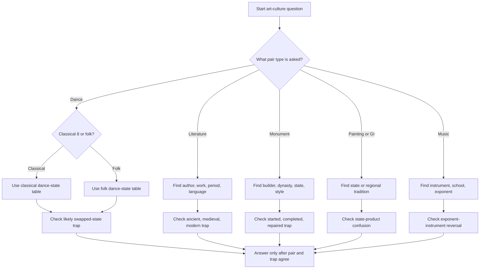

## Concept Ladder

**Step 1 - Core Definitions**  
Art: creative expression through dance, music, painting, sculpture, architecture.  
Culture: shared customs, festivals, traditions, and lifestyles of a region.  
Literature: written works of poetry, prose, and religious/philosophical texts.

**Step 2 - Classification of Indian Classical Dances**  
Sangeet Natak Akademi recognises eight classical dances: Bharatanatyam (Tamil Nadu), Kathak (North India), Kathakali (Kerala), Kuchipudi (Andhra Pradesh), Odissi (Odisha), Manipuri (Manipur), Mohiniyattam (Kerala), Sattriya (Assam). Also important: Chhau (folk-classical hybrid, Odisha/Jharkhand/West Bengal).

**Step 3 - Folk Dances by State**  
Punjab: Bhangra, Giddha. Gujarat: Garba, Dandiya. Rajasthan: Ghoomar, Kalbeliya. Maharashtra: Lavani. Assam: Bihu. Kashmir: Rouf. Himachal: Nati. Haryana: Saang. West Bengal: Baul. Karnataka: Yakshagana. Kerala: Theyyam. Tamil Nadu: Karakattam. Andhra: Kuchipudi drives folk influences.  

**Step 4 - Hindustani & Carnatic Music**  
Hindustani (North): Khyal, Dhrupad, Thumri. Carnatic (South): Kriti, Varnam, Ragam Tanam Pallavi. Instruments: Sitar (Hindustani), Veena (Carnatic), Tabla, Sarod, Flute, Mridangam, Ghatam.

**Step 5 - Literature - Ancient, Medieval, Modern**  
Ancient: Vedas, Upanishads, Ramayana (Valmiki), Mahabharata (Vyasa), Natyashastra (Bharata).  
Medieval: Kalhana's Rajatarangini, Chand Bardai's Prithviraj Raso, Kabir's Doha, Tulsidas' Ramcharitmanas, Surdas' Sursagar, Jayadeva's Gita Govinda.  
Modern: Rabindranath Tagore (Gitanjali), Premchand (Godan), Bankim Chandra (Anandamath), Sarojini Naidu (Golden Threshold), Bharathiar (Tamil).

**Step 6 - Temple Architecture Schools**  
Nagara (North): curvilinear shikhara, e.g., Sun Temple Konark, Kandariya Mahadev.  
Dravida (South): pyramid-shaped vimana, e.g., Brihadeeswara Temple, Thanjavur.  
Vesara (Deccan): hybrid, e.g., Hoysala temples at Belur and Halebidu.

**Step 7 - Monument-Builder Pairs**  
Taj Mahal - Shah Jahan. Qutub Minar - Qutb-ud-din Aibak (started); Iltutmish (completed). Red Fort - Shah Jahan. Ajanta Caves - Buddhist monks (Satavahana/Vakataka). Ellora Caves - Rashtrakuta (Kailasa temple). Sanchi Stupa - Ashoka. Gateway of India - British Raj. Victoria Memorial - Victoria (curated by Lord Curzon).

**Step 8 - Painting Schools**  
Mughal: Miniatures, Hamzanama. Rajput: Kalamkari, Phad. Pahari: Kangra, Basohli. Madhubani (Mithila). Warli (Maharashtra). Tanjore (gold foil). Pattachitra (Odisha). Company School (British-era).

**Step 9 - Festivals & GI Tags**  
Diwali, Holi, Eid, Christmas - national; Pongal (Tamil Nadu), Onam (Kerala), Baisakhi (Punjab), Durga Puja (West Bengal), Ganesh Chaturthi (Maharashtra), Hemis (Ladakh). GI: Chikankari (Lucknow), Darjeeling Tea, Kancheepuram Silk, Pashmina, Mysore Silk, Nagpur Orange.

**Step 10 - Exam-Level Integration**  
All pairs must be memorised: dance-state, author-work, monument-builder, instrument-exponent, festival-region. SSC repeats specific traps: swapping two states, mismatching work-author, confusing Narada with Bharat for dance, swapping Brihadeeswara builder (Raja Raja Chola vs Rajendra Chola). Use mnemonic chains.

### Corpus Pressure

The current promoted book-PYQ corpus gives this topic **870 promoted questions**, so art-culture is not a decorative GA chapter. It is a repeated memory-pair chapter. The biggest pressure bands are:

| Corpus band | Promoted questions | What it tells you |
|---|---:|---|
| General Studies pages 26-50 | 203 | Classical dance, folk dance, literature, and monument pairs repeat heavily. |
| General Studies pages 1-25 | 159 | Basic culture and ancient/medieval author-work pairs are common. |
| General Studies pages 51-75 | 120 | Architecture, painting, music, and mixed correctly matched pairs appear often. |
| Remaining art-culture bands | 388 | Low-frequency facts still appear as option traps in mixed GA sets. |

For 200/200, do not study this as a story chapter. Study it as **pair compression**. Every row must become a flashcard: entity -> state/author/dynasty/field/style, plus one trap.

### Fact Pair Unit

Use this exact structure while revising:

| Field | What to write | Example |
|---|---|---|
| Entity | The word in the question | Sattriya |
| Pair type | State, author, builder, instrument, style, festival, GI, award | Dance-state |
| Correct association | The exam answer | Assam |
| Trap | The likely wrong option | Odisha, because Odissi is also classical |
| Memory hook | One tiny anchor | Sattriya comes from Assam's sattra tradition |
| MCQ seed | One practice prompt | Sattriya is associated with which state? |

### Full Type Tree for 200/200

1. **Classical dance-state**: the list of 8 must be instant.
2. **Folk dance-state**: state festivals and local traditions; most traps swap neighbouring states.
3. **Author-work**: ancient, medieval, modern, and language-region cues.
4. **Work-period**: ancient vs medieval vs modern; this saves options when author is not asked.
5. **Monument-builder/dynasty**: Mughals, Cholas, Rashtrakutas, Ashoka, British-era memorials.
6. **Temple architecture**: Nagara, Dravida, Vesara, Hoysala, cave/rock-cut.
7. **Painting/state**: Madhubani, Warli, Pattachitra, Tanjore, Kalamkari, Kangra, Phad.
8. **Music school/instrument/exponent**: Hindustani vs Carnatic; Ravi Shankar, Bismillah Khan, Zakir Hussain, Hariprasad Chaurasia.
9. **Festival-state**: harvest festivals, regional New Year festivals, religious processions.
10. **GI/product-state**: Kancheepuram Silk, Darjeeling Tea, Chikankari, Pashmina, Mysore Silk.
11. **Awards/institutions**: Sahitya Akademi, Sangeet Natak Akademi, Lalit Kala Akademi, Dadasaheb Phalke.
12. **Correctly matched pair**: the hardest format because every option looks familiar.

## Type System

| Type | Recognition Cue | Method | Speed Target | Trap |
|------|----------------|--------|--------------|------|
| Dance-State | Q asks "which state is associated with ____ dance?" | Pair dance first letter with state capital or iconic word. Example: Bharatanatyam - Chennai (TN) | 5 sec | Chhau is not classical but often listed in folk; Mohiniyattam and Kathakali both Kerala |
| Author-Work | "Who wrote ___?" or "Which book is by ___?" | Use last name / pen name recall. For medieval, link region: Tulsidas (Hindi), Kabir (Hindi), Chand Bardai (Rajput) | 8 sec | Chetan Bhagat vs Vikram Seth; avoid confusing ancient authors (Valmiki vs Vyasa) |
| Monument-Builder | "Who built the ___?" | Link builder's dynasty. Example: Qutub Minar - Slave Dynasty; Taj Mahal - Mughal | 6 sec | Iltutmish vs Aibak for Qutub Minar; Shah Jahan vs Mumtaz Mahal (not builder) |
| Instrument-Exponent | "____ is associated with which instrument?" | Map exponent to instrument through famous pair: Ravi Shankar - Sitar, Zakir Hussain - Tabla | 5 sec | Hariprasad Chaurasia - Flute (not shehnai); Bismillah Khan - Shehnai |
| Festival-Region | "Which festival is celebrated in ___?" | Link to harvest or mythological story: Pongal - harvest; Onam - King Mahabali | 6 sec | Lohri (Punjab) vs Baisakhi (also Punjab); Ganesh Chaturthi is Maharashtra but also Karnataka |
| Painting School | "Which painting style belongs to ___?" | Use region: Madhubani - Bihar, Warli - Maharashtra, Pattachitra - Odisha | 7 sec | Kalamkari is Telangana/AP, often misattributed to Gujarat |
| Literature Period | "Ancient Indian literature includes ___?" | Check period: Vedas (1500-500 BCE), Puranas (Gupta), Modern (post-1850) | 8 sec | Ramcharitmanas is medieval (16th century) not ancient |
| Temple Style | "Identify the temple style of ____ temple" | Look at shikhara shape: curvilinear - Nagara, pyramid - Dravida | 6 sec | Khajuraho is Nagara, not Dravida; Hoysala temples are Vesara |
| GI Tag | "Which product has GI tag from ___?" | Remember state-product pairs: Chikankari from UP, Pashmina from J&K | 8 sec | Many GI tags from Odisha (Pattachitra, applique) - don't mix with Tamil Nadu |

## Speed Methods

**Recall Table - Classical Dances (8)**

| Dance | State | Key Exponent |
|-------|-------|--------------|
| Bharatanatyam | Tamil Nadu | Rukmini Devi Arundale, Mallika Sarabhai |
| Kathak | Uttar Pradesh / North India | Birju Maharaj, Sitara Devi |
| Kathakali | Kerala | Kalamandalam Gopi, Kalamandalam Ramankutty Nair |
| Kuchipudi | Andhra Pradesh | Raja Reddy, Shobha Naidu |
| Odissi | Odisha | Kelucharan Mohapatra, Sanjukta Panigrahi |
| Manipuri | Manipur | Guru Bipin Sinha, Darshana Jhaveri |
| Mohiniyattam | Kerala | Kalamandalam Kalyanikutty Amma, Smitha Rajan |
| Sattriya | Assam | Guru Bhabananda Barbayan, Sharodi Saikia |

**Decision Rule - Folk vs Classical Dance**  
If the question uses the word "folk" or lists a state-specific festival, it is likely folk. If the name appears in Sangeet Natak Akademi list, it is classical. Exception: Chhau is officially a folk dance but often appears in Ga questions - treat as folk from Odisha/Jharkhand/West Bengal.

**Recall Table - Key Literature Works**

| Work | Author | Period |
|------|--------|--------|
| Ramayana | Valmiki | Ancient |
| Mahabharata | Vyasa | Ancient |
| Arthashastra | Chanakya (Kautilya) | Ancient |
| Natyashastra | Bharata Muni | Ancient |
| Rajatarangini | Kalhana | Medieval (12th c) |
| Prithviraj Raso | Chand Bardai | Medieval (12th c) |
| Ramcharitmanas | Tulsidas | Medieval (16th c) |
| Gita Govinda | Jayadeva | Medieval (12th c) |
| Anandamath | Bankim Chandra | Modern (1882) |
| Godan | Munshi Premchand | Modern (1936) |
| Gitanjali | Rabindranath Tagore | Modern (1910) |

**Step-by-Step - Identifying Temple Architecture**  
1. Read temple name and location.  
2. If north of Narmada (Uttar Pradesh, Madhya Pradesh, Odisha, Rajasthan) -> likely Nagara.  
3. If south of Narmada (Tamil Nadu, Karnataka, Kerala, Andhra) -> likely Dravida.  
4. Hybrid elements (Hoysala, Chalukya) -> Vesara.  
5. Check shikhara: curvilinear spire = Nagara; pyramidal = Dravida; star-shaped = Vesara.

**High-Frequency Folk Dance Table**

| Dance | State / Region | Trap to avoid |
|---|---|---|
| Bihu | Assam | Do not confuse with Bhangra of Punjab. |
| Bhangra | Punjab | Folk, not classical. |
| Giddha | Punjab | Female folk dance; same state as Bhangra. |
| Garba | Gujarat | Navratri-linked; not Maharashtra. |
| Dandiya Raas | Gujarat | Stick dance; pair with Garba. |
| Ghoomar | Rajasthan | Not Gujarat; do not confuse with Garba. |
| Kalbeliya | Rajasthan | Snake-charmer community tradition. |
| Lavani | Maharashtra | Fast rhythm; not Punjab. |
| Tamasha | Maharashtra | Folk theatre, often linked with Lavani. |
| Rouf | Jammu and Kashmir | Spring/festival dance. |
| Nati | Himachal Pradesh | Hill-state clue. |
| Chhau | Odisha, Jharkhand, West Bengal | Folk/tribal-classical hybrid; not in the classical 8 list. |
| Yakshagana | Karnataka | Folk theatre-dance; not Kerala's Kathakali. |
| Theyyam | Kerala | Ritual performance; not classical Kathakali. |
| Karakattam | Tamil Nadu | Pot-balancing folk dance. |

**Architecture Recall Table**

| Site / Temple | State | Style / Builder | SSC trap |
|---|---|---|---|
| Brihadeeswara Temple, Thanjavur | Tamil Nadu | Dravida; Raja Raja Chola I | Rajendra Chola built Gangaikonda Cholapuram, not this one. |
| Gangaikonda Cholapuram | Tamil Nadu | Dravida; Rajendra Chola I | Name looks similar to Brihadeeswara. |
| Konark Sun Temple | Odisha | Nagara; Eastern Ganga dynasty | Do not call it Dravida just because it is coastal. |
| Kandariya Mahadev | Madhya Pradesh | Nagara; Chandela | Khajuraho group is Nagara. |
| Kailasa Temple, Ellora | Maharashtra | Rock-cut; Krishna I, Rashtrakuta | Not Ashoka, not Buddhist Ajanta. |
| Sanchi Stupa | Madhya Pradesh | Buddhist stupa; Ashoka origin | Stupa, not temple. |
| Qutub Minar | Delhi | Aibak started, Iltutmish completed | Completion is the trap. |
| Red Fort, Delhi | Delhi | Shah Jahan | Do not confuse with Agra Fort. |
| Victoria Memorial | West Bengal | British-era memorial; Lord Curzon's initiative | Queen Victoria is the subject, not the Indian builder. |

**Painting and GI Recall Table**

| Item | State / Region | Identification cue |
|---|---|---|
| Madhubani / Mithila painting | Bihar | Folk painting with line patterns and natural dyes. |
| Warli painting | Maharashtra | Tribal stick-figure human forms. |
| Pattachitra | Odisha | Cloth scroll painting; Jagannath themes. |
| Tanjore painting | Tamil Nadu | Gold foil and devotional figures. |
| Kalamkari | Andhra Pradesh / Telangana | Pen-work textile painting. |
| Kangra painting | Himachal Pradesh | Pahari school; Krishna themes. |
| Phad painting | Rajasthan | Scroll painting tradition. |
| Kancheepuram Silk | Tamil Nadu | Kancheepuram is in Tamil Nadu. |
| Chikankari | Uttar Pradesh | Lucknow embroidery. |
| Pashmina | Jammu and Kashmir / Ladakh region | Fine wool shawl. |
| Darjeeling Tea | West Bengal | First Indian GI tag. |
| Mysore Silk | Karnataka | Mysore state clue. |

**Music Exponent Table**

| Person | Instrument / Field | Trap |
|---|---|---|
| Ravi Shankar | Sitar | Not sarod. |
| Vilayat Khan | Sitar | Another sitar option trap. |
| Amjad Ali Khan | Sarod | Not sitar. |
| Bismillah Khan | Shehnai | Not flute. |
| Hariprasad Chaurasia | Flute | Not shehnai. |
| Zakir Hussain | Tabla | Not mridangam. |
| Shivkumar Sharma | Santoor | Kashmir instrument clue. |
| M. S. Subbulakshmi | Carnatic vocal | Not a dance exponent. |
| Bhimsen Joshi | Hindustani vocal | Khayal tradition. |

**Mnemonic for Dances** - "BEST of India: Bharatanatyam, Kathak, Kuchipudi (listed), plus Odissi, Manipuri, Mohiniyattam, Sattriya" - but that is 8, not 7. To remember all 8: B-K-K-O-M-M-S (Bharatanatyam, Kerela's two: Kathakali and Mohiniyattam, Kuchipudi, Odissi, Manipuri, Sattriya) plus Kathak. Use phrase "B K K O M M S K" -> "Bach Ke Kaam Ot Mein Mat Samjho Koi" (nonsense but works).

## Trap Table

| Trap | Trigger Wording | Wrong Move | Correct Move | Repair Drill |
|------|----------------|------------|--------------|-------------|
| Swapping classical dance states | "Which state is Kathakali from?" | Select Tamil Nadu or Andhra | Select Kerala | Write on flashcard: Kathakali-Kerala, Mohiniyattam-Kerala, Bharatanatyam-TN |
| Confusing builder of Qutub Minar | "Who completed Qutub Minar?" | Answer Qutb-ud-din Aibak | Answer Iltutmish | Remember: Aibak started, Iltutmish completed, Firoz Shah Tughlaq repaired |
| Mixing ancient and medieval literature | "Which is an ancient text?" | Ramcharitmanas | Ramayana | Use timeline: Ramcharitmanas (16th c) is medieval, Ramayana (500 BCE) is ancient |
| Instrument-exponent reversal | "Which instrument does Bismillah Khan play?" | Flute | Shehnai | Pair: Bismillah Khan-shehnai, Hariprasad Chaurasia-flute, Ravi Shankar-sitar |
| Folk dance tagged as classical | "Which is a classical dance of India?" | Chhau | None (Chhau is not classical) | Memorise Sangeet Natak Akademi list of 8; Chhau is under folk |
| Festival-region mix for Pongal | "Pongal is celebrated in which state?" | Karnataka | Tamil Nadu (and also by Tamils worldwide) | Note: Pongal is primarily Tamil, Makar Sankranti in other states |
| GI tag state confusion | "Which state is known for Kancheepuram silk?" | Karnataka | Tamil Nadu | Kancheepuram is a temple town in Tamil Nadu |
| Hoysala temple style | "What style is Belur temple?" | Dravida | Vesara (Hoysala) | Learn: Hoysala temples are star-shaped and classified as Vesara |
| Chand Bardai work | "Who wrote Prithviraj Raso?" | Kalhana | Chand Bardai | Kalhana wrote Rajatarangini; both are medieval but different regions |
| Sattriya origin | "Sattriya is a classical dance of which state?" | Assam (correct) but trap: "of Odisha" | Choose Assam | Sattriya is from Assam (Sattras - monasteries) |
| Tanjore painting vs Thanjavur | "Tanjore painting originated in which state?" | Karnataka | Tamil Nadu | Tanjore is the British spelling of Thanjavur, Tamil Nadu |
| Bhangra origin | "Bhangra is a classical dance of Punjab?" | True (trap) | False, it is folk | Mark all folk dances clearly; Bhangra is folk, not classical |
| Buddha statue vs temple builder | "Who built the Kailasa temple at Ellora?" | Ashoka | Krishna I (Rashtrakuta) | Kailasa is a rock-cut temple, not Buddhist; built by Rashtrakuta king |
| Tagore's Nobel work | "Tagore won Nobel for which work?" | Gora | Gitanjali | Gitanjali (1913) - collection of poems |

## Flowchart

## Solved Examples

**Example 1**  
Q: "Mohiniyattam is a classical dance form indigenous to which state?"  
Options: (A) Tamil Nadu (B) Kerala (C) Andhra Pradesh (D) Karnataka  
Explanation: Mohiniyattam is from Kerala, known for graceful feminine movements. Answer: (B) Kerala

**Example 2**  
Q: "Who wrote the epic 'Mahabharata'?"  
Options: (A) Valmiki (B) Ved Vyasa (C) Tulsidas (D) Kalhana  
Explanation: The Mahabharata is attributed to Ved Vyasa. Valmiki wrote Ramayana. Answer: (B) Ved Vyasa

**Example 3**  
Q: "The famous monument 'Taj Mahal' was built by which Mughal emperor?"  
Options: (A) Akbar (B) Shah Jahan (C) Jahangir (D) Aurangzeb  
Explanation: Taj Mahal was commissioned by Shah Jahan in memory of Mumtaz Mahal. Answer: (B) Shah Jahan

**Example 4**  
Q: "Which of the following is a folk dance of Gujarat?"  
Options: (A) Garba (B) Kathak (C) Kuchipudi (D) Odissi  
Explanation: Garba is a folk dance of Gujarat; others are classical dances from different states. Answer: (A) Garba

**Example 5**  
Q: "Match List I with List II: List I (Dance) - List II (State)"  
A. Kathak - 1. Kerala; B. Kathakali - 2. Uttar Pradesh; C. Kuchipudi - 3. Andhra Pradesh; D. Manipuri - 4. Manipur  
Options: (A) A-1, B-2, C-3, D-4 (B) A-2, B-1, C-3, D-4 (C) A-2, B-3, C-1, D-4 (D) A-1, B-2, C-4, D-3  
Explanation: Kathak - UP (NCR); Kathakali - Kerala; Kuchipudi - Andhra; Manipuri - Manipur. Correct: A-2, B-1, C-3, D-4 => (B)

**Example 6**  
Q: "Panchatantra was written by which famous Indian author?"  
Options: (A) Vishnu Sharma (B) Chanakya (C) Kalidasa (D) Banabhatta  
Explanation: Panchatantra is a collection of fables written by Vishnu Sharma to teach politics to princes. Answer: (A) Vishnu Sharma

**Example 7**  
Q: "Which Indian classical dance is known for its storytelling through hand gestures (mudras) and elaborate makeup?"  
Options: (A) Odissi (B) Kathakali (C) Bharatanatyam (D) Kuchipudi  
Explanation: Kathakali is famous for its elaborate makeup and hand gestures (mudras) to narrate stories. Answer: (B) Kathakali

**Example 8**  
Q: "Who is considered the father of Indian cinema?"  
Options: (A) Satyajit Ray (B) Dadasaheb Phalke (C) B.R. Chopra (D) Raj Kapoor  
Explanation: Dadasaheb Phalke directed Raja Harishchandra (1913) and is regarded as the father of Indian cinema. Answer: (B) Dadasaheb Phalke

**Example 9**  
Q: "Which of the following is a Carnatic musical instrument?"  
Options: (A) Sitar (B) Veena (C) Tabla (D) Sarod  
Explanation: Veena is primarily used in Carnatic music; sitar, tabla, sarod are Hindustani instruments. Answer: (B) Veena

**Example 10**  
Q: "The Ajanta Caves are famous for which type of art?"  
Options: (A) Rock-cut cave paintings (B) Pillar sculptures (C) Bronze statues (D) Terracotta art  
Explanation: Ajanta Caves contain exquisite Buddhist rock-cut paintings and sculptures. Answer: (A) Rock-cut cave paintings

**Example 11**  
Q: "Brihadeeswara Temple at Thanjavur was built by which Chola king?"  
Options: (A) Rajendra Chola (B) Raja Raja Chola I (C) Kulothunga Chola (D) Vijayalaya Chola  
Explanation: The temple was built by Raja Raja Chola I; his son Rajendra Chola built another Brihadeeswara at Gangaikonda Cholapuram. Answer: (B) Raja Raja Chola I

**Example 12**  
Q: "Which of the following pairs is correctly matched?"  
(A) Garba - Maharashtra, (B) Bihu - Assam, (C) Lavani - Punjab, (D) Ghoomar - Gujarat  
Explanation: Bihu is harvest dance of Assam. Garba - Gujarat, Lavani - Maharashtra, Ghoomar - Rajasthan. Answer: (B) Bihu - Assam

**Example 13**  
Q: "The Pahari school of painting is associated with which state?"  
Options: (A) Rajasthan (B) Himachal Pradesh (C) Maharashtra (D) Odisha  
Explanation: Pahari painting originated in the hill kingdoms of Himachal Pradesh (Kangra, Basohli). Answer: (B) Himachal Pradesh

**Example 14**  
Q: "Which award is given to classical dance exponents?"  
Options: (A) Sangeet Natak Akademi Award (B) Padma Shri (C) Dadasaheb Phalke (D) Sahitya Akademi Award  
Explanation: Sangeet Natak Akademi Award is specifically for performing arts including dance. Padma Shri is national. Answer: (A) Sangeet Natak Akademi Award

**Example 15**  
Q: "Pattachitra painting belongs to which state?"  
Options: (A) West Bengal (B) Odisha (C) Andhra Pradesh (D) Tamil Nadu  
Explanation: Pattachitra is a cloth-based scroll painting tradition of Odisha (also parts of West Bengal but origin is Odisha). Answer: (B) Odisha

**Example 16**  
Q: "Who completed the construction of Qutub Minar?"  
Options: (A) Qutb-ud-din Aibak (B) Iltutmish (C) Firoz Shah Tughlaq (D) Alauddin Khalji  
Explanation: Aibak started it, Iltutmish completed it, and Firoz Shah Tughlaq repaired/restored parts later. The word "completed" fixes the answer. Answer: (B) Iltutmish

**Example 17**  
Q: "Kailasa Temple at Ellora was built by which ruler?"  
Options: (A) Ashoka (B) Krishna I (C) Harsha (D) Rajaraja Chola I  
Explanation: The Kailasa rock-cut temple belongs to the Rashtrakuta ruler Krishna I. Ashoka is a Buddhist stupa/pillar trap. Answer: (B) Krishna I

**Example 18**  
Q: "Sattriya is a classical dance form of which state?"  
Options: (A) Assam (B) Odisha (C) Kerala (D) Manipur  
Explanation: Sattriya developed in the sattra monastery tradition of Assam. Odisha is the Odissi trap. Answer: (A) Assam

**Example 19**  
Q: "Chhau is mainly associated with which set of regions?"  
Options: (A) Odisha, Jharkhand, West Bengal (B) Tamil Nadu, Kerala, Karnataka (C) Punjab, Haryana, Rajasthan (D) Assam, Manipur, Tripura  
Explanation: Chhau is a folk/tribal-classical hybrid associated with Odisha, Jharkhand, and West Bengal. Answer: (A)

**Example 20**  
Q: "Warli painting is associated with which state?"  
Options: (A) Bihar (B) Maharashtra (C) Odisha (D) Rajasthan  
Explanation: Warli is a tribal painting tradition of Maharashtra. Madhubani is Bihar and Pattachitra is Odisha. Answer: (B) Maharashtra

**Example 21**  
Q: "Madhubani painting belongs primarily to which region?"  
Options: (A) Mithila, Bihar (B) Marwar, Rajasthan (C) Malabar, Kerala (D) Bundelkhand, Madhya Pradesh  
Explanation: Madhubani is also called Mithila painting and is associated with Bihar. Answer: (A) Mithila, Bihar

**Example 22**  
Q: "Rabindranath Tagore received the Nobel Prize for which work?"  
Options: (A) Gora (B) Gitanjali (C) Anandamath (D) Godan  
Explanation: Tagore received the Nobel Prize in Literature for Gitanjali. Anandamath is by Bankim Chandra; Godan is by Premchand. Answer: (B) Gitanjali

**Example 23**  
Q: "Natyashastra is traditionally attributed to whom?"  
Options: (A) Bharata Muni (B) Kalidasa (C) Panini (D) Patanjali  
Explanation: Natyashastra is the classical treatise on performing arts attributed to Bharata Muni. Answer: (A) Bharata Muni

**Example 24**  
Q: "Kancheepuram silk is associated with which state?"  
Options: (A) Karnataka (B) Tamil Nadu (C) Kerala (D) Andhra Pradesh  
Explanation: Kancheepuram is a town in Tamil Nadu, so Kancheepuram silk belongs to Tamil Nadu. Answer: (B)

**Example 25**  
Q: "Which pair is incorrectly matched?"  
Options: (A) Ghoomar - Rajasthan (B) Bihu - Assam (C) Lavani - Maharashtra (D) Garba - Punjab  
Explanation: Garba is from Gujarat, not Punjab. The other pairs are correct. Answer: (D) Garba - Punjab

## PYQ Mapping

The following practice routes cover declarative memory and traps specific to art-culture:

- **Pair Memorisation Practice** at /exams/ssc-cgl/topics/art-culture - drill on classical dances, author-work, monument-builder.
- **History & Freedom Movement cross-link** at /exams/ssc-cgl/topics/history-freedom-movement - colonial-era literature (Bankim, Tagore) and monuments (Gateway of India, Victoria Memorial).
- **General Awareness Sprint** at /exams/ssc-cgl/tests/ssc-cgl-general-awareness-speed-sprint - mixed set of 25 questions from all GA topics including art-culture to test recall under time.

Mapping from PYQ corpus: High-yield subtopics (203 questions from pages 26-50, 159 from 1-25) include classical dances, literature author-work, and temple builders. Focus on those. For low-count subtopics (e.g., GI tags, modern painting schools) create original example drills.

## 200/200 Drill

**Timed Micro-Drill 1 - Dance-State (5 questions in 40 seconds)**  
1. Kuchipudi - ? (Andhra Pradesh)  
2. Sattriya - ? (Assam)  
3. Odissi - ? (Odisha)  
4. Kathak - ? (Uttar Pradesh)  
5. Mohiniyattam - ? (Kerala)

**Timed Micro-Drill 2 - Author-Work (5 questions in 45 seconds)**  
1. Gitanjali - ? (Rabindranath Tagore)  
2. Godan - ? (Premchand)  
3. Rajatarangini - ? (Kalhana)  
4. Prithviraj Raso - ? (Chand Bardai)  
5. Anandamath - ? (Bankim Chandra)

**Timed Micro-Drill 3 - Monument-Builder (5 questions in 40 seconds)**  
1. Taj Mahal - ? (Shah Jahan)  
2. Qutub Minar (completion) - ? (Iltutmish)  
3. Ajanta Caves - ? (Buddhist monks)  
4. Kailasa Temple at Ellora - ? (Krishna I, Rashtrakuta)  
5. Sanchi Stupa - ? (Ashoka)

**Repair Rule:** For every wrong answer, write the correct pair 5 times and re-test after 1 hour. Use mnemonic links: "Iltutmish completed Tughlaq (Firoz) repaired" for Qutub Minar; "Raja Raja built large temple, his son built another" for Brihadeeswara.

**Mastery Check:** Solve 30 mixed art-culture questions from the sprint test link within 20 seconds per question. If any mistake, revisit the Trap Table and do the repair drill for that row.

Goal: the full paper is 200/200, and art-culture must be a zero-error GA pocket. Commit all tables to memory using spaced repetition every 3 days.
<!-- SSC-FINAL-PRACTICE-QUEUE:START -->
## Final Practice Queue

1. Start one-by-one practice: [Art, Culture, and Literature practice](/exams/ssc-cgl/practice/art-culture). Finish every question in this topic bank, not just the samples in the note.
2. Move to timed sets: [SSC CGL tests](/exams/ssc-cgl/tests?topic=art-culture). Use topic drills first, then section mocks once accuracy is stable.
3. Repair every miss immediately: record the error label, redo 20 mixed questions from the same topic, then retest after 24 hours.
4. 200/200 rule: do not mark this topic exam-ready until correct answers come within 36 seconds and wrong answers are explained without looking at the solution.

<!-- SSC-FINAL-PRACTICE-QUEUE:END -->
