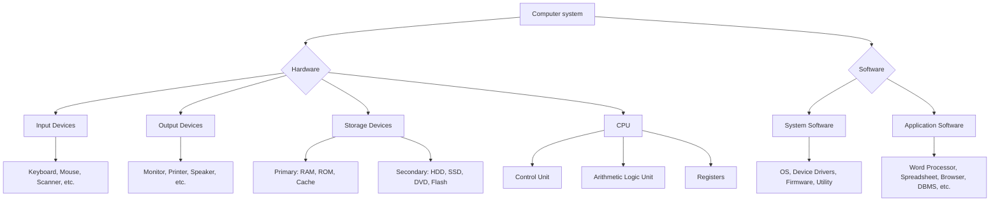

## Concept Ladder

**Step 1 - First Principles: What is a Computer?**  
A computer is an electronic device that accepts data (input), processes it according to stored instructions (program), and produces output. The core components are Hardware (physical parts) and Software (instructions).

### Corpus Pressure

The uploaded book-PYQ corpus marks `computer-awareness` as a 200/200 standard General Awareness topic with **113 promoted questions**. The main pressure band is `pinnacle-ssc-general-studies-p0126-p0150`, which contributes **93 promoted questions**. Smaller repeat clusters appear in `pinnacle-ssc-general-studies-p0576-p0600`, `pinnacle-ssc-general-studies-p0151-p0175`, and scattered mixed-GK pages.

| Corpus Source | Promoted Load | What It Trains |
|----------------|---------------|----------------|
| `pinnacle-ssc-general-studies-p0126-p0150` | 93 promoted questions | Computer fundamentals, memory, software, internet, abbreviations, and cyber terms |
| `pinnacle-ssc-general-studies-p0576-p0600` | 7 promoted questions | Mixed General Awareness transfer and digital facts |
| `pinnacle-ssc-general-studies-p0151-p0175` | 4 promoted questions | Static-GK overlap and fact-pair recall |
| Remaining General Studies pages | 9 promoted questions | Scattered repeats: devices, protocols, Digital India, office terms |

For 200/200, computer awareness should be a fast recall chapter. Most questions are one-fact or one-trap questions, so the target is 20-25 seconds per item inside the 15-minute General Awareness section. Spend time only when the options create a trap pair such as browser/search engine, virus/worm, RAM/ROM, SMTP/POP3, or UPI/BHIM.

**Step 2 - Generations & Classification**  
- **Generations:** 1st (vacuum tubes), 2nd (transistors), 3rd (ICs), 4th (microprocessors - VLSI), 5th (AI and parallel processing).  
- **Classification by size/capability:** Microcomputer (PC), Minicomputer, Mainframe, Supercomputer.

**Step 3 - Hardware Basics**  
- **Input:** Keyboard, Mouse, Scanner, Microphone, Touchscreen, Joystick.  
- **Output:** Monitor, Printer, Speaker, Projector.  
- **Processing:** CPU (Control Unit + ALU + Memory Unit).  
- **Storage:** Primary (RAM, ROM, Cache) and Secondary (HDD, SSD, DVD, Flash drive).

**Step 4 - Software Categories**  
- **System Software:** Operating System (Windows, Linux, macOS), Device Drivers, Firmware.  
- **Application Software:** Word Processor (MS Word), Spreadsheet (MS Excel), Presentation (PowerPoint), DBMS, Web Browser.  
- **Utility Software:** Antivirus, Disk Cleanup, Backup tools.

**Step 5 - Memory Hierarchy**  
- **Bit -> Byte (8 bits) -> KB (1024 B) -> MB -> GB -> TB -> PB -> EB -> ZB -> YB.**  
- **Cache** (fastest, on CPU) -> **RAM** (volatile, temporary) -> **ROM** (non-volatile, permanent boot instructions) -> **HDD/SSD** (permanent storage).

**Step 6 - Networking & Internet**  
- **Network types:** LAN (small area), MAN (city), WAN (global).  
- **Devices:** Router, Switch, Hub, Modem, Bridge, Gateway.  
- **Protocols:** TCP/IP, HTTP/HTTPS, FTP, SMTP, POP3, IMAP, DNS, DHCP.  
- **Concepts:** IP address, URL, Domain Name, Web Browser (e.g., Chrome) vs. Search Engine (e.g., Google).

**Step 7 - Cyber Safety & Digital Payments**  
- **Malware:** Virus (self-replicating), Worm (standalone, reproduces via network), Trojan (disguises as useful), Ransomware (encrypts data for ransom), Spyware, Adware.  
- **Protection:** Firewall, Antivirus, Encryption, Digital Signature, OTP.  
- **Governance:** UPI, Aadhaar, DigiLocker, BHIM, NPCI, e-governance portals.

**Step 8 - Exam Integration**  
- Spot trap pairs: Virus vs. Worm, Internet vs. Web, ROM vs. RAM, Browser vs. Search Engine, URL vs. IP address.  
- Recall abbreviations: CPU, ALU, CU, RAM, ROM, SRAM, DRAM, HDD, SSD, MB, GB, TB.  
- Identify generations: Which device used vacuum tubes? (ENIAC, 1st gen).  
- Distinguish software types: OS is system software; MS Excel is application software.  
- Cyber safety: Phishing is fraudulent email; Firewall prevents unauthorized access.

## Type System

| Type | Recognition Cue | Method | Speed Target | Trap |
|------|----------------|--------|--------------|------|
| Computer Generation | Question mentions "vacuum tubes", "transistors", "IC", "microprocessor", "AI" | Map directly: 1st = vacuum tube, 2nd = transistor, 3rd = IC, 4th = VLSI/microprocessor, 5th = AI | 10 sec | Confusing 3rd gen (IC) with 4th gen (VLSI/microprocessor) |
| Hardware vs. Software | "physical component" vs. "set of instructions" | Hardware = tangible; Software = intangible | 5 sec | Firmware is software stored in hardware - often tricked as hardware. |
| Primary vs. Secondary Memory | "temporary/volatile" vs. "permanent/non-volatile" | RAM = primary/volatile; ROM = primary/non-volatile; HDD/SSD = secondary | 10 sec | ROM is primary but non-volatile - traps as secondary. |
| Internet vs. Web | "global network" vs. "collection of web pages" | Internet = network of networks; Web (WWW) = service over internet | 10 sec | They are not synonymous; web is a subset. |
| Browser vs. Search Engine | "used to access web pages" vs. "tool to find content" | Browser = Chrome, Firefox; Search Engine = Google, Bing | 5 sec | Asked "which is a search engine?" - student picks "Chrome". |
| Virus vs. Worm | "attaches to host file" vs. "self-replicating without host" | Virus needs host; Worm does not | 10 sec | Both spread; worm spreads via network without host. |
| Memory Unit Conversion | "size in bytes" | Bit -> byte x8; KB = 2^10 bytes, etc. | 15 sec | Decimal vs. binary: 1 KB = 1024 bytes, not 1000. |
| Protocol Function | "used for email transfer" or "web communication" | SMTP = send; POP3/IMAP = receive; HTTP = web; FTP = file transfer | 10 sec | SMTP vs. POP3 - both email, but different roles. |
| Full Forms | Abbreviation like CPU, URL, IP | Learn mnemonics: CPU = Central Processing Unit, URL = Uniform Resource Locator | 5 sec | Mixing up URL vs. URI. |
| Digital India Terms | "Aadhaar", "UPI", "DigiLocker", "BHIM" | Connect to purpose: Aadhaar - biometric ID; UPI - payment; DigiLocker - document storage; BHIM - UPI app | 10 sec | BHIM is an app, not a payment system itself - UPI is the protocol. |
| Networking Devices | "connects different networks" etc. | Router = directs data; Modem = modulates/demodulates; Switch = connects LAN devices | 15 sec | Hub vs. Switch - hub dumb, switch intelligent. |
| MS Office Terms | "cell", "row", "column", "slide" | Excel = worksheet (cell, row, column); PowerPoint = slide; Word = document | 5 sec | Row/column in Excel vs. Row in database. |
| Cyber Threats | "malicious software type" | Distinct features: ransomware demands money; phishing steals info via fake emails; spyware monitors activity | 10 sec | Phishing vs. Vishing (voice phishing) - both social engineering. |
| Generation vs. Year | "early 1950s" or "1960s" | 1st gen 1940-1956; 2nd 1956-1963; 3rd 1964-1971; 4th 1971-present; 5th ongoing | 15 sec | 2nd gen start year (transistor invented 1947 but commercial 1956). |

### First 5-Second Classification

Use the keyword in the stem to decide the answer frame before reading every option.

| First Cue | Frame to Use | Instant Rule |
|-----------|--------------|--------------|
| "vacuum tube", "transistor", "IC", "microprocessor" | Generation ladder | 1st vacuum tube, 2nd transistor, 3rd IC, 4th microprocessor/VLSI, 5th AI |
| "volatile", "non-volatile", "booting" | Memory type | RAM volatile, ROM non-volatile boot firmware, cache fastest |
| "physical", "tangible", "instructions" | Hardware/software split | Hardware is physical; software is program/instruction layer |
| "web page", "URL", "browser", "search engine" | Internet vocabulary | Browser opens pages; search engine finds pages; URL is address |
| "send email", "receive email", "file transfer" | Protocol role | SMTP sends, POP3/IMAP receive, FTP transfers files, HTTP loads web pages |
| "fake email", "encrypts data", "disguised program" | Cyber threat | Phishing tricks, ransomware encrypts, Trojan disguises, worm self-spreads |
| "cell", "row", "column", "slide" | Office application | Excel uses cells, rows, columns; PowerPoint uses slides; Word uses documents |
| "UPI", "BHIM", "NPCI", "DigiLocker" | Digital India term | UPI is payment rail, BHIM is an app, NPCI runs payment systems, DigiLocker stores documents |
| "LAN", "MAN", "WAN" | Network coverage | LAN local, MAN city, WAN wide/global |
| "bit", "byte", "KB", "GB" | Unit conversion | 1 byte = 8 bits; 1 KB = 1024 bytes in exam convention |

## Speed Methods

**Recall Tables**  

| Memory Unit | Size (Bytes) | Mnemonic |
|-------------|--------------|----------|
| 1 Bit       | 1/8 Byte     | Smallest |
| 1 Byte      | 8 Bits       | 1 character |
| 1 KB        | 1024 B       | Kilo = approx thousand |
| 1 MB        | 1024 KB      | Mega = million |
| 1 GB        | 1024 MB      | Giga = billion |
| 1 TB        | 1024 GB      | Tera = trillion |

**Decision Rules for Cyber Questions**  
1. Is the question asking about an attack vector? -> Look for "email", "fake website" = Phishing; "encrypts data and demands money" = Ransomware.  
2. Is it about a protective measure? -> Firewall (network); Antivirus (file scanning); OTP (authentication).  
3. Is it about a specific type of malware? -> Attaches to host = Virus; Standalone network spread = Worm; Disguised as legitimate = Trojan.

**Step-by-Step Algorithm for Full Form Questions**  
1. Identify the abbreviation (e.g., HTTP).  
2. Recall first and last word: HyperText Transfer Protocol.  
3. Double-check if it's secure: HTTPS = HyperText Transfer Protocol Secure.  
4. If asked about email: SMTP (Simple Mail Transfer Protocol), POP3 (Post Office Protocol version 3).  
5. If asked about networking: IP (Internet Protocol), TCP (Transmission Control Protocol), UDP (User Datagram Protocol).

**36-second attempt plan for General Awareness** - For General Awareness, the working target is about 20-25 seconds per question. Use:  
- 5 sec: Read question and options, spot key term.  
- 10 sec: Recall from memory tables or decision rules.  
- 5 sec: Eliminate obviously wrong options.  
- 5 sec: Confirm answer and move.  
- For tricky trap pairs, spend extra 5 sec to differentiate.  
If unsure, note and return later (skip-and-return).  

## Trap Table

| Trap | Trigger Wording | Wrong Move | Correct Move | Repair Drill |
|------|----------------|------------|--------------|--------------|
| RAM vs. ROM | "Which memory is volatile?" | Pick ROM because it's read-only. | RAM is volatile; ROM is non-volatile. | Drill: "RAM loses data on power off; ROM retains." |
| Internet vs. Web | "World Wide Web is also known as Internet" | Agree. | Web is a service over Internet; not synonymous. | Practice: "Internet = network infrastructure; Web = collection of websites." |
| Virus vs. Worm | "Can self-replicate without host" | Answer Virus. | Worm self-replicates without host; virus needs host. | Drill: "Worm spreads through network; virus attaches to file." |
| Browser vs. Search Engine | "Google is an example of" | Browser. | Google is a Search Engine; Chrome is a Browser. | Quick check: "Do you type a URL or search query?" |
| LAN vs. WAN | "Which network covers a city?" | LAN. | MAN (metropolitan area) covers city; WAN covers country/globe. | Recall: "LAN local, MAN metro, WAN wide." |
| Byte vs. Bit | "1 Byte = ? bits" | 10 bits (mistaking decimal). | 1 Byte = 8 bits. | Drill: "Byte = 8 Bits (B-B)." |
| Primary vs. Secondary Storage | "RAM is secondary storage" | Consider RAM as secondary because it is internal. | RAM is primary storage (main memory). | Remember: "Primary: CPU directly accesses; Secondary: HDD/SSD." |
| Phishing vs. Spam | "Unwanted email containing malware link" | Spam. | If it attempts to trick user into revealing info, it's phishing. Spam is unsolicited, not necessarily malicious. | Differentiate: "Spam = clutter; Phishing = fraud." |
| SMTP vs. POP3 | "Used to receive emails" | SMTP. | SMTP sends; POP3/IMAP receive. | Acronym: "S for Send (SMTP), P for Pull (POP3)." |
| Firewall vs. Antivirus | "Protects against network threats" | Antivirus. | Firewall controls incoming/outgoing network traffic; Antivirus scans files. | Drill: "Firewall gates network; Antivirus checks programs." |
| Aadhaar vs. DigiLocker | "Digital storage of documents" | Aadhaar. | Aadhaar is biometric ID; DigiLocker is for document storage/verification. | Link: "Locker holds documents; Aadhaar identifies you." |
| UPI vs. BHIM | "Which is a payment app?" | UPI. | UPI is protocol; BHIM is an app using UPI. | Distinguish: "BHIM is a UPI-enabled app; UPI is the system." |
| Compiler vs. Interpreter | "Converts entire code at once" | Interpreter. | Compiler converts all at once; Interpreter line by line. | Memory: "C for Complete (compiler), I for Incremental (interpreter)." |
| Hard Disk vs. RAM | "Which is faster?" | Hard Disk. | RAM is much faster (nanoseconds vs milliseconds). | Recall hierarchy: "CPU > Cache > RAM > HDD." |

## Flowchart

## Solved Examples

**Example 1**  
Which of the following is an example of system software?  
A) MS Word  
B) Windows 10  
C) Google Chrome  
D) Adobe Photoshop  

**Answer:** B) Windows 10  
**Explanation:** System software includes operating systems (Windows, Linux), device drivers, and utilities. MS Word, Chrome, and Photoshop are application software.

**Example 2**  
Which memory is non-volatile and used for booting the computer?  
A) RAM  
B) Cache  
C) ROM  
D) Hard Disk  

**Answer:** C) ROM  
**Explanation:** ROM (Read-Only Memory) retains data even when power is off and contains the BIOS used for booting. RAM is volatile; Cache is high-speed volatile; Hard Disk is secondary storage but not typically used for initial boot firmware.

**Example 3**  
What is the full form of URL?  
A) Universal Resource Locator  
B) Uniform Resource Locator  
C) Unified Resource Locator  
D) Unique Resource Link  

**Answer:** B) Uniform Resource Locator  
**Explanation:** URL = Uniform Resource Locator. It is the address of a resource on the web.

**Example 4**  
Which of the following malware can replicate itself without attaching to a host file?  
A) Virus  
B) Worm  
C) Trojan  
D) Ransomware  

**Answer:** B) Worm  
**Explanation:** Worm is a standalone malware that self-replicates using network vulnerabilities. Virus needs a host file; Trojan disguises as useful; Ransomware encrypts data.

**Example 5**  
Which network device is used to connect a LAN to the internet?  
A) Switch  
B) Hub  
C) Router  
D) Modem  

**Answer:** C) Router  
**Explanation:** Router connects different networks (e.g., LAN to WAN/internet). Switch connects devices within LAN; Hub is a simple repeater; Modem modulates/demodulates signals for internet over phone/cable lines.

**Example 6**  
The term "1 GB" equals how many bytes exactly?  
A) 1000 MB  
B) 1024 MB  
C) 1000 KB  
D) 1024 KB  

**Answer:** B) 1024 MB  
**Explanation:** 1 GB = 1024 MB (binary). 1 GB = 1024 * 1024 * 1024 bytes. (Decimal "1 GB = 1000 MB" is used in some storage marketing, but in computer science binary is standard.)

**Example 7**  
Which of the following is NOT a type of computer memory?  
A) SRAM  
B) DRAM  
C) ALU  
D) ROM  

**Answer:** C) ALU  
**Explanation:** ALU (Arithmetic Logic Unit) is part of CPU, not a memory type. SRAM and DRAM are types of RAM; ROM is read-only memory.

**Example 8**  
What is the main function of a firewall?  
A) To scan for viruses in files  
B) To control incoming and outgoing network traffic  
C) To encrypt emails  
D) To manage user passwords  

**Answer:** B) To control incoming and outgoing network traffic  
**Explanation:** Firewall is a network security system that monitors and controls traffic based on predetermined rules. Antivirus scans for viruses; encryption secures data; password management is separate.

**Example 9**  
Which generation of computers used integrated circuits?  
A) First  
B) Second  
C) Third  
D) Fourth  

**Answer:** C) Third  
**Explanation:** Third generation computers (1964-1971) used integrated circuits (ICs). First used vacuum tubes, second used transistors, fourth used microprocessors.

**Example 10**  
Which of the following is a digital payment system developed by NPCI?  
A) DigiLocker  
B) Aadhaar  
C) UPI  
D) BHIM  

**Answer:** C) UPI  
**Explanation:** UPI (Unified Payments Interface) is a real-time payment system developed by NPCI. DigiLocker is for document storage; Aadhaar is biometric ID; BHIM is an app that uses UPI.

**Example 11**  
Protocol used to send emails is:  
A) HTTP  
B) FTP  
C) SMTP  
D) POP3  

**Answer:** C) SMTP  
**Explanation:** SMTP (Simple Mail Transfer Protocol) is used for sending emails. POP3 and IMAP are for receiving. HTTP is for web pages; FTP for file transfer.

**Example 12**  
The smallest unit of information in a computer is:  
A) Byte  
B) Bit  
C) Nibble  
D) Word  

**Answer:** B) Bit  
**Explanation:** Bit (binary digit) is the smallest unit (0 or 1). Byte = 8 bits; Nibble = 4 bits; Word = size depends on architecture.

**Example 13**  
Which of the following is an input device?  
A) Printer  
B) Monitor  
C) Scanner  
D) Speaker  

**Answer:** C) Scanner  
**Explanation:** Scanner sends physical document data into the computer, so it is an input device. Printer, monitor, and speaker are output devices.

**Example 14**  
Which part of the CPU performs arithmetic and logical operations?  
A) ALU  
B) CU  
C) RAM  
D) ROM  

**Answer:** A) ALU  
**Explanation:** ALU means Arithmetic Logic Unit. It performs arithmetic comparisons and logical operations. CU controls instruction flow.

**Example 15**  
Which of the following is a search engine?  
A) Chrome  
B) Firefox  
C) Google  
D) Windows  

**Answer:** C) Google  
**Explanation:** Google is a search engine. Chrome and Firefox are browsers. Windows is an operating system.

**Example 16**  
Which protocol is mainly used to transfer files between computers over a network?  
A) FTP  
B) SMTP  
C) POP3  
D) DHCP  

**Answer:** A) FTP  
**Explanation:** FTP means File Transfer Protocol. SMTP sends email, POP3 receives email, and DHCP assigns IP configuration.

**Example 17**  
Which protocol translates a domain name into an IP address?  
A) DNS  
B) HTTP  
C) USB  
D) BIOS  

**Answer:** A) DNS  
**Explanation:** DNS means Domain Name System. It resolves names such as example.com into IP addresses.

**Example 18**  
Which memory is usually the fastest among these?  
A) Cache  
B) Hard disk  
C) DVD  
D) Pen drive  

**Answer:** A) Cache  
**Explanation:** Cache memory is closest to the CPU and faster than RAM and secondary storage. Hard disks, DVDs, and pen drives are slower storage media.

**Example 19**  
Which software converts an entire program into machine code before execution?  
A) Interpreter  
B) Compiler  
C) Assembler only  
D) Browser  

**Answer:** B) Compiler  
**Explanation:** A compiler translates the whole program before execution. An interpreter translates and executes line by line.

**Example 20**  
What is phishing?  
A) Encrypting files for ransom  
B) Sending fake messages to steal information  
C) Hardware failure in CPU  
D) Compressing files  

**Answer:** B) Sending fake messages to steal information  
**Explanation:** Phishing is a social-engineering attack using fake emails, links, or pages to steal credentials or personal information.

**Example 21**  
Which malware encrypts user files and demands payment?  
A) Ransomware  
B) Worm  
C) Adware  
D) Cookie  

**Answer:** A) Ransomware  
**Explanation:** Ransomware encrypts files or locks access and demands money. Worms self-spread; adware displays ads; cookies store website data.

**Example 22**  
Which network covers the largest geographical area?  
A) LAN  
B) MAN  
C) WAN  
D) PAN  

**Answer:** C) WAN  
**Explanation:** WAN means Wide Area Network and can cover countries or the globe. LAN is local, MAN is city-scale, and PAN is personal area.

**Example 23**  
Which application is mainly used to create slides?  
A) MS Word  
B) MS Excel  
C) MS PowerPoint  
D) MS Access  

**Answer:** C) MS PowerPoint  
**Explanation:** PowerPoint is presentation software based on slides. Word is for documents, Excel for spreadsheets, and Access for databases.

**Example 24**  
Which of these is a volatile memory?  
A) ROM  
B) RAM  
C) DVD  
D) Hard Disk  

**Answer:** B) RAM  
**Explanation:** RAM loses stored data when power is switched off. ROM and secondary storage retain data.

**Example 25**  
Which organisation developed UPI in India?  
A) RBI only  
B) NPCI  
C) TRAI  
D) ISRO  

**Answer:** B) NPCI  
**Explanation:** UPI was developed by the National Payments Corporation of India. RBI regulates payment systems, but NPCI built and operates the UPI rail.

## PYQ Mapping

Based on the book-PYQ corpus (**113 promoted questions** from Pinnacle SSC General Studies), the distribution shows heavy focus on definitions, abbreviations, software types, memory hierarchy, internet terms, and Digital India. The core practice block is `pinnacle-ssc-general-studies-p0126-p0150`, which contributes **93 promoted questions** and should be exhausted before scattered mixed-GK pages. Use the following practice routes for targeted preparation:  

- **Full computer awareness speed practice:** /exams/ssc-cgl/topics/computer-awareness  
- **Static GK to strengthen foundation:** /exams/ssc-cgl/topics/current-affairs-static-gk  
- **General Awareness speed sprint (15-min sets):** /exams/ssc-cgl/tests/ssc-cgl-general-awareness-speed-sprint  

**Practice Route Table**  

| Weak Area | Practice Route | Number of Questions to Aim |
|-----------|----------------|----------------------------|
| Memory Units & Hierarchy | Computer Awareness topic page | 15-20 PYQ |
| Software Types | Computer Awareness topic page | 10-15 PYQ |
| Internet & Protocols | Computer Awareness topic page | 15-20 PYQ |
| Cyber Safety & Malware | Computer Awareness topic page | 10-15 PYQ |
| Digital India Terms | Current Affairs Static GK page | 10-15 PYQ |
| Full Forms & Abbreviations | Computer Awareness topic page | 20-25 PYQ |

**Repair Drill**  
- If you consistently confuse Internet vs Web, drill: "Internet is the network; Web is a service (collection of linked pages)."  
- If you mix up RAM/ROM, use mnemonic: "RAM is Run-and-Miss (volatile); ROM stays (non-volatile)."  
- For protocol confusion, write a one-liner: "HTTP - hypertext; SMTP - email send; POP3 - email receive; FTP - file."

## 200/200 Drill

**Micro-Drill 1 - Full Forms (30 seconds)**  
Write the full forms:  
1. CPU  
2. ALU  
3. HTTP  
4. URL  
5. SMTP  
6. POP3  
7. LAN  
8. WAN  
9. UPI  
10. NPCI  

**Micro-Drill 2 - True/False (20 seconds)**  
Answer T or F:  
- RAM is non-volatile. (F)  
- Worm can spread without host. (T)  
- Web and Internet are the same. (F)  
- Firewall prevents virus attacks. (F - it controls network traffic)  
- 1 KB = 1000 bytes. (F - 1024)  

**Micro-Drill 3 - Match the Pair (30 seconds)**  
Match Column A with Column B:  
A1: Google         B1: Browser  
A2: Mozilla        B2: Search Engine  
A3: SMTP           B3: Web page transfer  
A4: HTTP           B4: Email sending  
A5: Aadhaar        B5: Document locker  

**Micro-Drill 4 - Trap Identifier (40 seconds)**  
Identify the trap in each statement:  
1. "Internet and World Wide Web are interchangeable terms." (Trap: they are not synonymous)  
2. "Virus can replicate without any host program." (Trap: that is a worm)  
3. "DigiLocker is an app for digital payments." (Trap: DigiLocker stores documents; UPI/BHIM for payments)  
4. "1 GB = 1000 MB in computer systems." (Trap: binary = 1024 MB)  

**Repair Rules**  
- After each drill, review errors and rewrite the correct fact three times.  
- For any full form missed, repeat it out loud 5 times.  
- Create a personal sheet of 10 most common traps and review before the exam.  
- For Digital India terms, learn by purpose: Aadhaar (ID), UPI (transfer), DigiLocker (storage), BHIM (app), CPCB (bodies).  

**Final Strategy**  
- In the exam, if a question seems tricky, use elimination based on trap table.  
- For memory unit questions, always apply binary (1024) unless stated decimal.  
- For protocol questions, recall the action (send/receive/transfer) first.  
- Practice at least 50 PYQs from the /exams/ssc-cgl/topics/computer-awareness route.  
- Aim to answer all 5-6 computer awareness questions in a Tier-I GA set within 2 minutes.  

With thorough recall and trap awareness, computer awareness becomes a high-accuracy section. Treat every missed fact as a flashcard until browser/search engine, RAM/ROM, virus/worm, SMTP/POP3, and UPI/BHIM become automatic.
<!-- SSC-FINAL-PRACTICE-QUEUE:START -->
## Final Practice Queue

1. Start one-by-one practice: [Computer Awareness practice](/exams/ssc-cgl/practice/computer-awareness). Finish every question in this topic bank, not just the samples in the note.
2. Move to timed sets: [SSC CGL tests](/exams/ssc-cgl/tests?topic=computer-awareness). Use topic drills first, then section mocks once accuracy is stable.
3. Repair every miss immediately: record the error label, redo 20 mixed questions from the same topic, then retest after 24 hours.
4. 200/200 rule: do not mark this topic exam-ready until correct answers come within 36 seconds and wrong answers are explained without looking at the solution.

<!-- SSC-FINAL-PRACTICE-QUEUE:END -->
