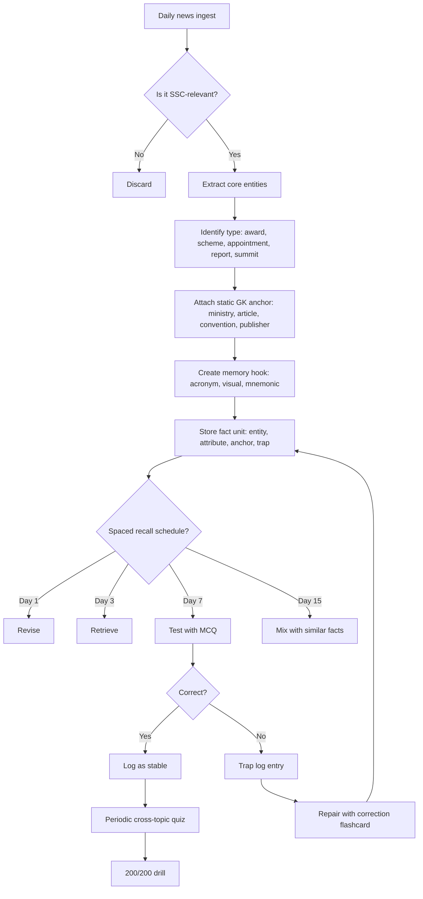

## Concept Ladder

**Rung 1: Raw News Event**  
Every day, dozens of events occur - awards, appointments, reports, summits, sports wins, science launches, government schemes, international agreements. The raw news is a transient fact with a date, location, people, and context.

### Corpus Pressure

The uploaded book-PYQ corpus marks `current-affairs-static-gk` as a 200/200 dominant-repeat General Awareness topic with 2810 promoted questions. This is the largest single topic bucket in the current SSC system. The top source chunks are spread across the General Studies book pages rather than one narrow chapter, which means this route is not just "news". It is the conversion layer that links current items to static GK: schemes, reports, appointments, awards, institutions, polity, economy, environment, culture, geography, and science.

That corpus pressure changes the preparation standard:

| Corpus signal | What it demands | 200/200 implication |
|---:|---|---|
| 2810 promoted questions | High-volume fact recall across GA domains | This topic needs daily revision, not last-week cramming |
| `pinnacle-ssc-general-studies-p0176-p0200` | **204 promoted questions** from dense General Studies fact pages | Build high-speed static anchors before adding new daily items |
| `pinnacle-ssc-general-studies-p0201-p0225` | **194 promoted questions** from mixed static-current recall pages | Expect correctly matched pairs and person-place-year traps |
| `pinnacle-ssc-general-studies-p0101-p0125` | **188 promoted questions** from high-frequency GA pages | Link awards, sports, culture, schemes, and institutions into one recall map |
| `pinnacle-ssc-general-studies-p0151-p0175` | **182 promoted questions** from mixed fact clusters | Drill publisher, ministry, body, place, and year as separate fields |
| `pinnacle-ssc-general-studies-p0076-p0100` | **152 promoted questions** from sports-awards and static link zones | Use fact-pair tables, not paragraph reading |
| General Studies page spread | Static GK and current hooks are mixed | Every news item must attach to a stable fact family |
| Official-source dependency | Facts drift monthly | Latest holders/rates/ranks must come from the daily current-affairs route |
| Trap density | Ministry, publisher, venue, year, rank, and person-role swaps | A single swapped attribute is a direct negative-mark risk |
| Low calculation load | Most questions are direct recall | Correct facts should be answerable in 10-15 seconds |

The permanent note should teach the framework and high-yield static anchors. Live values such as current office holders, current ranks, rates, venues, and latest themes should be refreshed from `/exams/ssc-cgl/current-affairs`, not memorized from a stale static paragraph.

**Rung 2: News-to-MCQ Conversion**  
For SSC CGL, a news item is not studied as a story. It is compressed into a **stable memory unit** containing:  
- **Entity** (person, scheme, report, award, institution)  
- **Attribute** (ministry, objective, target group, year, rank, place)  
- **Static anchor** (e.g., Article 280 for Finance Commission, UNFCCC for climate conventions, fundamental rights for policy)

**Rung 3: Static GK Attachment**  
Every current fact ties to a static GK pillar:  
- **Polity**: Ministries, constitutional bodies, committees  
- **Economy**: RBI, NITI Aayog, budget, indices  
- **Geography/Environment**: National parks, species, conventions, climate terms  
- **History/Culture**: Awards, books, personalities, events  
- **Science & Tech**: Space missions, defence systems, computer terms

**Rung 4: Memory Hook & Spaced Recall**  
Create a hook: acronym (e.g., 'B' for Budget, 'M' for Mission), visual (map flag), or mnemonic (e.g., 'RBI: Money Controller'). Use a spaced-repetition log that revisits the fact on day 1, 3, 7, 15.

**Rung 5: Exam-Level Integration**  
Combine multiple facts into single MCQs (e.g., "Which of the following is correctly matched?"). Develop elimination discipline: check ministry, year, sponsor, target group. Repair incorrect associations immediately via a trap log.

### The SSC Fact Unit

Every current-affairs item should become this six-field unit:

| Field | Question to ask | Example pattern |
|---|---|---|
| Entity | What is the named thing? | Scheme, report, person, award, summit |
| Attribute | What exactly changed or was announced? | Appointed, launched, rank, host, theme |
| Static anchor | Which stable GK family does it belong to? | Ministry, article, body, convention, publisher |
| Exam trap | What will SSC swap? | Old holder, wrong ministry, wrong publisher, nearby year |
| Memory hook | How will I recall it fast? | Acronym, map, timeline, paired contrast |
| MCQ seed | How can it be asked? | Correctly matched, who/where/which, statement pair |

If a news item cannot be converted into at least four of these fields, it is usually not worth deep SSC revision.

## Type System

### First 5-Second Classification

Current-affairs and static-GK questions are short, so the first five seconds decide whether the answer is clean or whether a familiar-but-wrong option pulls you in. Use this classifier before looking at the options as "known" or "unknown".

| First signal | Immediate class | First action |
|---|---|---|
| Scheme, Mission, Yojana, Abhiyaan, portal, app | Scheme-ministry fact | Ask ministry, objective, beneficiary, launch year, and latest update |
| Report, index, rank, score, top country | Report-publisher fact | Ask publisher first, then India's latest value from the daily brief |
| Appointed, elected, assumed charge, chairperson | Appointment-body fact | Ask body, article/act/function, appointing authority, predecessor |
| Awarded, won, conferred, selected | Award-field fact | Ask award body, field, winner/category, year, and Indian connection |
| Hosted, summit, presidency, MoU, exercise | Venue-partner fact | Ask host, partner, theme, outcome, and whether host differs from headquarters |
| COP, Ramsar, IUCN, CITES, species, park | Environment-anchor fact | Ask convention, state/habitat, status, and latest source date |
| RBI, MPC, inflation, repo, budget, GDP | Economy-current fact | Ask institution, tool, direction, latest value, and source |
| Book, author, dance, festival, monument | Culture-static fact | Ask author/field/place/state and link to art-culture route |
| SSC notice, answer key, admit card, tier | Exam-notice fact | Ask exam, tier, date, action needed, and source notice date |
| "Correctly matched" appears | Pair-trap fact | Check the static anchor first: ministry, publisher, article, state, field, venue, year |

| Type | Recognition Cue | Method | Speed Target | Trap |
|------|----------------|--------|--------------|------|
| **Appointments & Elections** | "appointed/elected as", "took charge" | Identify position, tenure, predecessor, ministry | 10 sec | Outgoing person given as answer |
| **Awards & Honours** | "awarded", "nominated", "won" | Note category (civilian, literary, sports), year, reason | 10 sec | Award name swapped with similar (e.g. Khel Ratna vs Arjuna) |
| **Schemes & Missions** | "launched", "announced", "Ministry of" | Objective, target group, budgetary outlay, launch year | 15 sec | Ministry misattributed |
| **Reports & Indices** | "released report", "ranked", "published by" | Publisher, rank/score of India, indicator, year | 15 sec | India's rank confused with global rank |
| **Summits & Bilateral Visits** | "hosted", "signed MoU", "summit" | Host country, theme, participants, outcome | 10 sec | Host country vs headquarters |
| **Sports & Tournaments** | "won", "defeated", "man of the match" | Event, location, winner, runner-up, score | 10 sec | Wrong runner-up given |
| **Science & Technology** | "ISRO", "DRDO", "satellite", "vaccine" | Mission name, objective, launch vehicle, payload | 15 sec | Objective misstated (e.g. navigation vs communication) |
| **Environment & Biodiversity** | "COP", "species", "national park", "Red List" | Convention, host, India-specific status, endemic species | 15 sec | COP number mismatched |
| **Banking & Economy** | "repo rate", "GDP growth", "fiscal deficit" | Current rate, target, source (RBI, IMF, WEO) | 10 sec | Old rate given as current |
| **Obituaries & Notable Deaths** | "passed away", "demise" | Contribution, field, notable work, year | 10 sec | Field misattributed (e.g. literature vs social work) |

### Full Type Tree for 200/200

| Cluster | Subtype | Recognition cue | Required fact unit | Common trap |
|---|---|---|---|---|
| Government schemes | Central scheme | PM, Mission, Yojana, Abhiyaan | Ministry, objective, target group, launch year, benefit | Wrong ministry |
| Government schemes | State scheme in news | State name, CM, local benefit | State, department, objective, beneficiary | Treating as central scheme |
| Government schemes | Portal/app | Dashboard, app, tracker, portal | Ministry, purpose, linked scheme | App name confused with scheme |
| Polity current | Appointment | appointed as, assumed charge | Person, post, appointing authority, predecessor | Old holder |
| Polity current | Constitutional/statutory body | commission, authority, tribunal | Article/act, function, chairperson | Constitutional vs statutory confusion |
| Polity current | Bill/Act/rule | passed, notified, amended | Ministry, subject, key provision | Bill vs Act status |
| Economy | RBI/MPC | repo, inflation, liquidity | Tool, direction, effect, current decision | Repo/reverse repo swap |
| Economy | Budget | allocation, fiscal deficit, tax | Budget year, ministry, target, scheme | Interim vs full budget |
| Economy | Reports | WEO, GII, HDI, CPI, WDI | Publisher, rank/value, top performer, trend | Publisher/rank swap |
| Economy | Banking institutions | NABARD, SIDBI, SEBI, NPCI | Function, HQ, year, regulator | Similar acronym confusion |
| Environment | COP/conventions | COP, protocol, treaty | Convention, host, theme/outcome | COP number vs host |
| Environment | Species | IUCN, CITES, endemic, sanctuary | Species, status, habitat, protected area | IUCN vs Wildlife Act schedule |
| Geography | Parks/reserves | national park, biosphere, Ramsar | State, river/lake, species, first/largest | State swap |
| Culture | Awards | Padma, Jnanpith, Sahitya, sports | Awarding body, field, winner/category | Award-field mismatch |
| Culture | Books/authors | book released, autobiography | Author, language, field, work | Author-title swap |
| Science | ISRO/space | launch, satellite, mission | Launch vehicle, payload, objective, agency | Communication vs navigation |
| Science | Defence | missile, exercise, ship | Platform, range/type, armed force, partner country | Exercise-partner swap |
| Sports | Tournament | won, defeated, hosted | Event, winner, runner-up, venue | Winner-runner-up reversal |
| Days/themes | International day | observed, theme | Date, theme, UN/India context | Last year's theme |
| Obituaries | Notable death | passed away | Field, major contribution, award/work | Person-field mismatch |
| SSC notices | Exam update | SSC notice, admit card, answer key | Exam, tier, date, action needed | Old notice treated as current |

### Four-Level Organization for SSC GA

For presentation and revision, treat this topic in four levels:

| Level | Purpose | What goes here | Practice style |
|---|---|---|---|
| Level 1: Daily fact capture | Convert today's official/RSS items | Entity, attribute, static anchor, trap | 10-15 MCQ seeds daily |
| Level 2: Weekly static linking | Attach news to permanent GK | Ministries, bodies, articles, reports, parks, conventions | 100 mixed flashcards |
| Level 3: Monthly mixed recall | Prevent isolated memory | Correctly matched pairs, statement questions, old-vs-new traps | 100-question monthly mock |
| Level 4: Exam sprint | Protect 200/200 accuracy | Only high-yield, repeatedly missed, latest-quarter facts | Timed GA section and repair queue |

The learner-facing organization is: daily brief, static anchor, drill, repair. Do not study the live feed as a long article list; convert it into compact recall cards.

## Speed Methods

### Recall Tables (Abbreviated)

Do not freeze volatile current values in this note. For repo rate, current office holders, current ranks, latest report editions, summit venues, award winners, and yearly themes, use `/exams/ssc-cgl/current-affairs`. The static note stores stable anchors and update discipline.

| Static family | Stable anchor to memorize | Live field to refresh from current affairs |
|---|---|---|
| RBI and monetary policy | RBI, MPC, repo, reverse repo, CRR, SLR, bank rate, inflation targeting | Current rates, latest MPC decision, voting pattern |
| Constitution | Articles, schedules, bodies, amendment facts | Current commission, current appointment, new bill/act |
| Reports and indices | Publisher, methodology theme, whether higher/lower rank signals improvement | Latest rank, top country, India's trend |
| Schemes | Ministry, objective, target group, launch year, benefit type | Latest expansion, renamed component, budget allocation |
| Environment | Convention, species category, national park, biosphere reserve | Latest COP, Ramsar update, species status update |
| Awards | Field, awarding body, eligibility, highest/secondary award | Latest winner, category, venue |

High-yield stable anchors:

| Area | Must-know anchor | Trap |
|---|---|---|
| DPSP | Articles 36-51; 39A free legal aid; 43 living wage; 47 nutrition | Confused with Fundamental Rights |
| Finance Commission | Article 280 | Confused with GST Council or NITI Aayog |
| Election Commission | Article 324 | Confused with Representation of the People Act alone |
| CAG | Article 148 | Confused with Finance Commission |
| UPSC | Articles 315-323 | Confused with SSC or state service commissions |
| National Emergency | Article 352 | Confused with financial emergency Article 360 |
| Right to Education | Article 21A | Confused with DPSP Article 45 |
| PM-KISAN | Agriculture and Farmers Welfare, income support, DBT | Confused with rural-development schemes |
| Ayushman Bharat PM-JAY | Health and Family Welfare, health insurance/assurance | Confused with Ministry of AYUSH |
| Global Innovation Index | WIPO-linked publication ecosystem | Confused with NITI Aayog |
| HDI | UNDP | Confused with World Bank |
| CPI | Transparency International | Confused with consumer price index in economy context |
| Global Hunger Index | Concern Worldwide and Welthungerhilfe | Confused with FAO alone |
| Ramsar Convention | Wetlands | Confused with biodiversity/CITES only |
| CITES | Trade in endangered species | Confused with IUCN Red List |
| Khel Ratna | Highest sporting honour in India | Confused with Arjuna Award |

### Decision Rules for MCQ

1. **Ministry Match Rule**: If a scheme name includes a word like 'Shiksha', 'Swasthya', 'Gramin' it likely belongs to the corresponding ministry (HRD/Education, Health, Rural Development). The scheme's launch year must be verified.  
2. **Date Rule**: Reports are usually released yearly (Budget in Feb, Economic Survey before Budget). If the question says 'recently' and the option has an event from 3 years ago, eliminate.  
3. **Award Rule**: Lifetime achievement/highest awards go to the oldest/eminent person. For sports, national awards (Arjuna) are given by MoYA&S, international (Olympic medals) by IOA.  
4. **Host Country Rule**: For summits like G20, COP, BRICS, note the rotating presidency. The host country is not the permanent headquarters.  
5. **India's Rank Improvement Rule**: For indices (Global Hunger Index, Press Freedom, Corruption Perception), India's rank often fluctuates. Learn the previous rank and the trend (improved/deteriorated). The answer often states the opposite trend.

### Step-by-Step Algorithms

**Algorithm A: Appointments**  
1. Read the news headline (e.g., "XYZ appointed as new Chief of Army Staff").  
2. Note: Position, Name, Date of appointment, retiring predecessor.  
3. Static anchor: Tenure (usually 3 years for COAS), appointment by President.  
4. Memory: Circle the person's name - retrieve 2 other facts about that person (e.g. previous post, unit).  
5. MCQ drill: "Who is the current Chief of Army Staff?" Answer: XYZ. Trap: predecessor's name.

**Algorithm B: Scheme Attributes**  
1. Scheme name -> extract acronym (e.g., PM-KISAN).  
2. Identify Ministry: Agriculture and Farmers Welfare.  
3. Objective: Income support of Rs 6000/yr to small farmers.  
4. Launch date: Feb 2019.  
5. Static: Direct Benefit Transfer (DBT), NFSA, PM-KMY (pension).  
6. Drill: "PM-KISAN is under which ministry?" Options: Agriculture, Finance, Rural Development. Correct: Agriculture.

**Algorithm C: Report Data**  
1. Report name (e.g., Global Innovation Index).  
2. Publisher: WIPO and Cornell University (not NITI Aayog).  
3. India rank 2024: 39 (score 38.9).  
4. Top: Switzerland.  
5. Static: India improved from 81 (2015) to 39 (2024).  
6. Drill: "Which organisation publishes the Global Innovation Index?" Options: WIPO, IMF, World Bank. Correct: WIPO.

**Algorithm D: Daily Brief to Study Card**  
1. Open `/exams/ssc-cgl/current-affairs`.  
2. For each item, identify source: PIB, RBI, PRS, SSC, or another approved source.  
3. Convert the item into the six-field SSC fact unit: entity, attribute, static anchor, trap, memory hook, MCQ seed.  
4. If the item is RBI/economy, attach it to `/exams/ssc-cgl/topics/economics-budget-banking`.  
5. If the item is constitutional body, bill, appointment, or governance, attach it to `/exams/ssc-cgl/topics/indian-polity-basics`.  
6. If the item is species, COP, climate, park, or disaster, attach it to `/exams/ssc-cgl/topics/environment-ecology`.  
7. If the item is award, book, dance, festival, monument, or personality, attach it to `/exams/ssc-cgl/topics/art-culture`.  
8. Create one direct MCQ and one trap MCQ.

**Algorithm E: Correctly Matched Pair Questions**  
1. Split every option into left fact and right fact.  
2. Check the static anchor first: ministry, publisher, article, state, field, or organization.  
3. Reject pairs with correct entity but wrong attribute.  
4. If multiple pairs look correct, check the newest field: latest winner, latest venue, latest rank, latest holder.  
5. Do not infer beyond the source. If the daily brief does not contain a fact, revise before answering.

### Static-Current Link Tables

**Schemes**

| Scheme family | Static anchor | Common current update | Trap |
|---|---|---|---|
| Health | Health and Family Welfare, NHM, PM-JAY, vaccination, disease control | Expansion, digital health, new target disease | Confused with Ministry of AYUSH |
| Agriculture | Agriculture and Farmers Welfare, PM-KISAN, MSP, crop insurance | Instalment, portal, crop procurement | Confused with Rural Development |
| Education | Education Ministry, Samagra Shiksha, NEP, digital learning | Portal, ranking, new guideline | Old HRD terminology |
| Women/children | Women and Child Development, Poshan, ICDS, Beti Bachao | Nutrition tracker, campaign phase | Confused with Health Ministry |
| Rural/urban | Rural Development, Housing and Urban Affairs, sanitation, livelihood | New target, survey, ranking | Village/urban ministry swap |
| Finance/social security | Finance, Labour, pension, insurance, DBT | Budget allocation, account/beneficiary data | Scheme name similar to state scheme |

**Reports and Indices**

| Report/index family | Publisher anchor | What to refresh | Trap |
|---|---|---|---|
| HDI | UNDP | Latest rank/value and trend | World Bank confusion |
| Global Innovation Index | WIPO-linked | Latest rank, top country | NITI Aayog confusion |
| Corruption Perceptions Index | Transparency International | Latest rank, score | CPI inflation confusion |
| World Economic Outlook | IMF | Growth projection | World Bank WDI confusion |
| Ease of Doing Business | World Bank legacy index | Historical rank and discontinuation context | Treating as currently published annual rank |
| Global Gender Gap | World Economic Forum | Latest rank and subindex weakness | UN Women confusion |
| Press Freedom | Reporters Without Borders | Latest rank | Government ministry confusion |
| Global Hunger Index | Concern Worldwide and Welthungerhilfe | Latest rank/category | FAO-only confusion |

**Environment and Geography**

| Item type | Static anchor | What to refresh | Trap |
|---|---|---|---|
| COP climate | UNFCCC, Paris Agreement, Kyoto Protocol | Latest COP host, theme, outcome | COP number/host mismatch |
| Ramsar site | Wetland, state, lake/river | Latest Indian additions | National park confusion |
| IUCN status | Extinct, critically endangered, endangered, vulnerable | Latest status if updated | CITES schedule confusion |
| National park | State, famous species, river/terrain | New tiger reserve or biosphere update | State swap |
| Cyclone/disaster | Name, basin, affected states, agency | Recent landfall and warning agency | IMD/NDRF role swap |

## Trap Table

| Trap | Trigger Wording | Wrong Move | Correct Move | Repair Drill |
|------|----------------|------------|--------------|--------------|
| Ministry swap | "Ayushman Bharat" | Select Ministry of Health | Correct: Ministry of Health and Family Welfare (not AYUSH) | Pair every scheme with its ministry in a flashcard set |
| Year confusion | "recently launched" | Assume launch year is current year | Check official press release year; many schemes are older but relaunched | Maintain a timeline grid of schemes vs year |
| Rank reversal | "India ranked 1st in world" | Accept as improvement | Verify if it is the rank (low is good for ease of doing business, high is good for HDI) | Compare with previous rank and check direction |
| Person-role mismatch | "new Chief Justice of India" | Select a retired CJI | Confirm name from latest appointment order | Use a "current holders" table updated monthly |
| Event location swap | "hosted by India" | Assume permanent secretariat | Verify host city and year (e.g., COP is held in different cities) | Mark host cities on a mental map |
| Award name mix | "Saraswati Samman" | Treat as Kendra Sahitya Akademi award | Recognise Saraswati Samman is for literature, given by K.K. Birla Foundation | Create a 3-column table: Award - given by - field |
| Similar scheme name | "Kisan Samman Nidhi" | Confuse with PM-KISAN | PM-KISAN is the same; 'Kisan Samman Nidhi' is a state variant | Use exact official name from government portal |
| Budget figure outdated | "fiscal deficit target 4.5%" | Mark as current if was stated | Check Budget session year; interim vs full budget figures differ | Keep one row: Budget year - fiscal deficit target - actual |
| Convention acronym | "COP29" | Assume it is the 29th climate meeting | COP stands for Conference of the Parties, number is cumulative since 1995 | Memorise COP sequence: Paris 2015 (COP21) => COP29 2024 in Baku |
| Static fact mistake | "Article 280" | Attribute to Finance Commission correctly but wrong year | Article 280 is constitutionally permanent; the Finance Commission is set up every 5 years | Link static article numbers with current commission names |
| Private vs public report | "Human Development Index" | Claim it is published by World Bank | Correct: UNDP | List each index and its publisher in a spaced repetition deck |
| India's rank in multi-indicator | "Gender Gap Index" | Use overall rank only | Check sub-indices (education, health, political empowerment) | Drill each sub-rank for top 5 indices |
| Day-specific event | "World Environment Day" | Assign to June 5 but forget theme | Theme changes every year; must be remembered from current year | Maintain a "Days & Themes" table for current year |
| Obituary field | "former PM died" | Assume only political | Check if also served in other capacities (e.g., author, economist) | For every obituary, note 2-3 achievements outside politics |

## Flowchart

## Solved Examples

**Example 1**  
Q. Which of the following ministries launched the 'Poshan Tracker' app?  
(A) Ministry of Health and Family Welfare  
(B) Ministry of Women and Child Development  
(C) Ministry of Rural Development  
(D) Ministry of Tribal Affairs  

**Explanation**: Poshan Tracker is integrated with ICDS and the Poshan Abhiyaan, which are under the Ministry of Women and Child Development. The app tracks nutritional outcomes of children. Hence (B) is correct.  

**Answer: (B)**

---

**Example 2**  
Q. The 'International Day of Yoga' is celebrated on which date?  
(A) 21 June  
(B) 22 June  
(C) 23 June  
(D) 24 June  

**Explanation**: The United Nations declared 21 June as the International Day of Yoga in 2014 following an initiative by India's PM. It is a fixed annual event.  

**Answer: (A)**

---

**Example 3**  
Q. Who is the first woman to be appointed as the Chief Justice of a High Court in India?  
(A) Justice Indu Malhotra  
(B) Justice Leila Seth  
(C) Justice Ranjana Prakash Desai  
(D) Justice G. Rohini  

**Explanation**: Justice Leila Seth became the first woman Chief Justice of the Himachal Pradesh High Court in 1991. Justice Indu Malhotra was the first woman to be directly elevated as a Supreme Court judge.  

**Answer: (B)**

---

**Example 4**  
Q. The 'Khelo India' scheme is under which ministry?  
(A) Ministry of Sports and Youth Affairs  
(B) Ministry of Human Resource Development  
(C) Ministry of Culture  
(D) Ministry of Information and Broadcasting  

**Explanation**: Khelo India is a flagship scheme for grassroots sports development, operated by the Ministry of Sports and Youth Affairs (now Ministry of Youth Affairs and Sports).  

**Answer: (A)**

---

**Example 5**  
Q. Which index is published by the World Economic Forum (WEF)?  
(A) Global Competitiveness Index  
(B) Global Innovation Index  
(C) Human Development Index  
(D) Corruption Perception Index  

**Explanation**: The Global Competitiveness Index is published by the WEF. The Global Innovation Index is by WIPO, Human Development Index by UNDP, Corruption Perception Index by Transparency International.  

**Answer: (A)**

---

**Example 6**  
Q. The 'Pradhan Mantri Jan Dhan Yojana' was launched in which year?  
(A) 2013  
(B) 2014  
(C) 2015  
(D) 2016  

**Explanation**: PMJDY was launched on 28 August 2014, aiming for universal financial inclusion. It is the world's largest financial inclusion program based on number of accounts.  

**Answer: (B)**

---

**Example 7**  
Q. The concept of 'Carbon Neutrality' by 2070 was announced by India at which COP?  
(A) COP26  
(B) COP27  
(C) COP28  
(D) COP29  

**Explanation**: PM Modi announced India's target of net-zero emissions by 2070 at COP26 in Glasgow (2021). At COP27 India refined its Long-Term Low Emissions Development Strategy.  

**Answer: (A)**

---

**Example 8**  
Q. The 'Global Peace Index' is produced by which organisation?  
(A) United Nations  
(B) Institute for Economics & Peace  
(C) World Bank  
(D) Stockholm International Peace Research Institute  

**Explanation**: The Global Peace Index is published annually by the Institute for Economics & Peace (IEP). It ranks countries based on peacefulness. For the latest India rank, use the current-affairs route or the latest report entry rather than memorizing a stale static value.  

**Answer: (B)**

---

**Example 9**  
Q. Which of the following is the first woman Director General of the Indian Council of Medical Research (ICMR)?  
(A) Dr. Soumya Swaminathan  
(B) Dr. Rajni Kant  
(C) Dr. Preeti Sudan  
(D) Dr. V. K. Paul  

**Explanation**: Dr. Soumya Swaminathan served as the first woman Director General of ICMR (2015-2017). She later became Chief Scientist at WHO.  

**Answer: (A)**

---

**Example 10**  
Q. The 'Uttarakanda' river linking project is part of which national mission?  
(A) National Mission for Clean Ganga  
(B) National Water Mission  
(C) Jal Jeevan Mission  
(D) Interlinking of Rivers Programme  

**Explanation**: The Uttarakanda river linking is specifically under the Interlinking of Rivers Programme (ILR) for water transfer from the Ken to the Betwa (Ken-Betwa link). The National Water Mission is broader.  

**Answer: (D)**

---

**Example 11**  
Q. The 'Kala Azar' elimination target in India was set for which year?  
(A) 2023  
(B) 2025  
(C) 2027  
(D) 2030  

**Explanation**: India aimed to eliminate Kala Azar (Visceral Leishmaniasis) by 2023. After missing the earlier target of 2020, the National Vector Borne Disease Control Programme set 2023. However, many districts have achieved elimination but remaining focus areas exist.  

**Answer: (A)**

---

**Example 12**  
Q. Which article of the Indian Constitution provides for the formation of the Finance Commission?  
(A) Article 274  
(B) Article 280  
(C) Article 282  
(D) Article 360  

**Explanation**: Article 280 of the Constitution provides for the composition and functions of the Finance Commission. Article 274 deals with taxes affecting states. Article 282 is about grants, Article 360 about financial emergency.  

**Answer: (B)**

---

**Example 13**  
Q. Which of the following is correctly matched?  
(A) Human Development Index - World Bank  
(B) Corruption Perceptions Index - Transparency International  
(C) Global Innovation Index - IMF  
(D) World Economic Outlook - UNDP  

**Explanation**: Corruption Perceptions Index is published by Transparency International. HDI is associated with UNDP, Global Innovation Index with WIPO-linked publication ecosystem, and World Economic Outlook with IMF.  

**Answer: (B)**

---

**Example 14**  
Q. PM-KISAN is primarily associated with which ministry?  
(A) Ministry of Agriculture and Farmers Welfare  
(B) Ministry of Rural Development  
(C) Ministry of Finance  
(D) Ministry of Cooperation  

**Explanation**: PM-KISAN is an income-support scheme for farmers under the Ministry of Agriculture and Farmers Welfare. The trap is to choose Rural Development because beneficiaries are rural.  

**Answer: (A)**

---

**Example 15**  
Q. Article 324 of the Indian Constitution is related to which body?  
(A) Finance Commission  
(B) Election Commission of India  
(C) Union Public Service Commission  
(D) Comptroller and Auditor General  

**Explanation**: Article 324 vests superintendence, direction, and control of elections in the Election Commission. Finance Commission is Article 280, UPSC is Articles 315-323, and CAG is Article 148.  

**Answer: (B)**

---

**Example 16**  
Q. Ramsar Convention is associated with the conservation of:  
(A) Wetlands  
(B) Desert ecosystems  
(C) Ozone layer  
(D) Endangered species trade  

**Explanation**: Ramsar Convention concerns wetlands. Ozone layer is linked to the Vienna Convention and Montreal Protocol. Endangered species trade is CITES.  

**Answer: (A)**

---

**Example 17**  
Q. The Monetary Policy Committee is associated with which institution in India?  
(A) SEBI  
(B) RBI  
(C) NABARD  
(D) NITI Aayog  

**Explanation**: India's Monetary Policy Committee is associated with RBI and inflation targeting. It decides the policy repo rate.  

**Answer: (B)**

---

**Example 18**  
Q. Which of the following pairs is correctly matched?  
(A) Khel Ratna - Highest sports honour  
(B) Jnanpith - Military gallantry award  
(C) Arjuna Award - Literature  
(D) Dronacharya Award - Cinema  

**Explanation**: Khel Ratna is India's highest sporting honour. Jnanpith is for literature, Arjuna is a sports award, and Dronacharya is for coaches.  

**Answer: (A)**

---

**Example 19**  
Q. CITES is primarily related to:  
(A) International trade in endangered species  
(B) Wetland conservation  
(C) Climate finance  
(D) Ozone depletion  

**Explanation**: CITES regulates international trade in endangered species of wild fauna and flora. Ramsar is wetlands, UNFCCC is climate, and Montreal Protocol is ozone.  

**Answer: (A)**

---

**Example 20**  
Q. Which source should be preferred for a government scheme launch in the daily current-affairs brief?  
(A) PIB or concerned ministry release  
(B) Unsourced viral post  
(C) Date-free screenshot  
(D) Old PDF without date  

**Explanation**: For SSC current affairs, official or official-adjacent sources are preferred. PIB and ministry releases provide ministry, objective, and date evidence needed for MCQ conversion.  

**Answer: (A)**

---

**Example 21**  
Q. Which fact field is most important when converting a report news item into an SSC MCQ?  
(A) Publisher of the report  
(B) Font used in the report PDF  
(C) Length of the report  
(D) Number of website comments  

**Explanation**: SSC frequently asks report-publisher matching. Latest rank/value can change, but publisher anchor is a stable recall field.  

**Answer: (A)**

---

**Example 22**  
Q. A news item says a new chairperson has taken charge of a constitutional body. Which static anchor should be attached first?  
(A) Body's article/function  
(B) Person's social media handle  
(C) Newspaper page number  
(D) Weather of the ceremony day  

**Explanation**: Current appointments become useful for SSC only when tied to the body, article or act, function, appointing authority, and predecessor.  

**Answer: (A)**

---

**Example 23**  
Q. Which of the following is the best trap card for a scheme?  
(A) Ministry, objective, beneficiary, launch year  
(B) Colour of the scheme logo only  
(C) Number of words in the scheme name  
(D) Social media popularity  

**Explanation**: Scheme questions commonly swap ministry, objective, beneficiary, and year. Those fields must become the trap card.  

**Answer: (A)**

---

**Example 24**  
Q. In a "correctly matched" current-affairs question, the safest first check is usually:  
(A) Static anchor such as ministry, publisher, article, state, or field  
(B) Length of the option text  
(C) Alphabetical order of options  
(D) Whether the option sounds familiar  

**Explanation**: Correctly matched questions are designed around one wrong attribute. Static anchor checking removes familiar-but-wrong options.  

**Answer: (A)**

---

**Example 25**  
Q. If the daily current-affairs brief has no source excerpt for a claimed fact, the study system should:  
(A) Treat it as unverified and avoid rendering it as a fact  
(B) Add it because it sounds important  
(C) Convert it into 10 MCQs immediately  
(D) Mark it as official automatically  

**Explanation**: Current-affairs revision must stay tied to the supplied source excerpt. Unsupported claims should not be treated as exam facts.  

**Answer: (A)**

## PYQ Mapping

| Topic Type | Practice Route |
|------------|----------------|
| **Appointments (current)** | /exams/ssc-cgl/current-affairs |
| **Schemes & Ministries** | /exams/ssc-cgl/topics/current-affairs-static-gk |
| **Reports & Indices** | /exams/ssc-cgl/topics/economics-budget-banking |
| **Environment Conventions & Biodiversity** | /exams/ssc-cgl/topics/environment-ecology |
| **Awards & Honours** | /exams/ssc-cgl/topics/sports-awards |
| **Art, Culture, and Persons** | /exams/ssc-cgl/topics/art-culture |
| **Computer & IT Terms** | /exams/ssc-cgl/topics/computer-awareness |
| **Budget, Banking, RBI** | /exams/ssc-cgl/topics/economics-budget-banking |
| **National Parks, Rivers, Climate** | /exams/ssc-cgl/topics/environment-ecology |
| **Polity Static Anchors** | /exams/ssc-cgl/topics/current-affairs-static-gk (via static linkage) |

The best practice is to solve at least 50 MCQs per topic from the linked routes, then review trap logs. For current affairs, a monthly comprehensive test of 100 questions should be done, with special emphasis on the latest quarter.

## 200/200 Drill

**Timed Micro-Drills (each drill = 5 minutes)**

1. **Scheme-Ministry Match**: Given a list of 20 schemes, write the correct ministry in 5 min. Score 18+ to pass. Repair: review wrong ones, create a mnemonic like "Education -> Shiksha, Health -> Arogya".

2. **Rank Recall**: For 10 indices (HDI, GII, EPI, etc.), write India's rank alongside publisher. Time: 5 min. Score 8+ passing. Repair: use a table of 5 indices with decade trends.

3. **Appointment Blitz**: 10 current positions (CJI, COAS, Governor RBI, Chief Election Commissioner, etc.) - name the office holder. Time: 5 min. Use the 'current holders' list updated each month. Trap: avoid confusing holdover with new.

4. **Constitution Article Link**: 10 scheme-article pairs (e.g., RTI -> Article 19(1)(a), Right to Education -> Article 21A). Time: 5 min. Score 7+ passing. Repair: flashcard deck with article on one side, subject on the other.

5. **Year Trap**: 15 events (scheme launches, awards, reports) with 15 years, but some are swapped. Identify the mismatches in 5 min. Score 12+ passing. Repair: maintain a linear timeline on a chart.

**Repair Rules**

- **If you miss a ministry match**: Open the official website of the scheme and note the ministry in your own handwriting.
- **If you confuse a rank**: Compare the index methodology (e.g., Ease of Doing Business ranks low for good, HDI ranks high for good). Write a bullet summary of the index.
- **If you forget a date**: Create a mnemonic sentence: e.g., 'PM Jan Dhan - 2014 - Modi's first big scheme - 28th August' -> 'PMJD 28/8/14'.
- **If you swap award names**: Separate by field: literature awards (Sahitya Akademi, Saraswati, Jnanpith); science awards (Shanti Swarup Bhatnagar); sports awards (Arjuna, Dronacharya, Khel Ratna). Make a one-page cheat sheet.
- **If you choose the wrong person in a current affair**: Use "Who's Who" style: identify the person's latest photo and designation. Link to 2 previous posts.

**Daily Drill Schedule** (last 30 days before exam)

- Morning: 10 min - new current affairs log and review previous day's trap log.
- Afternoon: 15 min - one micro-drill.
- Evening: 15 min - PYQ mapping test (10 questions from linked routes). If wrong, update repair notes.

### Daily Brief Workflow

Use the daily brief like this:

| Step | Action | Output |
|---|---|---|
| 1 | Open `/exams/ssc-cgl/current-affairs` after the morning run | Daily official-source items |
| 2 | Mark each item as scheme, report, appointment, economy, environment, culture, science, sports, or SSC notice | Type label |
| 3 | Attach one static route | Current-affairs-static-gk, economy, polity, environment, art-culture, science, computer |
| 4 | Write one trap | Old holder, wrong ministry, wrong publisher, old rank, wrong venue |
| 5 | Answer the MCQ seed without looking | Recall score |
| 6 | Save weak items to repair queue | Next-day retest |

### 30-Day GA Fact Budget

| Bucket | Daily count | 30-day total | Must include |
|---|---:|---:|---|
| Schemes and ministries | 5 | 150 | Ministry, objective, beneficiary |
| Reports and indices | 3 | 90 | Publisher, latest rank/value from brief, trend |
| Appointments and bodies | 3 | 90 | Person, post, article/act/function |
| Environment/geography | 3 | 90 | Convention, species, park, state |
| Awards/culture/sports | 3 | 90 | Award body, field, winner/category |
| Economy/banking | 2 | 60 | Institution, tool, effect |
| SSC notices/exam updates | As needed | As needed | Exam, tier, date, action |

The target is not to memorize every headline. The target is 500-600 SSC-ready fact units with high retrieval strength and clear trap labels.

### Error Autopsy

| Error label | Symptom | Repair action | Retest |
|---|---|---|---|
| Ministry swap | Correct scheme, wrong ministry | Build a scheme-ministry-beneficiary card | 25 scheme cards next morning |
| Publisher swap | Correct report, wrong publisher | Make report-publisher-top/rank card | 20 report-index MCQs |
| Old current fact | Old holder/rank/rate chosen | Refresh from current-affairs route and mark date | 10 latest-holder/rank questions |
| Static anchor miss | News remembered but article/body/function forgotten | Link to polity/economy/environment note | 15 static anchor questions |
| Venue/year miss | Event known but host/year wrong | Timeline card with previous and latest venue | 20 summit/award/year questions |
| Similar award confusion | Award field mixed up | Field-wise award table | 15 award-field questions |
| Environment convention swap | Ramsar/CITES/COP/Montreal mixed | Convention-purpose table | 20 environment convention questions |
| Unsupported fact accepted | Fact not in source/excerpt | Reject and keep as unverified | Source-grounding check for next brief |
| Slow recall | Correct after 30+ seconds | Convert fact into hook and MCQ seed | Same card repeated Day 1/3/7 |

### Mastery Standard

Current affairs and static GK is ready for exam pressure only when:

1. Every daily item is converted into entity, attribute, static anchor, trap, memory hook, and MCQ seed.
2. Latest facts are refreshed from `/exams/ssc-cgl/current-affairs`; stable anchors are revised from this page and linked GA topics.
3. You can answer direct scheme/report/appointment/award questions in 10-15 seconds.
4. You can survive correctly matched pair questions by checking ministry, publisher, article, state, field, venue, and year.
5. Your weekly 100-question GA current-static mock stays at 90+ correct before the final month and 95+ correct in the final month.
6. Every wrong current-affairs answer enters the error autopsy table and is retested on Day 1, Day 3, Day 7, and Day 15.

**Goal**: By the end of 30 days, retain 95% of the 500-600 high-yield fact units with zero delayed recall. Your speed should be one direct GA MCQ in 10-15 seconds including elimination.
<!-- SSC-FINAL-PRACTICE-QUEUE:START -->
## Final Practice Queue

1. Start one-by-one practice: [Current Affairs and Static GK practice](/exams/ssc-cgl/practice/current-affairs-static-gk). Finish every question in this topic bank, not just the samples in the note.
2. Move to timed sets: [SSC CGL tests](/exams/ssc-cgl/tests?topic=current-affairs-static-gk). Use topic drills first, then section mocks once accuracy is stable.
3. Repair every miss immediately: record the error label, redo 20 mixed questions from the same topic, then retest after 24 hours.
4. 200/200 rule: do not mark this topic exam-ready until correct answers come within 36 seconds and wrong answers are explained without looking at the solution.

<!-- SSC-FINAL-PRACTICE-QUEUE:END -->
