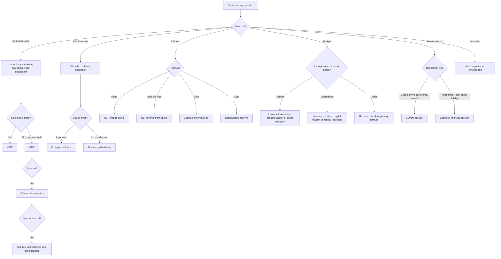

## Concept Ladder

**Rung 1: The exam asks labels, not essays**  
Economics questions in SSC CGL Tier-I usually reward fast classification. You are not writing policy analysis. You are reading one cue word and attaching it to the right box: GDP or GNP, CPI or WPI, repo or reverse repo, revenue or capital, fiscal deficit or primary deficit, current account or capital account.

**Rung 2: Basic economic activity**  
Goods are tangible outputs. Services are intangible outputs. The three broad sectors are primary, secondary, and tertiary.
- Primary: agriculture, mining, fishing, forestry.
- Secondary: manufacturing, construction, electricity, gas, water supply.
- Tertiary: trade, transport, banking, education, health, IT, administration.

**Rung 3: Demand, supply, and price**  
Demand means desire backed by purchasing power. Supply means quantity offered by producers at a price. Equilibrium is the price at which demand and supply balance. A rightward demand shift raises price and quantity. A leftward supply shift raises price but lowers quantity. For SSC, these lines appear through inflation questions: extra demand gives demand-pull inflation; higher input cost gives cost-push inflation.

**Rung 4: National income chain**  
GDP is territorial: final goods and services produced within domestic territory. GNP is national: GDP plus net factor income from abroad. NNP removes depreciation. National Income is normally NNP at factor cost.
- GDPmp = value produced within domestic territory at market price.
- GNPmp = GDPmp + NFIA.
- NNPmp = GNPmp - depreciation.
- NNPfc = NNPmp - net indirect taxes.
- Net indirect taxes = indirect taxes - subsidies.
- Per capita income = national income / population.

**Rung 5: Inflation and price indices**  
Inflation is a sustained rise in the general price level. Deflation is a sustained fall in the general price level. Disinflation means inflation is still positive but slowing. CPI tracks retail consumer prices and is used for inflation targeting. WPI tracks wholesale prices and excludes services. Core inflation commonly excludes food and fuel.

**Rung 6: Monetary policy and RBI tools**  
Monetary policy changes money and credit conditions. RBI tools are repeatedly tested as direction questions.
- Repo rate: RBI lends short-term funds to banks against securities.
- Reverse repo rate: RBI borrows short-term funds from banks.
- CRR: banks keep a percentage of demand and time liabilities as cash balance with RBI.
- SLR: banks keep a percentage of liabilities in liquid assets such as cash, gold, and approved securities.
- Bank Rate: rate for longer-term RBI lending; often appears as a penal or long-term lending cue.
- Open Market Operations: RBI buys or sells government securities to manage liquidity.
- MPC: decides the policy repo rate to keep inflation around the mandated target band.

**Rung 7: Budget and fiscal policy**  
Fiscal policy is government tax, borrowing, and expenditure policy. The Union Budget is the annual financial statement of receipts and expenditure. SSC repeats four split-lines: revenue vs capital, tax vs non-tax, direct vs indirect, and deficit formulas.
- Revenue receipts: tax revenue plus non-tax revenue; they do not create future repayment liability.
- Capital receipts: borrowings, loan recovery, disinvestment; they create liability or reduce assets.
- Revenue expenditure: routine running expenditure; no asset creation.
- Capital expenditure: asset creation or reduction of liability.
- Revenue deficit = revenue expenditure - revenue receipts.
- Fiscal deficit = total expenditure - revenue receipts - non-debt capital receipts.
- Primary deficit = fiscal deficit - interest payments.

**Rung 8: Banking and institutions**  
Institution-function matching is the safest scoring area if the table is memorized.
- RBI: central bank, currency issue, banker to banks, banker to government, monetary policy, foreign exchange reserve management.
- Commercial banks: accept deposits and give loans.
- NABARD: agriculture and rural development refinance.
- SIDBI: micro, small, and medium enterprise finance support.
- SEBI: securities market regulator.
- IRDAI: insurance regulator.
- PFRDA: pension sector regulator.
- EXIM Bank: export-import finance.

**Rung 9: External sector**  
Balance of Payments records transactions between residents of a country and the rest of the world.
- Balance of Trade: goods exports minus goods imports.
- Current account: goods, services, income, transfers.
- Capital account: capital transfers and asset-liability changes.
- Financial account: FDI, FPI, loans, banking capital, reserves.
- Trade deficit: imports exceed exports.
- Currency depreciation: domestic currency loses value against foreign currency.
- Managed float: market-determined exchange rate with central bank intervention.

**Rung 10: Current-affairs conversion**  
Do not memorize mutable rates inside this static note. When the current-affairs brief says RBI changed a rate, Budget revised a deficit target, or a new scheme changed an amount, convert it into three exam facts: institution, instrument, direction. Example pattern: "RBI raises policy rate" -> credit cost rises -> borrowing demand falls -> inflation pressure falls. Static concepts stay here; live values belong in `/exams/ssc-cgl/current-affairs`.

## Type System

### Corpus Pressure

This topic is backed by **302 promoted questions** from the book-PYQ corpus. The distribution is wide enough that the note must cover static economy, budget, RBI, banking, external sector, and public finance, not just one finance table.

| Corpus bucket | Promoted load | What it usually pressures |
|---|---:|---|
| pinnacle-ssc-general-studies-p0401-p0425 | 123 promoted questions | Budget terms, banking, RBI tools, deficits, inflation, GDP terms |
| pinnacle-ssc-general-studies-p0426-p0450 | 24 promoted questions | Financial institutions, money market, banking functions |
| pinnacle-ssc-general-studies-p0376-p0400 | 19 promoted questions | National income, planning, sectors, taxation basics |
| pinnacle-ssc-general-studies-p0576-p0600 | 18 promoted questions | Mixed economy, schemes, reports, current-linked static facts |
| pinnacle-ssc-general-studies-p0126-p0150 | 17 promoted questions | Static GK overlap: institutions, committees, headquarters |
| pinnacle-ssc-general-studies-p0301-p0325 | 14 promoted questions | Fiscal terms, development indicators, sector facts |
| Remaining buckets | 87 promoted questions | Scattered repeats across budget, currency, trade, and regulators |

Priority order for a 200/200 attempt: master RBI/banking and budget formulas first, then national income and inflation indices, then external sector and schemes. Most questions should be answerable inside 15 to 25 seconds; only formula substitution should use the full 36-second pacing window.

### First 5-Second Classification

| First cue in question | Classify as | Immediate move |
|---|---|---|
| GDP, GNP, NNP, NFIA, depreciation | National income | Apply territory-national-depreciation-tax adjustment chain |
| CPI, WPI, core inflation, deflation | Inflation index | Decide retail vs wholesale vs price fall vs slower price rise |
| Repo, reverse repo, CRR, SLR, OMO | RBI monetary policy | Identify lending/borrowing/reserve/liquidity tool |
| Revenue deficit, fiscal deficit, primary deficit | Budget deficit | Use formula before reading options |
| Revenue receipt, capital receipt | Budget receipt | Ask: liability created or asset reduced? |
| Revenue expenditure, capital expenditure | Budget expenditure | Ask: asset created or routine running expense? |
| RBI, NABARD, SEBI, SIDBI, EXIM | Institution-function | Match regulator/refinance/sector role |
| BOP, BOT, current account, capital account | External sector | Goods/services/income vs asset-liability movement |
| Direct tax, indirect tax, GST | Taxation | Incidence on same person vs shifted to consumer |
| Plan, non-plan, planning body | Legacy planning | Treat as historical term; modern budget split is revenue/capital |

### Full Type Tree for 200/200

| Type | Recognition cue | 36-second method | Trap to block |
|---|---|---|---|
| Definition recall | "Which is GDP?" | Territorial for GDP, national for GNP | Choosing citizen-based definition for GDP |
| Formula conversion | GDP, NFIA, depreciation, indirect tax | GDP -> GNP -> NNPmp -> NNPfc | Forgetting net indirect tax adjustment |
| Inflation cause | wage, crude oil, excess demand, spending | Cost shock = cost-push; demand expansion = demand-pull | Calling every price rise demand-pull |
| Index comparison | CPI vs WPI | CPI = retail/services possible; WPI = wholesale/no services | Marking WPI as inflation target index |
| RBI instrument | repo, reverse repo, CRR, SLR | Lend, borrow, cash reserve, liquid asset reserve | Mixing CRR cash with SLR securities |
| Liquidity direction | rate or reserve ratio changed | Higher rate/reserve usually tightens credit | Assuming all RBI action expands credit |
| Budget receipt | tax, dividend, borrowing, disinvestment | Tax/non-tax = revenue; borrowing/disinvestment = capital | Calling disinvestment revenue |
| Budget expenditure | salaries, interest, roads, loans | Routine = revenue; asset creation = capital | Treating every government payment as revenue |
| Deficit formula | revenue/fiscal/primary | Write formula in three seconds, then substitute | Confusing primary with fiscal |
| Regulator matching | SEBI, IRDAI, PFRDA, RBI | Match sector first, then function | Choosing RBI for all finance bodies |
| External account | remittance, FDI, imports, exports | Income/transfer/trade = current; investment/loan = capital/financial | Putting remittance in capital |
| Scheme/static economy | PM-KISAN, MGNREGA, NITI Aayog | Identify ministry/purpose/beneficiary | Memorizing amount without purpose |

## Speed Methods

**A. Static Formula and Institution Tables**

| Item | Static recall | Exam use |
|---|---|---|
| GDP | Domestic territory output | "within India" cue |
| GNP | GDP + NFIA | "by nationals" cue |
| NNP | GNP - depreciation | "net" cue |
| National Income | NNP at factor cost | subtract net indirect taxes from market price |
| CPI inflation target | 4% with +/- 2% tolerance band | framework fact, not a changing daily rate |
| Revenue deficit | Revenue expenditure - revenue receipts | current-account weakness of government budget |
| Fiscal deficit | Total expenditure - revenue receipts - non-debt capital receipts | borrowing requirement |
| Primary deficit | Fiscal deficit - interest payments | deficit excluding past debt interest |
| CRR | Cash with RBI | no lending from this portion |
| SLR | Liquid assets | cash/gold/approved securities |
| Repo | RBI lends to banks | liquidity support |
| Reverse repo | RBI borrows from banks | liquidity absorption |

**B. Decision Rules**

1. National income chain: if the question says "within domestic territory", choose GDP. If it says "by residents/nationals", move to GNP. If it says "net", subtract depreciation. If it says "factor cost", adjust indirect taxes and subsidies.
2. Budget receipt: if the government must repay it or loses an asset, classify it as capital receipt. If not, classify it as revenue receipt.
3. Budget expenditure: if it creates an asset or reduces liability, classify it as capital expenditure. If it runs day-to-day administration, classify it as revenue expenditure.
4. Money supply direction: higher repo, CRR, or SLR tightens lending capacity. Lower repo, CRR, or SLR loosens lending capacity.
5. BOP account: trade, services, income, remittances are current account. Investment and loans are capital or financial account.

**C. Mini Algorithms**

**Algorithm: Fiscal deficit from budget figures**  
Step 1: Add revenue expenditure and capital expenditure to get total expenditure.  
Step 2: Add revenue receipts and non-debt capital receipts.  
Step 3: Fiscal deficit = Step 1 - Step 2.  
Step 4: If interest payment is given, primary deficit = fiscal deficit - interest payment.

**Algorithm: GDP to national income**  
Step 1: GDPmp + NFIA = GNPmp.  
Step 2: GNPmp - depreciation = NNPmp.  
Step 3: NNPmp - indirect taxes + subsidies = NNPfc.  
Step 4: NNPfc is National Income.

**Algorithm: RBI tool direction**  
Step 1: Identify the tool.  
Step 2: Repo or bank rate affects cost of borrowing for banks.  
Step 3: CRR or SLR affects lendable resources.  
Step 4: Higher cost/reserve = less credit; lower cost/reserve = more credit.

**Algorithm: Current vs capital account**  
Step 1: Ask whether the item is trade/service/income/transfer. If yes, current account.  
Step 2: Ask whether the item changes ownership of assets or liabilities. If yes, capital or financial account.  
Step 3: For SSC, FDI, FPI, external loans, and reserve changes are not current account items.

## Trap Table

| Trap | Trigger wording | Wrong move | Correct move | Repair drill |
|---|---|---|---|---|
| GDP vs GNP | "Indian citizens abroad" | Choose GDP | Choose GNP | Replace location cue with nationality cue three times |
| GDP vs NNP | "Net domestic product" | Ignore depreciation | Subtract depreciation | Circle "net" before calculating |
| Market price vs factor cost | "at factor cost" | Stop at NNPmp | Adjust net indirect taxes | Write NIT = indirect taxes - subsidies |
| Revenue vs fiscal deficit | "borrowing requirement" | Pick revenue deficit | Pick fiscal deficit | Fiscal = total borrowing gap |
| Fiscal vs primary deficit | "excluding interest" | Pick fiscal deficit | Pick primary deficit | Primary = fiscal - interest |
| CRR vs SLR | "cash with RBI" | Pick SLR | Pick CRR | CRR starts with cash |
| Repo vs reverse repo | "RBI borrows from banks" | Pick repo | Pick reverse repo | Reverse means flow is reversed |
| Bank rate vs repo | "long-term or penal rate" | Pick repo | Pick bank rate | Repo is short-term against securities |
| CPI vs WPI | "retail consumer basket" | Pick WPI | Pick CPI | Consumer = CPI |
| Deflation vs disinflation | "rate of inflation falls" | Pick deflation | Pick disinflation | Deflation requires price level fall |
| Current vs capital account | "NRI remittance" | Put in capital | Put in current | Remittance is transfer income |
| Trade deficit vs BOP deficit | "goods exports minus imports" | Pick BOP | Pick Balance of Trade | Goods-only is BOT |
| SEBI vs RBI | "stock market regulator" | Pick RBI | Pick SEBI | Securities = SEBI |
| NABARD vs SIDBI | "agriculture refinance" | Pick SIDBI | Pick NABARD | Agriculture and rural = NABARD |
| Legacy plan terms | "plan expenditure" in old wording | Apply as modern budget class | Treat historically; modern answer uses revenue/capital if asked | Convert the item by asset creation |

## Flowchart

## Solved Examples

**Example 1**  
Q: Which statement correctly defines GDP?  
A) Value of output produced by Indian citizens anywhere in the world  
B) Value of final goods and services produced within domestic territory  
C) Value of output after subtracting depreciation  
D) Value of exports minus imports  
**Answer: B**  
Explanation: GDP is territorial. "Within domestic territory" is the fastest cue.

**Example 2**  
Q: If GDPmp = Rs 200 lakh crore, NFIA = Rs -10 lakh crore, depreciation = Rs 20 lakh crore, and net indirect tax = Rs 5 lakh crore, find NNPfc.  
A) Rs 165 lakh crore  
B) Rs 170 lakh crore  
C) Rs 175 lakh crore  
D) Rs 185 lakh crore  
**Answer: A**  
Solution: GNPmp = 200 - 10 = 190. NNPmp = 190 - 20 = 170. NNPfc = 170 - 5 = 165.

**Example 3**  
Q: The Monetary Policy Committee is mainly associated with which decision?  
A) Fiscal deficit target  
B) Policy repo rate  
C) GST slab creation  
D) Stock exchange listing  
**Answer: B**  
Explanation: MPC decides the policy repo rate for inflation targeting. Budget deficit is fiscal policy; securities market listing is SEBI domain.

**Example 4**  
Q: Which is a capital receipt?  
A) Corporation tax  
B) Dividend from a public sector enterprise  
C) Disinvestment proceeds  
D) Fee collected by a department  
**Answer: C**  
Explanation: Disinvestment reduces government assets, so it is capital receipt. Taxes, dividends, and fees are revenue receipts.

**Example 5**  
Q: Banks maintaining a part of deposits as cash balance with RBI refers to:  
A) SLR  
B) CRR  
C) Repo  
D) Bank Rate  
**Answer: B**  
Explanation: CRR is cash reserve with RBI. SLR is liquid asset reserve.

**Example 6**  
Q: A rise in crude oil prices causing a general price rise is:  
A) Demand-pull inflation  
B) Cost-push inflation  
C) Deflation  
D) Disinflation  
**Answer: B**  
Explanation: Crude oil is an input cost. Input-cost shock is cost-push inflation.

**Example 7**  
Q: Which institution is linked with agriculture and rural credit refinance?  
A) NABARD  
B) SEBI  
C) SIDBI  
D) EXIM Bank  
**Answer: A**  
Explanation: NABARD is the rural and agriculture development finance institution.

**Example 8**  
Q: Difference between exports and imports of goods is called:  
A) Balance of Trade  
B) Balance of Payments  
C) Capital account  
D) Fiscal deficit  
**Answer: A**  
Explanation: Goods-only export-import difference is Balance of Trade. BOP is wider.

**Example 9**  
Q: Revenue expenditure exceeding revenue receipts creates:  
A) Fiscal deficit  
B) Primary deficit  
C) Revenue deficit  
D) Trade deficit  
**Answer: C**  
Explanation: Revenue deficit = revenue expenditure - revenue receipts.

**Example 10**  
Q: Which is not a function of RBI?  
A) Issue currency notes  
B) Banker to government  
C) Regulate securities market  
D) Manage foreign exchange reserves  
**Answer: C**  
Explanation: SEBI regulates securities market. RBI handles the other listed functions.

**Example 11**  
Q: GST is best described as:  
A) Destination-based consumption tax  
B) Origin-based production tax  
C) Tax only on exports  
D) Tax only on income  
**Answer: A**  
Explanation: GST accrues to the place of consumption, so destination is the cue.

**Example 12**  
Q: If RBI reduces the repo rate, the usual first effect is:  
A) Borrowing cost for banks falls  
B) CRR rises automatically  
C) WPI is discontinued  
D) Fiscal deficit becomes zero  
**Answer: A**  
Explanation: Repo is the rate at which RBI lends to banks. Lower repo normally lowers short-term borrowing cost.

**Example 13**  
Q: Reverse repo rate means:  
A) Rate at which RBI lends to banks  
B) Rate at which RBI borrows from banks  
C) Tax rate on company profit  
D) Rate of depreciation of currency  
**Answer: B**  
Explanation: Reverse repo reverses the repo flow: RBI takes funds from banks.

**Example 14**  
Q: CRR is maintained in the form of:  
A) Cash balance with RBI  
B) Gold held by banks only  
C) Equity shares  
D) Foreign currency notes with customers  
**Answer: A**  
Explanation: CRR is cash reserve with RBI. The word "cash" is the anchor.

**Example 15**  
Q: SLR can be maintained through:  
A) Cash, gold, or approved securities  
B) Only foreign loans  
C) Only stock market shares  
D) Only income tax receipts  
**Answer: A**  
Explanation: SLR is statutory liquidity ratio and includes liquid assets such as cash, gold, and approved government securities.

**Example 16**  
Q: Primary deficit is calculated as:  
A) Fiscal deficit - interest payments  
B) Revenue deficit + trade deficit  
C) Total receipts - total expenditure  
D) Capital receipts - capital expenditure  
**Answer: A**  
Explanation: Primary deficit shows fiscal deficit after removing interest burden from past borrowing.

**Example 17**  
Q: Salary paid to government employees is generally:  
A) Capital expenditure  
B) Revenue expenditure  
C) Capital receipt  
D) Non-debt capital receipt  
**Answer: B**  
Explanation: Salary is routine running expenditure and does not create an asset.

**Example 18**  
Q: Borrowings by the government are classified as:  
A) Revenue receipts  
B) Capital receipts  
C) Revenue expenditure  
D) Direct tax  
**Answer: B**  
Explanation: Borrowings create repayment liability, so they are capital receipts.

**Example 19**  
Q: Which index is used as the main inflation targeting reference in India?  
A) CPI  
B) WPI  
C) Sensex  
D) Balance of Trade  
**Answer: A**  
Explanation: CPI is the consumer retail inflation measure used in the targeting framework.

**Example 20**  
Q: WPI differs from CPI because WPI mainly tracks:  
A) Wholesale prices and excludes services  
B) Retail consumer basket only  
C) Stock market prices  
D) Government budget receipts  
**Answer: A**  
Explanation: WPI is wholesale price based and does not include services in the same way CPI captures consumer prices.

**Example 21**  
Q: NRI remittances are recorded under which BOP part?  
A) Current account  
B) Capital account  
C) Fiscal account  
D) Public account  
**Answer: A**  
Explanation: Remittances are transfers/income flows, so they belong to the current account.

**Example 22**  
Q: Foreign Direct Investment is generally classified under:  
A) Current account  
B) Capital or financial account  
C) Revenue deficit  
D) Balance of Trade only  
**Answer: B**  
Explanation: FDI changes ownership of assets and liabilities. It is not a current account transfer.

**Example 23**  
Q: Securities market regulation in India is mainly handled by:  
A) SEBI  
B) NABARD  
C) SIDBI  
D) EXIM Bank  
**Answer: A**  
Explanation: Securities and stock market cue means SEBI.

**Example 24**  
Q: Support to micro, small, and medium enterprises is most directly linked with:  
A) SIDBI  
B) NABARD  
C) IRDAI  
D) PFRDA  
**Answer: A**  
Explanation: SIDBI focuses on small industries and MSME finance support.

**Example 25**  
Q: A fall in the inflation rate from 7% to 5% while prices still rise is:  
A) Deflation  
B) Disinflation  
C) Depression  
D) Devaluation  
**Answer: B**  
Explanation: Prices are still rising, but the rate is slower. That is disinflation, not deflation.

## PYQ Mapping

- **National Income**: Practice GDP/GNP/NNP and factor cost conversions from `/exams/ssc-cgl/topics/economics-budget-banking`. Most errors come from missing NFIA sign or depreciation.
- **Inflation**: Drill CPI vs WPI, deflation vs disinflation, cost-push vs demand-pull, and inflation-target framework facts.
- **Monetary Policy**: Repo, reverse repo, CRR, SLR, OMO, bank rate, and MPC appear as direct recall and direction questions. Keep rate amounts in current-affairs cards, not in this static chapter.
- **Fiscal Policy and Budget**: Deficit formulas, revenue/capital split, direct/indirect tax, disinvestment, and borrowing classification are recurring high-yield asks.
- **Banking and Financial Institutions**: RBI, NABARD, SIDBI, SEBI, IRDAI, PFRDA, and EXIM Bank should be mastered as one-line function matches.
- **External Sector**: Current account vs capital/financial account is a speed topic. Remittance, services, and trade are current; FDI, FPI, and loans are asset-liability flows.
- **Current-Affairs Link**: Use `/exams/ssc-cgl/current-affairs` for changing rates, budget targets, and scheme updates, then map each update back to the static type tree.

## 200/200 Drill

| Drill | Task | Time limit | Target |
|---|---|---:|---|
| 1 | 20 national-income definition and formula prompts | 8 minutes | 20/20 |
| 2 | 25 RBI tool and direction prompts | 10 minutes | 25/25 |
| 3 | 20 budget classification prompts | 9 minutes | 19/20 |
| 4 | 20 deficit formula prompts | 8 minutes | 19/20 |
| 5 | 25 institution-function prompts | 8 minutes | 25/25 |
| 6 | 20 inflation and index prompts | 8 minutes | 19/20 |
| 7 | 20 BOP and exchange-rate prompts | 8 minutes | 19/20 |
| 8 | Full GA sprint: 25 mixed questions | 15-minute section cap | 23/25 minimum |

Repair rule: every wrong answer must be tagged as definition, formula, direction, institution, or account-classification. Re-read the matching row in the type tree, then answer five nearby book-PYQ questions from `/exams/ssc-cgl/topics/economics-budget-banking`.
<!-- SSC-FINAL-PRACTICE-QUEUE:START -->
## Final Practice Queue

1. Start one-by-one practice: [Economics, Budget, and Banking practice](/exams/ssc-cgl/practice/economics-budget-banking). Finish every question in this topic bank, not just the samples in the note.
2. Move to timed sets: [SSC CGL tests](/exams/ssc-cgl/tests?topic=economics-budget-banking). Use topic drills first, then section mocks once accuracy is stable.
3. Repair every miss immediately: record the error label, redo 20 mixed questions from the same topic, then retest after 24 hours.
4. 200/200 rule: do not mark this topic exam-ready until correct answers come within 36 seconds and wrong answers are explained without looking at the solution.

<!-- SSC-FINAL-PRACTICE-QUEUE:END -->
