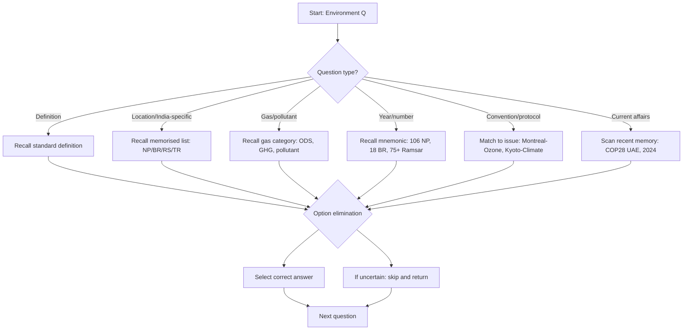

## Concept Ladder

First Principles: Environment = sum of all external conditions (physical, chemical, biotic) affecting an organism. Ecology = study of interactions among organisms and with their environment.  

### Corpus Pressure

The uploaded book-PYQ corpus marks `environment-ecology` as a 200/200 standard General Awareness topic with **68 promoted questions**. The highest pressure block is `pinnacle-ssc-general-studies-p0351-p0375`, which contributes **24 promoted questions**. The second pressure block is `pinnacle-ssc-general-studies-p0376-p0400`, which contributes **12 promoted questions**. The remaining questions are scattered across mixed General Studies pages, so this note must train both static ecology and current-affairs linked conservation recall.

| Corpus Source | Promoted Load | What It Trains |
|----------------|---------------|----------------|
| `pinnacle-ssc-general-studies-p0351-p0375` | 24 promoted questions | Protected areas, biodiversity, national parks, sanctuaries, biosphere reserves, Ramsar sites |
| `pinnacle-ssc-general-studies-p0376-p0400` | 12 promoted questions | Environment conventions, geography-environment overlap, world ecology facts |
| `pinnacle-ssc-general-studies-p0101-p0125` | 4 promoted questions | Static-GK overlap and environment fact pairs |
| `pinnacle-ssc-general-studies-p0426-p0450` | 4 promoted questions | Mixed GA transfer: reports, institutions, and current-linked terms |

For 200/200, treat this as a fact-pair plus trap chapter. Most questions should be solved in 10-12 sec. Spend 20-25 seconds only when a question asks for a protocol-year, protected-area location, or pollution mechanism. The 36-second ceiling is reserved for current-affairs linked items that require elimination.

Level 1: Organism (individual), Population (same species, same area), Community (different populations), Ecosystem (community + abiotic factors), Biome (large regional ecosystem), Biosphere (global sum of all ecosystems).  
Level 2: Energy flow (uni-directional), nutrient cycling (biogeochemical cycles), ecological pyramids (number, biomass, energy). Food chain - grazing (phytoplankton -> zooplankton -> fish) and detritus (dead matter -> decomposer). Food web - interconnected chains. Trophic levels - producers (autotrophs), primary consumers (herbivores), secondary consumers (carnivores), tertiary consumers (top carnivores), decomposers (saprotrophs).  
Level 3: Productivity - gross primary production (GPP), net primary production (NPP = GPP - respiration). Standing crop, biomass. Ecological succession - primary (on bare rock) and secondary (on existing soil).  
Level 4: Biodiversity - genetic, species, ecosystem diversity. Hotspots (34 globally, 4 in India: Western Ghats, Eastern Himalayas, Indo-Burma, Sundaland). Endemism, extinction, IUCN Red List categories.  
Level 5: Conservation - in situ (national parks, wildlife sanctuaries, biosphere reserves, tiger reserves) vs ex situ (zoos, botanical gardens, gene banks). Protected areas network in India: 106 national parks, 567 wildlife sanctuaries (as of 2023 data). Biosphere reserves (18 in India). Ramsar sites (75+ in India).  
Level 6: Pollution - air (particulates, SOx, NOx, CO, ozone), water (physical, chemical, biological - BOD/COD), soil, noise, thermal, radioactive. Biomagnification (DDT, mercury), eutrophication (excess nutrients).  
Level 7: Global environmental issues - greenhouse effect (CO2, CH4, N2O, H2O, CFCs), global warming, climate change, ozone depletion (CFCs, halons -> ODS), acid rain (SO2, NOx).  
Level 8: International conventions - UNFCCC (1992), Kyoto Protocol (1997, binding targets for developed countries), Paris Agreement (2015, nationally determined contributions), Montreal Protocol (1987, ozone protection), CITES (1975, trade in endangered species), CBD (1993, biodiversity), Ramsar (1971, wetlands). India-specific laws: Environment Protection Act 1986, Wildlife Protection Act 1972, Forest Conservation Act 1980, National Green Tribunal (NGT) 2010.  
Exam Integration: SSC CGL asks direct factual recall (e.g., largest biosphere reserve, first national park, gas causing ozone hole), distinction between terms, and current affairs (e.g., COP summits, species added to CITES). Use memory aids and trap-spotting.

## Type System

| Type | Recognition Cue | Method | Speed Target | Trap |
|------|-----------------|--------|--------------|------|
| Definition/Concept | "Which of the following defines ecology?" | Recall exact definition; reject common miswordings | 10 sec | Confusing ecology with environment |
| Location/India-specific | "Which is the largest national park in India?" | Memorise rank table (Hemis, Desert, etc.) | 8 sec | Choosing wrong park or state pair |
| Gas/pollutant property | "Which gas is responsible for ozone depletion?" | Recall ODS list; CFCs are the key | 6 sec | Confusing CO2 with CFC |
| Year/number recall | "How many biosphere reserves are in India?" | Use mnemonic (18 biosphere, 106 NP) | 8 sec | Using outdated number |
| Convention/Protocol aim | "Kyoto Protocol is related to?" | Link: Kyoto -> climate change, Montreal -> ozone | 5 sec | Interchanging Montreal and Kyoto |
| Cause-effect | "Acid rain is caused by?" | Remember SO2 + NOx | 6 sec | Picking CO2 or CH4 |
| Conservation method | "Which is not an in situ conservation?" | In situ: inside natural habitat; ex situ: artificial | 8 sec | Thinking zoo is in situ |
| Pyramid direction | "Which pyramid is always upright?" | Energy pyramid always upright; biomass may be inverted | 7 sec | Assuming all pyramids are upright |
| Biomagnification | "Which pesticide is linked to biomagnification?" | DDT, mercury - persistent organic pollutants | 6 sec | Choosing BHC or malathion |
| Current affairs | "Which country hosted COP28?" | Recall latest COP based on year (COP28 UAE) | 10 sec | Confusing with previous host |

### First 5-Second Classification

Use the first keyword to decide which memory table to open.

| First Cue | Frame to Use | Instant Rule |
|-----------|--------------|--------------|
| "ecosystem", "population", "community" | Ecology hierarchy | Organism -> population -> community -> ecosystem -> biome -> biosphere |
| "food chain", "pyramid", "trophic level" | Energy flow | Energy flow is one-way; energy pyramid is always upright |
| "DDT", "mercury", "top carnivore" | Biomagnification | Persistent pollutants increase at higher trophic levels |
| "eutrophication", "BOD", "COD" | Water pollution | Excess nitrates/phosphates cause eutrophication; BOD tracks biodegradable organic load |
| "acid rain", "SO2", "NOx" | Air pollution mechanism | SO2 and NOx create sulphuric/nitric acids |
| "CFC", "ozone hole", "Montreal" | Ozone frame | CFCs deplete ozone; Montreal Protocol controls ozone-depleting substances |
| "Kyoto", "Paris", "UNFCCC" | Climate convention | Kyoto and Paris are climate agreements under UNFCCC |
| "Ramsar", "wetland" | Wetland conservation | Ramsar is the wetland convention; verify latest site counts via current affairs |
| "National Park", "Sanctuary", "Biosphere Reserve" | In situ conservation | All are in natural habitat; national park is stricter than sanctuary |
| "Zoo", "botanical garden", "seed bank" | Ex situ conservation | Species are protected outside natural habitat |

### Corpus Micro-Type Repair: Environment Days Protocols And Conservation

The corpus label **environment days protocols and conservation** means the question is usually a direct fact-pair, year-pair, or aim-pair. The 200/200 method is to identify whether the stem is asking for a day, a treaty/protocol, a protected-area type, or a pollution effect before reading all options.

| Cue | Instant Bucket | Must-Know Pair | Trap |
|-----|----------------|----------------|------|
| World Environment Day | Environment day | 5 June | Mixing with Earth Day |
| Earth Day | Environment day | 22 April | Confusing with Earth Hour |
| Ozone Day | Environment day | 16 September | Forgetting Montreal Protocol link |
| Montreal Protocol | Protocol | Ozone-depleting substances | Choosing climate change |
| Kyoto Protocol | Protocol | Greenhouse gas reduction targets | Choosing ozone |
| Paris Agreement | Protocol/agreement | Climate action through NDCs | Treating it as legally identical to Kyoto |
| Ramsar Convention | Conservation | Wetlands | Confusing with CITES |
| CITES | Conservation | Trade in endangered species | Confusing with CBD |
| National park/sanctuary/biosphere reserve | Conservation | In situ protection | Calling zoo in situ |

Fast elimination: if the option says Montreal and the stem says ozone/CFC/ODS, mark it. If the stem says wetlands, look for Ramsar. If it says endangered species trade, look for CITES. If it says biodiversity broadly, look for CBD. For state mapping, pair the protected area with the state first, then answer the ecology fact only after the location is locked.

## Speed Methods

Recall tables are your best friend. Use these mental mnemonics:

- **National Parks of India (Top 5 by area):** Hemis (J&K) - Desert (Rajasthan) - Gangotri (Uttarakhand) - Namdapha (Arunachal) - Khangchendzonga (Sikkim). Acronym: H D G N K.
- **Ramsar Sites in India:** use the current-affairs route for the latest count; remember Chilika (Odisha) and Keoladeo (Rajasthan) as high-frequency wetland anchors.
- **Biosphere Reserves (18):** Nilgiri (first) - Nanda Devi - Nokrek - Great Nicobar - Gulf of Mannar - Manas - Sundarbans - Simlipal - Dibru-Saikhowa - Dehang-Debang - Pachmarhi - Khangchendzonga - Agasthyamalai - Achanakmar-Amarkantak - Kutch - Cold Desert - Seshachalam - Panna. Acronym: NNN G M S S D D P K A A K C S P.
- **ODS (Ozone Depleting Substances):** CFCs, halons, carbon tetrachloride, methyl chloroform, methyl bromide, HCFCs, HBFCs. Remember: C-H-M.
- **Greenhouse Gases:** CO2, CH4, N2O, HFCs, PFCs, SF6. Water vapour is natural but not counted in protocols.

**Decision Rules for MCQs:**
- If question asks "which gas causes global warming?" - think CO2 (most abundant anthropogenic). But if "which has highest global warming potential?" - SF6 or HFCs. Distinguish.
- If "which country or state" - locate from options; often trick: Sundarbans national park is in WB and Bangladesh; question may ask India part - answer West Bengal.
- If "national park vs wildlife sanctuary" - national park: specific boundaries, no grazing/human activity (Indian example: Jim Corbett). Sanctuary: limited human activity allowed. Always pick national park as stricter.
- If "ex situ vs in situ" - ex situ is outside natural habitat (zoos, seed banks). In situ: national park, biosphere reserve, sanctuary. Trap: biosphere reserve is in situ.
- If "first national park in India" - Jim Corbett established 1936 as Hailey National Park, later renamed.

**Step-by-step algorithm for identification questions:**
1. Read question and identify cue: location/term/year/gas.
2. Recall the associated mnemonic or fact.
3. Eliminate obviously wrong options (e.g., CO2 for ozone).
4. Choose the correct one; if uncertain, leave and return. The speed target is 10-12 sec for easy fact questions and 15-20 sec for harder protocol/location questions.
5. For current affairs, rely on recent memory; if unsure, guess using elimination.

**36-second attempt plan** (for GA: adapt to 15-minute sprint): Spend first 5 minutes scanning all 50 questions, answer certain ones, mark uncertain. Return to uncertain with remaining time, eliminating based on common sense. Do not spend >20 sec on a single question.

The note is for GA, not Quant, but still adopt a "sprint mentality" for the 200/200 attempt.

## Trap Table

| Trap | Trigger Wording | Wrong Move | Correct Move | Repair Drill |
|------|-----------------|------------|--------------|--------------|
| CO2 vs CFC | "Which gas is responsible for ozone depletion?" | Choosing CO2 because it is a pollutant | Remember ozone depletion specifically due to CFCs (chlorofluorocarbons) | Drill: 10 quick cycles: Ozone? CFC. Global warming? CO2. |
| National park vs Sanctuary | "Which is a protected area where no human activity is allowed?" | Choosing Wildlife Sanctuary | National Park has stricter rules; sanctuary allows limited activity | Write difference 5 times: NP - no human activity; Sanctuary - limited. |
| In situ vs ex situ | "Botanical garden is an example of..." | In situ because plants are kept | Botanical garden is ex situ (outside natural habitat) | Make two columns: in situ (NP, WS, BR, TR) ex situ (zoos, botanical gardens, gene banks). |
| Kyoto vs Montreal | "Which protocol aims to reduce greenhouse gases?" | Montreal (it deals with ozone) | Kyoto is for climate change (GHGs). Montreal for ODS. | Mnemonic: "K for Kyoto, climate; M for Montreal, ozone." |
| Biosphere reserve vs National park | "Which is a larger area that includes multiple ecosystems?" | National park because it sounds larger | Biosphere reserve is larger, includes protected areas and buffer zones. | Compare: Biosphere reserve has core+buffer+transition; NP is core only. |
| Sundarbans state | "Sundarbans National Park is located in?" | Choosing Bangladesh | Indian part is in West Bengal. The question usually implies India unless asked "largest mangrove forest" which includes both. | Always check "in India" qualifier. |
| First National Park | "First National Park in India?" | Assam (Kaziranga) because it is famous | Jim Corbett (Uttarakhand) established 1936. Kaziranga was 1974. | Remember: Corbett is first. |
| Largest National Park | "Which is the largest national park in India?" | Desert National Park (Rajasthan) - it is large, but Hemis (J&K) is largest by area | Hemis National Park (4500 sq km). | Rank order: Hemis > Desert > Gangotri > Namdapha. |
| Ozone hole location | "Where is the ozone hole found?" | Over India | Over Antarctica (polar region). | Drill: ozone hole over Antarctica; ozone depletion global but hole is polar. |
| BOD vs COD | "Which parameter indicates organic pollution in water?" | COD (chemical oxygen demand) | BOD (biological oxygen demand) - measures organic waste decomposed by bacteria. | Remember: B for biological, O for organic. COD includes chemical oxidizable matter. |
| Europhication cause | "Eutrophication is caused by?" | Excess of carbon | Excess of nitrates and phosphates (from fertilizers). | Link: "eat-trophy" -> nutrients. |
| Acid rain effect | "Main gases responsible for acid rain?" | CO2 (weak carbonic acid, but acid rain is from strong acids) | SO2 and NOx from combustion of fossil fuels. | Write: SO2 + H2O -> H2SO4; NOx -> HNO3. |
| Greenhouse vs Ozone | "Which gas does not contribute to global warming?" | Pick a gas only because it is an ozone term | CFCs are both ozone-depleting substances and greenhouse gases; oxygen is the clean non-greenhouse option in standard SSC choices. | Memorise list of GHGs: CO2, CH4, N2O, HFC, PFC, SF6. Ozone and water vapour are also greenhouse gases. |
| COP vs IPCC | "Which body is responsible for climate change assessment?" | COP (conference of parties) - political decision | IPCC (Intergovernmental Panel on Climate Change) provides scientific reports. | COP meets annually; IPCC provides assessment reports. |

## Flowchart

## Solved Examples

**Example 1**  
Which of the following is an example of ex situ conservation?  
(a) National Park  
(b) Wildlife Sanctuary  
(c) Zoological Park  
(d) Biosphere Reserve  
**Answer:** (c) Zoological Park.  
**Explanation:** Ex situ conservation involves preserving species outside their natural habitat. Zoos, botanical gardens, and seed banks are ex situ. National parks, sanctuaries, and biosphere reserves are in situ.

**Example 2**  
The gas primarily responsible for the depletion of the ozone layer is:  
(a) Carbon dioxide  
(b) Methane  
(c) Chlorofluorocarbon  
(d) Sulphur dioxide  
**Answer:** (c) Chlorofluorocarbon.  
**Explanation:** CFCs release chlorine atoms in the stratosphere that catalytically destroy ozone. CO2 and CH4 are greenhouse gases; SO2 causes acid rain.

**Example 3**  
The first National Park established in India was:  
(a) Kaziranga National Park  
(b) Jim Corbett National Park  
(c) Sundarbans National Park  
(d) Kanha National Park  
**Answer:** (b) Jim Corbett National Park.  
**Explanation:** Originally named Hailey National Park in 1936, later renamed after Jim Corbett. Located in Uttarakhand.

**Example 4**  
Montreal Protocol is associated with:  
(a) Climate change  
(b) Ozone layer depletion  
(c) Biodiversity conservation  
(d) Wetlands conservation  
**Answer:** (b) Ozone layer depletion.  
**Explanation:** The Montreal Protocol (1987) aims to phase out ODS like CFCs. Kyoto Protocol is for climate change.

**Example 5**  
Which among the following is a primary greenhouse gas emitted from paddy fields?  
(a) Carbon dioxide  
(b) Methane  
(c) Nitrous oxide  
(d) Sulphur hexafluoride  
**Answer:** (b) Methane.  
**Explanation:** Anaerobic decomposition of organic matter in waterlogged paddy fields releases methane (CH4). CO2 is from burning; N2O from fertilisers.

**Example 6**  
Which Indian state has the largest number of Ramsar sites?  
(a) Uttarakhand  
(b) Tamil Nadu  
(c) West Bengal  
(d) Gujarat  
**Answer:** (b) Tamil Nadu. (As of 2024, Tamil Nadu leads with 16 Ramsar sites.)  
**Explanation:** Recent addition increased count. West Bengal has Sundarbans, but Tamil Nadu added many wetlands.

**Example 7**  
Acid rain is caused by pollution from:  
(a) CO2 and CH4  
(b) SO2 and NOx  
(c) CFCs and halons  
(d) Particulates and lead  
**Answer:** (b) SO2 and NOx.  
**Explanation:** These gases dissolve in atmospheric moisture to form sulphuric and nitric acids. CO2 forms weak carbonic acid but is not the primary cause.

**Example 8**  
The term "biomagnification" refers to:  
(a) Increase in biomass in a trophic level  
(b) Increase in concentration of a substance in tissues of organisms at higher trophic levels  
(c) Magnification of energy flow  
(d) Decrease in biodiversity with altitude  
**Answer:** (b) Increase in concentration of a substance in tissues of organisms at higher trophic levels.  
**Explanation:** Example: DDT accumulates in fish-eating birds.

**Example 9**  
Which of the following is NOT a greenhouse gas?  
(a) Methane  
(b) Nitrous oxide  
(c) Oxygen  
(d) Water vapour  
**Answer:** (c) Oxygen.  
**Explanation:** Oxygen (O2) does not absorb infrared radiation. Water vapour is a natural greenhouse gas, CH4 and N2O are man-made.

**Example 10**  
The Wildlife Protection Act of India was enacted in:  
(a) 1972  
(b) 1980  
(c) 1986  
(d) 2006  
**Answer:** (a) 1972.  
**Explanation:** Wildlife Protection Act (1972) is for protection of wild animals, birds, and plants. Forest Conservation Act 1980; Environment Protection Act 1986.

**Example 11**  
Which of the following is the largest Biosphere Reserve in India?  
(a) Sundarbans  
(b) Gulf of Mannar  
(c) Nilgiri  
(d) Great Rann of Kutch  
**Answer:** (d) Great Rann of Kutch.  
**Explanation:** The Kutch Biosphere Reserve is the largest Indian biosphere reserve by area in standard SSC static-GK tables. Use the current-affairs route only for changing counts, not for this fixed area comparison.

**Example 12**  
"Earth Summit" of 1992 held at Rio de Janeiro led to the adoption of:  
(a) Kyoto Protocol  
(b) Paris Agreement  
(c) Convention on Biological Diversity  
(d) Montreal Protocol  
**Answer:** (c) Convention on Biological Diversity.  
**Explanation:** The Earth Summit (UNCED) produced CBD, UNFCCC, and Agenda 21. Kyoto is 1997; Paris 2015; Montreal 1987.

**Example 13**  
Which ecological pyramid is always upright?  
(a) Pyramid of number  
(b) Pyramid of biomass  
(c) Pyramid of energy  
(d) Pyramid of species  
**Answer:** (c) Pyramid of energy.  
**Explanation:** Energy decreases at each trophic transfer, so the energy pyramid is always upright. Number and biomass pyramids can be inverted in some ecosystems.

**Example 14**  
Eutrophication is mainly caused by excess:  
(a) Oxygen and nitrogen gas  
(b) Nitrates and phosphates  
(c) Carbon monoxide and lead  
(d) CFCs and halons  
**Answer:** (b) Nitrates and phosphates.  
**Explanation:** Nutrient enrichment from fertilizers and sewage causes algal blooms and oxygen depletion.

**Example 15**  
Which of the following is an in situ conservation method?  
(a) Seed bank  
(b) Zoo  
(c) National Park  
(d) Botanical garden  
**Answer:** (c) National Park.  
**Explanation:** In situ conservation protects species inside natural habitat. Zoos, seed banks, and botanical gardens are ex situ.

**Example 16**  
Ramsar Convention is related to:  
(a) Wetlands  
(b) Desertification  
(c) Ozone layer  
(d) Nuclear safety  
**Answer:** (a) Wetlands.  
**Explanation:** Ramsar Convention, signed in 1971, is the international convention for wetlands of importance.

**Example 17**  
Which protocol is associated with reduction of ozone-depleting substances?  
(a) Kyoto Protocol  
(b) Montreal Protocol  
(c) Paris Agreement  
(d) Cartagena Protocol  
**Answer:** (b) Montreal Protocol.  
**Explanation:** Montreal Protocol targets CFCs and other ozone-depleting substances. Kyoto and Paris concern climate change.

**Example 18**  
Which gas is the main methane source in flooded paddy fields?  
(a) CH4  
(b) SO2  
(c) O3  
(d) CO  
**Answer:** (a) CH4.  
**Explanation:** Anaerobic decomposition in waterlogged fields releases methane.

**Example 19**  
Which of the following best describes BOD?  
(a) Oxygen required by microbes to decompose organic matter  
(b) Oxygen present in atmospheric air  
(c) Carbon content in water  
(d) Salt content in soil  
**Answer:** (a) Oxygen required by microbes to decompose organic matter.  
**Explanation:** High BOD indicates high organic pollution in water.

**Example 20**  
CITES mainly regulates:  
(a) Trade in endangered species  
(b) Greenhouse gas emissions  
(c) Wetland listing  
(d) Marine oil pollution  
**Answer:** (a) Trade in endangered species.  
**Explanation:** CITES controls international trade in threatened wild animals and plants.

**Example 21**  
Which of the following is a biodiversity hotspot that includes parts of India?  
(a) Western Ghats  
(b) Sahara Desert  
(c) Antarctica  
(d) Amazon Basin only  
**Answer:** (a) Western Ghats.  
**Explanation:** Indian biodiversity hotspots include the Himalaya, Indo-Burma, Western Ghats-Sri Lanka, and Sundaland/Nicobar region depending on the classification used in exam material.

**Example 22**  
The National Green Tribunal Act was enacted in:  
(a) 1972  
(b) 1980  
(c) 1986  
(d) 2010  
**Answer:** (d) 2010.  
**Explanation:** NGT was established under the National Green Tribunal Act, 2010 for environmental cases.

**Example 23**  
Which of the following causes acid rain?  
(a) SO2 and NOx  
(b) O2 and N2  
(c) CFC and halon only  
(d) Methane and hydrogen  
**Answer:** (a) SO2 and NOx.  
**Explanation:** Sulphur dioxide and nitrogen oxides form sulphuric and nitric acids in the atmosphere.

**Example 24**  
Biomagnification is most strongly associated with:  
(a) DDT accumulation in higher trophic levels  
(b) Faster photosynthesis in plants  
(c) Increase in soil water  
(d) Formation of ozone in stratosphere  
**Answer:** (a) DDT accumulation in higher trophic levels.  
**Explanation:** Persistent pollutants become more concentrated as they move up the food chain.

**Example 25**  
Which agreement is based on Nationally Determined Contributions?  
(a) Paris Agreement  
(b) Ramsar Convention  
(c) Montreal Protocol  
(d) Wildlife Protection Act  
**Answer:** (a) Paris Agreement.  
**Explanation:** The Paris Agreement uses Nationally Determined Contributions for climate action commitments.

## PYQ Mapping

Based on the book-PYQ corpus (**68 promoted questions** in this topic), the distribution indicates heavy focus on:

- **Protected Areas (National Parks, Wildlife Sanctuaries, Biosphere Reserves, Ramsar sites)**: `pinnacle-ssc-general-studies-p0351-p0375` contributes **24 promoted questions**. Practice by drilling state-park pairs and area rankings.
- **Conventions and Protocols (Montreal, Kyoto, Paris, CITES, Ramsar)**: `pinnacle-ssc-general-studies-p0376-p0400` contributes **12 promoted questions**. Learn each convention's aim, year, and key features.
- **Pollution types and causes**: scattered across pages 101-150. Focus on definitions of BOD, COD, eutrophication, biomagnification.
- **Current affairs (especially Ramsar sites and COP summits)**: 4 questions each from later pages. Keep a current affairs list updated for the exam year.

To practice, use the following routes:
- /exams/ssc-cgl/topics/environment-ecology (topic-wise drills)
- /exams/ssc-cgl/topics/geography-india-world (for location-based questions)
- /exams/ssc-cgl/topics/science-everyday (for pollution and basic science)
- /exams/ssc-cgl/tests/ssc-cgl-general-awareness-speed-sprint (full sprint tests under time pressure)

Review each incorrect question from PYQ sets, write the trap, and revise the mnemonic.

## 200/200 Drill

**Timed Micro-Drills** (each drill: 5 questions, 60 seconds total - 12 sec per question)

**Drill 1: National Parks & States**  
1. Bandipur National Park is in which state?  
2. Which state has the most national parks?  
3. Largest national park in India?  
4. Gir National Park is famous for?  
5. Kaziranga is located in?  

**Drill 2: Conventions & Years**  
1. Kyoto Protocol came into force in?  
2. Paris Agreement adopted in?  
3. Montreal Protocol is related to?  
4. Ramsar Convention originally signed in?  
5. CITES stands for?  

**Drill 3: Gases & Pollution**  
1. Main greenhouse gas from cattle?  
2. Which gas contributes most to global warming?  
3. Acid rain precursors?  
4. Ozone depleting substance?  
5. BOD measures?  

**Drill 4: Indian Laws & Institutions**  
1. Forest Conservation Act year?  
2. National Green Tribunal established?  
3. Wildlife Protection Act year?  
4. Environment Protection Act year?  
5. Which ministry oversees environment in India?  

**Repair Rules**  
- If you get a location wrong: write state-park name 3 times.  
- If you confuse protocol year: create a timeline (1987 Montreal, 1992 UNCED, 1997 Kyoto, 2002 Delhi Summit, 2015 Paris).  
- If you mix gas effects: make a table with columns "Gas" and "Effect" and pin it to memory.  
- For every 5 wrong answers, re-read the Concept Ladder from Level 4 upward.  

**Final Strategy**: In the exam, attempt all GA questions; use elimination aggressively. For questions with two close options (e.g., national park vs sanctuary), always pick the stricter (national park) if wording says "no human activity". For protocols, remember the key word: "Kyoto - climate change", "Montreal - ozone". Revise the Trap Table the night before the exam.

**200/200 mindset**: You are aiming for perfection; trust your mnemonics, stay calm, and do not second-guess unless you recall a different fact. Use the 15 minutes wisely: first pass answers you know instantly, second pass eliminate, third pass choose the strongest remaining option.
<!-- SSC-FINAL-PRACTICE-QUEUE:START -->
## Final Practice Queue

1. Start one-by-one practice: [Environment and Ecology practice](/exams/ssc-cgl/practice/environment-ecology). Finish every question in this topic bank, not just the samples in the note.
2. Move to timed sets: [SSC CGL tests](/exams/ssc-cgl/tests?topic=environment-ecology). Use topic drills first, then section mocks once accuracy is stable.
3. Repair every miss immediately: record the error label, redo 20 mixed questions from the same topic, then retest after 24 hours.
4. 200/200 rule: do not mark this topic exam-ready until correct answers come within 36 seconds and wrong answers are explained without looking at the solution.

<!-- SSC-FINAL-PRACTICE-QUEUE:END -->
