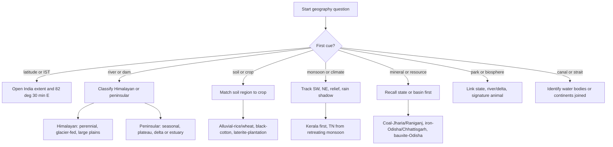

## Concept Ladder

**Step 1 - Earth Basics**  
- Shape: oblate spheroid; axis tilt 23.5 causes seasons.  
- Latitudes: equator (0), Tropic of Cancer (23.5N), Tropic of Capricorn (23.5S), Arctic/Antarctic circles (66.5 N/S).  
- Longitudes: Prime Meridian (0) passes through Greenwich; IST = 82.5E (5:30 ahead of GMT).  
- Heat zones: Torrid (0-23.5 N/S), Temperate (23.5-66.5 N/S), Frigid (66.5-90).  

**Step 2 - Major Physical Features of Earth**  
- Continents: 7 (Asia largest, Australia smallest).  
- Oceans: 5 (Pacific largest, Arctic smallest).  
- Mountain types: Fold (Himalayas), Block (Vosges), Volcanic (Fujiyama), Residual (Aravallis).  
- Plateaus: Intermontane (Tibetan), Lava (Deccan), Continental (Brazilian).  

**Step 3 - India: Location & Physiography**  
- Latitudinal extent: 8 deg 4 min N to 37 deg 6 min N. Longitudinal extent: 68 deg 7 min E to 97 deg 25 min E.  
- Standard Meridian: 82 deg 30 min E, passing near Mirzapur, sets IST at GMT +5:30.  
- Six physical divisions:  
  1. Northern Mountains (Himalayas - 3 parallel ranges: Himadri, Himachal, Shiwaliks).  
  2. Northern Plains (Indus-Ganga-Brahmaputra basin).  
  3. Peninsular Plateau (Deccan Plateau, Western/Eastern Ghats).  
  4. Indian Desert (Thar).  
  5. Coastal Plains (Western - narrow; Eastern - wide with deltas).  
  6. Islands (Andaman & Nicobar, Lakshadweep).  

**Step 4 - Indian River Systems**  
- Himalayan rivers: perennial, fed by glaciers. Indus (Sutlej, Beas, Ravi, Chenab, Jhelum - 5 rivers of Punjab). Ganga (Yamuna, Ghaghara, Gandak, Kosi - major tributaries). Brahmaputra (Dibang, Lohit).  
- Peninsular rivers: seasonal, rain-fed. East-flowing (Mahanadi, Godavari, Krishna, Kaveri - form deltas). West-flowing (Narmada, Tapti - estuaries).  

**Step 5 - Climate & Monsoon**  
- India: tropical monsoon. Southwest monsoon (June-Sept) brings 75% rainfall. Northeast monsoon (Oct-Dec) affects Tamil Nadu.  
- Factors: ITCZ shift, El Nino/La Nina, jet streams.  

**Step 6 - Soils, Agriculture & Resources**  
- Soil types: Alluvial (northern plains, most fertile), Black (Deccan trap, cotton), Red (peninsular), Laterite (tropical weathering).  
- Crops: Rice (high rainfall), Wheat (cool winter), Millets (dry).  
- Minerals: Coal (Jharia, Raniganj), Iron (Odisha), Bauxite (Jharkhand), Petroleum (Mumbai High).  
- Power: Thermal (majority), Hydro (Bhakra, Hirakud), Nuclear (Tarapur).  

**Step 7 - World Geography Integration**  
- Deserts: Sahara (Africa), Arabian (Asia).  
- Straits: Gibraltar (Europe-Africa), Malacca (Indonesia-Malaysia).  
- Canals: Suez, Panama.  
- Important latitudes: 23.5N passes through India, Mexico, Egypt.  

**Step 8 - Exam-level Synthesis**  
- Map-based memory: state capitals, neighbouring countries (7 borders), neighbouring states.  
- Environmental features: National Parks (Kaziranga, Kanha), Biosphere Reserves, Wildlife Sanctuaries.  
- Everyday observations: Time zone difference, latitude effects, monsoon prediction.  
- In the 15-minute General Awareness section, keep geography under a 45-second ceiling; direct recall should normally finish inside 5-12 seconds.  

### Corpus Pressure

The uploaded book-PYQ corpus promotes `geography-india-world` as a high-return General Awareness topic with 358 promoted questions. It is not just "map reading"; the repeated SSC pattern mixes India physical geography, rivers, monsoon, soils, minerals, agriculture, national parks, and world geography in short factual stems.

| Corpus bucket | Promoted questions | What it usually tests | 45-second implication |
|---|---:|---|---|
| `pinnacle-ssc-general-studies-p0326-p0350` | 127 promoted questions | Indian physical divisions, rivers, dams, lakes, soils, agriculture, minerals | Build one-page map clusters; no long reasoning during the exam |
| `pinnacle-ssc-general-studies-p0301-p0325` | 56 promoted questions | India location, latitude/longitude, climate, monsoon, natural vegetation | Open the coordinates/monsoon memory block first |
| `pinnacle-ssc-general-studies-p0351-p0375` | 52 promoted questions | National parks, biosphere reserves, wildlife, environmental geography | State-to-park recall should be automatic |
| `pinnacle-ssc-general-studies-p0376-p0400` | 47 promoted questions | World deserts, canals, straits, oceans, continents, mountains | Separate India map facts from world superlatives |
| Mixed older buckets | 76 promoted questions | Static GK overlap: states, resources, cultural geography, border facts | Use elimination only after the location cluster is clear |

### First 5-Second Classification

| First cue in question | Bucket | First memory to open |
|---|---|---|
| "Latitude", "longitude", "standard meridian", "IST" | Location and Time | India extent, 82 deg 30 min E, GMT conversion |
| "Himalayan", "peninsular", "delta", "estuary" | River and Drainage | Perennial vs seasonal, east-flowing vs west-flowing |
| "Southwest", "retreating", "Tamil Nadu", "El Nino" | Climate and Monsoon | SW monsoon June-Sept, NE monsoon Oct-Dec, rainfall direction |
| "Alluvial", "black", "red", "laterite" | Soil-Crop | Soil origin, region, crop, leaching/moisture trap |
| "Coal", "iron", "bauxite", "petroleum" | Mineral and Resource | State or basin first, then mine/field if asked |
| "National park", "biosphere", "sanctuary" | Park-Wildlife | State, signature animal, river/delta if relevant |
| "Canal", "strait", "desert", "ocean" | World Geography | Continent pair, water bodies connected, largest/hottest wording |

---

## Type System

| Type | Recognition Cue | Method | Speed Target | Trap |
|------|----------------|--------|--------------|------|
| Location/Feature matching | "Which river crosses Tropic of Cancer twice?" | Recall river courses; draw mental map | 10 sec | Confuse with other rivers |
| State-capital/park | "Capital of Mizoram" | Memorize all 28+8 states | 5 sec | Old/New capitals (Bombay->Mumbai) |
| Pass-dam-port name | "Khyber Pass connects?" | Acronym or mnemonic; map linking | 15 sec | Wrong country/state association |
| Climate type identification | "Given temp/rainfall: which place?" | Match to India climate types (Am, Aw, Bsh) | 20 sec | Ignore altitude factor |
| Soil-crop association | "Black soil best for?" | Recall cotton; link to Deccan | 5 sec | Alluvial for cotton |
| Mineral location | "Largest producer of bauxite?" | State-wise memorization | 10 sec | Mix with iron ore states |
| World geography | "Which country lies on both sides of Panama Canal?" | Map elimination; continent knowledge | 15 sec | Name confusion (Panama vs. Ethiopia) |
| Direction/drainage | "Which river flows west?" | List west-flowing peninsular rivers | 10 sec | Think all flow east |
| Cause-effect | "Why is Kerala first to get monsoon?" | ITCZ progression; SW monsoon path | 20 sec | Confuse with Himalayas |
| Environmental feature | "Largest mangrove forest in India?" | Sundarbans; West Bengal | 8 sec | Say Andaman |
| Latitude/longitude | "Which line passes through India?" | Tropic of Cancer | 3 sec | Equator |
| Time calculation | "IST to GMT difference?" | 5:30 hours ahead | 5 sec | 4:30 or 6:30 |

---

## Speed Methods

**Recall Tables**  
- **Himalayan Ranges**:  
  `Himadri` (Great Himalaya) - highest, average 6000m, always snow.  
  `Himachal` (Lesser) - between 3700-4500m, famous hill stations.  
  `Shiwaliks` (Outer) - 900-1200m, foothills.  

- **Peninsular Rivers East-flowing**: `Mahanadi - Godavari - Krishna - Kaveri` (Mnemonic: M-G-K-K).  
- **West-flowing**: `Narmada - Tapti` (Mnemonic: N-T).  

- **Major Dams & States**:  
  `Bhakra` - Sutlej (HP/Punjab), `Hirakud` - Mahanadi (Odisha), `Nagarjunasagar` - Krishna (AP/Telangana).  

**Decision Rules**  
1. If question asks "largest/tallest/highest" in India, always check for Himalayas first (e.g., Kanchenjunga, 8586m).  
2. If two rivers mentioned and tributary confusion - recall from origin: Yamuna from Yamunotri, Ganga from Gangotri.  
3. When comparing world features: Sahara (largest hot desert), Antarctica (largest cold desert), Amazon (largest river by volume).  

**Step-by-Step Algorithm for Climate Type**  
1. Note the location's latitude.  
2. If latitude > 30N/S, temperate or cold.  
3. If within 10 of equator, equatorial (Af).  
4. If monsoon region (Indian subcontinent), check rainfall >200cm? If yes, Am (monsoon with dry winter).  
5. If rainfall 100-200cm, Aw (tropical wet & dry).  

**Advanced Trick for Map Elimination**  
- For "Which continental boundary is formed by the Urals?" -> Asia-Europe.  
- For "Which ocean lies to the west of India?" -> Arabian Sea.  
- For "Which Indian state has the longest coastal line?" -> Gujarat.  

---

## Trap Table

| Trap | Trigger Wording | Wrong Move | Correct Move | Repair Drill |
|------|----------------|------------|--------------|--------------|
| Confuse Ganga-Brahmaputra tributaries | "River entering India from Tibet" | Answer Brahmaputra wrongly as originating in India | Brahmaputra originates in Tibet (Angsi Glacier); correct tributary: Yarlung Tsangpo | Practice river origin table |
| Mistake state capitals | "Capital of Uttarakhand" | Write Dehradun correctly but confuse with Shimla for HP | Dehradun is winter capital; Gairsain is summer capital | Memorize pair capitals |
| Wrong direction of mountain ranges | "Aravalli range runs from NE to SW" | Think NW-SE | Correct orientation: NE-SW from Gujarat toward Delhi | Draw India outline and mark ranges |
| Overlook Tropic of Cancer | "Which river crosses Tropic of Cancer twice?" | Think Ganga | Mahi River (Rajasthan) | Mark tropical lines on map |
| Confuse soil-crop mismatch | "Which soil is best for cotton?" | Answer alluvial (common misassociation) | Black soil (regur) of Deccan | List soil - crop pairs |
| Ignore world clock time | "When it's 12:00 noon IST, what is GMT?" | Answer 5:30 AM (wrong direction) | IST = GMT +5:30, so GMT = 6:30 AM | Practice time difference problems |
| Mistake strait vs. isthmus | "Suez Canal connects?" | Say Mediterranean to Black Sea | Mediterranean to Red Sea | Learn major canals |
| Wrong west-flowing river | "Which river flows into Arabian Sea?" | Answer Kaveri, which is east-flowing | Narmada or Tapti | Memorize west-flowing list |
| Capital of island territory | "Capital of Andaman & Nicobar?" | Answer Port Blair correctly but write 'Port Stanley' | Port Blair | Drill Union Territory capitals |
| Mineral location mix | "Largest iron ore mine in India?" | Answer Bailadila (correct) but write Keonjhar (also correct but not largest) | Specify Bailadila (Chhattisgarh) | Mine-state matching table |
| Climate type misclassification | "Mumbai climate type?" | Say tropical monsoon (Am) but write 'Aw' | Mumbai is Am (monsoon with short dry season) | Use Koppen classification |
| State boundary confusion | "Which state does not share border with Pakistan?" | Answer Punjab | Jammu & Kashmir shares border; correct answer could be Rajasthan (shares) - be careful | List of border states |
| Old/new name trap | "Largest freshwater lake in India?" | Switch to Chilika because it is famous | Wular is the freshwater answer; Chilika is largest brackish | Distinguish fresh vs. salt water |
| Desert facts | "Which desert lies in Rajasthan?" | Say Thar but say 'Sahara' in confusion | Thar (Great Indian Desert) | Recall desert locations globally |

---

## Flowchart

---

## Solved Examples

**Example 1**  
Q. Which Indian river is known as the 'Ganga of the South'?  
A) Godavari  
B) Krishna  
C) Kaveri  
D) Mahanadi  
Answer: C) Kaveri  
Explanation: Kaveri is referred to as the 'Ganga of the South' due to its perennial flow and religious significance.

**Example 2**  
Q. The Tropic of Cancer passes through how many Indian states?  
A) 6  
B) 7  
C) 8  
D) 9  
Answer: C) 8 (Gujarat, Rajasthan, MP, Chhattisgarh, Jharkhand, WB, Tripura, Mizoram)  
Explanation: Count carefully; it passes through 8 states (Mizoram included).

**Example 3**  
Q. Which of the following is a west-flowing river in India?  
A) Godavari  
B) Krishna  
C) Narmada  
D) Kaveri  
Answer: C) Narmada  
Explanation: Narmada and Tapti flow west into the Arabian Sea; all others flow east into Bay of Bengal.

**Example 4**  
Q. The highest peak in India is:  
A) Mount Everest  
B) K2  
C) Kanchenjunga  
D) Nanda Devi  
Answer: C) Kanchenjunga (8586 m)  
Explanation: Kanchenjunga is the highest peak located in Sikkim; K2 is in Pakistan-occupied Kashmir.

**Example 5**  
Q. The soil suitable for cotton cultivation is:  
A) Alluvial  
B) Black  
C) Red  
D) Laterite  
Answer: B) Black  
Explanation: Black soil (regur) is rich in minerals like calcium carbonate and retains moisture, ideal for cotton.

**Example 6**  
Q. Which strait separates India from Sri Lanka?  
A) Palk Strait  
B) Malacca Strait  
C) Gibraltar Strait  
D) Bosphorus Strait  
Answer: A) Palk Strait  
Explanation: Palk Strait lies between India's Tamil Nadu and Sri Lanka's Jaffna Peninsula.

**Example 7**  
Q. The largest freshwater lake in India is:  
A) Chilika Lake  
B) Wular Lake  
C) Loktak Lake  
D) Dal Lake  
Answer: B) Wular Lake (Jammu & Kashmir)  
Explanation: Wular is the largest freshwater lake; Chilika is the largest brackish water lake.

**Example 8**  
Q. Which of the following is a characteristic of the Indian monsoon?  
A) Uniform rainfall across the country  
B) Retreating monsoon causes rain in Tamil Nadu  
C) It is caused by the high pressure over India  
D) South-west monsoon originates from the Himalayas  
Answer: B) Retreating monsoon (Northeast monsoon) brings rain to Tamil Nadu coast.  
Explanation: SW monsoon brings major rain; TN gets rain from NE monsoon.

**Example 9**  
Q. The longest river in India is:  
A) Ganga  
B) Brahmaputra  
C) Indus  
D) Godavari  
Answer: A) Ganga (2525 km)  
Explanation: Ganga is the longest river; Brahmaputra is longer but only a part lies in India.

**Example 10**  
Q. Which state is the largest producer of bauxite in India?  
A) Odisha  
B) Jharkhand  
C) Gujarat  
D) Maharashtra  
Answer: A) Odisha (Koraput district).  
Explanation: Odisha has the largest bauxite reserves; Jharkhand is top for coal.

**Example 11**  
Q. The Tropic of Capricorn passes through which continent?  
A) Asia  
B) Africa  
C) South America  
D) Both B and C  
Answer: D) Both Africa and South America  
Explanation: Tropic of Capricorn passes through Namibia, Botswana, South Africa, etc. in Africa and Chile, Argentina, Paraguay in South America.

**Example 12**  
Q. The Chilika Lake is located in which state?  
A) Andhra Pradesh  
B) Odisha  
C) Tamil Nadu  
D) Karnataka  
Answer: B) Odisha  
Explanation: Chilika is a brackish water lagoon in Odisha, famous for migratory birds.

**Example 13**  
Q. The Standard Meridian of India is:  
A) 68 deg 7 min E  
B) 82 deg 30 min E  
C) 97 deg 25 min E  
D) 23 deg 30 min N  
Answer: B) 82 deg 30 min E  
Explanation: IST is based on 82 deg 30 min E, which is 5 hours 30 minutes ahead of GMT.

**Example 14**  
Q. If it is 12:00 noon in India, what is the corresponding GMT time?  
A) 5:30 AM  
B) 6:30 AM  
C) 5:30 PM  
D) 6:30 PM  
Answer: B) 6:30 AM  
Explanation: IST = GMT +5:30, so subtract 5 hours 30 minutes from Indian time.

**Example 15**  
Q. Hirakud Dam is built on which river?  
A) Mahanadi  
B) Krishna  
C) Sutlej  
D) Damodar  
Answer: A) Mahanadi  
Explanation: Hirakud Dam is in Odisha on the Mahanadi; keep it separate from Bhakra-Nangal on Sutlej.

**Example 16**  
Q. Bhakra-Nangal Dam is associated with which river?  
A) Beas  
B) Sutlej  
C) Ravi  
D) Chenab  
Answer: B) Sutlej  
Explanation: Bhakra-Nangal is the high-frequency dam-river pair for Sutlej.

**Example 17**  
Q. Which is the largest hot desert in the world?  
A) Gobi  
B) Sahara  
C) Kalahari  
D) Thar  
Answer: B) Sahara  
Explanation: Sahara is the largest hot desert; Antarctica is the largest desert overall.

**Example 18**  
Q. The Suez Canal connects the Mediterranean Sea with the:  
A) Black Sea  
B) Red Sea  
C) Caspian Sea  
D) Arabian Sea  
Answer: B) Red Sea  
Explanation: Suez links the Mediterranean Sea and Red Sea, reducing the Europe-Asia sea route.

**Example 19**  
Q. The Strait of Malacca lies between the Malay Peninsula and:  
A) Sumatra  
B) Sri Lanka  
C) Madagascar  
D) Greenland  
Answer: A) Sumatra  
Explanation: Malacca is the key sea route between the Indian Ocean side and the South China Sea side.

**Example 20**  
Q. Alluvial soil is most extensively found in India in the:  
A) Deccan Plateau  
B) Northern Plains  
C) Western Ghats  
D) Thar Desert  
Answer: B) Northern Plains  
Explanation: Alluvial soil is deposited by rivers and is dominant in the Indo-Gangetic-Brahmaputra plains.

**Example 21**  
Q. Laterite soil is mainly formed due to:  
A) Wind deposition in deserts  
B) Volcanic lava weathering only  
C) Intense leaching under high temperature and rainfall  
D) Glacier deposition  
Answer: C) Intense leaching under high temperature and rainfall  
Explanation: Laterite is common in high rainfall tropical regions where soluble material is washed away.

**Example 22**  
Q. Kaziranga National Park is famous for the:  
A) Asiatic lion  
B) One-horned rhinoceros  
C) Hangul  
D) Snow leopard  
Answer: B) One-horned rhinoceros  
Explanation: Kaziranga is in Assam and is repeatedly asked with one-horned rhinoceros.

**Example 23**  
Q. Sundarbans is best known for which type of natural vegetation?  
A) Alpine forest  
B) Mangrove forest  
C) Thorn forest  
D) Temperate coniferous forest  
Answer: B) Mangrove forest  
Explanation: Sundarbans is a mangrove delta region associated with West Bengal and the Bengal tiger.

**Example 24**  
Q. Which Indian river crosses the Tropic of Cancer twice?  
A) Mahi  
B) Narmada  
C) Tapi  
D) Godavari  
Answer: A) Mahi  
Explanation: Mahi is a classic SSC map fact; do not confuse it with Narmada or Tapi.

**Example 25**  
Q. Which Indian state has the longest coastline?  
A) Tamil Nadu  
B) Andhra Pradesh  
C) Gujarat  
D) Maharashtra  
Answer: C) Gujarat  
Explanation: Gujarat has the longest coastline among Indian states and faces the Arabian Sea.

---

## PYQ Mapping

| Topic | Past Frequency | Practice Route |
|-------|----------------|----------------|
| Indian rivers & tributaries | Very High | /exams/ssc-cgl/topics/geography-india-world |
| Climate & monsoon | High | /exams/ssc-cgl/topics/environment-ecology |
| Soil types & agriculture | Medium | /exams/ssc-cgl/topics/geography-india-world |
| Minerals & industries | Medium-High | /exams/ssc-cgl/topics/geography-india-world |
| World features (latitudes, oceans) | Medium | /exams/ssc-cgl/topics/geography-india-world |
| National Parks & Environment | Low-Medium | /exams/ssc-cgl/topics/environment-ecology |
| State capitals & boundaries | High (easy marks) | /exams/ssc-cgl/topics/geography-india-world |
| Passes, dams, ports | Low-Medium | /exams/ssc-cgl/topics/geography-india-world |
| Time zones & GMT | Occasional | /exams/ssc-cgl/tests/ssc-cgl-general-awareness-speed-sprint |

**Practice Routes**:  
- For map-based elimination mastery: complete the topic geography-india-world.  
- For environment & climate links: use environment-ecology.  
- For speed sprint across all GA sections: take the test at general-awareness-speed-sprint.

---

## 200/200 Drill

**Timed Micro-Drills (90 seconds each)**  
1. **States & Capitals**: Write capitals of all North-Eastern states.  
2. **River Origins**: List 5 Himalayan rivers and their glacial origins.  
3. **Soil-Crop**: Match 4 soil types with one crop each.  
4. **World Features**: Identify 3 largest deserts, 3 longest rivers.  
5. **Latitude Memorizer**: Write 5 countries each on Tropic of Cancer and Tropic of Capricorn.

**Repair Rules**  
- If you confuse a tributary- origin, use a mnemonic: `Ganga has Yamuna` (both names start with G and Y similar sound).  
- If you mix up west/east flowing rivers, remember: "Narmada Nahin Tapti" - both start with N/T and flow West.  
- If you forget state borders with Pakistan, write the acronym `GPJ` (Gujarat, Punjab, Jammu & Kashmir, Rajasthan).  
- For time calculations: Always subtract 5:30 from IST to get GMT.  
- For desert locations: Thar - India, Sahara - Africa, Gobi - Asia.

**Final Drill**  
Set a timer for 10 minutes. Attempt 20 questions from /exams/ssc-cgl/topics/geography-india-world (max speed, no pauses). After completion, note wrong ones and categorize: map error, memory slip, or elimination mistake. Apply repair rule for each error type. Repeat until 100% accuracy.

---
<!-- SSC-FINAL-PRACTICE-QUEUE:START -->
## Final Practice Queue

1. Start one-by-one practice: [Geography of India and World practice](/exams/ssc-cgl/practice/geography-india-world). Finish every question in this topic bank, not just the samples in the note.
2. Move to timed sets: [SSC CGL tests](/exams/ssc-cgl/tests?topic=geography-india-world). Use topic drills first, then section mocks once accuracy is stable.
3. Repair every miss immediately: record the error label, redo 20 mixed questions from the same topic, then retest after 24 hours.
4. 200/200 rule: do not mark this topic exam-ready until correct answers come within 36 seconds and wrong answers are explained without looking at the solution.

<!-- SSC-FINAL-PRACTICE-QUEUE:END -->
