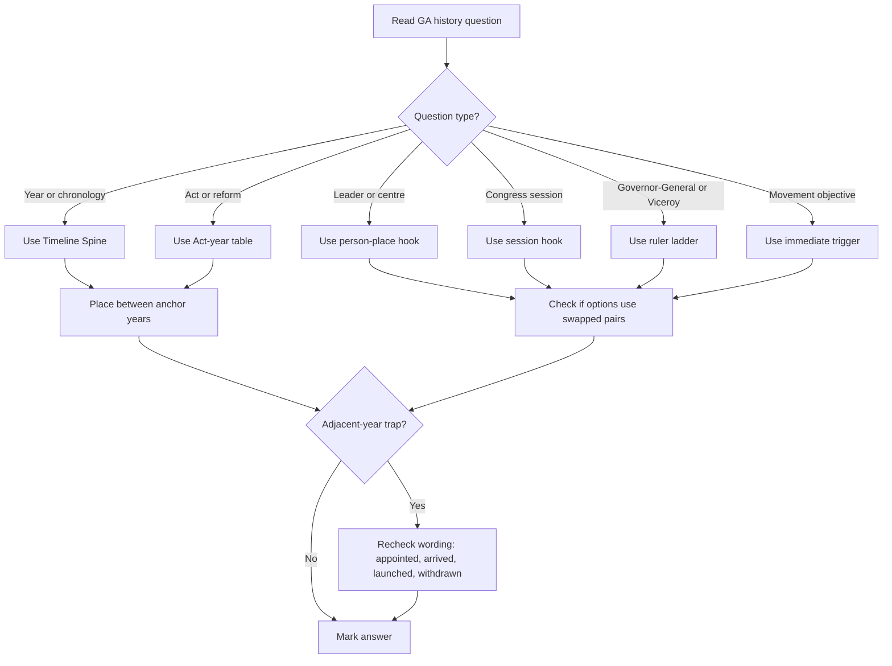

## Corpus Pressure

The promoted SSC book corpus currently gives this topic **683 promoted questions**. That makes history and the freedom movement a dominant General Awareness repeat area. The highest visible cluster is `pinnacle-ssc-general-studies-p0226-p0250`, which contributes **84 promoted questions**. The next cluster is `pinnacle-ssc-general-studies-p0476-p0500`, which contributes **58 promoted questions**. Other high-pressure clusters include `pinnacle-ssc-general-studies-p0426-p0450` with **45 promoted questions**, `pinnacle-ssc-general-studies-p0501-p0525` with **43 promoted questions**, and `pinnacle-ssc-general-studies-p0526-p0550` with **43 promoted questions**.

For 200/200, this topic must be studied as a recall machine. SSC asks years, act-year pairs, revolt centre-leader pairs, Congress session facts, governor-general and viceroy associations, movement-objective matching, books/authors, and dynasty-culture matches. The answer is usually one fact away, but the options are designed around adjacent years and similar names.

## Concept Ladder

**First principles: history is ordered memory**  
History in SSC is not an essay subject. It is a set of ordered facts. The safest order is: period -> ruler/event -> year -> person -> consequence. If any one layer is missing, options become confusing.

**Level 1 - First 5-Second Classification**  
Classify every question before recalling:
- Timeline: asks "when", "first", "sequence", "chronological order".
- Person-event: asks leader, founder, author, governor-general, viceroy.
- Place-event: asks revolt centre, site, monument, port, session venue.
- Act-year: asks reform, provision, council, dyarchy, separate electorate.
- Movement-objective: asks why a movement began or ended.
- Culture crossover: asks text, school of art, monument, dynasty.

**Level 2 - Timeline Spine**  
Use one fixed spine:
IVC -> Vedic -> Mahajanapadas -> Mauryan -> Gupta -> Harsha -> Sultanate -> Vijayanagara -> Mughal -> Maratha/regional states -> Company rule -> 1857 -> Congress -> Gandhian phase -> final transfer of power.

**Level 3 - Ancient Anchor Bank**  
- Indus Valley Civilization: Harappa, Mohenjo-daro, Dholavira, Lothal; urban planning, seals, drainage, dockyard at Lothal.
- Vedic period: Rigveda earliest; sabha and samiti; later Vedic period moves toward janapadas and ritual expansion.
- Buddhism: Gautama Buddha, Four Noble Truths, Eightfold Path, first sermon at Sarnath.
- Jainism: Mahavira, 24th Tirthankara, triratna, ahimsa.
- Maurya: Chandragupta, Chanakya, Ashoka, Kalinga war, edicts, Dhamma.
- Gupta: Samudragupta, Chandragupta II, Kalidasa, Aryabhata, Ajanta, classical Sanskrit culture.
- Sangam: Tamil literature, Chera-Chola-Pandya, Silappadikaram, Manimekalai, Tolkappiyam.

**Level 4 - Medieval Anchor Bank**  
- Delhi Sultanate starts in 1206; Slave, Khilji, Tughlaq, Sayyid, Lodi.
- Aibak started Qutb Minar; Iltutmish completed major work; Alauddin Khilji is tied to market reforms and Alai Darwaza.
- Vijayanagara was founded in 1336; Krishnadevaraya is the high-yield ruler; Talikota is 1565.
- Mughal anchor: Babur 1526, Akbar administration, Shah Jahan monuments, Aurangzeb expansion and later decline.
- Maratha anchor: Shivaji, Peshwas, Third Battle of Panipat 1761.

**Level 5 - Company Rule Ladder**  
1498 Vasco da Gama -> 1600 East India Company -> 1757 Plassey -> 1764 Buxar -> 1773 Regulating Act -> 1793 Permanent Settlement -> 1798-1805 Wellesley and Subsidiary Alliance -> 1848-56 Dalhousie and Doctrine of Lapse -> 1857 Revolt -> 1858 Crown rule.

**Level 6 - Freedom Movement Ladder**  
1885 INC -> 1905 Bengal Partition -> 1907 Surat Split -> 1916 Lucknow Pact -> 1917 Champaran -> 1919 Rowlatt and Jallianwala -> 1920 Non-Cooperation -> 1922 Chauri Chaura withdrawal -> 1927/1928 Simon Commission -> 1929 Purna Swaraj -> 1930 Dandi March -> 1931 Gandhi-Irwin Pact -> 1932 Communal Award and Poona Pact -> 1935 GOI Act -> 1942 Quit India -> 1946 Cabinet Mission -> 1947 Independence.

**Level 7 - Governor-General and Viceroy Ladder**  
Clive = Plassey and Bengal base. Hastings = Regulating Act era. Cornwallis = Permanent Settlement. Wellesley = Subsidiary Alliance. Bentinck = Sati abolition. Dalhousie = Doctrine of Lapse, railways, telegraph. Canning = Revolt and first Viceroy after 1858. Curzon = Bengal Partition. Chelmsford = 1919 reforms and Jallianwala period. Irwin = Dandi and Gandhi-Irwin Pact. Linlithgow = Quit India. Wavell = Simla Conference and Cabinet Mission period. Mountbatten = Partition plan and Independence.

## Type System

| Type | Recognition cue | First lock | Method | Main trap |
|---|---|---|---|---|
| Timeline year | "When", "year", "chronology" | Timeline Spine | Place event between two anchors | Adjacent year confusion |
| Act-year | Regulating, Charter, Councils, GOI, Rowlatt | Act-year pair | Recall year plus provision | Same-year acts |
| Person-event | "Who was associated with" | Person hook | Link person to unique event | Multiple people in same movement |
| Revolt centre-leader | Delhi, Kanpur, Lucknow, Jhansi | Revolt centre | Use centre-leader table | Kanpur/Lucknow swaps |
| Congress session | venue/year/president | Session hook | Recall year, venue, outcome | Venue and president mismatch |
| Governor-General/Viceroy | "during", "introduced" | Ruler ladder | Map person to policy/event | Title confusion before/after 1858 |
| Movement-objective | "main objective", "why launched" | Objective hook | Identify immediate trigger | General nationalism answer |
| Book-author | "who wrote" | Pair hook | Memorize fixed pairs | Confusing same-era authors |
| Art/architecture | monument, school, dynasty | Style hook | Match style to ruler/dynasty | Builder vs completer |
| Ancient religion | Buddha/Jain/Tirthankara | Founder hook | Separate Buddha, Mahavira, Rishabha | Founder vs last Tirthankara |
| Mission/plan | Cripps, Wavell, Cabinet, Mountbatten | Final phase hook | Place in 1942/45/46/47 order | Wavell vs Cabinet Mission |
| Dynasty sequence | Sultanate, Mughal, Gupta | Period hook | Order dynasties first | Similar medieval names |

## Speed Methods

**Timeline Spine**

| Anchor | Year/period | Memory use |
|---|---:|---|
| IVC mature phase | c. 2600-1900 BCE | Urban, seals, Lothal dockyard |
| Later Vedic/Mahajanapadas | c. 1000-600 BCE | Janapadas, rituals, Magadha rise |
| Maurya | 322-185 BCE | Chandragupta, Ashoka, edicts |
| Gupta | c. 320-550 CE | Classical Sanskrit, science, art |
| Delhi Sultanate | 1206-1526 | Sultanate dynasties |
| Mughal start | 1526 | First Battle of Panipat |
| Plassey | 1757 | British political base in Bengal |
| Revolt | 1857 | Company rule crisis |
| INC | 1885 | Organized nationalism |
| Bengal Partition | 1905 | Swadeshi trigger |
| Jallianwala | 1919 | Mass anger and Non-Cooperation background |
| Dandi | 1930 | Civil Disobedience |
| Quit India | 1942 | Final mass movement |
| Cabinet Mission | 1946 | Constitutional transfer path |
| Independence | 1947 | Partition and freedom |

**Act-year table**

| Act/event | Year | SSC hook |
|---|---:|---|
| Regulating Act | 1773 | First parliamentary control over EIC |
| Pitt's India Act | 1784 | Board of Control, dual control |
| Permanent Settlement | 1793 | Cornwallis, zamindari |
| Charter Act | 1813 | End of EIC trade monopoly except tea/China |
| Charter Act | 1833 | Governor-General of India, legislative centralization |
| Charter Act | 1853 | Open competition idea for civil services |
| Government of India Act | 1858 | Crown rule, Secretary of State |
| Indian Councils Act | 1861 | Legislative councils restored/expanded |
| Indian Councils Act | 1892 | More discussion rights |
| Morley-Minto Reforms | 1909 | Separate electorates |
| Montagu-Chelmsford Reforms | 1919 | Dyarchy in provinces |
| Rowlatt Act | 1919 | Detention without trial |
| Government of India Act | 1935 | Provincial autonomy, federation scheme |
| Indian Independence Act | 1947 | Two dominions |

**Governor-General and Viceroy Ladder**

| Name | High-yield association |
|---|---|
| Robert Clive | Plassey, Bengal foundation |
| Warren Hastings | Regulating Act era, early British administration |
| Cornwallis | Permanent Settlement, civil service reform |
| Wellesley | Subsidiary Alliance |
| William Bentinck | Sati abolition, English education period |
| Dalhousie | Doctrine of Lapse, railways, telegraph, Awadh annexation |
| Canning | Revolt of 1857, first Viceroy after Crown rule |
| Lytton | Vernacular Press Act, Delhi Durbar 1877 |
| Ripon | Local self-government, Ilbert Bill |
| Curzon | Partition of Bengal, universities/monuments policy |
| Chelmsford | 1919 reforms, Rowlatt/Jallianwala period |
| Irwin | Dandi March, Gandhi-Irwin Pact |
| Willingdon | Communal Award, Poona Pact period |
| Linlithgow | Cripps Mission, Quit India |
| Wavell | Simla Conference, INA trials, Cabinet Mission period |
| Mountbatten | June 3 Plan, Independence |

**Revolt centre table**

| Centre | Leader |
|---|---|
| Delhi | Bahadur Shah Zafar |
| Kanpur | Nana Saheb |
| Lucknow | Begum Hazrat Mahal |
| Jhansi | Rani Lakshmibai |
| Bareilly | Khan Bahadur Khan |
| Jagdishpur | Kunwar Singh |
| Faizabad | Maulvi Ahmadullah Shah |
| Barrackpore | Mangal Pandey incident before full revolt |
| Meerut | Starting point of mass revolt |

**Congress session hooks**

| Year | Venue | Hook |
|---:|---|---|
| 1885 | Bombay | First session, W.C. Bonnerjee |
| 1906 | Calcutta | Swaraj goal under Dadabhai Naoroji |
| 1907 | Surat | Moderate-extremist split |
| 1916 | Lucknow | Congress-League Pact |
| 1917 | Calcutta | Annie Besant as first woman president |
| 1920 | Nagpur | Non-Cooperation programme reorganization |
| 1924 | Belgaum | Gandhi's only Congress presidency |
| 1929 | Lahore | Purna Swaraj |
| 1931 | Karachi | Fundamental Rights resolution |
| 1938 | Haripura | Subhas Bose, planning emphasis |
| 1939 | Tripuri | Bose re-elected, crisis |
| 1942 | Bombay | Quit India resolution by AICC |

## Trap Table

| Trap | Trigger wording | Wrong move | Correct move | Repair drill |
|---|---|---|---|---|
| 1857 vs 1858 | Revolt/Crown rule | Mark 1858 for revolt | 1857 revolt, 1858 Crown rule | Write pair 20 times |
| 1905 vs 1906 | Bengal Partition/Swaraj goal | Mix Curzon and Congress session | 1905 Partition, 1906 Swaraj at Calcutta | Two-card drill |
| 1919 double trap | Rowlatt/Jallianwala/GOI Act | Treat all as same provision | Separate act, massacre, reforms | Build 1919 mini-table |
| Simon 1927/1928 | appointed vs arrived | Mark 1927 for arrival | 1927 appointed, 1928 arrived | Write wording cue |
| Kanpur/Lucknow | Revolt centre | Nana Saheb at Lucknow | Nana Saheb Kanpur, Begum Lucknow | Centre map drill |
| Founder vs Tirthankara | Jainism | Rishabha as exam founder | Mahavira is standard historical answer | Buddha/Mahavira/Rishabha table |
| Subsidiary vs Lapse | British policy | Lapse for foreign affairs | Subsidiary Alliance controls external affairs | Policy contrast drill |
| Builder vs completer | Qutb Minar | Alauddin as builder | Aibak started, Iltutmish completed | Monument-builder table |
| Movement withdrawal | Non-Cooperation | Jallianwala as withdrawal cause | Chauri Chaura, 1922 | Trigger-result pair |
| Viceroy during Quit India | 1942 | Wavell | Linlithgow | 1936-43 lock |
| Cabinet Mission | 1946 | Mountbatten Plan | Cabinet Mission before Mountbatten | 1942-47 sequence drill |
| Congress session venue | Lahore/Karachi/Lucknow | Mix resolutions | Lahore Purna Swaraj, Karachi rights, Lucknow Pact | Session hooks |
| Dyarchy/provincial autonomy | GOI Acts | 1935 for dyarchy | 1919 dyarchy, 1935 provincial autonomy | Act provision cards |
| Dandi objective | Civil Disobedience | General swaraj only | Salt law breach as trigger | Movement-objective table |

## Flowchart

## Solved Examples

**Example 1: Plassey Year**  
The Battle of Plassey was fought in which year?  
Options: (a) 1757 (b) 1756 (c) 1764 (d) 1760  
**Solution**: Plassey = 1757. Buxar = 1764. **Answer: (a) 1757**

**Example 2: Buxar Year**  
The Battle of Buxar was fought in which year?  
Options: (a) 1757 (b) 1761 (c) 1764 (d) 1773  
**Solution**: Buxar came after Plassey and confirmed British power in Bengal. **Answer: (c) 1764**

**Example 3: Permanent Settlement**  
Permanent Settlement is associated with which Governor-General?  
Options: (a) Cornwallis (b) Wellesley (c) Dalhousie (d) Canning  
**Solution**: Permanent Settlement, 1793, is tied to Cornwallis. **Answer: (a)**

**Example 4: Subsidiary Alliance**  
Subsidiary Alliance was introduced by:  
Options: (a) Lord Wellesley (b) Lord Dalhousie (c) Lord Ripon (d) Lord Curzon  
**Solution**: Wellesley = Subsidiary Alliance. Dalhousie = Doctrine of Lapse. **Answer: (a)**

**Example 5: Doctrine of Lapse**  
Doctrine of Lapse is associated with:  
Options: (a) Dalhousie (b) Cornwallis (c) Bentinck (d) Mountbatten  
**Solution**: Dalhousie used the policy to annex states without a natural heir. **Answer: (a)**

**Example 6: Revolt Start**  
The 1857 revolt began from:  
Options: (a) Delhi (b) Meerut (c) Kanpur (d) Lucknow  
**Solution**: The mass revolt began at Meerut on 10 May 1857, then moved to Delhi. **Answer: (b)**

**Example 7: Delhi Leader**  
Who was proclaimed leader at Delhi during the 1857 revolt?  
Options: (a) Nana Saheb (b) Bahadur Shah Zafar (c) Kunwar Singh (d) Khan Bahadur Khan  
**Solution**: Delhi = Bahadur Shah Zafar. **Answer: (b)**

**Example 8: Kanpur Leader**  
Kanpur in the 1857 revolt is associated with:  
Options: (a) Nana Saheb (b) Begum Hazrat Mahal (c) Rani Lakshmibai (d) Maulvi Ahmadullah Shah  
**Solution**: Kanpur = Nana Saheb. Lucknow = Begum Hazrat Mahal. **Answer: (a)**

**Example 9: INC Foundation**  
Indian National Congress was founded in:  
Options: (a) 1884 (b) 1885 (c) 1886 (d) 1892  
**Solution**: First session was in Bombay in December 1885. **Answer: (b)**

**Example 10: First Congress President**  
The first president of the Indian National Congress was:  
Options: (a) A.O. Hume (b) W.C. Bonnerjee (c) Dadabhai Naoroji (d) Gopal Krishna Gokhale  
**Solution**: A.O. Hume helped found INC; W.C. Bonnerjee presided over the first session. **Answer: (b)**

**Example 11: Partition of Bengal**  
Partition of Bengal was announced under which Viceroy?  
Options: (a) Curzon (b) Ripon (c) Lytton (d) Irwin  
**Solution**: Curzon is tied to Bengal Partition, 1905. **Answer: (a)**

**Example 12: Surat Split**  
The Surat Split took place in:  
Options: (a) 1905 (b) 1906 (c) 1907 (d) 1916  
**Solution**: 1907 Surat split separated Moderates and Extremists. **Answer: (c)**

**Example 13: Lucknow Pact**  
The Lucknow Pact was signed in:  
Options: (a) 1909 (b) 1916 (c) 1919 (d) 1920  
**Solution**: Congress and Muslim League agreement = 1916. **Answer: (b)**

**Example 14: Champaran**  
Champaran Satyagraha was related to:  
Options: (a) Indigo cultivators (b) Mill workers (c) Salt tax (d) Bardoli peasants  
**Solution**: Champaran, 1917, was about indigo cultivators. **Answer: (a)**

**Example 15: Rowlatt Act**  
The Rowlatt Act was passed in:  
Options: (a) 1909 (b) 1919 (c) 1935 (d) 1942  
**Solution**: Rowlatt Act = 1919, detention without trial. **Answer: (b)**

**Example 16: Jallianwala Bagh**  
Jallianwala Bagh massacre took place on:  
Options: (a) 13 April 1919 (b) 15 August 1947 (c) 12 March 1930 (d) 8 August 1942  
**Solution**: The massacre occurred on 13 April 1919. **Answer: (a)**

**Example 17: Non-Cooperation Withdrawal**  
Gandhi withdrew Non-Cooperation after:  
Options: (a) Chauri Chaura incident (b) Dandi March (c) Poona Pact (d) Cabinet Mission  
**Solution**: Chauri Chaura violence in 1922 led to withdrawal. **Answer: (a)**

**Example 18: Simon Commission Arrival**  
Simon Commission arrived in India in:  
Options: (a) 1927 (b) 1928 (c) 1930 (d) 1931  
**Solution**: It was appointed in 1927 and arrived in India in 1928. **Answer: (b)**

**Example 19: Purna Swaraj**  
Purna Swaraj was declared at the Congress session held in:  
Options: (a) Lahore, 1929 (b) Karachi, 1931 (c) Lucknow, 1916 (d) Bombay, 1942  
**Solution**: Lahore session, 1929, under Jawaharlal Nehru. **Answer: (a)**

**Example 20: Dandi March**  
Dandi March was associated with:  
Options: (a) Salt law (b) Separate electorates (c) Dyarchy (d) Cabinet Mission  
**Solution**: Gandhi broke the salt law in 1930. **Answer: (a)**

**Example 21: Poona Pact**  
Poona Pact dealt with representation of:  
Options: (a) Depressed Classes (b) Muslims (c) Sikhs (d) Anglo-Indians  
**Solution**: Gandhi and Ambedkar agreed on reserved seats for Depressed Classes within the general electorate. **Answer: (a)**

**Example 22: GOI Act 1935**  
Government of India Act 1935 is mainly associated with:  
Options: (a) Provincial autonomy (b) Dyarchy in provinces (c) Separate electorates first introduced (d) End of Company rule  
**Solution**: 1935 Act introduced provincial autonomy. Dyarchy in provinces belongs to 1919. **Answer: (a)**

**Example 23: Quit India Viceroy**  
Who was Viceroy during Quit India Movement?  
Options: (a) Linlithgow (b) Wavell (c) Mountbatten (d) Curzon  
**Solution**: Quit India was 1942. Linlithgow served 1936-43. **Answer: (a)**

**Example 24: Cabinet Mission**  
Cabinet Mission came to India in:  
Options: (a) 1942 (b) 1945 (c) 1946 (d) 1947  
**Solution**: Cripps = 1942, Wavell/Simla = 1945, Cabinet Mission = 1946, Mountbatten Plan = 1947. **Answer: (c)**

**Example 25: Mountbatten Plan**  
The June 3 Plan was associated with:  
Options: (a) Lord Mountbatten (b) Lord Wavell (c) Lord Irwin (d) Lord Chelmsford  
**Solution**: June 3 Plan, 1947, was Mountbatten's partition plan. **Answer: (a)**

## PYQ Mapping

**Practice route**  
/exams/ssc-cgl/topics/history-freedom-movement

**Primary cluster: pinnacle-ssc-general-studies-p0226-p0250**  
Use this as the first priority history block. It should be tagged into timeline, ancient-medieval, modern, and freedom movement recall. The cluster has the highest visible pressure in the current blueprint.

**Primary cluster: pinnacle-ssc-general-studies-p0476-p0500**  
Use this for freedom movement revision and high-speed fact matching. Tag every error as year, leader, centre, act, session, or objective.

**Primary cluster: pinnacle-ssc-general-studies-p0426-p0450**  
Use this for mixed GA history fatigue, especially when history questions appear after polity or geography in mocks.

**Secondary clusters**  
The p0501-p0525, p0526-p0550, p0551-p0575, p0201-p0225, and p0401-p0425 clusters should be used for spaced revision. Rotate one cluster daily after the main block so the same year traps appear in different option sets.

## 200/200 Drill

**Daily 20-minute history block**

1. Timeline Spine, 4 minutes: write 15 anchors from IVC to Independence without looking.
2. Act-year sprint, 4 minutes: cover the provision column and recall the year/provision pair.
3. Governor-General and Viceroy Ladder, 4 minutes: write one association for each name from Clive to Mountbatten.
4. Revolt centre drill, 3 minutes: write centre -> leader and leader -> centre both ways.
5. Congress session drill, 3 minutes: write 1885, 1906, 1907, 1916, 1929, 1931, 1942 hooks.
6. Error repair, 2 minutes: tag every miss as adjacent-year, swapped leader, wrong act, wrong movement objective, or wrong period.

**15-second GA routine**
- 0-3 seconds: classify question type.
- 3-7 seconds: place it on the Timeline Spine.
- 7-11 seconds: recall the exact pair.
- 11-15 seconds: reject adjacent trap and mark.

**Repair rules**
- Year miss: write the two nearest anchor years and the event between them.
- Leader miss: create a two-way centre-leader card.
- Act miss: write year + provision + one associated person.
- Session miss: write venue + year + outcome.
- Movement-objective miss: write immediate trigger, not general nationalism.

History becomes reliable when every fact is attached to an anchor. Do not memorize loose lists. Build the spine, attach pairs, drill the traps, and convert every wrong answer into a repair card.
<!-- SSC-FINAL-PRACTICE-QUEUE:START -->
## Final Practice Queue

1. Start one-by-one practice: [History and Freedom Movement practice](/exams/ssc-cgl/practice/history-freedom-movement). Finish every question in this topic bank, not just the samples in the note.
2. Move to timed sets: [SSC CGL tests](/exams/ssc-cgl/tests?topic=history-freedom-movement). Use topic drills first, then section mocks once accuracy is stable.
3. Repair every miss immediately: record the error label, redo 20 mixed questions from the same topic, then retest after 24 hours.
4. 200/200 rule: do not mark this topic exam-ready until correct answers come within 36 seconds and wrong answers are explained without looking at the solution.

<!-- SSC-FINAL-PRACTICE-QUEUE:END -->
