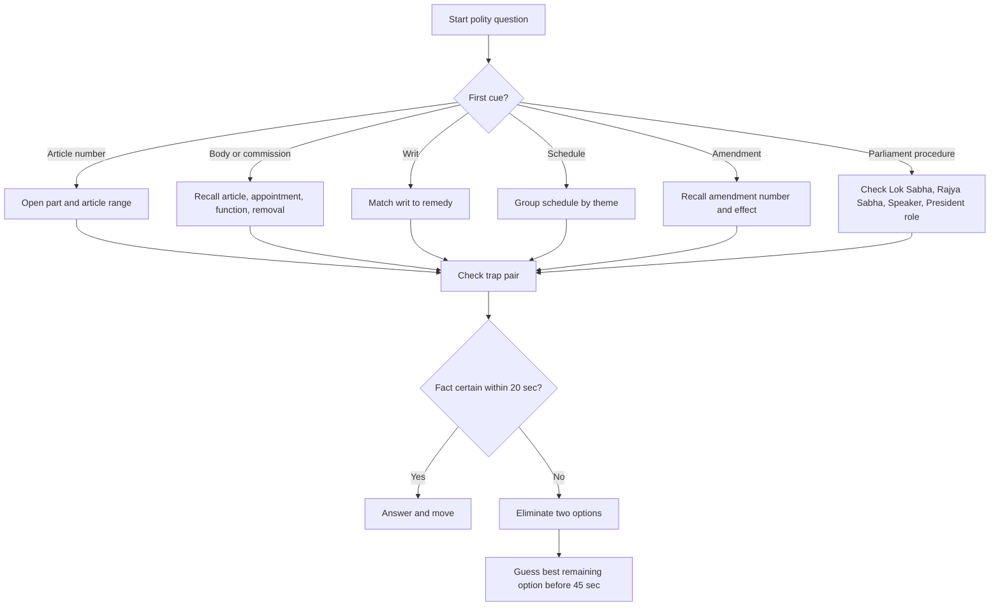
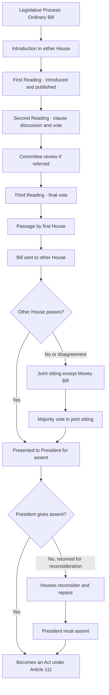

## Concept Ladder

**Step 1 - First Principles**  
A constitution is the supreme law of a nation defining the structure, powers, and limits of government. India's Constitution is written, one of the world's longest constitutional documents, and currently works through articles, parts, schedules, amendments, institutions, and judicial interpretation. At commencement it had 395 articles, 22 parts, and 8 schedules; today the repeated SSC recall layer is 12 schedules, article ranges, bodies, and amendment effects. It establishes a sovereign, socialist, secular, democratic republic.

**Step 2 - Core Features**  
- Federal with unitary bias (single constitution, strong centre, emergency provisions)  
- Parliamentary form of government (Prime Minister and Council of Ministers collectively responsible to Lok Sabha)  
- Independent judiciary with power of judicial review  
- Universal adult suffrage (Article 326)  
- Fundamental Rights (Part III, Article 12-35) - justiciable  
- Directive Principles of State Policy (Part IV, Article 36-51) - non-justiciable but fundamental in governance  
- Fundamental Duties (Part IV-A, Article 51A) - added by 42nd Amendment (1976)

**Step 3 - Organs of Government**  
- Legislature: Parliament (Lok Sabha + Rajya Sabha) + President (parts of legislature)  
- Executive: President (nominal head) + Prime Minister + Council of Ministers (real executive)  
- Judiciary: Supreme Court (apex), High Courts (state level), subordinate courts

**Step 4 - Federal Structure and Emergency Provisions**  
- Three Lists (Union, State, Concurrent) - Article 246  
- Emergency types: National (Article 352), State/President's Rule (Article 356), Financial (Article 360)  
- Amendments: Article 368 - special majority + state ratification for federal provisions  
- Special status for some states (formerly Article 370, now repealed; Article 371 for others)

**Step 5 - Constitutional Bodies and Elections**  
- Election Commission (Article 324)  
- UPSC (Article 315-323)  
- Finance Commission (Article 280)  
- Comptroller and Auditor General (CAG) (Article 148)  
- Attorney General (Article 76)  
- Advocate General (Article 165)

**Exam Integration**  
SSC CGL Tier-I GA expects instant recall of article ranges, schedule contents, body functions, and key amendments. Questions mix constitutional facts with current affairs (appointments, bills, schemes). The 200/200 strategy demands speed and precision - no rote memorisation of every article but recall of ~150-200 critical ones.

### Corpus Pressure

The uploaded book-PYQ corpus marks `indian-polity-basics` as a 200/200 dominant-repeat General Awareness topic with 539 promoted questions. This is not a low-return static GK chapter. It is one of the places where SSC repeatedly asks the same constitutional memory objects with changed wording.

| Corpus bucket | Promoted questions | What it usually tests | 45-second implication |
|---|---:|---|---|
| `pinnacle-ssc-general-studies-p0251-p0275` | 190 promoted questions | Article ranges, Constitution features, Parliament, President, Governor, rights | Article-to-subject recall must be instant |
| `pinnacle-ssc-general-studies-p0276-p0300` | 180 promoted questions | Constitutional bodies, commissions, schedules, officers, elections | Body + article + appointment/removal must be linked |
| `pinnacle-ssc-general-studies-p0301-p0325` | 30 promoted questions | Fundamental Rights, DPSP, duties, amendments, writs | Know exact part/article and common trap pair |
| `pinnacle-ssc-general-studies-p0201-p0225` | 22 promoted questions | History-to-polity bridge and early Constitution facts | Use as background recall, not essay reading |
| `pinnacle-ssc-general-studies-p0226-p0250` | 19 promoted questions | Amendment, Act, Governor-General/Viceroy overlap | Keep chronology clean |

For GA timing, treat polity as a recall-and-eliminate topic. The first 5 seconds must classify the question; the next 20 seconds must retrieve the article/body/schedule; the final 10-15 seconds must check the trap. If the fact is unknown after 20 seconds, eliminate obvious absurd options and move.

### First 5-Second Classification

| First cue in question | Bucket | First memory to open |
|---|---|---|
| "Article..." | Article Range | Part number, article cluster, then subject |
| "Which body/commission..." | Constitutional Body | Article + appointment + function + removal |
| "Which writ..." | Writ | Habeas Corpus, Mandamus, Prohibition, Certiorari, Quo Warranto |
| "Which schedule..." | Schedule | 1-4 territory/pay/oath/RS, 5-6 tribal, 7-9 lists/languages/land, 10-12 defection/local bodies |
| "Which amendment..." | Amendment | 1st, 42nd, 44th, 52nd, 61st, 73rd, 74th, 86th, 101st |
| "Money Bill/Budget/No confidence..." | Parliament | Lok Sabha exclusive, Rajya Sabha limited/special, Speaker certification |
| "Emergency..." | Emergency | 352, 356, 360 and 44th Amendment limits |

---

## Type System

| Type | Recognition Cue | Method | Speed Target | Trap |
|------|-----------------|--------|--------------|------|
| Article Range | "Article X deals with..." | Recall range via mnemonics (e.g., 14-18 = Right to Equality) | 5 sec | Confusing overlapping ranges like 19 (six freedoms) vs 21 (life and liberty) |
| Constitutional Body Matching | "Who appoints the Chief Election Commissioner?" | Use appointment/removal rules (President vs Prime Minister vs CAG) | 10 sec | Mixing appointment of UPSC members with removal procedure |
| Amendment/Year Recall | "Which amendment added Fundamental Duties?" | Drill key amendment numbers at top speed; link to commonly amended articles | 8 sec | Confusing 42nd (mini-constitution) with 44th (removed right to property from FRs) |
| Judicial Concepts | "Which writ is issued against unlawful detention?" | Map writ to purpose: Habeas Corpus (detention), Mandamus (public duty), etc. | 6 sec | Swapping Certiorari (quash order) with Prohibition (stop proceedings) |
| Functions and Powers | "Who certifies a Money Bill?" | Learn exclusive powers of each House - Lok Sabha Speaker certifies Money Bill | 8 sec | Thinking Rajya Sabha can amend/reject Money Bill - it can only recommend changes in 14 days |
| Schedules Content | "Which schedule deals with allocation of seats in Rajya Sabha?" | Group schedules by theme: 4th = RS seats, 8th = languages, 10th = anti-defection | 7 sec | Transposing 5th (ST areas) and 6th (tribal areas in NE) |
| Miscellaneous (Preamble, features) | "Which word was added to Preamble by 42nd Amendment?" | Remember the quartet: Socialist, Secular, Integrity (added by 42nd) | 4 sec | Thinking 'Democratic' or 'Republic' were added - they were original |

---

## Speed Methods

### Recall Tables

**Important Articles at a Glance**

| Article | Subject | Mnemonic/Key |
|---------|---------|--------------|
| 14 | Equality before law | 14 = 1+4 (=5) - Right to Equality starts |
| 19(1)(a)-(g) | Six freedoms (speech, assembly, association, movement, residence, profession) | 'SAMARP' - Speech, Assembly, Movement, Association, Residence, Profession |
| 21 | Right to life (expanded by SC) | 21 = life, liberty, livelihood |
| 32 | Right to Constitutional Remedies (heart of Constitution) | Dr. Ambedkar - "heart and soul" |
| 44 | Uniform Civil Code (DPSP) | 44 = UCC - Goal for Goa, etc. |
| 72 | Pardoning power of President | 72 = 7+2=9 - President's mercy |
| 74 | Council of Ministers to aid and advise President | 74 = 7+4=11 - PM+ministers |
| 76 | Attorney General of India | 76 = AG - position equivalent to SC judge |
| 124 | Establishment of Supreme Court | 124 = 1st+2+4=7 - SC has 7 (originally) judges? |
| 143 | Advisory jurisdiction of SC | 143 = 1+4+3=8 - President can ask opinion |
| 155 | Appointment of Governor | President appoints Governor |
| 163 | Council of Ministers in State | Governor aided by CM and ministers |
| 164 | Appointment of CM and Ministers | Appointment by Governor |
| 172 | Duration of State Legislature (5 years unless dissolved) | 172 = 1+7+2=10 - normal term 5 years |
| 174 | Sessions of State Legislature | Article 174 - Governor summons |
| 200 | Assent to Bills by Governor | Governor can reserve for President |
| 213 | Ordinance making power of Governor | 213 = 2+1+3=6 - Governor's ordinance |
| 226 | Power of High Courts to issue writs | Wider than Article 32 (whole state) |
| 280 | Finance Commission | 280 = 2+8+0=10 - every 5 years |
| 324 | Superintendence of elections to EC | 324 = 3+2+4=9 - EC formed |
| 352 | National Emergency | 352 = 3+5+2=10 - external armed rebellion |
| 356 | President's Rule in State | 356 = 3+5+6=14 - failure of constitutional machinery |
| 360 | Financial Emergency | 360 = 3+6+0=9 - never used |
| 368 | Amendment of Constitution | 368 = 3+6+8=17 - special majority |
| 370 | Special status to J&K (abrogated) | Remember as historic article |
| 395 | Repealing of earlier Acts | 395 = 395 Acts repealed |

**Parts of Constitution (I-XXII)**

| Part | Subject | Articles |
|------|---------|----------|
| I | Union and its Territory | 1-4 |
| II | Citizenship | 5-11 |
| III | Fundamental Rights | 12-35 |
| IV | DPSP | 36-51 |
| IV-A | Fundamental Duties | 51A |
| V | Union Government (President, VP, PM, Parliament, SC) | 52-151 |
| VI | State Governments (Governor, CM, Legislature, HC) | 152-237 |
| VIII | Union Territories | 239-242 |
| IX | Panchayats | 243-243O |
| IX-A | Municipalities | 243P-243ZG |
| X | Scheduled & Tribal Areas | 244-244A |
| XI | Relations between Union and States | 245-263 |
| XII | Finance, Property, Contracts | 264-300A |
| XIII | Trade, Commerce within India | 301-307 |
| XIV | Services under Union and States | 308-323 |
| XIV-A | Tribunals | 323A-323B |
| XV | Elections | 324-329 |
| XVI | Special provisions (SC, ST, Anglo-Indian) | 330-342 |
| XVII | Official Language | 343-351 |
| XVIII | Emergency Provisions | 352-360 |
| XX | Amendment of Constitution | 368 |
| XXI | Temporary, Transitional Provisions | 369-392 |
| XXII | Short title, commencement, repeal | 393-395 |

**12 Schedules - Quick Check**

| Schedule | Content | Key Fact |
|----------|---------|----------|
| 1st | Names of states and UTs | 28 states + 8 UTs (after 2019) |
| 2nd | Salaries of President, Governor, Speaker, etc. | Also known as 'pay schedule' |
| 3rd | Forms of oaths and affirmations | For ministers, judges, etc. |
| 4th | Allocation of seats in Rajya Sabha | Based on population |
| 5th | Administration of scheduled areas and STs | 9 states covered |
| 6th | Administration of tribal areas in NE | Assam, Meghalaya, etc. |
| 7th | Union, State, and Concurrent lists | Originally 97 subjects in Union List |
| 8th | Official languages | 22 languages (Sindhi, Konkani, etc. added later) |
| 9th | Validation of land reforms laws | Added by 1st Amendment - beyond judicial review |
| 10th | Anti-defection provisions | Added by 52nd Amendment (1985) |
| 11th | Powers of Panchayats | Added by 73rd Amendment (1992) |
| 12th | Powers of Municipalities | Added by 74th Amendment (1992) |

### Decision Rules

- **President vs Governor power**: President can pardon death sentence (Article 72); Governor cannot (Article 161 can only suspend, remit, commute).  
- **Lok Sabha vs Rajya Sabha**: Only LS can pass Money Bill, Vote of No Confidence; RS has special powers to create new All India Services (Article 312) and can withhold non-money bills for 6 months (14 days for Money Bill).  
- **Original vs Appellate jurisdiction of SC**: Original - disputes between governments (Article 131); Appellate - from HC (civil, criminal, constitutional).  
- **Writ jurisdiction**: SC under Article 32 (fundamental rights); HC under Article 226 (wider, including other legal rights).

### Step-by-Step Algorithm for Mixed Questions

1. Identify the subject (Fundamental Right? Body? Emergency?).  
2. Recall the relevant article range or schedule number.  
3. For numeric options, use mnemonics (e.g., article 32 is 'heart and soul' - matches enforcement of rights).  
4. For function matching, mentally list the body's key duty and removal process.  
5. Eliminate two obviously wrong options first.  
6. Among remaining, choose based on constitutional text, not common misconception.

---

## Trap Table

| Trap | Trigger Wording | Wrong Move | Correct Move | Repair Drill |
|------|-----------------|------------|--------------|--------------|
| Preamble is not enforceable | "Preamble is the supreme law of India..." | Assume it can be used to invalidate a law | Preamble is part of constitution but not enforceable in court; used for interpretation only (Kesavananda Bharati) | Recite: "Preamble - key to the constitution, not a sword." |
| President is the head of state and head of government | "Who is the real executive head of India?" | Answer: President | Real head is Prime Minister; President is nominal. | Memorise: "President - nominal; PM - real." |
| Rajya Sabha is permanent house | "Which House of Parliament is permanent?" | Rajya Sabha - it is permanent | It is a continuing chamber but members retire every 2 years; not permanent in the sense of fixed tenure | Note: RS is not dissolved; its members are elected for 6 years, one-third retire every 2 years. |
| Money Bill can be introduced in Rajya Sabha | "A Money Bill can be introduced in..." | Rajya Sabha | Only Lok Sabha (Article 110/111); RS can only recommend changes in 14 days. | Drill: "Money Bill - LS only; Finance Bill also." |
| Article 356 (President's Rule) can be extended indefinitely | "President's rule can be extended every 6 months without limit" | It can be extended as many times as needed | Maximum 3 years (1 year initially + 1 year extension + 1 year extension), each extension requires parliamentary approval. | Remember: 1 + 1 + 1 = 3 years max. |
| 42nd Amendment added 'Socialist', 'Secular', 'Integrity' to Preamble | "Which amendment added 'Fraternity' to Preamble?" | 42nd - but fraternity was already there | 42nd added socialist, secular, integrity; fraternity original. | List original: Sovereign, Democratic, Republic, Justice, Liberty, Equality, Fraternity. |
| Union List includes 'Police' and 'Public Order' | "Which list does 'Police' belong to?" | Union List | State List (Entry 1) - public order and police are state subjects. | Use mnemonic: "Police - State; Defense - Union." |
| Governor appoints judges of High Court | "Who appoints the Chief Justice of a High Court?" | Governor | President (after consultation with CJI and Governor) | Appointment of CJ/ judges of HC is by President (Article 217) after consultation. |
| Fundamental Rights can be suspended during National Emergency | "During National Emergency, all Fundamental Rights are automatically suspended." | All FRs suspended | Article 358 suspends Article 19 only; Article 359 can suspend other rights except Article 20 and 21. 44th Amendment (1978) ensured 20 and 21 cannot be suspended. | Drill: "Emergency - only 19 suspended if external; 20 & 21 never." |
| Vice President is ex-officio Chairman of Lok Sabha | "The ex-officio Chairman of the Lok Sabha is the Vice President." | Vice President | Chairman of Rajya Sabha is Vice President; Lok Sabha Speaker is elected. | Distinguish: VP chairs Rajya Sabha; Speaker chairs Lok Sabha. |
| Impeachment of President is by Supreme Court | "The mechanism to remove the President is..." | Impeachment by Supreme Court | Impeachment by Parliament (Article 61) - charge by either House, investigated by the other House. | Remember: Impeachment is political, not judicial. |
| CAG can audit accounts of state governments directly without requisition | "The CAG audits the accounts of the states only on request of the Governor." | On request | CAG audits automatically; Governor requests only for specific additional audits (Article 151). | Refer: Article 149 - CAG audits accounts of Union and States. |
| 73rd Amendment added Part IX-A (Municipalities) | "Which part was added by the 73rd Amendment?" | Part IX-A | Part IX (Panchayats) - 73rd; IX-A (Municipalities) - 74th. | Mnemonic: "73 - villages (Panchayat); 74 - cities (Municipality)." |
| Original constitution had 8 schedules; now 12 | "The Indian Constitution originally had 12 schedules." | 12 | Originally 8 schedules; 9th added (1st Amendment, 1951), 10th (52nd Amendment, 1985), 11th (73rd), 12th (74th). | Count: 8 original + 4 amendments = 12. |

---

## Flowchart

---

## Solved Examples

**Example 1**  
Which of the following is NOT a feature of the Indian Constitution?  
(a) Federal system  
(b) Unitary bias  
(c) Presidential form of government  
(d) Bicameral legislature  
**Answer: (c)**  
**Explanation:** India has a **parliamentary** form of government, not presidential. The Constitution provides for a federal system with unitary bias and a bicameral legislature (Lok Sabha + Rajya Sabha).

**Example 2**  
Under which Article of the Constitution can the President of India pardon a death sentence?  
(a) Article 72  
(b) Article 161  
(c) Article 32  
(d) Article 226  
**Answer: (a)**  
**Explanation:** Article 72 vests the President with the power to grant pardons, reprieves, respites or remissions of punishment, including death sentence. Article 161 gives similar power to the Governor, but Governor cannot pardon death sentence.

**Example 3**  
Which of the following amendments introduced the Anti-Defection Law in India?  
(a) 42nd Amendment  
(b) 44th Amendment  
(c) 52nd Amendment  
(d) 73rd Amendment  
**Answer: (c)**  
**Explanation:** The 52nd Amendment (1985) added the 10th Schedule to the Constitution, dealing with disqualification of members on grounds of defection. 42nd is 'mini-constitution', 44th removed right to property from FRs, 73rd added Panchayats.

**Example 4**  
The President of India is elected by an electoral college consisting of:  
(a) Elected members of Lok Sabha, Rajya Sabha, and State Assemblies  
(b) Elected members of Lok Sabha and Rajya Sabha only  
(c) All members of Lok Sabha, Rajya Sabha, and State Assemblies  
(d) Elected members of Lok Sabha and State Assemblies only  
**Answer: (a)**  
**Explanation:** The electoral college includes elected members of both Houses of Parliament and elected members of State Legislative Assemblies (Article 54). Nominated members and MLAs of some UTs are not included.

**Example 5**  
Which writ is issued by a court to prevent a person or authority from acting in excess of its jurisdiction?  
(a) Habeas Corpus  
(b) Mandamus  
(c) Certiorari  
(d) Prohibition  
**Answer: (d)**  
**Explanation:** Prohibition is a writ issued to prevent lower courts/ tribunals from exceeding their jurisdiction. Certiorari quashes a decision already made; Mandamus compels performance of duty; Habeas Corpus secures release from unlawful detention.

**Example 6**  
The term 'socialist' was added to the Preamble of the Indian Constitution by which Amendment?  
(a) 24th Amendment  
(b) 38th Amendment  
(c) 42nd Amendment  
(d) 44th Amendment  
**Answer: (c)**  
**Explanation:** The 42nd Amendment (1976) added the words Socialist, Secular, and Integrity to the Preamble. It also added Fundamental Duties (Part IV-A).

**Example 7**  
Which of the following is a constitutional body?  
(a) NITI Aayog  
(b) National Human Rights Commission  
(c) Finance Commission  
(d) Central Information Commission  
**Answer: (c)**  
**Explanation:** The Finance Commission (Article 280) is a constitutional body. NITI Aayog is a statutory body (replacing Planning Commission), NHRC and CIC are also statutory bodies created by acts of Parliament.

**Example 8**  
What is the maximum gap between two sessions of Parliament?  
(a) 6 months  
(b) 3 months  
(c) 1 year  
(d) 4 months  
**Answer: (a)**  
**Explanation:** Article 85 of the Constitution mandates that Parliament shall meet at least twice a year, and the gap between two sessions shall not be more than six months.

**Example 9**  
Which part of the Constitution deals with Directive Principles of State Policy?  
(a) Part III  
(b) Part IV  
(c) Part IV-A  
(d) Part V  
**Answer: (b)**  
**Explanation:** Part IV (Articles 36-51) contains DPSP. Part III is Fundamental Rights, Part IV-A is Fundamental Duties, Part V deals with the Union Government.

**Example 10**  
Who appoints the Chief Election Commissioner of India?  
(a) Prime Minister  
(b) Chief Justice of India  
(c) President of India  
(d) Lok Sabha Speaker  
**Answer: (c)**  
**Explanation:** The President of India appoints the Chief Election Commissioner and other Election Commissioners (Article 324). Removal is also by the President on a recommendation from Parliament.

**Example 11**  
Which Article is called the heart and soul of the Constitution by Dr. B. R. Ambedkar?  
(a) Article 14  
(b) Article 19  
(c) Article 21  
(d) Article 32  
**Answer: (d)**  
**Explanation:** Article 32 gives the right to move the Supreme Court for enforcement of Fundamental Rights. SSC often converts this into "constitutional remedies" or "heart and soul." The 5-second cue is remedies -> Article 32.

**Example 12**  
Which schedule contains the anti-defection provisions?  
(a) 8th Schedule  
(b) 9th Schedule  
(c) 10th Schedule  
(d) 11th Schedule  
**Answer: (c)**  
**Explanation:** The 10th Schedule was added by the 52nd Amendment, 1985. Do not confuse it with the 9th Schedule, which originally protected land reform laws.

**Example 13**  
Which Article gives the High Courts power to issue writs?  
(a) Article 32  
(b) Article 226  
(c) Article 280  
(d) Article 324  
**Answer: (b)**  
**Explanation:** Article 32 is for the Supreme Court and Fundamental Rights. Article 226 gives High Courts wider writ power for Fundamental Rights and other legal rights.

**Example 14**  
Which writ is used to question the legal authority of a person holding a public office?  
(a) Habeas Corpus  
(b) Mandamus  
(c) Quo Warranto  
(d) Certiorari  
**Answer: (c)**  
**Explanation:** Quo Warranto means "by what authority." The recall hook is office legality. Habeas Corpus is detention, Mandamus is public duty, Certiorari quashes an order.

**Example 15**  
Which of the following is a State List subject?  
(a) Defence  
(b) Foreign affairs  
(c) Police  
(d) Railways  
**Answer: (c)**  
**Explanation:** Police and public order are State List subjects. Defence, foreign affairs, and railways are Union List subjects.

**Example 16**  
Which amendment lowered the voting age from 21 to 18 years?  
(a) 42nd Amendment  
(b) 44th Amendment  
(c) 52nd Amendment  
(d) 61st Amendment  
**Answer: (d)**  
**Explanation:** The 61st Amendment, 1988 lowered the voting age to 18. It is a high-frequency polity fact because it connects Article 326 with elections.

**Example 17**  
Which Article provides for the Finance Commission?  
(a) Article 148  
(b) Article 280  
(c) Article 315  
(d) Article 324  
**Answer: (b)**  
**Explanation:** Finance Commission is Article 280. Article 148 is CAG, Article 315 is Public Service Commissions, and Article 324 is Election Commission.

**Example 18**  
Which amendment added the words "socialist", "secular", and "integrity" to the Preamble?  
(a) 1st Amendment  
(b) 42nd Amendment  
(c) 44th Amendment  
(d) 86th Amendment  
**Answer: (b)**  
**Explanation:** The 42nd Amendment, 1976 added these words and is called the mini-constitution. Fraternity, justice, liberty, equality, democratic, and republic were already present.

**Example 19**  
Which Article deals with President's Rule in a state?  
(a) Article 352  
(b) Article 356  
(c) Article 360  
(d) Article 368  
**Answer: (b)**  
**Explanation:** Article 356 is failure of constitutional machinery in a state. Article 352 is National Emergency, Article 360 is Financial Emergency, and Article 368 is amendment.

**Example 20**  
Who certifies whether a bill is a Money Bill?  
(a) President  
(b) Vice President  
(c) Speaker of Lok Sabha  
(d) Chairman of Rajya Sabha  
**Answer: (c)**  
**Explanation:** The Speaker of Lok Sabha certifies a Money Bill. Rajya Sabha can only recommend changes and must return it within 14 days.

**Example 21**  
Which Part of the Constitution contains Fundamental Duties?  
(a) Part III  
(b) Part IV  
(c) Part IV-A  
(d) Part V  
**Answer: (c)**  
**Explanation:** Fundamental Duties are in Part IV-A, Article 51A. They were added by the 42nd Amendment.

**Example 22**  
Which Article contains the ordinance-making power of the President?  
(a) Article 72  
(b) Article 110  
(c) Article 123  
(d) Article 213  
**Answer: (c)**  
**Explanation:** Article 123 is the President's ordinance power. Article 213 is the Governor's ordinance power.

**Example 23**  
Which schedule contains the Union, State, and Concurrent Lists?  
(a) 5th Schedule  
(b) 6th Schedule  
(c) 7th Schedule  
(d) 8th Schedule  
**Answer: (c)**  
**Explanation:** The 7th Schedule contains the three legislative lists. In the exam, list cue -> 7th Schedule should be automatic.

**Example 24**  
Which of the following rights cannot be suspended even during Emergency after the 44th Amendment?  
(a) Article 14 and 19  
(b) Article 19 and 32  
(c) Article 20 and 21  
(d) Article 25 and 26  
**Answer: (c)**  
**Explanation:** Article 20 and Article 21 cannot be suspended. This is a common emergency trap.

**Example 25**  
Which constitutional body is associated with Article 148?  
(a) Election Commission  
(b) Comptroller and Auditor General  
(c) Finance Commission  
(d) UPSC  
**Answer: (b)**  
**Explanation:** Article 148 provides for the CAG. The quick body ladder is CAG-148, Attorney General-76, Finance Commission-280, Election Commission-324, UPSC-315.

---

## PYQ Mapping

Based on the book-PYQ corpus (539 promoted questions in Indian Polity), the highest concentration is on:

- **`pinnacle-ssc-general-studies-p0251-p0275`**, which contributes **190 promoted questions** - practice identifying article-range from description.  
- **`pinnacle-ssc-general-studies-p0276-p0300`**, which contributes **180 promoted questions** - focus on appointment, tenure, removal, functions.  
- **`pinnacle-ssc-general-studies-p0301-p0325`**, which contributes **30 promoted questions** - know the articles and landmark judgments around rights, duties, DPSP, and writs.  
- **`pinnacle-ssc-general-studies-p0201-p0225`** and **`pinnacle-ssc-general-studies-p0226-p0250`**, which contribute **22 promoted questions** and **19 promoted questions** - understand constitutional history, acts, parliamentary procedure, and emergency basics.

**Practice Route**  
- For article recall: Use the [Indian Polity Basics practice page](/exams/ssc-cgl/topics/indian-polity-basics) to drill article numbers.  
- For body functions: Visit [Current Affairs - Static GK](/exams/ssc-cgl/topics/current-affairs-static-gk) for recent appointments and institutional updates.  
- For speed and accuracy: Take the [General Awareness Speed Sprint](/exams/ssc-cgl/tests/ssc-cgl-general-awareness-speed-sprint) - 15-minute tests with mixed polity questions.  

**Corpus-Driven Focus**  
Low-count subtopics like Schedules, Amendments, and Writs appear less but are high-leverage - attempt extra original drills in the 200/200 Drill section below.

---

## 200/200 Drill

### Timed Micro-Drills

**Drill 1 - Article Range Sprint (5 minutes)**  
Write the article number for each subject:  
1. Right to Freedom of Speech  
2. Right to Life and Personal Liberty  
3. Prohibition of untouchability  
4. Uniform Civil Code (DPSP)  
5. Election Commission  
6. Finance Commission  
7. President's pardoning power  
8. Ordinance power of President  
9. Impeachment of President  
10. Abolition of titles  

*Answers:* 19(1)(a), 21, 17, 44, 324, 280, 72, 123, 61, 18.

**Drill 2 - Body Function Match (3 minutes)**  
Match the body with its constitutional article and speak the function aloud:  
1. Attorney General - Article 76  
2. Advocate General - Article 165  
3. Comptroller & Auditor General - Article 148  
4. Finance Commission - Article 280  
5. Election Commission - Article 324  
6. National Commission for SCs - Article 338  
7. National Commission for STs - Article 338A  
8. Special Officer for Linguistic Minorities - Article 350B  

**Drill 3 - Emergency & Amendments (4 minutes)**  
True/False:  
1. National Emergency can be imposed only on grounds of war or external aggression. (False - internal armed rebellion also, after 44th Amendment)  
2. President's Rule can be imposed for a maximum of 3 years. (True)  
3. 42nd Amendment removed the right to property from FRs. (False - right to property was removed by 44th Amendment, 42nd added duties and changed preamble)  
4. 73rd Amendment added Part IX-A. (False - Part IX; 74th added IX-A)  
5. The 9th Schedule was added by the 1st Amendment. (True)  

**Repair Rules**  
- If you confuse article ranges: Create a one-line mnemonic for each Part. E.g., "Part III 12-35" becomes "1212-35" - 'FRs enjoyed by 35 people'.  
- If you mix writs: Write each writ on a flashcard with a sample sentence: "Habeas Corpus - produce the body", "Mandamus - I command", "Certiorari - quash", "Prohibition - stop".  
- If you misidentify constitutional vs statutory bodies: List all constitutional bodies (EC, UPSC, CAG, FC, NCSC, NCST, SPSCs, etc.) and highlight they are created by the Constitution itself. Any other body (NHRC, CIC, NITI Aayog) is statutory.  
- For schedule confusion: Group 1-4 (territory/oaths/RS/emoluments), 5-6 (tribal areas), 7-9 (lists/languages/land reforms), 10-12 (defection/panchayat/municipality). Recite once daily.

**Final Strategy for 200/200**  
- In the exam, spend maximum 45 seconds per GA question. If unsure, eliminate two options and guess.  
- Use the first look for article-number questions - if the question is purely textual (e.g., "Which article provides for..."), recall the range from Part. If it is application-based (e.g., "Which writ is appropriate for..."), apply the purpose.  
- Keep a mental list of 10 most recurring articles: 14, 19, 21, 32, 44, 72, 112 (budget), 123 (ordinance), 324 (election), 368 (amendment).  
- Review the 12 schedules and their amendment numbers every week.  
- After every mock test, note which polity traps you fell into and review corresponding repair drills.  

With relentless drilling of these recall tables and trap awareness, Indian Polity can become a guaranteed full-mark section on your path to 200/200.
<!-- SSC-FINAL-PRACTICE-QUEUE:START -->
## Final Practice Queue

1. Start one-by-one practice: [Indian Polity Basics practice](/exams/ssc-cgl/practice/indian-polity-basics). Finish every question in this topic bank, not just the samples in the note.
2. Move to timed sets: [SSC CGL tests](/exams/ssc-cgl/tests?topic=indian-polity-basics). Use topic drills first, then section mocks once accuracy is stable.
3. Repair every miss immediately: record the error label, redo 20 mixed questions from the same topic, then retest after 24 hours.
4. 200/200 rule: do not mark this topic exam-ready until correct answers come within 36 seconds and wrong answers are explained without looking at the solution.

<!-- SSC-FINAL-PRACTICE-QUEUE:END -->
