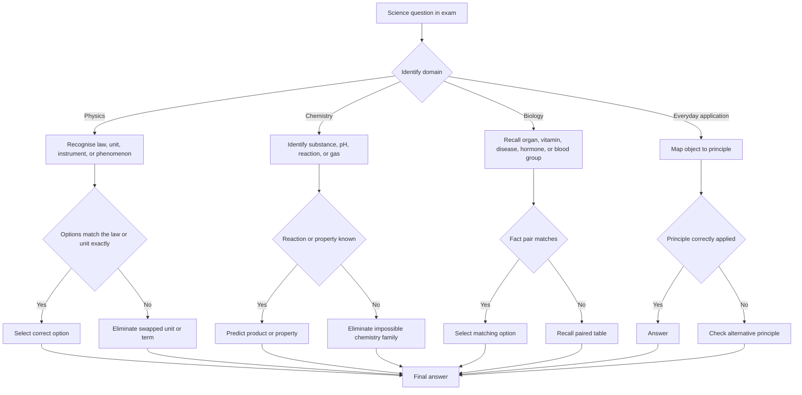

## Corpus Pressure

This note is built around the promoted SSC CGL book-PYQ slice for `science-everyday`: **489 promoted questions**. The strongest clusters are `pinnacle-ssc-general-studies-p0526-p0550`, which contributes **92 promoted questions**, `pinnacle-ssc-general-studies-p0501-p0525`, which contributes **85 promoted questions**, `pinnacle-ssc-general-studies-p0476-p0500` with **51 promoted questions**, `pinnacle-ssc-general-studies-p0451-p0475` with **49 promoted questions**, and `pinnacle-ssc-general-studies-p0551-p0575` with **48 promoted questions**. Smaller support clusters at `p0426-p0450`, `p0576-p0600`, and `p0051-p0075` show that the topic is broad, but the exam style is repeatable: direct fact pairs, instrument-unit pairs, vitamin-disease pairs, and everyday principle questions.

For 200/200, General Science must be handled as a fast recognition bank:

| First Clue | Domain | Immediate Recall Route |
|---|---|---|
| Unit, instrument, law, mirror, sound, heat, electricity | Physics | Match unit/law/instrument first; then eliminate swapped options |
| Acid, base, pH, gas, alloy, polymer, soap, detergent | Chemistry | Identify substance family and common reaction product |
| Vitamin, disease, hormone, organ, blood group, brain part | Biology | Recall paired fact exactly; do not reason from vague familiarity |
| Pressure cooker, fuse, battery, refrigerator, spectacles | Everyday application | Object -> principle -> option |
| Greenhouse gas, ozone, pollution, ecosystem | Environment overlap | Use ecology note for deeper coverage, but keep basic gases here |

### First 5-Second Classification

1. Circle the domain word: unit, vitamin, organ, gas, instrument, law, or object.
2. Ask whether the answer is a **pair** (vitamin-disease), a **principle** (pressure cooker), or a **classification** (acid/base, metal/non-metal).
3. Predict the answer before reading all options.
4. Reject the usual swapped pair: joule/watt, barometer/hygrometer, O-/AB+, refraction/reflection, scurvy/rickets.
5. If the question is unknown, eliminate impossible domain options and move on quickly; GA accuracy comes from recall density, not overthinking.

## Concept Ladder

1.  **First Principles:** Science is the systematic study of the natural world through observation and experiment. General Awareness at SSC CGL level tests recognition of established facts, laws, and applications - not derivation.
2.  **Core Domains:**
    *   **Physics:** Motion, force, work, energy, heat, light, sound, electricity, magnetism. Key laws: Newton's laws, Ohm's law, Archimedes' principle, reflection/refraction laws.
    *   **Chemistry:** Atoms, molecules, elements, compounds. Reactions: acids/bases, oxidation-reduction. Everyday substances: soaps, detergents, baking soda, vinegar, batteries.
    *   **Biology:** Cell theory, human systems (digestive, respiratory, circulatory, excretory), diseases, nutrition, vitamins, hormones, blood groups.
3.  **Exam-Level Integration:** Questions rarely ask for derivations. They present a statement or scenario; you must identify the correct scientific principle, inventor, unit, or application. Traps often involve swapping terms (e.g., "vitamin C deficiency causes rickets" - wrong, it's scurvy) or mixing units.
4.  **Everyday Science:** The link between textbook knowledge and common objects: pressure cooker (Boyle's law, high pressure raises boiling point), lens in spectacles (refraction), fuse wire (low melting point), soap (micelle formation), battery (electrochemical cell).
5.  **Memory Aids:** Use acronyms, visual cues, and paired associations. For example: Vitamin A for vision, B1 for beriberi, C for scurvy, D for rickets. Ohm's law: V = IR.

## Type System

| Type | Recognition Cue | Method | Speed Target | Trap |
|------|-----------------|--------|--------------|------|
| Law/Principle Statement | "Which law explains...", "According to..." | Recall the exact statement; compare keywords. | 15 sec | Distractors change one word (e.g., "force" instead of "acceleration"). |
| Inventor/Discovery | "Who discovered...", "Invented by..." | Memorize inventor-discovery pairs. | 10 sec | Confusion between similar names (e.g., Fahrenheit vs Celsius). |
| Unit/Instrument | "Unit of...", "Measured by..." | Know SI units, common instruments. | 10 sec | Unit for force is newton, not kg. |
| Human System Function | "Which organ...", "Function of..." | Map organ to function. | 15 sec | Liver produces bile, not stored in liver (stored in gallbladder). |
| Vitamin/Mineral Deficiency | "Deficiency of X causes..." | Match vitamin/mineral to disease. | 10 sec | Wrong disease paired (e.g., night blindness from vitamin A, not D). |
| Everyday Application | "Why does a pressure cooker cook faster?" | Connect physics/chemistry principle. | 20 sec | Overgeneralizing (e.g., "increases temperature" instead of "increases boiling point"). |
| Chemical Reaction | "Which gas is produced when..." | Identify reactants and products. | 15 sec | Wrong gas identified (e.g., H2 vs CO2). |
| Blood/Heart Facts | "Which blood group is universal donor?" | Recall O- for donor, AB+ for recipient. | 10 sec | Reversal of donor/recipient. |
| Environment Science | "Which gas causes greenhouse effect?" | List major greenhouse gases. | 10 sec | Confusing CO2 with O3 (ozone). |
| Polymer/Soap | "Soap is a..." | Know saponification, micelle. | 15 sec | Soap vs synthetic detergent difference. |
| Electricity/Magnetism | "Current flows due to..." | Ohm's law, magnetic effects. | 15 sec | Series vs parallel resistance calculations. |
| Nutrition/Calories | "Which nutrient gives maximum energy?" | Fats (9 kcal/g), carbs (4), proteins (4). | 10 sec | Thinking carbs give most energy (wrong - fats). |
| Acids/Bases | "pH of acid is..." | pH <7 acid, >7 base. | 5 sec | Neutral as pH 7. |
| Instruments | "Which instrument measures humidity?" | Hygrometer. | 10 sec | Confusing with hydrometer (density). |

## Speed Methods

*   **Recall Tables:**

    | Vitamin | Deficiency Disease | Source |
    |---------|-------------------|--------|
    | A | Night blindness, xerophthalmia | Carrot, milk, liver |
    | B1 | Beriberi | Whole grains, meat |
    | B3 | Pellagra | Nuts, fish |
    | C | Scurvy | Citrus fruits |
    | D | Rickets (children), osteomalacia (adults) | Sunlight, fish oil |
    | E | Sterility | Vegetable oils |
    | K | Delayed blood clotting | Green leafy vegetables |

    | Gland | Hormone | Function |
    |-------|---------|----------|
    | Pituitary | Growth hormone | Body growth |
    | Thyroid | Thyroxine | Metabolism |
    | Pancreas | Insulin | Blood sugar regulation |
    | Adrenal | Adrenaline | Fight-or-flight |

*   **Decision Rules:**
    *   If question asks "most abundant gas in air" -> N2 (78%). If "most abundant in universe" -> H2.
    *   For vitamin deficiency, check if the disease matches the vitamin's primary role: Vitamin A (eye), B (nerve/skin), C (collagen/immunity), D (bone).
    *   For physics laws: if force and mass change mentioned -> Newton's second law. If pressure and volume -> Boyle's law.
    *   For instruments: measuring device usually ends with "-meter" (barometer, thermometer, hygrometer) but not always (stethoscope, microscope).

*   **Step-by-Step Algorithm for Everyday Application Questions:**
    1. Identify the object (pressure cooker, bulb, battery, etc.).
    2. Recall the scientific principle behind its working: e.g., pressure cooker - pressure and boiling point.
    3. Eliminate options that contradict basic science (e.g., "adds more heat" - no, it raises pressure).
    4. Choose the one that exactly states the principle.

## Trap Table

| Trap | Trigger Wording | Wrong Move | Correct Move | Repair Drill |
|------|----------------|------------|--------------|--------------|
| Vitamin disease swap | "Deficiency of vitamin D causes..." | Pick scurvy | Pick rickets or osteomalacia | Memorise disease-vitamin pairs using flashcards. |
| Inventor confusion | "Who invented the telephone?" | Graham Bell (telegraph confusion) | Alexander Graham Bell | Create a separate list of inventors paired with inventions. |
| Unit mismatch | "Unit of power is..." | Picking watt (correct) but confusing with joule | Watt (Joule is energy) | Rehearse SI units: energy=joule, power=watt, force=newton. |
| Universal donor mix-up | "Which blood group can donate to all?" | AB+ | O negative | Remember: O- (zero antibodies) donates; AB+ (no antibodies) receives. |
| Gas in air confusion | "Most abundant gas in Earth's atmosphere?" | Oxygen | Nitrogen | Recall N2 (78%), O2 (21%). |
| pH scale misinterpretation | "Lemon juice has pH..." | 7 (neutral) | ~2-3 (acidic) | Acidic foods have low pH; remember lemon=acid. |
| Hormone/gland swap | "Insulin is secreted by..." | Liver | Pancreas | Map pancreas to insulin; liver to bile. |
| Reflection vs refraction | "Why does a straw appear bent in water?" | Reflection | Refraction due to change in medium | Light bends when entering water - refraction. |
| Series vs parallel bulb brightness | "Two bulbs in series, one is removed: other bulb?" | Becomes dimmer (parallel thinking) | Goes off (series circuit broken) | Series: same current, if one fails all off. |
| Chemical reaction product | "Baking soda + vinegar gives..." | Oxygen | Carbon dioxide (CO2) | Equation: NaHCO3 + CH3COOH -> CO2 + H2O + sodium acetate. |
| Energy from food | "Which nutrient gives most energy per gram?" | Carbohydrates | Fats (9 kcal/g) | Fats > carbohydrates (4) > proteins (4). |
| Freezing point depression | "Salt is spread on icy roads to..." | Lower freezing point of ice | Lower freezing point of water | Salt lowers freezing point, water does not freeze easily. |
| Pressure cooker principle | "Pressure cooker cooks faster because..." | Increases temperature directly | Increases pressure, raising boiling point | Higher pressure means liquid boils at >100C, faster cooking. |
| Fuse wire property | "Fuse wire is made of..." | Copper (good conductor) | Tin-lead alloy (low melting point) | Fuse should melt quickly on excess current. |
| Universal solvent | "Universal solvent is..." | Ethanol | Water | Water dissolves many substances; ethanol is not universal. |

## Flowchart

## Solved Examples

**Example 1:** Which of the following is the unit of electric current?
A. Volt
B. Ampere
C. Ohm
D. Coulomb

**Answer:** B. Ampere
**Explanation:** Electric current is measured in ampere (A). Volt is potential difference, ohm is resistance, coulomb is charge.

**Example 2:** Deficiency of which vitamin causes night blindness?
A. Vitamin B1
B. Vitamin A
C. Vitamin C
D. Vitamin D

**Answer:** B. Vitamin A
**Explanation:** Vitamin A is essential for rhodopsin synthesis in retina; deficiency causes night blindness. B1 - beriberi, C - scurvy, D - rickets.

**Example 3:** Which gas is produced when baking soda reacts with lemon juice?
A. Oxygen
B. Hydrogen
C. Carbon dioxide
D. Nitrogen

**Answer:** C. Carbon dioxide
**Explanation:** Baking soda (sodium bicarbonate) reacts with acid (citric acid) to produce CO2, water, and salt. This is used in baking to make dough rise.

**Example 4:** A person with blood group O- can donate blood to which group(s)?
A. Only O-
B. All groups (universal donor)
C. Only AB+
D. Only O and A

**Answer:** B. All groups (universal donor)
**Explanation:** O- has no A or B antigens and no Rh antigen, so it can be transfused to any blood group. Hence it is the universal donor.

**Example 5:** Why does a pressure cooker reduce cooking time?
A. It increases flame temperature
B. It reduces the boiling point of water
C. It raises the boiling point of water
D. It uses less water

**Answer:** C. It raises the boiling point of water
**Explanation:** By increasing pressure inside the sealed cooker, water boils at a higher temperature (>100C), which cooks food faster. Option B is the opposite; more pressure raises boiling point.

**Example 6:** Which instrument is used to measure atmospheric pressure?
A. Thermometer
B. Barometer
C. Hydrometer
D. Hygrometer

**Answer:** B. Barometer
**Explanation:** Barometer measures atmospheric pressure. Thermometer measures temperature, hydrometer measures density of liquids, hygrometer measures humidity.

**Example 7:** Which hormone is responsible for the fight-or-flight response?
A. Insulin
B. Thyroxine
C. Adrenaline
D. Estrogen

**Answer:** C. Adrenaline
**Explanation:** Adrenaline (epinephrine) is secreted by adrenal glands during stress, increasing heart rate and energy availability for rapid response.

**Example 8:** What is the pH of pure water at 25C?
A. 0
B. 7
C. 10
D. 14

**Answer:** B. 7
**Explanation:** Pure water is neutral, with equal concentrations of H+ and OH- ions, so pH = 7 at 25C. Anything less than 7 is acidic, more than 7 is basic.

**Example 9:** The SI unit of frequency is:
A. Hertz (Hz)
B. Decibel (dB)
C. Newton (N)
D. Pascal (Pa)

**Answer:** A. Hertz (Hz)
**Explanation:** Frequency is number of cycles per second, measured in hertz. Decibel measures sound intensity, newton is force, pascal is pressure.

**Example 10:** Which of the following is a non-metal that is a good conductor of electricity?
A. Copper
B. Graphite
C. Silver
D. Aluminum

**Answer:** B. Graphite
**Explanation:** Graphite is an allotrope of carbon (non-metal) with free electrons, making it a good conductor of electricity. Copper, silver, aluminum are metals.

**Example 11:** The universal recipient blood group is:
A. O-
B. O+
C. AB-
D. AB+

**Answer:** D. AB+
**Explanation:** AB+ has both A and B antigens and Rh factor; it has no antibodies against A, B or Rh, so it can receive blood from any group. O- is universal donor.

**Example 12:** Which part of the human brain is responsible for balance and coordination?
A. Cerebrum
B. Cerebellum
C. Medulla oblongata
D. Hypothalamus

**Answer:** B. Cerebellum
**Explanation:** Cerebellum controls voluntary movements, balance, and coordination. Cerebrum controls thought and action, medulla controls involuntary functions, hypothalamus regulates homeostasis.

**Example 13:** What is the chemical formula of common salt?
A. NaCl
B. KCl
C. CaCl2
D. Na2CO3

**Answer:** A. NaCl
**Explanation:** Common salt is sodium chloride, with formula NaCl. KCl is potassium chloride, CaCl2 is calcium chloride, Na2CO3 is washing soda.

**Example 14:** In an electric circuit, if a fuse blows, it indicates:
A. Zero current
B. Overcurrent or short circuit
C. Low voltage
D. Open switch

**Answer:** B. Overcurrent or short circuit
**Explanation:** A fuse wire has low melting point. When current exceeds safe limit (overcurrent/short circuit), it melts and breaks the circuit, protecting devices.

**Example 15:** Which type of mirror is used in vehicle rear-view mirrors?
A. Plane mirror
B. Concave mirror
C. Convex mirror
D. Cylindrical mirror

**Answer:** C. Convex mirror
**Explanation:** Convex mirrors diverge light, providing a wider field of view, which is essential for rear-view mirrors. Concave mirrors converge light (used in headlights). Plane mirrors give same-size image.

**Example 16:** Which vitamin deficiency causes scurvy?
A. Vitamin A
B. Vitamin B1
C. Vitamin C
D. Vitamin D

**Answer:** C. Vitamin C
**Explanation:** Scurvy is caused by vitamin C deficiency. The trap is vitamin D, which causes rickets in children and osteomalacia in adults.

**Example 17:** Which gland secretes insulin?
A. Thyroid
B. Pituitary
C. Pancreas
D. Adrenal

**Answer:** C. Pancreas
**Explanation:** Pancreas secretes insulin, which helps regulate blood glucose. Thyroid secretes thyroxine; adrenal secretes adrenaline.

**Example 18:** Which gas is mainly responsible for the fizz when baking soda reacts with vinegar?
A. Oxygen
B. Carbon dioxide
C. Nitrogen
D. Hydrogen

**Answer:** B. Carbon dioxide
**Explanation:** Sodium bicarbonate reacts with acid to release CO2. This exact acid-carbonate gas pair is a high-frequency everyday chemistry fact.

**Example 19:** Which device measures humidity?
A. Hydrometer
B. Hygrometer
C. Barometer
D. Anemometer

**Answer:** B. Hygrometer
**Explanation:** Hygrometer measures humidity. Hydrometer measures liquid density, barometer measures atmospheric pressure, and anemometer measures wind speed.

**Example 20:** Which part of blood helps in clotting?
A. Plasma
B. Platelets
C. Red blood cells
D. White blood cells

**Answer:** B. Platelets
**Explanation:** Platelets help blood clot. Red blood cells carry oxygen, white blood cells fight infection, and plasma is the liquid component.

**Example 21:** Which metal is liquid at room temperature?
A. Mercury
B. Sodium
C. Aluminum
D. Copper

**Answer:** A. Mercury
**Explanation:** Mercury is the common metal that remains liquid at room temperature. This is a direct fact question and should be answered within 5 seconds.

**Example 22:** Which law is related to pressure and volume of a gas at constant temperature?
A. Charles' law
B. Boyle's law
C. Ohm's law
D. Newton's law

**Answer:** B. Boyle's law
**Explanation:** Boyle's law states that pressure is inversely proportional to volume at constant temperature. Charles' law links volume and temperature.

**Example 23:** Which substance is used in pencil leads?
A. Lead
B. Graphite
C. Charcoal
D. Mica

**Answer:** B. Graphite
**Explanation:** Pencil "lead" is graphite, an allotrope of carbon. SSC often uses the common-name trap here.

**Example 24:** Which mirror is used by dentists to see enlarged images of teeth?
A. Convex mirror
B. Concave mirror
C. Plane mirror
D. Rear-view mirror

**Answer:** B. Concave mirror
**Explanation:** A concave mirror can form an enlarged upright image when the object is close to it. Rear-view mirrors use convex mirrors for a wider field.

**Example 25:** Which acid is present in vinegar?
A. Citric acid
B. Acetic acid
C. Lactic acid
D. Oxalic acid

**Answer:** B. Acetic acid
**Explanation:** Vinegar contains acetic acid. Citric acid is found in citrus fruits, lactic acid in curd/sour milk, and oxalic acid in spinach-like sources.

## High-Frequency Static Science Bank

### Biology Fast Pairs

| Pair Type | Must-Recall Fact | Trap to Reject |
|---|---|---|
| Vitamin A | night blindness, vision, xerophthalmia | vitamin D/rickets swap |
| Vitamin B1 | beriberi, nerves | vitamin C/scurvy swap |
| Vitamin C | scurvy, gums, collagen | vitamin A/night blindness swap |
| Vitamin D | rickets, bones, calcium absorption | vitamin C/scurvy swap |
| Vitamin K | blood clotting | platelets vs vitamin confusion |
| Pancreas | insulin | liver or thyroid |
| Thyroid | thyroxine | adrenaline |
| Adrenal gland | adrenaline | insulin |
| Cerebellum | balance and coordination | cerebrum |
| O negative | universal donor | AB positive |
| AB positive | universal recipient | O negative |

### Physics Unit and Instrument Bank

| Quantity / Use | Unit or Instrument | Common Trap |
|---|---|---|
| Force | newton | joule |
| Energy | joule | watt |
| Power | watt | joule |
| Pressure | pascal | newton |
| Frequency | hertz | decibel |
| Electric current | ampere | volt |
| Potential difference | volt | ampere |
| Resistance | ohm | coulomb |
| Atmospheric pressure | barometer | hygrometer |
| Humidity | hygrometer | hydrometer |
| Liquid density | hydrometer | hygrometer |
| Wind speed | anemometer | barometer |

### Chemistry Everyday Bank

| Substance / Process | Key Fact | Trap to Reject |
|---|---|---|
| Baking soda + acid | carbon dioxide gas | oxygen |
| Vinegar | acetic acid | citric acid |
| Lemon | citric acid | acetic acid |
| Curd | lactic acid | oxalic acid |
| Common salt | NaCl | Na2CO3 |
| Washing soda | Na2CO3.10H2O | NaCl |
| Baking soda | NaHCO3 | Na2CO3 |
| pH below 7 | acidic | basic |
| pH above 7 | basic | acidic |
| Soap action | micelle formation | simple dissolution only |

### Everyday Application Bank

| Object / Situation | Principle | Speed Recall |
|---|---|---|
| Pressure cooker | higher pressure raises boiling point | cooks faster above 100C |
| Fuse wire | low melting point | melts on excess current |
| Bulb filament | tungsten, high melting point | does not melt easily |
| Rear-view mirror | convex mirror | wider field of view |
| Dentist mirror | concave mirror | enlarged nearby image |
| Straw appears bent in water | refraction | light changes medium |
| Soap removes grease | micelle traps oil | hydrophobic tail in grease |
| Salt on icy roads | lowers freezing point | freezing point depression |
| Refrigerator | evaporation/compression cooling cycle | heat transfer out of compartment |
| Battery | chemical energy to electrical energy | electrochemical cell |

## PYQ Mapping

Practice routes are available at:
- [Science and Everyday Applications topic page](/exams/ssc-cgl/topics/science-everyday)
- [Environment and Ecology topic page](/exams/ssc-cgl/topics/environment-ecology)
- [General Awareness Speed Sprint tests](/exams/ssc-cgl/tests/ssc-cgl-general-awareness-speed-sprint)

This note covers the core science topics that appear in SSC CGL Tier-I. The following mapping shows how to use PYQs effectively:

| Corpus Cluster / Topic Type | Promoted Question Pressure | What to Practice | Practice Route |
|---|---:|---|---|
| `pinnacle-ssc-general-studies-p0526-p0550` | 92 questions | High-density science facts, biology, everyday chemistry, mixed instruments | /exams/ssc-cgl/topics/science-everyday |
| `pinnacle-ssc-general-studies-p0501-p0525` | 85 questions | Physics/chemistry fact pairs and human biology | /exams/ssc-cgl/topics/science-everyday |
| `pinnacle-ssc-general-studies-p0476-p0500` | 51 questions | Basic principles, units, formulas, and applications | /exams/ssc-cgl/topics/science-everyday |
| `pinnacle-ssc-general-studies-p0451-p0475` | 49 questions | Biology and chemistry recall | /exams/ssc-cgl/topics/science-everyday |
| `pinnacle-ssc-general-studies-p0551-p0575` | 48 questions | Everyday science and instrument traps | /exams/ssc-cgl/topics/science-everyday |
| Physics laws and units | Repeat pattern | Newton's laws, SI units, heat, light, electricity basics | /exams/ssc-cgl/topics/science-everyday |
| Chemistry - acids, bases, salts | Repeat pattern | Everyday substances, pH, gases, reactions | /exams/ssc-cgl/topics/science-everyday |
| Biology - human systems, diseases | Repeat pattern | Organ functions, diseases, vitamins, blood groups | /exams/ssc-cgl/topics/science-everyday |
| Environment science basics | Support pattern | Greenhouse gases, ozone, pollution, biosphere reserves | /exams/ssc-cgl/topics/environment-ecology |
| General Awareness speed sprint | Section pressure | 25-question GA speed recall under the 15-minute section timer | /exams/ssc-cgl/tests/ssc-cgl-general-awareness-speed-sprint |

For each PYQ you attempt, identify the trap type (see Trap Table) and apply the repair drill. If you get an answer wrong, note the trigger wording and revisit the Concept Ladder for that domain.

## 200/200 Drill

**Objective:** Achieve zero errors in the science section of General Awareness. The following timed micro-drills target high-frequency, high-trap topics.

**Micro-Drill 1: Vitamin - Disease - Source (2 minutes)**
Match the vitamin to its deficiency: A, B1, B3, C, D, E, K.
Time: 2 min. Target: 7/7 correct. If any wrong, write the correct pair 5 times.

**Micro-Drill 2: SI Units (1 minute)**
Convert: force, pressure, energy, power, frequency, current, charge.
Write correct unit and symbol. Repeat until all correct.

**Micro-Drill 3: Blood Groups (1 minute)**
Write universal donor and universal recipient. Explain why.
Check: O- donor (no antigens), AB+ recipient (no antibodies).

**Micro-Drill 4: Everyday Science Principles (3 minutes)**
For each object: pressure cooker, fuse, soap, baking soda, mirror in headlights, bulb filament.
Write one-line principle. Example: Filament - high resistance, high melting point (tungsten). If wrong, reread under Speed Methods.

**Repair Rules:**
1. For every error, note the trap trigger and find its row in the Trap Table.
2. Perform the Repair Drill mentioned in that row (e.g., write the correct fact 3 times).
3. Reattempt the same drill after 1 hour. If success, move on; if not, repeat drill the next day.

**Final 200/200 Challenge:** Take a timed test of 25 questions from the Speed Sprint page. Mark those you were unsure of or answered incorrectly. Use the Flowchart to diagnose where your reasoning broke down. Retake until you score 25/25.
<!-- SSC-FINAL-PRACTICE-QUEUE:START -->
## Final Practice Queue

1. Start one-by-one practice: [General Science and Everyday Applications practice](/exams/ssc-cgl/practice/science-everyday). Finish every question in this topic bank, not just the samples in the note.
2. Move to timed sets: [SSC CGL tests](/exams/ssc-cgl/tests?topic=science-everyday). Use topic drills first, then section mocks once accuracy is stable.
3. Repair every miss immediately: record the error label, redo 20 mixed questions from the same topic, then retest after 24 hours.
4. 200/200 rule: do not mark this topic exam-ready until correct answers come within 36 seconds and wrong answers are explained without looking at the solution.

<!-- SSC-FINAL-PRACTICE-QUEUE:END -->
