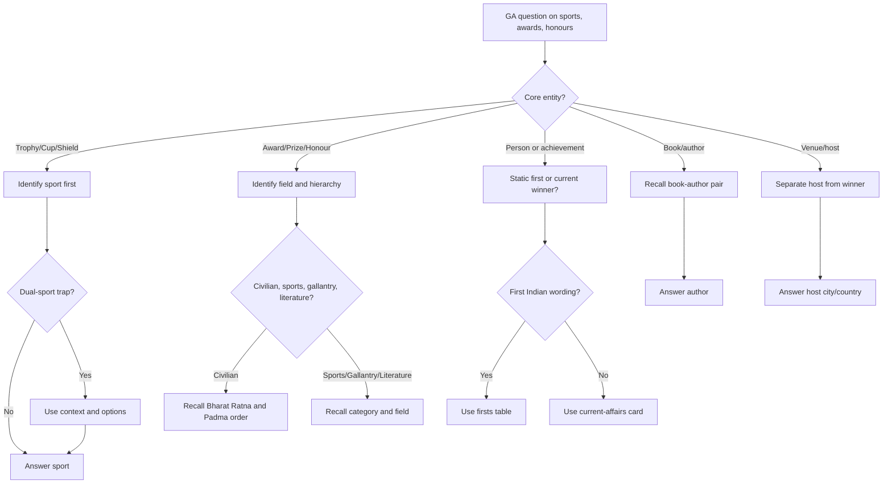

## Concept Ladder

**First Principles**: Sports, awards, and honours questions in SSC CGL test your recall of static facts (trophy-sport pairs, award categories, first Indian achievements) plus dynamic current winners/events. The core skill is rapid, error-free retrieval from a structured mental map.

### Corpus Pressure

The uploaded book-PYQ corpus marks `sports-awards` as a high-return General Awareness recall topic with 353 promoted questions. This topic is not hard because of concepts; it is hard because SSC compresses many similar-looking names into one-line prompts. The scoring plan is therefore strict: classify the entity in 5 seconds, retrieve the pair, and move inside the 36-second GA ceiling.

| Corpus bucket | Promoted questions | What it usually tests | 36-second implication |
|---|---:|---|---|
| `pinnacle-ssc-general-studies-p0076-p0100` | 106 promoted questions | Trophies, sports personalities, firsts, books, awards | Main flashcard pressure zone |
| `pinnacle-ssc-general-studies-p0101-p0125` | 78 promoted questions | National/international sports, honours, events, host/winner pairs | Separate host, winner, venue, and sport |
| `pinnacle-ssc-general-studies-p0576-p0600` | 32 promoted questions | Mixed late-book static GK and award recall | Use as repair set for weaker pairs |
| `pinnacle-ssc-general-studies-p0051-p0075` | 27 promoted questions | Early GS overlap with art, culture, literature, books | Book-author and award-field pairs repeat |
| `pinnacle-ssc-general-studies-p0126-p0150` | 22 promoted questions | Sports-event extensions, first Indian facts, current-static links | Read question year and wording carefully |
| Other mixed GS buckets | 88 promoted questions | Low-frequency option traps across GA | Keep a fallback elimination list |

### First 5-Second Classification

| First cue in question | Bucket | First memory to open |
|---|---|---|
| "Trophy", "Cup", "Shield" | Trophy-Sport Pair | Sport first, then country/event if asked |
| "Award", "honour", "prize" | Award-Field | Field/category and hierarchy |
| "first Indian", "first woman", "first to" | Firsts | Person + year + field |
| "book", "author", "autobiography" | Book-Author | Book title to author, then field |
| "hosted", "venue", "held in" | Host/Venue | Host city/country, not winner |
| "won", "champion", "medal" | Winner/Event | Event + year + winner; use current-affairs brief for changing facts |
| "highest", "rank", "order" | Hierarchy | Bharat Ratna/Padma/Gallantry/Sports award order |

### Full Type Tree for 200/200

1. **Trophy-sport pairs**: Ranji-cricket, Santosh-football, Agha Khan-hockey, Davis-tennis, Thomas/Uber-badminton.
2. **International trophy pairs**: Stanley-ice hockey, Ryder-golf, America's Cup-sailing, Webb Ellis-rugby, Ashes-cricket.
3. **Sports award categories**: Major Dhyan Chand Khel Ratna, Arjuna, Dronacharya, Dhyan Chand lifetime, MAKA Trophy.
4. **Civilian award hierarchy**: Bharat Ratna, Padma Vibhushan, Padma Bhushan, Padma Shri.
5. **Gallantry hierarchy**: Param Vir Chakra, Maha Vir Chakra, Vir Chakra; Ashok Chakra in peacetime.
6. **First Indian facts**: Nobel, Oscar, individual Olympic gold, space, Booker, women-specific firsts.
7. **Book-author pairs**: autobiographies, Booker-winning novels, famous Indian works.
8. **Host-winner separation**: World Cups, Olympics, Asian Games, Commonwealth Games.
9. **Person-sport pairs**: Milkha-athletics, Dhyan Chand-hockey, Viswanathan Anand-chess, Pankaj Advani-billiards/snooker.
10. **Venue/event year traps**: postponed editions, old vs actual hosting year.
11. **Current-static bridge**: latest awards and winners belong in daily current-affairs cards, not static memory alone.
12. **Correctly matched pair format**: every option looks familiar; decide the field before reading all choices.

**Level 1 - Static Pairs**  
- National trophies: Ranji Trophy (cricket), Duleep Trophy (cricket), Santosh Trophy (football), Nehru Trophy (hockey), Agha Khan Cup (hockey), Federation Cup (football/hockey), Durand Cup (football), Davis Cup (tennis), Wimbledon (tennis), Thomas Cup (badminton), Uber Cup (badminton), Sultan Azlan Shah Cup (hockey), Merdeka Cup (football), Canada Cup (football), King's Cup (football), Asian Cup (football), Africa Cup (football), World Cup (various).  
- Awards: Bharat Ratna, Padma Shri/Padma Bhushan/Padma Vibhushan, Gallantry awards (Param Vir Chakra, Ashok Chakra, etc.), National Sports Awards (Major Dhyan Chand Khel Ratna, Arjuna Award, Dronacharya Award, Dhyan Chand Award, Rashtriya Khel Protsahan Puruskar, Maulana Abul Kalam Azad Trophy).  
- International awards: Nobel Prize, Booker Prize, Sahitya Akademi Award, Oscar, Grammy, Pulitzer, etc.

**Level 2 - Associations**  
- Each trophy is tied to a specific sport - e.g., Stanley Cup (ice hockey), Ryder Cup (golf), America's Cup (sailing), Webb Ellis Cup (rugby), Jules Rimet Trophy (football - old World Cup), FIFA World Cup Trophy.  
- Awards have specific fields: Oscars (films), Grammy (music), Booker (fiction), Pulitzer (journalism/letters), Sahitya Akademi (literature - Indian languages).  
- First Indian facts: First Indian in space (Rakesh Sharma), first Indian to win Nobel (Rabindranath Tagore), first Indian woman to win Nobel (Mother Teresa), first Indian to win Oscar (Bhanu Athaiya - Best Costume Design), first Indian to win Booker (Arundhati Roy), first Indian to win Arjuna Award (various - but need to recall specific ones like Dhyan Chand).

**Level 3 - Exam-Level Integration**  
- SSC CGL frequently mixes static with current: "Which award is the highest sports honour?" or "Which trophy is associated with hockey?"  
- Traps: Same trophy name used for different sports (e.g., "Federation Cup" exists for both football and hockey). "Challenge Cup" has multiple versions (badminton and hockey). "World Cup" generic - need sport qualifier.  
- Book-author pair traps: "Wings of Fire" - APJ Abdul Kalam, "My Experiments with Truth" - Gandhi, "The Guide" - RK Narayan, "The Glass Palace" - Amitav Ghosh. SSC CGL often asks both static (book-author) and dynamic (current bestseller author).  
- Current affairs conversion: Any major tournament winner within 12 months of exam is fair game. Keep a running list of: Olympic medalists, World Cup winners, Grand Slam champions, Asian Games/Commonwealth Games top performers.

**Level 4 - 200/200 Mastery**  
- Build a personal flashcard deck for 300+ pairs.  
- For each trophy, remember: sport + country (if international) + first year.  
- For awards: field + latest recipient from the current-affairs brief + category.  
- Use mnemonic: "KAPD" - Khel Ratna, Arjuna, Dronacharya, Dhyan Chand for sports awards; "PVA" - Param Vir Chakra for gallantry; "BRS" - Bharat Ratna for civilian honour.  
- Practise 20 random questions daily. On exam day, answer within 10 seconds per GA question.

## Type System

| Type | Recognition Cue | Method | Speed Target | Trap |
|------|----------------|--------|--------------|------|
| Trophy-Sport Pair | "______ trophy is associated with which sport?" | Recall static pairing from memorised list. | 5 sec | Same trophy for different sports (e.g., Federation Cup). |
| Award-Recipient | "Who won the ______ Award in 2024?" | Retrieve current affairs list. | 8 sec | Stale winner from previous year. |
| First Indian Fact | "First Indian to win ______" | Use static list of "firsts". | 5 sec | "First woman" vs "first man" confusion. |
| Venue-Host | "The 2023 World Cup was hosted by?" | Current affairs recall. | 8 sec | Host vs winner confusion. |
| Book-Author | "Who wrote ______?" | Static pairing. | 5 sec | Author with multiple famous works (e.g., Ruskin Bond). |
| Current Affairs Winner | "Who won the ______ title in 2024?" | Daily current-affairs brief. | 8 sec | Outdated tournament year. |
| Gallantry Award Name | "Param Vir Chakra is awarded for?" | Static definition. | 5 sec | Mixing bravery awards hierarchy. |
| National Sports Award Category | "Arjuna Award is for?" | Static definition. | 5 sec | Confusing Arjuna (performance) with Dronacharya (coaching). |
| Padma Award Rank | "Padma Bhushan is which rank?" | Static ordering: Vibhushan > Bhushan > Shri. | 5 sec | Reverse order trap. |
| Nobel Prize Field | "Nobel Prize in Literature 2023 winner?" | Current + static category. | 8 sec | Assuming Indian winner when it's not. |
| Olympic Host City | "2020 Olympics were held in?" | Static + current. | 5 sec | Year vs actual hosting year (2020 held in 2021). |
| Commonwealth / Asian Games | "Which country won most medals in 2022 CWG?" | Current affairs. | 8 sec | Medal tally vs India's rank. |
| Championship Placing | "India won ______ in 2023 Hockey World Cup?" | Current sports result. | 8 sec | Bronze vs Silver confusion. |
| Billiards / Snooker | "World Billiards Championship trophy?" | Static pair - may be rare. | 10 sec | Misidentification as snooker. |

## Speed Methods

**Recall Tables** - Memorise these compressed lists.

**National Trophies (Sports)**  
| Sport | Trophy(s) |
|-------|-----------|
| Cricket | Ranji, Duleep, Irani, Deodhar, Vijay Hazare, NKP Salve (Champions Trophy), ICC World Cup (if India hosted) |
| Football | Santosh, Durand, Federation Cup, I-League shield, Super Cup |
| Hockey | Nehru Cup, Agha Khan Cup, Prime Minister's Gold Cup, World Cup (Odisha 2023) |
| Badminton | Thomas Cup (men), Uber Cup (women), Sudirman Cup (mixed) |
| Lawn Tennis | Davis Cup, Wimbledon (title), US Open, French Open, Australian Open |
| Table Tennis | Swaythling Cup (men), Corbillon Cup (women) |
| Golf | Ryder Cup, Walker Cup |

**International Trophies**  
| Trophy | Sport |
|--------|-------|
| Jules Rimet | Football (old WC) |
| FIFA World Cup | Football |
| Davis Cup | Tennis |
| America's Cup | Sailing |
| Stanley Cup | Ice Hockey |
| Webb Ellis Cup | Rugby Union |
| Thomas Cup | Badminton (men) |
| Uber Cup | Badminton (women) |
| Sultan Azlan Shah Cup | Hockey |
| Merdeka Cup | Football |
| King's Cup | Football |
| Ashes | Cricket (England-Australia) |
| Border-Gavaskar Trophy | Cricket (India-Australia) |
| Benson & Hedges Cup | Cricket (obsolete) |

**Award Categories**  
| Award | Field |
|-------|-------|
| Bharat Ratna | Civilian highest |
| Padma Awards | Civilian (art, social work, public affairs, etc.) |
| Param Vir Chakra | Gallantry highest |
| Arjuna Award | Sports performance |
| Dronacharya Award | Sports coaching |
| Dhyan Chand Award | Lifetime achievement in sports |
| Nobel Prize | Various (Peace, Literature, Physics, Chemistry, Medicine, Economics) |
| Booker Prize | Fiction (English) |
| Sahitya Akademi Award | Literature (Indian languages) |
| Oscar | Films |
| Grammy | Music |
| Pulitzer | Journalism, Letters, Music |
| Jnanpith Award | Literature (Indian) |

**Decision Rules for Book-Author Questions**  
- If you see a quote or famous phrase, match to its book: "The only thing we have to fear is fear itself" - not Indian, but SSC may include. Stick to Indian authors.  
- Common pair: "The God of Small Things" - Arundhati Roy, "Midnight's Children" - Salman Rushdie, "The Inheritance of Loss" - Kiran Desai, "The White Tiger" - Aravind Adiga, "A Suitable Boy" - Vikram Seth, "The Immortals of Meluha" - Amish Tripathi.  
- Autobiographies: "Wings of Fire" - APJ Abdul Kalam, "My Life" - Abhinav Bindra, "Playing It My Way" - Sachin Tendulkar, "The Test of My Life" - Yuvraj Singh, "Unstoppable" - My Life So Far (PV Sindhu).  

**Step-by-Step Algorithm for Trophy-Sport Identification**  
1. Read the trophy name.  
2. Is it a common sports term? (e.g., Cup, Shield, Trophy, Prize).  
3. Recall the most associated sport.  
4. If multiple sports exist (e.g., Federation Cup), look for context clues: year, venue, or any mention of "India". If no clue, rely on SSC favourites - usually hockey or football.  
5. Eliminate options: Example - "Agha Khan Cup" is hockey, not cricket.  

**Current Affairs Rapid Recall** - Keep the daily current-affairs brief updated for:  
- Olympic, Asian Games, Commonwealth Games and World Championship medal winners.  
- World Cup winners in cricket, hockey, football, badminton, tennis and chess.  
- Major Dhyan Chand Khel Ratna, Arjuna, Dronacharya and Dhyan Chand award recipients.  
- Padma awardees in sports, literature, public affairs, science and social work.  
- New books by national leaders, athletes, judges, economists and public figures.

**Time Management in GA** - Tier-I gives 15 minutes for the 25-question General Awareness section, so the average ceiling is 36 seconds per question. Sports-awards should usually be faster: 5 seconds to classify the entity, 5-10 seconds to retrieve the pair, and then move. If a dynamic winner is not in memory immediately, mark it for later instead of spending the section timer on one recall gap.

## Trap Table

| Trap | Trigger Wording | Wrong Move | Correct Move | Repair Drill |
|------|----------------|------------|--------------|-------------|
| Same Trophy Different Sport | "Federation Cup is associated with which sport?" | Answer football only | Remember both football and hockey; pick based on context or examine other options | Drill: List trophies with dual sports, e.g., Federation Cup, Challenge Cup |
| Stale Winner | "Who won the 2023 Nobel Peace Prize?" | Narges Mohammadi? Wrong if question asks for 2024 | Verify year in wording; if year not given, assume latest. If unsure, use static recall of recent winners | Practice: every week update a "current winners" sheet and test yourself |
| First Woman vs First Man | "First Indian woman to win an Olympic medal?" | Answer PV Sindhu (she is first woman to win silver in badminton, but not first woman overall) | Correct: Karnam Malleswari (bronze 2000 weightlifting) and thereafter list | Create a "Firsts" table with gender and year |
| Book Author With Multiple Works | "Who wrote 'The Guide'?" | Answer RK Narayan (correct) but possible confusion with "The Bachelor of Arts" same author | Associate each book strongly with its author; use mnemonic "GNRC" for Guide-Narayan | Do book-author matching drills; cover all major works of 20 Indian authors |
| Host vs Winner | "2023 ODI Cricket World Cup was hosted by?" | Answer Australia (winner is Australia) but host was India | Always note the word "hosted" vs "won" | Practise reading news headlines and distinguishing host, winner, runner-up |
| Award Hierarchy Reverse | "Which is higher: Padma Shri or Padma Bhushan?" | Answer Padma Shri (because Shri is often used first in list) | Correct: Padma Bhushan is third rank; Padma Vibhushan is second; Bharat Ratna is first | Repeatedly chant order: VR > Vibhushan > Bhushan > Shri |
| Year vs Actual Edition | "2020 Olympics were held in?" | Answer 2020 | Correct: held in 2021 due to pandemic | Note: all postponed/historical editions; create a list of such exceptions |
| Mixed Field Award | "Nobel Prize in Economics 2023 winner?" | Answer an Indian economist | Nobel Economics often non-Indian; verify | Drill recent 3-4 Nobel winners in each category |
| Same Name Different Person | "Milkha Singh is associated with?" | Answer cricket | Correct: athletics (sprint) | Reinforce: Milkha Singh - "Flying Sikh" - athletics |
| National Sports Awards Year Mix-up | "Who received the Khel Ratna in 2021?" | Answer Neeraj Chopra (he got in 2021 along with others) but also Ravi Dahiya | Remember multiple recipients per year; list them | For every year, learn top 2-3 names |
| Venue of Multiple Editions | "Where was the 2014 Commonwealth Games held?" | Answer Delhi (2010) | Correct: Glasgow | Make a timeline of major event venues |
| Spelling Variations | "Pulitzer" vs "Pulitzer Prize"? | Misspelling | Correct spelling: Pulitzer. Also "Sahitya Akademi" vs "Sahitya Academy" | Write each award name 5 times |
| Static vs Dynamic | "The trophy given for the Wimbledon men's singles is called?" | Answer "Wimbledon Trophy" but official name is "Gentlemen's Singles Trophy" (also known as Gold Cup) but SSC may ask "Wimbledon Cup" | Know the official name as per SSC patterns: "Challenge Cup" for men's, "Venus Rosewater Dish" for women's | SSC has asked "Challenge Cup" - static pair |
| India's Position in Global Ranking | "India's rank in the 2023 Global Hunger Index?" | Answer based on static memory that India's rank is poor (107 in 2023) but correct is specific number | Use current static: 111th in 2023 (but may vary). Always update with latest report | Keep a running list of India's key global indices (HDI, GHI, CPI, etc.) |

## Flowchart

## Solved Examples

**Example 1**  
Question: The Agha Khan Cup is associated with which sport?  
Options: (a) Cricket, (b) Football, (c) Hockey, (d) Badminton  
Explanation: Agha Khan Cup is a hockey trophy (domestic Indian hockey).  
Answer: (c) Hockey

**Example 2**  
Question: Who was the first Indian to win the Nobel Prize?  
Options: (a) CV Raman, (b) Rabindranath Tagore, (c) Amartya Sen, (d) Mother Teresa  
Explanation: Tagore won the Nobel Prize in Literature in 1913.  
Answer: (b) Rabindranath Tagore

**Example 3**  
Question: The Durand Cup is related to which sport?  
Options: (a) Hockey, (b) Football, (c) Cricket, (d) Tennis  
Explanation: Durand Cup is one of the oldest football tournaments in India.  
Answer: (b) Football

**Example 4**  
Question: Dronacharya Award is given for?  
Options: (a) Lifetime achievement in sports, (b) Outstanding performance in sports, (c) Excellence in coaching, (d) Best sports administrator  
Explanation: Dronacharya Award recognizes contributions to sports coaching.  
Answer: (c) Excellence in coaching

**Example 5**  
Question: Who wrote the book 'Wings of Fire'?  
Options: (a) APJ Abdul Kalam, (b) Vikram Seth, (c) RK Narayan, (d) Chetan Bhagat  
Explanation: 'Wings of Fire' is the autobiography of APJ Abdul Kalam.  
Answer: (a) APJ Abdul Kalam

**Example 6**  
Question: The 2022 Asian Games were postponed to 2023 due to pandemic? They were held in?  
Options: (a) Jakarta, (b) Hangzhou, (c) Tokyo, (d) Guangzhou  
Explanation: The 19th Asian Games were originally scheduled for 2022 in Hangzhou, China, but held in 2023.  
Answer: (b) Hangzhou

**Example 7**  
Question: Which of the following pairs is incorrectly matched? (a) Thomas Cup - Badminton, (b) Uber Cup - Badminton, (c) Sudirman Cup - Badminton, (d) Davis Cup - Badminton  
Explanation: Davis Cup is associated with Tennis, not Badminton.  
Answer: (d) Davis Cup - Badminton

**Example 8**  
Question: The first Indian to win an individual Olympic gold medal?  
Options: (a) Abhinav Bindra, (b) Neeraj Chopra, (c) Milkha Singh, (d) P.T. Usha  
Explanation: Abhinav Bindra won gold in 10m Air Rifle in 2008 Beijing Olympics.  
Answer: (a) Abhinav Bindra (though Neeraj Chopra also won gold in 2020 Tokyo - but Bindra was first). Note: Both are firsts - Bindra first individual gold. If options include both, choose Bindra as per static chronology.

**Example 9**  
Question: Which award is considered the highest gallantry award in India?  
Options: (a) Maha Vir Chakra, (b) Param Vir Chakra, (c) Ashok Chakra, (d) Shaurya Chakra  
Explanation: Param Vir Chakra is India's highest military decoration in wartime.  
Answer: (b) Param Vir Chakra

**Example 10**  
Question: The book "The God of Small Things" is written by?  
Options: (a) Kiran Desai, (b) Arundhati Roy, (c) Jhumpa Lahiri, (d) Anita Desai  
Explanation: Arundhati Roy's debut novel won the Booker Prize in 1997.  
Answer: (b) Arundhati Roy

**Example 11**  
Question: Major Dhyan Chand Khel Ratna Award is given in which field?  
Options: (a) Literature, (b) Sports, (c) Music, (d) Science  
Explanation: Major Dhyan Chand Khel Ratna is India's highest sporting honour.  
Answer: (b) Sports

**Example 12**  
Question: Which of the following trophies is NOT associated with football? (a) FIFA World Cup, (b) Jules Rimet Trophy, (c) Stanley Cup, (d) European Cup  
Explanation: Stanley Cup is for ice hockey.  
Answer: (c) Stanley Cup

**Example 13**  
Question: Thomas Cup is associated with which sport?  
Options: (a) Badminton, (b) Tennis, (c) Hockey, (d) Golf  
Explanation: Thomas Cup is the men's team championship in badminton. Uber Cup is the women's team championship.  
Answer: (a) Badminton

**Example 14**  
Question: Uber Cup is associated with:  
Options: (a) Women's badminton, (b) Men's badminton, (c) Women's hockey, (d) Men's football  
Explanation: Uber Cup is the women's badminton team competition. Thomas Cup is the men's equivalent.  
Answer: (a) Women's badminton

**Example 15**  
Question: The Ashes is a cricket series played between:  
Options: (a) India and Australia, (b) England and Australia, (c) India and England, (d) South Africa and Australia  
Explanation: The Ashes is the historic Test cricket rivalry between England and Australia.  
Answer: (b) England and Australia

**Example 16**  
Question: Ryder Cup is associated with which sport?  
Options: (a) Golf, (b) Rugby, (c) Sailing, (d) Boxing  
Explanation: Ryder Cup is a major golf team competition.  
Answer: (a) Golf

**Example 17**  
Question: America's Cup is associated with which sport?  
Options: (a) Basketball, (b) Sailing, (c) Ice hockey, (d) Tennis  
Explanation: America's Cup is associated with yacht racing/sailing.  
Answer: (b) Sailing

**Example 18**  
Question: Webb Ellis Cup is awarded in which sport?  
Options: (a) Rugby Union, (b) Football, (c) Cricket, (d) Hockey  
Explanation: The Rugby World Cup winner receives the Webb Ellis Cup.  
Answer: (a) Rugby Union

**Example 19**  
Question: Arjuna Award is primarily given for:  
Options: (a) Sports performance, (b) Sports coaching, (c) Literature, (d) Gallantry  
Explanation: Arjuna Award recognises outstanding performance in sports. Dronacharya Award is for coaching.  
Answer: (a) Sports performance

**Example 20**  
Question: Dronacharya Award is associated with:  
Options: (a) Sports coaching, (b) Sports lifetime achievement, (c) Civilian service, (d) Journalism  
Explanation: Dronacharya Award recognises outstanding coaches in sports.  
Answer: (a) Sports coaching

**Example 21**  
Question: Which is the highest civilian award in India?  
Options: (a) Padma Shri, (b) Padma Bhushan, (c) Padma Vibhushan, (d) Bharat Ratna  
Explanation: Bharat Ratna is India's highest civilian award.  
Answer: (d) Bharat Ratna

**Example 22**  
Question: Which of the following is the correct Padma award order from higher to lower?  
Options: (a) Padma Shri, Padma Bhushan, Padma Vibhushan, (b) Padma Vibhushan, Padma Bhushan, Padma Shri, (c) Padma Bhushan, Padma Shri, Padma Vibhushan, (d) Padma Vibhushan, Padma Shri, Padma Bhushan  
Explanation: After Bharat Ratna, the Padma order is Padma Vibhushan, Padma Bhushan, Padma Shri.  
Answer: (b) Padma Vibhushan, Padma Bhushan, Padma Shri

**Example 23**  
Question: Who was the first Indian woman to win an Olympic medal?  
Options: (a) P. T. Usha, (b) Karnam Malleswari, (c) Saina Nehwal, (d) P. V. Sindhu  
Explanation: Karnam Malleswari won bronze in weightlifting at the 2000 Sydney Olympics.  
Answer: (b) Karnam Malleswari

**Example 24**  
Question: "Playing It My Way" is the autobiography of:  
Options: (a) M. S. Dhoni, (b) Sachin Tendulkar, (c) Kapil Dev, (d) Sunil Gavaskar  
Explanation: "Playing It My Way" is Sachin Tendulkar's autobiography.  
Answer: (b) Sachin Tendulkar

**Example 25**  
Question: Which of the following pairs is correctly matched?  
Options: (a) Milkha Singh - Cricket, (b) Viswanathan Anand - Chess, (c) Dhyan Chand - Football, (d) Pankaj Advani - Tennis  
Explanation: Viswanathan Anand is associated with chess. Milkha Singh is athletics, Dhyan Chand is hockey, and Pankaj Advani is billiards/snooker.  
Answer: (b) Viswanathan Anand - Chess

## PYQ Mapping

Based on the book-PYQ corpus (353 promoted questions in sports-awards from this source), the distribution shows heavy concentration in the following areas:  
- National sports trophies (especially Ranji, Duleep, Santosh, Nehru) - around 30% of questions.  
- Indian civilian and sports awards (Bharat Ratna, Padma, Khel Ratna, Arjuna) - 25%.  
- Book-author pairs (autobiographies and famous novels) - 15%.  
- First Indian facts (first woman, first Olympic medalist, first in space) - 12%.  
- International trophies and awards (Nobel, Oscar, World Cup winners) - 10%.  
- Current affairs winners/hosts - 8%.

Practice Route: To score 200/200, you should:  
1. Complete the dedicated topic test at /exams/ssc-cgl/topics/sports-awards (covers static pairs).  
2. Follow the daily current affairs update at /exams/ssc-cgl/current-affairs (especially for the last 12 months).  
3. Take the speed sprint test at /exams/ssc-cgl/tests/ssc-cgl-general-awareness-speed-sprint (designed to simulate exam pressure).  

For PYQs themselves, do not rely on memorizing 353 questions individually; instead focus on patterns: every question that asks "which sport" for a trophy comes from the list of 20 core trophies. Every "first Indian" question comes from a list of about 40 feats. Use spaced repetition for these lists.

## 200/200 Drill

**Timed Micro-Drills** (each set done in under 2 minutes)

**Drill 1 (Static Pairs)** - Write the sport for each trophy in 10 seconds each.  
1. Ranji Trophy  
2. Santosh Trophy  
3. Nehru Cup  
4. Thomas Cup  
5. Davis Cup  
6. Stanley Cup  
7. America's Cup  
8. Sultan Azlan Shah Cup  
Answers: (1) Cricket, (2) Football, (3) Hockey, (4) Badminton, (5) Tennis, (6) Ice Hockey, (7) Sailing, (8) Hockey

**Drill 2 (Award Categories)** - Match the award to its field in 10 seconds.  
1. Arjuna Award  
2. Dronacharya Award  
3. Dhyan Chand Award  
4. Jnanpith Award  
5. Sahitya Akademi Award  
6. Pulitzer Prize  
7. Grammy  
Answers: (1) Sports performance, (2) Coaching, (3) Lifetime achievement in sports, (4) Literature (Indian languages), (5) Literature (Indian languages), (6) Journalism/letters, (7) Music.

**Drill 3 (First Indian Facts)** - In 15 seconds each, name the first Indian to:  
1. Climb Mount Everest  
2. Win an Olympic gold (individual)  
3. Win a Nobel Prize  
4. Win an Oscar  
5. Win a Booker Prize  
6. Go into space  
Answers: (1) Tenzing Norgay (with Edmund Hillary), (2) Abhinav Bindra (2008 shooting), (3) Rabindranath Tagore (1913 Literature), (4) Bhanu Athaiya (1982 Costume Design), (5) Arundhati Roy (1997), (6) Rakesh Sharma (1984)

**Drill 4 (Current Affairs Quick Fire)** - Update from your notes for the last 12 months. Example:  
- 2024 Olympic gold (shooting, badminton, etc.)?  
- 2023 Cricket World Cup winner?  
- 2024 Rajiv Gandhi Khel Ratna winner?  
- 2024 Padma awardees in sports?  

**Repair Rules**  
- If you miss a static pair, add it to a "Repair List" and review before next session.  
- For current affairs, set a weekly reminder to refresh the winners list.  
- For book-author, use mnemonic sentences: e.g., "Roy wrote the God of Small Things in Roy's small god".  
- Trap: never assume a trophy is for a single sport unless you are sure; always think of the dual-sport list.  

**Final Recall Rule**: In the exam, if an award or trophy is unfamiliar, use elimination. Most wrong options are mismatched by field, such as Durand Cup for cricket. With 353 book-backed practice questions behind this topic, the goal is to make every core trophy, award field, first Indian fact, and book-author pair automatic.
<!-- SSC-FINAL-PRACTICE-QUEUE:START -->
## Final Practice Queue

1. Start one-by-one practice: [Sports, Awards, and Honours practice](/exams/ssc-cgl/practice/sports-awards). Finish every question in this topic bank, not just the samples in the note.
2. Move to timed sets: [SSC CGL tests](/exams/ssc-cgl/tests?topic=sports-awards). Use topic drills first, then section mocks once accuracy is stable.
3. Repair every miss immediately: record the error label, redo 20 mixed questions from the same topic, then retest after 24 hours.
4. 200/200 rule: do not mark this topic exam-ready until correct answers come within 36 seconds and wrong answers are explained without looking at the solution.

<!-- SSC-FINAL-PRACTICE-QUEUE:END -->
