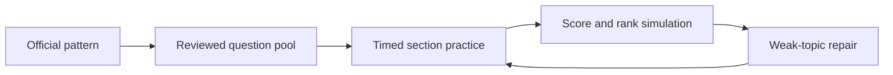

# SSC CGL Tier-I 200/200 Overview

The 2026 Tier-I target is simple to state and hard to execute: 100 questions, 200 marks, four sections, 15 minutes per section, and -0.50 for each wrong answer. The study system treats that as a speed-and-accuracy game, not a passive reading project.

## Scoring Model

| Action | Marks | Training implication |
|---|---:|---|
| Correct answer | +2 | Accuracy compounds fastest when the first reading is disciplined. |
| Wrong answer | -0.5 | Guess only when elimination leaves a real probability edge. |
| Unattempted | 0 | Leaving a low-confidence trap can beat a blind attempt. |

## Practice Flow

## Daily Operating Rule

Start with timed MCQs, repair the weakest topic immediately, then read only the rule that explains the mistake. Current affairs should become one recall hook and one MCQ seed, not a long article dump.

## PYQ Link Queue

- Reviewed practice routes: `/exams/ssc-cgl/tests`
- Topic routes: `/exams/ssc-cgl/topics`
- Import review gate: `/exams/ssc-cgl/import-review`
- Current affairs route: `/exams/ssc-cgl/current-affairs`
