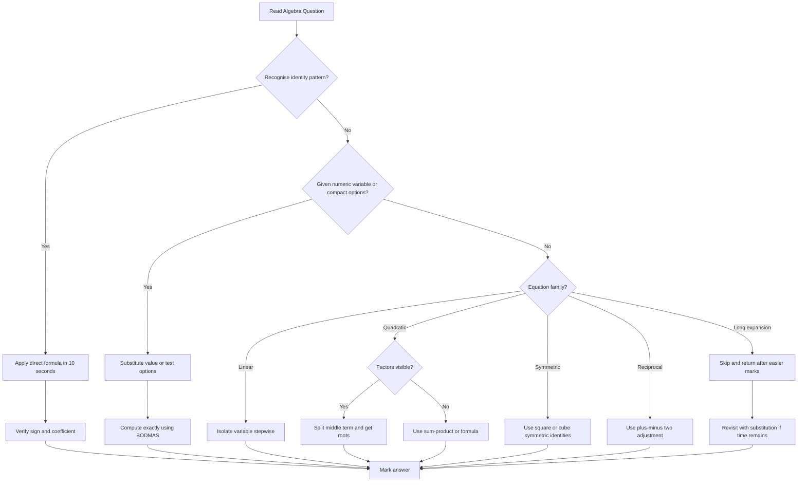

## Corpus Pressure

This note is built around the current promoted SSC CGL book-PYQ corpus slice for `algebra`: **501 promoted questions**. The dominant cluster is **Algebra direct (477 questions)**, supported by smaller cross-over clusters from `ssc-maths-6800-mcq-p0621-p0640` (13 questions), `ssc-maths-6800-mcq-p0041-p0060` (6 questions), and light spillover from Number System and arithmetic setup pages. That means algebra cannot be treated as a low-frequency formula page. It is a repeatable score bank where the exam usually rewards instant pattern recognition, sign discipline, and the ability to avoid expansion.

For a 50/50 Quant target, every algebra question should be classified in the first five seconds:

| First Visual Clue | Immediate Bucket | One-Line Action |
|-------------------|------------------|-----------------|
| `a+b`, `ab`, `a^2+b^2`, `a^3+b^3` | Identity value | Write the identity before substitution |
| `x + 1/x`, `x - 1/x` | Reciprocal family | Use the +/-2 square rule and cube recurrence |
| `ax^2+bx+c=0` | Quadratic | Split middle term; use sum/product if faster |
| Fractions with variable in denominator | Rational equation | Cross-multiply with brackets, then check denominator |
| Long expression with options | Option/substitution route | Test options before expanding |
| `a+b+c`, `ab+bc+ca`, `abc` | Symmetric expression | Convert through square/cube symmetric identities |

## Concept Ladder

**First Principles (Level 0):**  
Algebra is the language of variables and operations. The core idea: represent unknown numbers with letters (x, y, a, b) and manipulate equations to find their values. Every operation must preserve equality: do the same thing to both sides.

**Level 1 - Basic Operations & Linear Equations**  
- One-step: `3x = 15` -> divide by 3 -> `x = 5`.  
- Two-step: `2x + 5 = 13` -> subtract 5, then divide -> `x = 4`.  
- Variable on both sides: `5x - 3 = 3x + 7` -> bring terms -> `2x = 10` -> `x = 5`.  
- Cross-multiplication for fractions: `(2x+1)/3 = (x-2)/5` -> `5(2x+1)=3(x-2)` -> solve.

**Level 2 - Algebraic Identities (SSC Goldmine)**  
You must recall these on sight. No expansion, direct formula substitution.  
1. `(a+b)^2 = a^2 + b^2 + 2ab`  
2. `(a-b)^2 = a^2 + b^2 - 2ab`  
3. `a^2 - b^2 = (a+b)(a-b)`  
4. `(a+b)^3 = a^3 + b^3 + 3ab(a+b)`  
5. `(a-b)^3 = a^3 - b^3 - 3ab(a-b)`  
6. `a^3 + b^3 = (a+b)(a^2 - ab + b^2)`  
7. `a^3 - b^3 = (a-b)(a^2 + ab + b^2)`  
8. `(a+b+c)^2 = a^2+b^2+c^2+2(ab+bc+ca)`

**Level 3 - x + 1/x Family**  
Questions that give `x + 1/x = k` and ask `x^2 + 1/x^2`, `x^3 + 1/x^3`, etc.  
- `x^2 + 1/x^2 = (x+1/x)^2 - 2`  
- `x^3 + 1/x^3 = (x+1/x)^3 - 3(x+1/x)`  
- `x^4 + 1/x^4 = (x^2+1/x^2)^2 - 2`  
If given `x - 1/x = k`, use `x^2 + 1/x^2 = (x-1/x)^2 + 2`.

**Level 4 - Quadratic Equations & Roots**  
Standard form: `ax^2 + bx + c = 0`.  
- Factorization: split middle term, product = a*c, sum = b.  
- Roots: alpha, beta. Then `alpha + beta = -b/a`, `alpha beta = c/a`.  
- Quadratic from roots: `x^2 - (sum)x + product = 0`.  
- Discriminant D = `b^2 - 4ac`. If D>=0, real; if D>0, two distinct; if D=0, equal; if D<0, complex (not in SSC).  
- For expressions like `alpha^2 + beta^2`, use `(alpha + beta)^2 - 2 alpha beta`; for `(alpha - beta)^2`, use `(alpha + beta)^2 - 4 alpha beta`.

**Level 4A - Factor Theorem and Remainder Feel**  
When the expression is a polynomial and the question asks divisibility by `(x-a)`, do not expand blindly. Put `x=a`. If the value becomes 0, `(x-a)` is a factor. If the value is non-zero, that value is the remainder. SSC rarely asks abstract proof; it asks direct recognisable checks.

**Level 4B - Surd/Root-Linked Algebra**  
Some questions hide algebra inside `sqrt` expressions. Use the same identity logic: if `sqrt(a) + sqrt(b)` is given, square it carefully and keep the `2 sqrt(ab)` term. If options are numerical and far apart, approximate only after writing the exact transformation.

**Level 5 - Symmetric Expressions & Factorisation**  
- Symmetric sums: all variables treated equally. Use given `a+b+c`, `ab+bc+ca`, `abc` to find higher powers.  
- Factorisation of cubic/quadratic: by grouping, by identity recognition.  
- `a^4 + b^4` can be expressed as `(a^2+b^2)^2 - 2(ab)^2`.

**Level 6 - Exam Integration (36-second plan)**  
In the exam, you have ~36 seconds per Algebra question. The flow:  
1. Read the expression - is it one of the identity patterns? If yes, apply formula directly (10 sec).  
2. If not, try substitution of given values from options (especially if variable is numeric).  
3. If equation solving, isolate variable using inverse operations in steps.  
4. If quadratic, check factorisation first; if not easy, use sum/product or split.  
5. For `x+1/x` type - immediately write the transform.  
6. If stuck or large expansion, skip and return after scanning other Qs.

**Always prefer formula over expansion. Always verify with one option test when answer is numeric.**

### First 5-Second Classification

Do this before solving:

1. Underline what is **given**: sum, difference, product, roots, full equation, or expression value.
2. Circle what is **asked**: expression value, factor, roots, sum/product of roots, or simplified form.
3. Decide the route:
   - identity route if two parts of an identity are visible;
   - reciprocal route if `x` and `1/x` appear together;
   - factor route if a polynomial has small coefficients;
   - option route if the answer choices are compact;
   - skip route if it demands expansion and no pattern is visible.

The target is not to solve all algebra in 36 seconds by force. The target is to finish every standard type inside 36 seconds and leave only genuinely long manipulations for return time.

## Type System

| Type | Recognition Clue | Method | Speed Target | Trap |
|------|------------------|--------|--------------|------|
| Linear Equation | Variable on one or both sides; no squares | Isolate variable using inverse operations | 15 sec | Sign error while transposing |
| Quadratic Factorisation | `ax^2 + bx + c`, coefficient small | Split middle term or use sum-product | 20 sec | Wrong factor pairs; signs reversed |
| Quadratic Roots from equation | Find ,  given equation | Factor or use formula `x = [-b +/- sqrt(D)]/(2a)` | 20 sec | Forgetting +/- sign |
| Identity - (a+b)^2 | Given a+b and ab, ask a^2+b^2 | Use `(a+b)^2 - 2ab` | 10 sec | Forgetting to subtract 2ab (instead add) |
| Identity - (a-b)^2 | Given a-b and ab, ask a^2+b^2 | Use `(a-b)^2 + 2ab` | 10 sec | Subtracting 2ab instead of adding |
| Identity - (a+b+c)^2 | Given sum and pairwise product, ask squares sum | Use `(a+b+c)^2 - 2(ab+bc+ca)` | 15 sec | Forgetting to multiply sum of products by 2 |
| Cube Identity | Given a+b and ab, ask a^3+b^3 | Use `(a+b)^3 - 3ab(a+b)` | 15 sec | Sign or coefficient error |
| x + 1/x family | Expression `x + 1/x` or `x - 1/x` given | Square / cube with +/-2 adjustment | 10 sec | Using wrong sign for `x-1/x` |
| Simple substitution | Variable equals numeric value | Plug value and compute | 10 sec | Order of operations (BODMAS) |
| Factorisation (cubic/group) | Expression with four terms | Group pairs, factor common | 25 sec | Missing sign when factor |
| Symmetric expression | `a+b+c` etc. given; ask `a^2+b^2+c^2` | Use identity combinations | 15 sec | Incorrect coefficient for ab term |
| Ratio with addition | `(a+b)/c = 3` etc. | Isolate variables or test options | 20 sec | Treating as two equations when not |
| Infinite series / pattern | `1/(1+1/(1+x))` type | Simplify stepwise; substitution works | 30 sec | Getting lost in nested fractions |
| Zero / non-zero constraints | `a^2 + b^2 = 0` -> a=0,b=0 | Use property that sum of squares =0 implies each zero | 5 sec | Forgetting that squares are non-negative |

## Speed Methods

**Recall Table - Core Identities** (Memorise, not derive)  

| Identity | Short Formula |
|----------|---------------|
| Square of sum | `(a+b)^2 = a^2 + b^2 + 2ab` |
| Square of diff | `(a-b)^2 = a^2 + b^2 - 2ab` |
| Diff of squares | `a^2 - b^2 = (a+b)(a-b)` |
| Cube of sum | `(a+b)^3 = a^3 + b^3 + 3ab(a+b)` |
| Cube of diff | `(a-b)^3 = a^3 - b^3 - 3ab(a-b)` |
| Sum of cubes | `a^3+b^3 = (a+b)(a^2 - ab + b^2)` |
| Diff of cubes | `a^3-b^3 = (a-b)(a^2 + ab + b^2)` |
| Square of three | `(a+b+c)^2 = a^2+b^2+c^2+2(ab+bc+ca)` |

**Decision Rules - 36-second attempt plan**  

- **Direct formula**: When the question matches any of the above identities exactly (given two parts, ask third). Use formula instantly. Time: 10 sec.  
- **Option testing**: For linear equations or simple quadratics where options are small integers, substitute each option into the equation. Pick the one that satisfies. Example: `3x+7=28`, try options: x=5 -> 22; x=6 -> 25; x=7 -> 28 correct. Time: 20 sec.  
- **Approximation**: Not typical in algebra; use only when roots involve sqrt and options are far apart. Estimate: `sqrt(2) ~ 1.4`.  
- **Substitution**: If variable is given a specific numeric value, plug and compute. Also for expressions like `x + 1/x = 5`, you can assume `x = (5 +/- sqrt21)/2` but faster to use formula.  
- **Skip-and-return**: If the expression is long and no identity is visible (e.g., `(x^2+3x+2)/(x+1)` with no options to test), mark for review, do next, return later. Don't exceed 50 seconds.  

**Step-by-Step Algorithm for x+1/x family**  
1. Write given value: say `x + 1/x = p`.  
2. To find `x^2 + 1/x^2`: compute `(p^2 - 2)`.  
3. To find `x^3 + 1/x^3`: compute `(p^3 - 3p)`.  
4. If given `x - 1/x = q`, then `x^2 + 1/x^2 = q^2 + 2`.  
5. To find `x^4 + 1/x^4`: square result of step 2, subtract 2: `(p^2-2)^2 - 2`.  

**Step-by-Step Algorithm for Quadratic Roots (without factorising)**  
1. Equation: `ax^2 + bx + c = 0`.  
2. If `a=1`, find two numbers that multiply to `c` and add to `-b` (since sum of roots = -b).  
3. If `a!=1`, use sum = `-b/a`, product = `c/a`. Test integer factor pairs of product with correct sum.  
4. For any root: `x = (-b +/- (b^2-4ac))/(2a)` only as last resort (time heavy).  

**When to use direct formula vs. option testing:**  
- Direct formula: identity questions (90% of SSC algebra).  
- Option testing: if formula not obvious, equation small, or options are compact numbers 0-20.  
- Always prefer option testing for "find the value of" with given numeric variable, because you avoid manipulation errors.

## Trap Table

| Trap | Trigger Wording | Wrong Move | Correct Move | Repair Drill |
|------|-----------------|------------|--------------|--------------|
| Sign error in square expansion | "Find (a - b)^2" | Write a^2 + b^2 - ab | Use `(a-b)^2 = a^2 + b^2 - 2ab` | Write the identity 5 times daily |
| Forgetting 2ab in (a+b)^2 | "Given a+b=5, ab=6, find a^2+b^2" | Compute 25 - 6 = 19 | Subtract 2ab: 25 - 12 = 13 | Always do `-2ab` for square of sum |
| Adding instead of subtracting for (a-b)^2 | "Given a-b=3, ab=10, find a^2+b^2" | Compute 9 - 20 = -11 | Use `+2ab`: 9 + 20 = 29 | Drill: `(a-b)^2 + 2ab = a^2+b^2` |
| Factorisation sign flip | "Factor x^2 - 5x + 6" | Write (x-2)(x-3) but sign of middle term wrong | Correct: (x-2)(x-3) expands to x^2 -5x +6 | Always check expansion mentally |
| Mistaking sum of squares identity | "x^2 + y^2 = 25, xy = 12, find x+y" | Take sqrt(25) =5 | Use (x+y)^2 = x^2+y^2+2xy =25+24=49 -> x+y=+/-7 | Remember the +/- and the 2xy |
| Using wrong identity for x-1/x | "If x - 1/x = 3, find x^2 + 1/x^2" | Compute 3^2 - 2 = 7 | Compute 3^2 + 2 = 11 | Memorise: plus 2 for minus form |
| Forgetting +/- in root extraction | "If a^2 = 16, find a" | Write a=4 | Write a = +/-4 | Always consider negative, especially if no context |
| Discriminant neglect | "Find roots of 2x^2 - 4x + 2 = 0" | Factor and get distinct roots | Check D= b^2-4ac=16-16=0 -> equal roots | Always compute D before factor |
| Incorrect cross multiplication | "Solve 3/(x+1) = 2/(x-1)" | Multiply 3(x-1)=2(x+1) but forget sign | Correct: 3(x-1)=2(x+1) | Keep parentheses |
| Order of operations in substitution | "If x= -2, find x^3 - x^2 + 4" | Treat `x^2` as negative | `(-2)^3 = -8`, `(-2)^2 = 4`, so the subtraction term stays `-4` | Always compute powers first with correct sign |
| Assuming only one root for linear | "If 2x=10, find x" | Write x=10 | x=5 | Check by substitution |
| Wrong expansion of (a+b)(c+d) | "Multiply (x+3)(x-2)" | x*x + x*(-2) + 3*x + 3*(-2) but forget minus | x^2 -2x +3x -6 = x^2 + x -6 | FOIL method |
| Forgetting ab in cube identity | "Find a^3+b^3" given a+b and ab | Use cube of sum directly | Use (a+b)^3 - 3ab(a+b) | Write formula on top of answer sheet |
| Skipping negative sign in coefficient | "Solve 4x - 5 = 2x + 3" | Add 5 to both sides wrong | 4x -2x = 3+5 -> 2x=8 -> x=4 | Always move variable terms to one side stepwise |
| Mixing sum and product of roots | "Equation x^2 + 4x + 3 = 0, find sum" | Write product = 3 | Sum = -4 (coefficient sign negative) | Remember: for ax^2+bx+c=0, sum = -b/a |

## Flowchart

## Solved Examples

**Example 1: Identity Square**  
If a + b = 12 and ab = 20, find a^2 + b^2.  
Options: (a) 96 (b) 104 (c) 112 (d) 124  
**Solution**: a^2 + b^2 = (a + b)^2 - 2ab = 12^2 - 2 x 20 = 144 - 40 = 104. **Answer: (b) 104**

**Example 2: Difference Square**  
If a - b = 7 and ab = 18, find a^2 + b^2.  
Options: (a) 75 (b) 79 (c) 85 (d) 91  
**Solution**: a^2 + b^2 = (a - b)^2 + 2ab = 7^2 + 2 x 18 = 49 + 36 = 85. **Answer: (c) 85**

**Example 3: Product from Sum of Squares**  
If x + y = 10 and x^2 + y^2 = 58, find xy.  
Options: (a) 18 (b) 20 (c) 21 (d) 24  
**Solution**: (x + y)^2 = x^2 + y^2 + 2xy. So 100 = 58 + 2xy. Hence 2xy = 42 and xy = 21. **Answer: (c) 21**

**Example 4: Quadratic Roots**  
Find the roots of x^2 - 7x + 12 = 0.  
Options: (a) 2, 6 (b) 3, 4 (c) 1, 12 (d) 5, 2  
**Solution**: Factor x^2 - 7x + 12 = (x - 3)(x - 4). Roots are 3 and 4. **Answer: (b) 3, 4**

**Example 5: Value of x + 1/x**  
If x + 1/x = 5, find x^2 + 1/x^2.  
Options: (a) 21 (b) 23 (c) 25 (d) 27  
**Solution**: x^2 + 1/x^2 = (x + 1/x)^2 - 2 = 5^2 - 2 = 23. **Answer: (b) 23**

**Example 6: Cube Identity**  
If a + b = 6 and ab = 8, find a^3 + b^3.  
Options: (a) 72 (b) 80 (c) 88 (d) 96  
**Solution**: a^3 + b^3 = (a + b)^3 - 3ab(a + b) = 6^3 - 3 x 8 x 6 = 216 - 144 = 72. **Answer: (a) 72**

**Example 7: Factorisation**  
Factor x^2 + 9x + 20.  
Options: (a) (x + 4)(x + 5) (b) (x + 2)(x + 10) (c) (x - 4)(x - 5) (d) (x + 1)(x + 20)  
**Solution**: Two numbers with product 20 and sum 9 are 4 and 5. Therefore x^2 + 9x + 20 = (x + 4)(x + 5). **Answer: (a) (x + 4)(x + 5)**

**Example 8: Linear Equation**  
Solve 3x + 7 = 28.  
Options: (a) 5 (b) 6 (c) 7 (d) 8  
**Solution**: 3x = 28 - 7 = 21. Hence x = 7. **Answer: (c) 7**

**Example 9: Substitution**  
If x = 3, find 2x^2 - 5x + 4.  
Options: (a) 5 (b) 7 (c) 9 (d) 11  
**Solution**: 2x^2 - 5x + 4 = 2 x 9 - 15 + 4 = 18 - 15 + 4 = 7. **Answer: (b) 7**

**Example 10: Symmetric Expression**  
If a + b + c = 9 and ab + bc + ca = 20, find a^2 + b^2 + c^2.  
Options: (a) 31 (b) 35 (c) 41 (d) 45  
**Solution**: a^2 + b^2 + c^2 = (a + b + c)^2 - 2(ab + bc + ca) = 9^2 - 2 x 20 = 81 - 40 = 41. **Answer: (c) 41**

**Example 11: Difference of Squares Compression**  
Simplify `(53^2 - 47^2)`.  
Options: (a) 500 (b) 550 (c) 600 (d) 650  
**Solution**: Use `a^2 - b^2 = (a+b)(a-b)`. So `(53+47)(53-47) = 100 x 6 = 600`. **Answer: (c) 600**

**Example 12: Root Sum and Product**  
For `2x^2 - 7x + 3 = 0`, find the sum of roots.  
Options: (a) 7/2 (b) -7/2 (c) 3/2 (d) -3/2  
**Solution**: For `ax^2+bx+c=0`, sum of roots is `-b/a`. Here `a=2`, `b=-7`, so sum `= 7/2`. **Answer: (a) 7/2**

**Example 13: Product of Roots**  
For `3x^2 + 5x - 2 = 0`, find the product of roots.  
Options: (a) -2/3 (b) 2/3 (c) -5/3 (d) 5/3  
**Solution**: Product of roots is `c/a = -2/3`. Do not use the middle coefficient. **Answer: (a) -2/3**

**Example 14: Quadratic from Roots**  
If the roots are 4 and -3, find the quadratic equation.  
Options: (a) `x^2 - x - 12 = 0` (b) `x^2 + x - 12 = 0` (c) `x^2 - 7x + 12 = 0` (d) `x^2 + 7x + 12 = 0`  
**Solution**: Sum `= 1`, product `= -12`. Equation is `x^2 - (sum)x + product = 0`, so `x^2 - x - 12 = 0`. **Answer: (a)**

**Example 15: x Minus Reciprocal**  
If `x - 1/x = 6`, find `x^2 + 1/x^2`.  
Options: (a) 34 (b) 36 (c) 38 (d) 40  
**Solution**: `(x - 1/x)^2 = x^2 + 1/x^2 - 2`. Therefore `x^2 + 1/x^2 = 6^2 + 2 = 38`. **Answer: (c) 38**

**Example 16: Fourth Power Reciprocal**  
If `x + 1/x = 3`, find `x^4 + 1/x^4`.  
Options: (a) 45 (b) 47 (c) 49 (d) 51  
**Solution**: First `x^2 + 1/x^2 = 3^2 - 2 = 7`. Then `x^4 + 1/x^4 = 7^2 - 2 = 47`. **Answer: (b) 47**

**Example 17: Factor Theorem**  
Which of the following is a factor of `x^2 - 5x + 6`?  
Options: (a) `x-1` (b) `x-2` (c) `x+2` (d) `x+1`  
**Solution**: Test `x=2` for factor `x-2`: `2^2 - 5(2) + 6 = 4 - 10 + 6 = 0`. Therefore `x-2` is a factor. **Answer: (b)**

**Example 18: Remainder Shortcut**  
Find the remainder when `x^3 - 2x + 5` is divided by `x-2`.  
Options: (a) 5 (b) 7 (c) 9 (d) 11  
**Solution**: Put `x=2`: `8 - 4 + 5 = 9`. **Answer: (c) 9**

**Example 19: Bracket Cross-Multiplication**  
Solve `3/(x+2) = 2/(x-1)`.  
Options: (a) 4 (b) 5 (c) 6 (d) 7  
**Solution**: Cross-multiply with brackets: `3(x-1) = 2(x+2)`. So `3x - 3 = 2x + 4`, hence `x=7`. Check denominators are non-zero. **Answer: (d) 7**

**Example 20: Cubic Difference**  
Find `9^3 - 7^3`.  
Options: (a) 326 (b) 346 (c) 366 (d) 386  
**Solution**: `a^3-b^3=(a-b)(a^2+ab+b^2)`. So `(2)(81+63+49)=2 x 193=386`. **Answer: (d) 386**

**Example 21: Clean Cubic Sum**  
If `a+b=5` and `ab=6`, find `a^3+b^3`.  
Options: (a) 35 (b) 45 (c) 55 (d) 65  
**Solution**: `a^3+b^3=(a+b)^3-3ab(a+b)=125-90=35`. **Answer: (a) 35**

**Example 22: Symmetric Three-Variable Square**  
If `a+b+c=12` and `a^2+b^2+c^2=74`, find `ab+bc+ca`.  
Options: (a) 25 (b) 30 (c) 35 (d) 40  
**Solution**: `(a+b+c)^2 = a^2+b^2+c^2 + 2(ab+bc+ca)`. So `144 = 74 + 2P`, `P=35`. **Answer: (c) 35**

**Example 23: Polynomial Division by Inspection**  
Simplify `(x^2 - 9)/(x - 3)`, where `x != 3`.  
Options: (a) `x-3` (b) `x+3` (c) `x^2+3` (d) `x^2-3`  
**Solution**: `x^2 - 9 = (x-3)(x+3)`. Cancel `(x-3)`, leaving `x+3`. **Answer: (b)**

**Example 24: Option Testing Saves Time**  
Solve `x^2 + 3x - 40 = 0`.  
Options: (a) 5, -8 (b) 8, -5 (c) 4, -10 (d) 10, -4  
**Solution**: Product is `-40`, sum is `-3`. Pair `5` and `-8` gives sum `-3`. **Answer: (a) 5, -8**

**Example 25: Negative Substitution Trap**  
If `x = -3`, find `x^3 - 2x^2 + 5x + 4`.  
Options: (a) -56 (b) -52 (c) -48 (d) -44  
**Solution**: `x^3=-27`, `x^2=9`, so the expression is `-27 - 18 - 15 + 4 = -56`. **Answer: (a) -56**

## PYQ Mapping

| Sub-topic | Frequency in Past Papers | What to Practice | Suggested Practice Route |
|-----------|---------------------------|------------------|--------------------------|
| Algebra direct cluster (477 questions) | Corpus-dominant | Identities, equations, factorisation, roots, expression value | /exams/ssc-cgl/topics/algebra |
| `ssc-maths-6800-mcq-p0621-p0640` (13 questions) | Support cluster | Quadratic and expression manipulation | /exams/ssc-cgl/topics/algebra |
| `ssc-maths-6800-mcq-p0041-p0060` (6 questions) | Support cluster | Basic algebra setup with arithmetic crossover | /exams/ssc-cgl/topics/algebra |
| (a+b)^2 / (a-b)^2 | Repeat type | Compute a^2+b^2, ab, or sum/difference from two pieces | /exams/ssc-cgl/topics/algebra |
| x +/- 1/x family | Repeat type | Square, cube, and fourth-power manipulations | /exams/ssc-cgl/topics/algebra |
| Quadratic factorisation | Repeat type | Split middle term, roots, sum-product check | /exams/ssc-cgl/topics/algebra |
| Linear/rational equations | Easy marks | Transposition, cross-multiplication, option testing | /exams/ssc-cgl/topics/algebra |
| Symmetric expressions (a+b+c)^2 | Formula type | Use identity; convert between sum, square-sum, and pair-product | /exams/ssc-cgl/topics/algebra |
| Cube identities | Trap-prone type | `(a+b)^3 - 3ab(a+b)` and factor forms | /exams/ssc-cgl/topics/algebra |
| Substitution with evaluation | Speed type | Plug value, BODMAS, negative powers/signs | /exams/ssc-cgl/tests/ssc-cgl-quantitative-aptitude-speed-sprint |

**Practice Route Strategy:**  
1. Master all identity formulas from the Algebra practice page.  
2. Do 10 random questions from the Algebra topic page daily. Time each: aim under 30 sec.  
3. Every third day, take the full Quant speed sprint test (25 Q in 15 min) to simulate real exam.  
4. For weak areas (e.g., cube identities), create a flashcard drill.  

## 200/200 Drill

**Micro-Drills (Timed: each 3 minutes)**  

**Drill 1 - Identity Recall (10 Q)**  
Write answers only. No paper expansion.  
1. (a+b)^2 - (a-b)^2 = ?  
2. If x+1/x=6, x^2+1/x^2 = ?  
3. (a+b+c)^2 - (a^2+b^2+c^2) = ?  
4. (a+b)^3 - (a^3+b^3) = ?  
5. (a-b)^2 + 2ab = ?  
6. x^3+1/x^3 in terms of (x+1/x)  
7. Sum of roots of x^2 -5x+6=0  
8. Product of roots of 2x^2+3x-2=0  
9. Simplify (x^2 - y^2)/(x-y)  
10. If a=2, b=3, find a^3+b^3.

*Answers: 1. 4ab, 2. 34, 3. 2(ab+bc+ca), 4. 3ab(a+b), 5. a^2+b^2, 6. (x+1/x)^3 - 3(x+1/x), 7. 5, 8. -1, 9. x+y, 10. 35*

**Drill 2 - Speed Equation (5 Q)**  
Solve each in under 20 sec by option testing.  
1. 2x-3=7 (options: 3,4,5,6)  
2. x^2 -4x-5=0 (options: -1,5; 1,-5; 2,3; 4,-1)  
3. (x+2)/(x-1)=3 (options: 2,2.5,3,4)  
4. If a+b=7, ab=10, find a^2+b^2 (options: 29,39,49,59)  
5. If x-1/x=4, find x^2+1/x^2 (options: 14,16,18,20)

*Answers: 1. 5; 2. -1,5; 3. 2.5 (x=5/2); 4. 29; 5. 18*

**Drill 3 - Trap Buster (5 Q)**  
Identify the trap and correct answer.  
1. (a-b)^2 given a+b=5, ab=6. (common wrong: 25-12=13, correct: (a-b)^2 = (a+b)^2-4ab=25-24=1)  
2. If x+1/x=3, find x-1/x. (wrong: 3^2-2=7, correct: (x-1/x)^2 = (x+1/x)^2-4=9-4=5 so x-1/x=+/-5)  
3. Roots of x^2+6x+9=0. (trap: think distinct, correct: equal roots -3,-3, D=0)  
4. If a=b, then a^2+b^2 = ? (trap: overthinking zero cases; correct expression is 2a^2).  
5. Factor x^2+10x+21. (trap: write (x+7)(x+3) or (x-7)(x-3)? correct: (x+3)(x+7))

**Repair Rules for Common Errors**  
- **Sign error in transpose**: Write the step `3x+7=28` then `3x=28-7`. Do NOT move term without changing sign.  
- **Square / cube identity confusion**: On scrap, always write the identity first, then plug.  
- **x+1/x sign**: Use the table: `(x+1/x)^2 = x^2+1/x^2 + 2`; `(x-1/x)^2 = x^2+1/x^2 - 2`.  
- **Option testing failure**: If more than one option satisfies the first step, continue verifying with second condition.  

**Final Sprint Script (Exam Day)**  
1. First pass: do only identity & direct formula Qs (should be 5-6). Time: 2 min.  
2. Second pass: do linear equations & substitution (3-4 Q). Time: 2 min.  
3. Third pass: factorisation & symmetric (3 Q). Time: 2 min.  
4. Fourth pass: remaining (x+1/x types, cubes, or skip-and-return). Time: 3 min.  
5. Last 6 min: review skipped Qs, re-check trap-prone ones.  

**Practice resources after mastering this note:**  
- Algebra topic page: /exams/ssc-cgl/topics/algebra  
- Number system (for number sense & divisibility in some algebra contexts): /exams/ssc-cgl/topics/number-system  
- Full Quant speed sprint: /exams/ssc-cgl/tests/ssc-cgl-quantitative-aptitude-speed-sprint  

**Final word**: Algebra in SSC CGL is about pattern recognition, not heavy computation. With the above drills and the 36-second plan, you can achieve 100% accuracy on this topic. Keep practicing until every identity is reflex.
<!-- SSC-FINAL-PRACTICE-QUEUE:START -->
## Final Practice Queue

1. Start one-by-one practice: [Algebra practice](/exams/ssc-cgl/practice/algebra). Finish every question in this topic bank, not just the samples in the note.
2. Move to timed sets: [SSC CGL tests](/exams/ssc-cgl/tests?topic=algebra). Use topic drills first, then section mocks once accuracy is stable.
3. Repair every miss immediately: record the error label, redo 20 mixed questions from the same topic, then retest after 24 hours.
4. 200/200 rule: do not mark this topic exam-ready until correct answers come within 36 seconds and wrong answers are explained without looking at the solution.

<!-- SSC-FINAL-PRACTICE-QUEUE:END -->
