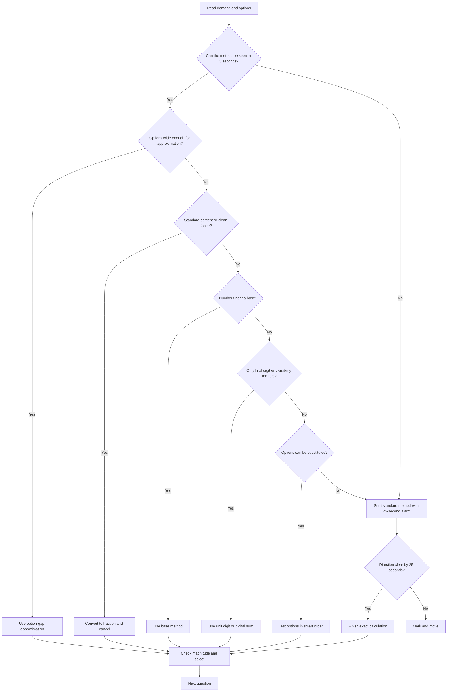

## Concept Ladder

Calculation speed is the operating system for SSC CGL Quant. It is not a small mental maths chapter. It decides whether algebra, trigonometry, mensuration, DI, percentage, ratio, and interest questions finish inside the 36-second Quant scoring bar. A 50/50 maths target needs two skills at the same time: exact arithmetic when options are close, and controlled approximation when the option-gap is wide.

### Level 1 - Recall Before Reasoning

Some values must be instant because rebuilding them during the paper wastes the section timer.

| Recall block | Minimum 50/50 standard | Use inside questions |
|---|---:|---|
| Squares | 1 to 30, plus 35, 40, 45, 50 | algebra identities, geometry, mensuration, DI |
| Cubes | 1 to 15 | volume, number system, simplification |
| Fractions | 1/2 to 1/20 as percent and decimal | percentage, SI-CI, DI, profit-loss |
| Tables | 13 to 19 | products, factor cancellation, divisor spotting |
| Complements | 100-a, 1000-a | base method, missing value, profit-loss |
| Unit digit cycles | 2, 3, 4, 7, 8, 9 | powers, remainders, answer elimination |
| Divisibility | 3, 4, 5, 6, 8, 9, 11 | factorisation, cancellation, exact division |

The repair rule is strict: if a question was slow because a table was not instant, the next session starts with that table, not with another mock.

### Level 2 - Method Before Calculation

The first five seconds matter more than the next thirty. A 36-second question is won when the method is chosen correctly:

- **Option-gap method** when answers are far apart.
- **Fraction conversion** when percent values are standard.
- **Cancellation** when numerator and denominator share factors.
- **Base method** when numbers sit near 10, 50, 100, 1000, or 10000.
- **Unit digit** when the final digit alone separates options.
- **Digital sum** when addition, subtraction, or multiplication needs a fast check.
- **Approximation** when exactness is not required by the option-gap.
- **Option testing** when the answer can be substituted into a condition faster than solving forward.

### Level 3 - Section-Level Discipline

Quant gives 25 questions in 15 minutes, so the average is 36 seconds per question. The winning pattern is not 36 seconds on every question. The target distribution is:

| Question type | Target time | Section role |
|---|---:|---|
| Table recall, unit digit, direct percent | 5-12 seconds | Creates buffer |
| Standard formula with one calculation | 15-25 seconds | Main scoring zone |
| DI or multi-step arithmetic | 25-36 seconds | Controlled calculation |
| Trap, long algebra, close DI options | Mark and return | Prevents time theft |

Never let one ugly calculation consume the time of three direct questions. A 50/50 maths attempt is built from ruthless time allocation, not hero calculation.

## Type System

### Corpus Pressure

The app corpus currently promotes **208 promoted questions** into the calculation-speed topic. This is enough to show the real pressure pattern: calculation speed appears as a separate arithmetic skill, but it also supports algebra, trigonometry, mensuration, number system, percentage, and DI.

| Corpus bucket | Promoted count | What it demands |
|---|---:|---|
| `ssc-maths-6800-mcq-p0041-p0060` | **79 promoted questions** | raw simplification, products, division, fraction-percent, option-gap judgement |
| `Algebra` | **50 promoted questions** | identity expansion, root sums, reciprocal expressions, substitution, factor testing |
| `Trigonometry` | **21 promoted questions** | exact values, fraction simplification, surd control, height-distance arithmetic |
| `Mensuration` | **18 promoted questions** | square, cube, surface area, volume, pi approximation, unit conversion |
| `Number System` | **5 promoted questions** | divisibility, remainders, LCM-HCF, digit tests |
| `ssc-maths-6800-mcq-p0101-p0120` | **5 promoted questions** | mixed calculation speed and option-driven simplification |

This page is written from that pressure map. The goal is not to learn generic tricks; the goal is to make the book-PYQ style arithmetic automatic enough that every connected Quant topic gets faster.

### First 5-Second Classification

Use this table before writing any calculation. It is the fastest way to protect the 36-second bar.

| First signal | Immediate decision | Why it works |
|---|---|---|
| Options differ by 20 percent or more | Approximate to the closest option | Exact calculation adds no marks |
| Options differ only in last digit | Use unit digit, parity, or divisibility | Full value is unnecessary |
| Percent is 12.5, 16.66, 20, 25, 33.33, 37.5, 62.5, 75, 83.33 | Convert to fraction | Fractions cancel faster than decimals |
| Numbers are near 100, 1000, or a clean base | Use base method | Cross-add beats long multiplication |
| Expression has a common factor | Cancel before multiplying | Smaller numbers reduce carry errors |
| Algebra answer is numeric | Test options or substitute | Reverse route is often shorter |
| DI has large values and wide options | Round by option-gap | Saves 15-20 seconds per set |
| Power asks last digit | Use unit digit cycle | Cycle length is smaller than exponent |
| Arithmetic answer must be checked | Use digital sum | Fast error filter |
| Nothing is obvious by 5 seconds | Start standard method with a 25-second alarm | Prevents freezing |

### Full Type Tree for 50/50

| Type | Recognition cue | Primary method | 36-second execution target | Common trap |
|---|---|---|---:|---|
| Base multiplication near 100 | 98 x 97, 103 x 98 | Base method | 8-15 sec | wrong placement of last two digits |
| Base square | 104^2, 997^2 | (base +/- a)^2 | 8-15 sec | missing 2ab term |
| Standard percent | 37.5% of 240 | fraction conversion | 5-12 sec | decimal shift error |
| Successive percent | +20%, -10% | multiplier method | 12-20 sec | adding percents directly |
| Division by composite | 2184/28 | split divisor into factors | 8-15 sec | dividing in poor factor order |
| Simplification bracket | mixed BODMAS | sign lock, cancel, compute | 15-25 sec | sign after bracket |
| Approximation | closest value asked | option-gap rounding | 5-15 sec | rounding both values same direction |
| Unit digit | last digit of a power/product | cycle or last-digit product | 5-10 sec | wrong cycle remainder |
| Digital sum | answer check | mod 9 digit sum | 5-12 sec | treating 9 as 9 instead of 0 in mod 9 |
| Weighted average | values with weights | total value / total weight | 12-20 sec | plain average instead of weighted |
| Ratio to value | x:y and total/average | k method | 12-20 sec | using wrong part |
| Time-work arithmetic | work rates | LCM total work | 18-30 sec | adding days instead of rates |
| TSD conversion | km/h to m/s | multiply by 5/18 | 5-12 sec | reverse conversion |
| SI-CI | rate and time | fraction rate method | 15-30 sec | year/month mismatch |
| Mensuration | area or volume | formula plus table recall | 18-36 sec | unit conversion after formula |
| Trigonometry value | sin, cos, tan standard angles | exact value table | 8-20 sec | mixing 30 and 60 values |
| Algebra identity | a+b, ab, a^2+b^2 | identity selection | 15-30 sec | expanding when identity is enough |
| Option substitution | answer candidates available | plug fastest candidate | 12-30 sec | testing options in poor order |
| DI row comparison | table/bar/pie chart | option-gap plus proportionality | 20-36 sec | exact total where ratio is enough |
| Missing number | equation with blank | reverse operation | 10-25 sec | order of operations |

## Speed Methods

### Method 1 - Option-Gap Rule

The option-gap rule prevents over-calculation.

1. Find the closest gap between any two options.
2. Estimate your maximum approximation error.
3. If the error is less than half the closest gap, approximate and stop.
4. If the error can cross two options, compute exactly.

Example: options are 220, 240, 260, 280 and the estimate is near 238. The closest option is 240 and the nearest gap is 20. If your rounding error is below 10, choose 240. If options are 238, 240, 242, 244, approximation is unsafe and exact calculation is required.

### Method 2 - Fraction-Percent Lock

| Percent | Fraction | Fast use |
|---:|---:|---|
| 4% | 1/25 | divide by 100, multiply by 4, or divide by 25 |
| 5% | 1/20 | divide by 20 |
| 6.25% | 1/16 | divide by 16 |
| 8.33% | 1/12 | divide by 12 |
| 10% | 1/10 | decimal shift |
| 12.5% | 1/8 | divide by 8 |
| 16.66% | 1/6 | divide by 6 |
| 20% | 1/5 | divide by 5 |
| 25% | 1/4 | divide by 4 |
| 33.33% | 1/3 | divide by 3 |
| 37.5% | 3/8 | divide by 8, multiply by 3 |
| 40% | 2/5 | divide by 5, multiply by 2 |
| 62.5% | 5/8 | divide by 8, multiply by 5 |
| 66.66% | 2/3 | divide by 3, multiply by 2 |
| 75% | 3/4 | divide by 4, multiply by 3 |
| 83.33% | 5/6 | divide by 6, multiply by 5 |
| 87.5% | 7/8 | divide by 8, multiply by 7 |

Do not convert standard percentages into decimal multiplication unless the number is already decimal-friendly.

### Method 3 - Base Method

For numbers near 100:

- 98 x 97 = (100 - 2)(100 - 3)
- Left part: 98 - 3 = 95
- Right part: 2 x 3 = 6, written as 06
- Answer: 9506

For one number above and one below:

- 103 x 98 = (100 + 3)(100 - 2)
- Left part: 103 - 2 = 101
- Right part: 3 x -2 = -6
- Answer: 10100 - 6 = 10094

For numbers near 1000, keep three right-side digits. For 997 x 1003, left part is 1000 and right part is -9, so answer is 999991.

### Method 4 - Cancellation Before Multiplication

The rule is: never multiply two large numbers if a factor can be cancelled first.

Example: `(24 x 35 x 18) / (42 x 15)`

- Cancel 24/42 = 4/7.
- Cancel 35/15 = 7/3.
- Now expression becomes `(4 x 7 x 18) / (7 x 3)`.
- Cancel 7 and divide 18/3 = 6.
- Answer = 4 x 6 = 24.

This style is essential in ratio, percentage, trigonometry, mensuration, time-work, and DI.

### Method 5 - Unit Digit

Unit digit cycles:

| Base digit | Cycle |
|---:|---|
| 0 | 0 |
| 1 | 1 |
| 2 | 2, 4, 8, 6 |
| 3 | 3, 9, 7, 1 |
| 4 | 4, 6 |
| 5 | 5 |
| 6 | 6 |
| 7 | 7, 9, 3, 1 |
| 8 | 8, 4, 2, 6 |
| 9 | 9, 1 |

If exponent remainder is 0, use the last value in the cycle. For 7^85, 85 mod 4 = 1, so unit digit is 7.

### Method 6 - Digital Sum

Digital sum is a check, not a replacement for all arithmetic. It works best for addition, subtraction, multiplication, and option elimination.

- Replace each number by its digit sum mod 9.
- For addition/subtraction, combine the digit sums.
- For multiplication, multiply the digit sums.
- Match against option digit sums.

If more than one option has the same digital sum, continue calculation. Digital sum is a filter, not a final proof in every question.

### Method 7 - 36-Second Written Route

Use this when no shortcut is visible:

| Time | Action |
|---:|---|
| 0-5 sec | Read demand, scan options, mark the unit |
| 6-12 sec | Select method: exact, approximation, option test, formula |
| 13-25 sec | Execute the main calculation |
| 26-31 sec | Check unit digit, digital sum, sign, unit, or magnitude |
| 32-36 sec | Select, mark, or skip |

If the method is unclear by 25 seconds, mark the question and move. The 200/200 attempt depends on preserving the rest of the section.

## Trap Table

| Trap | Trigger wording | Wrong move | Correct move | Repair drill |
|---|---|---|---|---|
| Wrong base in percentage | "x percent more than" or "less than" | use final value as base automatically | identify original base first | 30 base-identification questions |
| Decimal shift error | 12.5%, 6.25%, 0.4% | move decimal without fraction | convert to 1/8, 1/16, 1/250 | fraction flash drill |
| Right part width in base method | 98 x 97, 1003 x 997 | write 956 instead of 9506 | right part has two digits for base 100, three for base 1000 | 40 base products |
| Negative right part | 103 x 98 | write 10106 | compute 10100 - 6 | mixed above-below base drill |
| Over-rounding | both numbers rounded up | answer crosses option-gap | round one up and one down when possible | 25 approximation comparisons |
| Exactness addiction | wide options | full long multiplication | use option-gap rule | DI option-gap set |
| Unit mismatch | km/h and m/s | compare different units | convert before formula | 20 unit conversion questions |
| Month-year mismatch | interest for months | use annual time directly | convert months to years or periods | SI-CI mixed drill |
| Average weight error | weighted values | simple average | total weighted value / total weight | 25 weighted average items |
| Sign leak | bracket simplification | drop negative sign | rewrite sign before solving | 20 BODMAS sign items |
| Option neglect | answer can be plugged | solve long equation | test central or easy option first | 30 substitution questions |
| Digital sum overuse | two options share digit sum | select too early | use digital sum only for elimination | paired option drill |
| Unit digit cycle error | exponent multiple of cycle | treat remainder 0 as first term | use last cycle value | 50 power unit digit items |
| Carry leak | large addition | carry twice or skip carry | chunk into hundreds or thousands | column arithmetic sprint |
| Pi approximation error | mensuration options close | use 22/7 blindly | choose 22/7 or 3.14 by divisibility and option-gap | circle formula drill |
| Formula-first delay | DI chart | write all totals first | read the demanded comparison first | DI demand-first drill |

## Flowchart

## Solved Examples

**Example 1**  
Find 98 x 97.  
Options: A) 9406 B) 9506 C) 9606 D) 9706  
Solution: Base 100. Differences are -2 and -3. Left part = 98 - 3 = 95. Right part = 2 x 3 = 06. Answer = 9506.  
36-second route: 5 seconds scan, 8 seconds base method, 3 seconds unit digit check. Answer: B.

**Example 2**  
Find 103 x 98.  
Options: A) 10084 B) 10094 C) 10104 D) 10114  
Solution: Base 100. Differences are +3 and -2. Left part = 103 - 2 = 101. Right part = 3 x -2 = -6. So 10100 - 6 = 10094.  
36-second route: negative right part is the trap. Answer: B.

**Example 3**  
What is 37.5% of 240?  
Options: A) 80 B) 90 C) 96 D) 100  
Solution: 37.5% = 3/8. Then 240 x 3/8 = 30 x 3 = 90.  
36-second route: fraction recall makes this a 10-second question. Answer: B.

**Example 4**  
What is 12.5% of 640?  
Options: A) 64 B) 72 C) 80 D) 96  
Solution: 12.5% = 1/8. Then 640/8 = 80.  
36-second route: do not use decimal multiplication here. Answer: C.

**Example 5**  
What is 83.33% of 72?  
Options: A) 48 B) 54 C) 60 D) 66  
Solution: 83.33% = 5/6. Then 72 x 5/6 = 12 x 5 = 60.  
36-second route: percent-to-fraction and cancel. Answer: C.

**Example 6**  
Simplify 2184/28.  
Options: A) 72 B) 76 C) 78 D) 82  
Solution: 28 = 4 x 7. First 2184/4 = 546. Then 546/7 = 78.  
36-second route: split divisor instead of long division. Answer: C.

**Example 7**  
Find the unit digit of 7^85.  
Options: A) 1 B) 3 C) 7 D) 9  
Solution: Cycle for 7 is 7, 9, 3, 1. Since 85 mod 4 = 1, unit digit is 7.  
36-second route: cycle only. Answer: C.

**Example 8**  
Find 876 + 345 - 212.  
Options: A) 1009 B) 1011 C) 1013 D) 1015  
Solution: Direct: 876 + 345 = 1221; 1221 - 212 = 1009. Digital sum check: 876 -> 3, 345 -> 3, total 6; 212 -> 5; result should be 1 mod 9. 1009 -> 1.  
36-second route: exact plus digital sum check. Answer: A.

**Example 9**  
Average of 10 and 20 with weights 1 and 3 is what?  
Options: A) 15 B) 16.5 C) 17.5 D) 18  
Solution: Weighted average = (10 x 1 + 20 x 3) / 4 = 70/4 = 17.5.  
36-second route: never use plain average when weights appear. Answer: C.

**Example 10**  
A completes work in 12 days and B in 18 days. Together they finish in how many days?  
Options: A) 6.8 B) 7.2 C) 8 D) 9  
Solution: LCM = 36. A efficiency = 3, B efficiency = 2, combined = 5. Time = 36/5 = 7.2 days.  
36-second route: LCM work units. Answer: B.

**Example 11**  
The ratio x:y is 2:3 and their average is 30. Find x.  
Options: A) 20 B) 24 C) 30 D) 36  
Solution: x = 2k, y = 3k. Average = 5k/2 = 30, so k = 12 and x = 24.  
36-second route: ratio to average. Answer: B.

**Example 12**  
The sum of two numbers is 50 and their product is 600. Find the larger number.  
Options: A) 20 B) 25 C) 30 D) 35  
Solution: Test 30. Other number = 20 and product = 600.  
36-second route: option testing beats quadratic formation. Answer: C.

**Example 13**  
Which value is closest to 29.7 x 31.2?  
Options: A) 850 B) 900 C) 930 D) 980  
Solution: 29.7 is near 30 and 31.2 is near 31. So product is near 930. Exact is not required by the option-gap.  
36-second route: option-gap approximation. Answer: C.

**Example 14**  
Find 45^2.  
Options: A) 1925 B) 2025 C) 2125 D) 2225  
Solution: 45^2 = (40 + 5)^2 = 1600 + 400 + 25 = 2025.  
36-second route: table recall or identity. Answer: B.

**Example 15**  
Find 997 x 1003.  
Options: A) 999991 B) 999999 C) 1000991 D) 1009991  
Solution: This is (1000 - 3)(1000 + 3) = 1000000 - 9 = 999991.  
36-second route: difference of squares. Answer: A.

**Example 16**  
Find 72% of 1250.  
Options: A) 850 B) 875 C) 900 D) 925  
Solution: 72% = 18/25. Since 1250/25 = 50, answer = 50 x 18 = 900.  
36-second route: convert 1250 base to /25. Answer: C.

**Example 17**  
Find 16.66% of 540.  
Options: A) 80 B) 90 C) 100 D) 108  
Solution: 16.66% = 1/6. Then 540/6 = 90.  
36-second route: fraction recall. Answer: B.

**Example 18**  
Find 6.25% of 960.  
Options: A) 50 B) 60 C) 64 D) 72  
Solution: 6.25% = 1/16. Then 960/16 = 60.  
36-second route: divide by 8 then 2 if needed. Answer: B.

**Example 19**  
Find 104^2.  
Options: A) 10616 B) 10816 C) 11016 D) 11216  
Solution: (100 + 4)^2 = 10000 + 800 + 16 = 10816.  
36-second route: base square. Answer: B.

**Example 20**  
Find 999^2.  
Options: A) 998001 B) 998101 C) 999001 D) 999101  
Solution: (1000 - 1)^2 = 1000000 - 2000 + 1 = 998001.  
36-second route: base square near 1000. Answer: A.

**Example 21**  
Find 35% of 680.  
Options: A) 228 B) 238 C) 248 D) 258  
Solution: 35% = 7/20. Then 680/20 = 34 and 34 x 7 = 238.  
36-second route: fraction route is cleaner than decimal multiplication. Answer: B.

**Example 22**  
Convert 72 km/h into m/s.  
Options: A) 15 B) 18 C) 20 D) 24  
Solution: km/h to m/s means multiply by 5/18. 72 x 5/18 = 4 x 5 = 20.  
36-second route: cancel before multiplying. Answer: C.

**Example 23**  
Simple interest on Rs. 5000 at 12% per annum for 9 months is what?  
Options: A) 400 B) 450 C) 500 D) 540  
Solution: 9 months = 3/4 year. SI = 5000 x 12 x 3 / (100 x 4) = 50 x 9 = 450.  
36-second route: convert months before formula. Answer: B.

**Example 24**  
Compound interest on Rs. 10000 at 10% for 2 years is what?  
Options: A) 2000 B) 2100 C) 2200 D) 2300  
Solution: Amount multiplier = 1.1 x 1.1 = 1.21. CI = 21% of 10000 = 2100.  
36-second route: effective rate 21%. Answer: B.

**Example 25**  
A DI table total is approximately 7980 and the required percentage is 24.8%. Which answer is closest?  
Options: A) 1600 B) 1800 C) 1980 D) 2400  
Solution: 7980 is near 8000 and 24.8% is near 25%. One-fourth of 8000 is 2000, closest to 1980.  
36-second route: wide option-gap means no exact multiplication. Answer: C.

**Example 26**  
Simplify `(24 x 35 x 18)/(42 x 15)`.  
Options: A) 18 B) 20 C) 24 D) 28  
Solution: 24/42 = 4/7 and 35/15 = 7/3. Then `(4 x 7 x 18)/(7 x 3)` = 4 x 6 = 24.  
36-second route: cancellation first. Answer: C.

**Example 27**  
Find the last digit of 3^42.  
Options: A) 1 B) 3 C) 7 D) 9  
Solution: Cycle for 3 is 3, 9, 7, 1. Since 42 mod 4 = 2, unit digit is 9.  
36-second route: exponent remainder. Answer: D.

**Example 28**  
If a + b = 13 and ab = 40, find a^2 + b^2.  
Options: A) 89 B) 99 C) 109 D) 119  
Solution: a^2 + b^2 = (a + b)^2 - 2ab = 169 - 80 = 89.  
36-second route: identity, no root finding. Answer: A.

**Example 29**  
Find 62.5% of 448.  
Options: A) 260 B) 270 C) 280 D) 290  
Solution: 62.5% = 5/8. Then 448/8 = 56 and 56 x 5 = 280.  
36-second route: standard fraction. Answer: C.

**Example 30**  
Which is closest to 502 x 198?  
Options: A) 89000 B) 99400 C) 105000 D) 112000  
Solution: 502 is near 500 and 198 is near 200. Product is near 100000. Exact value is 99396, so closest is 99400.  
36-second route: estimate first, exact only if needed. Answer: B.

## PYQ Mapping

Book-PYQ based practice in the app should be used as a timed repair loop, not as passive reading.

| App route | How to use it | What to tag after attempt |
|---|---|---|
| `/exams/ssc-cgl/topics/calculation-speed` | Read this note, then open the linked drill queue | method hesitation, arithmetic slip, skip failure |
| `/exams/ssc-cgl/tests/ssc-cgl-topic-calculation-speed-36-second-drill` | Run a strict 36-second per question sprint | fraction, cancellation, option-gap, base method |
| `/exams/ssc-cgl/tests/ssc-cgl-quant-50-50-set-01` | Apply calculation speed across all Quant topics | exactness addiction, unit mismatch, carry leak |
| Full mocks under `/exams/ssc-cgl/tests` | Check section-level pacing | solved under 15 sec, solved 15-36 sec, marked and returned |

Expected recurring PYQ-style forms:

- Raw simplification from `ssc-maths-6800-mcq-p0041-p0060`: BODMAS, products, division, fractions.
- Algebra speed from `Algebra`: identity selection, reciprocal expressions, substitution, option testing.
- Trigonometry speed from `Trigonometry`: standard angles, exact fraction values, surd simplification.
- Mensuration speed from `Mensuration`: square/cube recall, area-volume formula arithmetic, pi choice.
- Number system speed from `Number System`: divisibility, remainders, unit digit, digital sum.

After every wrong question, write one tag: **method**, **recall**, **carry**, **unit**, **option-gap**, **skip**, or **concept**. Do not write long notes for arithmetic mistakes. Use the tag to choose the next repair drill.

## 200/200 Drill

### Daily 18-Minute Calculation Block

| Minute | Drill | Target |
|---:|---|---|
| 0-3 | squares, cubes, fraction-percent flash | instant recall |
| 3-6 | base multiplication and base squares | no carry confusion |
| 6-9 | cancellation fractions | reduce before multiply |
| 9-12 | unit digit and digital sum | fast elimination |
| 12-15 | option-gap approximation | stop over-calculating |
| 15-18 | five mixed PYQ-style questions | under 36 seconds each |

### 36-Second Drill Rules

1. Start timer before reading the question.
2. Speak the method label in your head: fraction, cancellation, option-gap, base method, unit digit, digital sum, formula, option test.
3. If no method appears by 5 seconds, use the standard written route.
4. If no answer direction appears by 25 seconds, mark and move.
5. After the set, tag every miss with one repair label.

### Repair Sets

| Error tag | Repair set |
|---|---|
| fraction | 100 standard percent conversions, then 50 applied questions |
| cancellation | 60 fraction simplification items with no calculator |
| option-gap | 50 DI and percentage items where exact arithmetic is banned unless options are close |
| base method | 100 products near 100 and 1000 |
| unit digit | 80 power and product unit-digit items |
| digital sum | 50 addition, subtraction, multiplication checks |
| carry | 10 minutes of column arithmetic, then redo the missed questions |
| skip | repeat the same set with forced 25-second abandon rule |

### Quant 50/50 Last-Mile Protocol

Use this section timing for every full Quant section:

| Pass | Time | Target |
|---|---:|---|
| Pass 1 | 0:00-7:30 | finish direct percent, ratio, algebra identity, unit digit, basic geometry, direct formula |
| Pass 2 | 7:30-12:30 | DI, multi-step word problems, close-option arithmetic |
| Pass 3 | 12:30-14:20 | return only to marked questions with a known method |
| Lock check | 14:20-15:00 | verify units, signs, decimal places, and marked answers |

The target is 25 attempted with confidence. If two questions are traps, the section is still recoverable only if the remaining 23 are not slowed by them. This is why calculation speed is a scoring system, not a collection of tricks.

### Weekly Mastery Target

| Metric | 50/50 standard |
|---|---:|
| Fraction-percent recall | 100% within 3 seconds each |
| Base products near 100 | 95%+ accuracy under 15 seconds |
| Unit digit questions | 95%+ accuracy under 10 seconds |
| Digital sum checks | 95%+ accuracy under 12 seconds |
| Option-gap approximation | 90%+ accuracy under 15 seconds |
| Mixed calculation-speed drill | 90%+ accuracy under 30 seconds average |
| Full Quant section | 48+ marks before attempting riskier questions |

When this page is mastered, calculation speed should stop feeling like a separate topic. It becomes the default lens for every Quant question in the SSC CGL Tier-I paper.
<!-- SSC-FINAL-PRACTICE-QUEUE:START -->
## Final Practice Queue

1. Start one-by-one practice: [Calculation Speed and Approximation practice](/exams/ssc-cgl/practice/calculation-speed). Finish every question in this topic bank, not just the samples in the note.
2. Move to timed sets: [SSC CGL tests](/exams/ssc-cgl/tests?topic=calculation-speed). Use topic drills first, then section mocks once accuracy is stable.
3. Repair every miss immediately: record the error label, redo 20 mixed questions from the same topic, then retest after 24 hours.
4. 200/200 rule: do not mark this topic exam-ready until correct answers come within 36 seconds and wrong answers are explained without looking at the solution.

<!-- SSC-FINAL-PRACTICE-QUEUE:END -->
